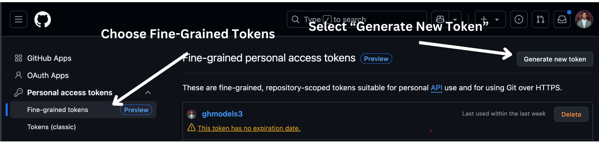

<!--
CO_OP_TRANSLATOR_METADATA:
{
  "original_hash": "c729f7442eb5afd55b5522e3ad65c822",
  "translation_date": "2025-06-05T14:51:07+00:00",
  "source_file": "00-course-setup/README.md",
  "language_code": "fr"
}
-->
Vous devriez maintenant avoir votre propre version forkée de ce cours à l'adresse suivante :


## Exécution du Code

Ce cours propose une série de notebooks Jupyter que vous pouvez exécuter pour acquérir une expérience pratique dans la création d'agents IA.

Les exemples de code utilisent soit :

**Nécessite un compte GitHub - Gratuit** :

1) Semantic Kernel Agent Framework + GitHub Models Marketplace. Étiqueté comme (semantic-kernel.ipynb)
2) AutoGen Framework + GitHub Models Marketplace. Étiqueté comme (autogen.ipynb)

**Nécessite un abonnement Azure** :
3) Azure AI Foundry + Azure AI Agent Service. Étiqueté comme (azureaiagent.ipynb)

Nous vous encourageons à essayer les trois types d’exemples pour voir celui qui vous convient le mieux.

Quelle que soit l’option choisie, cela déterminera les étapes d’installation que vous devrez suivre ci-dessous :

## Prérequis

- Python 3.12+
- Un compte GitHub - Pour accéder au GitHub Models Marketplace
- Un abonnement Azure - Pour accéder à Azure AI Foundry
- Un compte Azure AI Foundry - Pour accéder au service Azure AI Agent

Nous avons inclus un fichier `requirements.txt` à la racine de ce dépôt contenant tous les packages Python nécessaires pour exécuter les exemples de code.

Vous pouvez les installer en exécutant la commande suivante dans votre terminal à la racine du dépôt :

```bash
pip install -r requirements.txt
```

Nous recommandons de créer un environnement virtuel Python pour éviter tout conflit ou problème.

## Configuration pour les exemples utilisant GitHub Models

### Étape 1 : Récupérer votre jeton d’accès personnel GitHub (PAT)

Actuellement, ce cours utilise le GitHub Models Marketplace pour offrir un accès gratuit à des modèles de langage de grande taille (LLM) qui seront utilisés pour créer des agents IA.

Pour accéder à ce service, vous devez créer un jeton d’accès personnel GitHub.

Cela peut être fait en vous rendant dans votre compte GitHub.

Sélectionnez `Fine-grained tokens` option on the left side of your screen.

Then select `Generate new token`.



You will be prompted to enter a name for your token, select the expiration date (Recommended: 30 Days), and select the scopes for your token (Public Repositories).

It's also necessary to edit the permissions of this token: Permissions -> Models -> Allows access to GitHub Models

Copy your new token that you have just created. You will now add this to your `.env` file included in this course. 


### Step 2: Create Your `.env` File

To create your `.env` et exécutez la commande suivante dans votre terminal.

```bash
cp .env.example .env
```

Cela copiera le fichier d’exemple et créera un fichier `.env` in your directory and where you fill in the values for the environment variables.

With your token copied, open the `.env` file in your favorite text editor and paste your token into the `GITHUB_TOKEN` field.

You should now be able to run the code samples of this course.

## Set Up for Samples using Azure AI Foundry and Azure AI Agent Service

### Step 1: Retrieve Your Azure Project Connection String


Follow the steps to creating a hub and project in Azure AI Foundry found here: [Hub resources overview](https://learn.microsoft.com/en-us/azure/ai-foundry/concepts/ai-resources)


Once you have created your project, you will need to retrieve the connection string for your project.

This can be done by going to the **Overview** page of your project in the Azure AI Foundry portal.


### Step 2: Create Your `.env` File

To create your `.env` ; exécutez la commande suivante dans votre terminal.

```bash
cp .env.example .env
```

Cela copiera le fichier d’exemple et créera un fichier `.env` in your directory and where you fill in the values for the environment variables.

With your token copied, open the `.env` file in your favorite text editor and paste your token into the `PROJECT_CONNECTION_STRING` field.

### Step 3: Sign in to Azure

As a security best practice, we'll use [keyless authentication](https://learn.microsoft.com/azure/developer/ai/keyless-connections?tabs=csharp%2Cazure-cli?WT.mc_id=academic-105485-koreyst) to authenticate to Azure OpenAI with Microsoft Entra ID. Before you can do so, you'll first need to install the **Azure CLI** per the [installation instructions](https://learn.microsoft.com/cli/azure/install-azure-cli?WT.mc_id=academic-105485-koreyst) for your operating system.

Next, open a terminal and run `az login --use-device-code` to sign in to your Azure account.

Once you've logged in, select your subscription in the terminal.


## Additional Environment Variables - Azure Search and Azure OpenAI 

For the Agentic RAG Lesson - Lesson 5 - there are samples that use Azure Search and Azure OpenAI.

If you want to run these samples, you will need to add the following environment variables to your `.env` file:

### Overview Page (Project)

- `AZURE_SUBSCRIPTION_ID` - Check **Project details** on the **Overview** page of your project.

- `AZURE_AI_PROJECT_NAME` - Look at the top of the **Overview** page for your project.

- `AZURE_OPENAI_SERVICE` - Find this in the **Included capabilities** tab for **Azure OpenAI Service** on the **Overview** page.

### Management Center

- `AZURE_OPENAI_RESOURCE_GROUP` - Go to **Project properties** on the **Overview** page of the **Management Center**.

- `GLOBAL_LLM_SERVICE` - Under **Connected resources**, find the **Azure AI Services** connection name. If not listed, check the **Azure portal** under your resource group for the AI Services resource name.

### Models + Endpoints Page

- `AZURE_OPENAI_EMBEDDING_DEPLOYMENT_NAME` - Select your embedding model (e.g., `text-embedding-ada-002`) and note the **Deployment name** from the model details.

- `AZURE_OPENAI_CHAT_DEPLOYMENT_NAME` - Select your chat model (e.g., `gpt-4o-mini`) and note the **Deployment name** from the model details.

### Azure Portal

- `AZURE_OPENAI_ENDPOINT` - Look for **Azure AI services**, click on it, then go to **Resource Management**, **Keys and Endpoint**, scroll down to the "Azure OpenAI endpoints", and copy the one that says "Language APIs".

- `AZURE_OPENAI_API_KEY` - From the same screen, copy KEY 1 or KEY 2.

- `AZURE_SEARCH_SERVICE_ENDPOINT` - Find your **Azure AI Search** resource, click it, and see **Overview**.

- `AZURE_SEARCH_API_KEY` - Then go to **Settings** and then **Keys** to copy the primary or secondary admin key.

### External Webpage

- `AZURE_OPENAI_API_VERSION` - Visit the [API version lifecycle](https://learn.microsoft.com/en-us/azure/ai-services/openai/api-version-deprecation#latest-ga-api-release) page under **Latest GA API release**.

### Setup keyless authentication

Rather than hardcode your credentials, we'll use a keyless connection with Azure OpenAI. To do so, we'll import `DefaultAzureCredential` and later call the `DefaultAzureCredential` pour obtenir les informations d’identification.

```python
from azure.identity import DefaultAzureCredential, InteractiveBrowserCredential
```

## Bloqué quelque part ?

Si vous rencontrez des problèmes lors de cette configuration, rejoignez notre

ou

.

## Leçon suivante

Vous êtes maintenant prêt à exécuter le code de ce cours. Bonne découverte du monde des agents IA !

[Introduction aux agents IA et cas d’utilisation des agents](../01-intro-to-ai-agents/README.md)

**Avertissement** :  
Ce document a été traduit à l’aide du service de traduction automatique [Co-op Translator](https://github.com/Azure/co-op-translator). Bien que nous nous efforcions d’assurer l’exactitude, veuillez noter que les traductions automatiques peuvent contenir des erreurs ou des inexactitudes. Le document original dans sa langue d’origine doit être considéré comme la source faisant foi. Pour les informations critiques, il est recommandé de recourir à une traduction professionnelle réalisée par un humain. Nous déclinons toute responsabilité en cas de malentendus ou de mauvaises interprétations résultant de l’utilisation de cette traduction.