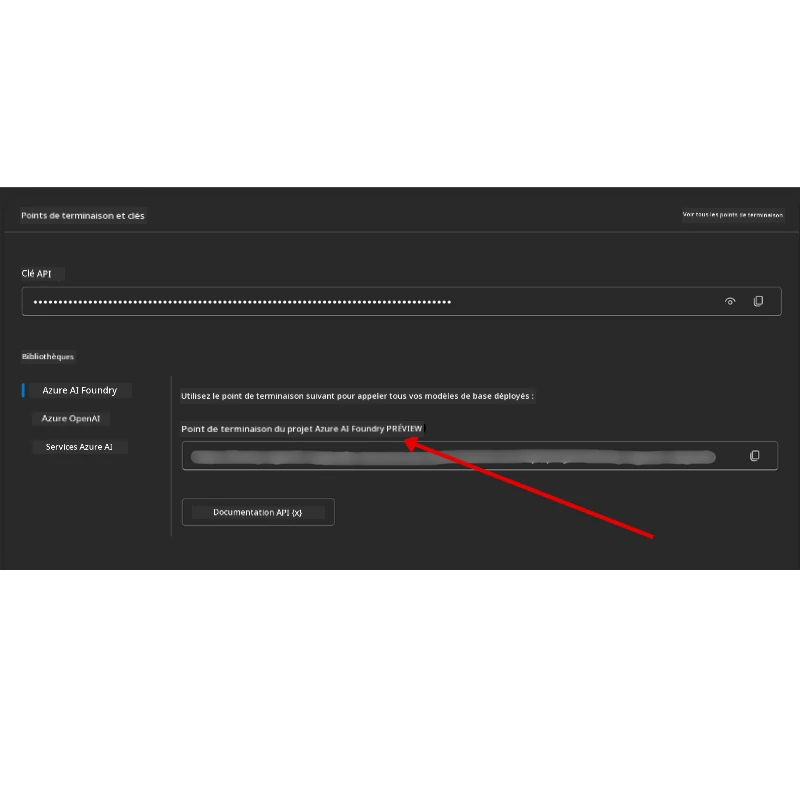

# Configuration du cours

## Introduction

Cette leçon expliquera comment exécuter les exemples de code de ce cours.

## Rejoignez d'autres apprenants et obtenez de l'aide

Avant de commencer à cloner votre dépôt, rejoignez le [canal Discord AI Agents For Beginners](https://aka.ms/ai-agents/discord) pour obtenir de l'aide sur la configuration, poser des questions sur le cours ou pour vous connecter avec d'autres apprenants.

## Cloner ou forker ce dépôt

Pour commencer, veuillez cloner ou forker le dépôt GitHub. Ceci vous permettra d'avoir votre propre version du matériel du cours afin que vous puissiez exécuter, tester et modifier le code !

Cela peut être fait en cliquant sur le lien pour <a href="https://github.com/microsoft/ai-agents-for-beginners/fork" target="_blank">forker le dépôt</a>

Vous devriez maintenant avoir votre propre version forkée de ce cours dans le lien suivant :


### Clone superficiel (recommandé pour atelier / Codespaces)

  >Le dépôt complet peut être volumineux (~3 Go) lorsque vous téléchargez tout l'historique et tous les fichiers. Si vous ne participez qu'à l'atelier ou si vous n'avez besoin que de quelques dossiers de leçon, un clone superficiel (ou un clone clairsemé) évite la majeure partie de ce téléchargement en tronquant l'historique et/ou en sautant les blobs.

#### Clone superficiel rapide — historique minimal, tous les fichiers

Remplacez `<your-username>` dans les commandes ci-dessous par l'URL de votre fork (ou l'URL en amont si vous préférez).

Pour cloner uniquement l'historique du dernier commit (petit téléchargement) :

```bash|powershell
git clone --depth 1 https://github.com/<your-username>/ai-agents-for-beginners.git
```

Pour cloner une branche spécifique :

```bash|powershell
git clone --depth 1 --branch <branch-name> https://github.com/<your-username>/ai-agents-for-beginners.git
```

#### Clone partiel (clairsemé) — blobs minimaux + seuls dossiers sélectionnés

Cela utilise le clone partiel et sparse-checkout (nécessite Git 2.25+ et Git moderne recommandé avec support du clone partiel) :

```bash|powershell
git clone --depth 1 --filter=blob:none --sparse https://github.com/<your-username>/ai-agents-for-beginners.git
```

Accédez au dossier du dépôt :

```bash|powershell
cd ai-agents-for-beginners
```

Puis spécifiez les dossiers que vous souhaitez (exemple ci-dessous avec deux dossiers) :

```bash|powershell
git sparse-checkout set 00-course-setup 01-intro-to-ai-agents
```

Après le clonage et vérification des fichiers, si vous avez seulement besoin des fichiers et souhaitez libérer de l'espace (pas d'historique git), veuillez supprimer les métadonnées du dépôt (💀 irréversible — vous perdrez toute fonctionnalité Git : aucun commit, pull, push ou accès à l’historique).

```bash
# zsh/bash
rm -rf .git
```

```powershell
# PowerShell
Remove-Item -Recurse -Force .git
```

#### Utilisation de GitHub Codespaces (recommandé pour éviter les gros téléchargements locaux)

- Créez un nouveau Codespace pour ce dépôt via l’[interface GitHub](https://github.com/codespaces).  

- Dans le terminal du Codespace nouvellement créé, exécutez une des commandes de clone superficiel/clairsemé ci-dessus pour ne charger que les dossiers de leçon dont vous avez besoin dans l’espace de travail Codespace.
- Optionnel : après le clonage dans Codespaces, supprimez .git pour récupérer de l’espace supplémentaire (voir commandes de suppression ci-dessus).
- Remarque : Si vous préférez ouvrir directement le dépôt dans Codespaces (sans un clone additionnel), sachez que Codespaces va construire l’environnement devcontainer et peut encore provisionner plus que nécessaire. Cloner une copie superficielle dans un Codespace frais vous donne plus de contrôle sur l’utilisation du disque.

#### Astuces

- Remplacez toujours l’URL de clonage par votre fork si vous souhaitez éditer / committer.
- Si vous avez besoin plus tard de plus d’historique ou de fichiers, vous pouvez les récupérer ou ajuster sparse-checkout pour inclure des dossiers supplémentaires.

## Exécution du code

Ce cours propose une série de notebooks Jupyter que vous pouvez exécuter pour acquérir une expérience pratique de la création d'Agents IA.

Les exemples de code utilisent **Microsoft Agent Framework (MAF)** avec le `AzureAIProjectAgentProvider`, qui se connecte à **Azure AI Agent Service V2** (l’API Responses) via **Microsoft Foundry**.

Tous les notebooks Python sont nommés `*-python-agent-framework.ipynb`.

## Prérequis

- Python 3.12+
  - **NOTE** : Si vous n’avez pas Python3.12 installé, assurez-vous de l’installer. Puis créez votre environnement virtuel en utilisant python3.12 pour garantir que les bonnes versions sont installées à partir du fichier requirements.txt.
  
    >Exemple

    Créez le répertoire de l’environnement virtuel Python :

    ```bash|powershell
    python -m venv venv
    ```

    Puis activez l’environnement virtuel pour :

    ```bash
    # zsh/bash
    source venv/bin/activate
    ```
  
    ```dos
    # Command Prompt for Windows
    venv\Scripts\activate
    ```

- .NET 10+ : Pour les exemples utilisant .NET, assurez-vous d’installer le [.NET 10 SDK](https://dotnet.microsoft.com/download/dotnet/10.0) ou une version ultérieure. Ensuite, vérifiez la version du SDK .NET installée :

    ```bash|powershell
    dotnet --list-sdks
    ```

- **Azure CLI** — Requis pour l’authentification. Installez-le depuis [aka.ms/installazurecli](https://aka.ms/installazurecli).
- **Abonnement Azure** — Pour accéder à Microsoft Foundry et au service Azure AI Agent.
- **Projet Microsoft Foundry** — Un projet avec un modèle déployé (par exemple, `gpt-4o`). Voir [Étape 1](../../../00-course-setup) ci-dessous.

Nous avons inclus un fichier `requirements.txt` à la racine de ce dépôt qui contient toutes les bibliothèques Python nécessaires pour exécuter les exemples de code.

Vous pouvez les installer en lançant la commande suivante dans votre terminal à la racine du dépôt :

```bash|powershell
pip install -r requirements.txt
```

Nous recommandons de créer un environnement virtuel Python pour éviter tout conflit et problème.

## Configuration de VSCode

Assurez-vous d’utiliser la bonne version de Python dans VSCode.


## Configurer Microsoft Foundry et Azure AI Agent Service

### Étape 1 : Créer un projet Microsoft Foundry

Vous avez besoin d’un **hub** et d’un **projet** Azure AI Foundry avec un modèle déployé pour exécuter les notebooks.

1. Rendez-vous sur [ai.azure.com](https://ai.azure.com) et connectez-vous avec votre compte Azure.
2. Créez un **hub** (ou utilisez-en un existant). Voir : [Présentation des ressources Hub](https://learn.microsoft.com/azure/ai-foundry/concepts/ai-resources).
3. À l’intérieur du hub, créez un **projet**.
4. Déployez un modèle (par exemple, `gpt-4o`) depuis **Modèles + Points de terminaison** → **Déployer modèle**.

### Étape 2 : Récupérez le point de terminaison de votre projet et le nom du déploiement du modèle

Depuis votre projet dans le portail Microsoft Foundry :

- **Point de terminaison du projet** — Allez sur la page **Aperçu** et copiez l’URL du point de terminaison.



- **Nom du déploiement du modèle** — Allez dans **Modèles + Points de terminaison**, sélectionnez votre modèle déployé, et notez le **Nom du déploiement** (par exemple, `gpt-4o`).

### Étape 3 : Connectez-vous à Azure avec `az login`

Tous les notebooks utilisent **`AzureCliCredential`** pour l’authentification — pas de gestion de clés API. Cela nécessite d’être connecté via Azure CLI.

1. **Installez Azure CLI** si ce n’est pas déjà fait : [aka.ms/installazurecli](https://aka.ms/installazurecli)

2. **Connectez-vous** en lançant :

    ```bash|powershell
    az login
    ```

    Ou si vous êtes dans un environnement distant/Codespace sans navigateur :

    ```bash|powershell
    az login --use-device-code
    ```

3. **Sélectionnez votre abonnement** si demandé — choisissez celui contenant votre projet Foundry.

4. **Vérifiez** que vous êtes connecté :

    ```bash|powershell
    az account show
    ```

> **Pourquoi `az login` ?** Les notebooks s’authentifient avec `AzureCliCredential` du package `azure-identity`. Cela signifie que votre session Azure CLI fournit les identifiants — pas de clés API ou secrets dans votre fichier `.env`. C’est une [meilleure pratique de sécurité](https://learn.microsoft.com/azure/developer/ai/keyless-connections).

### Étape 4 : Créez votre fichier `.env`

Copiez le fichier exemple :

```bash
# zsh/bash
cp .env.example .env
```

```powershell
# PowerShell
Copy-Item .env.example .env
```

Ouvrez `.env` et remplissez ces deux valeurs :

```env
AZURE_AI_PROJECT_ENDPOINT=https://<your-project>.services.ai.azure.com/api/projects/<your-project-id>
AZURE_AI_MODEL_DEPLOYMENT_NAME=gpt-4o
```

| Variable | Où la trouver |
|----------|-----------------|
| `AZURE_AI_PROJECT_ENDPOINT` | Portail Foundry → votre projet → page **Aperçu** |
| `AZURE_AI_MODEL_DEPLOYMENT_NAME` | Portail Foundry → **Modèles + Points de terminaison** → nom de votre modèle déployé |

Voilà pour la plupart des leçons ! Les notebooks s’authentifieront automatiquement via votre session `az login`.

### Étape 5 : Installez les dépendances Python

```bash|powershell
pip install -r requirements.txt
```

Nous recommandons d’exécuter ceci dans l’environnement virtuel créé précédemment.

## Configuration supplémentaire pour la leçon 5 (Agentic RAG)

La leçon 5 utilise **Azure AI Search** pour la génération augmentée par récupération. Si vous prévoyez d’exécuter cette leçon, ajoutez ces variables dans votre fichier `.env` :

| Variable | Où la trouver |
|----------|-----------------|
| `AZURE_SEARCH_SERVICE_ENDPOINT` | Portail Azure → votre ressource **Azure AI Search** → **Aperçu** → URL |
| `AZURE_SEARCH_API_KEY` | Portail Azure → votre ressource **Azure AI Search** → **Paramètres** → **Clés** → clé admin primaire |

## Configuration supplémentaire pour les leçons 6 et 8 (modèles GitHub)

Certains notebooks des leçons 6 et 8 utilisent **GitHub Models** au lieu d’Azure AI Foundry. Si vous comptez exécuter ces exemples, ajoutez ces variables dans votre fichier `.env` :

| Variable | Où la trouver |
|----------|-----------------|
| `GITHUB_TOKEN` | GitHub → **Paramètres** → **Paramètres développeur** → **Jetons d’accès personnel** |
| `GITHUB_ENDPOINT` | Utilisez `https://models.inference.ai.azure.com` (valeur par défaut) |
| `GITHUB_MODEL_ID` | Nom du modèle à utiliser (par ex. `gpt-4o-mini`) |

## Configuration supplémentaire pour la leçon 8 (flux de travail Bing Grounding)

Le notebook du flux conditionnel de la leçon 8 utilise **Bing grounding** via Azure AI Foundry. Si vous souhaitez exécuter cet exemple, ajoutez cette variable dans votre fichier `.env` :

| Variable | Où la trouver |
|----------|-----------------|
| `BING_CONNECTION_ID` | Portail Azure AI Foundry → votre projet → **Gestion** → **Ressources connectées** → votre connexion Bing → copiez l’ID de connexion |

## Dépannage

### Erreurs de vérification de certificat SSL sous macOS

Si vous êtes sur macOS et rencontrez une erreur comme :

```plaintext
ssl.SSLCertVerificationError: [SSL: CERTIFICATE_VERIFY_FAILED] certificate verify failed: self-signed certificate in certificate chain
```

C’est un problème connu de Python sur macOS où les certificats SSL du système ne sont pas automatiquement approuvés. Essayez les solutions suivantes dans l’ordre :

**Option 1 : Exécutez le script Install Certificates de Python (recommandé)**

```bash
# Remplacez 3.XX par la version de Python installée (par exemple, 3.12 ou 3.13) :
/Applications/Python\ 3.XX/Install\ Certificates.command
```

**Option 2 : Utiliser `connection_verify=False` dans votre notebook (uniquement pour notebooks GitHub Models)**

Dans le notebook de la leçon 6 (`06-building-trustworthy-agents/code_samples/06-system-message-framework.ipynb`), un contournement commenté est déjà inclus. Décommentez `connection_verify=False` lors de la création du client :

```python
client = ChatCompletionsClient(
    endpoint=endpoint,
    credential=AzureKeyCredential(token),
    connection_verify=False,  # Désactivez la vérification SSL si vous rencontrez des erreurs de certificat
)
```

> **⚠️ Attention :** Désactiver la vérification SSL (`connection_verify=False`) réduit la sécurité en sautant la validation des certificats. Utilisez ceci uniquement comme solution temporaire en développement, jamais en production.

**Option 3 : Installer et utiliser `truststore`**

```bash
pip install truststore
```

Puis ajoutez ce qui suit en haut de votre notebook ou script avant tout appel réseau :

```python
import truststore
truststore.inject_into_ssl()
```

## Bloqué quelque part ?

Si vous avez des problèmes avec cette configuration, rejoignez notre <a href="https://discord.gg/kzRShWzttr" target="_blank">Discord Communauté Azure AI</a> ou <a href="https://github.com/microsoft/ai-agents-for-beginners/issues?WT.mc_id=academic-105485-koreyst" target="_blank">créez un ticket</a>.

## Prochaine leçon

Vous êtes maintenant prêt à exécuter le code de ce cours. Bonne découverte du monde des Agents IA !

[Introduction aux Agents IA et cas d’usage](../01-intro-to-ai-agents/README.md)

---

<!-- CO-OP TRANSLATOR DISCLAIMER START -->
**Avertissement** :  
Ce document a été traduit à l’aide du service de traduction automatique [Co-op Translator](https://github.com/Azure/co-op-translator). Bien que nous nous efforcions d’assurer l’exactitude de la traduction, veuillez noter que les traductions automatiques peuvent comporter des erreurs ou des inexactitudes. Le document original dans sa langue d’origine doit être considéré comme la source faisant foi. Pour les informations cruciales, nous recommandons une traduction professionnelle réalisée par un humain. Nous déclinons toute responsabilité en cas de malentendus ou d’interprétations erronées résultant de l’utilisation de cette traduction.
<!-- CO-OP TRANSLATOR DISCLAIMER END -->