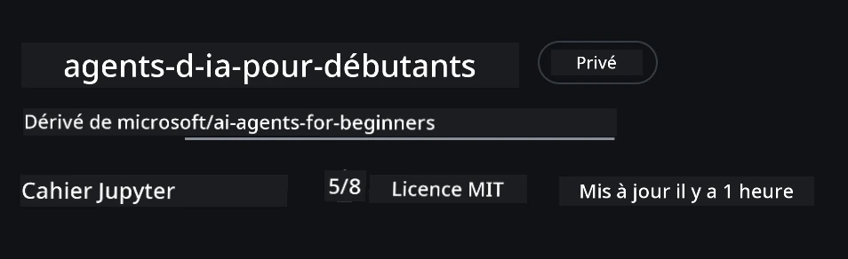
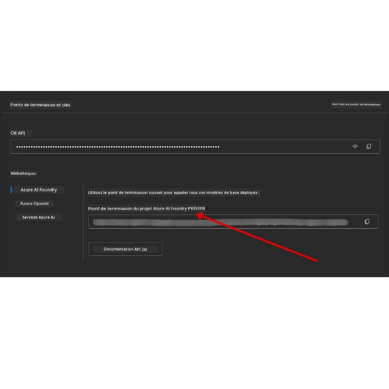

# Configuration du cours

## Introduction

Cette leçon expliquera comment exécuter les exemples de code de ce cours.

## Rejoignez d'autres apprenants et obtenez de l'aide

Avant de commencer à cloner votre dépôt, rejoignez le [canal Discord AI Agents For Beginners](https://aka.ms/ai-agents/discord) pour obtenir de l'aide lors de la configuration, poser des questions sur le cours ou pour vous connecter avec d'autres apprenants.

## Cloner ou forker ce dépôt

Pour commencer, veuillez cloner ou forker le dépôt GitHub. Cela vous permettra d'avoir votre propre version du matériel du cours afin de pouvoir exécuter, tester et modifier le code !

Cela peut être fait en cliquant sur le lien pour <a href="https://github.com/microsoft/ai-agents-for-beginners/fork" target="_blank">forker le dépôt</a>

Vous avez maintenant votre propre version forkée de ce cours au lien suivant :



### Clone superficiel (recommandé pour atelier / Codespaces)

  >Le dépôt complet peut être volumineux (~3 Go) lorsque vous téléchargez l'historique complet et tous les fichiers. Si vous assistez uniquement à l'atelier ou si vous n'avez besoin que de quelques dossiers de leçon, un clone superficiel (ou clone partiel) évite la plupart de ce téléchargement en tronquant l'historique et/ou en sautant certains blobs.

#### Clone superficiel rapide — historique minimal, tous les fichiers

Remplacez `<your-username>` dans les commandes ci-dessous par l'URL de votre fork (ou l'URL en amont si vous préférez).

Pour cloner uniquement l'historique du dernier commit (téléchargement léger) :

```bash|powershell
git clone --depth 1 https://github.com/<your-username>/ai-agents-for-beginners.git
```

Pour cloner une branche spécifique :

```bash|powershell
git clone --depth 1 --branch <branch-name> https://github.com/<your-username>/ai-agents-for-beginners.git
```

#### Clone partiel (sparse) — blobs minimaux + seulement les dossiers sélectionnés

Cela utilise le clone partiel et le sparse-checkout (requiert Git 2.25+ et recommande une version moderne de Git avec support du clone partiel) :

```bash|powershell
git clone --depth 1 --filter=blob:none --sparse https://github.com/<your-username>/ai-agents-for-beginners.git
```

Entrez dans le dossier du dépôt :

```bash|powershell
cd ai-agents-for-beginners
```

Puis spécifiez quels dossiers vous voulez (l'exemple ci-dessous montre deux dossiers) :

```bash|powershell
git sparse-checkout set 00-course-setup 01-intro-to-ai-agents
```

Après avoir cloné et vérifié les fichiers, si vous n'avez besoin que des fichiers et souhaitez libérer de l'espace (sans historique git), supprimez les métadonnées du dépôt (💀 irréversible — vous perdrez toute fonctionnalité Git : pas de commits, pulls, pushes ni accès à l'historique).

```bash
# zsh/bash
rm -rf .git
```

```powershell
# PowerShell
Remove-Item -Recurse -Force .git
```

#### Utilisation de GitHub Codespaces (recommandé pour éviter les téléchargements volumineux locaux)

- Créez un nouveau Codespace pour ce dépôt via l’[interface GitHub](https://github.com/codespaces).  

- Dans le terminal du codespace fraîchement créé, exécutez l'une des commandes de clone superficiel/sparse ci-dessus pour importer uniquement les dossiers de leçon dont vous avez besoin dans l’espace de travail Codespace.
- Optionnel : après clonage dans Codespaces, supprimez .git pour récupérer de l’espace supplémentaire (voir commandes de suppression ci-dessus).
- Note : si vous préférez ouvrir directement le dépôt dans Codespaces (sans clone supplémentaire), sachez que Codespaces construira l’environnement devcontainer et peut encore provisionner plus que nécessaire. Cloner une copie superficielle dans un Codespace frais vous donne plus de contrôle sur l’usage du disque.

#### Conseils

- Remplacez toujours l’URL de clonage par celle de votre fork si vous voulez modifier/committer.
- Si vous avez besoin plus tard d’historique ou de fichiers supplémentaires, vous pouvez les récupérer ou ajuster sparse-checkout pour inclure d’autres dossiers.

## Exécution du code

Ce cours propose une série de Jupyter Notebooks que vous pouvez exécuter pour acquérir une expérience pratique de construction d’agents IA.

Les exemples de code utilisent **Microsoft Agent Framework (MAF)** avec `AzureAIProjectAgentProvider`, qui se connecte au **Azure AI Agent Service V2** (API de Réponses) via **Microsoft Foundry**.

Tous les notebooks Python sont nommés `*-python-agent-framework.ipynb`.

## Prérequis

- Python 3.12+
  - **NOTE** : Si vous n'avez pas Python3.12 installé, assurez-vous de l’installer. Puis créez votre environnement virtuel avec python3.12 pour garantir l’installation des bonnes versions des paquets depuis le fichier requirements.txt.
  
    >Exemple

    Création du répertoire venv Python :

    ```bash|powershell
    python -m venv venv
    ```

    Puis activez l’environnement virtuel pour :

    ```bash
    # zsh/bash
    source venv/bin/activate
    ```
  
    ```dos
    # Command Prompt for Windows
    venv\Scripts\activate
    ```

- .NET 10+ : Pour les exemples en .NET, assurez-vous d’installer le [.NET 10 SDK](https://dotnet.microsoft.com/download/dotnet/10.0) ou une version ultérieure. Puis vérifiez la version installée :

    ```bash|powershell
    dotnet --list-sdks
    ```

- **Azure CLI** — Requis pour l'authentification. Installez depuis [aka.ms/installazurecli](https://aka.ms/installazurecli).
- **Abonnement Azure** — Pour accéder à Microsoft Foundry et au service Azure AI Agent.
- **Projet Microsoft Foundry** — Un projet avec un modèle déployé (ex. `gpt-4o`). Voir [Étape 1](#étape-1-créer-un-projet-microsoft-foundry) ci-dessous.

Un fichier `requirements.txt` est inclus à la racine de ce dépôt contenant tous les paquets Python nécessaires pour exécuter les exemples :

Vous pouvez les installer en lançant la commande suivante dans votre terminal à la racine du dépôt :

```bash|powershell
pip install -r requirements.txt
```

Nous recommandons de créer un environnement virtuel Python pour éviter tout conflit ou problème.

## Configuration de VSCode

Assurez-vous d’utiliser la bonne version de Python dans VSCode.


## Configuration de Microsoft Foundry et Azure AI Agent Service

### Étape 1 : Créer un projet Microsoft Foundry

Vous avez besoin d’un **hub** et d’un **projet** Azure AI Foundry avec un modèle déployé pour exécuter les notebooks.

1. Rendez-vous sur [ai.azure.com](https://ai.azure.com) et connectez-vous avec votre compte Azure.
2. Créez un **hub** (ou utilisez-en un existant). Voir : [Vue d’ensemble des ressources Hub](https://learn.microsoft.com/azure/ai-foundry/concepts/ai-resources).
3. Dans le hub, créez un **projet**.
4. Déployez un modèle (ex. `gpt-4o`) depuis **Models + Endpoints** → **Deploy model**.

### Étape 2 : Récupérer l’endpoint du projet et le nom du déploiement du modèle

Dans votre projet sur le portail Microsoft Foundry :

- **Endpoint du projet** — Allez sur la page **Overview** et copiez l’URL de l’endpoint.



- **Nom du déploiement du modèle** — Allez dans **Models + Endpoints**, sélectionnez votre modèle déployé, et notez le **nom du déploiement** (ex. `gpt-4o`).

### Étape 3 : Connectez-vous à Azure avec `az login`

Tous les notebooks utilisent **`AzureCliCredential`** pour l’authentification — pas de gestion de clés API. Vous devez être connecté via Azure CLI.

1. **Installez Azure CLI** si ce n’est pas déjà fait : [aka.ms/installazurecli](https://aka.ms/installazurecli)

2. **Connectez-vous** avec :

    ```bash|powershell
    az login
    ```

    Ou si vous êtes dans un environnement distant/Codespace sans navigateur :

    ```bash|powershell
    az login --use-device-code
    ```

3. **Sélectionnez votre abonnement** si demandé — choisissez celui contenant votre projet Foundry.

4. **Vérifiez** que vous êtes connecté :

    ```bash|powershell
    az account show
    ```

> **Pourquoi `az login` ?** Les notebooks authentifient via `AzureCliCredential` du package `azure-identity`. Cela signifie que votre session Azure CLI fournit les identifiants — pas de clés API ou secrets dans le fichier `.env`. C’est une [bonne pratique de sécurité](https://learn.microsoft.com/azure/developer/ai/keyless-connections).

### Étape 4 : Créez votre fichier `.env`

Copiez le fichier exemple :

```bash
# zsh/bash
cp .env.example .env
```

```powershell
# PowerShell
Copy-Item .env.example .env
```

Ouvrez `.env` et remplissez ces deux valeurs :

```env
AZURE_AI_PROJECT_ENDPOINT=https://<your-project>.services.ai.azure.com/api/projects/<your-project-id>
AZURE_AI_MODEL_DEPLOYMENT_NAME=gpt-4o
```

| Variable | Où la trouver |
|----------|-----------------|
| `AZURE_AI_PROJECT_ENDPOINT` | Portail Foundry → votre projet → page **Overview** |
| `AZURE_AI_MODEL_DEPLOYMENT_NAME` | Portail Foundry → **Models + Endpoints** → nom de votre modèle déployé |

C’est tout pour la plupart des leçons ! Les notebooks s’authentifieront automatiquement via votre session `az login`.

### Étape 5 : Installez les dépendances Python

```bash|powershell
pip install -r requirements.txt
```

Nous recommandons d’exécuter cela dans votre environnement virtuel créé précédemment.

## Configuration additionnelle pour la leçon 5 (Agentic RAG)

La leçon 5 utilise **Azure AI Search** pour la génération augmentée par récupération. Si vous prévoyez d’exécuter cette leçon, ajoutez ces variables à votre fichier `.env` :

| Variable | Où la trouver |
|----------|-----------------|
| `AZURE_SEARCH_SERVICE_ENDPOINT` | Portail Azure → votre ressource **Azure AI Search** → **Overview** → URL |
| `AZURE_SEARCH_API_KEY` | Portail Azure → votre ressource **Azure AI Search** → **Settings** → **Keys** → clé d’administration principale |

## Configuration additionnelle pour les leçons 6 et 8 (GitHub Models)

Certains notebooks des leçons 6 et 8 utilisent **GitHub Models** au lieu d’Azure AI Foundry. Si vous souhaitez exécuter ces exemples, ajoutez ces variables à votre fichier `.env` :

| Variable | Où la trouver |
|----------|-----------------|
| `GITHUB_TOKEN` | GitHub → **Settings** → **Developer settings** → **Personal access tokens** |
| `GITHUB_ENDPOINT` | Utilisez `https://models.inference.ai.azure.com` (valeur par défaut) |
| `GITHUB_MODEL_ID` | Nom du modèle à utiliser (ex. `gpt-4o-mini`) |

## Fournisseur alternatif : MiniMax (compatible OpenAI)

[MiniMax](https://platform.minimaxi.com/) fournit des modèles à large contexte (jusqu’à 204K tokens) via une API compatible OpenAI. Comme `OpenAIChatClient` du Microsoft Agent Framework fonctionne avec n’importe quel endpoint compatible OpenAI, vous pouvez utiliser MiniMax comme alternative simple aux GitHub Models ou OpenAI.

Ajoutez ces variables à votre fichier `.env` :

| Variable | Où la trouver |
|----------|-----------------|
| `MINIMAX_API_KEY` | [Plateforme MiniMax](https://platform.minimaxi.com/) → Clés API |
| `MINIMAX_BASE_URL` | Utilisez `https://api.minimax.io/v1` (valeur par défaut) |
| `MINIMAX_MODEL_ID` | Nom du modèle à utiliser (ex. `MiniMax-M3`) |

**Modèles exemples** : `MiniMax-M3` (recommandé), `MiniMax-M2.7`, `MiniMax-M2.7-highspeed` (réponses plus rapides). Les noms et la disponibilité des modèles peuvent évoluer, et l’accès peut dépendre de votre compte ou région — consultez la [plateforme MiniMax](https://platform.minimaxi.com/) pour la liste actuelle. Si `MiniMax-M3` n’est pas disponible pour votre compte, pointez `MINIMAX_MODEL_ID` vers un modèle auquel vous avez accès (ex. `MiniMax-M2.7`).

Les exemples utilisant `OpenAIChatClient` (ex. le workflow de réservation d’hôtel en leçon 14) détecteront et utiliseront automatiquement votre configuration MiniMax lorsque `MINIMAX_API_KEY` est définie.

## Configuration supplémentaire pour la leçon 8 (workflow d’ancrage Bing)

Le notebook de workflow conditionnel en leçon 8 utilise l’**ancrage Bing** via Azure AI Foundry. Si vous prévoyez d’exécuter cet exemple, ajoutez cette variable à votre fichier `.env` :

| Variable | Où la trouver |
|----------|-----------------|
| `BING_CONNECTION_ID` | Portail Azure AI Foundry → votre projet → **Management** → **Connected resources** → votre connexion Bing → copiez l’ID de connexion |

## Dépannage

### Erreurs de vérification de certificat SSL sous macOS

Si vous êtes sur macOS et que vous rencontrez une erreur comme :

```plaintext
ssl.SSLCertVerificationError: [SSL: CERTIFICATE_VERIFY_FAILED] certificate verify failed: self-signed certificate in certificate chain
```

C’est un problème connu de Python sur macOS où les certificats système SSL ne sont pas automatiquement reconnus. Essayez les solutions suivantes dans l’ordre :

**Option 1 : Exécuter le script Install Certificates de Python (recommandé)**

```bash
# Remplacez 3.XX par la version de Python installée (par exemple, 3.12 ou 3.13) :
/Applications/Python\ 3.XX/Install\ Certificates.command
```

**Option 2 : Utiliser `connection_verify=False` dans votre notebook (pour les notebooks GitHub Models uniquement)**

Dans le notebook de la leçon 6 (`06-building-trustworthy-agents/code_samples/06-system-message-framework.ipynb`), une solution alternative commentée est déjà incluse. Décommentez `connection_verify=False` lors de la création du client :

```python
client = ChatCompletionsClient(
    endpoint=endpoint,
    credential=AzureKeyCredential(token),
    connection_verify=False,  # Désactivez la vérification SSL si vous rencontrez des erreurs de certificat
)
```

> **⚠️ Attention :** Désactiver la vérification SSL (`connection_verify=False`) réduit la sécurité en sautant la validation des certificats. À utiliser uniquement temporairement en développement, jamais en production.

**Option 3 : Installer et utiliser `truststore`**

```bash
pip install truststore
```

Puis ajoutez ce qui suit en haut de votre notebook ou script avant d’effectuer des appels réseau :

```python
import truststore
truststore.inject_into_ssl()
```

## Bloqué quelque part ?

Si vous avez des problèmes pour exécuter cette configuration, rejoignez notre <a href="https://discord.gg/kzRShWzttr" target="_blank">Discord Communauté Azure AI</a> ou <a href="https://github.com/microsoft/ai-agents-for-beginners/issues?WT.mc_id=academic-105485-koreyst" target="_blank">créez une issue</a>.
## Leçon suivante

Vous êtes maintenant prêt à exécuter le code pour ce cours. Bonne découverte du monde des agents IA !

[Introduction aux agents IA et cas d'utilisation des agents](../01-intro-to-ai-agents/README.md)

---

<!-- CO-OP TRANSLATOR DISCLAIMER START -->
**Avertissement** :
Ce document a été traduit à l'aide du service de traduction automatique [Co-op Translator](https://github.com/Azure/co-op-translator). Bien que nous nous efforçions d'assurer l'exactitude, veuillez noter que les traductions automatisées peuvent contenir des erreurs ou des inexactitudes. Le document original dans sa langue native doit être considéré comme la source faisant autorité. Pour les informations critiques, il est recommandé de recourir à une traduction professionnelle réalisée par un humain. Nous ne saurions être tenus responsables des malentendus ou erreurs d'interprétation découlant de l'utilisation de cette traduction.
<!-- CO-OP TRANSLATOR DISCLAIMER END -->