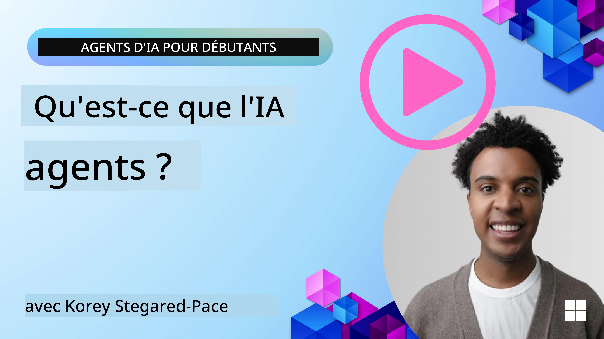
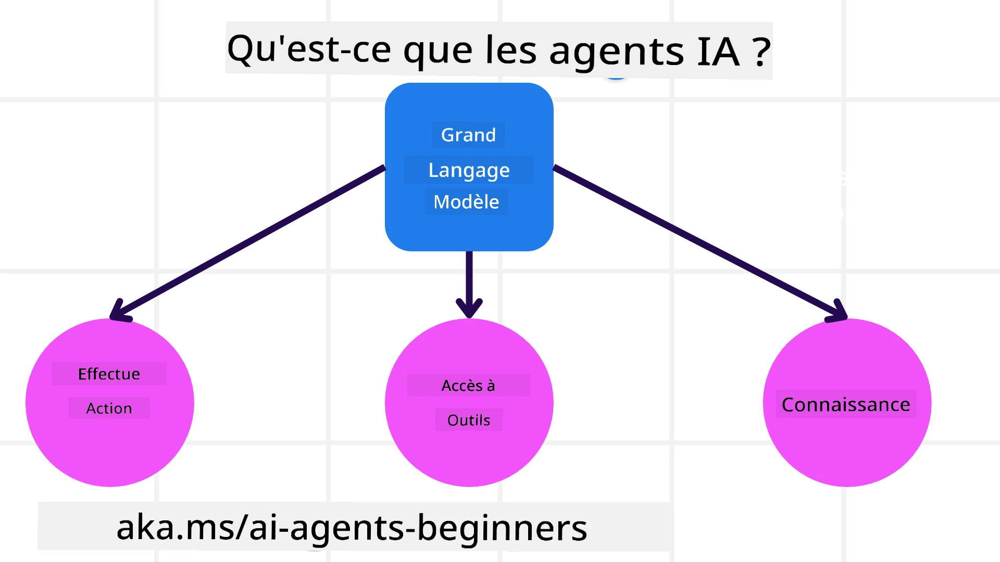
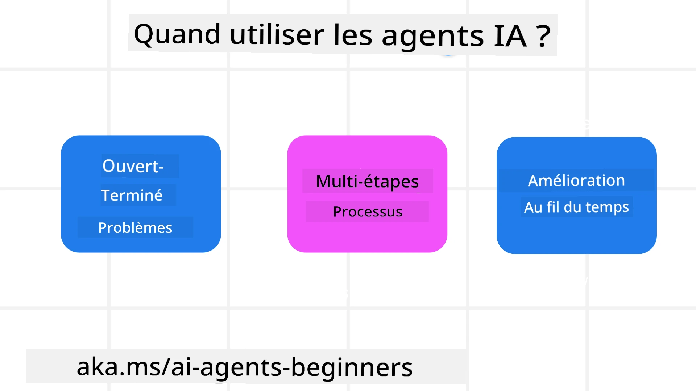

> _(Cliquez sur l'image ci-dessus pour visionner la vidéo de cette leçon)_

# Introduction aux agents IA et cas d'utilisation des agents

Bienvenue dans le cours "Agents IA pour débutants" ! Ce cours fournit des connaissances fondamentales et des exemples pratiques pour créer des agents IA.

Rejoignez la <a href="https://discord.gg/kzRShWzttr" target="_blank">communauté Discord Azure AI</a> pour rencontrer d'autres apprenants et constructeurs d'agents IA et poser toutes vos questions sur ce cours.

Pour commencer ce cours, nous commençons par mieux comprendre ce que sont les agents IA et comment nous pouvons les utiliser dans les applications et les flux de travail que nous construisons.

## Introduction

Cette leçon couvre :

- Qu'est-ce que les agents IA et quels sont les différents types d'agents ?
- Quels cas d'utilisation sont les plus adaptés aux agents IA et comment peuvent-ils nous aider ?
- Quels sont certains des blocs de construction de base lors de la conception de solutions agentiques ?

## Objectifs d'apprentissage
Après avoir terminé cette leçon, vous devriez être capable de :

- Comprendre les concepts d'agents IA et comment ils diffèrent des autres solutions IA.
- Appliquer les agents IA de manière la plus efficace.
- Concevoir des solutions agentiques productives pour les utilisateurs et les clients.

## Définition des agents IA et types d'agents IA

### Qu'est-ce qu'un agent IA ?

Les agents IA sont des **systèmes** qui permettent aux **Modèles de Langage de Grande Taille (LLM)** de **réaliser des actions** en étendant leurs capacités en donnant aux LLM un **accès à des outils** et à des **connaissances**.

Décomposons cette définition en parties plus petites :

- **Système** - Il est important de penser aux agents non pas comme un seul composant mais comme un système composé de nombreux composants. Au niveau de base, les composants d'un agent IA sont :
  - **Environnement** - L'espace défini où l'agent IA opère. Par exemple, si nous avions un agent IA de réservation de voyage, l'environnement pourrait être le système de réservation de voyages que l'agent IA utilise pour accomplir des tâches.
  - **Capteurs** - Les environnements détiennent des informations et fournissent des retours. Les agents IA utilisent des capteurs pour collecter et interpréter ces informations sur l'état actuel de l'environnement. Dans l'exemple de l'agent de réservation de voyage, le système de réservation peut fournir des informations telles que la disponibilité des hôtels ou les prix des vols.
  - **Actionneurs** - Une fois que l'agent IA reçoit l'état actuel de l'environnement, pour la tâche en cours, l'agent détermine quelle action effectuer pour modifier l'environnement. Pour l’agent de voyage, cela pourrait être de réserver une chambre disponible pour l'utilisateur.

**Modèles de Langage de Grande Taille** - Le concept d'agents existait avant la création des LLM. L'avantage de construire des agents IA avec les LLM réside dans leur capacité à interpréter le langage humain et les données. Cette capacité permet aux LLM d'interpréter les informations de l'environnement et de définir un plan pour modifier cet environnement.

**Réaliser des actions** - En dehors des systèmes d'agents IA, les LLM sont limités aux situations où l'action consiste à générer du contenu ou des informations basées sur la requête de l'utilisateur. Dans les systèmes d'agents IA, les LLM peuvent accomplir des tâches en interprétant la demande de l'utilisateur et en utilisant les outils disponibles dans leur environnement.

**Accès aux outils** - Les outils auxquels le LLM a accès sont définis par 1) l'environnement dans lequel il opère et 2) le développeur de l'agent IA. Pour notre exemple d'agent de voyage, les outils de l'agent sont limités par les opérations disponibles dans le système de réservation, et/ou le développeur peut limiter l'accès aux outils de l'agent aux vols.

**Mémoire+Connaissance** - La mémoire peut être à court terme dans le contexte de la conversation entre l'utilisateur et l'agent. À long terme, en dehors des informations fournies par l'environnement, les agents IA peuvent également récupérer des connaissances depuis d'autres systèmes, services, outils, et même d'autres agents. Dans l'exemple de l'agent de voyage, cette connaissance pourrait être les informations sur les préférences de voyage de l'utilisateur situées dans une base de données client.

### Les différents types d'agents

Maintenant que nous avons une définition générale des agents IA, regardons quelques types spécifiques d'agents et comment ils s'appliqueraient à un agent de réservation de voyage IA.

| **Type d'agent**              | **Description**                                                                                                                       | **Exemple**                                                                                                                                                                                                                   |
| ----------------------------- | ------------------------------------------------------------------------------------------------------------------------------------- | ----------------------------------------------------------------------------------------------------------------------------------------------------------------------------------------------------------------------------- |
| **Agents réflexes simples**   | Effectuent des actions immédiates basées sur des règles prédéfinies.                                                                 | L'agent de voyage interprète le contexte de l'e-mail et transfère les plaintes de voyage au service client.                                                                                                                    |
| **Agents réflexes basés sur un modèle** | Effectuent des actions basées sur un modèle du monde et des changements apportés à ce modèle.                                         | L'agent de voyage priorise les itinéraires avec des changements de prix significatifs en se basant sur l'accès aux données historiques des prix.                                                                                 |
| **Agents basés sur des objectifs** | Créent des plans pour atteindre des objectifs spécifiques en interprétant l'objectif et en déterminant les actions pour l'atteindre. | L'agent de voyage réserve un trajet en déterminant les arrangements nécessaires (voiture, transports en commun, vols) du lieu actuel jusqu'à la destination.                                                                      |
| **Agents basés sur l'utilité** | Considèrent les préférences et pèsent numériquement les compromis pour déterminer comment atteindre les objectifs.                   | L'agent de voyage maximise l'utilité en pondérant la commodité par rapport au coût lors de la réservation du voyage.                                                                                                           |
| **Agents apprenants**          | S'améliorent avec le temps en répondant aux retours et en ajustant les actions en conséquence.                                        | L'agent de voyage s'améliore en utilisant les retours clients provenant des enquêtes post-voyage pour ajuster les futures réservations.                                                                                       |
| **Agents hiérarchiques**       | Composés de plusieurs agents en système à niveaux, les agents de niveau supérieur décomposant les tâches en sous-tâches pour que les agents de niveau inférieur les accomplissent. | L'agent de voyage annule un voyage en divisant la tâche en sous-tâches (par exemple, annuler des réservations spécifiques) et en laissant les agents de niveau inférieur les exécuter, puis faire un rapport à l'agent supérieur. |
| **Systèmes multi-agents (MAS)** | Les agents accomplissent les tâches indépendamment, soit de manière coopérative, soit compétitive.                                   | Coopératif : Plusieurs agents réservent des services de voyage spécifiques tels que hôtels, vols et divertissement. Compétitif : Plusieurs agents gèrent et s'affrontent sur un calendrier de réservation hôtel partagé pour accueillir les clients. |

## Quand utiliser les agents IA

Dans la section précédente, nous avons utilisé le cas d'usage de l’agent de voyage pour expliquer comment les différents types d'agents peuvent être utilisés dans différents scénarios de réservation de voyage. Nous continuerons à utiliser cette application tout au long du cours.

Regardons les types de cas d'utilisation pour lesquels les agents IA sont le mieux adaptés :

- **Problèmes ouverts** - permettant au LLM de déterminer les étapes nécessaires pour accomplir une tâche car ce ne peut pas toujours être codé en dur dans un flux de travail.  
- **Processus à multiples étapes** - tâches nécessitant un niveau de complexité dans lequel l'agent IA doit utiliser des outils ou des informations sur plusieurs tours au lieu d'une récupération en une seule fois.  
- **Amélioration au fil du temps** - tâches où l'agent peut s'améliorer avec le temps en recevant des retours de son environnement ou des utilisateurs afin de fournir une meilleure utilité.

Nous abordons plus de considérations sur l'utilisation des agents IA dans la leçon Construction d'agents IA fiables.

## Bases des solutions agentiques

### Développement d'agents

La première étape dans la conception d'un système d'agents IA est de définir les outils, actions et comportements. Dans ce cours, nous nous concentrons sur l'utilisation du **Azure AI Agent Service** pour définir nos agents. Il offre des fonctionnalités comme :

- Sélection de modèles ouverts tels que OpenAI, Mistral et Llama  
- Utilisation de données sous licence via des fournisseurs comme Tripadvisor  
- Utilisation d'outils OpenAPI 3.0 standardisés  

### Modèles agentiques

La communication avec les LLM se fait par des prompts. Étant donné la nature semi-autonome des agents IA, il n'est pas toujours possible ou nécessaire de relancer manuellement le prompt du LLM après un changement dans l'environnement. Nous utilisons des **modèles agentiques** qui nous permettent d'interroger le LLM sur plusieurs étapes de manière plus évolutive.

Ce cours est divisé selon certains modèles agentiques populaires actuels.

### Cadres agentiques

Les cadres agentiques permettent aux développeurs d'implémenter des modèles agentiques via du code. Ces cadres offrent des modèles, plugins et outils pour une meilleure collaboration entre agents IA. Ces avantages fournissent des capacités d'observabilité et de dépannage améliorées des systèmes d'agents IA.

Dans ce cours, nous explorerons le Microsoft Agent Framework (MAF) pour construire des agents IA prêts pour la production.

## Codes d'exemple

- Python : [Agent Framework](./code_samples/01-python-agent-framework.ipynb)  
- .NET : [Agent Framework](./code_samples/01-dotnet-agent-framework.md)  

## Vous avez d'autres questions sur les agents IA ?

Rejoignez le [Microsoft Foundry Discord](https://aka.ms/ai-agents/discord) pour rencontrer d'autres apprenants, assister aux heures de bureau et obtenir des réponses à vos questions sur les agents IA.

## Leçon précédente

[Configuration du cours](../00-course-setup/README.md)

## Leçon suivante

[Exploration des cadres agentiques](../02-explore-agentic-frameworks/README.md)

---

<!-- CO-OP TRANSLATOR DISCLAIMER START -->
**Clause de non-responsabilité** :  
Ce document a été traduit à l’aide du service de traduction automatique [Co-op Translator](https://github.com/Azure/co-op-translator). Bien que nous nous efforçons d’assurer l’exactitude, veuillez noter que les traductions automatiques peuvent comporter des erreurs ou des imprécisions. Le document original dans sa langue d’origine doit être considéré comme la source faisant foi. Pour des informations critiques, il est recommandé de recourir à une traduction professionnelle humaine. Nous déclinons toute responsabilité en cas de malentendus ou de mauvaises interprétations résultant de l’utilisation de cette traduction.
<!-- CO-OP TRANSLATOR DISCLAIMER END -->