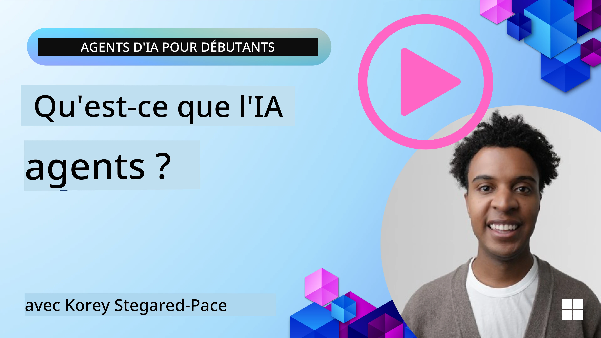
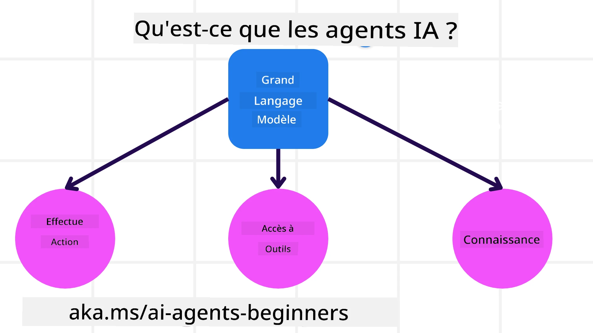
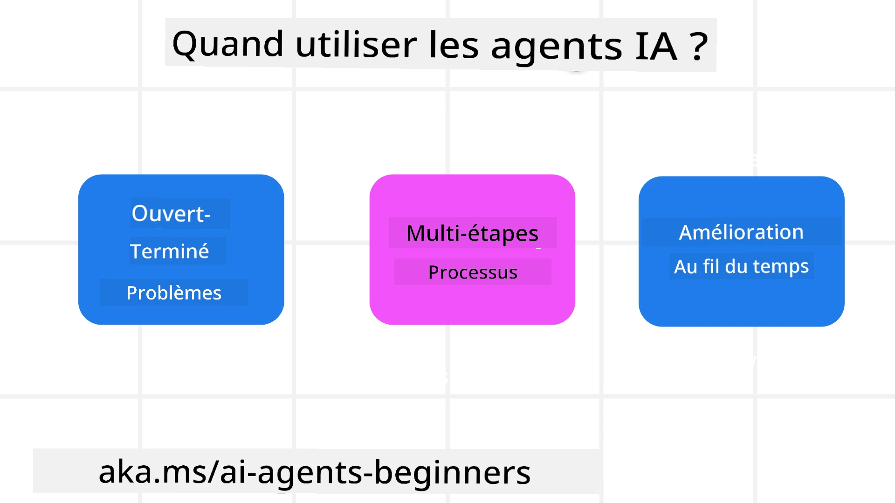

> _(Cliquez sur l'image ci-dessus pour regarder la vidéo de cette leçon)_

# Introduction aux agents IA et cas d’usage des agents

Bienvenue dans le cours **Agents IA pour débutants** ! Ce cours vous donne les connaissances fondamentales — ainsi que du code opérationnel — pour commencer à construire des agents IA depuis zéro.

Venez dire bonjour dans la <a href="https://discord.gg/kzRShWzttr" target="_blank">communauté Discord Azure AI</a> — elle est pleine d’apprenants et de créateurs d’IA heureux de répondre à vos questions.

Avant de commencer à construire, assurons-nous de bien comprendre ce qu’est un agent IA *et* quand il est pertinent d’en utiliser un.

---

## Introduction

Cette leçon couvre :

- Ce que sont les agents IA, et les différents types qui existent
- Quels types de tâches conviennent le mieux aux agents IA
- Les éléments clés que vous utiliserez pour concevoir une solution agentique

## Objectifs d’apprentissage

À la fin de cette leçon, vous devriez être capable de :

- Expliquer ce qu’est un agent IA et en quoi il diffère d’une solution IA classique
- Savoir quand recourir à un agent IA (et quand ne pas le faire)
- Esquisser une conception basique de solution agentique pour un problème réel

---

## Définition des agents IA et types d’agents IA

### Qu’est-ce qu’un agent IA ?

Voici une façon simple d’y penser :

> **Les agents IA sont des systèmes qui permettent aux grands modèles de langage (LLM) de réellement *agir* — en leur donnant des outils et des connaissances pour agir sur le monde, pas seulement répondre à des requêtes.**

Décomposons un peu :

- **Système** — Un agent IA n’est pas une chose unique. C’est un ensemble de composants travaillant ensemble. Au cœur, chaque agent possède trois éléments :
  - **Environnement** — L’espace dans lequel l’agent agit. Pour un agent de réservation de voyage, ce serait la plateforme de réservation elle-même.
  - **Capteurs** — Comment l’agent lit l’état actuel de son environnement. Notre agent de voyage pourrait vérifier la disponibilité des hôtels ou les prix des vols.
  - **Actionneurs** — Comment l’agent agit. L’agent de voyage pourrait réserver une chambre, envoyer une confirmation, ou annuler une réservation.

- **Grands modèles de langage** — Les agents existaient avant les LLM, mais ce sont eux qui rendent les agents modernes si puissants. Ils comprennent le langage naturel, raisonnent à partir du contexte, et transforment une demande vague en plan d’action concret.

- **Effectuer des actions** — Sans système agentique, un LLM se contente de générer du texte. Dans un système agentique, le LLM peut réellement *exécuter* des étapes — chercher dans une base de données, appeler une API, envoyer un message.

- **Accès aux outils** — Les outils que l’agent peut utiliser dépendent de (1) l’environnement dans lequel il fonctionne et (2) ce que le développeur lui a donné. Un agent de voyage peut rechercher des vols mais pas éditer des dossiers clients — tout dépend du branchement effectué.

- **Mémoire + Connaissances** — Les agents peuvent avoir une mémoire à court terme (la conversation en cours) et à long terme (une base de données clients, interactions passées). L’agent de voyage pourrait « se souvenir » que vous préférez les sièges côté hublot.

---

### Les différents types d’agents IA

Tous les agents ne sont pas construits de la même façon. Voici un aperçu des principaux types, prenant l’exemple de l’agent de réservation de voyage :

| **Type d’agent** | **Ce qu’il fait** | **Exemple agent de voyage** |
|---|---|---|
| **Agents réflexes simples** | Suit des règles codées en dur — sans mémoire, sans planification. | Reçoit un e-mail de plainte → le transfère au service client. C’est tout. |
| **Agents réflexes basés sur un modèle** | Conserve un modèle interne du monde et le met à jour au fil des changements. | Suit les prix historiques des vols et signale les trajets devenus soudainement chers. |
| **Agents basés sur des objectifs** | A un objectif en tête et trouve comment l’atteindre étape par étape. | Réserve un voyage complet (vols, voiture, hôtel) depuis votre lieu actuel jusqu’à destination. |
| **Agents basés sur l’utilité** | Ne trouve pas juste *une* solution — trouve la *meilleure* en pesant les compromis. | Équilibre coût et commodité pour trouver le voyage qui correspond le mieux à vos préférences. |
| **Agents apprenants** | S’améliore avec le temps en apprenant des retours. | Ajuste les recommandations de réservation futures en fonction des enquêtes post-voyage. |
| **Agents hiérarchiques** | Un agent de haut niveau découpe le travail en sous-tâches et délègue à d’autres agents. | Une demande « annuler voyage » se divise en : annuler vol, annuler hôtel, annuler location de voiture — chaque sous-agent gérant une partie. |
| **Systèmes multi-agents (MAS)** | Plusieurs agents indépendants collaborant (ou en compétition). | Coopératif : agents distincts gèrent hôtels, vols et divertissements. Compétitif : plusieurs agents s’affrontent pour remplir les chambres d’hôtel au meilleur prix. |

---

## Quand utiliser des agents IA

Ce n’est pas parce que vous *pouvez* utiliser un agent IA que vous *devez* toujours le faire. Voici les cas où les agents s’illustrent vraiment :

- **Problèmes ouverts** — Quand les étapes pour résoudre un problème ne peuvent pas être préprogrammées. Le LLM doit trouver dynamiquement le chemin.
- **Processus en plusieurs étapes** — Tâches nécessitant d’utiliser des outils sur plusieurs tours, pas juste une consultation ou génération unique.
- **Amélioration dans le temps** — Lorsqu’on veut que le système devienne plus intelligent en fonction des retours utilisateurs ou des signaux de l’environnement.

Nous approfondirons quand (et quand *pas*) utiliser des agents IA dans la leçon **Construire des agents IA dignes de confiance** plus tard dans le cours.

---

## Notions de base des solutions agentiques

### Développement d’agents

La première chose à faire quand on crée un agent est de définir *ce qu’il peut faire* — ses outils, actions, et comportements.

Dans ce cours, nous utilisons le **Azure AI Agent Service** comme plateforme principale. Il supporte :

- Des modèles de fournisseurs comme OpenAI, Mistral et Meta (Llama)
- Des données sous licence de fournisseurs comme Tripadvisor
- Des définitions standardisées des outils OpenAPI 3.0

### Schémas agentiques

Vous communiquez avec les LLM via des prompts. Avec les agents, on ne peut pas toujours écrire chaque prompt manuellement — l’agent doit agir sur plusieurs étapes. C’est là que les **schémas agentiques** entrent en jeu. Ce sont des stratégies réutilisables pour la création de prompts et l’orchestration des LLM de manière plus évolutive et fiable.

Ce cours est structuré autour des schémas agentiques les plus courants et utiles.

### Frameworks agentiques

Les frameworks agentiques fournissent aux développeurs des modèles prêts à l’emploi, outils, et infrastructure pour construire des agents. Ils facilitent :

- Le branchement d’outils et capacités
- L’observation des actions de l’agent (et le débogage quand ça ne va pas)
- La collaboration entre plusieurs agents

Dans ce cours, nous mettons l’accent sur le **Microsoft Agent Framework (MAF)** pour construire des agents prêts pour la production.

---

## Exemples de code

Prêt à voir cela en action ? Voici les exemples de code pour cette leçon :

- 🐍 Python : [Agent Framework](./code_samples/01-python-agent-framework.ipynb)
- 🔷 .NET : [Agent Framework](./code_samples/01-dotnet-agent-framework.md)

---

## Des questions ?

Rejoignez le [Microsoft Foundry Discord](https://discord.com/invite/ATgtXmAS5D) pour échanger avec d’autres apprenants, participer aux heures de bureau, et obtenir des réponses à vos questions sur les agents IA de la communauté.

---

## Leçon précédente

[Configuration du cours](../00-course-setup/README.md)

## Leçon suivante

[Explorer les frameworks agentiques](../02-explore-agentic-frameworks/README.md)

---

<!-- CO-OP TRANSLATOR DISCLAIMER START -->
**Avertissement** :
Ce document a été traduit à l'aide du service de traduction automatique [Co-op Translator](https://github.com/Azure/co-op-translator). Bien que nous nous efforçions d'assurer l'exactitude, veuillez noter que les traductions automatisées peuvent contenir des erreurs ou des inexactitudes. Le document original dans sa langue native doit être considéré comme la source faisant autorité. Pour les informations critiques, il est recommandé de recourir à une traduction professionnelle réalisée par un humain. Nous ne saurions être tenus responsables des malentendus ou erreurs d'interprétation découlant de l'utilisation de cette traduction.
<!-- CO-OP TRANSLATOR DISCLAIMER END -->