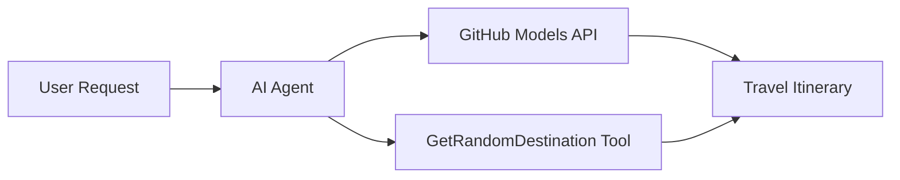

# 🌍 Agent de voyage IA avec Microsoft Agent Framework (.NET)

## 📋 Aperçu du scénario

Ce notebook montre comment créer un agent intelligent de planification de voyages en utilisant le Microsoft Agent Framework pour .NET. L'agent peut générer automatiquement des itinéraires personnalisés pour des excursions d'une journée vers des destinations aléatoires à travers le monde.

**Principales fonctionnalités :**
- 🎲 **Sélection de destination aléatoire** : Utilise un outil personnalisé pour choisir des lieux de vacances
- 🗺️ **Planification intelligente de voyages** : Crée des itinéraires détaillés jour par jour
- 🔄 **Streaming en temps réel** : Prend en charge les réponses immédiates et en streaming
- 🛠️ **Intégration d'outils personnalisés** : Montre comment étendre les capacités de l'agent

## 🔧 Architecture technique

### Technologies principales
- **Microsoft Agent Framework** : Dernière implémentation .NET pour le développement d'agents IA
- **Intégration des modèles GitHub** : Utilise le service d'inférence de modèles IA de GitHub
- **Compatibilité avec l'API OpenAI** : Exploite les bibliothèques client OpenAI avec des points de terminaison personnalisés
- **Configuration sécurisée** : Gestion des clés API basée sur l'environnement

### Composants clés
1. **AIAgent** : L'orchestrateur principal de l'agent qui gère le flux de conversation
2. **Outils personnalisés** : Fonction `GetRandomDestination()` disponible pour l'agent
3. **Client de chat** : Interface de conversation soutenue par les modèles GitHub
4. **Support de streaming** : Capacités de génération de réponses en temps réel

### Modèle d'intégration


## 🚀 Premiers pas

**Prérequis :**
- .NET 9.0 ou supérieur
- Jeton d'accès à l'API des modèles GitHub
- Variables d'environnement configurées dans le fichier `.env`

**Variables d'environnement requises :**
```env
GITHUB_TOKEN=your_github_token
GITHUB_ENDPOINT=https://models.inference.ai.azure.com
GITHUB_MODEL_ID=gpt-4o-mini
```

Exécutez les cellules ci-dessous dans l'ordre pour voir l'agent de voyage en action !

---

## .NET Single File App: AI Travel Agent Example

See `01-dotnet-agent-framework.cs` for the complete runnable code sample.

Exécutez l'exemple de code ci-dessous:

```bash
dotnet run 01-dotnet-agent-framework.cs
```

### Sample Code

```csharp
static string GetRandomDestination()
{
    var destinations = new List<string>
    {
        "Paris, France",
        "Tokyo, Japan",
        "New York City, USA",
        "Sydney, Australia",
        "Rome, Italy",
        "Barcelona, Spain",
        "Cape Town, South Africa",
        "Rio de Janeiro, Brazil",
        "Bangkok, Thailand",
        "Vancouver, Canada"
    };
    var random = new Random();
    int index = random.Next(destinations.Count);
    return destinations[index];
}

// Extract configuration from environment variables
var github_endpoint = Environment.GetEnvironmentVariable("GITHUB_ENDPOINT") ?? throw new InvalidOperationException("GITHUB_ENDPOINT is not set.");
var github_model_id = Environment.GetEnvironmentVariable("GITHUB_MODEL_ID") ?? "gpt-4o-mini";
var github_token = Environment.GetEnvironmentVariable("GITHUB_TOKEN") ?? throw new InvalidOperationException("GITHUB_TOKEN is not set.");

// Configure OpenAI Client Options
var openAIOptions = new OpenAIClientOptions()
{
    Endpoint = new Uri(github_endpoint)
};

// Initialize OpenAI Client with GitHub Models Configuration
var openAIClient = new OpenAIClient(new ApiKeyCredential(github_token), openAIOptions);

// Create AI Agent with Travel Planning Capabilities
AIAgent agent = openAIClient
    .GetChatClient(github_model_id)
    .CreateAIAgent(
        instructions: "You are a helpful AI Agent that can help plan vacations for customers at random destinations",
        tools: [AIFunctionFactory.Create(GetRandomDestination)]
    );

// Execute Agent: Plan a Day Trip (Non-Streaming)
Console.WriteLine(await agent.RunAsync("Plan me a day trip"));

// Execute Agent: Plan a Day Trip (Streaming Response)
await foreach (var update in agent.RunStreamingAsync("Plan me a day trip"))
{
    Console.Write(update);
}
```
