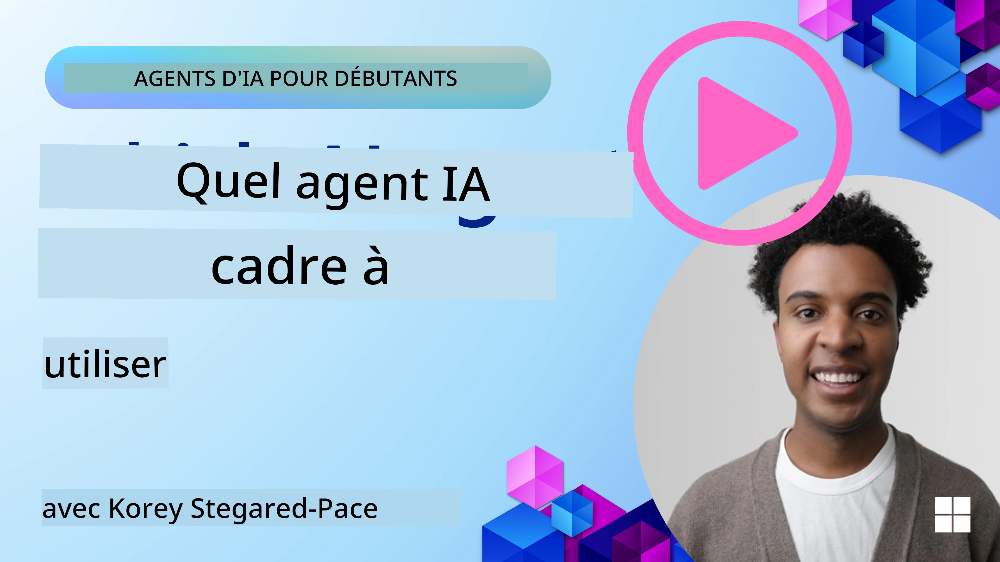

[](https://youtu.be/ODwF-EZo_O8?si=1xoy_B9RNQfrYdF7)

> _(Cliquez sur l'image ci-dessus pour voir la vidéo de cette leçon)_

# Explorer les frameworks d'agents IA

Les frameworks d'agents IA sont des plateformes logicielles conçues pour simplifier la création, le déploiement et la gestion des agents IA. Ces frameworks fournissent aux développeurs des composants préconstruits, des abstractions et des outils qui facilitent le développement de systèmes IA complexes.

Ces frameworks aident les développeurs à se concentrer sur les aspects uniques de leurs applications en proposant des approches standardisées aux défis courants du développement d'agents IA. Ils améliorent la scalabilité, l'accessibilité et l'efficacité dans la construction de systèmes IA.

## Introduction 

Cette leçon abordera :

- Qu'est-ce que les frameworks d'agents IA et quels objectifs permettent-ils aux développeurs d'atteindre ?
- Comment les équipes peuvent-elles utiliser ces frameworks pour prototyper rapidement, itérer et améliorer les capacités de leur agent ?
- Quelles sont les différences entre les frameworks et outils créés par Microsoft (<a href="https://aka.ms/ai-agents-beginners/ai-agent-service" target="_blank">Azure AI Agent Service</a> et le <a href="https://learn.microsoft.com/azure/ai-services/openai/how-to/responses" target="_blank">Microsoft Agent Framework</a>) ?
- Puis-je intégrer directement mes outils existants de l'écosystème Azure, ou ai-je besoin de solutions autonomes ?
- Qu’est-ce que le service Azure AI Agents et en quoi cela m’aide-t-il ?

## Objectifs d'apprentissage

Les objectifs de cette leçon sont de vous aider à comprendre :

- Le rôle des frameworks d'agents IA dans le développement IA.
- Comment tirer parti des frameworks d'agents IA pour créer des agents intelligents.
- Les principales capacités activées par les frameworks d'agents IA.
- Les différences entre Microsoft Agent Framework et Azure AI Agent Service.

## Qu'est-ce que les frameworks d'agents IA et que permettent-ils aux développeurs de faire ?

Les frameworks IA traditionnels peuvent vous aider à intégrer l'IA dans vos applications et à améliorer ces applications de la manière suivante :

- **Personnalisation** : L'IA peut analyser le comportement et les préférences des utilisateurs pour fournir des recommandations, contenus et expériences personnalisés.  
Exemple : Des services de streaming comme Netflix utilisent l'IA pour suggérer des films et des séries en fonction de l'historique de visionnage, augmentant ainsi l'engagement et la satisfaction des utilisateurs.  
- **Automatisation et efficacité** : L'IA peut automatiser les tâches répétitives, optimiser les flux de travail et améliorer l'efficacité opérationnelle.  
Exemple : Les applications de service client utilisent des chatbots IA pour gérer les demandes courantes, réduisant les temps de réponse et libérant les agents humains pour les problèmes plus complexes.  
- **Amélioration de l'expérience utilisateur** : L'IA peut améliorer l'expérience globale en fournissant des fonctionnalités intelligentes telles que la reconnaissance vocale, le traitement du langage naturel et la saisie prédictive.  
Exemple : Les assistants virtuels comme Siri et Google Assistant utilisent l'IA pour comprendre et répondre aux commandes vocales, facilitant ainsi l'interaction des utilisateurs avec leurs appareils.

### Cela semble parfait, mais pourquoi avons-nous besoin des frameworks d'agents IA ?

Les frameworks d'agents IA représentent quelque chose de plus que de simples frameworks IA. Ils sont conçus pour permettre la création d'agents intelligents capables d'interagir avec les utilisateurs, d'autres agents et l'environnement pour atteindre des objectifs spécifiques. Ces agents peuvent montrer un comportement autonome, prendre des décisions et s'adapter aux conditions changeantes. Voici quelques capacités clés activées par les frameworks d'agents IA :

- **Collaboration et coordination entre agents** : Permet de créer plusieurs agents IA pouvant travailler ensemble, communiquer et coordonner pour résoudre des tâches complexes.  
- **Automatisation et gestion des tâches** : Fournit des mécanismes pour automatiser des flux de travail à plusieurs étapes, déléguer des tâches et gérer dynamiquement les tâches entre agents.  
- **Compréhension contextuelle et adaptation** : Équipe les agents d'une capacité à comprendre le contexte, à s'adapter aux environnements changeants et à prendre des décisions basées sur des informations en temps réel.

En résumé, les agents vous permettent d'en faire plus, de porter l'automatisation à un niveau supérieur, de créer des systèmes plus intelligents capables de s'adapter et d'apprendre de leur environnement.

## Comment prototyper rapidement, itérer et améliorer les capacités de l’agent ?

Ce domaine évolue rapidement, mais il existe certains éléments communs à la plupart des frameworks d’agents IA qui peuvent vous aider à prototyper et itérer rapidement, notamment les composants modulaires, les outils collaboratifs et l’apprentissage en temps réel. Voici un aperçu :

- **Utiliser des composants modulaires** : Les SDK IA proposent des composants préconstruits tels que les connecteurs IA et mémoire, l'appel de fonctions via langage naturel ou plugins de code, les modèles de prompts, etc.  
- **Exploiter des outils collaboratifs** : Concevoir des agents avec des rôles et tâches spécifiques, les habilitant à tester et affiner des flux collaboratifs.  
- **Apprendre en temps réel** : Mettre en place des boucles de rétroaction où les agents apprennent des interactions et ajustent leur comportement de façon dynamique.

### Utiliser des composants modulaires

Les SDK comme Microsoft Agent Framework offrent des composants préconstruits tels que connecteurs IA, définitions d’outils et gestion des agents.

**Comment les équipes peuvent les utiliser** : Les équipes peuvent assembler rapidement ces composants pour créer un prototype fonctionnel sans repartir de zéro, permettant ainsi expérimentations et itérations rapides.

**Comment cela fonctionne en pratique** : Vous pouvez utiliser un analyseur préconstruit pour extraire des informations depuis une saisie utilisateur, un module mémoire pour stocker et récupérer des données, et un générateur de prompts pour interagir avec les utilisateurs, le tout sans avoir à développer ces composants vous-même.

**Exemple de code**. Voici un exemple montrant comment utiliser Microsoft Agent Framework avec `AzureAIProjectAgentProvider` pour faire répondre le modèle à une saisie utilisateur en appelant un outil :

``` python
# Exemple Python du Microsoft Agent Framework

import asyncio
import os
from typing import Annotated

from agent_framework.azure import AzureAIProjectAgentProvider
from azure.identity import AzureCliCredential


# Définir une fonction d'outil exemple pour réserver un voyage
def book_flight(date: str, location: str) -> str:
    """Book travel given location and date."""
    return f"Travel was booked to {location} on {date}"


async def main():
    provider = AzureAIProjectAgentProvider(credential=AzureCliCredential())
    agent = await provider.create_agent(
        name="travel_agent",
        instructions="Help the user book travel. Use the book_flight tool when ready.",
        tools=[book_flight],
    )

    response = await agent.run("I'd like to go to New York on January 1, 2025")
    print(response)
    # Sortie exemple : Votre vol pour New York le 1er janvier 2025 a été réservé avec succès. Bon voyage ! ✈️🗽


if __name__ == "__main__":
    asyncio.run(main())
```

Ce que vous voyez dans cet exemple, c’est comment tirer parti d’un analyseur préconstruit pour extraire des informations clés depuis une saisie utilisateur, comme l’origine, la destination et la date d’une demande de réservation de vol. Cette approche modulaire vous permet de vous concentrer sur la logique de haut niveau.

### Exploiter des outils collaboratifs

Des frameworks comme Microsoft Agent Framework facilitent la création de plusieurs agents travaillant ensemble.

**Comment les équipes peuvent les utiliser** : Les équipes peuvent concevoir des agents avec des rôles et tâches spécifiques, ce qui leur permet de tester et affiner les flux collaboratifs et d’améliorer l’efficacité globale du système.

**Comment cela fonctionne en pratique** : Vous pouvez créer une équipe d’agents où chaque agent a une fonction spécialisée, telle que la récupération de données, l’analyse ou la prise de décision. Ces agents communiquent et partagent des informations pour atteindre un objectif commun, comme répondre à une requête utilisateur ou accomplir une tâche.

**Exemple de code (Microsoft Agent Framework)** :

```python
# Création de plusieurs agents qui travaillent ensemble en utilisant le Microsoft Agent Framework

import os
from agent_framework.azure import AzureAIProjectAgentProvider
from azure.identity import AzureCliCredential

provider = AzureAIProjectAgentProvider(credential=AzureCliCredential())

# Agent de récupération des données
agent_retrieve = await provider.create_agent(
    name="dataretrieval",
    instructions="Retrieve relevant data using available tools.",
    tools=[retrieve_tool],
)

# Agent d'analyse des données
agent_analyze = await provider.create_agent(
    name="dataanalysis",
    instructions="Analyze the retrieved data and provide insights.",
    tools=[analyze_tool],
)

# Exécuter les agents en séquence sur une tâche
retrieval_result = await agent_retrieve.run("Retrieve sales data for Q4")
analysis_result = await agent_analyze.run(f"Analyze this data: {retrieval_result}")
print(analysis_result)
```

Ce que vous voyez dans le code précédent, c’est comment créer une tâche impliquant plusieurs agents collaborant pour analyser des données. Chaque agent accomplit une fonction spécifique, et la tâche est exécutée en coordonnant les agents pour obtenir le résultat souhaité. En créant des agents dédiés à des rôles spécialisés, vous améliorez l’efficacité et la performance de la tâche.

### Apprendre en temps réel

Les frameworks avancés offrent des capacités de compréhension contextuelle et d’adaptation en temps réel.

**Comment les équipes peuvent les utiliser** : Les équipes peuvent implémenter des boucles de rétroaction où les agents apprennent des interactions et ajustent dynamiquement leur comportement, ce qui mène à une amélioration continue et à un affinement des capacités.

**Comment cela fonctionne en pratique** : Les agents peuvent analyser les retours utilisateurs, les données environnementales et les résultats des tâches pour mettre à jour leur base de connaissances, ajuster les algorithmes de prise de décision et améliorer leurs performances au fil du temps. Ce processus d’apprentissage itératif permet aux agents de s’adapter aux conditions changeantes et aux préférences des utilisateurs, renforçant ainsi l’efficacité globale du système.

## Quelles sont les différences entre Microsoft Agent Framework et Azure AI Agent Service ?

Il existe plusieurs façons de comparer ces approches, examinons quelques différences clés en termes de conception, capacités et cas d’utilisation ciblés :

## Microsoft Agent Framework (MAF)

Microsoft Agent Framework offre un SDK simplifié pour construire des agents IA utilisant `AzureAIProjectAgentProvider`. Il permet aux développeurs de créer des agents exploitant les modèles Azure OpenAI avec appels d’outils intégrés, gestion de conversation et sécurité de niveau entreprise via l’identité Azure.

**Cas d’utilisation** : Construire des agents IA prêts pour la production avec utilisation d’outils, flux multi-étapes et scénarios d’intégration d’entreprise.

Voici quelques concepts fondamentaux importants du Microsoft Agent Framework :

- **Agents**. Un agent est créé via `AzureAIProjectAgentProvider` et configuré avec un nom, des instructions et des outils. L’agent peut :  
  - **Traiter les messages utilisateurs** et générer des réponses avec les modèles Azure OpenAI.  
  - **Appeler des outils** automatiquement selon le contexte de la conversation.  
  - **Maintenir l'état de la conversation** au fil des interactions.

  Voici un extrait de code montrant comment créer un agent :

    ```python
    import os
    from agent_framework.azure import AzureAIProjectAgentProvider
    from azure.identity import AzureCliCredential

    provider = AzureAIProjectAgentProvider(credential=AzureCliCredential())
    agent = await provider.create_agent(
        name="my_agent",
        instructions="You are a helpful assistant.",
    )

    response = await agent.run("Hello, World!")
    print(response)
    ```

- **Outils**. Le framework permet de définir des outils comme des fonctions Python que l’agent peut invoquer automatiquement. Les outils sont enregistrés lors de la création de l’agent :

    ```python
    def get_weather(location: str) -> str:
        """Get the current weather for a location."""
        return f"The weather in {location} is sunny, 72\u00b0F."

    agent = await provider.create_agent(
        name="weather_agent",
        instructions="Help users check the weather.",
        tools=[get_weather],
    )
    ```

- **Coordination multi-agents**. Vous pouvez créer plusieurs agents avec des spécialisations différentes et coordonner leur travail :

    ```python
    planner = await provider.create_agent(
        name="planner",
        instructions="Break down complex tasks into steps.",
    )

    executor = await provider.create_agent(
        name="executor",
        instructions="Execute the planned steps using available tools.",
        tools=[execute_tool],
    )

    plan = await planner.run("Plan a trip to Paris")
    result = await executor.run(f"Execute this plan: {plan}")
    ```

- **Intégration de l’identité Azure**. Le framework utilise `AzureCliCredential` (ou `DefaultAzureCredential`) pour une authentification sécurisée sans clé, supprimant le besoin de gérer les clés API directement.

## Azure AI Agent Service

Azure AI Agent Service est une addition plus récente, introduite lors de Microsoft Ignite 2024. Il permet le développement et le déploiement d’agents IA avec des modèles plus flexibles, comme en appelant directement des LLM open source tels que Llama 3, Mistral ou Cohere.

Azure AI Agent Service offre des mécanismes de sécurité d’entreprise renforcés et des méthodes de stockage des données, ce qui le rend adapté aux applications d’entreprise.

Il fonctionne nativement avec Microsoft Agent Framework pour construire et déployer des agents.

Ce service est actuellement en aperçu public et supporte Python et C# pour la création d’agents.

Avec le SDK Python Azure AI Agent Service, nous pouvons créer un agent avec un outil défini par l’utilisateur :

```python
import asyncio
from azure.identity import DefaultAzureCredential
from azure.ai.projects import AIProjectClient

# Définir les fonctions de l'outil
def get_specials() -> str:
    """Provides a list of specials from the menu."""
    return """
    Special Soup: Clam Chowder
    Special Salad: Cobb Salad
    Special Drink: Chai Tea
    """

def get_item_price(menu_item: str) -> str:
    """Provides the price of the requested menu item."""
    return "$9.99"


async def main() -> None:
    credential = DefaultAzureCredential()
    project_client = AIProjectClient.from_connection_string(
        credential=credential,
        conn_str="your-connection-string",
    )

    agent = project_client.agents.create_agent(
        model="gpt-4o-mini",
        name="Host",
        instructions="Answer questions about the menu.",
        tools=[get_specials, get_item_price],
    )

    thread = project_client.agents.create_thread()

    user_inputs = [
        "Hello",
        "What is the special soup?",
        "How much does that cost?",
        "Thank you",
    ]

    for user_input in user_inputs:
        print(f"# User: '{user_input}'")
        message = project_client.agents.create_message(
            thread_id=thread.id,
            role="user",
            content=user_input,
        )
        run = project_client.agents.create_and_process_run(
            thread_id=thread.id, agent_id=agent.id
        )
        messages = project_client.agents.list_messages(thread_id=thread.id)
        print(f"# Agent: {messages.data[0].content[0].text.value}")


if __name__ == "__main__":
    asyncio.run(main())
```

### Concepts clés

Azure AI Agent Service comprend les concepts suivants :

- **Agent**. Azure AI Agent Service s’intègre à Microsoft Foundry. Dans AI Foundry, un agent IA agit comme un microservice "intelligent" utilisé pour répondre à des questions (RAG), effectuer des actions ou automatiser complètement des flux de travail. Il combine la puissance des modèles d’IA générative avec des outils permettant d’accéder et d’interagir avec des sources de données réelles. Voici un exemple d’agent :

    ```python
    agent = project_client.agents.create_agent(
        model="gpt-4o-mini",
        name="my-agent",
        instructions="You are helpful agent",
        tools=code_interpreter.definitions,
        tool_resources=code_interpreter.resources,
    )
    ```

    Dans cet exemple, un agent est créé avec le modèle `gpt-4o-mini`, un nom `my-agent` et les instructions `You are helpful agent`. L’agent est équipé d’outils et de ressources pour réaliser des tâches d'interprétation de code.

- **Fil de discussion et messages**. Le fil est un autre concept important. Il représente une conversation ou interaction entre un agent et un utilisateur. Les fils peuvent suivre la progression d’une conversation, stocker des informations contextuelles et gérer l’état de l’interaction. Voici un exemple de fil :

    ```python
    thread = project_client.agents.create_thread()
    message = project_client.agents.create_message(
        thread_id=thread.id,
        role="user",
        content="Could you please create a bar chart for the operating profit using the following data and provide the file to me? Company A: $1.2 million, Company B: $2.5 million, Company C: $3.0 million, Company D: $1.8 million",
    )
    
    # Demander à l'agent d'effectuer un travail sur le fil
    run = project_client.agents.create_and_process_run(thread_id=thread.id, agent_id=agent.id)
    
    # Récupérer et enregistrer tous les messages pour voir la réponse de l'agent
    messages = project_client.agents.list_messages(thread_id=thread.id)
    print(f"Messages: {messages}")
    ```

    Dans le code précédent, un fil est créé. Ensuite, un message est envoyé dans le fil. En appelant `create_and_process_run`, l’agent est invité à effectuer un travail sur le fil. Enfin, les messages sont récupérés et affichés pour voir la réponse de l’agent. Les messages indiquent la progression de la conversation entre l’utilisateur et l’agent. Il est aussi important de comprendre que les messages peuvent être de différents types tels que texte, image, ou fichier, résultant par exemple d’une image ou d’une réponse textuelle produite par l’agent. En tant que développeur, vous pouvez ensuite utiliser ces informations pour traiter davantage la réponse ou la présenter à l’utilisateur.

- **Intégration avec Microsoft Agent Framework**. Azure AI Agent Service fonctionne de manière transparente avec Microsoft Agent Framework, ce qui signifie que vous pouvez construire des agents via `AzureAIProjectAgentProvider` et les déployer via le Agent Service pour des scénarios de production.

**Cas d’utilisation** : Azure AI Agent Service est conçu pour les applications d’entreprise nécessitant un déploiement sécurisé, évolutif et flexible d’agents IA.

## Quelle est la différence entre ces approches ?

Il semble y avoir un chevauchement, mais quelques différences clés subsistent en termes de conception, capacités et cas d’utilisation ciblés :

- **Microsoft Agent Framework (MAF)** : Un SDK prêt pour la production pour bâtir des agents IA. Il offre une API simplifiée pour créer des agents avec appels d’outils, gestion de conversations et intégration de l’identité Azure.  
- **Azure AI Agent Service** : Une plateforme et service de déploiement dans Azure Foundry pour les agents. Il offre une connectivité intégrée à des services comme Azure OpenAI, Azure AI Search, Bing Search et exécution de code.

Toujours pas sûr lequel choisir ?

### Cas d’utilisation

Voyons si cela peut vous aider à travers quelques cas d’usage communs :

> Q : Je construis des applications de production d'agents IA et veux démarrer rapidement  
>

> R : Microsoft Agent Framework est un excellent choix. Il fournit une API simple et pythonique via `AzureAIProjectAgentProvider` qui vous permet de définir des agents avec outils et instructions en quelques lignes de code.

> Q : J’ai besoin d’un déploiement d’entreprise avec intégrations Azure comme Search et exécution de code  
>
> R : Azure AI Agent Service est le choix idéal. C’est un service plateforme offrant des capacités intégrées pour plusieurs modèles, Azure AI Search, Bing Search et Azure Functions. Il facilite la création de vos agents dans le portail Foundry et leur déploiement à grande échelle.

> Q : Je suis encore confus, donnez-moi juste une option  
>
> R : Commencez avec Microsoft Agent Framework pour construire vos agents, puis utilisez Azure AI Agent Service quand vous aurez besoin de les déployer et de les faire évoluer en production. Cette approche vous permet d’itérer rapidement sur votre logique d’agents tout en gardant une voie claire vers le déploiement en entreprise.

Résumons les différences clés dans un tableau :

| Framework | Focus | Concepts Clés | Cas d’Utilisation |
| --- | --- | --- | --- |
| Microsoft Agent Framework | SDK agent simplifié avec appels d’outils | Agents, Outils, Identité Azure | Construction d’agents IA, utilisation d’outils, workflows multi-étapes |
| Azure AI Agent Service | Modèles flexibles, sécurité entreprise, génération de code, appels d’outils | Modularité, Collaboration, Orchestration de processus | Déploiement sécurisé, évolutif et flexible d’agents IA |

## Puis-je intégrer directement mes outils existants de l’écosystème Azure, ou ai-je besoin de solutions autonomes ?
La réponse est oui, vous pouvez intégrer vos outils existants de l’écosystème Azure directement avec Azure AI Agent Service en particulier, car il a été conçu pour fonctionner parfaitement avec d’autres services Azure. Par exemple, vous pourriez intégrer Bing, Azure AI Search, et Azure Functions. Il existe également une intégration approfondie avec Microsoft Foundry.

Le Microsoft Agent Framework s’intègre également aux services Azure via `AzureAIProjectAgentProvider` et l’identité Azure, vous permettant d’appeler les services Azure directement depuis vos outils d’agent.

## Exemples de codes

- Python : [Agent Framework](./code_samples/02-python-agent-framework.ipynb)
- .NET : [Agent Framework](./code_samples/02-dotnet-agent-framework.md)

## Vous avez d’autres questions sur les Agent Frameworks d’IA ?

Rejoignez le [Microsoft Foundry Discord](https://discord.com/invite/ATgtXmAS5D) pour rencontrer d’autres apprenants, participer aux heures de bureau et obtenir des réponses à vos questions sur les Agents IA.

## Références

- <a href="https://techcommunity.microsoft.com/blog/azure-ai-services-blog/introducing-azure-ai-agent-service/4298357" target="_blank">Azure Agent Service</a>
- <a href="https://learn.microsoft.com/azure/ai-services/openai/how-to/responses" target="_blank">Microsoft Agent Framework - Azure OpenAI Responses</a>
- <a href="https://learn.microsoft.com/azure/ai-services/agents/overview" target="_blank">Azure AI Agent service</a>

## Leçon précédente

[Introduction aux agents IA et cas d’utilisation des agents](../01-intro-to-ai-agents/README.md)

## Leçon suivante

[Comprendre les modèles de conception agentique](../03-agentic-design-patterns/README.md)

---

<!-- CO-OP TRANSLATOR DISCLAIMER START -->
**Avertissement** :
Ce document a été traduit à l'aide du service de traduction automatique [Co-op Translator](https://github.com/Azure/co-op-translator). Bien que nous nous efforçions d'assurer l'exactitude, veuillez noter que les traductions automatisées peuvent contenir des erreurs ou des inexactitudes. Le document original dans sa langue native doit être considéré comme la source faisant autorité. Pour les informations critiques, il est recommandé de recourir à une traduction professionnelle réalisée par un humain. Nous ne saurions être tenus responsables des malentendus ou erreurs d'interprétation découlant de l'utilisation de cette traduction.
<!-- CO-OP TRANSLATOR DISCLAIMER END -->