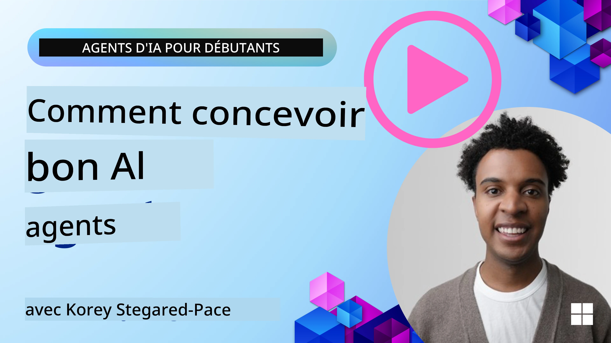
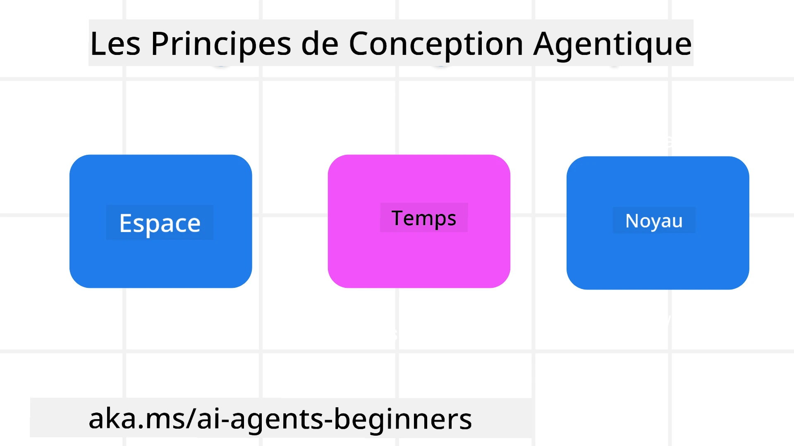

> _(Cliquez sur l'image ci-dessus pour voir la vidéo de cette leçon)_
# Principes de conception des agents IA

## Introduction

Il existe de nombreuses façons de penser la construction des systèmes IA agents. Puisque l'ambiguïté est une caractéristique et non un bug dans la conception de l'IA générative, il est parfois difficile pour les ingénieurs de savoir par où commencer. Nous avons créé un ensemble de principes de conception UX centrés sur l'humain pour permettre aux développeurs de construire des systèmes agents centrés sur le client afin de répondre à leurs besoins métier. Ces principes de conception ne constituent pas une architecture prescriptive, mais plutôt un point de départ pour les équipes qui définissent et développent des expériences agents.

En général, les agents devraient :

- Élargir et étendre les capacités humaines (brainstorming, résolution de problèmes, automatisation, etc.)
- Combler les lacunes de connaissances (me mettre à jour sur des domaines de connaissances, traduction, etc.)
- Faciliter et soutenir la collaboration selon les façons dont nous, en tant qu'individus, préférons travailler avec les autres
- Faire de nous de meilleures versions de nous-mêmes (par ex., coach de vie/gestionnaire de tâches, nous aidant à apprendre la régulation émotionnelle et la pleine conscience, développer la résilience, etc.)

## Cette leçon couvrira

- Quels sont les principes de conception des agents
- Quelles sont les consignes à suivre lors de la mise en œuvre de ces principes de conception
- Quels sont quelques exemples d’utilisation de ces principes de conception

## Objectifs d’apprentissage

Après avoir suivi cette leçon, vous serez capable de :

1. Expliquer ce que sont les principes de conception des agents
2. Expliquer les consignes pour utiliser les principes de conception des agents
3. Comprendre comment construire un agent en utilisant les principes de conception des agents

## Les principes de conception des agents

### Agent (Espace)

C'est l’environnement dans lequel l'agent opère. Ces principes informent la façon dont nous concevons des agents pour interagir dans les mondes physiques et numériques.

- **Connecter, ne pas écraser** – aider à connecter les personnes entre elles, aux événements et aux connaissances exploitables afin de permettre collaboration et connexion.
- Les agents aident à connecter événements, connaissances, et personnes.
- Les agents rapprochent les personnes. Ils ne sont pas conçus pour remplacer ou diminuer les humains.
- **Facilement accessible mais parfois invisible** – l'agent opère majoritairement en arrière-plan et ne nous sollicite que lorsque cela est pertinent et approprié.
  - L’agent est facilement découvrable et accessible pour les utilisateurs autorisés sur n’importe quel appareil ou plateforme.
  - L’agent supporte des entrées et sorties multimodales (son, voix, texte, etc.).
  - L’agent peut passer sans effort de l’avant-plan à l’arrière-plan ; entre modes proactif et réactif, selon sa perception des besoins de l’utilisateur.
  - L’agent peut opérer sous une forme invisible, mais son processus en arrière-plan et sa collaboration avec d’autres agents sont transparents et contrôlables par l’utilisateur.

### Agent (Temps)

C’est la façon dont l’agent agit dans le temps. Ces principes informent la conception d’agents interagissant au travers du passé, présent et futur.

- **Passé** : Réflexion sur un historique incluant état et contexte.
  - L’agent fournit des résultats plus pertinents basés sur l’analyse de données historiques riches, au-delà de l’événement, des personnes ou États seuls.
  - L’agent crée des connexions à partir d’événements passés et réfléchit activement à la mémoire pour s’engager dans les situations actuelles.
- **Maintenant** : Encourager plus que simplement notifier.
  - L’agent incarne une approche globale de l’interaction avec les personnes. Lorsqu’un événement survient, l’agent va au-delà de la simple notification statique ou autre forme statique formelle. L’agent peut simplifier les flux ou générer dynamiquement des signaux pour diriger l’attention de l’utilisateur au bon moment.
  - L’agent délivre des informations basées sur le contexte environnemental, les changements sociaux et culturels, adaptées à l’intention de l’utilisateur.
  - L’interaction avec l'agent peut être graduelle, évoluer et croître en complexité pour autonomiser les utilisateurs à long terme.
- **Futur** : S’adapter et évoluer.
  - L’agent s’adapte à divers appareils, plateformes et modalités.
  - L’agent s’adapte au comportement de l’utilisateur, aux besoins d’accessibilité, et est librement personnalisable.
  - L’agent est façonné par et évolue au travers d’interactions utilisateur continues.

### Agent (Cœur)

Ce sont les éléments clés au cœur de la conception d’un agent.

- **Accepter l’incertitude tout en établissant la confiance**.
  - Un certain niveau d’incertitude de l’agent est attendu. L’incertitude est un élément clé de la conception des agents.
  - La confiance et la transparence sont des couches fondamentales de la conception de l’agent.
  - Les humains contrôlent quand l’agent est activé/désactivé et l’état de l’agent est clairement visible en permanence.

## Les consignes pour mettre en œuvre ces principes

Lorsque vous utilisez ces principes de conception, appliquez les consignes suivantes :

1. **Transparence** : Informez l’utilisateur que de l’IA est impliquée, comment elle fonctionne (y compris les actions passées), et comment donner un retour et modifier le système.
2. **Contrôle** : Permettez à l’utilisateur de personnaliser, spécifier ses préférences, personnaliser, et contrôler le système et ses attributs (y compris la capacité d’oublier).
3. **Cohérence** : Visez des expériences multimodales cohérentes à travers appareils et points de contact. Utilisez des éléments UI/UX familiers quand possible (par ex. icône micro pour interaction vocale) et réduisez la charge cognitive du client autant que possible (par ex. réponses concises, aides visuelles et contenu ‘En savoir plus’).

## Comment concevoir un agent de voyage avec ces principes et consignes

Imaginez que vous concevez un agent de voyage, voici comment vous pourriez penser à utiliser les principes de conception et consignes :

1. **Transparence** – Informez clairement que l’agent de voyage est un agent assisté par IA. Fournissez des instructions de base pour commencer (par ex., message de “Bonjour”, exemples de questions). Documentez cela clairement sur la page produit. Affichez la liste des requêtes que l’utilisateur a faites précédemment. Indiquez clairement comment donner un retour (pouce levé/baissé, bouton Envoyer un retour, etc.). Précisez s’il y a des restrictions d’utilisation ou de sujet.
2. **Contrôle** – Assurez-vous que l’utilisateur sait comment modifier l’agent après création via des éléments comme le prompt système. Permettez à l’utilisateur de choisir le niveau de détail de l’agent, son style d’écriture, et les sujets qu’il ne doit pas aborder. Permettez-lui de voir et supprimer tous fichiers ou données, prompts, et conversations passées associés.
3. **Cohérence** – Vérifiez que les icônes pour partager un prompt, ajouter un fichier ou une photo, et taguer quelqu’un ou quelque chose sont standard et reconnaissables. Utilisez l’icône trombone pour indiquer l’envoi/partage de fichiers avec l’agent, et une icône image pour l’envoi de graphiques.

## Exemples de codes

- Python : [Agent Framework](./code_samples/03-python-agent-framework.ipynb)
- .NET : [Agent Framework](./code_samples/03-dotnet-agent-framework.md)

## Vous avez d’autres questions sur les modèles de conception d’agents IA ?

Rejoignez le [Microsoft Foundry Discord](https://discord.com/invite/ATgtXmAS5D) pour rencontrer d’autres apprenants, participer aux heures de bureau et obtenir des réponses à vos questions sur les agents IA.

## Ressources supplémentaires

- <a href="https://openai.com" target="_blank">Pratiques pour gouverner les systèmes IA agents | OpenAI</a>
- <a href="https://microsoft.com" target="_blank">Le projet HAX Toolkit - Microsoft Research</a>
- <a href="https://responsibleaitoolbox.ai" target="_blank">Boîte à outils IA responsable</a>

## Leçon précédente

[Exploration des cadres agents](../02-explore-agentic-frameworks/README.md)

## Leçon suivante

[Modèle de conception pour l’usage d’outils](../04-tool-use/README.md)

---

<!-- CO-OP TRANSLATOR DISCLAIMER START -->
**Avertissement** :
Ce document a été traduit à l'aide du service de traduction automatique [Co-op Translator](https://github.com/Azure/co-op-translator). Bien que nous nous efforçions d'assurer l'exactitude, veuillez noter que les traductions automatisées peuvent contenir des erreurs ou des inexactitudes. Le document original dans sa langue native doit être considéré comme la source faisant autorité. Pour les informations critiques, il est recommandé de recourir à une traduction professionnelle réalisée par un humain. Nous ne saurions être tenus responsables des malentendus ou erreurs d'interprétation découlant de l'utilisation de cette traduction.
<!-- CO-OP TRANSLATOR DISCLAIMER END -->