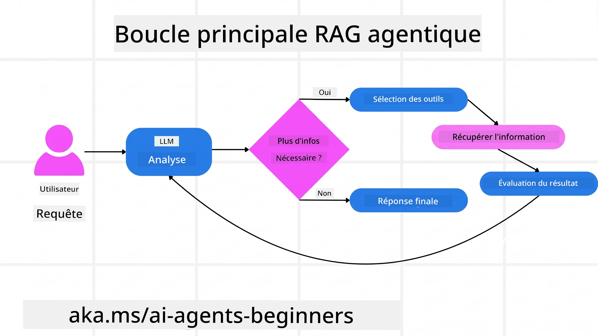
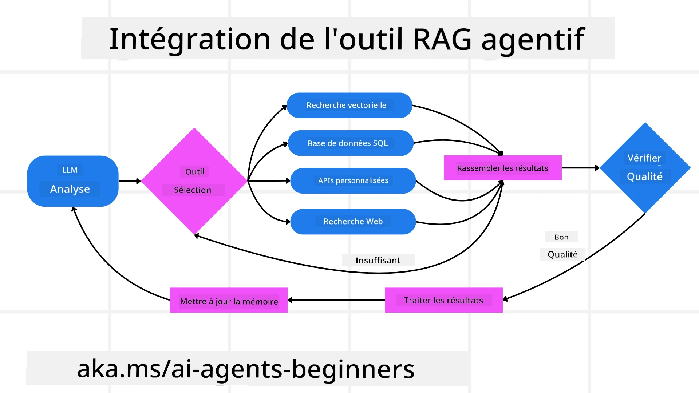
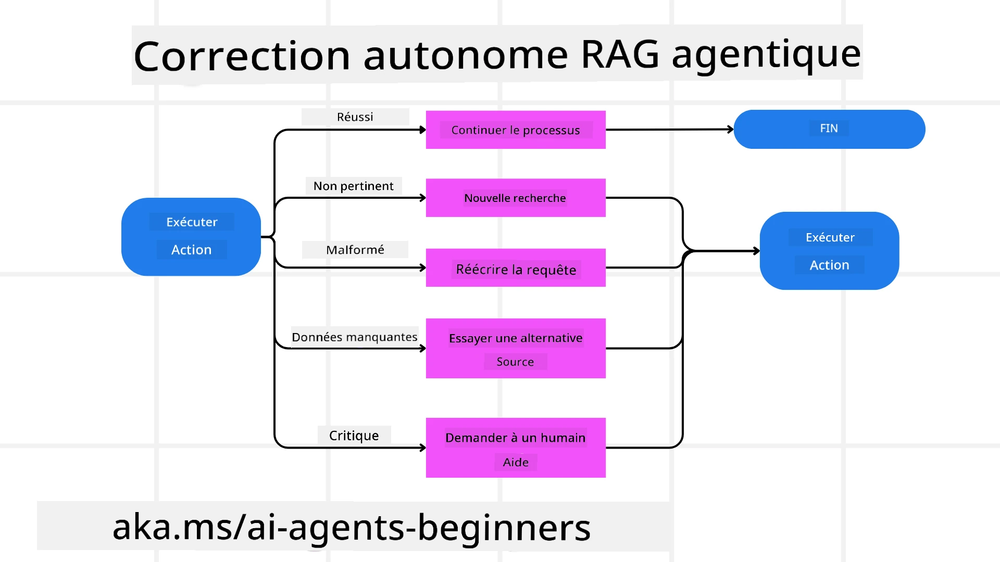
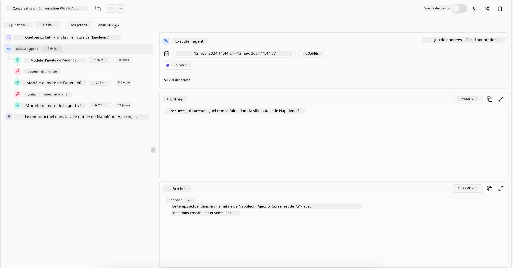

> _(Cliquez sur l’image ci-dessus pour voir la vidéo de cette leçon)_

# Agentic RAG

Cette leçon offre une vue d’ensemble complète de l’Agentic Retrieval-Augmented Generation (Agentic RAG), un paradigme émergent en IA où les grands modèles de langage (LLM) planifient de manière autonome leurs prochaines étapes tout en extrayant des informations de sources externes. Contrairement aux modèles statiques de récupération puis lecture, Agentic RAG implique des appels itératifs au LLM, entrecoupés d’appels à des outils ou fonctions et de sorties structurées. Le système évalue les résultats, affine les requêtes, invoque des outils supplémentaires si nécessaire, et continue ce cycle jusqu’à obtenir une solution satisfaisante.

## Introduction

Cette leçon abordera

- **Comprendre Agentic RAG:** Découvrez le paradigme émergent en IA où les grands modèles de langage (LLM) planifient de manière autonome leurs prochaines étapes tout en extrayant des informations de sources de données externes.
- **Maîtriser le style itératif Maker-Checker:** Comprenez la boucle d’appels itératifs au LLM, entrecoupés d’appels à des outils ou fonctions et de sorties structurées, conçue pour améliorer la justesse et gérer les requêtes mal formées.
- **Explorer des applications pratiques:** Identifiez des scénarios où Agentic RAG brille, tels que des environnements axés sur la justesse, des interactions complexes avec des bases de données et des workflows étendus.

## Objectifs d’apprentissage

Après avoir terminé cette leçon, vous saurez/comment comprendre :

- **Compréhension d’Agentic RAG:** Apprenez le paradigme émergent en IA où les grands modèles de langage (LLM) planifient de manière autonome leurs prochaines étapes tout en extrayant des informations de sources de données externes.
- **Style itératif Maker-Checker:** Maîtrisez le concept d’une boucle d’appels itératifs au LLM, entrecoupés d’appels à des outils ou fonctions et de sorties structurées, conçue pour améliorer la justesse et gérer les requêtes mal formées.
- **Posséder le processus de raisonnement:** Comprenez la capacité du système à posséder son propre processus de raisonnement, en prenant des décisions sur la façon d’aborder les problèmes sans s’appuyer sur des chemins prédéfinis.
- **Flux de travail:** Comprenez comment un modèle agentique décide de manière autonome de récupérer des rapports de tendances du marché, identifier des données concurrentielles, corréler des métriques de ventes internes, synthétiser les résultats et évaluer la stratégie.
- **Boucles itératives, intégration d’outils et mémoire:** Apprenez comment le système s’appuie sur un modèle d’interaction en boucle, en maintenant un état et une mémoire à travers les étapes pour éviter les boucles répétitives et prendre des décisions éclairées.
- **Gestion des modes d’échec et auto-correction:** Explorez les mécanismes robustes d’auto-correction du système, incluant l’itération et la nouvelle requête, l’utilisation d’outils de diagnostic et le recours à la supervision humaine.
- **Limites de l’agentivité:** Comprenez les limites d’Agentic RAG, centrées sur l’autonomie spécifique à un domaine, la dépendance à l’infrastructure et le respect des garde-fous.
- **Cas d’usage pratiques et valeur:** Identifiez des scénarios où Agentic RAG excelle, tels que des environnements axés sur la justesse, des interactions complexes avec des bases de données et des workflows étendus.
- **Gouvernance, transparence et confiance:** Apprenez l’importance de la gouvernance et de la transparence, incluant le raisonnement explicable, le contrôle des biais et la supervision humaine.

## Qu’est-ce qu’Agentic RAG ?

Agentic Retrieval-Augmented Generation (Agentic RAG) est un paradigme émergent en IA où les grands modèles de langage (LLM) planifient de manière autonome leurs prochaines étapes tout en extrayant des informations de sources externes. Contrairement aux modèles statiques de récupération puis lecture, Agentic RAG implique des appels itératifs au LLM, entrecoupés d’appels à des outils ou fonctions et de sorties structurées. Le système évalue les résultats, affine les requêtes, invoque des outils supplémentaires si nécessaire, et continue ce cycle jusqu’à obtenir une solution satisfaisante. Ce style itératif de type « maker-checker » améliore la justesse, gère les requêtes mal formées et garantit des résultats de haute qualité.

Le système possède activement son processus de raisonnement, réécrit les requêtes échouées, choisit des méthodes de récupération différentes et intègre plusieurs outils — tels que la recherche vectorielle dans Azure AI Search, les bases de données SQL ou des API personnalisées — avant de finaliser sa réponse. La qualité distinctive d’un système agentique est sa capacité à posséder son processus de raisonnement. Les implémentations traditionnelles de RAG reposent sur des chemins prédéfinis, mais un système agentique détermine de manière autonome la séquence des étapes en fonction de la qualité des informations qu’il trouve.

## Définition d’Agentic Retrieval-Augmented Generation (Agentic RAG)

Agentic Retrieval-Augmented Generation (Agentic RAG) est un paradigme émergent dans le développement de l’IA où les LLM non seulement extraient des informations de sources de données externes, mais planifient également de manière autonome leurs prochaines étapes. Contrairement aux modèles statiques de récupération puis lecture ou aux séquences de prompt soigneusement scriptées, Agentic RAG implique une boucle d’appels itératifs au LLM, entrecoupés d’appels à des outils ou fonctions et de sorties structurées. À chaque étape, le système évalue les résultats obtenus, décide s’il faut affiner ses requêtes, invoque des outils supplémentaires si nécessaire, et poursuit ce cycle jusqu’à obtenir une solution satisfaisante.

Ce style itératif de fonctionnement « maker-checker » est conçu pour améliorer la justesse, gérer les requêtes mal formées aux bases de données structurées (par ex. NL2SQL) et assurer des résultats équilibrés et de haute qualité. Plutôt que de s’appuyer uniquement sur des chaînes de prompt soigneusement conçues, le système possède activement son processus de raisonnement. Il peut réécrire les requêtes qui échouent, choisir différentes méthodes de récupération, et intégrer plusieurs outils — tels que la recherche vectorielle dans Azure AI Search, les bases de données SQL ou des API personnalisées — avant de finaliser sa réponse. Cela élimine le besoin de cadres d’orchestration complexes. À la place, une boucle relativement simple « appel LLM → usage d’un outil → appel LLM → … » peut produire des sorties sophistiquées et bien étayées.

## Posséder le processus de raisonnement

La qualité distinctive qui rend un système « agentique » est sa capacité à posséder son processus de raisonnement. Les implémentations traditionnelles de RAG dépendent souvent de la définition préalable par des humains d’un chemin pour le modèle : une chaîne de pensée qui décrit ce qu’il faut récupérer et quand.

Mais lorsqu’un système est vraiment agentique, il décide en interne comment aborder le problème. Il n’exécute pas simplement un script ; il détermine de manière autonome la séquence des étapes en fonction de la qualité des informations qu’il trouve.

Par exemple, s’il est chargé de créer une stratégie de lancement produit, il ne s’appuie pas uniquement sur un prompt décrivant entièrement le flux de recherche et de prise de décision. Au lieu de cela, le modèle agentique décide indépendamment de :

1. Récupérer des rapports de tendances actuelles du marché via Bing Web Grounding
2. Identifier des données pertinentes sur la concurrence via Azure AI Search.
3.	Mettre en corrélation des métriques internes historiques de ventes via Azure SQL Database.
4. Synthétiser les résultats en une stratégie cohérente orchestrée via Azure OpenAI Service.
5.	Évaluer la stratégie à la recherche de lacunes ou d’incohérences, lançant une nouvelle phase de récupération si nécessaire.

Toutes ces étapes — affiner les requêtes, choisir les sources, itérer jusqu’à être « satisfait » de la réponse — sont décidées par le modèle, non pré-scriptées par un humain.

## Boucles itératives, intégration d’outils, et mémoire

Un système agentique s’appuie sur un modèle d’interaction en boucle :

- **Appel initial :** L’objectif de l’utilisateur (c’est-à-dire le prompt utilisateur) est présenté au LLM.
- **Invocation d’outil :** Si le modèle détecte des informations manquantes ou des instructions ambiguës, il sélectionne un outil ou une méthode de récupération — comme une requête dans une base de données vectorielle (par ex. recherche hybride Azure AI Search sur des données privées) ou un appel structuré SQL — pour recueillir plus de contexte.
- **Évaluation & Affinement :** Après avoir examiné les données retournées, le modèle décide si l’information est suffisante. Sinon, il affine la requête, essaie un autre outil ou ajuste son approche.
- **Répéter jusqu’à satisfaction :** Ce cycle continue jusqu’à ce que le modèle estime disposer de suffisamment de clarté et de preuves pour fournir une réponse finale bien raisonnée.
- **Mémoire & État :** Parce que le système maintient un état et une mémoire tout au long des étapes, il peut se souvenir des tentatives précédentes et de leurs résultats, évitant des boucles répétitives et prenant des décisions plus éclairées à mesure qu’il avance.

Avec le temps, ceci crée un sentiment de compréhension évolutive, permettant au modèle de naviguer des tâches complexes à étapes multiples sans nécessiter l’intervention humaine constante ni la reformulation du prompt.

## Gestion des modes d’échec et auto-correction

L’autonomie d’Agentic RAG implique également des mécanismes robustes d’auto-correction. Lorsque le système atteint des impasses — comme la récupération de documents non pertinents ou la rencontre de requêtes mal formées — il peut :

- **Itérer et re-questionner :** Plutôt que de fournir des réponses de faible valeur, le modèle tente de nouvelles stratégies de recherche, réécrit les requêtes de base de données ou consulte des ensembles de données alternatifs.
- **Utiliser des outils de diagnostic :** Le système peut invoquer des fonctions supplémentaires conçues pour l’aider à déboguer ses étapes de raisonnement ou confirmer la justesse des données récupérées. Des outils comme Azure AI Tracing seront importants pour garantir une observabilité et une surveillance robustes.
- **Recourir à la supervision humaine :** Pour des scénarios à fort enjeu ou à échec récurrent, le modèle peut signaler une incertitude et demander une orientation humaine. Une fois que l’humain fournit un retour correctif, le modèle peut intégrer cette leçon pour la suite.

Cette approche itérative et dynamique permet au modèle de s’améliorer continuellement, garantissant qu’il ne s’agit pas d’un système à tir unique, mais d’un système qui apprend de ses erreurs au cours d’une session donnée.

## Limites de l’agentivité

Malgré son autonomie dans une tâche, Agentic RAG n’est pas équivalent à une intelligence artificielle générale. Ses capacités « agentiques » sont confinées aux outils, sources de données et politiques fournies par les développeurs humains. Il ne peut pas inventer ses propres outils ni dépasser les limites du domaine qui lui sont fixées. En revanche, il excelle à orchestrer dynamiquement les ressources disponibles.

Les principales différences avec des formes d’IA plus avancées sont :

1. **Autonomie spécifique au domaine :** Les systèmes Agentic RAG se concentrent sur l’atteinte d’objectifs définis par l’utilisateur dans un domaine connu, employant des stratégies comme la réécriture de requêtes ou la sélection d’outils pour améliorer les résultats.
2. **Dépendance à l’infrastructure :** Les capacités du système dépendent des outils et des données intégrés par les développeurs. Il ne peut pas dépasser ces limites sans intervention humaine.
3. **Respect des garde-fous :** Les directives éthiques, règles de conformité et politiques d’entreprise restent très importantes. La liberté de l’agent est toujours contrainte par des mesures de sécurité et des mécanismes de supervision (espérons-le ?)

## Cas d’usage pratiques et valeur

Agentic RAG excelle dans les scénarios nécessitant raffinement itératif et précision :

1. **Environnements axés sur la justesse :** Lors de contrôles de conformité, d’analyses réglementaires ou de recherches juridiques, le modèle agentique peut vérifier les faits à plusieurs reprises, consulter plusieurs sources et réécrire les requêtes jusqu’à produire une réponse rigoureusement validée.
2. **Interactions complexes avec bases de données :** Lorsqu’il s’agit de données structurées dans lesquelles les requêtes peuvent souvent échouer ou nécessiter des ajustements, le système peut affiner de manière autonome ses requêtes utilisant Azure SQL ou Microsoft Fabric OneLake, garantissant que la récupération finale correspond à l’intention de l’utilisateur.
3. **Workflows étendus :** Les sessions de longue durée peuvent évoluer au fil de nouvelles informations. Agentic RAG peut continuellement incorporer de nouvelles données, adaptant ses stratégies au fur et à mesure qu’il en apprend davantage sur le problème.

## Gouvernance, transparence et confiance

À mesure que ces systèmes deviennent plus autonomes dans leur raisonnement, la gouvernance et la transparence sont cruciales :

- **Raisonnement explicable :** Le modèle peut fournir une piste d’audit des requêtes qu’il a effectuées, des sources consultées et des étapes de raisonnement suivies pour parvenir à sa conclusion. Des outils comme Azure AI Content Safety et Azure AI Tracing / GenAIOps peuvent aider à maintenir la transparence et atténuer les risques.
- **Contrôle des biais et récupération équilibrée :** Les développeurs peuvent ajuster les stratégies de récupération pour assurer que des sources de données équilibrées et représentatives soient prises en compte, et auditer régulièrement les sorties afin de détecter biais ou modèles faussés en utilisant des modèles personnalisés pour des organisations avancées en data science utilisant Azure Machine Learning.
- **Supervision humaine et conformité :** Pour les tâches sensibles, la revue humaine reste essentielle. Agentic RAG ne remplace pas le jugement humain dans les décisions à fort enjeu — il le complète en fournissant des options plus rigoureusement validées.

Disposer d’outils qui fournissent un enregistrement clair des actions est essentiel. Sans eux, le débogage d’un processus multi-étapes peut être très difficile. Voir l’exemple suivant de Literal AI (entreprise derrière Chainlit) pour un Agent run :

## Conclusion

Agentic RAG représente une évolution naturelle dans la manière dont les systèmes d’IA gèrent des tâches complexes et intensives en données. En adoptant un modèle d’interaction en boucle, en sélectionnant de manière autonome les outils et en affinant les requêtes jusqu’à atteindre un résultat de haute qualité, le système dépasse l’exécution statique de prompts pour devenir un décideur plus adaptatif et conscient du contexte. Bien que toujours limité par des infrastructures et des directives éthiques définies par l’humain, ces capacités agentiques permettent des interactions IA plus riches, dynamiques et, en fin de compte, plus utiles pour les entreprises et les utilisateurs finaux.

### Vous avez d’autres questions sur Agentic RAG ?

Rejoignez le [Microsoft Foundry Discord](https://discord.com/invite/ATgtXmAS5D) pour rencontrer d’autres apprenants, participer aux heures de bureau et obtenir des réponses à vos questions sur les agents IA.

## Ressources complémentaires

- <a href="https://learn.microsoft.com/training/modules/use-own-data-azure-openai" target="_blank">Implémentez Retrieval Augmented Generation (RAG) avec Azure OpenAI Service : Apprenez à utiliser vos propres données avec Azure OpenAI Service. Ce module Microsoft Learn offre un guide complet sur la mise en œuvre de RAG</a>
- <a href="https://learn.microsoft.com/azure/ai-studio/concepts/evaluation-approach-gen-ai" target="_blank">Évaluation des applications d’IA générative avec Microsoft Foundry : Cet article couvre l’évaluation et la comparaison des modèles sur des ensembles de données publics, incluant les applications Agentic AI et les architectures RAG</a>
- <a href="https://weaviate.io/blog/what-is-agentic-rag" target="_blank">Qu’est-ce qu’Agentic RAG | Weaviate</a>
- <a href="https://ragaboutit.com/agentic-rag-a-complete-guide-to-agent-based-retrieval-augmented-generation/" target="_blank">Agentic RAG : Guide complet sur l’agent basé sur Retrieval Augmented Generation – News from generation RAG</a>
- <a href="https://huggingface.co/learn/cookbook/agent_rag" target="_blank">Agentic RAG : dynamisez votre RAG avec la reformulation de requêtes et l’auto-requête ! Recueil open-source d’IA de Hugging Face</a>
- <a href="https://youtu.be/aQ4yQXeB1Ss?si=2HUqBzHoeB5tR04U" target="_blank">Ajout de couches agentiques à RAG</a>
- <a href="https://www.youtube.com/watch?v=zeAyuLc_f3Q&t=244s" target="_blank">Le futur des assistants de connaissance : Jerry Liu</a>
- <a href="https://www.youtube.com/watch?v=AOSjiXP1jmQ" target="_blank">Comment construire des systèmes RAG agentiques</a>
- <a href="https://ignite.microsoft.com/sessions/BRK102?source=sessions" target="_blank">Utiliser le service Microsoft Foundry Agent pour étendre vos agents IA</a>

### Articles académiques

- <a href="https://arxiv.org/abs/2303.17651" target="_blank">2303.17651 Self-Refine : Raffinement itératif avec auto-retour</a>
- <a href="https://arxiv.org/abs/2303.11366" target="_blank">2303.11366 Reflexion : Agents linguistiques avec apprentissage par renforcement verbal</a>
- <a href="https://arxiv.org/abs/2305.11738" target="_blank">2305.11738 CRITIC : Les grands modèles linguistiques peuvent s’auto-corriger avec une critique interactive via outil</a>
- <a href="https://arxiv.org/abs/2501.09136" target="_blank">2501.09136 Agentic Retrieval-Augmented Generation : Enquête sur Agentic RAG</a>

## Leçon précédente

[Modèle de conception d’utilisation d’outil](../04-tool-use/README.md)

## Leçon suivante

[Construire des agents IA fiables](../06-building-trustworthy-agents/README.md)

---

<!-- CO-OP TRANSLATOR DISCLAIMER START -->
**Avertissement** :
Ce document a été traduit à l'aide du service de traduction automatique [Co-op Translator](https://github.com/Azure/co-op-translator). Bien que nous nous efforçions d'assurer l'exactitude, veuillez noter que les traductions automatisées peuvent contenir des erreurs ou des inexactitudes. Le document original dans sa langue native doit être considéré comme la source faisant autorité. Pour les informations critiques, il est recommandé de recourir à une traduction professionnelle réalisée par un humain. Nous ne saurions être tenus responsables des malentendus ou erreurs d'interprétation découlant de l'utilisation de cette traduction.
<!-- CO-OP TRANSLATOR DISCLAIMER END -->