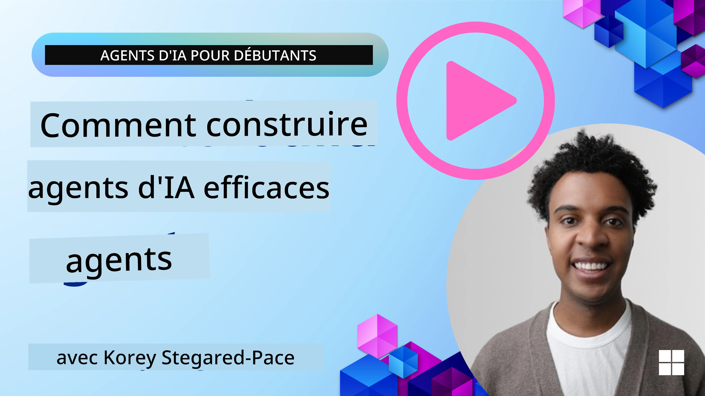
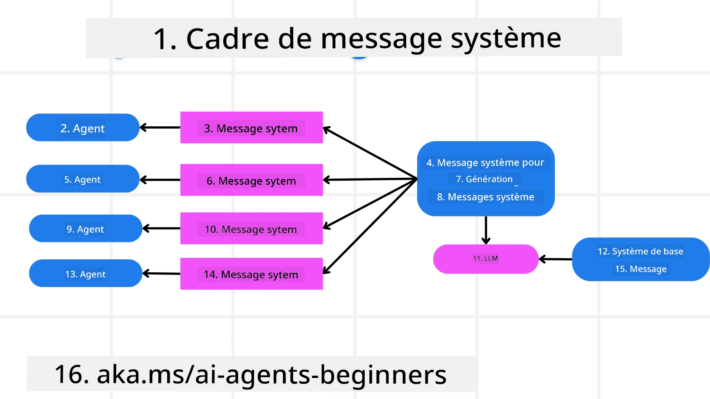
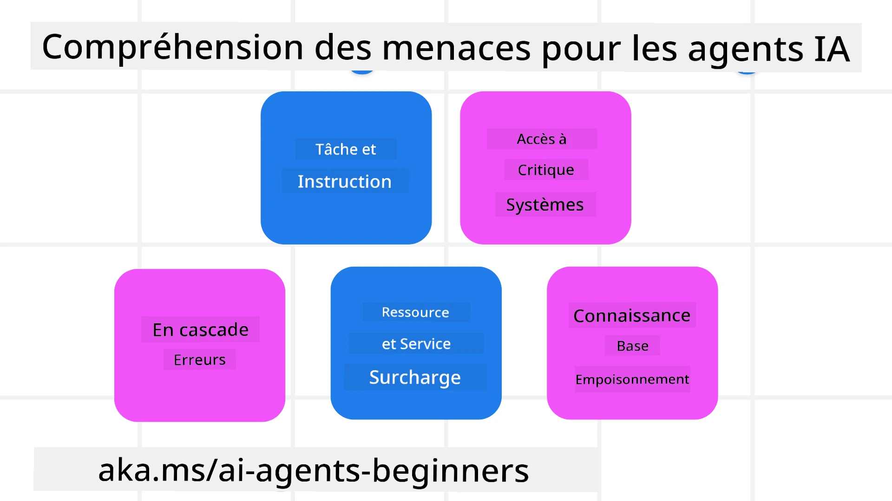
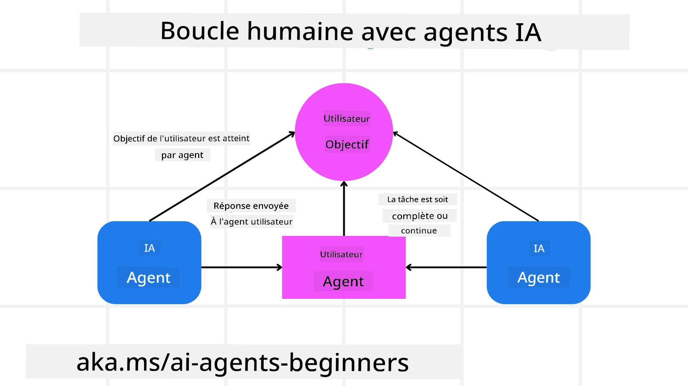

[](https://youtu.be/iZKkMEGBCUQ?si=Q-kEbcyHUMPoHp8L)

> _(Cliquez sur l'image ci‑dessus pour regarder la vidéo de cette leçon)_

# Construire des agents d'IA fiables

## Introduction

Cette leçon couvrira :

- Comment concevoir et déployer des agents d'IA sûrs et efficaces
- Les considérations importantes de sécurité lors du développement d'agents d'IA.
- Comment préserver la confidentialité des données et des utilisateurs lors du développement d'agents d'IA.

## Learning Goals

Après avoir terminé cette leçon, vous saurez :

- Identifier et atténuer les risques lors de la création d'agents d'IA.
- Mettre en œuvre des mesures de sécurité pour garantir une gestion appropriée des données et des accès.
- Créer des agents d'IA qui préservent la confidentialité des données et offrent une expérience utilisateur de qualité.

## Sécurité

Examinons d'abord comment construire des applications agentiques sûres. La sécurité signifie que l'agent d'IA fonctionne comme prévu. En tant que concepteurs d'applications agentiques, nous disposons de méthodes et d'outils pour maximiser la sécurité :

### Construire un cadre de message système

Si vous avez déjà construit une application d'IA utilisant des modèles de langage de grande taille (LLMs), vous connaissez l'importance de concevoir un prompt système ou message système solide. Ces prompts établissent les règles méta, les instructions et les directives sur la façon dont le LLM va interagir avec l'utilisateur et les données.

Pour les agents d'IA, le prompt système est encore plus important car les agents d'IA auront besoin d'instructions très spécifiques pour accomplir les tâches que nous leur avons attribuées.

Pour créer des prompts système évolutifs, nous pouvons utiliser un cadre de messages système pour construire un ou plusieurs agents dans notre application :



#### Étape 1 : Créer un message système méta 

Le méta-prompt sera utilisé par un LLM pour générer les prompts système des agents que nous créons. Nous le concevons comme un modèle afin de pouvoir créer efficacement plusieurs agents si nécessaire.

Voici un exemple de message système méta que nous donnerions au LLM :

```plaintext
You are an expert at creating AI agent assistants. 
You will be provided a company name, role, responsibilities and other
information that you will use to provide a system prompt for.
To create the system prompt, be descriptive as possible and provide a structure that a system using an LLM can better understand the role and responsibilities of the AI assistant. 
```

#### Étape 2 : Créer un prompt de base

L'étape suivante consiste à créer un prompt de base pour décrire l'agent d'IA. Vous devez inclure le rôle de l'agent, les tâches que l'agent accomplira et toutes les autres responsabilités de l'agent.

Voici un exemple :

```plaintext
You are a travel agent for Contoso Travel that is great at booking flights for customers. To help customers you can perform the following tasks: lookup available flights, book flights, ask for preferences in seating and times for flights, cancel any previously booked flights and alert customers on any delays or cancellations of flights.  
```

#### Étape 3 : Fournir le message système de base au LLM

Nous pouvons maintenant optimiser ce message système en fournissant le message système méta comme message système, ainsi que notre message système de base.

Cela produira un message système mieux conçu pour guider nos agents d'IA :

```markdown
**Company Name:** Contoso Travel  
**Role:** Travel Agent Assistant

**Objective:**  
You are an AI-powered travel agent assistant for Contoso Travel, specializing in booking flights and providing exceptional customer service. Your main goal is to assist customers in finding, booking, and managing their flights, all while ensuring that their preferences and needs are met efficiently.

**Key Responsibilities:**

1. **Flight Lookup:**
    
    - Assist customers in searching for available flights based on their specified destination, dates, and any other relevant preferences.
    - Provide a list of options, including flight times, airlines, layovers, and pricing.
2. **Flight Booking:**
    
    - Facilitate the booking of flights for customers, ensuring that all details are correctly entered into the system.
    - Confirm bookings and provide customers with their itinerary, including confirmation numbers and any other pertinent information.
3. **Customer Preference Inquiry:**
    
    - Actively ask customers for their preferences regarding seating (e.g., aisle, window, extra legroom) and preferred times for flights (e.g., morning, afternoon, evening).
    - Record these preferences for future reference and tailor suggestions accordingly.
4. **Flight Cancellation:**
    
    - Assist customers in canceling previously booked flights if needed, following company policies and procedures.
    - Notify customers of any necessary refunds or additional steps that may be required for cancellations.
5. **Flight Monitoring:**
    
    - Monitor the status of booked flights and alert customers in real-time about any delays, cancellations, or changes to their flight schedule.
    - Provide updates through preferred communication channels (e.g., email, SMS) as needed.

**Tone and Style:**

- Maintain a friendly, professional, and approachable demeanor in all interactions with customers.
- Ensure that all communication is clear, informative, and tailored to the customer's specific needs and inquiries.

**User Interaction Instructions:**

- Respond to customer queries promptly and accurately.
- Use a conversational style while ensuring professionalism.
- Prioritize customer satisfaction by being attentive, empathetic, and proactive in all assistance provided.

**Additional Notes:**

- Stay updated on any changes to airline policies, travel restrictions, and other relevant information that could impact flight bookings and customer experience.
- Use clear and concise language to explain options and processes, avoiding jargon where possible for better customer understanding.

This AI assistant is designed to streamline the flight booking process for customers of Contoso Travel, ensuring that all their travel needs are met efficiently and effectively.

```

#### Étape 4 : Itérer et améliorer

La valeur de ce cadre de messages système est de pouvoir faciliter la création de messages système pour plusieurs agents et d'améliorer vos messages système au fil du temps. Il est rare qu'un message système fonctionne parfaitement dès la première itération pour votre cas d'utilisation complet. Pouvoir apporter de petites modifications et améliorations en changeant le message système de base et en le faisant passer dans le système vous permettra de comparer et d'évaluer les résultats.

## Comprendre les menaces

Pour construire des agents d'IA fiables, il est important de comprendre et d'atténuer les risques et menaces pesant sur votre agent d'IA. Voyons quelques-unes des différentes menaces pour les agents d'IA et comment mieux planifier et s'y préparer.



### Tâche et instruction

**Description :** Les attaquants tentent de modifier les instructions ou les objectifs de l'agent d'IA par le biais de prompts ou en manipulant les entrées.

**Atténuation :** Effectuez des contrôles de validation et des filtres d'entrée pour détecter les prompts potentiellement dangereux avant qu'ils ne soient traités par l'agent d'IA. Comme ces attaques nécessitent généralement des interactions fréquentes avec l'agent, limiter le nombre de tours dans une conversation est une autre façon de prévenir ce type d'attaques.

### Accès aux systèmes critiques

**Description :** Si un agent d'IA a accès à des systèmes et services qui stockent des données sensibles, des attaquants peuvent compromettre la communication entre l'agent et ces services. Il peut s'agir d'attaques directes ou de tentatives indirectes d'obtenir des informations sur ces systèmes via l'agent.

**Atténuation :** Les agents d'IA ne devraient avoir accès aux systèmes que sur la base du besoin pour prévenir ce type d'attaques. La communication entre l'agent et le système doit également être sécurisée. La mise en place d'authentification et de contrôles d'accès est une autre façon de protéger ces informations.

### Surcharge des ressources et services

**Description :** Les agents d'IA peuvent accéder à différents outils et services pour accomplir des tâches. Les attaquants peuvent exploiter cette capacité pour attaquer ces services en envoyant un volume élevé de requêtes via l'agent d'IA, ce qui peut entraîner des pannes système ou des coûts élevés.

**Atténuation :** Mettez en place des politiques pour limiter le nombre de requêtes qu'un agent d'IA peut adresser à un service. Limiter le nombre de tours de conversation et de requêtes adressées à votre agent d'IA est une autre façon de prévenir ce type d'attaques.

### Empoisonnement de la base de connaissances

**Description :** Ce type d'attaque ne cible pas directement l'agent d'IA mais vise la base de connaissances et d'autres services que l'agent d'IA utilisera. Cela peut impliquer la corruption des données ou informations que l'agent d'IA utilisera pour accomplir une tâche, ce qui peut conduire à des réponses biaisées ou non intentionnelles envers l'utilisateur.

**Atténuation :** Effectuez des vérifications régulières des données que l'agent d'IA utilisera dans ses workflows. Assurez-vous que l'accès à ces données est sécurisé et que seules des personnes de confiance peuvent les modifier afin d'éviter ce type d'attaque.

### Erreurs en cascade

**Description :** Les agents d'IA accèdent à divers outils et services pour accomplir des tâches. Les erreurs causées par des attaquants peuvent entraîner des défaillances d'autres systèmes auxquels l'agent d'IA est connecté, rendant l'attaque plus étendue et plus difficile à diagnostiquer.

**Atténuation :** Une méthode pour éviter cela est de faire fonctionner l'agent d'IA dans un environnement limité, par exemple en exécutant les tâches dans un conteneur Docker, afin de prévenir les attaques directes sur le système. La création de mécanismes de secours et d'une logique de nouvelle tentative lorsque certains systèmes répondent par une erreur est une autre façon d'éviter des défaillances plus larges du système.

## Humain dans la boucle

Une autre manière efficace de construire des systèmes d'agents d'IA fiables est d'utiliser un humain dans la boucle. Cela crée un flux où les utilisateurs peuvent fournir des retours aux agents pendant l'exécution. Les utilisateurs agissent essentiellement comme des agents dans un système multi-agents en donnant leur approbation ou en mettant fin au processus en cours.



Voici un extrait de code utilisant le Microsoft Agent Framework pour montrer comment ce concept est implémenté :

```python
import os
from agent_framework.azure import AzureAIProjectAgentProvider
from azure.identity import AzureCliCredential

# Créer le fournisseur avec approbation par intervention humaine
provider = AzureAIProjectAgentProvider(
    credential=AzureCliCredential(),
)

# Créer l'agent avec une étape d'approbation humaine
response = provider.create_response(
    input="Write a 4-line poem about the ocean.",
    instructions="You are a helpful assistant. Ask for user approval before finalizing.",
)

# L'utilisateur peut examiner et approuver la réponse
print(response.output_text)
user_input = input("Do you approve? (APPROVE/REJECT): ")
if user_input == "APPROVE":
    print("Response approved.")
else:
    print("Response rejected. Revising...")
```

## Conclusion

La création d'agents d'IA fiables nécessite une conception soignée, des mesures de sécurité robustes et une itération continue. En mettant en place des systèmes de méta-prompt structurés, en comprenant les menaces potentielles et en appliquant des stratégies d'atténuation, les développeurs peuvent créer des agents d'IA à la fois sûrs et efficaces. De plus, l'intégration d'une approche avec un humain dans la boucle garantit que les agents d'IA restent alignés sur les besoins des utilisateurs tout en minimisant les risques. À mesure que l'IA continue d'évoluer, adopter une posture proactive en matière de sécurité, de confidentialité et de considérations éthiques sera essentiel pour favoriser la confiance et la fiabilité des systèmes pilotés par l'IA.

### Vous avez d'autres questions sur la création d'agents d'IA fiables ?

Rejoignez le [Microsoft Foundry Discord](https://aka.ms/ai-agents/discord) pour rencontrer d'autres apprenants, assister à des heures de bureau et obtenir des réponses à vos questions sur les agents d'IA.

## Ressources supplémentaires

- <a href="https://learn.microsoft.com/azure/ai-studio/responsible-use-of-ai-overview" target="_blank">Aperçu de l'IA responsable</a>
- <a href="https://learn.microsoft.com/azure/ai-studio/concepts/evaluation-approach-gen-ai" target="_blank">Évaluation des modèles d'IA générative et des applications d'IA</a>
- <a href="https://learn.microsoft.com/azure/ai-services/openai/concepts/system-message?context=%2Fazure%2Fai-studio%2Fcontext%2Fcontext&tabs=top-techniques" target="_blank">Messages système de sécurité</a>
- <a href="https://blogs.microsoft.com/wp-content/uploads/prod/sites/5/2022/06/Microsoft-RAI-Impact-Assessment-Template.pdf?culture=en-us&country=us" target="_blank">Modèle d'évaluation des risques</a>

## Leçon précédente

[Agentic RAG](../05-agentic-rag/README.md)

## Leçon suivante

[Planning Design Pattern](../07-planning-design/README.md)

---

<!-- CO-OP TRANSLATOR DISCLAIMER START -->
Avertissement :
Ce document a été traduit à l'aide du service de traduction automatique [Co-op Translator](https://github.com/Azure/co-op-translator). Bien que nous nous efforcions d'être précis, veuillez noter que les traductions automatiques peuvent contenir des erreurs ou des inexactitudes. Le document original dans sa langue d'origine doit être considéré comme la source faisant foi. Pour les informations critiques, une traduction professionnelle réalisée par un traducteur qualifié est recommandée. Nous ne saurions être tenus responsables des malentendus ou des interprétations erronées résultant de l'utilisation de cette traduction.
<!-- CO-OP TRANSLATOR DISCLAIMER END -->