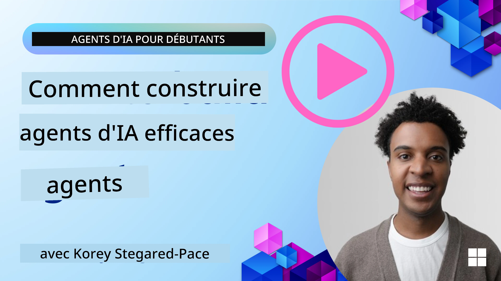
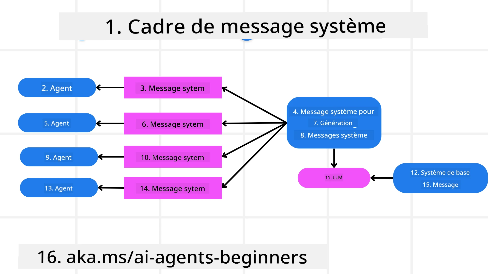
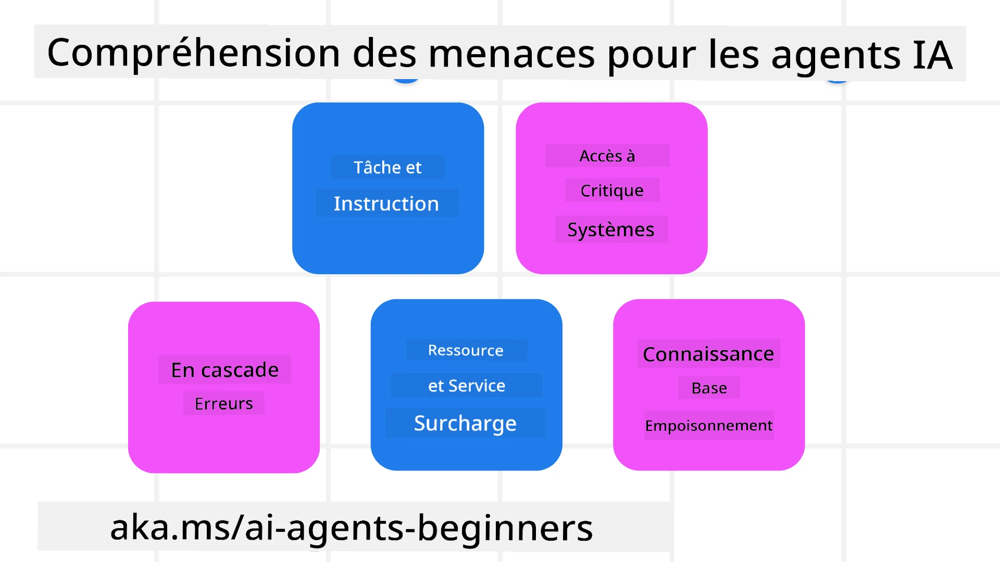
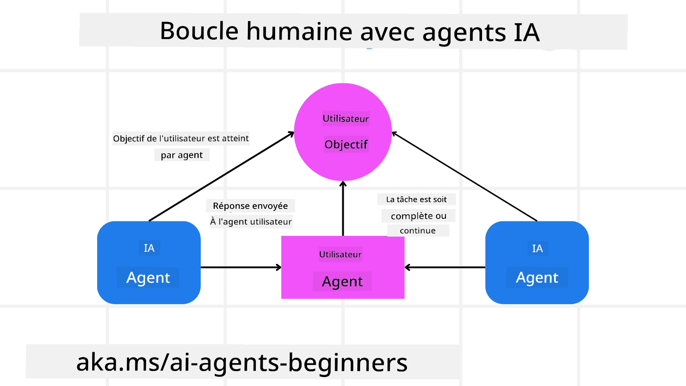

[](https://youtu.be/iZKkMEGBCUQ?si=Q-kEbcyHUMPoHp8L)

> _(Cliquez sur l'image ci-dessus pour voir la vidéo de cette leçon)_

# Construire des Agents d'IA dignes de confiance

## Introduction

Cette leçon couvrira :

- Comment construire et déployer des Agents d'IA sûrs et efficaces
- Les considérations importantes de sécurité lors du développement des Agents d'IA.
- Comment maintenir la confidentialité des données et des utilisateurs lors du développement des Agents d'IA.

## Objectifs d'apprentissage

Après avoir terminé cette leçon, vous saurez comment :

- Identifier et atténuer les risques lors de la création d’Agents d’IA.
- Mettre en œuvre des mesures de sécurité pour garantir une gestion appropriée des données et des accès.
- Créer des Agents d'IA qui maintiennent la confidentialité des données et offrent une expérience utilisateur de qualité.

## Sécurité

Commençons par examiner la construction d’applications agentiques sûres. La sécurité signifie que l’agent d’IA fonctionne comme prévu. En tant que concepteurs d’applications agentiques, nous disposons de méthodes et d’outils pour maximiser la sécurité :

### Construire un cadre de message système

Si vous avez déjà créé une application d’IA utilisant des modèles de langage large (LLM), vous connaissez l’importance de concevoir une invite système robuste ou un message système. Ces invites établissent les règles méta, les instructions et les directives sur la façon dont le LLM interagira avec l’utilisateur et les données.

Pour les Agents d'IA, l’invite système est encore plus importante car les Agents d'IA auront besoin d’instructions très spécifiques pour accomplir les tâches que nous avons conçues pour eux.

Pour créer des invites système évolutives, nous pouvons utiliser un cadre de message système pour construire un ou plusieurs agents dans notre application :



#### Étape 1 : Créer un message système méta

L’invite méta sera utilisée par un LLM pour générer les invites système pour les agents que nous créons. Nous la concevons en tant que modèle afin de pouvoir créer efficacement plusieurs agents si nécessaire.

Voici un exemple de message système méta que nous donnerions au LLM :

```plaintext
You are an expert at creating AI agent assistants. 
You will be provided a company name, role, responsibilities and other
information that you will use to provide a system prompt for.
To create the system prompt, be descriptive as possible and provide a structure that a system using an LLM can better understand the role and responsibilities of the AI assistant. 
```

#### Étape 2 : Créer une invite de base

L’étape suivante consiste à créer une invite de base pour décrire l’Agent d’IA. Vous devez inclure le rôle de l’agent, les tâches que l’agent accomplira et toute autre responsabilité de l’agent.

Voici un exemple :

```plaintext
You are a travel agent for Contoso Travel that is great at booking flights for customers. To help customers you can perform the following tasks: lookup available flights, book flights, ask for preferences in seating and times for flights, cancel any previously booked flights and alert customers on any delays or cancellations of flights.  
```

#### Étape 3 : Fournir le message système de base au LLM

Nous pouvons maintenant optimiser ce message système en fournissant le message système méta en tant que message système ainsi que notre message système de base.

Cela produira un message système mieux conçu pour guider nos agents d’IA :

```markdown
**Company Name:** Contoso Travel  
**Role:** Travel Agent Assistant

**Objective:**  
You are an AI-powered travel agent assistant for Contoso Travel, specializing in booking flights and providing exceptional customer service. Your main goal is to assist customers in finding, booking, and managing their flights, all while ensuring that their preferences and needs are met efficiently.

**Key Responsibilities:**

1. **Flight Lookup:**
    
    - Assist customers in searching for available flights based on their specified destination, dates, and any other relevant preferences.
    - Provide a list of options, including flight times, airlines, layovers, and pricing.
2. **Flight Booking:**
    
    - Facilitate the booking of flights for customers, ensuring that all details are correctly entered into the system.
    - Confirm bookings and provide customers with their itinerary, including confirmation numbers and any other pertinent information.
3. **Customer Preference Inquiry:**
    
    - Actively ask customers for their preferences regarding seating (e.g., aisle, window, extra legroom) and preferred times for flights (e.g., morning, afternoon, evening).
    - Record these preferences for future reference and tailor suggestions accordingly.
4. **Flight Cancellation:**
    
    - Assist customers in canceling previously booked flights if needed, following company policies and procedures.
    - Notify customers of any necessary refunds or additional steps that may be required for cancellations.
5. **Flight Monitoring:**
    
    - Monitor the status of booked flights and alert customers in real-time about any delays, cancellations, or changes to their flight schedule.
    - Provide updates through preferred communication channels (e.g., email, SMS) as needed.

**Tone and Style:**

- Maintain a friendly, professional, and approachable demeanor in all interactions with customers.
- Ensure that all communication is clear, informative, and tailored to the customer's specific needs and inquiries.

**User Interaction Instructions:**

- Respond to customer queries promptly and accurately.
- Use a conversational style while ensuring professionalism.
- Prioritize customer satisfaction by being attentive, empathetic, and proactive in all assistance provided.

**Additional Notes:**

- Stay updated on any changes to airline policies, travel restrictions, and other relevant information that could impact flight bookings and customer experience.
- Use clear and concise language to explain options and processes, avoiding jargon where possible for better customer understanding.

This AI assistant is designed to streamline the flight booking process for customers of Contoso Travel, ensuring that all their travel needs are met efficiently and effectively.

```

#### Étape 4 : Itérer et améliorer

La valeur de ce cadre de message système est de pouvoir facilement créer des messages système à partir de plusieurs agents ainsi que d’améliorer vos messages système au fil du temps. Il est rare d’avoir un message système qui fonctionne parfaitement dès la première fois pour votre cas d’usage complet. Pouvoir faire de petites modifications et améliorations en changeant le message système de base et en le faisant passer dans le système vous permettra de comparer et d’évaluer les résultats.

## Comprendre les menaces

Pour construire des agents d’IA dignes de confiance, il est important de comprendre et d’atténuer les risques et menaces pesant sur votre agent d’IA. Examinons seulement certaines des différentes menaces pour les agents d’IA et comment vous pouvez mieux planifier et vous y préparer.



### Tâche et Instructions

**Description :** Les attaquants tentent de modifier les instructions ou les objectifs de l’agent d’IA via des invites ou en manipulant les entrées.

**Atténuation :** Exécuter des vérifications de validation et des filtres d’entrée pour détecter les invites potentiellement dangereuses avant qu’elles ne soient traitées par l’Agent d’IA. Comme ces attaques nécessitent généralement une interaction fréquente avec l’Agent, limiter le nombre de tours dans une conversation est une autre façon de prévenir ce type d’attaques.

### Accès aux systèmes critiques

**Description :** Si un agent d’IA a accès à des systèmes et services stockant des données sensibles, les attaquants peuvent compromettre la communication entre l’agent et ces services. Ce peuvent être des attaques directes ou des tentatives indirectes d’obtenir des informations sur ces systèmes via l’agent.

**Atténuation :** Les agents d’IA ne devraient avoir accès aux systèmes que selon un besoin strict pour prévenir ce type d’attaques. La communication entre l’agent et le système doit également être sécurisée. Mettre en place une authentification et un contrôle d’accès est une autre méthode pour protéger ces informations.

### Surcharge des ressources et services

**Description :** Les agents d’IA peuvent accéder à différents outils et services pour accomplir des tâches. Les attaquants peuvent utiliser cette capacité pour attaquer ces services en envoyant un volume élevé de requêtes via l’Agent d’IA, ce qui peut entraîner des défaillances système ou des coûts élevés.

**Atténuation :** Mettre en place des politiques limitant le nombre de requêtes qu’un agent d’IA peut adresser à un service. Limiter le nombre de tours de conversation et de requêtes adressées à votre agent d’IA est une autre méthode pour prévenir ce type d’attaques.

### Empoisonnement de la base de connaissances

**Description :** Ce type d’attaque ne cible pas directement l’agent d’IA mais la base de connaissances et autres services que l’agent d’IA utilisera. Cela pourrait impliquer la corruption des données ou informations que l’agent d’IA emploiera pour accomplir une tâche, entraînant des réponses biaisées ou non intentionnelles à l’utilisateur.

**Atténuation :** Effectuer des vérifications régulières des données que l’agent d’IA utilisera dans ses flux de travail. S’assurer que l’accès à ces données est sécurisé et modifié uniquement par des personnes de confiance pour éviter ce type d’attaque.

### Erreurs en cascade

**Description :** Les agents d’IA accèdent à divers outils et services pour effectuer des tâches. Les erreurs causées par des attaquants peuvent entraîner des pannes d’autres systèmes auxquels l’agent d’IA est connecté, rendant l’attaque plus étendue et plus difficile à dépanner.

**Atténuation :** Une méthode pour éviter cela est de faire fonctionner l’Agent d’IA dans un environnement limité, comme exécuter des tâches dans un conteneur Docker, pour éviter les attaques directes sur le système. Créer des mécanismes de repli et une logique de nouvelle tentative lorsque certains systèmes répondent avec une erreur est une autre manière d’éviter des défaillances systémiques plus larges.

## Humain dans la boucle

Une autre façon efficace de créer des systèmes d’agents d’IA dignes de confiance est d’utiliser un Humain dans la boucle. Cela crée un flux où les utilisateurs peuvent fournir des retours aux Agents pendant l’exécution. Les utilisateurs agissent essentiellement en agents dans un système multi-agent et peuvent approuver ou interrompre le processus en cours.



Voici un extrait de code utilisant le Microsoft Agent Framework pour illustrer comment ce concept est implémenté :

```python
import os
from agent_framework.azure import AzureAIProjectAgentProvider
from azure.identity import AzureCliCredential

# Créer le fournisseur avec approbation humaine en boucle
provider = AzureAIProjectAgentProvider(
    credential=AzureCliCredential(),
)

# Créer l'agent avec une étape d'approbation humaine
response = provider.create_response(
    input="Write a 4-line poem about the ocean.",
    instructions="You are a helpful assistant. Ask for user approval before finalizing.",
)

# L'utilisateur peut examiner et approuver la réponse
print(response.output_text)
user_input = input("Do you approve? (APPROVE/REJECT): ")
if user_input == "APPROVE":
    print("Response approved.")
else:
    print("Response rejected. Revising...")
```

## Conclusion

Construire des agents d’IA dignes de confiance nécessite une conception soigneuse, des mesures de sécurité robustes et une itération continue. En mettant en œuvre des systèmes structurés de méta-invites, en comprenant les menaces potentielles et en appliquant des stratégies d’atténuation, les développeurs peuvent créer des agents d’IA à la fois sûrs et efficaces. De plus, incorporer une approche avec un humain dans la boucle garantit que les agents d’IA restent alignés sur les besoins des utilisateurs tout en minimisant les risques. À mesure que l’IA continue d’évoluer, maintenir une posture proactive sur la sécurité, la confidentialité et les considérations éthiques sera essentiel pour favoriser la confiance et la fiabilité des systèmes pilotés par l’IA.

## Exemples de code

- [`code_samples/06-system-message-framework.ipynb`](code_samples/06-system-message-framework.ipynb) : démonstration pas à pas du cadre de système-méthode méta-invite.
- [`code_samples/06-human-in-the-loop.ipynb`](code_samples/06-human-in-the-loop.ipynb) : portes d’approbation avant action, hiérarchisation des risques et journalisation d’audit pour agents dignes de confiance.

### Vous avez plus de questions sur la construction d’Agents d’IA dignes de confiance ?

Rejoignez le [Microsoft Foundry Discord](https://discord.com/invite/ATgtXmAS5D) pour rencontrer d’autres apprenants, participer aux heures de bureau et obtenir des réponses à vos questions sur les Agents d’IA.

## Ressources supplémentaires

- <a href="https://learn.microsoft.com/azure/ai-studio/responsible-use-of-ai-overview" target="_blank">Vue d’ensemble de l’IA responsable</a>
- <a href="https://learn.microsoft.com/azure/ai-studio/concepts/evaluation-approach-gen-ai" target="_blank">Évaluation des modèles et applications d’IA générative</a>
- <a href="https://learn.microsoft.com/azure/ai-services/openai/concepts/system-message?context=%2Fazure%2Fai-studio%2Fcontext%2Fcontext&tabs=top-techniques" target="_blank">Messages système de sécurité</a>
- <a href="https://blogs.microsoft.com/wp-content/uploads/prod/sites/5/2022/06/Microsoft-RAI-Impact-Assessment-Template.pdf?culture=en-us&country=us" target="_blank">Modèle d’évaluation des risques</a>

## Leçon précédente

[Agentic RAG](../05-agentic-rag/README.md)

## Leçon suivante

[Modèle de conception de planification](../07-planning-design/README.md)

---

<!-- CO-OP TRANSLATOR DISCLAIMER START -->
**Avertissement** :
Ce document a été traduit à l'aide du service de traduction automatique [Co-op Translator](https://github.com/Azure/co-op-translator). Bien que nous nous efforçions d'assurer l'exactitude, veuillez noter que les traductions automatisées peuvent contenir des erreurs ou des inexactitudes. Le document original dans sa langue native doit être considéré comme la source faisant autorité. Pour les informations critiques, il est recommandé de recourir à une traduction professionnelle réalisée par un humain. Nous ne saurions être tenus responsables des malentendus ou erreurs d'interprétation découlant de l'utilisation de cette traduction.
<!-- CO-OP TRANSLATOR DISCLAIMER END -->