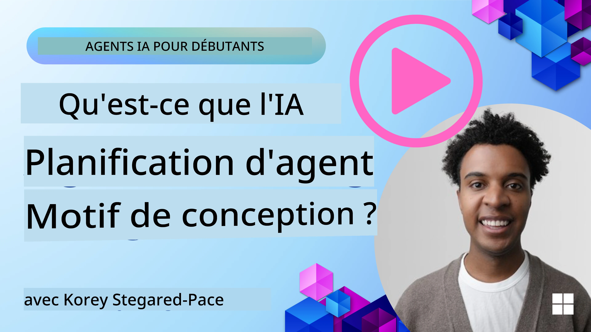
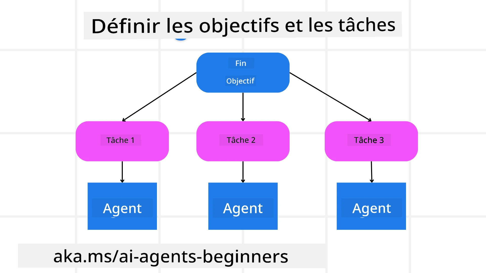

[](https://youtu.be/kPfJ2BrBCMY?si=9pYpPXp0sSbK91Dr)

> _(Cliquez sur l'image ci-dessus pour regarder la vidéo de cette leçon)_

# Conception de la planification

## Introduction

This lesson will cover

* Définir un objectif global clair et diviser une tâche complexe en sous-tâches gérables.
* Exploiter des sorties structurées pour des réponses plus fiables et lisibles par machine.
* Appliquer une approche événementielle pour gérer les tâches dynamiques et les entrées inattendues.

## Learning Goals

Après avoir suivi cette leçon, vous comprendrez :

* Identifier et définir un objectif global pour un agent IA, en s'assurant qu'il sait clairement ce qui doit être accompli.
* Décomposer une tâche complexe en sous-tâches gérables et les organiser dans une séquence logique.
* Fournir aux agents les bons outils (par ex., outils de recherche ou d'analyse de données), décider quand et comment les utiliser, et gérer les situations inattendues qui surviennent.
* Évaluer les résultats des sous-tâches, mesurer les performances et itérer les actions pour améliorer le résultat final.

## Defining the Overall Goal and Breaking Down a Task



Most real-world tasks are too complex to tackle in a single step. An AI agent needs a concise objective to guide its planning and actions. For example, consider the goal:

    "Générer un itinéraire de voyage de 3 jours."

While it is simple to state, it still needs refinement. The clearer the goal, the better the agent (and any human collaborators) can focus on achieving the right outcome, such as creating a comprehensive itinerary with flight options, hotel recommendations, and activity suggestions.

### Task Decomposition

Large or intricate tasks become more manageable when split into smaller, goal-oriented subtasks.
For the travel itinerary example, you could decompose the goal into:

* Réservation de vol
* Réservation d'hôtel
* Location de voiture
* Personnalisation

Each subtask can then be tackled by dedicated agents or processes. One agent might specialize in searching for the best flight deals, another focuses on hotel bookings, and so on. A coordinating or “downstream” agent can then compile these results into one cohesive itinerary to the end user.

This modular approach also allows for incremental enhancements. For instance, you could add specialized agents for Food Recommendations or Local Activity Suggestions and refine the itinerary over time.

### Structured output

Large Language Models (LLMs) can generate structured output (e.g. JSON) that is easier for downstream agents or services to parse and process. This is especially useful in a multi-agent context, where we can action these tasks after the planning output is received.

The following Python snippet demonstrates a simple planning agent decomposing a goal into subtasks and generating a structured plan:

```python
from pydantic import BaseModel
from enum import Enum
from typing import List, Optional, Union
import json
import os
from typing import Optional
from pprint import pprint
from agent_framework.azure import AzureAIProjectAgentProvider
from azure.identity import AzureCliCredential

class AgentEnum(str, Enum):
    FlightBooking = "flight_booking"
    HotelBooking = "hotel_booking"
    CarRental = "car_rental"
    ActivitiesBooking = "activities_booking"
    DestinationInfo = "destination_info"
    DefaultAgent = "default_agent"
    GroupChatManager = "group_chat_manager"

# Modèle de sous-tâche de voyage
class TravelSubTask(BaseModel):
    task_details: str
    assigned_agent: AgentEnum  # nous voulons assigner la tâche à l'agent

class TravelPlan(BaseModel):
    main_task: str
    subtasks: List[TravelSubTask]
    is_greeting: bool

provider = AzureAIProjectAgentProvider(credential=AzureCliCredential())

# Définir le message de l'utilisateur
system_prompt = """You are a planner agent.
    Your job is to decide which agents to run based on the user's request.
    Provide your response in JSON format with the following structure:
{'main_task': 'Plan a family trip from Singapore to Melbourne.',
 'subtasks': [{'assigned_agent': 'flight_booking',
               'task_details': 'Book round-trip flights from Singapore to '
                               'Melbourne.'}
    Below are the available agents specialised in different tasks:
    - FlightBooking: For booking flights and providing flight information
    - HotelBooking: For booking hotels and providing hotel information
    - CarRental: For booking cars and providing car rental information
    - ActivitiesBooking: For booking activities and providing activity information
    - DestinationInfo: For providing information about destinations
    - DefaultAgent: For handling general requests"""

user_message = "Create a travel plan for a family of 2 kids from Singapore to Melbourne"

response = client.create_response(input=user_message, instructions=system_prompt)

response_content = response.output_text
pprint(json.loads(response_content))
```

### Planning Agent with Multi-Agent Orchestration

In this example, a Semantic Router Agent receives a user request (e.g., "J'ai besoin d'un plan d'hôtel pour mon voyage.").

The planner then:

* Reçoit le plan d'hôtel : Le planificateur prend le message de l'utilisateur et, en se basant sur une invite système (incluant les détails des agents disponibles), génère un plan de voyage structuré.
* Énumère les agents et leurs outils : le registre d'agents contient une liste d'agents (par ex., pour les vols, les hôtels, la location de voiture et les activités) ainsi que les fonctions ou outils qu'ils proposent.
* Oriente le plan vers les agents respectifs : selon le nombre de sous-tâches, le planificateur envoie soit le message directement à un agent dédié (pour les scénarios à tâche unique), soit coordonne via un gestionnaire de chat de groupe pour la collaboration multi-agent.
* Résume le résultat : enfin, le planificateur résume le plan généré pour plus de clarté.
The following Python code sample illustrates these steps:

```python

from pydantic import BaseModel

from enum import Enum
from typing import List, Optional, Union

class AgentEnum(str, Enum):
    FlightBooking = "flight_booking"
    HotelBooking = "hotel_booking"
    CarRental = "car_rental"
    ActivitiesBooking = "activities_booking"
    DestinationInfo = "destination_info"
    DefaultAgent = "default_agent"
    GroupChatManager = "group_chat_manager"

# Modèle de sous-tâche de voyage

class TravelSubTask(BaseModel):
    task_details: str
    assigned_agent: AgentEnum # nous voulons assigner la tâche à l'agent

class TravelPlan(BaseModel):
    main_task: str
    subtasks: List[TravelSubTask]
    is_greeting: bool
import json
import os
from typing import Optional

from agent_framework.azure import AzureAIProjectAgentProvider
from azure.identity import AzureCliCredential

# Créer le client

provider = AzureAIProjectAgentProvider(credential=AzureCliCredential())

from pprint import pprint

# Définir le message de l'utilisateur

system_prompt = """You are a planner agent.
    Your job is to decide which agents to run based on the user's request.
    Below are the available agents specialized in different tasks:
    - FlightBooking: For booking flights and providing flight information
    - HotelBooking: For booking hotels and providing hotel information
    - CarRental: For booking cars and providing car rental information
    - ActivitiesBooking: For booking activities and providing activity information
    - DestinationInfo: For providing information about destinations
    - DefaultAgent: For handling general requests"""

user_message = "Create a travel plan for a family of 2 kids from Singapore to Melbourne"

response = client.create_response(input=user_message, instructions=system_prompt)

response_content = response.output_text

# Afficher le contenu de la réponse après l'avoir chargé au format JSON

pprint(json.loads(response_content))
```

What follows is the output from the previous code and you can then use this structured output to route to `assigned_agent` and summarize the travel plan to the end user.

```json
{
    "is_greeting": "False",
    "main_task": "Plan a family trip from Singapore to Melbourne.",
    "subtasks": [
        {
            "assigned_agent": "flight_booking",
            "task_details": "Book round-trip flights from Singapore to Melbourne."
        },
        {
            "assigned_agent": "hotel_booking",
            "task_details": "Find family-friendly hotels in Melbourne."
        },
        {
            "assigned_agent": "car_rental",
            "task_details": "Arrange a car rental suitable for a family of four in Melbourne."
        },
        {
            "assigned_agent": "activities_booking",
            "task_details": "List family-friendly activities in Melbourne."
        },
        {
            "assigned_agent": "destination_info",
            "task_details": "Provide information about Melbourne as a travel destination."
        }
    ]
}
```

An example notebook with the previous code sample is available [ici](07-python-agent-framework.ipynb).

### Iterative Planning

Some tasks require a back-and-forth or re-planning, where the outcome of one subtask influences the next. For example, if the agent discovers an unexpected data format while booking flights, it might need to adapt its strategy before moving on to hotel bookings.

Additionally, user feedback (e.g. a human deciding they prefer an earlier flight) can trigger a partial re-plan. This dynamic, iterative approach ensures that the final solution aligns with real-world constraints and evolving user preferences.

par ex. : exemple de code

```python
from agent_framework.azure import AzureAIProjectAgentProvider
from azure.identity import AzureCliCredential
#.. identique au code précédent et transmettre l'historique de l'utilisateur et le plan actuel

system_prompt = """You are a planner agent to optimize the
    Your job is to decide which agents to run based on the user's request.
    Below are the available agents specialized in different tasks:
    - FlightBooking: For booking flights and providing flight information
    - HotelBooking: For booking hotels and providing hotel information
    - CarRental: For booking cars and providing car rental information
    - ActivitiesBooking: For booking activities and providing activity information
    - DestinationInfo: For providing information about destinations
    - DefaultAgent: For handling general requests"""

user_message = "Create a travel plan for a family of 2 kids from Singapore to Melbourne"

response = client.create_response(
    input=user_message,
    instructions=system_prompt,
    context=f"Previous travel plan - {TravelPlan}",
)
# .. replanifier et envoyer les tâches aux agents respectifs
```

For more comprehensive planning do checkout Magnetic One <a href="https://www.microsoft.com/research/articles/magentic-one-a-generalist-multi-agent-system-for-solving-complex-tasks" target="_blank">Article de blog</a> for solving complex tasks.

## Summary

In this article we have looked at an example of how we can create a planner that can dynamically select the available agents defined. The output of the Planner decomposes the tasks and assigns the agents so they can be executed. It is assumed the agents have access to the functions/tools that are required to perform the task. In addition to the agents you can include other patterns like reflection, summarizer, and round robin chat to further customize.

## Additional Resources

Magentic One - Un système multi-agent généraliste pour résoudre des tâches complexes qui a obtenu des résultats impressionnants sur plusieurs benchmarks exigeants pour agents. Reference: <a href="https://www.microsoft.com/research/articles/magentic-one-a-generalist-multi-agent-system-for-solving-complex-tasks" target="_blank">Magentic One</a>. In this implementation the orchestrator creates task specific plans and delegates these tasks to the available agents. In addition to planning the orchestrator also employs a tracking mechanism to monitor the progress of the task and re-plans as required.

### Got More Questions about the Planning Design Pattern?

Rejoignez le [Microsoft Foundry Discord](https://aka.ms/ai-agents/discord) pour rencontrer d'autres apprenants, participer à des heures de bureau et obtenir des réponses à vos questions sur les agents d'IA.

## Previous Lesson

[Créer des agents d'IA fiables](../06-building-trustworthy-agents/README.md)

## Next Lesson

[Modèle de conception multi-agent](../08-multi-agent/README.md)

---

<!-- CO-OP TRANSLATOR DISCLAIMER START -->
Clause de non-responsabilité :
Ce document a été traduit à l'aide du service de traduction automatique Co-op Translator (https://github.com/Azure/co-op-translator). Bien que nous nous efforcions d'assurer l'exactitude, veuillez noter que les traductions automatiques peuvent contenir des erreurs ou des inexactitudes. Le document original dans sa langue d'origine doit être considéré comme la version faisant foi. Pour les informations critiques, il est recommandé de recourir à une traduction professionnelle réalisée par un traducteur humain. Nous déclinons toute responsabilité en cas de malentendus ou d'interprétations erronées résultant de l'utilisation de cette traduction.
<!-- CO-OP TRANSLATOR DISCLAIMER END -->