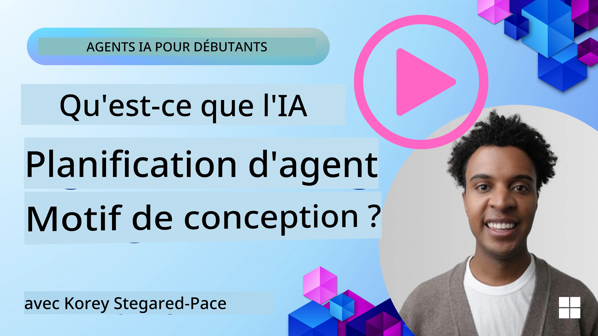
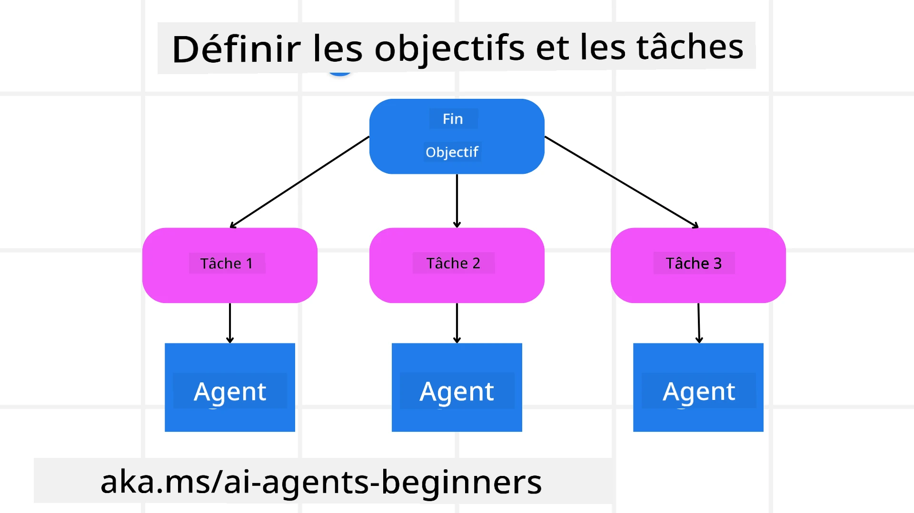

[](https://youtu.be/kPfJ2BrBCMY?si=9pYpPXp0sSbK91Dr)

> _(Cliquez sur l'image ci-dessus pour voir la vidéo de cette leçon)_

# Planification de Conception

## Introduction

Cette leçon couvrira

* Définir un objectif global clair et décomposer une tâche complexe en tâches gérables.
* Exploiter une sortie structurée pour des réponses plus fiables et lisibles par machine.
* Appliquer une approche événementielle pour gérer les tâches dynamiques et les entrées inattendues.

## Objectifs d'apprentissage

Après avoir terminé cette leçon, vous comprendrez :

* Identifier et définir un objectif global pour un agent IA, en veillant à ce qu'il sache clairement ce qui doit être accompli.
* Décomposer une tâche complexe en sous-tâches gérables et les organiser dans une séquence logique.
* Équiper les agents avec les bons outils (par ex., outils de recherche ou outils d'analyse de données), décider quand et comment ils sont utilisés, et gérer les situations imprévues qui surgissent.
* Évaluer les résultats des sous-tâches, mesurer la performance et itérer sur les actions pour améliorer le résultat final.

## Définir l'Objectif Global et Décomposer une Tâche



La plupart des tâches du monde réel sont trop complexes pour être abordées en une seule étape. Un agent IA a besoin d'un objectif concis pour guider sa planification et ses actions. Par exemple, considérez l’objectif :

    "Générer un itinéraire de voyage de 3 jours."

Bien qu'il soit simple à énoncer, il nécessite encore un affinage. Plus l'objectif est clair, mieux l'agent (et tous les collaborateurs humains) peuvent se concentrer pour atteindre le bon résultat, comme créer un itinéraire complet avec des options de vol, des recommandations d'hôtel et des suggestions d'activités.

### Décomposition des Tâches

Les tâches volumineuses ou complexes deviennent plus gérables une fois divisées en sous-tâches plus petites, orientées vers un objectif.
Pour l’exemple de l’itinéraire de voyage, vous pourriez décomposer l’objectif en :

* Réservation de Vol
* Réservation d’Hôtel
* Location de Voiture
* Personnalisation

Chaque sous-tâche peut alors être gérée par des agents ou des processus dédiés. Un agent peut se spécialiser dans la recherche des meilleures offres de vol, un autre dans la réservation d'hôtels, etc. Un agent de coordination ou « aval » peut ensuite compiler ces résultats en un itinéraire cohérent pour l'utilisateur final.

Cette approche modulaire permet également des améliorations incrémentielles. Par exemple, vous pourriez ajouter des agents spécialisés pour des Recommandations Gastronomiques ou des Suggestions d’Activités Locales et affiner l’itinéraire au fil du temps.

### Sortie Structurée

Les grands modèles de langage (LLMs) peuvent générer une sortie structurée (par exemple en JSON) plus facile à analyser et traiter pour les agents ou services en aval. Ceci est particulièrement utile dans un contexte multi-agent, où nous pouvons exécuter ces tâches après réception de la sortie de planification.

L'extrait Python suivant montre un agent de planification simple décomposant un objectif en sous-tâches et générant un plan structuré :

```python
from pydantic import BaseModel
from enum import Enum
from typing import List, Optional, Union
import json
import os
from typing import Optional
from pprint import pprint
from agent_framework.azure import AzureAIProjectAgentProvider
from azure.identity import AzureCliCredential

class AgentEnum(str, Enum):
    FlightBooking = "flight_booking"
    HotelBooking = "hotel_booking"
    CarRental = "car_rental"
    ActivitiesBooking = "activities_booking"
    DestinationInfo = "destination_info"
    DefaultAgent = "default_agent"
    GroupChatManager = "group_chat_manager"

# Modèle de sous-tâche de voyage
class TravelSubTask(BaseModel):
    task_details: str
    assigned_agent: AgentEnum  # nous voulons attribuer la tâche à l'agent

class TravelPlan(BaseModel):
    main_task: str
    subtasks: List[TravelSubTask]
    is_greeting: bool

provider = AzureAIProjectAgentProvider(credential=AzureCliCredential())

# Définir le message utilisateur
system_prompt = """You are a planner agent.
    Your job is to decide which agents to run based on the user's request.
    Provide your response in JSON format with the following structure:
{'main_task': 'Plan a family trip from Singapore to Melbourne.',
 'subtasks': [{'assigned_agent': 'flight_booking',
               'task_details': 'Book round-trip flights from Singapore to '
                               'Melbourne.'}
    Below are the available agents specialised in different tasks:
    - FlightBooking: For booking flights and providing flight information
    - HotelBooking: For booking hotels and providing hotel information
    - CarRental: For booking cars and providing car rental information
    - ActivitiesBooking: For booking activities and providing activity information
    - DestinationInfo: For providing information about destinations
    - DefaultAgent: For handling general requests"""

user_message = "Create a travel plan for a family of 2 kids from Singapore to Melbourne"

response = client.create_response(input=user_message, instructions=system_prompt)

response_content = response.output_text
pprint(json.loads(response_content))
```

### Agent de Planification avec Orchestration Multi-Agent

Dans cet exemple, un agent routeur sémantique reçoit une requête utilisateur (par ex., « J'ai besoin d'un plan hôtelier pour mon voyage. »).

Le planificateur :

* Reçoit le Plan Hôtelier : Le planificateur prend le message de l’utilisateur et, sur la base d’une invite système (incluant les détails des agents disponibles), génère un plan de voyage structuré.
* Liste les Agents et leurs Outils : Le registre des agents contient une liste d’agents (par ex. pour vol, hôtel, location de voiture et activités) ainsi que les fonctions ou outils qu’ils offrent.
* Oriente le Plan vers les Agents Respectifs : Selon le nombre de sous-tâches, le planificateur envoie soit le message directement à un agent dédié (pour les scénarios à tâche unique) soit coordonne via un gestionnaire de chat de groupe pour la collaboration multi-agent.
* Résume le Résultat : Enfin, le planificateur résume le plan généré pour plus de clarté.
Le code Python suivant illustre ces étapes :

```python

from pydantic import BaseModel

from enum import Enum
from typing import List, Optional, Union

class AgentEnum(str, Enum):
    FlightBooking = "flight_booking"
    HotelBooking = "hotel_booking"
    CarRental = "car_rental"
    ActivitiesBooking = "activities_booking"
    DestinationInfo = "destination_info"
    DefaultAgent = "default_agent"
    GroupChatManager = "group_chat_manager"

# Modèle de sous-tâche de voyage

class TravelSubTask(BaseModel):
    task_details: str
    assigned_agent: AgentEnum # nous voulons attribuer la tâche à l'agent

class TravelPlan(BaseModel):
    main_task: str
    subtasks: List[TravelSubTask]
    is_greeting: bool
import json
import os
from typing import Optional

from agent_framework.azure import AzureAIProjectAgentProvider
from azure.identity import AzureCliCredential

# Créer le client

provider = AzureAIProjectAgentProvider(credential=AzureCliCredential())

from pprint import pprint

# Définir le message de l'utilisateur

system_prompt = """You are a planner agent.
    Your job is to decide which agents to run based on the user's request.
    Below are the available agents specialized in different tasks:
    - FlightBooking: For booking flights and providing flight information
    - HotelBooking: For booking hotels and providing hotel information
    - CarRental: For booking cars and providing car rental information
    - ActivitiesBooking: For booking activities and providing activity information
    - DestinationInfo: For providing information about destinations
    - DefaultAgent: For handling general requests"""

user_message = "Create a travel plan for a family of 2 kids from Singapore to Melbourne"

response = client.create_response(input=user_message, instructions=system_prompt)

response_content = response.output_text

# Imprimer le contenu de la réponse après l'avoir chargé en JSON

pprint(json.loads(response_content))
```

Ce qui suit est la sortie du code précédent et vous pouvez ensuite utiliser cette sortie structurée pour la diriger vers `assigned_agent` et résumer le plan de voyage pour l’utilisateur final.

```json
{
    "is_greeting": "False",
    "main_task": "Plan a family trip from Singapore to Melbourne.",
    "subtasks": [
        {
            "assigned_agent": "flight_booking",
            "task_details": "Book round-trip flights from Singapore to Melbourne."
        },
        {
            "assigned_agent": "hotel_booking",
            "task_details": "Find family-friendly hotels in Melbourne."
        },
        {
            "assigned_agent": "car_rental",
            "task_details": "Arrange a car rental suitable for a family of four in Melbourne."
        },
        {
            "assigned_agent": "activities_booking",
            "task_details": "List family-friendly activities in Melbourne."
        },
        {
            "assigned_agent": "destination_info",
            "task_details": "Provide information about Melbourne as a travel destination."
        }
    ]
}
```

Un notebook exemple avec le code précédent est disponible [ici](07-python-agent-framework.ipynb).

### Planification Itérative

Certaines tâches nécessitent des échanges ou une replanification, où le résultat d'une sous-tâche influence la suivante. Par exemple, si l’agent découvre un format de données inattendu lors de la réservation des vols, il pourrait devoir adapter sa stratégie avant de passer à la réservation des hôtels.

De plus, les retours utilisateur (par ex., un humain qui décide qu’il préfère un vol plus tôt) peuvent déclencher une replanification partielle. Cette approche dynamique et itérative garantit que la solution finale correspond aux contraintes réelles et aux préférences évolutives de l’utilisateur.

par ex. code exemple

```python
from agent_framework.azure import AzureAIProjectAgentProvider
from azure.identity import AzureCliCredential
#.. comme le code précédent et transmettre l'historique de l'utilisateur, le plan actuel

system_prompt = """You are a planner agent to optimize the
    Your job is to decide which agents to run based on the user's request.
    Below are the available agents specialized in different tasks:
    - FlightBooking: For booking flights and providing flight information
    - HotelBooking: For booking hotels and providing hotel information
    - CarRental: For booking cars and providing car rental information
    - ActivitiesBooking: For booking activities and providing activity information
    - DestinationInfo: For providing information about destinations
    - DefaultAgent: For handling general requests"""

user_message = "Create a travel plan for a family of 2 kids from Singapore to Melbourne"

response = client.create_response(
    input=user_message,
    instructions=system_prompt,
    context=f"Previous travel plan - {TravelPlan}",
)
# .. replanifier et envoyer les tâches aux agents respectifs
```

Pour une planification plus complète, consultez Magnetic One <a href="https://www.microsoft.com/research/articles/magentic-one-a-generalist-multi-agent-system-for-solving-complex-tasks" target="_blank">Blogpost</a> pour la résolution de tâches complexes.

## Résumé

Dans cet article, nous avons examiné un exemple de création d’un planificateur capable de sélectionner dynamiquement les agents disponibles définis. La sortie du planificateur décompose les tâches et assigne les agents afin qu’elles puissent être exécutées. On suppose que les agents ont accès aux fonctions/outils nécessaires pour réaliser la tâche. En plus des agents, vous pouvez inclure d'autres modèles comme la réflexion, le résumé et un chat à tour de rôle pour personnaliser davantage.

## Ressources Supplémentaires

Magentic One - Un système multi-agent généraliste pour résoudre des tâches complexes ayant obtenu des résultats impressionnants sur plusieurs benchmarks complexes d’agents. Référence : <a href="https://www.microsoft.com/research/articles/magentic-one-a-generalist-multi-agent-system-for-solving-complex-tasks" target="_blank">Magentic One</a>. Dans cette implémentation, l’orchestrateur crée des plans spécifiques aux tâches et délègue ces tâches aux agents disponibles. En plus de la planification, l’orchestrateur emploie également un mécanisme de suivi pour surveiller la progression de la tâche et replanifier si nécessaire.

### Vous avez Plus de Questions sur le Pattern de Planification ?

Rejoignez le [Discord Microsoft Foundry](https://discord.com/invite/ATgtXmAS5D) pour rencontrer d’autres apprenants, assister aux séances de questions-réponses et obtenir des réponses à vos questions sur les agents IA.

## Leçon Précédente

[Construire des Agents IA Fiables](../06-building-trustworthy-agents/README.md)

## Leçon Suivante

[Pattern de Conception Multi-Agent](../08-multi-agent/README.md)

---

<!-- CO-OP TRANSLATOR DISCLAIMER START -->
**Avertissement** :
Ce document a été traduit à l'aide du service de traduction automatique [Co-op Translator](https://github.com/Azure/co-op-translator). Bien que nous nous efforçions d'assurer l'exactitude, veuillez noter que les traductions automatisées peuvent contenir des erreurs ou des inexactitudes. Le document original dans sa langue native doit être considéré comme la source faisant autorité. Pour les informations critiques, il est recommandé de recourir à une traduction professionnelle réalisée par un humain. Nous ne saurions être tenus responsables des malentendus ou erreurs d'interprétation découlant de l'utilisation de cette traduction.
<!-- CO-OP TRANSLATOR DISCLAIMER END -->