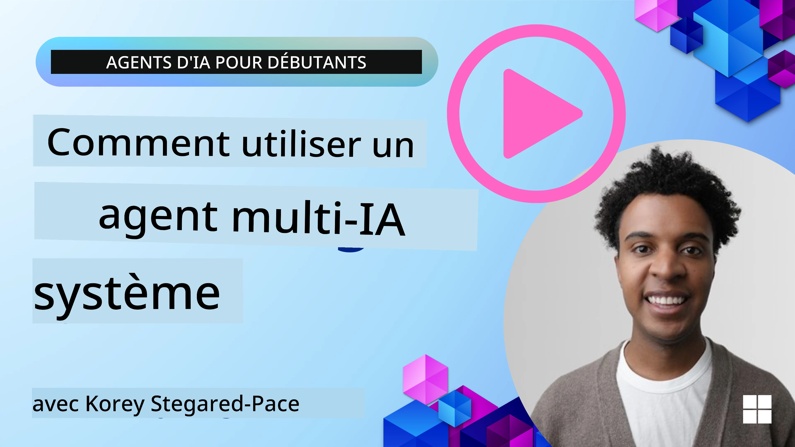
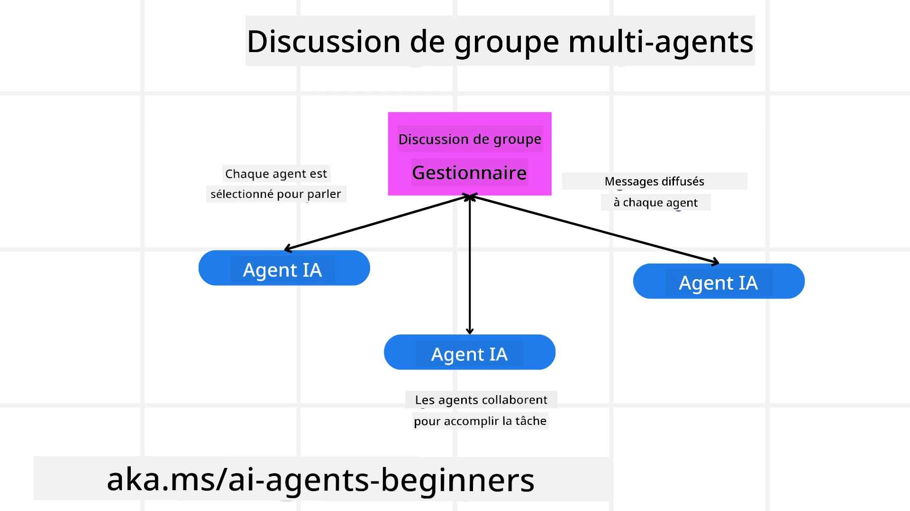
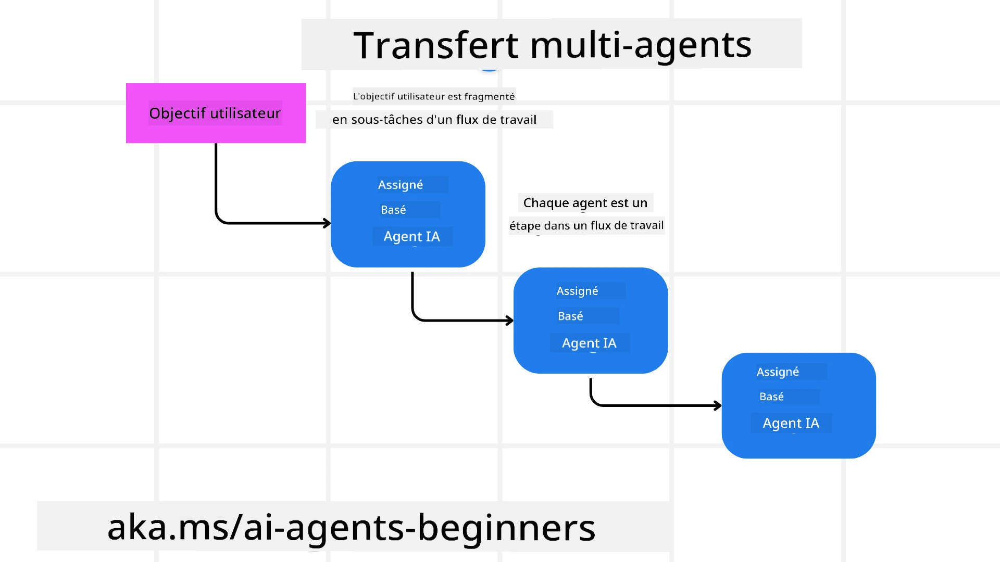
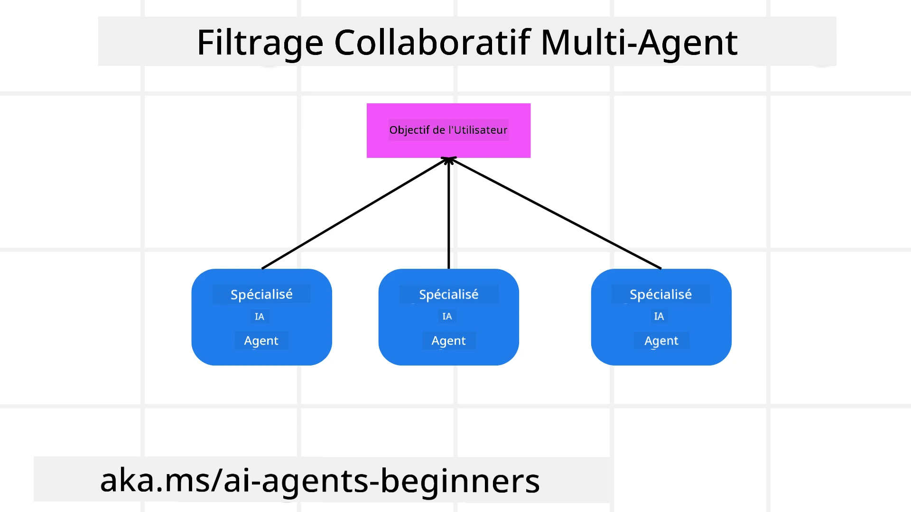

> _(Cliquez sur l'image ci‑dessus pour regarder la vidéo de cette leçon)_

# Modèles de conception multi-agent

Dès que vous commencez à travailler sur un projet impliquant plusieurs agents, vous devrez prendre en compte le modèle de conception multi-agent. Cependant, il peut ne pas être immédiatement clair quand passer à des multi-agents et quels sont les avantages.

## Introduction

Dans cette leçon, nous cherchons à répondre aux questions suivantes :

- Dans quels scénarios les multi-agents sont-ils applicables ?
- Quels sont les avantages d'utiliser des multi-agents plutôt qu'un seul agent réalisant plusieurs tâches ?
- Quels sont les composants de base pour implémenter le modèle de conception multi-agent ?
- Comment avoir de la visibilité sur la manière dont les multiples agents interagissent entre eux ?

## Objectifs d'apprentissage

Après cette leçon, vous devriez être capable de :

- Identifier les scénarios où les multi-agents sont applicables
- Reconnaître les avantages d'utiliser des multi-agents par rapport à un agent unique.
- Comprendre les composants de base de l'implémentation du modèle de conception multi-agent.

Quelle est la vision d'ensemble ?

*Les multi-agents sont un modèle de conception qui permet à plusieurs agents de travailler ensemble pour atteindre un objectif commun*.

Ce modèle est largement utilisé dans divers domaines, notamment la robotique, les systèmes autonomes et l'informatique distribuée.

## Scénarios où les multi-agents sont applicables

Alors, quels scénarios constituent un bon cas d'utilisation pour des multi-agents ? La réponse est qu'il existe de nombreux scénarios où l'emploi de plusieurs agents est bénéfique, en particulier dans les cas suivants :

- **Large workloads**: Les lourdes charges de travail peuvent être divisées en tâches plus petites et attribuées à différents agents, permettant un traitement parallèle et une exécution plus rapide. Un exemple de ceci est dans le cas d'une importante tâche de traitement de données.
- **Complex tasks**: Les tâches complexes, comme les grosses charges de travail, peuvent être décomposées en sous-tâches plus petites et attribuées à différents agents, chacun se spécialisant dans un aspect spécifique de la tâche. Un bon exemple est celui des véhicules autonomes où différents agents gèrent la navigation, la détection d'obstacles et la communication avec d'autres véhicules.
- **Diverse expertise**: Différents agents peuvent avoir des expertises diverses, leur permettant de gérer différents aspects d'une tâche plus efficacement qu'un seul agent. Pour ce cas, un bon exemple est dans le domaine de la santé où des agents peuvent gérer le diagnostic, les plans de traitement et la surveillance des patients.

## Avantages d'utiliser des multi-agents plutôt qu'un agent unique

Un système à agent unique peut très bien fonctionner pour des tâches simples, mais pour des tâches plus complexes, l'utilisation de plusieurs agents peut apporter plusieurs avantages :

- **Specialization**: Chaque agent peut être spécialisé pour une tâche spécifique. L'absence de spécialisation dans un agent unique signifie que vous avez un agent capable de tout faire mais qui peut être confus quant à ce qu'il doit faire lorsqu'il est confronté à une tâche complexe. Il peut, par exemple, finir par réaliser une tâche pour laquelle il n'est pas le mieux adapté.
- **Scalability**: Il est plus facile de faire évoluer les systèmes en ajoutant plus d'agents plutôt qu'en surchargeant un agent unique.
- **Fault Tolerance**: Si un agent échoue, les autres peuvent continuer à fonctionner, garantissant la fiabilité du système.

Prenons un exemple, réservons un voyage pour un utilisateur. Un système à agent unique devrait gérer tous les aspects du processus de réservation de voyage, de la recherche de vols à la réservation d'hôtels et de voitures de location. Pour y parvenir avec un agent unique, l'agent devrait disposer d'outils pour gérer toutes ces tâches. Cela pourrait conduire à un système complexe et monolithique, difficile à maintenir et à faire évoluer. Un système multi-agent, en revanche, pourrait avoir différents agents spécialisés dans la recherche de vols, la réservation d'hôtels et la location de voitures. Cela rendrait le système plus modulaire, plus facile à maintenir et évolutif.

Comparez cela à une agence de voyages exploitée comme un commerce familial contre une agence de voyages exploitée comme une franchise. Le commerce familial aurait un agent unique gérant tous les aspects du processus de réservation de voyage, tandis que la franchise aurait différents agents gérant différents aspects du processus de réservation de voyage.

## Composants de base pour implémenter le modèle de conception multi-agent

Avant de pouvoir implémenter le modèle de conception multi-agent, vous devez comprendre les composants de base qui composent le modèle.

Rendons cela plus concret en regardant de nouveau l'exemple de la réservation d'un voyage pour un utilisateur. Dans ce cas, les composants de base incluraient :

- **Agent Communication**: Les agents en charge de la recherche de vols, de la réservation d'hôtels et des voitures de location doivent communiquer et partager des informations concernant les préférences et les contraintes de l'utilisateur. Vous devez décider des protocoles et des méthodes pour cette communication. Concrètement, cela signifie que l'agent en charge de la recherche de vols doit communiquer avec l'agent en charge de la réservation d'hôtels pour s'assurer que l'hôtel est réservé pour les mêmes dates que le vol. Cela signifie que les agents doivent partager des informations sur les dates de voyage de l'utilisateur, ce qui implique que vous devez décider *quels agents partagent des informations et comment ils partagent ces informations*.
- **Coordination Mechanisms**: Les agents doivent coordonner leurs actions afin de garantir que les préférences et contraintes de l'utilisateur sont respectées. Une préférence utilisateur pourrait être qu'il souhaite un hôtel proche de l'aéroport alors qu'une contrainte pourrait être que les voitures de location ne sont disponibles qu'à l'aéroport. Cela signifie que l'agent en charge de la réservation d'hôtels doit se coordonner avec l'agent en charge de la réservation de voitures de location pour garantir que les préférences et contraintes de l'utilisateur sont respectées. Cela signifie que vous devez décider *comment les agents coordonnent leurs actions*.
- **Agent Architecture**: Les agents doivent avoir une structure interne pour prendre des décisions et apprendre de leurs interactions avec l'utilisateur. Cela signifie que l'agent en charge de la recherche de vols doit avoir la structure interne pour décider quels vols recommander à l'utilisateur. Cela signifie que vous devez décider *comment les agents prennent des décisions et apprennent de leurs interactions avec l'utilisateur*. Des exemples de la façon dont un agent apprend et s'améliore pourraient être que l'agent en charge de la recherche de vols pourrait utiliser un modèle d'apprentissage automatique pour recommander des vols à l'utilisateur en fonction de ses préférences passées.
- **Visibility into Multi-Agent Interactions**: Vous devez avoir de la visibilité sur la façon dont les multiples agents interagissent entre eux. Cela signifie que vous devez disposer d'outils et de techniques pour suivre les activités et les interactions des agents. Cela pourrait prendre la forme d'outils de journalisation et de surveillance, d'outils de visualisation et de métriques de performance.
- **Multi-Agent Patterns**: Il existe différents modèles pour implémenter des systèmes multi-agents, tels que les architectures centralisées, décentralisées et hybrides. Vous devez décider du modèle qui convient le mieux à votre cas d'utilisation.
- **Human in the loop**: Dans la plupart des cas, vous aurez un humain dans la boucle et vous devez indiquer aux agents quand demander l'intervention humaine. Cela pourrait prendre la forme d'un utilisateur demandant un hôtel ou un vol spécifique que les agents n'ont pas recommandé ou demandant une confirmation avant de réserver un vol ou un hôtel.

## Visibilité sur les interactions multi-agents

Il est important d'avoir de la visibilité sur la manière dont les multiples agents interagissent entre eux. Cette visibilité est essentielle pour le débogage, l'optimisation et pour assurer l'efficacité globale du système. Pour y parvenir, vous devez disposer d'outils et de techniques pour suivre les activités et les interactions des agents. Cela pourrait prendre la forme d'outils de journalisation et de surveillance, d'outils de visualisation et de métriques de performance.

Par exemple, dans le cas de la réservation d'un voyage pour un utilisateur, vous pourriez avoir un tableau de bord qui montre le statut de chaque agent, les préférences et contraintes de l'utilisateur, et les interactions entre les agents. Ce tableau de bord pourrait afficher les dates de voyage de l'utilisateur, les vols recommandés par l'agent des vols, les hôtels recommandés par l'agent hôtels, et les voitures de location recommandées par l'agent voitures de location. Cela vous donnerait une vue claire de la manière dont les agents interagissent entre eux et si les préférences et contraintes de l'utilisateur sont respectées.

Examinons chacun de ces aspects plus en détail.

- **Logging and Monitoring Tools**: Vous devez journaliser chaque action effectuée par un agent. Une entrée de journal pourrait stocker des informations sur l'agent qui a effectué l'action, l'action entreprise, l'heure à laquelle l'action a été entreprise et le résultat de l'action. Ces informations peuvent ensuite être utilisées pour le débogage, l'optimisation et plus encore.
- **Visualization Tools**: Les outils de visualisation peuvent vous aider à voir les interactions entre les agents de façon plus intuitive. Par exemple, vous pourriez avoir un graphe montrant le flux d'informations entre les agents. Cela pourrait vous aider à identifier les goulets d'étranglement, les inefficacités et d'autres problèmes dans le système.
- **Performance Metrics**: Les métriques de performance peuvent vous aider à suivre l'efficacité du système multi-agent. Par exemple, vous pourriez suivre le temps nécessaire pour accomplir une tâche, le nombre de tâches accomplies par unité de temps, et la précision des recommandations faites par les agents. Ces informations peuvent vous aider à identifier des domaines à améliorer et à optimiser le système.

## Modèles multi-agent

Plongeons dans quelques modèles concrets que nous pouvons utiliser pour créer des applications multi-agent. Voici quelques modèles intéressants à considérer :

### Discussion de groupe

Ce modèle est utile lorsque vous souhaitez créer une application de chat de groupe où plusieurs agents peuvent communiquer entre eux. Les cas d'utilisation typiques pour ce modèle incluent la collaboration d'équipe, le support client et les réseaux sociaux.

Dans ce modèle, chaque agent représente un utilisateur dans le chat de groupe, et les messages sont échangés entre agents en utilisant un protocole de messagerie. Les agents peuvent envoyer des messages au chat de groupe, recevoir des messages du chat de groupe et répondre aux messages d'autres agents.

Ce modèle peut être implémenté en utilisant une architecture centralisée où tous les messages sont routés via un serveur central, ou une architecture décentralisée où les messages sont échangés directement.

### Transfert

Ce modèle est utile lorsque vous souhaitez créer une application où plusieurs agents peuvent se transférer des tâches entre eux.

Les cas d'utilisation typiques pour ce modèle incluent le support client, la gestion des tâches et l'automatisation des flux de travail.

Dans ce modèle, chaque agent représente une tâche ou une étape dans un flux de travail, et les agents peuvent se transférer des tâches à d'autres agents en fonction de règles prédéfinies.

### Filtrage collaboratif

Ce modèle est utile lorsque vous souhaitez créer une application où plusieurs agents peuvent collaborer pour faire des recommandations aux utilisateurs.

La raison pour laquelle vous voudriez que plusieurs agents collaborent est que chaque agent peut avoir une expertise différente et peut contribuer au processus de recommandation de différentes manières.

Prenons un exemple où un utilisateur souhaite une recommandation sur la meilleure action à acheter en bourse.

- **Industry expert**:. Un agent pourrait être un expert dans un secteur spécifique.
- **Technical analysis**: Un autre agent pourrait être un expert en analyse technique.
- **Fundamental analysis**: et un autre agent pourrait être un expert en analyse fondamentale. En collaborant, ces agents peuvent fournir une recommandation plus complète à l'utilisateur.

## Scénario : processus de remboursement

Considérez un scénario où un client essaie d'obtenir un remboursement pour un produit, plusieurs agents peuvent être impliqués dans ce processus mais répartissons-les entre des agents spécifiques à ce processus et des agents généraux pouvant être utilisés dans d'autres processus.

**Agents spécifiques au processus de remboursement**:

Voici quelques agents qui pourraient être impliqués dans le processus de remboursement :

- **Customer agent**: Cet agent représente le client et est responsable d'initier le processus de remboursement.
- **Seller agent**: Cet agent représente le vendeur et est responsable du traitement du remboursement.
- **Payment agent**: Cet agent représente le processus de paiement et est responsable du remboursement du paiement du client.
- **Resolution agent**: Cet agent représente le processus de résolution et est responsable de résoudre tout problème survenant pendant le processus de remboursement.
- **Compliance agent**: Cet agent représente le processus de conformité et est responsable de s'assurer que le processus de remboursement respecte les réglementations et les politiques.

**Agents généraux**:

Ces agents peuvent être utilisés par d'autres parties de votre entreprise.

- **Shipping agent**: Cet agent représente le processus d'expédition et est responsable d'expédier le produit au vendeur. Cet agent peut être utilisé à la fois pour le processus de remboursement et pour l'expédition générale d'un produit via un achat par exemple.
- **Feedback agent**: Cet agent représente le processus de retour d'information et est responsable de collecter les retours du client. Les retours peuvent être recueillis à tout moment et pas seulement pendant le processus de remboursement.
- **Escalation agent**: Cet agent représente le processus d'escalade et est responsable d'escalader les problèmes à un niveau de support supérieur. Vous pouvez utiliser ce type d'agent pour tout processus où vous devez escalader un problème.
- **Notification agent**: Cet agent représente le processus de notification et est responsable d'envoyer des notifications au client à différentes étapes du processus de remboursement.
- **Analytics agent**: Cet agent représente le processus d'analyse et est responsable d'analyser les données liées au processus de remboursement.
- **Audit agent**: Cet agent représente le processus d'audit et est responsable d'auditer le processus de remboursement pour s'assurer qu'il est correctement exécuté.
- **Reporting agent**: Cet agent représente le processus de génération de rapports et est responsable de produire des rapports sur le processus de remboursement.
- **Knowledge agent**: Cet agent représente le processus de gestion des connaissances et est responsable de la tenue d'une base de connaissances d'informations liées au processus de remboursement. Cet agent pourrait être informé à la fois sur les remboursements et d'autres parties de votre activité.
- **Security agent**: Cet agent représente le processus de sécurité et est responsable d'assurer la sécurité du processus de remboursement.
- **Quality agent**: Cet agent représente le processus de qualité et est responsable d'assurer la qualité du processus de remboursement.

Il y a pas mal d'agents listés précédemment, à la fois pour le processus de remboursement spécifique mais aussi pour les agents généraux qui peuvent être utilisés dans d'autres parties de votre entreprise. Espérons que cela vous donne une idée de la manière dont vous pouvez décider quels agents utiliser dans votre système multi-agent.

## Exercice

Concevez un système multi-agent pour un processus de support client. Identifiez les agents impliqués dans le processus, leurs rôles et responsabilités, et comment ils interagissent entre eux. Considérez à la fois les agents spécifiques au processus de support client et les agents généraux qui peuvent être utilisés dans d'autres parties de votre entreprise.
> Réfléchissez avant de lire la solution suivante, vous pourriez avoir besoin de plus d'agents que vous ne le pensez.
> 
> ASTUCE: Pensez aux différentes étapes du processus de support client et considérez également les agents nécessaires pour tout système.

## Solution

[Solution](./solution/solution.md)

## Knowledge checks

Question: Quand devriez-vous envisager d'utiliser des agents multiples ?

- [ ] A1: Lorsque vous avez une faible charge de travail et une tâche simple.
- [ ] A2: Lorsque vous avez une charge de travail importante
- [ ] A3: Lorsque vous avez une tâche simple.

[Quiz de la solution](./solution/solution-quiz.md)

## Summary

Dans cette leçon, nous avons examiné le patron de conception multi-agent, y compris les scénarios où les agents multiples sont applicables, les avantages d'utiliser des agents multiples plutôt qu'un seul agent, les éléments de base pour implémenter le patron de conception multi-agent, et comment obtenir de la visibilité sur la façon dont les multiples agents interagissent entre eux.

### Vous avez d'autres questions sur le patron de conception multi-agent ?

Rejoignez le [Microsoft Foundry Discord](https://aka.ms/ai-agents/discord) pour rencontrer d'autres apprenants, participer aux heures de permanence et obtenir des réponses à vos questions sur les agents d'IA.

## Additional resources

- <a href="https://learn.microsoft.com/azure/ai-services/agents/overview" target="_blank">Documentation du Microsoft Agent Framework</a>
- <a href="https://www.analyticsvidhya.com/blog/2024/10/agentic-design-patterns/" target="_blank">Patrons de conception agentiques</a>

## Previous Lesson

[Conception de la planification](../07-planning-design/README.md)

## Next Lesson

[Métacognition dans les agents d'IA](../09-metacognition/README.md)

---

<!-- CO-OP TRANSLATOR DISCLAIMER START -->
**Clause de non-responsabilité :**
Ce document a été traduit à l'aide du service de traduction par IA [Co-op Translator](https://github.com/Azure/co-op-translator). Bien que nous nous efforcions d'assurer l'exactitude, veuillez noter que les traductions automatiques peuvent contenir des erreurs ou des inexactitudes. Le document original dans sa langue d'origine doit être considéré comme la source de référence. Pour les informations critiques, une traduction professionnelle réalisée par un humain est recommandée. Nous déclinons toute responsabilité pour tout malentendu ou toute mauvaise interprétation résultant de l'utilisation de cette traduction.
<!-- CO-OP TRANSLATOR DISCLAIMER END -->