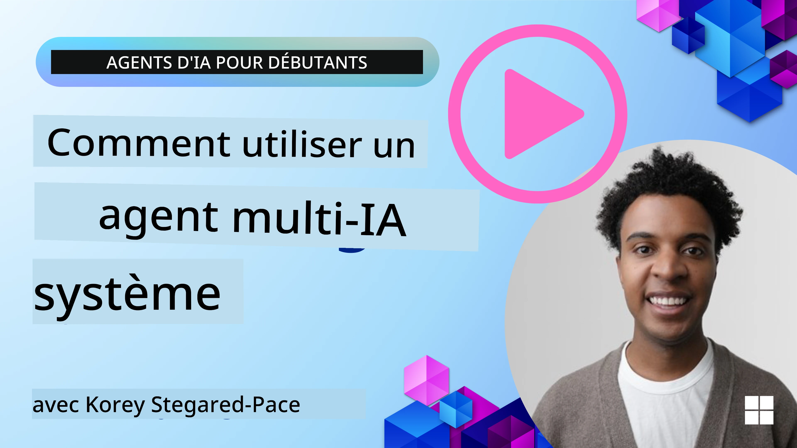
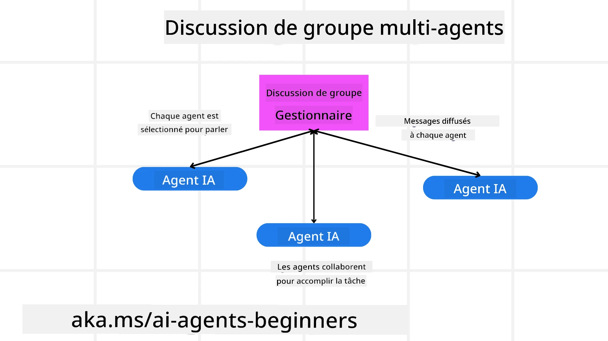
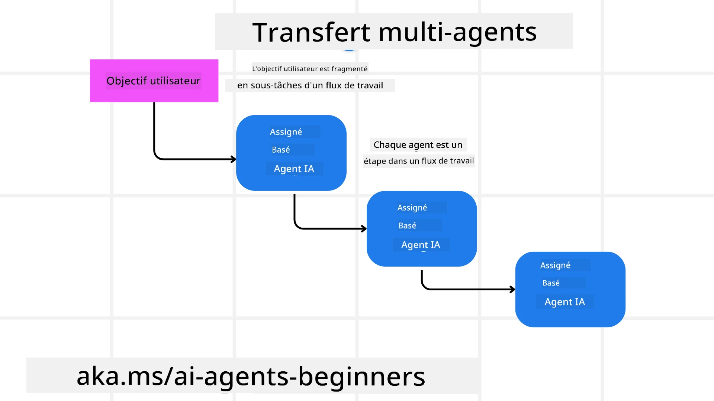
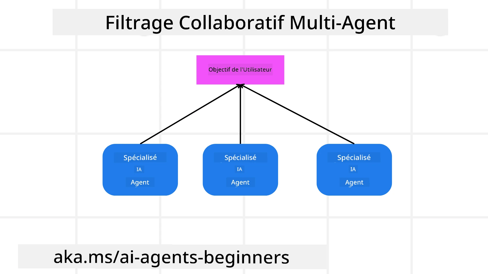

> _(Cliquez sur l'image ci-dessus pour visionner la vidéo de cette leçon)_

# Modèles de conception multi-agents

Dès que vous commencez à travailler sur un projet impliquant plusieurs agents, vous devrez envisager le modèle de conception multi-agents. Cependant, il n'est pas toujours immédiatement clair quand passer à plusieurs agents et quels en sont les avantages.

## Introduction

Dans cette leçon, nous cherchons à répondre aux questions suivantes :

- Quels sont les scénarios pour lesquels les multi-agents sont applicables ?
- Quels sont les avantages d'utiliser plusieurs agents plutôt qu'un agent unique accomplissant plusieurs tâches ?
- Quels sont les éléments constitutifs pour mettre en œuvre le modèle de conception multi-agents ?
- Comment avoir une visibilité sur la façon dont les multiples agents interagissent entre eux ?

## Objectifs d'apprentissage

Après cette leçon, vous devriez être capable de :

- Identifier les scénarios où les multi-agents sont applicables
- Reconnaître les avantages d'utiliser plusieurs agents plutôt qu'un agent unique.
- Comprendre les éléments constitutifs de la mise en œuvre du modèle de conception multi-agents.

Quelle est la vision d'ensemble ?

*Les multi-agents sont un modèle de conception qui permet à plusieurs agents de travailler ensemble pour atteindre un objectif commun*.

Ce modèle est largement utilisé dans divers domaines, notamment la robotique, les systèmes autonomes et l'informatique distribuée.

## Scénarios où les multi-agents sont applicables

Alors, quels scénarios sont adaptés à l'utilisation de multi-agents ? La réponse est qu'il existe de nombreux scénarios où l'emploi de plusieurs agents est bénéfique, notamment dans les cas suivants :

- **Charges de travail importantes** : Les grosses charges de travail peuvent être divisées en tâches plus petites et attribuées à différents agents, permettant un traitement parallèle et une exécution plus rapide. Un exemple est le traitement de grandes quantités de données.
- **Tâches complexes** : Les tâches complexes, comme les grosses charges de travail, peuvent être décomposées en sous-tâches plus petites attribuées à différents agents, chacun spécialisé dans un aspect spécifique de la tâche. Un bon exemple est la gestion des véhicules autonomes où différents agents gèrent la navigation, la détection d'obstacles et la communication avec d’autres véhicules.
- **Expertise diversifiée** : Différents agents peuvent avoir des expertises variées, leur permettant de gérer différents aspects d'une tâche plus efficacement qu'un seul agent. Un bon exemple est dans le domaine de la santé où des agents peuvent gérer les diagnostics, les plans de traitement, et la surveillance des patients.

## Avantages d’utiliser plusieurs agents par rapport à un agent unique

Un système à agent unique peut suffire pour des tâches simples, mais pour des tâches plus complexes, utiliser plusieurs agents offre plusieurs avantages :

- **Spécialisation** : Chaque agent peut être spécialisé pour une tâche spécifique. L'absence de spécialisation dans un agent unique signifie que cet agent peut faire un peu de tout, mais peut être confus face à une tâche complexe. Il pourrait, par exemple, finir par faire une tâche pour laquelle il n’est pas le mieux adapté.
- **Scalabilité** : Il est plus facile de faire évoluer les systèmes en ajoutant plus d’agents plutôt qu’en surchargeant un agent unique.
- **Tolérance aux pannes** : Si un agent échoue, les autres peuvent continuer à fonctionner, assurant ainsi la fiabilité du système.

Prenons un exemple, réservons un voyage pour un utilisateur. Un système à agent unique devrait gérer tous les aspects du processus de réservation, de la recherche de vols à la réservation de l'hôtel et de la voiture de location. Pour réaliser cela avec un seul agent, celui-ci devrait disposer d'outils pour gérer toutes ces tâches. Cela peut conduire à un système complexe et monolithique, difficile à maintenir et à faire évoluer. Un système multi-agents, en revanche, pourrait avoir différents agents spécialisés dans la recherche de vols, la réservation d’hôtels et de voitures de location. Cela rendrait le système plus modulaire, plus facile à maintenir et évolutif.

Comparez cela à une agence de voyages tenue par un couple versus une agence de voyages fonctionnant en franchise. Le couple serait un agent unique gérant tous les aspects de la réservation, tandis que la franchise aurait différents agents gérant différents aspects du processus de réservation.

## Éléments constitutifs de la mise en œuvre du modèle de conception multi-agents

Avant de pouvoir implémenter le modèle multi-agents, vous devez comprendre les éléments qui le composent.

Rendons cela plus concret en reprenant l’exemple de la réservation d’un voyage pour un utilisateur. Dans ce cas, les éléments constitutifs incluraient :

- **Communication entre agents** : Les agents chargés de trouver les vols, réserver les hôtels et les voitures doivent communiquer et partager les informations sur les préférences et contraintes de l'utilisateur. Vous devez choisir les protocoles et méthodes de communication. Concrètement, cela signifie que l'agent de recherche de vols doit communiquer avec l'agent de réservation d'hôtel pour s'assurer que l'hôtel est réservé aux mêmes dates que le vol. Cela signifie que les agents doivent partager des informations sur les dates de voyage de l'utilisateur, ce qui implique de décider *quels agents partagent quelles informations et comment ils les partagent*.
- **Mécanismes de coordination** : Les agents doivent coordonner leurs actions pour satisfaire les préférences et contraintes de l'utilisateur. Par exemple, une préférence utilisateur pourrait être un hôtel proche de l’aéroport tandis qu’une contrainte pourrait être que les voitures de location ne soient disponibles qu’à l’aéroport. Cela signifie que l’agent de réservation d’hôtel doit coordonner avec l’agent de réservation de voitures pour respecter ces préférences et contraintes. Vous devez donc décider *comment les agents coordonnent leurs actions*.
- **Architecture des agents** : Les agents doivent avoir une structure interne pour prendre des décisions et apprendre de leurs interactions avec l’utilisateur. Cela signifie que l’agent de recherche de vols doit avoir une structure interne pour décider quels vols recommander à l’utilisateur. Vous devez décider *comment les agents prennent des décisions et apprennent de leurs interactions avec l’utilisateur*. Par exemple, l’agent de recherche de vols pourrait utiliser un modèle d’apprentissage automatique pour recommander des vols en fonction des préférences passées de l’utilisateur.
- **Visibilité des interactions multi-agents** : Il est nécessaire d’avoir une visibilité sur la manière dont les agents interagissent entre eux. Cela implique de disposer d’outils et techniques pour suivre les activités et interactions des agents. Cela peut prendre la forme d’outils de journalisation et de surveillance, d’outils de visualisation, et de métriques de performance.
- **Modèles multi-agents** : Il existe différents modèles pour implémenter des systèmes multi-agents, tels que les architectures centralisées, décentralisées et hybrides. Vous devez choisir le modèle qui convient le mieux à votre cas d’usage.
- **Humain dans la boucle** : Dans la plupart des cas, un humain sera impliqué dans le processus, et vous devez indiquer aux agents quand demander une intervention humaine. Cela peut se traduire par un utilisateur demandant un hôtel ou un vol spécifique que les agents n’ont pas recommandé, ou demandant une confirmation avant de réserver un vol ou un hôtel.

## Visibilité des interactions multi-agents

Il est important d’avoir une visibilité sur la manière dont les multiples agents interagissent entre eux. Cette visibilité est essentielle pour le débogage, l’optimisation, et pour assurer l’efficacité globale du système. Pour cela, vous devez disposer d’outils et techniques pour suivre les activités et interactions des agents. Cela peut comprendre des outils de journalisation et de surveillance, des outils de visualisation, et des métriques de performance.

Par exemple, pour la réservation d’un voyage, vous pourriez avoir un tableau de bord qui affiche le statut de chaque agent, les préférences et contraintes de l’utilisateur, ainsi que les interactions entre agents. Ce tableau de bord pourrait montrer les dates de voyage de l’utilisateur, les vols recommandés par l’agent vols, les hôtels recommandés par l’agent hôtels, et les voitures recommandées par l’agent voitures. Cela vous donnerait une vue claire sur la façon dont les agents interagissent et si les préférences et contraintes de l’utilisateur sont respectées.

Examinons chacun de ces aspects plus en détail.

- **Outils de journalisation et surveillance** : Vous souhaitez enregistrer chaque action effectuée par un agent. Une entrée de journal peut stocker des informations sur l’agent ayant effectué l’action, l’action effectuée, le moment de l’action, et le résultat. Ces informations peuvent ensuite être utilisées pour le débogage, l’optimisation, etc.

- **Outils de visualisation** : Les outils de visualisation peuvent vous aider à voir les interactions entre agents de manière plus intuitive. Par exemple, vous pourriez avoir un graphe montrant le flux d’informations entre agents, ce qui peut aider à identifier des goulets d’étranglement, des inefficacités et d’autres problèmes.

- **Métriques de performance** : Les métriques de performance peuvent vous aider à suivre l’efficacité du système multi-agents. Par exemple, vous pouvez suivre le temps nécessaire pour accomplir une tâche, le nombre de tâches achevées par unité de temps, et la précision des recommandations faites par les agents. Ces données peuvent aider à identifier des pistes d’amélioration et optimiser le système.

## Modèles multi-agents

Plongeons dans quelques modèles concrets utilisables pour créer des applications multi-agents. Voici quelques modèles intéressants à considérer :

### Chat de groupe

Ce modèle est utile lorsque vous voulez créer une application de chat de groupe où plusieurs agents peuvent communiquer entre eux. Les cas d’usage typiques incluent la collaboration d’équipe, le support client, et les réseaux sociaux.

Dans ce modèle, chaque agent représente un utilisateur dans le chat de groupe, et les messages sont échangés entre agents via un protocole de messagerie. Les agents peuvent envoyer des messages au groupe, recevoir des messages du groupe, et répondre aux messages d’autres agents.

Ce modèle peut être implémenté avec une architecture centralisée où tous les messages passent par un serveur central, ou une architecture décentralisée où les messages sont échangés directement.

### Transfert de tâche

Ce modèle est utile lorsque vous voulez créer une application où plusieurs agents peuvent se transférer des tâches entre eux.

Les cas d’usage typiques incluent le support client, la gestion des tâches, et l’automatisation des flux de travail.

Dans ce modèle, chaque agent représente une tâche ou une étape du flux de travail, et les agents peuvent transférer des tâches à d’autres agents selon des règles prédéfinies.

### Filtrage collaboratif

Ce modèle est utile lorsque vous voulez créer une application où plusieurs agents collaborent pour faire des recommandations aux utilisateurs.

La raison pour laquelle plusieurs agents collaborent est que chaque agent peut avoir une expertise différente et contribuer au processus de recommandation de manières différentes.

Prenons l’exemple d’un utilisateur désirant une recommandation sur la meilleure action à acheter en bourse.

- **Expert secteur** : Un agent peut être expert dans un secteur spécifique.
- **Analyse technique** : Un autre agent peut être expert en analyse technique.
- **Analyse fondamentale** : Un autre agent peut être expert en analyse fondamentale. En collaborant, ces agents fournissent une recommandation plus complète à l’utilisateur.

## Scénario : Processus de remboursement

Considérons un scénario où un client cherche à obtenir un remboursement pour un produit, plusieurs agents peuvent être impliqués dans ce processus. Divisons-les entre agents spécifiques à ce processus et agents généraux pouvant être utilisés dans d’autres processus.

**Agents spécifiques au processus de remboursement** :

Voici quelques agents pouvant être impliqués dans le processus de remboursement :

- **Agent client** : Cet agent représente le client et est responsable de l’initiation du processus de remboursement.
- **Agent vendeur** : Cet agent représente le vendeur et est responsable du traitement du remboursement.
- **Agent paiement** : Cet agent représente le processus de paiement et est responsable du remboursement au client.
- **Agent résolution** : Cet agent gère la résolution des problèmes pouvant survenir lors du processus de remboursement.
- **Agent conformité** : Cet agent veille au respect des règlements et politiques pendant le processus de remboursement.

**Agents généraux** :

Ces agents peuvent être utilisés dans d’autres parties de votre entreprise.

- **Agent expédition** : Cet agent gère le processus d’expédition et est responsable du renvoi du produit au vendeur. Cet agent peut être utilisé pour le processus de remboursement mais aussi pour l’expédition générale d’un produit par exemple lors d’un achat.
- **Agent feedback** : Cet agent collecte les retours clients. Les retours peuvent être recueillis à tout moment, pas uniquement lors du remboursement.
- **Agent escalade** : Cet agent gère l’escalade des problèmes à un niveau supérieur de support. Vous pouvez utiliser ce type d’agent pour tout processus nécessitant une escalade.
- **Agent notification** : Cet agent envoie des notifications au client à différents stades du processus de remboursement.
- **Agent analytique** : Cet agent analyse les données liées au processus de remboursement.
- **Agent audit** : Cet agent vérifie que le processus de remboursement est correctement exécuté.
- **Agent reporting** : Cet agent génère des rapports sur le processus de remboursement.
- **Agent connaissance** : Cet agent maintient une base de connaissances liée au processus de remboursement. Cet agent peut être compétent à la fois sur les remboursements et d’autres aspects de votre entreprise.
- **Agent sécurité** : Cet agent veille à la sécurité du processus de remboursement.
- **Agent qualité** : Cet agent garantit la qualité du processus de remboursement.

Il y a donc un grand nombre d’agents listés précédemment, à la fois pour le processus spécifique de remboursement, mais aussi pour les agents généraux pouvant être utilisés dans d’autres parties de votre entreprise. Cela vous donne une idée de comment décider quels agents utiliser dans votre système multi-agents.

## Exercice

Concevez un système multi-agents pour un processus de support client. Identifiez les agents impliqués dans ce processus, leurs rôles et responsabilités, ainsi que la façon dont ils interagissent. Prenez en compte à la fois les agents spécifiques au support client et les agents généraux utilisables dans d’autres parties de votre entreprise.
> Réfléchissez bien avant de lire la solution suivante, vous pourriez avoir besoin de plus d'agents que vous ne le pensez.

> ASTUCE : Pensez aux différentes étapes du processus de support client et considérez également les agents nécessaires pour tout système.

## Solution

[Solution](./solution/solution.md)

## Vérifications des connaissances

Question : Quand devriez-vous envisager d'utiliser plusieurs agents ?

- [ ] A1 : Lorsque vous avez une petite charge de travail et une tâche simple.
- [ ] A2 : Lorsque vous avez une charge de travail importante.
- [ ] A3 : Lorsque vous avez une tâche simple.

[Quiz sur la solution](./solution/solution-quiz.md)

## Résumé

Dans cette leçon, nous avons examiné le modèle de conception multi-agent, y compris les scénarios où les multi-agents sont applicables, les avantages d'utiliser plusieurs agents plutôt qu'un seul, les éléments constitutifs de la mise en œuvre du modèle de conception multi-agent, et comment avoir une visibilité sur la manière dont plusieurs agents interagissent entre eux.

### Vous avez d'autres questions sur le modèle de conception multi-agent ?

Rejoignez le [Microsoft Foundry Discord](https://discord.com/invite/ATgtXmAS5D) pour rencontrer d'autres apprenants, participer aux heures de bureau et obtenir des réponses à vos questions sur les agents IA.

## Ressources supplémentaires

- <a href="https://learn.microsoft.com/azure/ai-services/agents/overview" target="_blank">Documentation du Microsoft Agent Framework</a>
- <a href="https://www.analyticsvidhya.com/blog/2024/10/agentic-design-patterns/" target="_blank">Modèles de conception agentique</a>

## Leçon précédente

[Planification de la conception](../07-planning-design/README.md)

## Leçon suivante

[Métacognition dans les agents IA](../09-metacognition/README.md)

---

<!-- CO-OP TRANSLATOR DISCLAIMER START -->
**Avertissement** :
Ce document a été traduit à l'aide du service de traduction automatique [Co-op Translator](https://github.com/Azure/co-op-translator). Bien que nous nous efforçions d'assurer l'exactitude, veuillez noter que les traductions automatisées peuvent contenir des erreurs ou des inexactitudes. Le document original dans sa langue native doit être considéré comme la source faisant autorité. Pour les informations critiques, il est recommandé de recourir à une traduction professionnelle réalisée par un humain. Nous ne saurions être tenus responsables des malentendus ou erreurs d'interprétation découlant de l'utilisation de cette traduction.
<!-- CO-OP TRANSLATOR DISCLAIMER END -->