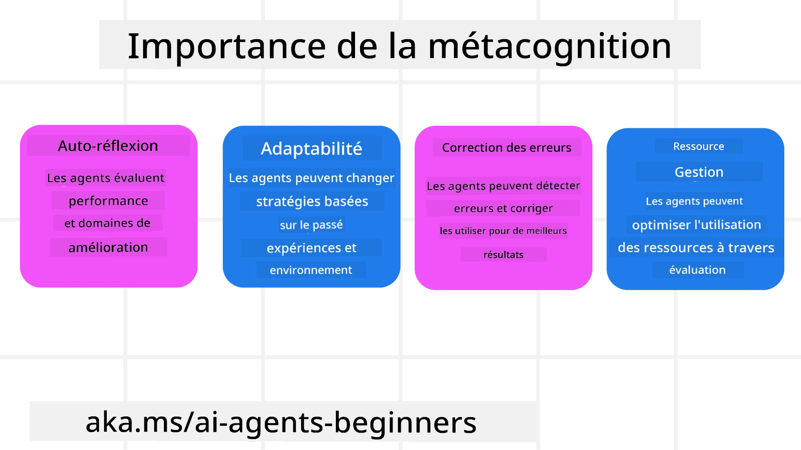
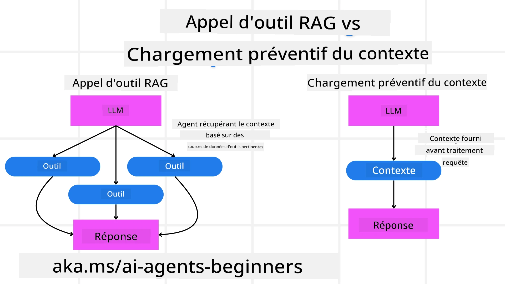

[](https://youtu.be/His9R6gw6Ec?si=3_RMb8VprNvdLRhX)

> _(Cliquez sur l'image ci-dessus pour voir la vidéo de cette leçon)_
# Métacognition chez les agents IA

## Introduction

Bienvenue dans la leçon sur la métacognition chez les agents IA ! Ce chapitre est conçu pour les débutants curieux de savoir comment les agents IA peuvent réfléchir à leurs propres processus de pensée. À la fin de cette leçon, vous comprendrez les concepts clés et serez équipé d'exemples pratiques pour appliquer la métacognition dans la conception d'agents IA.

## Objectifs d'apprentissage

Après avoir terminé cette leçon, vous serez capable de :

1. Comprendre les implications des boucles de raisonnement dans les définitions d'agents.
2. Utiliser des techniques de planification et d'évaluation pour aider les agents à s'auto-corriger.
3. Créer vos propres agents capables de manipuler du code pour accomplir des tâches.

## Introduction à la métacognition

La métacognition fait référence aux processus cognitifs de haut niveau qui impliquent de penser à sa propre pensée. Pour les agents IA, cela signifie être capable d'évaluer et d'ajuster leurs actions en fonction de la conscience de soi et des expériences passées. La métacognition, ou « penser à la pensée », est un concept important dans le développement des systèmes IA agentiques. Elle implique que les systèmes IA soient conscients de leurs propres processus internes et capables de surveiller, réguler et adapter leur comportement en conséquence. Un peu comme nous le faisons lorsque nous savons "lire la pièce" ou analyser un problème. Cette conscience de soi peut aider les systèmes IA à prendre de meilleures décisions, identifier des erreurs et améliorer leur performance au fil du temps—ce qui nous ramène au test de Turing et au débat sur la prise de contrôle éventuelle de l’IA.

Dans le contexte des systèmes IA agentiques, la métacognition peut aider à relever plusieurs défis, tels que :
- Transparence : Assurer que les systèmes IA puissent expliquer leur raisonnement et leurs décisions.
- Raisonnement : Améliorer la capacité des systèmes IA à synthétiser l’information et à prendre des décisions judicieuses.
- Adaptation : Permettre aux systèmes IA de s’ajuster à de nouveaux environnements et à des conditions changeantes.
- Perception : Améliorer la précision des systèmes IA pour reconnaître et interpréter les données de leur environnement.

### Qu’est-ce que la métacognition ?

La métacognition, ou « penser à la pensée », est un processus cognitif de haut niveau qui implique la conscience de soi et l’autorégulation de ses propres processus cognitifs. Dans le domaine de l’IA, la métacognition permet aux agents d’évaluer et d’adapter leurs stratégies et actions, conduisant à de meilleures capacités de résolution de problèmes et de prise de décisions. En comprenant la métacognition, vous pouvez concevoir des agents IA non seulement plus intelligents, mais aussi plus adaptables et efficaces. Dans une véritable métacognition, vous verriez l’IA raisonner explicitement sur son propre raisonnement.

Exemple : « J’ai privilégié les vols moins chers parce que… je pourrais passer à côté de vols directs, donc laissez-moi revérifier. »  
Suivre la manière ou la raison pour laquelle il a choisi un certain itinéraire.  
- Noter qu’il a fait des erreurs parce qu’il s’est trop appuyé sur les préférences utilisateur de la fois précédente, donc il modifie sa stratégie de prise de décision et pas seulement la recommandation finale.  
- Diagnostiquer des schémas comme : « Chaque fois que je vois l’utilisateur mentionner "trop de monde", je ne devrais pas seulement retirer certaines attractions mais aussi réfléchir au fait que ma méthode de sélection des “meilleures attractions” est défaillante si je classe toujours par popularité. »

### Importance de la métacognition chez les agents IA

La métacognition joue un rôle crucial dans la conception des agents IA pour plusieurs raisons :



- Auto-réflexion : Les agents peuvent évaluer leur propre performance et identifier des domaines à améliorer.
- Adaptabilité : Les agents peuvent modifier leurs stratégies en fonction des expériences passées et des environnements changeants.
- Correction d’erreurs : Les agents peuvent détecter et corriger les erreurs de façon autonome, menant à des résultats plus précis.
- Gestion des ressources : Les agents peuvent optimiser l’utilisation des ressources, comme le temps et la puissance de calcul, en planifiant et évaluant leurs actions.

## Composants d’un agent IA

Avant d’aborder les processus métacognitifs, il est essentiel de comprendre les composants de base d’un agent IA. Un agent IA se compose généralement de :

- Persona : La personnalité et les caractéristiques de l’agent, qui définissent sa manière d’interagir avec les utilisateurs.
- Outils : Les capacités et fonctions que l’agent peut exécuter.
- Compétences : Les connaissances et l’expertise que l’agent possède.

Ces composants fonctionnent ensemble pour créer une « unité d’expertise » capable d’accomplir des tâches spécifiques.

**Exemple** :  
Considérez un agent de voyage, un service d’agent qui non seulement planifie vos vacances, mais ajuste aussi son parcours en fonction des données en temps réel et des expériences passées des clients.

### Exemple : Métacognition dans un service d’agent de voyage

Imaginez que vous concevez un service d’agent de voyage alimenté par IA. Cet agent, « Travel Agent », aide les utilisateurs à planifier leurs vacances. Pour intégrer la métacognition, Travel Agent doit évaluer et ajuster ses actions basées sur la conscience de soi et les expériences passées. Voici comment la métacognition pourrait intervenir :

#### Tâche actuelle

La tâche actuelle est d’aider un utilisateur à planifier un voyage à Paris.

#### Étapes pour réaliser la tâche

1. **Recueillir les préférences de l'utilisateur** : Demander à l’utilisateur ses dates de voyage, son budget, ses centres d’intérêt (ex. musées, gastronomie, shopping) et ses éventuelles exigences spécifiques.
2. **Récupérer des informations** : Chercher des options de vols, d’hébergement, d’attractions et de restaurants correspondant aux préférences de l’utilisateur.
3. **Générer des recommandations** : Proposer un itinéraire personnalisé avec les détails des vols, les réservations d’hôtel et les activités suggérées.
4. **Ajuster selon les retours** : Demander à l’utilisateur un retour sur les recommandations et effectuer les ajustements nécessaires.

#### Ressources requises

- Accès aux bases de données de réservation de vols et hôtels.
- Informations sur les attractions et restaurants parisiens.
- Données de feedback utilisateur issues des interactions précédentes.

#### Expérience et auto-réflexion

Travel Agent utilise la métacognition pour évaluer sa performance et apprendre des expériences passées. Par exemple :

1. **Analyse des retours utilisateurs** : Travel Agent examine les retours des utilisateurs pour déterminer quelles recommandations ont été bien reçues et lesquelles ne l’ont pas été. Il ajuste ses suggestions futures en conséquence.
2. **Adaptabilité** : Si un utilisateur a précédemment indiqué ne pas aimer les lieux bondés, Travel Agent évitera de recommander des endroits touristiques populaires durant les heures de pointe à l’avenir.
3. **Correction d’erreurs** : Si Travel Agent a fait une erreur lors d’une réservation passée, comme suggérer un hôtel complet, il apprend à vérifier la disponibilité plus rigoureusement avant de faire des recommandations.

#### Exemple pratique pour développeur

Voici un exemple simplifié du code de Travel Agent incorporant la métacognition :

```python
class Travel_Agent:
    def __init__(self):
        self.user_preferences = {}
        self.experience_data = []

    def gather_preferences(self, preferences):
        self.user_preferences = preferences

    def retrieve_information(self):
        # Rechercher des vols, des hôtels et des attractions en fonction des préférences
        flights = search_flights(self.user_preferences)
        hotels = search_hotels(self.user_preferences)
        attractions = search_attractions(self.user_preferences)
        return flights, hotels, attractions

    def generate_recommendations(self):
        flights, hotels, attractions = self.retrieve_information()
        itinerary = create_itinerary(flights, hotels, attractions)
        return itinerary

    def adjust_based_on_feedback(self, feedback):
        self.experience_data.append(feedback)
        # Analyser les retours et ajuster les recommandations futures
        self.user_preferences = adjust_preferences(self.user_preferences, feedback)

# Exemple d'utilisation
travel_agent = Travel_Agent()
preferences = {
    "destination": "Paris",
    "dates": "2025-04-01 to 2025-04-10",
    "budget": "moderate",
    "interests": ["museums", "cuisine"]
}
travel_agent.gather_preferences(preferences)
itinerary = travel_agent.generate_recommendations()
print("Suggested Itinerary:", itinerary)
feedback = {"liked": ["Louvre Museum"], "disliked": ["Eiffel Tower (too crowded)"]}
travel_agent.adjust_based_on_feedback(feedback)
```

#### Pourquoi la métacognition est importante

- **Auto-réflexion** : Les agents peuvent analyser leur performance et identifier des domaines à améliorer.
- **Adaptabilité** : Les agents peuvent modifier leurs stratégies en fonction des retours et des conditions changeantes.
- **Correction d’erreurs** : Les agents peuvent détecter et corriger de façon autonome les erreurs.
- **Gestion des ressources** : Les agents peuvent optimiser l’utilisation des ressources, comme le temps et la puissance de calcul.

En intégrant la métacognition, Travel Agent peut fournir des recommandations de voyage plus personnalisées et précises, améliorant ainsi l’expérience utilisateur globale.

---

## 2. Planification chez les agents

La planification est un élément critique du comportement des agents IA. Elle consiste à définir les étapes nécessaires pour atteindre un objectif, en tenant compte de l’état actuel, des ressources et des obstacles possibles.

### Éléments de la planification

- **Tâche actuelle** : Définir clairement la tâche.
- **Étapes pour accomplir la tâche** : Décomposer la tâche en étapes gérables.
- **Ressources nécessaires** : Identifier les ressources indispensables.
- **Expérience** : Utiliser les expériences passées pour informer la planification.

**Exemple** :  
Voici les étapes que Travel Agent doit suivre pour aider un utilisateur à planifier efficacement son voyage :

### Étapes pour Travel Agent

1. **Recueillir les préférences de l'utilisateur**
   - Demander à l’utilisateur les détails concernant leurs dates de voyage, budget, intérêts et exigences spécifiques.
   - Exemples : « Quand prévoyez-vous de voyager ? », « Quel est votre budget ? », « Quelles activités appréciez-vous pendant vos vacances ? »

2. **Récupérer les informations**
   - Chercher des options de voyage pertinentes en fonction des préférences de l’utilisateur.
   - **Vols** : Trouver des vols disponibles dans le budget et les dates préférées.
   - **Hébergements** : Trouver des hôtels ou locations correspondant aux préférences d’emplacement, de prix et d’équipements.
   - **Attractions et restaurants** : Identifier les attractions populaires, activités et restaurants qui s’alignent avec les intérêts de l’utilisateur.

3. **Générer des recommandations**
   - Compiler les informations recueillies en un itinéraire personnalisé.
   - Fournir des détails comme les options de vol, les réservations d’hôtel et les activités suggérées, en adaptant les recommandations aux préférences de l’utilisateur.

4. **Présenter l’itinéraire à l’utilisateur**
   - Partager l’itinéraire proposé à l’utilisateur pour qu’il le consulte.
   - Exemple : « Voici un itinéraire suggéré pour votre voyage à Paris. Il comprend les détails des vols, les réservations d’hôtel et une liste d’activités et restaurants recommandés. Qu’en pensez-vous ? »

5. **Recueillir des retours**
   - Demander à l’utilisateur son avis sur l’itinéraire proposé.
   - Exemples : « Aimez-vous les options de vol ? », « L’hôtel convient-il à vos besoins ? », « Souhaitez-vous ajouter ou retirer des activités ? »

6. **Ajuster selon les retours**
   - Modifier l’itinéraire en fonction des retours de l’utilisateur.
   - Apporter les changements nécessaires aux recommandations de vol, d’hébergement et d’activités pour mieux correspondre aux préférences.

7. **Confirmation finale**
   - Présenter l’itinéraire mis à jour à l’utilisateur pour confirmation finale.
   - Exemple : « J’ai ajusté l’itinéraire en fonction de vos retours. Voici la version mise à jour. Est-ce que tout vous convient ? »

8. **Réserver et confirmer les réservations**
   - Une fois l’itinéraire validé, procéder aux réservations des vols, hébergements et activités prévues.
   - Envoyer les détails de confirmation à l’utilisateur.

9. **Offrir un support continu**
   - Rester disponible pour aider l’utilisateur en cas de changements ou de demandes supplémentaires avant et pendant le voyage.
   - Exemple : « Si vous avez besoin d’aide supplémentaire pendant votre voyage, n’hésitez pas à me contacter à tout moment ! »

### Exemple d’interaction

```python
class Travel_Agent:
    def __init__(self):
        self.user_preferences = {}
        self.experience_data = []

    def gather_preferences(self, preferences):
        self.user_preferences = preferences

    def retrieve_information(self):
        flights = search_flights(self.user_preferences)
        hotels = search_hotels(self.user_preferences)
        attractions = search_attractions(self.user_preferences)
        return flights, hotels, attractions

    def generate_recommendations(self):
        flights, hotels, attractions = self.retrieve_information()
        itinerary = create_itinerary(flights, hotels, attractions)
        return itinerary

    def adjust_based_on_feedback(self, feedback):
        self.experience_data.append(feedback)
        self.user_preferences = adjust_preferences(self.user_preferences, feedback)

# Exemple d'utilisation dans une demande de réservation
travel_agent = Travel_Agent()
preferences = {
    "destination": "Paris",
    "dates": "2025-04-01 to 2025-04-10",
    "budget": "moderate",
    "interests": ["museums", "cuisine"]
}
travel_agent.gather_preferences(preferences)
itinerary = travel_agent.generate_recommendations()
print("Suggested Itinerary:", itinerary)
feedback = {"liked": ["Louvre Museum"], "disliked": ["Eiffel Tower (too crowded)"]}
travel_agent.adjust_based_on_feedback(feedback)
```

## 3. Système RAG correctif

Commençons d’abord par comprendre la différence entre l’outil RAG et le chargement contextuel préventif.



### Retrieval-Augmented Generation (RAG)

Le RAG combine un système de récupération avec un modèle génératif. Lorsqu’une requête est faite, le système de récupération extrait des documents ou données pertinents à partir d’une source externe, et ces informations récupérées sont utilisées pour enrichir l’entrée du modèle génératif. Cela aide le modèle à générer des réponses plus précises et contextuellement pertinentes.

Dans un système RAG, l’agent récupère des informations pertinentes à partir d’une base de connaissances et les utilise pour générer des réponses ou actions appropriées.

### Approche RAG correctrice

L’approche RAG correctrice se concentre sur l’utilisation des techniques RAG pour corriger les erreurs et améliorer la précision des agents IA. Cela implique :

1. **Technique de prompt** : Utiliser des prompts spécifiques pour guider l’agent dans la récupération d’informations pertinentes.
2. **Outil** : Mettre en œuvre des algorithmes et mécanismes permettant à l’agent d’évaluer la pertinence des informations récupérées et de générer des réponses précises.
3. **Évaluation** : Évaluer continuellement la performance de l’agent et effectuer des ajustements pour améliorer précision et efficacité.

#### Exemple : RAG correctif dans un agent de recherche

Considérez un agent de recherche qui récupère des informations sur le web pour répondre aux requêtes des utilisateurs. L’approche RAG corrective pourrait inclure :

1. **Technique de prompt** : Formuler des requêtes de recherche basées sur les entrées de l’utilisateur.
2. **Outil** : Utiliser des algorithmes de traitement du langage naturel et d’apprentissage automatique pour classer et filtrer les résultats de recherche.
3. **Évaluation** : Analyser les retours d’utilisateur pour identifier et corriger les inexactitudes dans les informations récupérées.

### RAG correctif dans Travel Agent

Le RAG correctif (Retrieval-Augmented Generation) améliore la capacité d’une IA à récupérer et générer des informations tout en corrigeant les erreurs éventuelles. Voyons comment Travel Agent peut utiliser l’approche RAG correctrice pour fournir des recommandations de voyage plus précises et pertinentes.

Cela implique :

- **Technique de prompt** : Utiliser des prompts spécifiques pour guider l’agent dans la récupération d’informations pertinentes.
- **Outil** : Implémenter des algorithmes et mécanismes permettant à l’agent d’évaluer la pertinence des informations récupérées et de générer des réponses précises.
- **Évaluation** : Évaluer en continu la performance de l’agent et ajuster pour améliorer précision et efficacité.

#### Étapes pour implémenter le RAG correctif dans Travel Agent

1. **Interaction initiale avec l'utilisateur**
   - Travel Agent recueille les préférences initiales de l’utilisateur, telles que destination, dates de voyage, budget et intérêts.
   - Exemple :

     ```python
     preferences = {
         "destination": "Paris",
         "dates": "2025-04-01 to 2025-04-10",
         "budget": "moderate",
         "interests": ["museums", "cuisine"]
     }
     ```

2. **Récupération d’informations**
   - Travel Agent récupère des informations sur les vols, hébergements, attractions et restaurants basées sur les préférences utilisateur.
   - Exemple :

     ```python
     flights = search_flights(preferences)
     hotels = search_hotels(preferences)
     attractions = search_attractions(preferences)
     ```

3. **Génération des recommandations initiales**
   - Travel Agent utilise les informations récupérées pour générer un itinéraire personnalisé.
   - Exemple :

     ```python
     itinerary = create_itinerary(flights, hotels, attractions)
     print("Suggested Itinerary:", itinerary)
     ```

4. **Collecte des retours utilisateur**
   - Travel Agent demande à l’utilisateur un retour sur les recommandations initiales.
   - Exemple :

     ```python
     feedback = {
         "liked": ["Louvre Museum"],
         "disliked": ["Eiffel Tower (too crowded)"]
     }
     ```

5. **Processus RAG correctif**
   - **Technique de prompt** : Travel Agent formule de nouvelles requêtes de recherche basées sur les retours utilisateur.
     - Exemple :

       ```python
       if "disliked" in feedback:
           preferences["avoid"] = feedback["disliked"]
       ```

   - **Outil** : Travel Agent utilise des algorithmes pour classer et filtrer les nouveaux résultats de recherche, en mettant l’accent sur la pertinence basée sur les retours utilisateur.
     - Exemple :

       ```python
       new_attractions = search_attractions(preferences)
       new_itinerary = create_itinerary(flights, hotels, new_attractions)
       print("Updated Itinerary:", new_itinerary)
       ```

   - **Évaluation** : Travel Agent évalue continuellement la pertinence et la précision de ses recommandations en analysant les retours utilisateurs et en effectuant les ajustements nécessaires.
     - Exemple :

       ```python
       def adjust_preferences(preferences, feedback):
           if "liked" in feedback:
               preferences["favorites"] = feedback["liked"]
           if "disliked" in feedback:
               preferences["avoid"] = feedback["disliked"]
           return preferences

       preferences = adjust_preferences(preferences, feedback)
       ```

#### Exemple pratique

Voici un exemple simplifié de code Python incorporant l’approche RAG correctrice dans Travel Agent :

```python
class Travel_Agent:
    def __init__(self):
        self.user_preferences = {}
        self.experience_data = []

    def gather_preferences(self, preferences):
        self.user_preferences = preferences

    def retrieve_information(self):
        flights = search_flights(self.user_preferences)
        hotels = search_hotels(self.user_preferences)
        attractions = search_attractions(self.user_preferences)
        return flights, hotels, attractions

    def generate_recommendations(self):
        flights, hotels, attractions = self.retrieve_information()
        itinerary = create_itinerary(flights, hotels, attractions)
        return itinerary

    def adjust_based_on_feedback(self, feedback):
        self.experience_data.append(feedback)
        self.user_preferences = adjust_preferences(self.user_preferences, feedback)
        new_itinerary = self.generate_recommendations()
        return new_itinerary

# Exemple d'utilisation
travel_agent = Travel_Agent()
preferences = {
    "destination": "Paris",
    "dates": "2025-04-01 to 2025-04-10",
    "budget": "moderate",
    "interests": ["museums", "cuisine"]
}
travel_agent.gather_preferences(preferences)
itinerary = travel_agent.generate_recommendations()
print("Suggested Itinerary:", itinerary)
feedback = {"liked": ["Louvre Museum"], "disliked": ["Eiffel Tower (too crowded)"]}
new_itinerary = travel_agent.adjust_based_on_feedback(feedback)
print("Updated Itinerary:", new_itinerary)
```

### Chargement contextuel préventif
Le chargement préventif du contexte consiste à charger des informations contextuelles ou de fond pertinentes dans le modèle avant de traiter une requête. Cela signifie que le modèle a accès à ces informations dès le départ, ce qui peut l'aider à générer des réponses plus informées sans avoir besoin de récupérer des données supplémentaires pendant le processus.

Voici un exemple simplifié de ce à quoi pourrait ressembler un chargement préventif du contexte pour une application d'agent de voyage en Python :

```python
class TravelAgent:
    def __init__(self):
        # Précharger les destinations populaires et leurs informations
        self.context = {
            "Paris": {"country": "France", "currency": "Euro", "language": "French", "attractions": ["Eiffel Tower", "Louvre Museum"]},
            "Tokyo": {"country": "Japan", "currency": "Yen", "language": "Japanese", "attractions": ["Tokyo Tower", "Shibuya Crossing"]},
            "New York": {"country": "USA", "currency": "Dollar", "language": "English", "attractions": ["Statue of Liberty", "Times Square"]},
            "Sydney": {"country": "Australia", "currency": "Dollar", "language": "English", "attractions": ["Sydney Opera House", "Bondi Beach"]}
        }

    def get_destination_info(self, destination):
        # Récupérer les informations de destination à partir du contexte préchargé
        info = self.context.get(destination)
        if info:
            return f"{destination}:\nCountry: {info['country']}\nCurrency: {info['currency']}\nLanguage: {info['language']}\nAttractions: {', '.join(info['attractions'])}"
        else:
            return f"Sorry, we don't have information on {destination}."

# Exemple d'utilisation
travel_agent = TravelAgent()
print(travel_agent.get_destination_info("Paris"))
print(travel_agent.get_destination_info("Tokyo"))
```

#### Explication

1. **Initialisation (méthode `__init__`)** : La classe `TravelAgent` précharge un dictionnaire contenant des informations sur des destinations populaires telles que Paris, Tokyo, New York et Sydney. Ce dictionnaire inclut des détails comme le pays, la monnaie, la langue et les principales attractions pour chaque destination.

2. **Récupération d'informations (méthode `get_destination_info`)** : Lorsqu'un utilisateur interroge sur une destination spécifique, la méthode `get_destination_info` récupère les informations pertinentes depuis le dictionnaire de contexte préchargé.

En préchargeant le contexte, l'application d'agent de voyage peut répondre rapidement aux requêtes des utilisateurs sans avoir à récupérer ces informations depuis une source externe en temps réel. Cela rend l'application plus efficace et réactive.

### Initialiser le plan avec un objectif avant d'itérer

Initialiser un plan avec un objectif consiste à commencer avec un but clair ou un résultat cible en tête. En définissant cet objectif dès le départ, le modèle peut l'utiliser comme principe directeur tout au long du processus itératif. Cela aide à garantir que chaque itération rapproche du résultat souhaité, rendant le processus plus efficace et ciblé.

Voici un exemple de la façon dont vous pourriez initialiser un plan de voyage avec un objectif avant d'itérer pour un agent de voyage en Python :

### Scénario

Un agent de voyage souhaite planifier des vacances personnalisées pour un client. L'objectif est de créer un itinéraire de voyage qui maximise la satisfaction du client en fonction de ses préférences et de son budget.

### Étapes

1. Définir les préférences du client et son budget.
2. Initialiser le plan initial en fonction de ces préférences.
3. Itérer pour affiner le plan, en optimisant la satisfaction du client.

#### Code Python

```python
class TravelAgent:
    def __init__(self, destinations):
        self.destinations = destinations

    def bootstrap_plan(self, preferences, budget):
        plan = []
        total_cost = 0

        for destination in self.destinations:
            if total_cost + destination['cost'] <= budget and self.match_preferences(destination, preferences):
                plan.append(destination)
                total_cost += destination['cost']

        return plan

    def match_preferences(self, destination, preferences):
        for key, value in preferences.items():
            if destination.get(key) != value:
                return False
        return True

    def iterate_plan(self, plan, preferences, budget):
        for i in range(len(plan)):
            for destination in self.destinations:
                if destination not in plan and self.match_preferences(destination, preferences) and self.calculate_cost(plan, destination) <= budget:
                    plan[i] = destination
                    break
        return plan

    def calculate_cost(self, plan, new_destination):
        return sum(destination['cost'] for destination in plan) + new_destination['cost']

# Exemple d'utilisation
destinations = [
    {"name": "Paris", "cost": 1000, "activity": "sightseeing"},
    {"name": "Tokyo", "cost": 1200, "activity": "shopping"},
    {"name": "New York", "cost": 900, "activity": "sightseeing"},
    {"name": "Sydney", "cost": 1100, "activity": "beach"},
]

preferences = {"activity": "sightseeing"}
budget = 2000

travel_agent = TravelAgent(destinations)
initial_plan = travel_agent.bootstrap_plan(preferences, budget)
print("Initial Plan:", initial_plan)

refined_plan = travel_agent.iterate_plan(initial_plan, preferences, budget)
print("Refined Plan:", refined_plan)
```

#### Explication du code

1. **Initialisation (méthode `__init__`)** : La classe `TravelAgent` est initialisée avec une liste de destinations potentielles, chacune ayant des attributs comme le nom, le coût et le type d'activité.

2. **Initialisation du Plan (méthode `bootstrap_plan`)** : Cette méthode crée un plan de voyage initial basé sur les préférences du client et son budget. Elle parcourt la liste des destinations et les ajoute au plan si elles correspondent aux préférences du client et respectent le budget.

3. **Correspondance des préférences (méthode `match_preferences`)** : Cette méthode vérifie si une destination correspond aux préférences du client.

4. **Itération du Plan (méthode `iterate_plan`)** : Cette méthode affine le plan initial en tentant de remplacer chaque destination par une meilleure option, en tenant compte des préférences du client et des contraintes budgétaires.

5. **Calcul du Coût (méthode `calculate_cost`)** : Cette méthode calcule le coût total du plan actuel, y compris une nouvelle destination potentielle.

#### Exemple d'utilisation

- **Plan initial** : L'agent de voyage crée un plan initial basé sur les préférences du client en matière de visites touristiques et un budget de 2000 $.
- **Plan affiné** : L'agent de voyage itère sur le plan, optimisant les préférences du client et le budget.

En initialisant le plan avec un objectif clair (par exemple, maximiser la satisfaction du client) et en itérant pour affiner le plan, l'agent de voyage peut créer un itinéraire personnalisé et optimisé pour le client. Cette approche garantit que le plan de voyage est aligné dès le départ avec les préférences et le budget du client et qu'il s'améliore à chaque itération.

### Tirer parti des LLM pour le réordonnancement et le scoring

Les grands modèles de langage (LLM) peuvent être utilisés pour le réordonnancement et le scoring en évaluant la pertinence et la qualité des documents récupérés ou des réponses générées. Voici comment cela fonctionne :

**Récupération :** L'étape initiale de récupération obtient un ensemble de documents ou de réponses candidates basées sur la requête.

**Réordonnancement :** Le LLM évalue ces candidats et les réordonne en fonction de leur pertinence et qualité. Cette étape garantit que l'information la plus pertinente et de meilleure qualité est présentée en premier.

**Scoring :** Le LLM attribue des scores à chaque candidat, reflétant leur pertinence et qualité. Cela aide à sélectionner la meilleure réponse ou document pour l'utilisateur.

En exploitant les LLM pour le réordonnancement et le scoring, le système peut fournir des informations plus précises et contextuellement pertinentes, améliorant ainsi l'expérience utilisateur globale.

Voici un exemple de la façon dont un agent de voyage pourrait utiliser un grand modèle de langage (LLM) pour réordonner et scorer des destinations en fonction des préférences utilisateur en Python :

#### Scénario - Voyage basé sur les préférences

Un agent de voyage souhaite recommander les meilleures destinations à un client selon ses préférences. Le LLM aidera à réordonner et scorer les destinations pour garantir que les options les plus pertinentes soient présentées.

#### Étapes :

1. Collecter les préférences de l'utilisateur.
2. Récupérer une liste de destinations potentielles.
3. Utiliser le LLM pour réordonner et scorer les destinations selon les préférences utilisateur.

Voici comment vous pouvez mettre à jour l'exemple précédent pour utiliser les services Azure OpenAI :

#### Prérequis

1. Vous devez disposer d'un abonnement Azure.
2. Créez une ressource Azure OpenAI et obtenez votre clé API.

#### Exemple de code Python

```python
import requests
import json

class TravelAgent:
    def __init__(self, destinations):
        self.destinations = destinations

    def get_recommendations(self, preferences, api_key, endpoint):
        # Générer une invite pour Azure OpenAI
        prompt = self.generate_prompt(preferences)
        
        # Définir les en-têtes et la charge utile pour la requête
        headers = {
            'Content-Type': 'application/json',
            'Authorization': f'Bearer {api_key}'
        }
        payload = {
            "prompt": prompt,
            "max_tokens": 150,
            "temperature": 0.7
        }
        
        # Appeler l'API Azure OpenAI pour obtenir les destinations reclassées et notées
        response = requests.post(endpoint, headers=headers, json=payload)
        response_data = response.json()
        
        # Extraire et retourner les recommandations
        recommendations = response_data['choices'][0]['text'].strip().split('\n')
        return recommendations

    def generate_prompt(self, preferences):
        prompt = "Here are the travel destinations ranked and scored based on the following user preferences:\n"
        for key, value in preferences.items():
            prompt += f"{key}: {value}\n"
        prompt += "\nDestinations:\n"
        for destination in self.destinations:
            prompt += f"- {destination['name']}: {destination['description']}\n"
        return prompt

# Exemple d'utilisation
destinations = [
    {"name": "Paris", "description": "City of lights, known for its art, fashion, and culture."},
    {"name": "Tokyo", "description": "Vibrant city, famous for its modernity and traditional temples."},
    {"name": "New York", "description": "The city that never sleeps, with iconic landmarks and diverse culture."},
    {"name": "Sydney", "description": "Beautiful harbour city, known for its opera house and stunning beaches."},
]

preferences = {"activity": "sightseeing", "culture": "diverse"}
api_key = 'your_azure_openai_api_key'
endpoint = 'https://your-endpoint.com/openai/deployments/your-deployment-name/completions?api-version=2022-12-01'

travel_agent = TravelAgent(destinations)
recommendations = travel_agent.get_recommendations(preferences, api_key, endpoint)
print("Recommended Destinations:")
for rec in recommendations:
    print(rec)
```

#### Explication du code - Preference Booker

1. **Initialisation** : La classe `TravelAgent` est initialisée avec une liste de destinations potentielles, chacune ayant des attributs comme nom et description.

2. **Obtenir des recommandations (méthode `get_recommendations`)** : Cette méthode génère une invite pour le service Azure OpenAI basée sur les préférences de l'utilisateur et effectue une requête HTTP POST à l'API Azure OpenAI pour obtenir des destinations réordonnées et scorées.

3. **Génération de l'invite (méthode `generate_prompt`)** : Cette méthode construit une invite pour Azure OpenAI, incluant les préférences de l'utilisateur et la liste des destinations. L'invite guide le modèle pour réordonner et scorer les destinations selon les préférences fournies.

4. **Appel API** : La bibliothèque `requests` est utilisée pour effectuer une requête HTTP POST sur le point de terminaison Azure OpenAI. La réponse contient les destinations réordonnées et scorées.

5. **Exemple d'utilisation** : L'agent de voyage collecte les préférences de l'utilisateur (ex. : intérêt pour les visites et culture diverse) et utilise le service Azure OpenAI pour obtenir des recommandations réordonnées et scorées pour les destinations.

Assurez-vous de remplacer `your_azure_openai_api_key` par votre clé API Azure OpenAI réelle et `https://your-endpoint.com/...` par l'URL du point de terminaison réel de votre déploiement Azure OpenAI.

En tirant parti du LLM pour le réordonnancement et le scoring, l'agent de voyage peut fournir des recommandations de voyage plus personnalisées et pertinentes aux clients, améliorant ainsi leur expérience globale.

### RAG : technique de prompting vs outil

La génération augmentée par récupération (RAG) peut être à la fois une technique de prompting et un outil dans le développement d'agents IA. Comprendre la distinction entre les deux peut vous aider à exploiter RAG de manière plus efficace dans vos projets.

#### RAG en tant que technique de prompting

**Qu'est-ce que c'est ?**

- En tant que technique de prompting, RAG consiste à formuler des requêtes ou prompts spécifiques pour guider la récupération d'informations pertinentes à partir d'un large corpus ou d'une base de données. Ces informations sont ensuite utilisées pour générer des réponses ou des actions.

**Comment ça fonctionne :**

1. **Formuler des Prompts** : Créer des prompts ou requêtes bien structurées basées sur la tâche ou l'entrée utilisateur.
2. **Récupérer les Informations** : Utiliser ces prompts pour rechercher des données pertinentes depuis une base de connaissances préexistante ou un jeu de données.
3. **Générer la Réponse** : Combiner les informations récupérées avec des modèles d'IA génératifs pour produire une réponse complète et cohérente.

**Exemple dans un agent de voyage** :

- Entrée utilisateur : "Je veux visiter des musées à Paris."
- Prompt : "Trouve les meilleurs musées à Paris."
- Informations récupérées : Détails sur le Louvre, Musée d'Orsay, etc.
- Réponse générée : "Voici quelques musées incontournables à Paris : le Louvre, le Musée d'Orsay et le Centre Pompidou."

#### RAG en tant qu'outil

**Qu'est-ce que c'est ?**

- En tant qu'outil, RAG est un système intégré qui automatise le processus de récupération et de génération, facilitant la mise en œuvre par les développeurs de fonctionnalités IA complexes sans avoir à élaborer manuellement des prompts pour chaque requête.

**Comment ça fonctionne :**

1. **Intégration** : Intégrer RAG dans l'architecture de l'agent IA, lui permettant de gérer automatiquement les tâches de récupération et de génération.
2. **Automatisation** : L'outil gère tout le processus, de la réception de l'entrée utilisateur à la génération de la réponse finale, sans nécessiter de prompts explicites à chaque étape.
3. **Efficacité** : Améliore la performance de l'agent en rationalisant le processus de récupération et de génération, offrant des réponses plus rapides et précises.

**Exemple dans un agent de voyage** :

- Entrée utilisateur : "Je veux visiter des musées à Paris."
- Outil RAG : Récupère automatiquement les infos sur les musées et génère une réponse.
- Réponse générée : "Voici quelques musées incontournables à Paris : le Louvre, le Musée d'Orsay et le Centre Pompidou."

### Comparaison

| Aspect                  | Technique de Prompting                                     | Outil                                                  |
|-------------------------|------------------------------------------------------------|--------------------------------------------------------|
| **Manuel vs Automatique**| Formulation manuelle des prompts pour chaque requête.      | Processus automatisé pour récupération et génération.  |
| **Contrôle**             | Offre plus de contrôle sur la récupération.                | Rationalise et automatise la récupération et génération.|
| **Flexibilité**          | Permet des prompts personnalisés selon les besoins.        | Plus efficace pour les implémentations à grande échelle.|
| **Complexité**           | Nécessite la création et ajustement des prompts.           | Plus facile à intégrer dans l'architecture d'un agent IA.|

### Exemples pratiques

**Exemple de technique de prompting :**

```python
def search_museums_in_paris():
    prompt = "Find top museums in Paris"
    search_results = search_web(prompt)
    return search_results

museums = search_museums_in_paris()
print("Top Museums in Paris:", museums)
```

**Exemple d'outil :**

```python
class Travel_Agent:
    def __init__(self):
        self.rag_tool = RAGTool()

    def get_museums_in_paris(self):
        user_input = "I want to visit museums in Paris."
        response = self.rag_tool.retrieve_and_generate(user_input)
        return response

travel_agent = Travel_Agent()
museums = travel_agent.get_museums_in_paris()
print("Top Museums in Paris:", museums)
```

### Évaluer la pertinence

L’évaluation de la pertinence est un aspect crucial de la performance des agents IA. Elle garantit que l'information récupérée et générée par l'agent est appropriée, exacte et utile pour l'utilisateur. Explorons comment évaluer la pertinence dans les agents IA, avec des exemples pratiques et des techniques.

#### Concepts clés dans l'évaluation de la pertinence

1. **Conscience du contexte** :
   - L'agent doit comprendre le contexte de la requête utilisateur pour récupérer et générer des informations pertinentes.
   - Exemple : Si un utilisateur demande "meilleurs restaurants à Paris", l'agent doit prendre en compte les préférences de ce dernier, comme le type de cuisine et le budget.

2. **Exactitude** :
   - L'information fournie par l'agent doit être factuellement correcte et à jour.
   - Exemple : Recommander des restaurants actuellement ouverts avec de bonnes critiques plutôt que des options obsolètes ou fermées.

3. **Intention de l'utilisateur** :
   - L'agent doit inférer l'intention derrière la requête pour fournir l'information la plus pertinente.
   - Exemple : Si l'utilisateur demande "hôtels économiques", l'agent doit privilégier des options abordables.

4. **Boucle de rétroaction** :
   - La collecte et l'analyse continue des retours utilisateurs aident l'agent à affiner son processus d'évaluation de pertinence.
   - Exemple : Intégrer les notes et retours des utilisateurs sur les recommandations précédentes pour améliorer les réponses futures.

#### Techniques pratiques pour évaluer la pertinence

1. **Score de pertinence** :
   - Attribuer un score de pertinence à chaque élément récupéré selon sa correspondance avec la requête et les préférences de l'utilisateur.
   - Exemple :

     ```python
     def relevance_score(item, query):
         score = 0
         if item['category'] in query['interests']:
             score += 1
         if item['price'] <= query['budget']:
             score += 1
         if item['location'] == query['destination']:
             score += 1
         return score
     ```

2. **Filtrage et classement** :
   - Filtrer les éléments non pertinents et classer les restants selon leur score de pertinence.
   - Exemple :

     ```python
     def filter_and_rank(items, query):
         ranked_items = sorted(items, key=lambda item: relevance_score(item, query), reverse=True)
         return ranked_items[:10]  # Retourner les 10 éléments les plus pertinents
     ```

3. **Traitement automatique du langage naturel (NLP)** :
   - Utiliser les techniques NLP pour comprendre la requête et récupérer des informations pertinentes.
   - Exemple :

     ```python
     def process_query(query):
         # Utilisez le traitement du langage naturel pour extraire les informations clés de la requête de l'utilisateur
         processed_query = nlp(query)
         return processed_query
     ```

4. **Intégration des retours utilisateurs** :
   - Collecter les retours sur les recommandations fournies et les utiliser pour ajuster les évaluations futures de pertinence.
   - Exemple :

     ```python
     def adjust_based_on_feedback(feedback, items):
         for item in items:
             if item['name'] in feedback['liked']:
                 item['relevance'] += 1
             if item['name'] in feedback['disliked']:
                 item['relevance'] -= 1
         return items
     ```

#### Exemple : évaluer la pertinence dans Travel Agent

Voici un exemple pratique de la façon dont Travel Agent peut évaluer la pertinence des recommandations de voyage :

```python
class Travel_Agent:
    def __init__(self):
        self.user_preferences = {}
        self.experience_data = []

    def gather_preferences(self, preferences):
        self.user_preferences = preferences

    def retrieve_information(self):
        flights = search_flights(self.user_preferences)
        hotels = search_hotels(self.user_preferences)
        attractions = search_attractions(self.user_preferences)
        return flights, hotels, attractions

    def generate_recommendations(self):
        flights, hotels, attractions = self.retrieve_information()
        ranked_hotels = self.filter_and_rank(hotels, self.user_preferences)
        itinerary = create_itinerary(flights, ranked_hotels, attractions)
        return itinerary

    def filter_and_rank(self, items, query):
        ranked_items = sorted(items, key=lambda item: self.relevance_score(item, query), reverse=True)
        return ranked_items[:10]  # Retourner les 10 éléments les plus pertinents

    def relevance_score(self, item, query):
        score = 0
        if item['category'] in query['interests']:
            score += 1
        if item['price'] <= query['budget']:
            score += 1
        if item['location'] == query['destination']:
            score += 1
        return score

    def adjust_based_on_feedback(self, feedback, items):
        for item in items:
            if item['name'] in feedback['liked']:
                item['relevance'] += 1
            if item['name'] in feedback['disliked']:
                item['relevance'] -= 1
        return items

# Exemple d'utilisation
travel_agent = Travel_Agent()
preferences = {
    "destination": "Paris",
    "dates": "2025-04-01 to 2025-04-10",
    "budget": "moderate",
    "interests": ["museums", "cuisine"]
}
travel_agent.gather_preferences(preferences)
itinerary = travel_agent.generate_recommendations()
print("Suggested Itinerary:", itinerary)
feedback = {"liked": ["Louvre Museum"], "disliked": ["Eiffel Tower (too crowded)"]}
updated_items = travel_agent.adjust_based_on_feedback(feedback, itinerary['hotels'])
print("Updated Itinerary with Feedback:", updated_items)
```

### Recherche avec intention

La recherche avec intention consiste à comprendre et interpréter le but ou l'objectif sous-jacent derrière une requête utilisateur afin de récupérer et générer l'information la plus pertinente et utile. Cette approche va au-delà du simple appariement de mots-clés pour saisir les besoins réels et le contexte de l'utilisateur.

#### Concepts clés dans la recherche avec intention

1. **Compréhension de l’intention utilisateur** :
   - L’intention utilisateur peut être catégorisée en trois types principaux : informationnelle, navigationnelle et transactionnelle.
     - **Intention informationnelle** : L'utilisateur cherche des informations sur un sujet (ex. : "Quels sont les meilleurs musées à Paris ?").
     - **Intention navigationnelle** : L'utilisateur souhaite accéder à un site ou une page spécifique (ex. : "Site officiel du Musée du Louvre").
     - **Intention transactionnelle** : L'utilisateur vise à effectuer une transaction, comme réserver un vol ou un achat (ex. : "Réserver un vol pour Paris").

2. **Conscience du contexte** :
   - Analyser le contexte de la requête permet de mieux identifier l’intention. Cela inclut les interactions précédentes, les préférences utilisateur et les détails spécifiques à la requête actuelle.

3. **Traitement automatique du langage naturel (NLP)** :
   - Les techniques NLP sont utilisées pour comprendre et interpréter les requêtes formulées en langage naturel. Cela inclut la reconnaissance d'entités, l’analyse de sentiments et le parsing de la requête.

4. **Personnalisation** :
   - Personnaliser les résultats en fonction de l'historique, des préférences et des retours utilisateur améliore la pertinence des informations récupérées.

#### Exemple pratique : recherche avec intention dans Travel Agent

Prenons Travel Agent comme exemple pour voir comment implémenter la recherche avec intention.

1. **Collecte des préférences utilisateur**

   ```python
   class Travel_Agent:
       def __init__(self):
           self.user_preferences = {}

       def gather_preferences(self, preferences):
           self.user_preferences = preferences
   ```

2. **Compréhension de l’intention utilisateur**

   ```python
   def identify_intent(query):
       if "book" in query or "purchase" in query:
           return "transactional"
       elif "website" in query or "official" in query:
           return "navigational"
       else:
           return "informational"
   ```

3. **Conscience du contexte**


   ```python
   def analyze_context(query, user_history):
       # Combiner la requête actuelle avec l'historique de l'utilisateur pour comprendre le contexte
       context = {
           "current_query": query,
           "user_history": user_history
       }
       return context
   ```

4. **Rechercher et Personnaliser les Résultats**

   ```python
   def search_with_intent(query, preferences, user_history):
       intent = identify_intent(query)
       context = analyze_context(query, user_history)
       if intent == "informational":
           search_results = search_information(query, preferences)
       elif intent == "navigational":
           search_results = search_navigation(query)
       elif intent == "transactional":
           search_results = search_transaction(query, preferences)
       personalized_results = personalize_results(search_results, user_history)
       return personalized_results

   def search_information(query, preferences):
       # Exemple de logique de recherche pour une intention informationnelle
       results = search_web(f"best {preferences['interests']} in {preferences['destination']}")
       return results

   def search_navigation(query):
       # Exemple de logique de recherche pour une intention de navigation
       results = search_web(query)
       return results

   def search_transaction(query, preferences):
       # Exemple de logique de recherche pour une intention transactionnelle
       results = search_web(f"book {query} to {preferences['destination']}")
       return results

   def personalize_results(results, user_history):
       # Exemple de logique de personnalisation
       personalized = [result for result in results if result not in user_history]
       return personalized[:10]  # Retourner les 10 meilleurs résultats personnalisés
   ```

5. **Exemple d'Utilisation**

   ```python
   travel_agent = Travel_Agent()
   preferences = {
       "destination": "Paris",
       "interests": ["museums", "cuisine"]
   }
   travel_agent.gather_preferences(preferences)
   user_history = ["Louvre Museum website", "Book flight to Paris"]
   query = "best museums in Paris"
   results = search_with_intent(query, preferences, user_history)
   print("Search Results:", results)
   ```

---

## 4. Génération de Code en tant qu'Outil

Les agents de génération de code utilisent des modèles d'IA pour écrire et exécuter du code, résoudre des problèmes complexes et automatiser des tâches.

### Agents de Génération de Code

Les agents de génération de code utilisent des modèles d'IA générative pour écrire et exécuter du code. Ces agents peuvent résoudre des problèmes complexes, automatiser des tâches et fournir des informations précieuses en générant et en exécutant du code dans divers langages de programmation.

#### Applications Pratiques

1. **Génération Automatisée de Code** : Générer des extraits de code pour des tâches spécifiques, telles que l'analyse de données, le web scraping ou l'apprentissage automatique.
2. **SQL en tant que RAG** : Utiliser des requêtes SQL pour récupérer et manipuler des données à partir de bases de données.
3. **Résolution de Problèmes** : Créer et exécuter du code pour résoudre des problèmes spécifiques, tels que l'optimisation d'algorithmes ou l'analyse de données.

#### Exemple : Agent Générateur de Code pour l'Analyse de Données

Imaginez que vous conceviez un agent générateur de code. Voici comment il pourrait fonctionner :

1. **Tâche** : Analyser un ensemble de données pour identifier des tendances et des motifs.
2. **Étapes** :
   - Charger l'ensemble de données dans un outil d'analyse de données.
   - Générer des requêtes SQL pour filtrer et agréger les données.
   - Exécuter les requêtes et récupérer les résultats.
   - Utiliser les résultats pour générer des visualisations et des insights.
3. **Ressources Requises** : Accès à l'ensemble de données, outils d'analyse de données, et capacités SQL.
4. **Expérience** : Utiliser les résultats d'analyses passées pour améliorer la précision et la pertinence des analyses futures.

### Exemple : Agent Générateur de Code pour un Agent de Voyage

Dans cet exemple, nous allons concevoir un agent générateur de code, Agent de Voyage, pour aider les utilisateurs à planifier leurs voyages en générant et exécutant du code. Cet agent peut gérer des tâches telles que la récupération d’options de voyage, le filtrage des résultats et la compilation d’un itinéraire à l’aide de l’IA générative.

#### Vue d’Ensemble de l’Agent Générateur de Code

1. **Collecte des Préférences Utilisateur** : Rassemble les saisies utilisateur telles que la destination, les dates de voyage, le budget et les centres d’intérêt.
2. **Génération de Code pour Récupérer les Données** : Génère des extraits de code pour récupérer des données sur les vols, les hôtels et les attractions.
3. **Exécution du Code Généré** : Exécute le code généré pour récupérer des informations en temps réel.
4. **Génération de l’Itinéraire** : Compile les données récupérées dans un plan de voyage personnalisé.
5. **Ajustement Basé sur les Retours** : Reçoit les retours des utilisateurs et régénère le code si nécessaire pour affiner les résultats.

#### Mise en Œuvre Étape par Étape

1. **Collecte des Préférences Utilisateur**

   ```python
   class Travel_Agent:
       def __init__(self):
           self.user_preferences = {}

       def gather_preferences(self, preferences):
           self.user_preferences = preferences
   ```

2. **Génération de Code pour Récupérer les Données**

   ```python
   def generate_code_to_fetch_data(preferences):
       # Exemple : Générer du code pour rechercher des vols en fonction des préférences de l'utilisateur
       code = f"""
       def search_flights():
           import requests
           response = requests.get('https://api.example.com/flights', params={preferences})
           return response.json()
       """
       return code

   def generate_code_to_fetch_hotels(preferences):
       # Exemple : Générer du code pour rechercher des hôtels
       code = f"""
       def search_hotels():
           import requests
           response = requests.get('https://api.example.com/hotels', params={preferences})
           return response.json()
       """
       return code
   ```

3. **Exécution du Code Généré**

   ```python
   def execute_code(code):
       # Exécutez le code généré en utilisant exec
       exec(code)
       result = locals()
       return result

   travel_agent = Travel_Agent()
   preferences = {
       "destination": "Paris",
       "dates": "2025-04-01 to 2025-04-10",
       "budget": "moderate",
       "interests": ["museums", "cuisine"]
   }
   travel_agent.gather_preferences(preferences)
   
   flight_code = generate_code_to_fetch_data(preferences)
   hotel_code = generate_code_to_fetch_hotels(preferences)
   
   flights = execute_code(flight_code)
   hotels = execute_code(hotel_code)

   print("Flight Options:", flights)
   print("Hotel Options:", hotels)
   ```

4. **Génération de l’Itinéraire**

   ```python
   def generate_itinerary(flights, hotels, attractions):
       itinerary = {
           "flights": flights,
           "hotels": hotels,
           "attractions": attractions
       }
       return itinerary

   attractions = search_attractions(preferences)
   itinerary = generate_itinerary(flights, hotels, attractions)
   print("Suggested Itinerary:", itinerary)
   ```

5. **Ajustement Basé sur les Retours**

   ```python
   def adjust_based_on_feedback(feedback, preferences):
       # Ajuster les préférences en fonction des retours des utilisateurs
       if "liked" in feedback:
           preferences["favorites"] = feedback["liked"]
       if "disliked" in feedback:
           preferences["avoid"] = feedback["disliked"]
       return preferences

   feedback = {"liked": ["Louvre Museum"], "disliked": ["Eiffel Tower (too crowded)"]}
   updated_preferences = adjust_based_on_feedback(feedback, preferences)
   
   # Régénérer et exécuter le code avec les préférences mises à jour
   updated_flight_code = generate_code_to_fetch_data(updated_preferences)
   updated_hotel_code = generate_code_to_fetch_hotels(updated_preferences)
   
   updated_flights = execute_code(updated_flight_code)
   updated_hotels = execute_code(updated_hotel_code)
   
   updated_itinerary = generate_itinerary(updated_flights, updated_hotels, attractions)
   print("Updated Itinerary:", updated_itinerary)
   ```

### Exploiter la Connaissance de l’Environnement et le Raisonnement

S’appuyer sur le schéma de la table peut en effet améliorer le processus de génération de requêtes en tirant parti de la connaissance de l’environnement et du raisonnement.

Voici un exemple de comment cela peut être fait :

1. **Compréhension du Schéma** : Le système comprend le schéma de la table et utilise cette information pour ancrer la génération de requêtes.
2. **Ajustement Basé sur les Retours** : Le système ajuste les préférences utilisateur selon les retours et raisonne sur les champs du schéma qui doivent être mis à jour.
3. **Génération et Exécution des Requêtes** : Le système génère et exécute des requêtes pour récupérer des données mises à jour sur les vols et hôtels en fonction des nouvelles préférences.

Voici un exemple de code Python mis à jour qui intègre ces concepts :

```python
def adjust_based_on_feedback(feedback, preferences, schema):
    # Ajuster les préférences en fonction des retours des utilisateurs
    if "liked" in feedback:
        preferences["favorites"] = feedback["liked"]
    if "disliked" in feedback:
        preferences["avoid"] = feedback["disliked"]
    # Raisonnement basé sur le schéma pour ajuster d'autres préférences liées
    for field in schema:
        if field in preferences:
            preferences[field] = adjust_based_on_environment(feedback, field, schema)
    return preferences

def adjust_based_on_environment(feedback, field, schema):
    # Logique personnalisée pour ajuster les préférences en fonction du schéma et des retours
    if field in feedback["liked"]:
        return schema[field]["positive_adjustment"]
    elif field in feedback["disliked"]:
        return schema[field]["negative_adjustment"]
    return schema[field]["default"]

def generate_code_to_fetch_data(preferences):
    # Générer du code pour récupérer les données de vol en fonction des préférences mises à jour
    return f"fetch_flights(preferences={preferences})"

def generate_code_to_fetch_hotels(preferences):
    # Générer du code pour récupérer les données d'hôtel en fonction des préférences mises à jour
    return f"fetch_hotels(preferences={preferences})"

def execute_code(code):
    # Simuler l'exécution du code et retourner des données factices
    return {"data": f"Executed: {code}"}

def generate_itinerary(flights, hotels, attractions):
    # Générer un itinéraire basé sur les vols, les hôtels et les attractions
    return {"flights": flights, "hotels": hotels, "attractions": attractions}

# Exemple de schéma
schema = {
    "favorites": {"positive_adjustment": "increase", "negative_adjustment": "decrease", "default": "neutral"},
    "avoid": {"positive_adjustment": "decrease", "negative_adjustment": "increase", "default": "neutral"}
}

# Exemple d'utilisation
preferences = {"favorites": "sightseeing", "avoid": "crowded places"}
feedback = {"liked": ["Louvre Museum"], "disliked": ["Eiffel Tower (too crowded)"]}
updated_preferences = adjust_based_on_feedback(feedback, preferences, schema)

# Régénérer et exécuter le code avec les préférences mises à jour
updated_flight_code = generate_code_to_fetch_data(updated_preferences)
updated_hotel_code = generate_code_to_fetch_hotels(updated_preferences)

updated_flights = execute_code(updated_flight_code)
updated_hotels = execute_code(updated_hotel_code)

updated_itinerary = generate_itinerary(updated_flights, updated_hotels, feedback["liked"])
print("Updated Itinerary:", updated_itinerary)
```

#### Explication - Réservation Basée sur les Retours

1. **Connaissance du Schéma** : Le dictionnaire `schema` définit comment les préférences doivent être ajustées en fonction des retours. Il inclut des champs comme `favorites` et `avoid`, avec des ajustements correspondants.
2. **Ajustement des Préférences (méthode `adjust_based_on_feedback`)** : Cette méthode ajuste les préférences en fonction des retours utilisateur et du schéma.
3. **Ajustements Basés sur l’Environnement (méthode `adjust_based_on_environment`)** : Cette méthode personnalise les ajustements selon le schéma et les retours.
4. **Génération et Exécution des Requêtes** : Le système génère du code pour récupérer des données mises à jour sur les vols et hôtels en fonction des préférences ajustées et simule l’exécution de ces requêtes.
5. **Génération de l’Itinéraire** : Le système crée un itinéraire actualisé basé sur les nouvelles données de vol, hôtel et attractions.

En rendant le système conscient de l’environnement et en raisonnant à partir du schéma, il peut générer des requêtes plus précises et pertinentes, conduisant à de meilleures recommandations de voyage et une expérience utilisateur plus personnalisée.

### Utiliser SQL comme Technique de Génération Augmentée par Récupération (RAG)

SQL (Structured Query Language) est un outil puissant pour interagir avec des bases de données. Utilisé dans le cadre d’une approche de génération augmentée par récupération (RAG), SQL peut récupérer des données pertinentes à partir des bases de données pour informer et générer des réponses ou actions dans les agents d’IA. Explorons comment SQL peut être utilisé comme technique RAG dans le contexte de l’Agent de Voyage.

#### Concepts Clés

1. **Interaction avec la Base de Données** :
   - SQL est utilisé pour interroger les bases, récupérer des informations pertinentes, et manipuler les données.
   - Exemple : Récupérer des détails sur les vols, hôtels, et attractions depuis une base de données de voyage.

2. **Intégration avec RAG** :
   - Des requêtes SQL sont générées selon les entrées et préférences utilisateur.
   - Les données récupérées sont ensuite utilisées pour générer des recommandations ou actions personnalisées.

3. **Génération Dynamique de Requêtes** :
   - L’agent IA génère des requêtes SQL dynamiques suivant le contexte et les besoins de l’utilisateur.
   - Exemple : Personnaliser les requêtes SQL pour filtrer les résultats selon budget, dates et intérêts.

#### Applications

- **Génération Automatisée de Code** : Générer des extraits de code pour des tâches spécifiques.
- **SQL comme RAG** : Utiliser des requêtes SQL pour manipuler des données.
- **Résolution de Problèmes** : Créer et exécuter du code pour résoudre des problèmes.

**Exemple** :  
Un agent d’analyse de données :

1. **Tâche** : Analyser un ensemble de données pour trouver des tendances.  
2. **Étapes** :  
   - Charger l’ensemble de données.  
   - Générer des requêtes SQL pour filtrer les données.  
   - Exécuter les requêtes et récupérer les résultats.  
   - Générer des visualisations et insights.  
3. **Ressources** : Accès à l’ensemble de données, capacités SQL.  
4. **Expérience** : Utiliser les résultats passés pour améliorer les analyses futures.

#### Exemple Pratique : Utiliser SQL dans l’Agent de Voyage

1. **Collecte des Préférences Utilisateur**

   ```python
   class Travel_Agent:
       def __init__(self):
           self.user_preferences = {}

       def gather_preferences(self, preferences):
           self.user_preferences = preferences
   ```

2. **Génération des Requêtes SQL**

   ```python
   def generate_sql_query(table, preferences):
       query = f"SELECT * FROM {table} WHERE "
       conditions = []
       for key, value in preferences.items():
           conditions.append(f"{key}='{value}'")
       query += " AND ".join(conditions)
       return query
   ```

3. **Exécution des Requêtes SQL**

   ```python
   import sqlite3

   def execute_sql_query(query, database="travel.db"):
       connection = sqlite3.connect(database)
       cursor = connection.cursor()
       cursor.execute(query)
       results = cursor.fetchall()
       connection.close()
       return results
   ```

4. **Génération des Recommandations**

   ```python
   def generate_recommendations(preferences):
       flight_query = generate_sql_query("flights", preferences)
       hotel_query = generate_sql_query("hotels", preferences)
       attraction_query = generate_sql_query("attractions", preferences)
       
       flights = execute_sql_query(flight_query)
       hotels = execute_sql_query(hotel_query)
       attractions = execute_sql_query(attraction_query)
       
       itinerary = {
           "flights": flights,
           "hotels": hotels,
           "attractions": attractions
       }
       return itinerary

   travel_agent = Travel_Agent()
   preferences = {
       "destination": "Paris",
       "dates": "2025-04-01 to 2025-04-10",
       "budget": "moderate",
       "interests": ["museums", "cuisine"]
   }
   travel_agent.gather_preferences(preferences)
   itinerary = generate_recommendations(preferences)
   print("Suggested Itinerary:", itinerary)
   ```

#### Exemples de Requêtes SQL

1. **Requête de Vol**

   ```sql
   SELECT * FROM flights WHERE destination='Paris' AND dates='2025-04-01 to 2025-04-10' AND budget='moderate';
   ```

2. **Requête d’Hôtel**

   ```sql
   SELECT * FROM hotels WHERE destination='Paris' AND budget='moderate';
   ```

3. **Requête d’Attraction**

   ```sql
   SELECT * FROM attractions WHERE destination='Paris' AND interests='museums, cuisine';
   ```

En exploitant SQL comme partie de la technique de génération augmentée par récupération (RAG), des agents IA comme l’Agent de Voyage peuvent récupérer et utiliser dynamiquement des données pertinentes pour fournir des recommandations précises et personnalisées.

### Exemple de Métacognition

Pour illustrer une implémentation de la métacognition, créons un agent simple qui *réfléchit sur son processus de prise de décision* lors de la résolution d’un problème. Pour cet exemple, nous construisons un système où un agent essaie d’optimiser le choix d’un hôtel, mais évalue ensuite son propre raisonnement et ajuste sa stratégie lorsqu’il fait des erreurs ou des choix sous-optimaux.

Nous allons simuler cela avec un exemple basique où l’agent sélectionne les hôtels selon une combinaison prix et qualité, mais il va « réfléchir » à ses décisions et s’ajuster en conséquence.

#### Comment cela illustre la métacognition :

1. **Choix Initial** : L’agent choisira l’hôtel le moins cher, sans considérer l’impact de la qualité.
2. **Réflexion et Évaluation** : Après le choix initial, l’agent vérifiera si l’hôtel était un « mauvais » choix via le retour utilisateur. S’il constate que la qualité de l’hôtel était trop basse, il réfléchit à son raisonnement.
3. **Ajustement de la Stratégie** : L’agent ajuste sa stratégie en fonction de cette réflexion et passe de « moins cher » à « meilleure qualité », améliorant ainsi son processus décisionnel dans les itérations futures.

Voici un exemple :

```python
class HotelRecommendationAgent:
    def __init__(self):
        self.previous_choices = []  # Stocke les hôtels choisis précédemment
        self.corrected_choices = []  # Stocke les choix corrigés
        self.recommendation_strategies = ['cheapest', 'highest_quality']  # Stratégies disponibles

    def recommend_hotel(self, hotels, strategy):
        """
        Recommend a hotel based on the chosen strategy.
        The strategy can either be 'cheapest' or 'highest_quality'.
        """
        if strategy == 'cheapest':
            recommended = min(hotels, key=lambda x: x['price'])
        elif strategy == 'highest_quality':
            recommended = max(hotels, key=lambda x: x['quality'])
        else:
            recommended = None
        self.previous_choices.append((strategy, recommended))
        return recommended

    def reflect_on_choice(self):
        """
        Reflect on the last choice made and decide if the agent should adjust its strategy.
        The agent considers if the previous choice led to a poor outcome.
        """
        if not self.previous_choices:
            return "No choices made yet."

        last_choice_strategy, last_choice = self.previous_choices[-1]
        # Supposons que nous ayons des retours utilisateur indiquant si le dernier choix était bon ou non
        user_feedback = self.get_user_feedback(last_choice)

        if user_feedback == "bad":
            # Ajuster la stratégie si le choix précédent était insatisfaisant
            new_strategy = 'highest_quality' if last_choice_strategy == 'cheapest' else 'cheapest'
            self.corrected_choices.append((new_strategy, last_choice))
            return f"Reflecting on choice. Adjusting strategy to {new_strategy}."
        else:
            return "The choice was good. No need to adjust."

    def get_user_feedback(self, hotel):
        """
        Simulate user feedback based on hotel attributes.
        For simplicity, assume if the hotel is too cheap, the feedback is "bad".
        If the hotel has quality less than 7, feedback is "bad".
        """
        if hotel['price'] < 100 or hotel['quality'] < 7:
            return "bad"
        return "good"

# Simuler une liste d'hôtels (prix et qualité)
hotels = [
    {'name': 'Budget Inn', 'price': 80, 'quality': 6},
    {'name': 'Comfort Suites', 'price': 120, 'quality': 8},
    {'name': 'Luxury Stay', 'price': 200, 'quality': 9}
]

# Créer un agent
agent = HotelRecommendationAgent()

# Étape 1 : L'agent recommande un hôtel en utilisant la stratégie "le moins cher"
recommended_hotel = agent.recommend_hotel(hotels, 'cheapest')
print(f"Recommended hotel (cheapest): {recommended_hotel['name']}")

# Étape 2 : L'agent réfléchit au choix et ajuste la stratégie si nécessaire
reflection_result = agent.reflect_on_choice()
print(reflection_result)

# Étape 3 : L'agent recommande à nouveau, cette fois en utilisant la stratégie ajustée
adjusted_recommendation = agent.recommend_hotel(hotels, 'highest_quality')
print(f"Adjusted hotel recommendation (highest_quality): {adjusted_recommendation['name']}")
```

#### Capacités Métacognitives des Agents

L’élément clé ici est la capacité de l’agent à :  
- Évaluer ses choix et processus décisionnels précédents.  
- Ajuster sa stratégie à partir de cette réflexion, c’est-à-dire la métacognition en action.

Il s’agit d’une forme simple de métacognition où le système est capable d’ajuster son raisonnement en fonction de retours internes.

### Conclusion

La métacognition est un outil puissant qui peut considérablement améliorer les capacités des agents IA. En incorporant des processus métacognitifs, vous pouvez concevoir des agents plus intelligents, adaptatifs et efficaces. Utilisez les ressources supplémentaires pour approfondir l’univers fascinant de la métacognition dans les agents IA.

### Vous avez Plus de Questions sur le Modèle de Conception Métacognitif ?

Rejoignez le [Microsoft Foundry Discord](https://discord.com/invite/ATgtXmAS5D) pour rencontrer d'autres apprenants, participer aux heures de bureau et obtenir des réponses à vos questions sur les Agents IA.

## Leçon Précédente

[Multi-Agent Design Pattern](../08-multi-agent/README.md)

## Prochaine Leçon

[AI Agents in Production](../10-ai-agents-production/README.md)

---

<!-- CO-OP TRANSLATOR DISCLAIMER START -->
**Avertissement** :
Ce document a été traduit à l'aide du service de traduction automatique [Co-op Translator](https://github.com/Azure/co-op-translator). Bien que nous nous efforçions d'assurer l'exactitude, veuillez noter que les traductions automatisées peuvent contenir des erreurs ou des inexactitudes. Le document original dans sa langue native doit être considéré comme la source faisant autorité. Pour les informations critiques, il est recommandé de recourir à une traduction professionnelle réalisée par un humain. Nous ne saurions être tenus responsables des malentendus ou erreurs d'interprétation découlant de l'utilisation de cette traduction.
<!-- CO-OP TRANSLATOR DISCLAIMER END -->