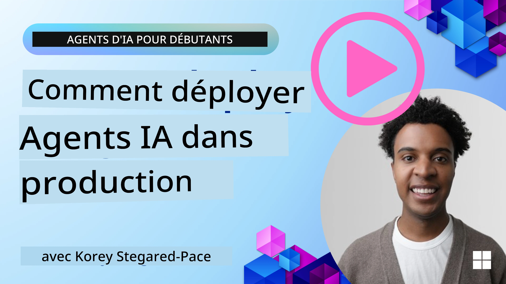

# Agents IA en Production : Observabilité & Évaluation

[](https://youtu.be/l4TP6IyJxmQ?si=reGOyeqjxFevyDq9)

Alors que les agents d’IA passent de prototypes expérimentaux à des applications réelles, la capacité à comprendre leur comportement, surveiller leur performance, et évaluer systématiquement leurs résultats devient importante.

## Objectifs d’apprentissage

Après avoir terminé cette leçon, vous saurez/comment comprendre :
- Concepts clés de l’observabilité et de l’évaluation des agents
- Techniques pour améliorer la performance, les coûts et l’efficacité des agents
- Ce qu’il faut évaluer et comment évaluer systématiquement vos agents IA
- Comment contrôler les coûts lors du déploiement des agents IA en production
- Comment instrumenter des agents construits avec Microsoft Agent Framework

L’objectif est de vous doter des connaissances nécessaires pour transformer vos agents « boîte noire » en systèmes transparents, gérables et fiables.

_**Note :** Il est important de déployer des agents IA sûrs et dignes de confiance. Consultez également la leçon [Construire des Agents IA Dignes de Confiance](./06-building-trustworthy-agents/README.md)._

## Traces et Spans

Les outils d’observabilité tels que [Langfuse](https://langfuse.com/) ou [Microsoft Foundry](https://learn.microsoft.com/en-us/azure/ai-foundry/what-is-azure-ai-foundry) représentent généralement les exécutions d’agents sous forme de traces et spans.

- **Trace** représente une tâche complète de l’agent du début à la fin (par exemple, traiter une requête utilisateur).
- **Spans** sont les étapes individuelles à l’intérieur de la trace (par exemple, appeler un modèle de langage ou récupérer des données).


<!-- Image URL retained for illustration purposes -->

Sans observabilité, un agent IA peut sembler être une « boîte noire » – son état interne et son raisonnement sont opaques, rendant difficile le diagnostic des problèmes ou l’optimisation de la performance. Avec l’observabilité, les agents deviennent des « boîtes de verre », offrant une transparence vitale pour instaurer la confiance et garantir leur fonctionnement comme prévu.

## Pourquoi l’Observabilité est Cruciale en Environnements de Production

Le passage des agents IA en production introduit un nouvel ensemble de défis et de besoins. L’observabilité n’est plus un « petit plus », mais une capacité critique :

*   **Débogage et Analyse des Causes Racines** : Quand un agent échoue ou produit un résultat inattendu, les outils d’observabilité fournissent les traces nécessaires pour identifier la source de l’erreur. Ceci est particulièrement important dans des agents complexes pouvant impliquer plusieurs appels LLM, interactions avec des outils, et logique conditionnelle.
*   **Gestion de la Latence et des Coûts** : Les agents IA s’appuient souvent sur des LLM et d’autres API externes facturées au token ou à l’appel. L’observabilité permet un suivi précis de ces appels, aidant à identifier les opérations excessivement lentes ou coûteuses. Cela permet d’optimiser les invites, de choisir des modèles plus efficaces, ou de repenser les workflows pour maîtriser les coûts opérationnels et assurer une bonne expérience utilisateur.
*   **Confiance, Sécurité et Conformité** : Dans de nombreuses applications, il est important de garantir que les agents se comportent de manière sûre et éthique. L’observabilité fournit une piste d’audit des actions et décisions de l’agent. Cela peut servir à détecter et atténuer des problèmes tels que les injections d’invite, la génération de contenus nuisibles, ou la mauvaise gestion des informations personnelles identifiables (PII). Par exemple, vous pouvez examiner les traces pour comprendre pourquoi un agent a donné une certaine réponse ou utilisé un outil spécifique.
*   **Boucles d’Amélioration Continue** : Les données d’observabilité sont la base d’un processus de développement itératif. En surveillant la performance des agents dans le monde réel, les équipes peuvent identifier des axes d’amélioration, collecter des données pour affiner les modèles, et valider l’impact des modifications. Cela crée une boucle de rétroaction où les informations de production issues de l’évaluation en ligne alimentent l’expérimentation et le raffinement hors ligne, conduisant à une performance d’agent de plus en plus optimale.

## Principaux Indicateurs à Suivre

Pour surveiller et comprendre le comportement de l’agent, il convient de suivre une gamme de métriques et signaux. Bien que les métriques spécifiques puissent varier selon l’objectif de l’agent, certaines sont universellement importantes.

Voici quelques métriques courantes que les outils d’observabilité surveillent :

**Latence :** Quelle est la rapidité de la réponse de l’agent ? Des temps d’attente longs impactent négativement l’expérience utilisateur. Vous devriez mesurer la latence pour les tâches et les étapes individuelles en retraçant les exécutions de l’agent. Par exemple, un agent prenant 20 secondes pour tous les appels modèles pourrait être accéléré en utilisant un modèle plus rapide ou en exécutant les appels modèles en parallèle.

**Coûts :** Quel est le coût par exécution d’agent ? Les agents IA dépendent des appels LLM facturés par token ou des API externes. L’utilisation fréquente d’outils ou la multiplication des prompts peut rapidement faire grimper les coûts. Par exemple, si un agent fait cinq appels à un LLM pour une amélioration marginale de qualité, il faut évaluer si le coût est justifié ou s’il est possible de réduire le nombre d’appels ou d’utiliser un modèle moins cher. La surveillance en temps réel aide aussi à détecter des pics inattendus (ex. bugs provoquant des boucles API excessives).

**Erreurs de Requête :** Combien de requêtes l’agent a-t-il échoué ? Cela peut inclure des erreurs API ou des appels d’outil infructueux. Pour renforcer la robustesse de votre agent en production, vous pouvez mettre en place des mécanismes de secours ou de nouvelles tentatives. Ex. si le fournisseur LLM A est indisponible, vous basculez vers le fournisseur LLM B comme solution de repli.

**Retour Utilisateur :** Les évaluations directes des utilisateurs fournissent des insights précieux. Cela peut inclure des notes explicites (👍pouce levé/👎pouce baissé, ⭐1-5 étoiles) ou des commentaires textuels. Un feedback négatif régulier doit vous alerter car c’est un signe que l’agent ne fonctionne pas comme attendu.

**Retour Implicite Utilisateur :** Le comportement utilisateur fournit un retour indirect même sans notes explicites. Cela peut inclure la reformulation immédiate d’une question, des requêtes répétées ou le clic sur un bouton de réessai. Ex. si vous constatez que les utilisateurs posent plusieurs fois la même question, c’est un signe que l’agent ne fonctionne pas comme prévu.

**Précision :** À quelle fréquence l’agent produit-il des résultats corrects ou souhaitables ? Les définitions de précision varient (ex. exactitude de résolution de problèmes, précision de la récupération d’informations, satisfaction utilisateur). La première étape est de définir ce que signifie le succès pour votre agent. Vous pouvez suivre la précision via des contrôles automatisés, des scores d’évaluation, ou des labels de complétion de tâche. Par exemple, marquer les traces comme « réussi » ou « échoué ».

**Métriques d’Évaluation Automatisée :** Vous pouvez aussi configurer des évaluations automatiques. Par exemple, vous pouvez utiliser un LLM pour noter la sortie de l’agent, ex. si elle est utile, précise ou non. Il existe plusieurs bibliothèques open source qui vous aident à scorer différents aspects de l’agent. Ex. [RAGAS](https://docs.ragas.io/) pour les agents RAG ou [LLM Guard](https://llm-guard.com/) pour détecter un langage nuisible ou des injections d’invite.

En pratique, une combinaison de ces métriques donne la meilleure couverture de la santé d’un agent IA. Dans ce chapitre, le [notebook d’exemple](./code_samples/10-expense_claim-demo.ipynb) vous montrera comment ces métriques apparaissent dans des cas réels, mais d’abord, apprenons à quoi ressemble un workflow typique d’évaluation.

## Instrumentez votre Agent

Pour collecter des données de tracing, vous devez instrumenter votre code. L’objectif est d’instrumenter le code agent pour émettre des traces et métriques pouvant être capturées, traitées, et visualisées par une plateforme d’observabilité.

**OpenTelemetry (OTel) :** [OpenTelemetry](https://opentelemetry.io/) est devenu un standard industriel pour l’observabilité des LLM. Il fournit un ensemble d’API, SDK et outils pour générer, collecter et exporter des données de télémétrie.

De nombreuses bibliothèques d’instrumentation encapsulent les frameworks agents existants et facilitent l’export des spans OpenTelemetry vers un outil d’observabilité. Microsoft Agent Framework s’intègre nativement à OpenTelemetry. Voici un exemple d’instrumentation d’un agent MAF :

```python
from agent_framework.observability import get_tracer, get_meter

tracer = get_tracer()
meter = get_meter()

with tracer.start_as_current_span("agent_run"):
    # L'exécution de l'agent est tracée automatiquement
    pass
```

Le [notebook d’exemple](./code_samples/10-expense_claim-demo.ipynb) de ce chapitre vous montrera comment instrumenter votre agent MAF.

**Création Manuelle de Spans :** Bien que les bibliothèques d’instrumentation fournissent une bonne base, il existe souvent des cas nécessitant des informations plus détaillées ou personnalisées. Vous pouvez créer des spans manuellement pour ajouter une logique applicative personnalisée. Plus important encore, vous pouvez enrichir des spans créés automatiquement ou manuellement avec des attributs personnalisés (aussi appelés tags ou métadonnées). Ces attributs peuvent inclure des données métier spécifiques, des calculs intermédiaires, ou tout contexte utile pour le débogage ou l’analyse, comme `user_id`, `session_id` ou `model_version`.

Exemple de création manuelle de traces et spans avec le [SDK Python Langfuse](https://langfuse.com/docs/sdk/python/sdk-v3) :

```python
from langfuse import get_client
 
langfuse = get_client()
 
span = langfuse.start_span(name="my-span")
 
span.end()
```

## Évaluation des Agents

L’observabilité nous donne des métriques, mais l’évaluation est le processus d’analyse de ces données (et d’effectuer des tests) pour déterminer à quel point un agent IA fonctionne bien et comment il peut être amélioré. En d’autres termes, une fois que vous avez ces traces et métriques, comment les utilisez-vous pour juger l’agent et prendre des décisions ?

L’évaluation régulière est importante car les agents IA sont souvent non déterministes et peuvent évoluer (via des mises à jour ou un dérive comportementale du modèle) – sans évaluation, vous ne sauriez pas si votre « agent intelligent » fait vraiment bien son travail ou s’il a régressé.

Il existe deux catégories d’évaluations pour les agents IA : **évaluation en ligne** et **évaluation hors ligne**. Les deux sont précieuses et se complètent. Nous commençons généralement par l’évaluation hors ligne, car c’est l’étape minimale nécessaire avant de déployer un agent.

### Évaluation Hors Ligne


Cela consiste à évaluer l’agent dans un cadre contrôlé, généralement en utilisant des jeux de données de test, pas des requêtes utilisateur en direct. Vous utilisez des datasets sélectionnés où vous connaissez la sortie attendue ou le comportement correct, puis vous faites exécuter votre agent sur ceux-ci.

Par exemple, si vous avez construit un agent pour résoudre des problèmes mathématiques sous forme textuelle, vous pourriez avoir un [jeu de données test](https://huggingface.co/datasets/gsm8k) de 100 problèmes avec réponses connues. L’évaluation hors ligne est souvent réalisée pendant le développement (et peut faire partie des pipelines CI/CD) pour vérifier des améliorations ou protéger contre des régressions. L’avantage est qu’elle est **répétable et permet d’obtenir des métriques de précision claires puisque vous avez la vérité terrain**. Vous pourriez aussi simuler des requêtes utilisateur et mesurer les réponses de l’agent par rapport à des réponses idéales ou utiliser des métriques automatisées comme décrit ci-dessus.

Le défi principal avec l’évaluation hors ligne est de garantir que votre dataset de test est complet et reste pertinent – l’agent peut bien performer sur un jeu de test fixe mais rencontrer des requêtes très différentes en production. Vous devez donc maintenir à jour les jeux de test avec de nouveaux cas limites et exemples reflétant les scénarios réels. Un mélange de petits « tests de fumée » et de plus grands jeux d’évaluation est utile : petits jeux pour des vérifications rapides et sets plus grands pour des métriques globales de performance.

### Évaluation en Ligne


Cela désigne l’évaluation de l’agent dans un environnement réel en direct, c’est-à-dire durant une utilisation effective en production. L’évaluation en ligne consiste à surveiller la performance de l’agent sur des interactions utilisateur réelles et à analyser en continu les résultats.

Par exemple, vous pouvez suivre les taux de succès, les scores de satisfaction utilisateur, ou d’autres indicateurs sur le trafic réel. L’avantage de l’évaluation en ligne est qu’elle **capture des éléments que vous ne pouvez pas forcément anticiper en laboratoire** – vous pouvez observer la dérive du modèle au fil du temps (si l’efficacité de l’agent diminue avec le changement des schémas d’entrée) et détecter des requêtes ou situations inattendues qui n’étaient pas dans votre jeu de test. Elle donne une image fidèle du comportement de l’agent en conditions réelles.

L’évaluation en ligne implique souvent la collecte de retours utilisateur implicites et explicites, comme discuté, et éventuellement des tests en parallèle (shadow tests) ou A/B (où une nouvelle version de l’agent est déployée en parallèle à l’ancienne pour comparaison). La difficulté est qu’il peut être complexe d’obtenir des labels ou scores fiables pour les interactions en direct – vous devez souvent vous reposer sur les retours utilisateurs ou des indicateurs descendus (par ex. l’utilisateur a-t-il cliqué sur le résultat).

### Combinaison des deux

L’évaluation en ligne et hors ligne ne sont pas exclusives ; elles se complètent fortement. Les enseignements du monitoring en ligne (ex. nouveaux types de requêtes utilisateur où l’agent fonctionne mal) peuvent être utilisés pour enrichir et améliorer les datasets de tests hors ligne. Inversement, les agents qui performent bien aux tests hors ligne peuvent être déployés avec plus de confiance et surveillés en ligne.

En fait, beaucoup d’équipes adoptent une boucle :

_évaluer hors ligne -> déployer -> surveiller en ligne -> collecter de nouveaux cas d’échec -> ajouter au dataset hors ligne -> affiner l’agent -> répéter_.

## Problèmes Courants

En déployant des agents IA en production, vous pouvez rencontrer divers défis. Voici quelques problèmes courants et leurs solutions potentielles :

| **Problème**    | **Solution Potentielle**   |
| ------------- | ------------------ |
| L’agent IA n’exécute pas les tâches de manière cohérente | - Affiner le prompt donné à l’agent IA ; être clair sur les objectifs.<br>- Identifier les cas où diviser la tâche en sous-tâches et les traiter avec plusieurs agents peut aider. |
| L’agent IA entre dans des boucles continues  | - Assurer des termes et conditions de terminaison clairs pour que l’agent sache quand arrêter le processus.<br>- Pour des tâches complexes nécessitant raisonnement et planification, utiliser un modèle plus grand et spécialisé dans le raisonnement. |
| Les appels aux outils de l’agent ne fonctionnent pas bien   | - Tester et valider la sortie des outils en dehors du système agent.<br>- Affiner les paramètres définis, les prompts et la nomination des outils.  |
| Le système multi-agents ne fonctionne pas de manière cohérente | - Affiner les prompts donnés à chaque agent pour qu’ils soient spécifiques et distincts les uns des autres.<br>- Construire un système hiérarchique utilisant un agent « routeur » ou contrôleur pour déterminer quel agent est le bon. |

Beaucoup de ces problèmes peuvent être identifiés plus efficacement grâce à l’observabilité. Les traces et métriques abordées plus tôt aident à localiser précisément où dans le workflow agent les problèmes se produisent, rendant le débogage et l’optimisation bien plus efficaces.

## Gestion des Coûts
Voici quelques stratégies pour gérer les coûts de déploiement des agents d’IA en production :

**Utilisation de modèles plus petits :** Les petits modèles de langage (SLM) peuvent bien fonctionner sur certains cas d’usage agentiques et réduiront significativement les coûts. Comme mentionné précédemment, construire un système d’évaluation pour déterminer et comparer les performances par rapport aux modèles plus grands est la meilleure manière de comprendre la performance d’un SLM sur votre cas d’usage. Envisagez d’utiliser les SLM pour des tâches plus simples comme la classification d’intention ou l’extraction de paramètres, tout en réservant les modèles plus grands pour un raisonnement complexe.

**Utilisation d’un modèle de routage :** Une stratégie similaire consiste à utiliser une diversité de modèles et de tailles. Vous pouvez utiliser un LLM/SLM ou une fonction serverless pour router les requêtes en fonction de leur complexité vers les modèles les plus adaptés. Cela contribue également à réduire les coûts tout en garantissant des performances sur les bonnes tâches. Par exemple, dirigez les requêtes simples vers des modèles plus petits et plus rapides, et n’utilisez les modèles lourds coûteux que pour des tâches de raisonnement complexes.

**Mise en cache des réponses :** Identifier les requêtes et tâches communes et fournir les réponses avant qu’elles ne passent par votre système agentique est un bon moyen de réduire le volume de demandes similaires. Vous pouvez même implémenter un flux pour identifier à quel point une requête est similaire à vos requêtes mises en cache en utilisant des modèles d’IA plus basiques. Cette stratégie peut réduire considérablement les coûts pour les questions fréquemment posées ou les flux de travail courants.

## Voyons comment cela fonctionne en pratique

Dans le [cahier d’exemples de cette section](./code_samples/10-expense_claim-demo.ipynb), nous verrons des exemples de la façon dont nous pouvons utiliser des outils d’observabilité pour surveiller et évaluer notre agent.

### Vous avez plus de questions sur les agents d’IA en production ?

Rejoignez le [Discord Microsoft Foundry](https://aka.ms/ai-agents/discord) pour rencontrer d’autres apprenants, participer aux heures de bureau et obtenir des réponses à vos questions sur les agents d’IA.

## Leçon précédente

[Motif de conception métacognition](../09-metacognition/README.md)

## Leçon suivante

[Protocoles agentiques](../11-agentic-protocols/README.md)

---

<!-- CO-OP TRANSLATOR DISCLAIMER START -->
**Avertissement** :  
Ce document a été traduit à l’aide du service de traduction automatique [Co-op Translator](https://github.com/Azure/co-op-translator). Bien que nous nous efforçons d’assurer l’exactitude, veuillez noter que les traductions automatiques peuvent contenir des erreurs ou des imprécisions. Le document original dans sa langue d’origine doit être considéré comme la source faisant foi. Pour les informations cruciales, il est recommandé de recourir à une traduction professionnelle réalisée par un humain. Nous déclinons toute responsabilité en cas de malentendus ou de mauvaises interprétations résultant de l’utilisation de cette traduction.
<!-- CO-OP TRANSLATOR DISCLAIMER END -->