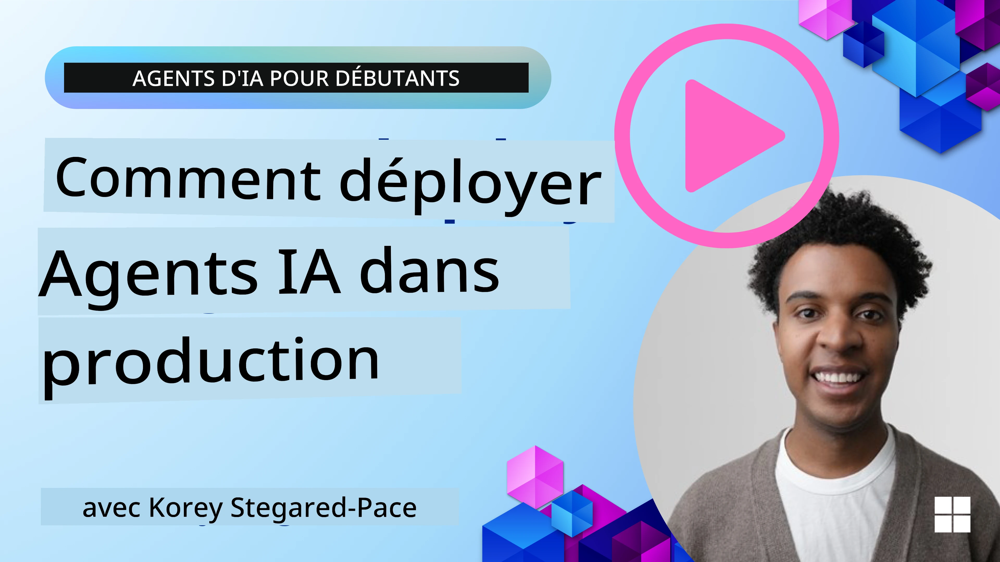

# Agents IA en Production : Observabilité & Évaluation

[](https://youtu.be/l4TP6IyJxmQ?si=reGOyeqjxFevyDq9)

Au fur et à mesure que les agents IA passent de prototypes expérimentaux à des applications réelles, la capacité à comprendre leur comportement, surveiller leurs performances et évaluer systématiquement leurs résultats devient importante.

## Objectifs d'Apprentissage

Après avoir terminé cette leçon, vous saurez/comment comprendre :
- Concepts fondamentaux de l’observabilité et de l’évaluation des agents
- Techniques pour améliorer la performance, les coûts et l’efficacité des agents
- Ce qu’il faut évaluer et comment évaluer systématiquement vos agents IA
- Comment contrôler les coûts lors du déploiement d’agents IA en production
- Comment instrumenter les agents construits avec Microsoft Agent Framework

Le but est de vous doter des connaissances nécessaires pour transformer vos agents "boîte noire" en systèmes transparents, gérables et fiables.

_**Note :** Il est important de déployer des agents IA sûrs et dignes de confiance. Consultez aussi la leçon [Construire des Agents IA Fiables](./06-building-trustworthy-agents/README.md)._

## Traces et Spans

Les outils d’observabilité tels que [Langfuse](https://langfuse.com/) ou [Microsoft Foundry](https://learn.microsoft.com/en-us/azure/ai-foundry/what-is-azure-ai-foundry) représentent généralement les exécutions d’agents sous forme de traces et de spans.

- **Trace** représente une tâche complète de l’agent du début à la fin (comme le traitement d’une requête utilisateur).
- **Spans** sont les étapes individuelles dans la trace (comme appeler un modèle de langage ou récupérer des données).


<!-- Image URL retained for illustration purposes -->

Sans observabilité, un agent IA peut sembler être une "boîte noire" — son état interne et son raisonnement sont opaques, rendant difficile le diagnostic des problèmes ou l’optimisation des performances. Avec l’observabilité, les agents deviennent des "boîtes en verre", offrant la transparence essentielle pour instaurer la confiance et garantir qu’ils fonctionnent comme prévu.

## Pourquoi l’Observabilité est Cruciale en Environnements de Production

Le passage des agents IA aux environnements de production introduit un nouvel ensemble de défis et d’exigences. L’observabilité n’est plus un luxe mais une capacité critique :

*   **Débogage et Analyse de la Cause Racine :** Lorsqu’un agent échoue ou produit un résultat inattendu, les outils d’observabilité fournissent les traces nécessaires pour identifier la source de l’erreur. Ceci est particulièrement important dans les agents complexes pouvant impliquer plusieurs appels LLM, interactions avec des outils et logique conditionnelle.
*   **Gestion de la Latence et des Coûts :** Les agents IA s’appuient souvent sur des LLM et d’autres API externes facturés à la consommation (par token ou par appel). L’observabilité permet un suivi précis de ces appels, aidant à identifier les opérations excessivement lentes ou coûteuses. Cela permet aux équipes d’optimiser les prompts, de choisir des modèles plus efficaces ou de repenser les flux de travail pour gérer les coûts opérationnels et assurer une bonne expérience utilisateur.
*   **Confiance, Sécurité et Conformité :** Dans de nombreuses applications, il est important de garantir que les agents se comportent de manière sûre et éthique. L’observabilité fournit une piste d’audit des actions et décisions de l’agent. Cela peut être utilisé pour détecter et atténuer des problèmes comme l’injection de prompt, la génération de contenu nuisible ou la mauvaise gestion d’informations personnelles identifiables (PII). Par exemple, vous pouvez consulter les traces pour comprendre pourquoi un agent a donné une certaine réponse ou utilisé un outil spécifique.
*   **Boucles d’Amélioration Continue :** Les données d’observabilité sont le fondement d’un processus de développement itératif. En surveillant les performances des agents en conditions réelles, les équipes peuvent identifier des axes d’amélioration, collecter des données pour affiner les modèles, et valider l’impact des changements. Cela crée une boucle de rétroaction où les insights de la production via l’évaluation en ligne alimentent les expérimentations et ajustements hors ligne, menant à des performances d’agent de plus en plus optimales.

## Principaux Indicateurs à Suivre

Pour surveiller et comprendre le comportement des agents, une gamme de métriques et signaux doit être suivie. Bien que les métriques spécifiques varient selon l’objectif de l’agent, certaines sont universellement importantes.

Voici quelques-unes des métriques les plus courantes que surveillent les outils d’observabilité :

**Latence :** À quelle vitesse l’agent répond-il ? De longs temps d’attente impactent négativement l’expérience utilisateur. Vous devez mesurer la latence des tâches et des étapes individuelles en suivant les exécutions d’agents. Par exemple, un agent qui prend 20 secondes pour tous les appels au modèle pourrait être accéléré en utilisant un modèle plus rapide ou en exécutant les appels en parallèle.

**Coûts :** Quel est le coût par exécution d’un agent ? Les agents IA dépendent d’appels LLM facturés par token ou d’API externes. L’utilisation fréquente d’outils ou plusieurs prompts peuvent rapidement faire grimper les coûts. Par exemple, si un agent appelle un LLM cinq fois pour une amélioration de qualité marginale, vous devez évaluer si cela en vaut le coût ou s’il est possible de réduire le nombre d’appels ou d’utiliser un modèle moins cher. La surveillance en temps réel peut aussi aider à détecter des pics inattendus (par exemple, des bugs provoquant des boucles API excessives).

**Erreurs de Requête :** Combien de requêtes l’agent a-t-il échoué ? Cela peut inclure des erreurs API ou des appels d’outils qui ont échoué. Pour rendre votre agent plus robuste en production, vous pouvez configurer des mécanismes de repli ou des tentatives de réexécution. Par exemple, si le fournisseur LLM A est indisponible, vous basculez vers le fournisseur LLM B en secours.

**Retour Utilisateur :** Mettre en œuvre des évaluations utilisateurs directes fournit des informations précieuses. Cela peut inclure des évaluations explicites (👍pouce levé/👎pouce baissé, ⭐1-5 étoiles) ou des commentaires textuels. Un retour négatif récurrent doit vous alerter car il s’agit d’un signe que l’agent ne fonctionne pas comme prévu.

**Retour Utilisateur Implicite :** Les comportements utilisateurs offrent un retour indirect même sans évaluation explicite. Cela peut inclure la reformulation immédiate de questions, des requêtes répétées ou le clic sur un bouton de réessai. Par exemple, si vous constatez que les utilisateurs posent plusieurs fois la même question, c’est un signe que l’agent ne fonctionne pas comme attendu.

**Précision :** À quelle fréquence l’agent produit-il des résultats corrects ou souhaitables ? La définition de la précision varie (par ex., exactitude dans la résolution de problèmes, précision de récupération d’information, satisfaction utilisateur). La première étape est de définir ce que signifie le succès pour votre agent. Vous pouvez suivre la précision via des vérifications automatiques, des scores d’évaluation ou des étiquettes d’achèvement de tâches. Par exemple, marquer les traces comme "réussies" ou "échouées".

**Métriques d’Évaluation Automatisée :** Vous pouvez aussi mettre en place des évaluations automatiques. Par exemple, vous pouvez utiliser un LLM pour noter la sortie de l’agent (utile, précis, ou non). Il existe aussi plusieurs bibliothèques open source qui vous aident à évaluer différents aspects de l’agent. Ex. [RAGAS](https://docs.ragas.io/) pour les agents RAG ou [LLM Guard](https://llm-guard.com/) pour détecter le langage nuisible ou l’injection de prompt.

Dans la pratique, une combinaison de ces métriques offre la meilleure couverture de la santé d’un agent IA. Dans ce [notebook d’exemple](./code_samples/10-expense_claim-demo.ipynb) du chapitre, nous vous montrerons comment ces métriques apparaissent dans des exemples réels, mais d’abord, découvrons à quoi ressemble un workflow typique d’évaluation.

## Instrumenter votre Agent

Pour collecter des données de traçage, il vous faut instrumenter votre code. Le but est d’instrumenter le code de l’agent pour émettre des traces et métriques pouvant être capturées, traitées et visualisées par une plateforme d’observabilité.

**OpenTelemetry (OTel) :** [OpenTelemetry](https://opentelemetry.io/) est devenu un standard industriel pour l’observabilité des LLM. Il fournit un ensemble d’API, SDK et outils pour générer, collecter et exporter les données de télémétrie.

De nombreuses bibliothèques d’instrumentation enveloppent les frameworks d’agent existants et facilitent l’export des spans OpenTelemetry vers un outil d’observabilité. Microsoft Agent Framework intègre OpenTelemetry nativement. Voici un exemple d’instrumentation d’un agent MAF : 

```python
from agent_framework.observability import get_tracer, get_meter

tracer = get_tracer()
meter = get_meter()

with tracer.start_as_current_span("agent_run"):
    # L'exécution de l'agent est tracée automatiquement
    pass
```

Le [notebook d’exemple](./code_samples/10-expense_claim-demo.ipynb) de ce chapitre démontrera comment instrumenter votre agent MAF.

**Création Manuelle de Spans :** Bien que les bibliothèques d’instrumentation offrent une bonne base, il existe souvent des cas où des informations plus détaillées ou personnalisées sont nécessaires. Vous pouvez créer manuellement des spans pour ajouter une logique applicative personnalisée. Plus important encore, ils peuvent enrichir les spans créés automatiquement ou manuellement avec des attributs personnalisés (également appelés tags ou métadonnées). Ces attributs peuvent inclure des données métier spécifiques, des calculs intermédiaires, ou tout contexte utile au débogage ou à l’analyse, comme `user_id`, `session_id` ou `model_version`.

Exemple de création manuelle de traces et spans avec le [SDK Python Langfuse](https://langfuse.com/docs/sdk/python/sdk-v3) : 

```python
from langfuse import get_client
 
langfuse = get_client()
 
span = langfuse.start_span(name="my-span")
 
span.end()
```

## Évaluation des Agents

L’observabilité fournit des métriques, mais l’évaluation est le processus d’analyse de ces données (et de réalisation de tests) pour déterminer la performance d’un agent IA et comment l’améliorer. En d’autres termes, une fois que vous avez ces traces et métriques, comment les utiliser pour juger l’agent et prendre des décisions ?

Une évaluation régulière est importante car les agents IA sont souvent non déterministes et peuvent évoluer (par mises à jour ou dérives de comportement du modèle) – sans évaluation, vous ne sauriez pas si votre "agent intelligent" remplit réellement bien sa mission ou s’il a régressé.

Il existe deux catégories d’évaluations pour les agents IA : **évaluation en ligne** et **évaluation hors ligne**. Les deux sont précieuses et se complètent. On commence généralement par l’évaluation hors ligne, car c’est la première étape nécessaire avant tout déploiement.

### Évaluation Hors Ligne


Cela consiste à évaluer l’agent dans un cadre contrôlé, typiquement en utilisant des jeux de données de test, non des requêtes utilisateurs en direct. Vous utilisez des jeux de données sélectionnés où vous savez quelle est la sortie attendue ou le comportement correct, puis exécutez votre agent dessus.

Par exemple, si vous avez construit un agent de résolution de problèmes mathématiques, vous pourriez disposer d’un [jeu de données test](https://huggingface.co/datasets/gsm8k) de 100 problèmes avec réponses connues. L’évaluation hors ligne est souvent faite pendant le développement (et peut faire partie des pipelines CI/CD) pour vérifier les améliorations ou éviter les régressions. L'avantage est que c’est **reproductible et vous pouvez obtenir des métriques claires de précision car vous avez la vérité terrain**. Vous pouvez aussi simuler des requêtes utilisateurs et mesurer les réponses de l’agent par rapport aux réponses idéales ou utiliser les métriques automatisées décrites plus haut.

Le principal défi de l’évaluation hors ligne est de garantir que votre jeu de données test est complet et reste pertinent – l’agent peut bien fonctionner sur un jeu fixe, mais rencontrer en production des requêtes très différentes. Il faut donc maintenir les jeux test à jour avec des nouveaux cas limites et exemples reflétant des scénarios réels​. Un mélange de petits cas “test rapide” et de plus grands jeux pour mesurer la performance globale est utile : petits pour vérifications rapides et grands pour mesurer plus largement les performances​.

### Évaluation en Ligne


Cela désigne l’évaluation de l’agent dans un environnement réel et en direct, c’est-à-dire pendant son utilisation effective en production. L’évaluation en ligne consiste à surveiller la performance de l’agent sur des interactions réelles avec les utilisateurs et à analyser en continu les résultats.

Par exemple, vous pouvez suivre les taux de réussite, les scores de satisfaction utilisateur, ou d’autres indicateurs sur le trafic réel. L’avantage de l’évaluation en ligne est qu’elle **capture des éléments que vous ne pourriez pas anticiper en laboratoire** – vous pouvez observer la dérive du modèle dans le temps (si l’efficacité de l’agent baisse avec l’évolution des types de requêtes) et repérer des requêtes ou situations inattendues absentes de vos données de test​. Cela fournit un aperçu véritable du comportement de l’agent en conditions réelles.

L’évaluation en ligne implique souvent la collecte de retours utilisateurs implicites et explicites, comme discuté, et éventuellement la réalisation de tests en parallèle (shadow testing) ou de tests A/B (où une nouvelle version de l’agent s’exécute en parallèle pour comparaison). Le défi est qu’il peut être difficile d’obtenir des labels ou scores fiables pour les interactions en direct – on peut s’appuyer sur les retours utilisateurs ou métriques aval (ex. est-ce que l’utilisateur a cliqué sur le résultat).

### Combinaison des deux

Les évaluations en ligne et hors ligne ne s’excluent pas ; elles se complètent fortement. Les informations issues du monitoring en ligne (ex. nouveaux types de requêtes utilisateurs où l’agent est faible) peuvent servir à enrichir et améliorer les jeux de données hors ligne. Inversement, des agents qui réussissent bien les tests hors ligne peuvent ensuite être déployés avec plus de confiance et surveillés en ligne.

En fait, beaucoup d’équipes adoptent une boucle : 

_évaluer hors ligne -> déployer -> surveiller en ligne -> collecter de nouveaux cas d’échec -> ajouter au jeu hors ligne -> affiner l’agent -> répéter_.

## Problèmes Courants

Lors du déploiement d’agents IA en production, vous pouvez rencontrer divers défis. Voici quelques problèmes fréquents et leurs solutions potentielles :

| **Problème**    | **Solution Potentielle**   |
| ------------- | ------------------ |
| Agent IA n’exécute pas les tâches de façon consistante | - Affiner le prompt donné à l’agent IA ; soyez clair sur les objectifs.<br>- Identifier les cas où diviser les tâches en sous-tâches prises en charge par plusieurs agents peut aider. |
| Agent IA en boucle continue  | - Assurez-vous d’avoir des conditions de terme claires pour que l’agent sache quand arrêter le processus.<br>- Pour des tâches complexes nécessitant raisonnement et planification, utilisez un modèle plus large spécialisé pour ces tâches. |
| Les appels aux outils de l’agent ne fonctionnent pas bien   | - Tester et valider la sortie de l’outil en dehors du système agent.<br>- Affiner les paramètres définis, les prompts, et la dénomination des outils.  |
| Système multi-agents peu consistant | - Affiner les prompts fournis à chaque agent pour garantir qu’ils soient spécifiques et distincts.<br>- Construire un système hiérarchique avec un agent "routeur" ou contrôleur déterminant quel agent est correct. |

Beaucoup de ces problèmes peuvent être identifiés plus efficacement avec de l’observabilité en place. Les traces et métriques discutées plus haut permettent de localiser précisément où dans le workflow agent les problèmes se produisent, rendant le débogage et l’optimisation beaucoup plus efficaces.

## Gestion des Coûts

Voici quelques stratégies pour gérer les coûts de déploiement des agents IA en production :

**Utilisation de modèles plus petits :** Les petits modèles de langage (SLMs) peuvent bien fonctionner sur certains cas d'utilisation agentiques et réduiront considérablement les coûts. Comme mentionné précédemment, construire un système d’évaluation pour déterminer et comparer les performances par rapport aux modèles plus grands est la meilleure façon de comprendre la performance d’un SLM sur votre cas d’usage. Envisagez d’utiliser des SLM pour des tâches plus simples comme la classification d’intention ou l’extraction de paramètres, tout en réservant les modèles plus grands pour un raisonnement complexe.

**Utilisation d’un modèle de routage :** Une stratégie similaire consiste à utiliser une diversité de modèles et de tailles. Vous pouvez utiliser un LLM/SLM ou une fonction serverless pour router les requêtes en fonction de leur complexité vers les modèles les plus adaptés. Cela aide également à réduire les coûts tout en garantissant la performance sur les bonnes tâches. Par exemple, router les requêtes simples vers des modèles plus petits et plus rapides, et n’utiliser les modèles coûteux et volumineux que pour des tâches de raisonnement complexes.

**Mise en cache des réponses :** Identifier les requêtes et tâches courantes et fournir les réponses avant qu’elles ne passent par votre système agentique est un bon moyen de réduire le volume de requêtes similaires. Vous pouvez même mettre en place un flux pour identifier la similarité d’une requête avec vos requêtes en cache en utilisant des modèles IA plus basiques. Cette stratégie peut réduire significativement les coûts pour les questions fréquemment posées ou les workflows courants.

## Voyons comment cela fonctionne en pratique

Dans le [cahier d’exemples de cette section](./code_samples/10-expense_claim-demo.ipynb), nous verrons des exemples de la façon dont nous pouvons utiliser des outils d’observabilité pour surveiller et évaluer notre agent.

### Vous avez plus de questions sur les agents IA en production ?

Rejoignez le [Microsoft Foundry Discord](https://discord.com/invite/ATgtXmAS5D) pour rencontrer d’autres apprenants, assister aux heures de bureau et obtenir des réponses à vos questions sur les agents IA.

## Leçon précédente

[Metacognition Design Pattern](../09-metacognition/README.md)

## Leçon suivante

[Agentic Protocols](../11-agentic-protocols/README.md)

---

<!-- CO-OP TRANSLATOR DISCLAIMER START -->
**Avertissement** :
Ce document a été traduit à l'aide du service de traduction automatique [Co-op Translator](https://github.com/Azure/co-op-translator). Bien que nous nous efforçions d'assurer l'exactitude, veuillez noter que les traductions automatisées peuvent contenir des erreurs ou des inexactitudes. Le document original dans sa langue native doit être considéré comme la source faisant autorité. Pour les informations critiques, il est recommandé de recourir à une traduction professionnelle réalisée par un humain. Nous ne saurions être tenus responsables des malentendus ou erreurs d'interprétation découlant de l'utilisation de cette traduction.
<!-- CO-OP TRANSLATOR DISCLAIMER END -->