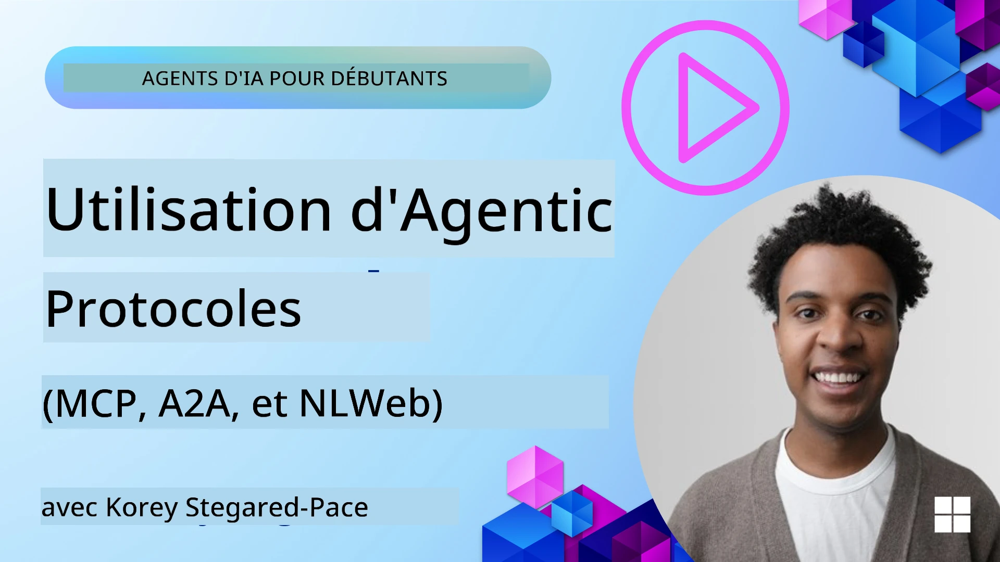
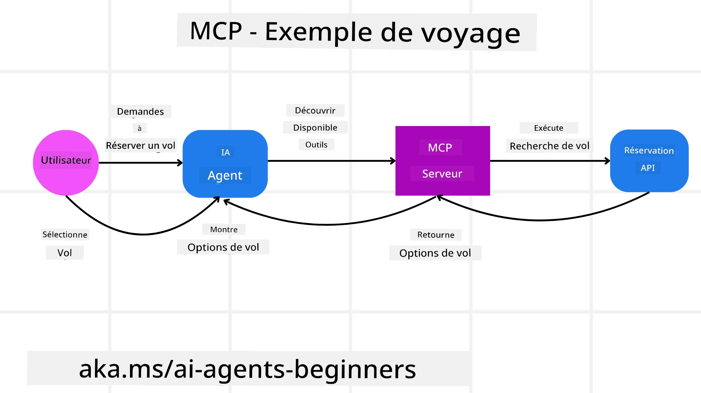
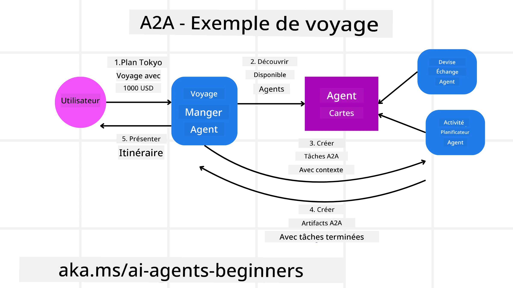
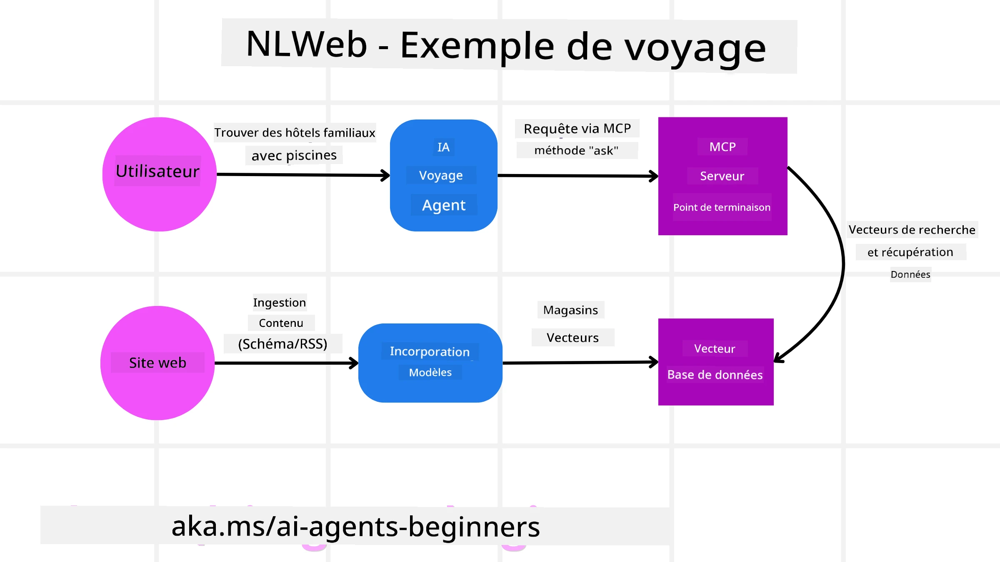

# Utilisation des Protocoles Agentiques (MCP, A2A et NLWeb)

> _(Cliquez sur l'image ci-dessus pour voir la vidéo de cette leçon)_

Avec l’essor des agents IA, le besoin de protocoles garantissant la standardisation, la sécurité et favorisant l’innovation ouverte se fait de plus en plus sentir. Dans cette leçon, nous couvrirons 3 protocoles visant à répondre à ce besoin : Model Context Protocol (MCP), Agent to Agent (A2A) et Natural Language Web (NLWeb).

## Introduction

Dans cette leçon, nous aborderons :

• Comment **MCP** permet aux agents IA d’accéder à des outils et données externes pour accomplir les tâches des utilisateurs.

• Comment **A2A** facilite la communication et la collaboration entre différents agents IA.

• Comment **NLWeb** apporte des interfaces en langage naturel à n’importe quel site web, permettant aux agents IA de découvrir et d’interagir avec le contenu.

## Objectifs d’apprentissage

• **Identifier** le but principal et les avantages de MCP, A2A et NLWeb dans le contexte des agents IA.

• **Expliquer** comment chaque protocole facilite la communication et l’interaction entre les modèles de langage, les outils et autres agents.

• **Reconnaître** les rôles distincts que chaque protocole joue dans la construction de systèmes agentiques complexes.

## Model Context Protocol

Le **Model Context Protocol (MCP)** est une norme ouverte qui fournit une manière standardisée pour les applications de donner du contexte et des outils aux modèles de langage (LLM). Cela permet un "adaptateur universel" vers différentes sources de données et outils auxquels les agents IA peuvent se connecter de manière cohérente.

Voyons les composants du MCP, ses avantages par rapport à l’usage direct des API, et un exemple de la façon dont les agents IA pourraient utiliser un serveur MCP.

### Composants principaux du MCP

Le MCP fonctionne selon une **architecture client-serveur** et les composants principaux sont :

• Les **hôtes** sont des applications LLM (par exemple un éditeur de code comme VSCode) qui initient les connexions vers un serveur MCP.

• Les **clients** sont des composants au sein de l’application hôte qui maintiennent des connexions individuelles avec les serveurs.

• Les **serveurs** sont des programmes légers qui exposent des capacités spécifiques.

Le protocole inclut trois primitives principales qui sont les capacités d’un serveur MCP :

• **Outils** : Ce sont des actions discrètes ou fonctions qu’un agent IA peut appeler pour effectuer une action. Par exemple, un service météo pourrait exposer un outil "obtenir la météo", ou un serveur e-commerce un outil "acheter un produit". Les serveurs MCP annoncent le nom de chaque outil, sa description, et son schéma d’entrée/sortie dans leur liste de capacités.

• **Ressources** : Ce sont des éléments de données en lecture seule ou documents qu’un serveur MCP peut fournir, et que les clients peuvent récupérer à la demande. Exemples : contenus de fichiers, enregistrements de bases de données, fichiers journaux. Les ressources peuvent être du texte (comme du code ou JSON) ou binaires (comme images ou PDFs).

• **Prompts** : Ce sont des modèles pré-définis qui fournissent des invites suggérées, permettant des workflows plus complexes.

### Avantages du MCP

Le MCP offre d’importants avantages pour les agents IA :

• **Découverte dynamique d’outils** : Les agents peuvent recevoir dynamiquement une liste des outils disponibles d’un serveur avec leurs descriptions. Cela contraste avec les API traditionnelles, qui nécessitent souvent un codage statique pour les intégrations, ce qui implique de mettre à jour le code à chaque changement API. MCP offre une approche "intégrer une fois", menant à une plus grande adaptabilité.

• **Interopérabilité entre LLM** : MCP fonctionne avec différents LLM, offrant la flexibilité de changer les modèles de base pour une meilleure performance.

• **Sécurité standardisée** : MCP inclut une méthode d’authentification standard, améliorant la scalabilité lors de l’ajout d’accès à plusieurs serveurs MCP. C’est plus simple que de gérer différentes clés et types d’authentification pour diverses API traditionnelles.

### Exemple MCP

Imaginez qu’un utilisateur veuille réserver un vol avec un assistant IA propulsé par MCP.

1. **Connexion** : L’assistant IA (le client MCP) se connecte à un serveur MCP fourni par une compagnie aérienne.

2. **Découverte d’outils** : Le client demande au serveur MCP de la compagnie aérienne "Quels outils avez-vous disponibles ?" Le serveur répond avec des outils comme "chercher des vols" et "réserver des vols".

3. **Invocation de l’outil** : Vous demandez alors à l’assistant IA, "Veuillez chercher un vol de Portland à Honolulu." L’assistant IA, via son LLM, identifie qu’il doit appeler l’outil "chercher des vols" en passant les paramètres pertinents (origine, destination) au serveur MCP.

4. **Exécution et réponse** : Le serveur MCP, agissant comme un intermédiaire, effectue l’appel réel à l’API interne de réservation de la compagnie aérienne. Il reçoit ensuite l’information du vol (par exemple des données JSON) et la renvoie à l’assistant IA.

5. **Interaction supplémentaire** : L’assistant IA présente les options de vol. Une fois votre sélection faite, il peut invoquer l’outil "réserver vol" sur le même serveur MCP, complétant ainsi la réservation.

## Protocole Agent-à-Agent (A2A)

Alors que MCP se concentre sur la connexion des LLM aux outils, le **protocole Agent-à-Agent (A2A)** va plus loin en permettant la communication et la collaboration entre différents agents IA. A2A connecte des agents IA entre différentes organisations, environnements et piles technologiques pour accomplir une tâche commune.

Nous examinerons les composants et avantages d’A2A, ainsi qu’un exemple d’application dans notre application de voyage.

### Composants principaux d’A2A

A2A se concentre sur la communication entre agents et leur collaboration pour compléter une sous-tâche utilisateur. Chaque composant du protocole contribue à cela :

#### Carte d’Agent

Comme un serveur MCP partage une liste d’outils, une Carte d’Agent contient :
- Le nom de l’agent.
- Une **description des tâches générales** qu’il accomplit.
- Une **liste de compétences spécifiques** avec descriptions pour aider d’autres agents (ou même des humains) à comprendre quand et pourquoi vouloir appeler cet agent.
- L’**URL d’endpoint actuelle** de l’agent.
- La **version** et les **capacités** de l’agent comme les réponses en streaming et notifications push.

#### Exécuteur d’Agent

L’Exécuteur d’Agent est responsable de **transmettre le contexte de la conversation utilisateur à l’agent distant**, celui-ci ayant besoin de comprendre la tâche à accomplir. Dans un serveur A2A, un agent utilise son propre modèle de langage (LLM) pour analyser les requêtes entrantes et accomplir des tâches en utilisant ses outils internes.

#### Artefact

Une fois la tâche demandée terminée par l’agent distant, son travail est créé sous forme d’artefact. Un artefact **contient le résultat du travail de l’agent**, une **description de ce qui a été accompli**, et le **contexte textuel** envoyé par le protocole. Après l’envoi de l’artefact, la connexion avec l’agent distant est fermée jusqu’à ce qu’elle soit à nouveau nécessaire.

#### File d’Événements (Event Queue)

Ce composant est utilisé pour **gérer les mises à jour et transmettre des messages**. Il est particulièrement important en production pour les systèmes agentiques afin d’empêcher la fermeture prématurée de la connexion entre agents avant la fin d’une tâche, surtout lorsque celle-ci peut durer longtemps.

### Avantages d’A2A

• **Collaboration renforcée** : Il permet à des agents de différents fournisseurs et plateformes d’interagir, partager le contexte et travailler ensemble, facilitant l’automatisation fluide à travers des systèmes traditionnellement déconnectés.

• **Flexibilité dans la sélection du modèle** : Chaque agent A2A peut décider quel LLM il utilise pour répondre à ses requêtes, permettant d’optimiser ou de spécialiser les modèles par agent, contrairement à une connexion unique à un LLM dans certains scénarios MCP.

• **Authentification intégrée** : L’authentification est intégrée directement dans le protocole A2A, fournissant un cadre de sécurité robuste pour les interactions entre agents.

### Exemple A2A

Développons notre scénario de réservation de voyage, mais cette fois avec A2A.

1. **Requête utilisateur au multi-agent** : Un utilisateur interagit avec un client/agent A2A "Agent de voyage", par exemple en disant : "Veuillez réserver un voyage complet à Honolulu la semaine prochaine, incluant vols, hôtel, et voiture de location".

2. **Orchestration par l’Agent de voyage** : L’Agent de voyage reçoit cette demande complexe. Il utilise son LLM pour raisonner sur la tâche et déterminer qu’il doit interagir avec d’autres agents spécialisés.

3. **Communication inter-agent** : L’Agent de voyage établit alors une connexion via le protocole A2A avec des agents en aval, comme un "Agent Compagnie aérienne", "Agent Hôtel" et "Agent Location de voiture", créés par différentes sociétés.

4. **Exécution déléguée des tâches** : L’Agent de voyage envoie des tâches spécifiques à ces agents spécialisés (ex. "Trouve des vols pour Honolulu", "Réserve un hôtel", "Loue une voiture"). Chacun de ces agents spécialisés, utilisant leur propre LLM et leurs propres outils (qui pourraient eux-mêmes être des serveurs MCP), exécute sa partie de la réservation.

5. **Réponse consolidée** : Une fois tous les agents en aval ayant complété leurs tâches, l’Agent de voyage compile les résultats (détails vols, confirmation hôtel, réservation voiture) et envoie une réponse globale au format conversationnel à l’utilisateur.

## Natural Language Web (NLWeb)

Les sites web ont longtemps été la principale façon pour les utilisateurs d’accéder à l’information et aux données sur Internet.

Voyons les différents composants de NLWeb, ses avantages, et un exemple de fonctionnement avec notre application de voyage.

### Composants de NLWeb

- **Application NLWeb (code du service principal)** : Le système qui traite les questions en langage naturel. Il connecte les différentes parties de la plateforme pour créer des réponses. On peut le voir comme **le moteur qui anime les fonctionnalités en langage naturel** d’un site web.

- **Protocole NLWeb** : C’est un **ensemble basique de règles pour l’interaction en langage naturel** avec un site web. Il renvoie des réponses en format JSON (souvent avec Schema.org). Son but est de créer une base simple pour le “Web IA”, de la même manière que HTML a permis de partager des documents en ligne.

- **Serveur MCP (point d’accès Model Context Protocol)** : Chaque installation NLWeb fonctionne aussi comme **serveur MCP**. Cela signifie qu’elle peut **partager des outils (comme une méthode "ask") et des données** avec d’autres systèmes IA. En pratique, cela rend le contenu et les capacités du site web utilisables par des agents IA, permettant au site de faire partie de l’“écosystème agentique” plus large.

- **Modèles d’Embedding** : Ces modèles sont utilisés pour **convertir le contenu du site en représentations numériques appelées vecteurs** (embeddings). Ces vecteurs capturent le sens d’une manière que les ordinateurs peuvent comparer et chercher. Ils sont stockés dans une base de données spéciale, et l’utilisateur peut choisir quel modèle d’embedding utiliser.

- **Base de données vectorielle (mécanisme de récupération)** : Cette base stocke **les embeddings du contenu du site**. Lorsqu’une question est posée, NLWeb interroge la base vectorielle pour trouver rapidement les informations les plus pertinentes. Elle fournit une liste rapide de réponses possibles, classées par similarité. NLWeb fonctionne avec différents systèmes de stockage vectoriel comme Qdrant, Snowflake, Milvus, Azure AI Search, et Elasticsearch.

### Exemple NLWeb

Reprenons notre site de réservation de voyages, mais cette fois alimenté par NLWeb.

1. **Ingestion des données** : Les catalogues produits existants (ex. listes de vols, descriptions d’hôtels, forfaits touristiques) sont formatés avec Schema.org ou chargés via des flux RSS. Les outils de NLWeb ingèrent ces données structurées, créent des embeddings, et les stockent dans une base vectorielle locale ou distante.

2. **Question en langage naturel (humain)** : Un utilisateur visite le site et, au lieu de naviguer dans les menus, saisit dans une interface de chat : "Trouvez-moi un hôtel familial à Honolulu avec piscine pour la semaine prochaine".

3. **Traitement NLWeb** : L’application NLWeb reçoit cette requête. Elle l’envoie à un LLM pour comprendre, tout en recherchant simultanément dans sa base vectorielle les listings d’hôtels pertinents.

4. **Résultats précis** : Le LLM aide à interpréter les résultats de la recherche, identifie les meilleurs correspondances basées sur les critères "familial", "piscine", et "Honolulu", puis formate une réponse en langage naturel. Crucialement, la réponse renvoie à des hôtels réels du catalogue du site, évitant les informations inventées.

5. **Interaction avec agent IA** : Parce que NLWeb sert aussi de serveur MCP, un agent IA externe de voyage pourrait se connecter à cette instance NLWeb du site. L’agent IA pourrait alors utiliser la méthode MCP `ask` pour interroger directement le site : `ask("Y a-t-il des restaurants vegan-friendly dans la zone de Honolulu recommandés par l’hôtel ?")`. L’instance NLWeb traiterait cela, exploitant sa base de données d’informations sur les restaurants (si chargée), et retournerait une réponse structurée JSON.

### Vous avez d’autres questions sur MCP/A2A/NLWeb ?

Rejoignez le [Discord Microsoft Foundry](https://aka.ms/ai-agents/discord) pour rencontrer d’autres apprenants, participer aux heures de bureau, et obtenir des réponses à vos questions sur les agents IA.

## Ressources

- [MCP pour débutants](https://aka.ms/mcp-for-beginners)  
- [Documentation MCP](https://learn.microsoft.com/python/api/overview/azure/ai-projects-readme)
- [Dépôt NLWeb](https://github.com/nlweb-ai/NLWeb)
- [Cadre Microsoft Agent](https://aka.ms/ai-agents-beginners/agent-framewrok)

---

<!-- CO-OP TRANSLATOR DISCLAIMER START -->
**Avertissement** :  
Ce document a été traduit à l’aide du service de traduction automatique [Co-op Translator](https://github.com/Azure/co-op-translator). Bien que nous nous efforcions d’assurer l’exactitude, veuillez noter que les traductions automatiques peuvent contenir des erreurs ou des inexactitudes. Le document original dans sa langue d’origine doit être considéré comme la source officielle. Pour les informations critiques, une traduction professionnelle humaine est recommandée. Nous déclinons toute responsabilité en cas de malentendus ou d’interprétations erronées résultant de l’utilisation de cette traduction.
<!-- CO-OP TRANSLATOR DISCLAIMER END -->