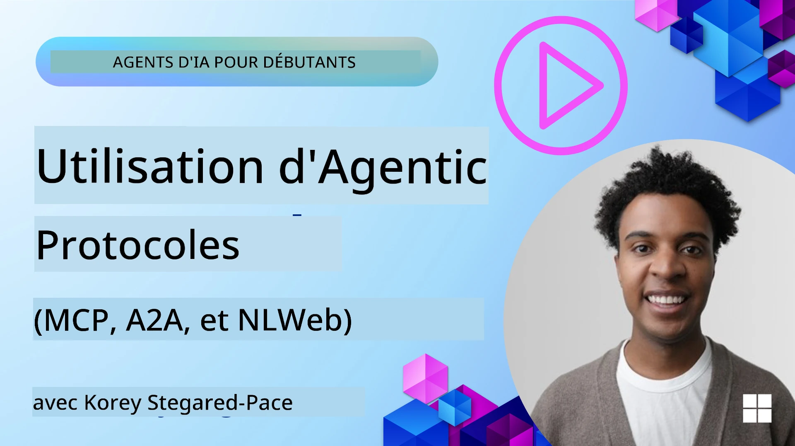
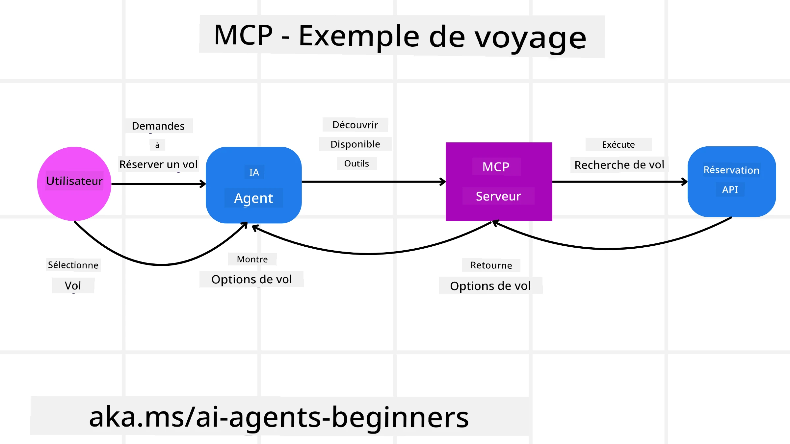
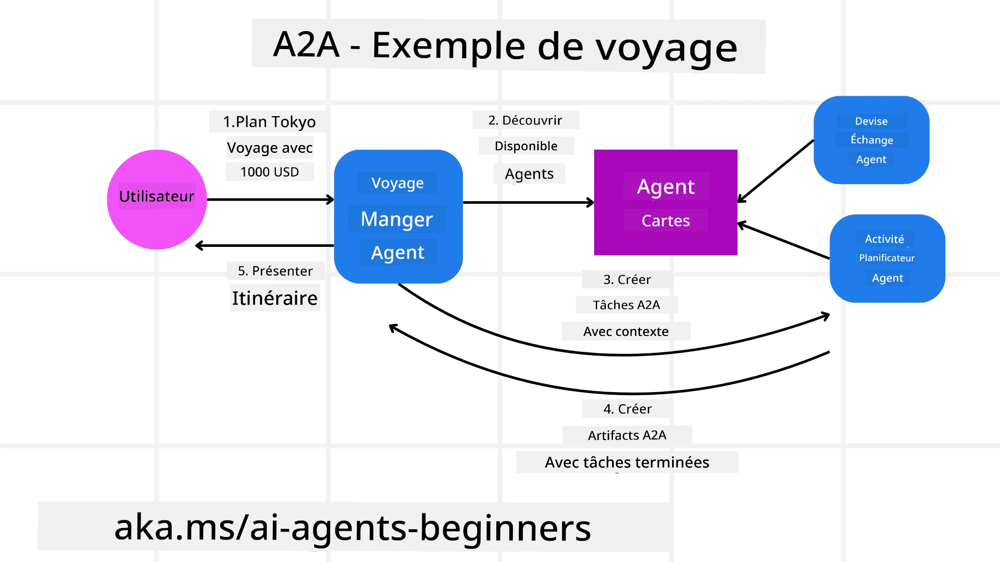
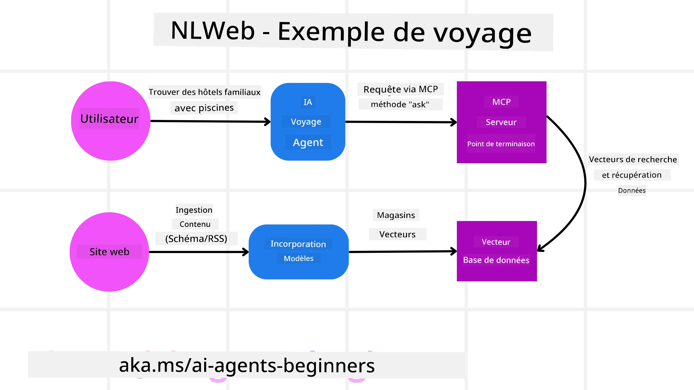

# Utilisation des Protocoles Agencés (MCP, A2A et NLWeb)

> _(Cliquez sur l’image ci-dessus pour voir la vidéo de cette leçon)_

À mesure que l’utilisation des agents IA se développe, le besoin de protocoles garantissant la standardisation, la sécurité et favorisant l’innovation ouverte augmente également. Dans cette leçon, nous aborderons 3 protocoles visant à répondre à ce besoin : Model Context Protocol (MCP), Agent to Agent (A2A) et Natural Language Web (NLWeb).

## Introduction

Dans cette leçon, nous couvrirons :

• Comment **MCP** permet aux agents IA d’accéder à des outils externes et des données pour accomplir les tâches des utilisateurs.

• Comment **A2A** facilite la communication et la collaboration entre différents agents IA.

• Comment **NLWeb** apporte des interfaces en langage naturel à n’importe quel site web, permettant aux agents IA de découvrir et d’interagir avec le contenu.

## Objectifs d’apprentissage

• **Identifier** l’objectif central et les avantages de MCP, A2A et NLWeb dans le contexte des agents IA.

• **Expliquer** comment chaque protocole facilite la communication et l’interaction entre les LLM, les outils et d’autres agents.

• **Reconnaître** les rôles distincts que chaque protocole joue dans la construction de systèmes agencés complexes.

## Model Context Protocol

Le **Model Context Protocol (MCP)** est une norme ouverte qui fournit un moyen standardisé pour les applications de fournir contexte et outils aux LLM. Cela permet un « adaptateur universel » aux différentes sources de données et outils auxquels les agents IA peuvent se connecter de manière cohérente.

Voyons les composants de MCP, les avantages par rapport à l’utilisation directe d’API, et un exemple d’utilisation d’un serveur MCP par des agents IA.

### Composants centraux de MCP

MCP fonctionne sur une **architecture client-serveur** et ses composants principaux sont :

• **Hôtes** sont des applications LLM (par exemple un éditeur de code comme VSCode) qui initient les connexions à un serveur MCP.

• **Clients** sont des composants au sein de l’application hôte qui maintiennent des connexions individuelles avec les serveurs.

• **Serveurs** sont des programmes légers qui exposent des capacités spécifiques.

Le protocole inclut trois primitives centrales qui sont les capacités d’un serveur MCP :

• **Outils** : Ce sont des actions ou fonctions distinctes qu’un agent IA peut appeler pour effectuer une action. Par exemple, un service météo pourrait exposer un outil « obtenir la météo », ou un serveur de commerce en ligne un outil « acheter un produit ». Les serveurs MCP annoncent le nom de chaque outil, sa description et son schéma d’entrée/sortie dans leur liste de capacités.

• **Ressources** : Ce sont des données ou documents en lecture seule que le serveur MCP peut fournir, et que les clients peuvent récupérer à la demande. Exemples : contenus de fichiers, enregistrements de bases de données ou fichiers journaux. Les ressources peuvent être du texte (comme du code ou JSON) ou du binaire (images ou PDF).

• **Invites (Prompts)** : Ce sont des modèles prédéfinis qui fournissent des invites suggérées, permettant des flux de travail plus complexes.

### Avantages de MCP

MCP offre des avantages significatifs pour les agents IA :

• **Découverte dynamique des outils** : Les agents peuvent recevoir dynamiquement une liste d’outils disponibles d’un serveur avec leurs descriptions. Cela contraste avec les API traditionnelles, souvent codées statiquement, ce qui exige des mises à jour de code à chaque changement d'API. MCP offre une approche « intégrer une fois », conduisant à plus d’adaptabilité.

• **Interopérabilité entre LLM** : MCP fonctionne avec différents LLM, offrant la flexibilité de changer de modèle central pour évaluer la performance.

• **Sécurité standardisée** : MCP inclut une méthode d’authentification standard, améliorant la montée en charge pour l’accès à plusieurs serveurs MCP. C’est plus simple que de gérer différentes clés et types d’authentification pour diverses API traditionnelles.

### Exemple MCP

Imaginez qu’un utilisateur veuille réserver un vol avec un assistant IA alimenté par MCP.

1. **Connexion** : L’assistant IA (client MCP) se connecte à un serveur MCP fourni par une compagnie aérienne.

2. **Découverte des outils** : Le client demande au serveur MCP de la compagnie : « Quels outils avez-vous disponibles ? » Le serveur répond avec des outils comme « rechercher des vols » et « réserver des vols ».

3. **Invocation d’outil** : Vous demandez alors à l’assistant IA : « Veuillez chercher un vol de Portland à Honolulu. » L’assistant IA, via son LLM, identifie qu’il doit appeler l’outil « rechercher des vols » en transmettant les paramètres pertinents (origine, destination) au serveur MCP.

4. **Exécution et réponse** : Le serveur MCP, jouant le rôle d’intermédiaire, fait l’appel réel à l’API interne de réservation de la compagnie aérienne. Il reçoit ensuite les informations du vol (ex : données JSON) et les renvoie à l’assistant IA.

5. **Interaction ultérieure** : L’assistant IA présente les options de vol. Une fois que vous sélectionnez un vol, l’assistant peut invoquer l’outil « réserver un vol » sur le même serveur MCP, complétant la réservation.

## Agent-to-Agent Protocol (A2A)

Alors que MCP se concentre sur la connexion des LLM aux outils, le **protocole Agent-to-Agent (A2A)** va plus loin en permettant la communication et la collaboration entre différents agents IA. A2A connecte des agents IA à travers différentes organisations, environnements et stacks technologiques pour réaliser une tâche commune.

Nous examinerons les composants et avantages d’A2A, ainsi qu’un exemple d’application dans notre application de voyage.

### Composants centraux d’A2A

A2A vise à permettre la communication entre agents et leur collaboration pour accomplir une sous-tâche utilisateur. Chaque composant du protocole contribue à cela :

#### Carte d’Agent

De la même façon qu’un serveur MCP partage une liste d’outils, une Carte d’Agent contient :

- Le Nom de l’Agent.

- Une **description des tâches générales** qu’il accomplit.

- Une **liste de compétences spécifiques** avec descriptions pour aider d’autres agents (ou même des utilisateurs humains) à comprendre quand et pourquoi appeler cet agent.

- L’**URL du point de terminaison actuel** de l’agent.

- La **version** et les **capacités** de l’agent, telles que les réponses en streaming et les notifications push.

#### Exécutant d’Agent

L’Exécutant d’Agent est responsable de **transmettre le contexte de la conversation utilisateur à l’agent distant**, nécessaire pour que ce dernier comprenne la tâche à accomplir. Dans un serveur A2A, un agent utilise son propre LLM pour analyser les requêtes entrantes et exécuter les tâches avec ses outils internes.

#### Artefact

Une fois la tâche demandée accomplie par l’agent distant, son produit de travail est créé en tant qu’artefact. Un artefact **contient le résultat du travail de l’agent**, une **description de ce qui a été accompli**, et le **contexte textuel** transmis via le protocole. Après l’envoi de l’artefact, la connexion avec l’agent distant est fermée jusqu’à son besoin à nouveau.

#### File d’événements

Ce composant gère **les mises à jour et la transmission de messages**. Il est particulièrement important en production pour empêcher la fermeture prématurée de la connexion entre agents avant la fin d’une tâche, surtout lorsque l’exécution peut durer longtemps.

### Avantages d’A2A

• **Collaboration améliorée** : Il permet aux agents de différents fournisseurs et plateformes d’interagir, partager le contexte et collaborer, facilitant une automatisation fluide entre des systèmes traditionnellement déconnectés.

• **Flexibilité dans le choix de modèle** : Chaque agent A2A peut choisir quel LLM utiliser pour traiter ses requêtes, permettant des modèles optimisés ou affinés par agent, contrairement à une connexion unique LLM comme dans certains scénarios MCP.

• **Authentification intégrée** : L’authentification est intégrée directement dans le protocole A2A, offrant un cadre de sécurité robuste pour les interactions entre agents.

### Exemple A2A

Développons notre scénario de réservation de voyage avec A2A cette fois.

1. **Requête utilisateur à multi-agents** : Un utilisateur interagit avec un agent/client A2A « Agent de Voyage », en disant par exemple « Veuillez réserver un voyage complet à Honolulu pour la semaine prochaine, incluant vols, hôtel et voiture de location ».

2. **Orchestration par l’Agent de Voyage** : L’agent Voyage reçoit cette demande complexe. Il utilise son LLM pour raisonner sur la tâche et déterminer qu’il doit interagir avec d’autres agents spécialisés.

3. **Communication inter-agents** : L’agent Voyage utilise alors le protocole A2A pour se connecter à des agents spécialisés en aval, tels qu’un « Agent Compagnie Aérienne », un « Agent Hôtel » et un « Agent Location de Voiture », créés par différentes sociétés.

4. **Exécution déléguée** : L’agent Voyage envoie des tâches spécifiques à ces agents spécialisés (ex : « Trouve des vols pour Honolulu », « Réserve un hôtel », « Loue une voiture »). Chacun utilise son propre LLM et ses outils internes (qui peuvent eux-mêmes être des serveurs MCP) pour accomplir sa partie de la réservation.

5. **Réponse consolidée** : Une fois tous les agents en aval terminés, l’agent Voyage compile les résultats (détails vols, confirmation hôtel, location voiture) et envoie une réponse de style chat complète à l’utilisateur.

## Natural Language Web (NLWeb)

Les sites web ont longtemps été le mode principal d’accès des utilisateurs à l’information et aux données sur internet.

Examinons les différents composants de NLWeb, ses avantages et un exemple montrant comment notre NLWeb fonctionne avec notre application de voyage.

### Composants de NLWeb

- **Application NLWeb (Code service central)** : Le système qui traite les questions en langage naturel. Il relie les différentes parties de la plateforme pour créer des réponses. On peut le considérer comme le **moteur qui alimente les fonctionnalités en langage naturel** d’un site web.

- **Protocole NLWeb** : C’est un **ensemble basique de règles pour l’interaction en langage naturel** avec un site web. Il renvoie les réponses au format JSON (souvent utilisant Schema.org). Son but est de créer une base simple pour le « web IA », à l’image de ce que HTML a permis pour le partage de documents en ligne.

- **Serveur MCP (Point de terminaison Model Context Protocol)** : Chaque configuration NLWeb fonctionne aussi comme un **serveur MCP**. Cela signifie qu’il peut **partager outils (comme la méthode « ask ») et données** avec d’autres systèmes IA. En pratique, cela rend le contenu et les capacités du site web utilisables par les agents IA, permettant au site de faire partie de l’« écosystème agent » plus large.

- **Modèles d’Embedding** : Ces modèles sont utilisés pour **convertir le contenu du site web en représentations numériques appelées vecteurs** (embeddings). Ces vecteurs capturent la signification d’une façon que les ordinateurs peuvent comparer et rechercher. Ils sont stockés dans une base de données spéciale, et les utilisateurs peuvent choisir le modèle d’embedding qu’ils souhaitent utiliser.

- **Base de données vectorielle (mécanisme de recherche)** : Cette base **stocke les embeddings du contenu du site**. Lorsqu’une question est posée, NLWeb interroge la base pour trouver rapidement l’information la plus pertinente. Elle fournit une liste rapide de réponses possibles, classées par similarité. NLWeb fonctionne avec différents systèmes de stockage vectoriels tels que Qdrant, Snowflake, Milvus, Azure AI Search et Elasticsearch.

### NLWeb par l’exemple

Considérons à nouveau notre site de réservation de voyage, cette fois alimenté par NLWeb.

1. **Ingestion des données** : Les catalogues produits existants du site (ex : listes de vols, descriptifs d’hôtels, forfaits touristiques) sont formatés avec Schema.org ou chargés via des flux RSS. Les outils de NLWeb ingèrent ces données structurées, créent les embeddings et les stockent dans une base vectorielle locale ou distante.

2. **Requête en langage naturel (humaine)** : Un utilisateur visite le site et, au lieu de naviguer dans les menus, tape dans une interface de chat : « Trouve-moi un hôtel familial à Honolulu avec piscine pour la semaine prochaine ».

3. **Traitement NLWeb** : L’application NLWeb reçoit cette requête. Elle l’envoie à un LLM pour interprétation et recherche simultanément dans sa base vectorielle les listings d’hôtel pertinents.

4. **Résultats précis** : Le LLM aide à interpréter les résultats de la base, identifie les meilleures correspondances basées sur les critères « familial », « piscine », « Honolulu », puis formate une réponse en langage naturel. Crucialement, la réponse fait référence à des hôtels réels du catalogue du site, évitant les informations inventées.

5. **Interaction avec agent IA** : Étant donné que NLWeb sert également de serveur MCP, un agent de voyage IA externe pourrait se connecter à cette instance NLWeb du site. L’agent IA pourrait alors utiliser la méthode `ask` du MCP pour interroger directement le site : `ask("Y a-t-il des restaurants vegan-friendly dans la région de Honolulu recommandés par l’hôtel ?")`. L’instance NLWeb traiterait cette demande, en s’appuyant sur sa base de données d’informations sur les restaurants (si chargée), puis retournerait une réponse JSON structurée.

### Vous avez d’autres questions sur MCP/A2A/NLWeb ?

Rejoignez le [Discord Microsoft Foundry](https://discord.com/invite/ATgtXmAS5D) pour rencontrer d’autres apprenants, participer aux heures de bureau et obtenir des réponses à vos questions sur les agents IA.

## Ressources

- [MCP pour les débutants](https://aka.ms/mcp-for-beginners)  
- [Documentation MCP](https://learn.microsoft.com/python/api/overview/azure/ai-projects-readme)
- [Répertoire NLWeb](https://github.com/nlweb-ai/NLWeb)
- [Microsoft Agent Framework](https://aka.ms/ai-agents-beginners/agent-framework)

---

<!-- CO-OP TRANSLATOR DISCLAIMER START -->
**Avertissement** :
Ce document a été traduit à l'aide du service de traduction automatique [Co-op Translator](https://github.com/Azure/co-op-translator). Bien que nous nous efforçions d'assurer l'exactitude, veuillez noter que les traductions automatisées peuvent contenir des erreurs ou des inexactitudes. Le document original dans sa langue native doit être considéré comme la source faisant autorité. Pour les informations critiques, il est recommandé de recourir à une traduction professionnelle réalisée par un humain. Nous ne saurions être tenus responsables des malentendus ou erreurs d'interprétation découlant de l'utilisation de cette traduction.
<!-- CO-OP TRANSLATOR DISCLAIMER END -->