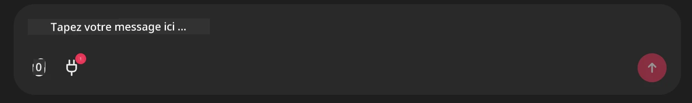

# Exemple de serveur Github MCP

## Description

Ceci était une démo créée pour le Hackathon AI Agents organisé par le Microsoft Reactor.

L'outil est utilisé pour recommander des projets de hackathon basés sur les repos Github d'un utilisateur.
Cela se fait par :

1. **Agent Github** - Utilisation du serveur Github MCP pour récupérer les repos et les informations à leur sujet.
2. **Agent Hackathon** - Prend les données de l'Agent Github et propose des idées créatives de projets de hackathon en fonction des projets, des langages utilisés par l'utilisateur et des pistes de projet pour le hackathon AI Agents.
3. **Agent Événements** - Sur la base des suggestions de l'agent hackathon, l'agent événements recommandera des événements pertinents de la série AI Agent Hackathon.

## Exécution du code 

### Variables d'environnement

Cette démo utilise Microsoft Agent Framework, Azure OpenAI Service, le serveur Github MCP et Azure AI Search.

Assurez-vous d'avoir configuré les variables d'environnement appropriées pour utiliser ces outils :

```python
AZURE_AI_PROJECT_ENDPOINT=""
AZURE_AI_MODEL_DEPLOYMENT_NAME=""
AZURE_SEARCH_SERVICE_ENDPOINT=""
AZURE_SEARCH_API_KEY=""
``` 

## Lancement du serveur Chainlit

Pour se connecter au serveur MCP, cette démo utilise Chainlit comme interface de chat.

Pour démarrer le serveur, utilisez la commande suivante dans votre terminal :

```bash
chainlit run app.py -w
```

Cela devrait démarrer votre serveur Chainlit sur `localhost:8000` ainsi que peupler votre index Azure AI Search avec le contenu du fichier `event-descriptions.md`.

## Connexion au serveur MCP

Pour se connecter au serveur Github MCP, sélectionnez l'icône "prise" sous la zone de chat "Tapez votre message ici .." :



De là, vous pouvez cliquer sur "Connect an MCP" pour ajouter la commande pour se connecter au serveur Github MCP :

```bash
npx -y @modelcontextprotocol/server-github --env GITHUB_PERSONAL_ACCESS_TOKEN=[YOUR PERSONAL ACCESS TOKEN]
```

Remplacez "[YOUR PERSONAL ACCESS TOKEN]" par votre jeton d'accès personnel réel.

Après la connexion, vous devriez voir un (1) à côté de l'icône de la prise pour confirmer qu'il est connecté. Sinon, essayez de redémarrer le serveur chainlit avec `chainlit run app.py -w`.

## Utilisation de la démo

Pour démarrer le workflow de l'agent recommandant des projets de hackathon, vous pouvez taper un message comme :

"Recommandez des projets de hackathon pour l'utilisateur Github koreyspace"

L'Agent Routeur analysera votre demande et déterminera quelle combinaison d'agents (GitHub, Hackathon et Événements) est la mieux adaptée pour traiter votre requête. Les agents travaillent ensemble pour fournir des recommandations complètes basées sur l'analyse des dépôts GitHub, l’idéation de projets et les événements technologiques pertinents.

---

<!-- CO-OP TRANSLATOR DISCLAIMER START -->
**Avertissement** :  
Ce document a été traduit à l'aide du service de traduction automatique [Co-op Translator](https://github.com/Azure/co-op-translator). Bien que nous nous efforçons d'assurer l'exactitude, veuillez noter que les traductions automatisées peuvent contenir des erreurs ou des inexactitudes. Le document original dans sa langue d'origine doit être considéré comme la source faisant foi. Pour les informations cruciales, une traduction professionnelle effectuée par un humain est recommandée. Nous déclinons toute responsabilité en cas de malentendus ou d'interprétations erronées découlant de l'utilisation de cette traduction.
<!-- CO-OP TRANSLATOR DISCLAIMER END -->