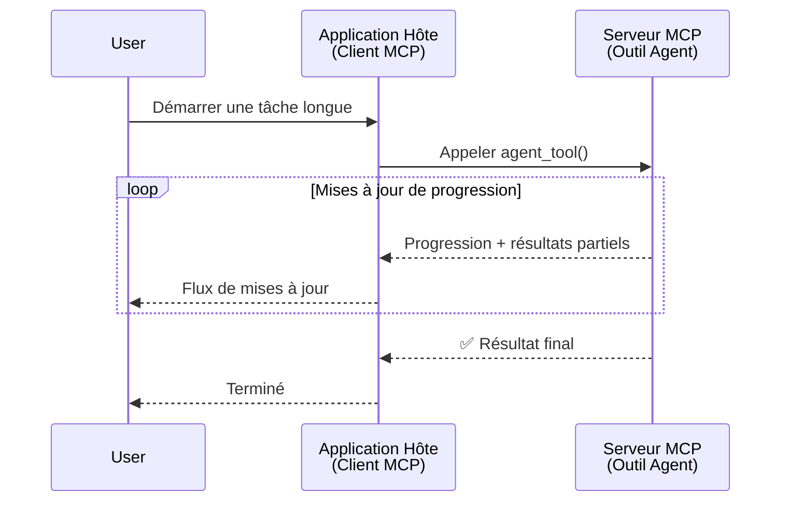
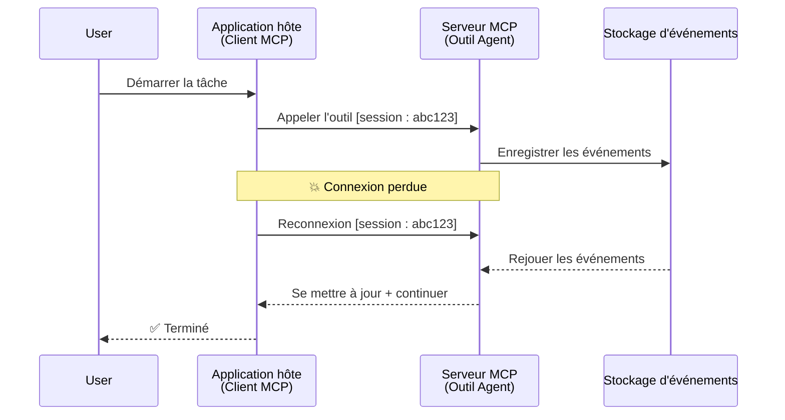
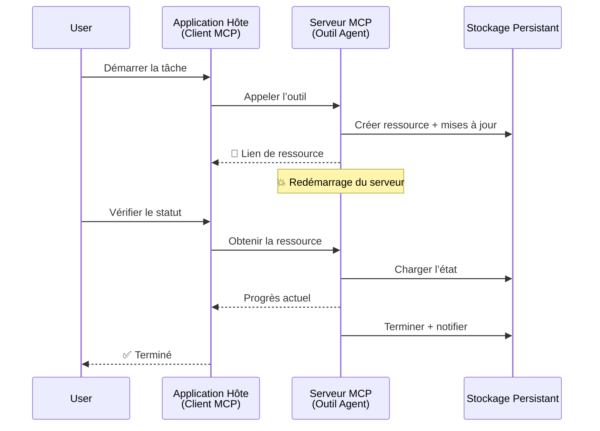
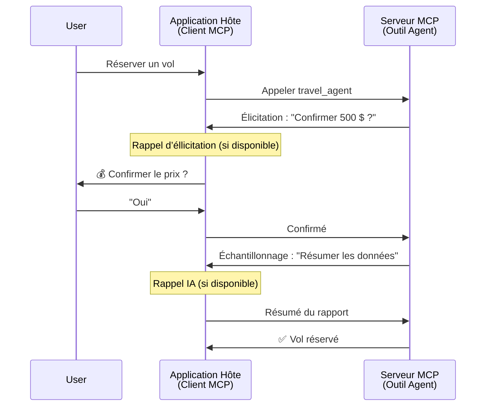
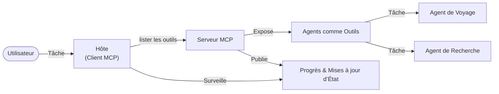

# Construire des systèmes de communication agent-à-agent avec MCP

> TL;DR - Peut-on construire une communication Agent2Agent sur MCP ? Oui !

MCP a considérablement évolué au-delà de son objectif initial de « fournir un contexte aux LLM ». Avec les améliorations récentes incluant [flux résumables](https://modelcontextprotocol.io/docs/concepts/transports#resumability-and-redelivery), [élucidation](https://modelcontextprotocol.io/specification/2025-06-18/client/elicitation), [échantillonnage](https://modelcontextprotocol.io/specification/2025-06-18/client/sampling), et des notifications ([progression](https://modelcontextprotocol.io/specification/2025-06-18/basic/utilities/progress) et [ressources](https://modelcontextprotocol.io/specification/2025-06-18/schema#resourceupdatednotification)), MCP offre désormais une base robuste pour construire des systèmes complexes de communication agent-à-agent.

## La méprise Agent/Outil

À mesure que davantage de développeurs explorent des outils avec des comportements agentiques (fonctionnant sur de longues périodes, pouvant nécessiter des entrées supplémentaires en cours d'exécution, etc.), une idée fausse courante est que MCP est inadéquat principalement parce que les premiers exemples d'outils primitifs se concentraient sur des modèles simples de requête-réponse.

Cette perception est dépassée. La spécification MCP a été notablement enrichie ces derniers mois avec des capacités comblant le fossé pour construire des comportements agentiques long-terme :

- **Streaming & Résultats Partiels** : mises à jour en temps réel pendant l'exécution
- **Résumabilité** : les clients peuvent se reconnecter et continuer après une déconnexion
- **Durabilité** : les résultats survivent aux redémarrages du serveur (par ex., via des liens de ressources)
- **Multi-tours** : entrée interactive en cours d'exécution via éclaircissement et échantillonnage

Ces fonctionnalités peuvent être combinées pour permettre des applications agentiques complexes et multi-agents, toutes déployées sur le protocole MCP.

Pour référence, nous désignerons un agent comme un « outil » disponible sur un serveur MCP. Cela implique l'existence d'une application hôte qui implémente un client MCP établissant une session avec le serveur MCP et pouvant appeler l'agent.

## Qu'est-ce qui rend un outil MCP « agentique » ?

Avant de plonger dans l'implémentation, établissons quelles capacités d'infrastructure sont nécessaires pour supporter des agents long-terme.

> Nous définirons un agent comme une entité pouvant fonctionner de manière autonome sur de longues périodes, capable de gérer des tâches complexes nécessitant potentiellement plusieurs interactions ou ajustements basés sur des retours en temps réel.

### 1. Streaming & Résultats Partiels

Les modèles traditionnels requête-réponse ne fonctionnent pas pour des tâches longues. Les agents doivent fournir :

- Mises à jour de progression en temps réel
- Résultats intermédiaires

**Support MCP** : Les notifications de mise à jour de ressources permettent de diffuser des résultats partiels, bien que cela nécessite une conception soignée pour éviter les conflits avec le modèle requête/réponse 1:1 de JSON-RPC.

| Fonctionnalité             | Cas d'usage                                                                                                                                                                    | Support MCP                                                                                |
| ------------------------- | ------------------------------------------------------------------------------------------------------------------------------------------------------------------------------- | ------------------------------------------------------------------------------------------ |
| Mises à jour en temps réel | L'utilisateur demande une tâche de migration de code. L'agent diffuse la progression : "10 % - Analyse des dépendances... 25 % - Conversion des fichiers TypeScript... 50 % - Mise à jour des imports..." | ✅ Notifications de progression                                                            |
| Résultats partiels        | La tâche « Générer un livre » diffuse des résultats partiels, ex. : 1) Plan de l'arc narratif, 2) Liste des chapitres, 3) Chaque chapitre au fur et à mesure de sa complétion. L'hôte peut inspecter, annuler ou rediriger à tout moment. | ✅ Les notifications peuvent être « étendues » pour inclure des résultats partiels voir propositions PR 383, 776 |

<div align="center" style="font-style: italic; font-size: 0.95em; margin-bottom: 0.5em;">
<strong>Figure 1 :</strong> Ce diagramme illustre comment un agent MCP diffuse des mises à jour en temps réel de progression et des résultats partiels à l'application hôte lors d'une tâche longue, permettant à l'utilisateur de suivre l'exécution en temps réel.
</div>



### 2. Résumabilité

Les agents doivent gérer gracieusement les interruptions réseau :

- Se reconnecter après une déconnexion (client)
- Continuer depuis le point d'interruption (redélivrance des messages)

**Support MCP** : Le transport StreamableHTTP de MCP supporte aujourd'hui la reprise de session et la redélivrance de messages avec des IDs de session et d'événements. Il est important que le serveur implémente un EventStore permettant la relecture des événements lors de la reconnexion du client.  
Notez qu'il existe une proposition communautaire (PR #975) explorant les flux résumables indépendants du transport.

| Fonctionnalité     | Cas d'usage                                                                                                                                                | Support MCP                                                                |
| ----------------- | --------------------------------------------------------------------------------------------------------------------------------------------------------- | -------------------------------------------------------------------------- |
| Résumabilité      | Le client se déconnecte durant une tâche longue. Lors de la reconnexion, la session reprend avec relecture des événements manqués, continuant sans interruption. | ✅ Transport StreamableHTTP avec IDs de session, relecture d'événements, et EventStore |

<div align="center" style="font-style: italic; font-size: 0.95em; margin-bottom: 0.5em;">
<strong>Figure 2 :</strong> Ce diagramme montre comment le transport StreamableHTTP et l'EventStore de MCP permettent une reprise de session fluide : si le client se déconnecte, il peut se reconnecter et rejouer les événements manqués, poursuivant la tâche sans perte de progression.
</div>



### 3. Durabilité

Les agents de longue durée ont besoin d'un état persistant :

- Les résultats survivent aux redémarrages du serveur
- Le statut peut être récupéré de manière asynchrone
- Suivi de progression à travers les sessions

**Support MCP** : MCP supporte désormais un type de retour de lien vers une ressource pour les appels d'outil. Aujourd'hui, un schéma possible est de concevoir un outil qui crée une ressource et retourne immédiatement un lien vers cette ressource. L'outil peut continuer à traiter la tâche en arrière-plan et mettre à jour la ressource. Le client peut alors interroger périodiquement l'état de la ressource pour obtenir des résultats partiels ou complets (selon les mises à jour fournies par le serveur) ou s'abonner à la ressource pour recevoir des notifications.

Une limitation ici est que le sondage des ressources ou l’abonnement aux mises à jour peut consommer des ressources avec des implications à grande échelle. Une proposition communautaire ouverte (y compris #992) explore la possibilité d'inclure des webhooks ou déclencheurs que le serveur pourrait appeler pour notifier le client/application hôte des mises à jour.

| Fonctionnalité | Cas d'usage                                                                                                                               | Support MCP                                                        |
| ------------- | ---------------------------------------------------------------------------------------------------------------------------------------- | ------------------------------------------------------------------ |
| Durabilité    | Le serveur plante durant une tâche de migration de données. Les résultats et la progression survivent au redémarrage, le client peut vérifier le statut et continuer depuis la ressource persistante. | ✅ Liens ressources avec stockage persistant et notifications de statut |

Aujourd'hui, un schéma courant est un outil qui crée une ressource et retourne immédiatement un lien vers elle. L'outil peut en arrière-plan traiter la tâche, émettre des notifications servant de mises à jour de progression ou inclure des résultats partiels, et mettre à jour le contenu de la ressource selon les besoins.

<div align="center" style="font-style: italic; font-size: 0.95em; margin-bottom: 0.5em;">
<strong>Figure 3 :</strong> Ce diagramme montre comment les agents MCP utilisent des ressources persistantes et des notifications de statut pour garantir que les tâches longues survivent aux redémarrages du serveur, permettant aux clients de vérifier la progression et de récupérer les résultats même après des pannes.
</div>



### 4. Interactions Multi-Tours

Les agents ont souvent besoin d'entrées supplémentaires en cours d'exécution :

- Clarifications ou approbations humaines
- Assistance IA pour des décisions complexes
- Ajustement dynamique des paramètres

**Support MCP** : Entièrement supporté via l’échantillonnage (pour l'entrée IA) et l'élucidation (pour l'entrée humaine).

| Fonctionnalité            | Cas d'usage                                                                                                                                             | Support MCP                                           |
| ------------------------ | ------------------------------------------------------------------------------------------------------------------------------------------------------ | ----------------------------------------------------- |
| Interactions Multi-Tours | L'agent de réservation de voyage demande la confirmation du prix à l'utilisateur, puis demande à l'IA de résumer les données de voyage avant de finaliser la réservation. | ✅ Élucidation pour l'entrée humaine, échantillonnage pour l'entrée IA |

<div align="center" style="font-style: italic; font-size: 0.95em; margin-bottom: 0.5em;">
<strong>Figure 4 :</strong> Ce diagramme montre comment les agents MCP peuvent interactivement solliciter des entrées humaines ou demander de l'aide à l'IA en cours d'exécution, supportant des workflows complexes multi-tours tels que confirmations et prises de décisions dynamiques.
</div>



## Implémenter des agents long-terme sur MCP - Vue d'ensemble du code

Dans cet article, nous fournissons un [dépôt de code](https://github.com/victordibia/ai-tutorials/tree/main/MCP%20Agents) contenant une implémentation complète d'agents long-terme utilisant le SDK Python MCP avec transport StreamableHTTP pour la reprise de session et la redélivrance des messages. L’implémentation démontre comment composer les capacités MCP pour permettre des comportements sophistiqués de type agent.

Plus précisément, nous implémentons un serveur avec deux agents principaux :

- **Agent de voyage** - Simule un service de réservation de voyage avec confirmation de prix via éclaircissement
- **Agent de recherche** - Effectue des tâches de recherche avec résumés assistés par IA via échantillonnage

Les deux agents démontrent des mises à jour de progression en temps réel, des confirmations interactives, et une reprise complète de session.

### Concepts clés d'implémentation

Les sections suivantes montrent l’implémentation côté serveur des agents et la gestion côté client hôte pour chaque fonctionnalité :

#### Streaming & Mises à jour de progression - Statut de tâche temps réel

Le streaming permet aux agents de fournir des mises à jour en temps réel de progression durant les tâches longues, tenant les utilisateurs informés du statut de la tâche et des résultats intermédiaires.

**Implémentation serveur (l’agent envoie des notifications de progression) :**

```python
# Depuis server/server.py - Agent de voyage envoyant des mises à jour de progression
for i, step in enumerate(steps):
    await ctx.session.send_progress_notification(
        progress_token=ctx.request_id,
        progress=i * 25,
        total=100,
        message=step,
        related_request_id=str(ctx.request_id)
    )
    await anyio.sleep(2)  # Simuler le travail

# Alternative : Enregistrer des messages pour des mises à jour détaillées étape par étape
await ctx.session.send_log_message(
    level="info",
    data=f"Processing step {current_step}/{steps} ({progress_percent}%)",
    logger="long_running_agent",
    related_request_id=ctx.request_id,
)
```

**Implémentation client (l’hôte reçoit les mises à jour de progression) :**

```python
# Depuis client/client.py - Client gérant les notifications en temps réel
async def message_handler(message) -> None:
    if isinstance(message, types.ServerNotification):
        if isinstance(message.root, types.LoggingMessageNotification):
            console.print(f"📡 [dim]{message.root.params.data}[/dim]")
        elif isinstance(message.root, types.ProgressNotification):
            progress = message.root.params
            console.print(f"🔄 [yellow]{progress.message} ({progress.progress}/{progress.total})[/yellow]")

# Enregistrer le gestionnaire de messages lors de la création de la session
async with ClientSession(
    read_stream, write_stream,
    message_handler=message_handler
) as session:
```

#### Élucidation - Demander une entrée utilisateur

L’élucidation permet aux agents de demander une entrée utilisateur en cours d’exécution. Ceci est essentiel pour confirmations, clarifications ou approbations pendant des tâches longues.

**Implémentation serveur (l'agent demande confirmation) :**

```python
# Depuis server/server.py - Agent de voyage demandant la confirmation du prix
elicit_result = await ctx.session.elicit(
    message=f"Please confirm the estimated price of $1200 for your trip to {destination}",
    requestedSchema=PriceConfirmationSchema.model_json_schema(),
    related_request_id=ctx.request_id,
)

if elicit_result and elicit_result.action == "accept":
    # Continuer avec la réservation
    logger.info(f"User confirmed price: {elicit_result.content}")
elif elicit_result and elicit_result.action == "decline":
    # Annuler la réservation
    booking_cancelled = True
```

**Implémentation client (l'hôte fournit un callback d'élucidation) :**

```python
# Depuis client/client.py - Gestion des demandes d'élucidation par le client
async def elicitation_callback(context, params):
    console.print(f"💬 Server is asking for confirmation:")
    console.print(f"   {params.message}")

    response = console.input("Do you accept? (y/n): ").strip().lower()

    if response in ['y', 'yes']:
        return types.ElicitResult(
            action="accept",
            content={"confirm": True, "notes": "Confirmed by user"}
        )
    else:
        return types.ElicitResult(
            action="decline",
            content={"confirm": False, "notes": "Declined by user"}
        )

# Enregistrer le rappel lors de la création de la session
async with ClientSession(
    read_stream, write_stream,
    elicitation_callback=elicitation_callback
) as session:
```

#### Échantillonnage - Demander de l’aide IA

L’échantillonnage permet aux agents de solliciter l’aide d'un LLM pour des décisions complexes ou la génération de contenu durant l'exécution. Cela permet des workflows hybrides humain-IA.

**Implémentation serveur (l’agent demande de l’aide IA) :**

```python
# Depuis server/server.py - Agent de recherche demandant un résumé IA
sampling_result = await ctx.session.create_message(
    messages=[
        SamplingMessage(
            role="user",
            content=TextContent(type="text", text=f"Please summarize the key findings for research on: {topic}")
        )
    ],
    max_tokens=100,
    related_request_id=ctx.request_id,
)

if sampling_result and sampling_result.content:
    if sampling_result.content.type == "text":
        sampling_summary = sampling_result.content.text
        logger.info(f"Received sampling summary: {sampling_summary}")
```

**Implémentation client (l’hôte fournit un callback d’échantillonnage) :**

```python
# De client/client.py - Gestion des demandes d'échantillonnage par le client
async def sampling_callback(context, params):
    message_text = params.messages[0].content.text if params.messages else 'No message'
    console.print(f"🧠 Server requested sampling: {message_text}")

    # Dans une application réelle, cela pourrait appeler une API LLM
    # À des fins de démonstration, nous fournissons une réponse factice
    mock_response = "Based on current research, MCP has evolved significantly..."

    return types.CreateMessageResult(
        role="assistant",
        content=types.TextContent(type="text", text=mock_response),
        model="interactive-client",
        stopReason="endTurn"
    )

# Enregistrer le rappel lors de la création de la session
async with ClientSession(
    read_stream, write_stream,
    sampling_callback=sampling_callback,
    elicitation_callback=elicitation_callback
) as session:
```

#### Résumabilité - Continuité de session à travers les déconnexions

La résumabilité assure que les tâches longues des agents peuvent survivre à des déconnexions client et reprendre sans interruption lors de la reconnexion. Ceci est implémenté via des magasins d'événements et des jetons de reprise.

**Implémentation de l’Event Store (serveur conserve l’état de session) :**

```python
# De server/event_store.py - Simple magasin d'événements en mémoire
class SimpleEventStore(EventStore):
    def __init__(self):
        self._events: list[tuple[StreamId, EventId, JSONRPCMessage]] = []
        self._event_id_counter = 0

    async def store_event(self, stream_id: StreamId, message: JSONRPCMessage) -> EventId:
        """Store an event and return its ID."""
        self._event_id_counter += 1
        event_id = str(self._event_id_counter)
        self._events.append((stream_id, event_id, message))
        return event_id

    async def replay_events_after(self, last_event_id: EventId, send_callback: EventCallback) -> StreamId | None:
        """Replay events after the specified ID for resumption."""
        start_index = None
        stream_id = None
        for index, (event_stream_id, event_id, _) in enumerate(self._events):
            if event_id == last_event_id:
                start_index = index + 1
                stream_id = event_stream_id
                break

        if start_index is None:
            return None

        # Rejouer uniquement les événements ultérieurs du flux original de la session.
        for event_stream_id, event_id, message in self._events[start_index:]:
            if event_stream_id != stream_id:
                continue
            await send_callback(EventMessage(message, event_id))

        return stream_id

# De server/server.py - Passage du magasin d'événements au gestionnaire de session
def create_server_app(event_store: Optional[EventStore] = None) -> Starlette:
    server = ResumableServer()

    # Créer un gestionnaire de session avec un magasin d'événements pour la reprise
    session_manager = StreamableHTTPSessionManager(
        app=server,
        event_store=event_store,  # Le magasin d'événements permet la reprise de session
        json_response=False,
        security_settings=security_settings,
    )

    return Starlette(routes=[Mount("/mcp", app=session_manager.handle_request)])

# Utilisation : Initialiser avec un magasin d'événements
event_store = SimpleEventStore()
app = create_server_app(event_store)
```

**Métadonnées client avec jeton de reprise (le client se reconnecte en utilisant l’état stocké) :**

```python
# Depuis client/client.py - Reprise client avec métadonnées
if existing_tokens and existing_tokens.get("resumption_token"):
    # Utiliser le jeton de reprise existant pour continuer là où nous nous sommes arrêtés
    metadata = ClientMessageMetadata(
        resumption_token=existing_tokens["resumption_token"],
    )
else:
    # Créer un rappel pour enregistrer le jeton de reprise lorsqu'il est reçu
    def enhanced_callback(token: str):
        protocol_version = getattr(session, 'protocol_version', None)
        token_manager.save_tokens(session_id, token, protocol_version, command, args)

    metadata = ClientMessageMetadata(
        on_resumption_token_update=enhanced_callback,
    )

# Envoyer la requête avec les métadonnées de reprise
result = await session.send_request(
    types.ClientRequest(
        types.CallToolRequest(
            method="tools/call",
            params=types.CallToolRequestParams(name=command, arguments=args)
        )
    ),
    types.CallToolResult,
    metadata=metadata,
)
```

L’application hôte maintient des IDs de session et des jetons de reprise localement, lui permettant de se reconnecter à des sessions existantes sans perdre progression ni état.

### Organisation du code

<div align="center" style="font-style: italic; font-size: 0.95em; margin-bottom: 0.5em;">
<strong>Figure 5 :</strong> Architecture du système d’agents basé sur MCP
</div>



**Fichiers clés :**

- **`server/server.py`** - Serveur MCP résumable avec agents de voyage et recherche démontrant élucidation, échantillonnage, et mises à jour de progression
- **`client/client.py`** - Application hôte interactive avec support de reprise, gestionnaires de callbacks, et gestion de jetons
- **`server/event_store.py`** - Implémentation de l’Event store permettant reprise de session et redélivrance des messages

## Extension vers la communication multi-agent sur MCP

L’implémentation ci-dessus peut être étendue aux systèmes multi-agents en enrichissant l’intelligence et la portée de l’application hôte :

- **Décomposition intelligente des tâches** : L’hôte analyse les requêtes utilisateurs complexes et les décompose en sous-tâches pour différents agents spécialisés
- **Coordination multi-serveurs** : L’hôte maintient des connexions à plusieurs serveurs MCP, chacun exposant différentes capacités d’agents
- **Gestion d’état de tâches** : L’hôte suit la progression à travers plusieurs tâches agents concurrentes, gérant dépendances et séquençage
- **Résilience & Reprises** : L’hôte gère les échecs, implémente une logique de réessai, et redirige les tâches quand des agents deviennent indisponibles
- **Synthèse de résultats** : L’hôte combine les sorties de multiples agents en résultats finaux cohérents

L’hôte évolue d’un simple client à un orchestrateur intelligent, coordonnant les capacités distribuées des agents tout en conservant la même base du protocole MCP.

## Conclusion

Les capacités enrichies de MCP - notifications de ressources, élucidation/échantillonnage, flux résumables, et ressources persistantes - permettent des interactions complexes agent-à-agent tout en maintenant la simplicité du protocole.

## Pour commencer

Prêt à construire votre propre système agent2agent ? Suivez ces étapes :

### 1. Lancer la démo

```bash
# Démarrez le serveur avec le magasin d'événements pour la reprise
python -m server.server --port 8006

# Dans un autre terminal, exécutez le client interactif
python -m client.client --url http://127.0.0.1:8006/mcp
```

**Commandes disponibles en mode interactif :**

- `travel_agent` - Réserver un voyage avec confirmation de prix via élucidation
- `research_agent` - Faire des recherches avec résumés assistés par IA via échantillonnage
- `list` - Afficher tous les outils disponibles
- `clean-tokens` - Effacer les jetons de reprise
- `help` - Afficher l’aide détaillée des commandes
- `quit` - Quitter le client

### 2. Tester les capacités de reprise

- Démarrer un agent long-terme (ex. `travel_agent`)
- Interrompre le client pendant l’exécution (Ctrl+C)
- Redémarrer le client - il reprendra automatiquement là où il s’était arrêté

### 3. Explorer et étendre

- **Explorer les exemples** : Découvrez ce [mcp-agents](https://github.com/victordibia/ai-tutorials/tree/main/MCP%20Agents)
- **Rejoindre la communauté** : Participez aux discussions MCP sur GitHub
- **Expérimenter** : Commencez avec une tâche longue simple et ajoutez progressivement streaming, résumabilité, et coordination multi-agent

Ceci démontre comment MCP permet des comportements intelligents d’agents tout en maintenant la simplicité d’outils.

Globalement, la spécification du protocole MCP évolue rapidement ; le lecteur est invité à consulter le site officiel de documentation pour les mises à jour les plus récentes - https://modelcontextprotocol.io/introduction

---

<!-- CO-OP TRANSLATOR DISCLAIMER START -->
**Avertissement** :
Ce document a été traduit à l'aide du service de traduction automatique [Co-op Translator](https://github.com/Azure/co-op-translator). Bien que nous nous efforçions d'assurer l'exactitude, veuillez noter que les traductions automatisées peuvent contenir des erreurs ou des inexactitudes. Le document original dans sa langue native doit être considéré comme la source faisant autorité. Pour les informations critiques, il est recommandé de recourir à une traduction professionnelle réalisée par un humain. Nous ne saurions être tenus responsables des malentendus ou erreurs d'interprétation découlant de l'utilisation de cette traduction.
<!-- CO-OP TRANSLATOR DISCLAIMER END -->