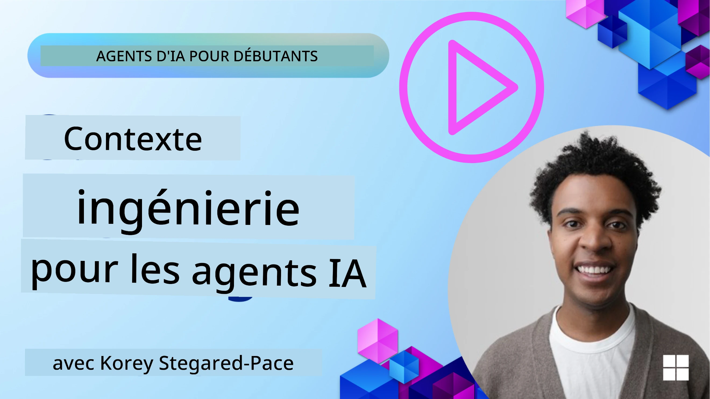
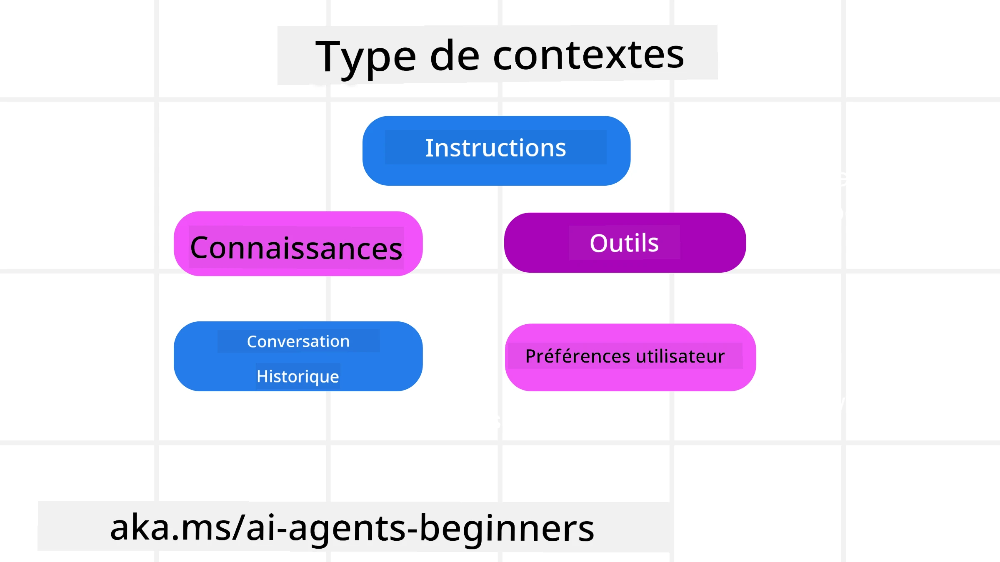
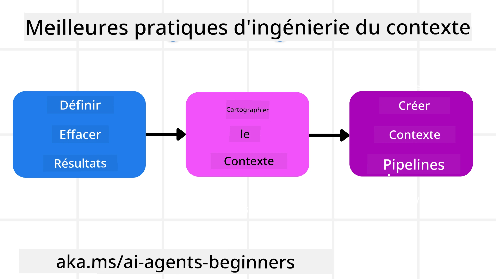

# Ingénierie du Contexte pour les Agents IA

> _(Cliquez sur l'image ci-dessus pour voir la vidéo de cette leçon)_

Comprendre la complexité de l’application pour laquelle vous construisez un agent IA est important pour en faire un agent fiable. Nous devons créer des agents IA qui gèrent efficacement l’information pour répondre à des besoins complexes au-delà de l’ingénierie des prompts.

Dans cette leçon, nous examinerons ce qu’est l’ingénierie du contexte et son rôle dans la construction d’agents IA.

## Introduction

Cette leçon couvrira :

• **Ce qu’est l’ingénierie du contexte** et pourquoi elle est différente de l’ingénierie des prompts.

• **Les stratégies pour une ingénierie du contexte efficace**, incluant comment écrire, sélectionner, compresser et isoler l’information.

• **Les échecs courants du contexte** qui peuvent faire dérailler votre agent IA et comment les corriger.

## Objectifs d’Apprentissage

Après avoir terminé cette leçon, vous saurez comprendre comment :

• **Définir l’ingénierie du contexte** et la différencier de l’ingénierie des prompts.

• **Identifier les composants clés du contexte** dans les applications de Modèles de Langage Large (LLM).

• **Appliquer des stratégies pour écrire, sélectionner, compresser et isoler le contexte** afin d’améliorer les performances de l’agent.

• **Reconnaître les échecs courants du contexte** tels que l’empoisonnement, la distraction, la confusion et le conflit, et mettre en œuvre des techniques d’atténuation.

## Qu’est-ce que l’Ingénierie du Contexte ?

Pour les agents IA, le contexte est ce qui pilote la planification d’un agent IA pour effectuer certaines actions. L’ingénierie du contexte consiste à s’assurer que l’agent IA dispose de la bonne information pour réaliser l’étape suivante de la tâche. La fenêtre de contexte est limitée en taille, donc en tant que créateurs d’agents, nous devons mettre en place des systèmes et des processus pour gérer l’ajout, la suppression et la condensation des informations dans la fenêtre de contexte.

### Ingénierie des Prompts vs Ingénierie du Contexte

L’ingénierie des prompts se concentre sur un ensemble statique d’instructions pour guider efficacement les agents IA avec un ensemble de règles. L’ingénierie du contexte concerne la gestion d’un ensemble dynamique d’informations, y compris le prompt initial, pour s’assurer que l’agent IA dispose de ce dont il a besoin au fil du temps. L’idée principale autour de l’ingénierie du contexte est de rendre ce processus répétable et fiable.

### Types de Contexte

Il est important de se rappeler que le contexte n’est pas une seule chose. L’information dont l’agent IA a besoin peut provenir de diverses sources différentes et c’est à nous de nous assurer que l’agent y a accès :

Les types de contexte qu’un agent IA pourrait devoir gérer incluent :

• **Instructions :** Ce sont comme les « règles » de l’agent – prompts, messages système, exemples few-shot (montrant à l’IA comment faire quelque chose) et descriptions des outils qu’il peut utiliser. C’est là que le focus de l’ingénierie des prompts se combine avec l’ingénierie du contexte.

• **Connaissances :** Cela comprend les faits, les informations récupérées depuis des bases de données, ou les mémoires à long terme accumulées par l’agent. Cela inclut l’intégration d’un système Retrieval Augmented Generation (RAG) si un agent doit accéder à différentes sources de connaissances et bases de données.

• **Outils :** Ce sont les définitions de fonctions externes, d’APIs et de serveurs MCP que l’agent peut appeler, ainsi que les retours (résultats) qu’il obtient en les utilisant.

• **Historique des Conversations :** Le dialogue en cours avec un utilisateur. Au fil du temps, ces conversations deviennent plus longues et plus complexes, ce qui prend de la place dans la fenêtre de contexte.

• **Préférences Utilisateur :** Informations apprises sur les goûts ou dégoûts d’un utilisateur au fil du temps. Elles peuvent être stockées et utilisées lors de décisions clés pour aider l’utilisateur.

## Stratégies pour une Ingénierie du Contexte Efficace

### Stratégies de Planification

Une bonne ingénierie du contexte commence par une bonne planification. Voici une approche qui vous aidera à commencer à réfléchir à la façon d’appliquer le concept d’ingénierie du contexte :

1. **Définir des Résultats Clairs** – Les résultats des tâches assignées aux agents IA doivent être clairement définis. Répondez à la question – « À quoi ressemblera le monde lorsque l’agent IA aura terminé sa tâche ? » En d’autres termes, quel changement, information ou réponse l’utilisateur devrait-il avoir après avoir interagi avec l’agent IA.
2. **Cartographier le Contexte** – Une fois que vous avez défini les résultats de l’agent IA, vous devez répondre à la question « Quelles informations l’agent IA doit-il posséder pour accomplir cette tâche ? ». De cette façon, vous pouvez commencer à cartographier où ces informations peuvent être localisées.
3. **Créer des Pipelines de Contexte** – Maintenant que vous savez où sont les informations, vous devez répondre à la question « Comment l’agent obtiendra-t-il ces informations ? ». Cela peut se faire de différentes manières, incluant RAG, l’usage de serveurs MCP et d’autres outils.

### Stratégies Pratiques

La planification est importante, mais une fois que l’information commence à affluer dans la fenêtre de contexte de notre agent, nous avons besoin de stratégies pratiques pour la gérer :

#### Gestion du Contexte

Alors que certaines informations seront ajoutées à la fenêtre de contexte automatiquement, l’ingénierie du contexte consiste à prendre un rôle plus actif dans cette gestion, ce qui peut se faire par quelques stratégies :

 1. **Bloc-Notes de l’Agent (Agent Scratchpad)**  
 Cela permet à un agent IA de prendre des notes sur les informations pertinentes concernant les tâches en cours et les interactions utilisateur durant une seule session. Cela devrait exister en dehors de la fenêtre de contexte dans un fichier ou un objet runtime que l’agent peut ensuite récupérer pendant cette session si nécessaire.

 2. **Mémoires**  
 Les bloc-notes sont efficaces pour gérer les informations hors de la fenêtre de contexte d’une session unique. Les mémoires permettent aux agents de stocker et de récupérer des informations pertinentes sur plusieurs sessions. Cela pourrait inclure des résumés, des préférences utilisateur et des retours pour des améliorations futures.

 3. **Compression du Contexte**  
 Une fois que la fenêtre de contexte grandit et se rapproche de sa limite, des techniques comme la summarisation et la réduction peuvent être utilisées. Cela inclut soit garder uniquement les informations les plus pertinentes, soit supprimer les messages anciens.

 4. **Systèmes Multi-Agents**  
 Développer des systèmes multi-agents est une forme d’ingénierie du contexte car chaque agent a sa propre fenêtre de contexte. La façon dont ce contexte est partagé et transmis aux différents agents est une autre chose à planifier lors de la construction de ces systèmes.

 5. **Environnements Sandbox**  
 Si un agent doit exécuter du code ou traiter de grandes quantités d’informations dans un document, cela peut prendre beaucoup de tokens pour traiter les résultats. Au lieu d’avoir tout stocké dans la fenêtre de contexte, l’agent peut utiliser un environnement sandbox capable d’exécuter ce code et de ne lire que les résultats et autres informations pertinentes.

 6. **Objets d’État Runtime**  
 Cela se fait en créant des conteneurs d’informations pour gérer les situations où l’agent doit accéder à certaines informations. Pour une tâche complexe, cela permettrait à l’agent de stocker les résultats de chaque sous-tâche étape par étape, permettant au contexte de rester connecté uniquement à cette sous-tâche spécifique.

#### Inspection du Contexte

Après avoir appliqué une de ces stratégies, il est utile de vérifier ce que l’appel modèle suivant a réellement reçu. Une question de débogage utile est :

> L’agent a-t-il chargé trop de contexte, le mauvais contexte, ou a-t-il manqué du contexte dont il avait besoin ?

Vous n’avez pas besoin d’enregistrer les prompts bruts, les résultats d’outils ou le contenu des mémoires pour répondre à cette question. En production, préférez de petits enregistrements d’inspection contextuelle capturant les comptes, identifiants, hachages et étiquettes de politique :

- **Sélection :** Suivez combien de morceaux candidats, outils ou mémoires ont été considérés, combien ont été sélectionnés, et quelle règle ou score a conduit à filtrer les autres.
- **Compression :** Enregistrez la plage source ou l’identifiant de trace, l’identifiant du résumé, une estimation du nombre de tokens avant et après compression, et si le contenu brut a été exclu de l’appel suivant.
- **Isolation :** Notez quelle sous-tâche a été exécutée dans un agent, une session ou un sandbox séparé, quel résumé borné a été retourné, et si une sortie volumineuse d’outil est restée hors du contexte de l’agent principal.
- **Mémoire et RAG :** Stockez les identifiants des documents récupérés, mémoires, scores, identifiants sélectionnés, et statut de caviardage au lieu du texte récupéré complet.
- **Sécurité et confidentialité :** Préférez les hachages, identifiants, seaux de tokens et étiquettes de politique plutôt que les textes sensibles du prompt, arguments d’outil, résultats d’outil ou corps des mémoires utilisateur.

Le but n’est pas de garder plus de contexte. C’est de laisser suffisamment de traces pour qu’un développeur puisse dire quelle stratégie de contexte a été exécutée et si elle a modifié l’appel modèle suivant comme prévu.

### Exemple d’Ingénierie du Contexte

Disons que nous voulons qu’un agent IA **« me réserve un voyage à Paris. »**

• Un simple agent utilisant uniquement l’ingénierie des prompts pourrait simplement répondre : **« D’accord, quand souhaitez-vous aller à Paris ? »**. Il n’a traité que votre question directe au moment où vous l’avez posée.

• Un agent utilisant les stratégies d’ingénierie du contexte abordées ferait beaucoup plus. Avant même de répondre, son système pourrait :

  ◦ **Vérifier votre calendrier** pour les dates disponibles (récupérant des données en temps réel).

 ◦ **Se souvenir des préférences de voyage passées** (depuis la mémoire à long terme) comme votre compagnie aérienne préférée, votre budget ou si vous préférez les vols directs.

 ◦ **Identifier les outils disponibles** pour la réservation de vols et d’hôtels.

- Ensuite, une réponse exemple pourrait être :  « Salut [Votre Nom] ! Je vois que vous êtes libre la première semaine d’octobre. Dois-je chercher des vols directs pour Paris sur [Compagnie Préférée] dans votre budget habituel de [Budget] ? ». Cette réponse plus riche et consciente du contexte démontre la puissance de l’ingénierie du contexte.

## Échecs Courants du Contexte

### Empoisonnement du Contexte

**Qu’est-ce que c’est :** Lorsqu’une hallucination (information fausse générée par le LLM) ou une erreur entre dans le contexte et est référencée à plusieurs reprises, incitant l’agent à poursuivre des objectifs impossibles ou à développer des stratégies absurdes.

**Que faire :** Mettre en place une **validation du contexte** et une **quarantaine**. Validez l’information avant de l’ajouter à la mémoire à long terme. Si un empoisonnement potentiel est détecté, démarrez de nouveaux fils de contexte pour empêcher la propagation de la mauvaise information.

**Exemple de réservation de voyage :** Votre agent hallucine un **vol direct depuis un petit aéroport local vers une ville internationale éloignée** qui ne propose en réalité pas de vols internationaux. Ce détail inexistant est sauvegardé dans le contexte. Plus tard, quand vous demandez à l’agent de réserver, il tente sans cesse de trouver des billets pour cette route impossible, entraînant des erreurs répétées.

**Solution :** Mettre en œuvre une étape qui **valide l’existence et les routes de vols avec une API en temps réel** _avant_ d’ajouter le détail du vol dans le contexte de travail de l’agent. Si la validation échoue, l’information erronée est mise en « quarantaine » et n’est plus utilisée.

### Distraction du Contexte

**Qu’est-ce que c’est :** Quand le contexte devient si volumineux que le modèle se concentre trop sur l’historique accumulé au lieu d’utiliser ce qu’il a appris lors de l’entraînement, conduisant à des actions répétitives ou peu utiles. Les modèles peuvent commencer à faire des erreurs même avant que la fenêtre de contexte soit pleine.

**Que faire :** Utiliser la **summarisation du contexte**. Compresser périodiquement l’information accumulée en résumés plus courts, conservant les détails importants tout en supprimant l’historique redondant. Cela aide à « réinitialiser » la concentration.

**Exemple de réservation de voyage :** Vous avez discuté de nombreuses destinations de rêve pendant longtemps, incluant un récit détaillé de votre voyage en sac à dos d’il y a deux ans. Quand vous demandez finalement à **« trouver un vol pas cher pour le mois prochain, »** l’agent s’embourbe dans les anciens détails non pertinents et continue de poser des questions sur votre équipement de backpacking ou vos itinéraires passés, au lieu de se concentrer sur votre demande actuelle.

**Solution :** Après un certain nombre d’échanges ou lorsque le contexte devient trop grand, l’agent devrait **résumer les parties les plus récentes et pertinentes de la conversation** – se focalisant sur vos dates et destination actuelles – et utiliser ce résumé condensé pour l’appel LLM suivant, en éliminant le chat historique moins pertinent.

### Confusion du Contexte

**Qu’est-ce que c’est :** Lorsqu’un contexte inutile, souvent sous la forme d’un trop grand nombre d’outils disponibles, amène le modèle à générer de mauvaises réponses ou à appeler des outils non pertinents. Les modèles plus petits sont particulièrement sensibles à cela.

**Que faire :** Mettre en place une **gestion du chargement des outils** en utilisant les techniques RAG. Stocker les descriptions des outils dans une base vectorielle et sélectionner _uniquement_ les outils les plus pertinents pour chaque tâche spécifique. La recherche montre qu’il faut limiter les sélections d’outils à moins de 30.

**Exemple de réservation de voyage :** Votre agent a accès à des dizaines d’outils : `book_flight`, `book_hotel`, `rent_car`, `find_tours`, `currency_converter`, `weather_forecast`, `restaurant_reservations`, etc. Vous demandez, **« Quelle est la meilleure façon de se déplacer à Paris ? »** En raison du grand nombre d’outils, l’agent est confus et tente d’appeler `book_flight` _à l’intérieur_ de Paris, ou `rent_car` alors que vous préférez les transports en commun, car les descriptions des outils se chevauchent ou il ne peut pas discerner le meilleur.

**Solution :** Utiliser **RAG sur les descriptions des outils**. Quand vous demandez comment se déplacer à Paris, le système récupère dynamiquement _uniquement_ les outils les plus pertinents comme `rent_car` ou `public_transport_info` selon votre requête, présentant une « charge » d’outils ciblée au LLM.

### Conflit du Contexte

**Qu’est-ce que c’est :** Lorsqu’une information contradictoire existe dans le contexte, menant à un raisonnement incohérent ou à de mauvaises réponses finales. Cela arrive souvent quand l’information arrive par étapes, et que des hypothèses initiales incorrectes restent présentes dans le contexte.

**Que faire :** Utiliser **l’élagage du contexte** et **le déchargement**. L’élagage signifie supprimer les informations obsolètes ou contradictoires à mesure que de nouveaux détails arrivent. Le déchargement donne au modèle un espace de travail « bloc-notes » séparé pour traiter l’information sans encombrer le contexte principal.
**Exemple de réservation de voyage :** Vous dites d'abord à votre agent, **« Je veux prendre un vol en classe économique. »** Plus tard dans la conversation, vous changez d'avis et dites, **« En fait, pour ce voyage, optons pour la classe affaires. »** Si les deux instructions restent dans le contexte, l'agent pourrait recevoir des résultats de recherche contradictoires ou être confus quant à la préférence à privilégier.

**Solution :** Mettez en place une **taille contextuelle**. Lorsqu'une nouvelle instruction contredit une ancienne, l'ancienne instruction est supprimée ou explicitement remplacée dans le contexte. Alternativement, l'agent peut utiliser un **carnet de notes** pour concilier les préférences conflictuelles avant de décider, garantissant qu'une seule instruction finale et cohérente guide ses actions.

## Vous avez d’autres questions sur l’ingénierie du contexte ?

Rejoignez le [Microsoft Foundry Discord](https://aka.ms/ai-agents/discord) pour rencontrer d’autres apprenants, participer aux heures de bureau et obtenir des réponses à vos questions sur les agents IA.

---

<!-- CO-OP TRANSLATOR DISCLAIMER START -->
**Avertissement** :
Ce document a été traduit à l'aide du service de traduction automatique [Co-op Translator](https://github.com/Azure/co-op-translator). Bien que nous nous efforçions d'assurer l'exactitude, veuillez noter que les traductions automatisées peuvent contenir des erreurs ou des inexactitudes. Le document original dans sa langue native doit être considéré comme la source faisant autorité. Pour les informations critiques, il est recommandé de recourir à une traduction professionnelle réalisée par un humain. Nous ne saurions être tenus responsables des malentendus ou erreurs d'interprétation découlant de l'utilisation de cette traduction.
<!-- CO-OP TRANSLATOR DISCLAIMER END -->