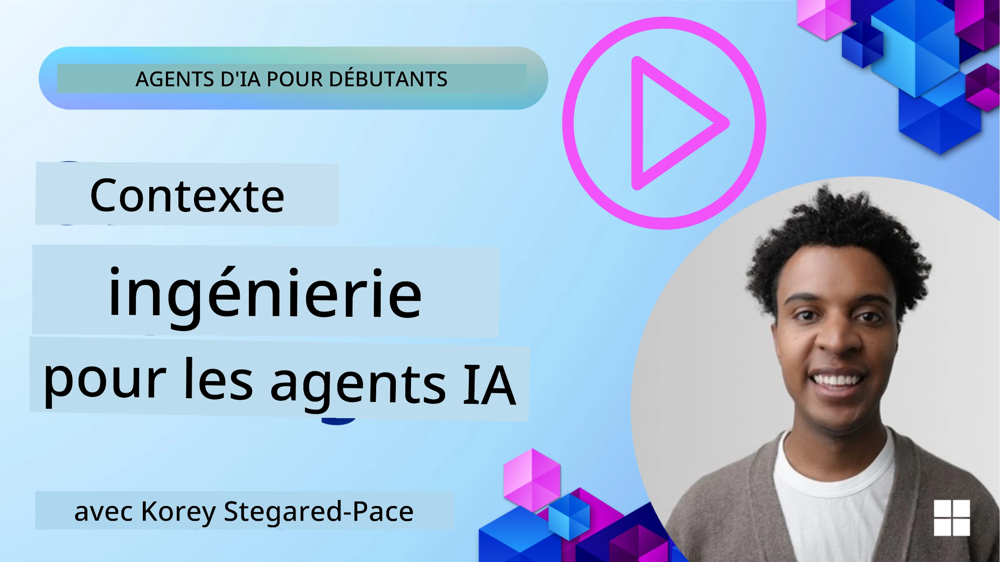
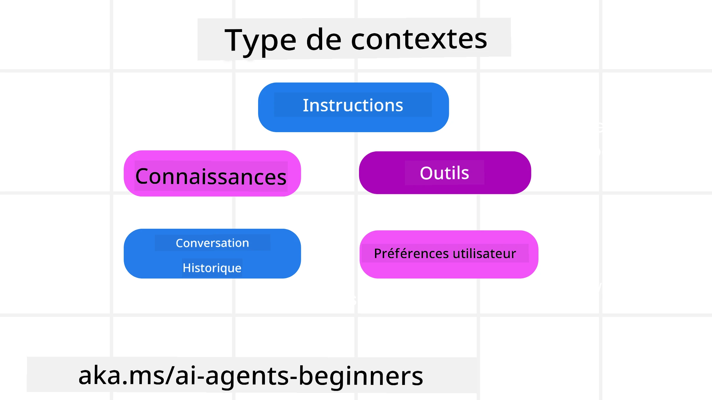
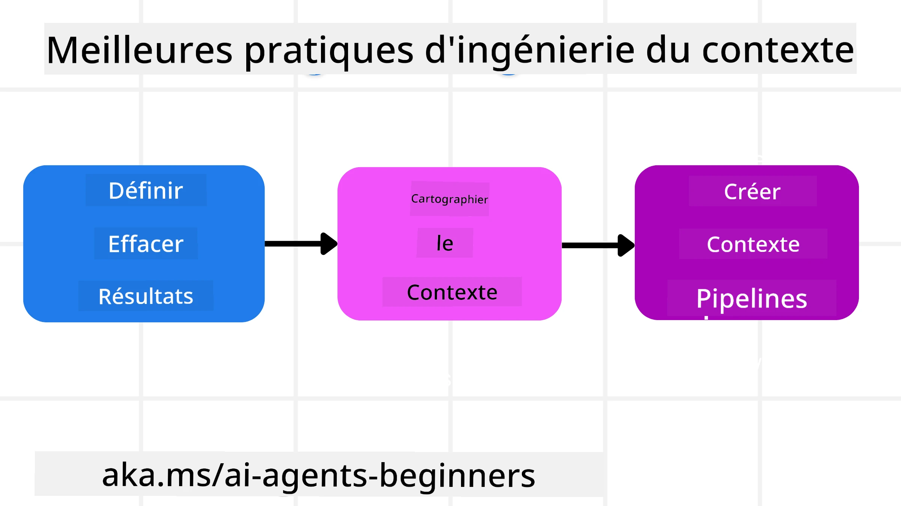

# Ingénierie du contexte pour les agents IA

> _(Cliquez sur l’image ci-dessus pour voir la vidéo de cette leçon)_

Comprendre la complexité de l’application pour laquelle vous construisez un agent IA est important pour en faire un agent fiable. Nous devons construire des agents IA qui gèrent efficacement l’information pour répondre à des besoins complexes, au-delà de l’ingénierie des prompts.

Dans cette leçon, nous allons examiner ce qu’est l’ingénierie du contexte et son rôle dans la construction des agents IA.

## Introduction

Cette leçon couvrira :

• **Ce qu’est l’ingénierie du contexte** et pourquoi elle est différente de l’ingénierie des prompts.

• **Stratégies pour une ingénierie du contexte efficace**, y compris comment écrire, sélectionner, compresser et isoler l’information.

• **Échecs courants du contexte** qui peuvent faire échouer votre agent IA et comment les corriger.

## Objectifs d’apprentissage

Après avoir terminé cette leçon, vous comprendrez comment :

• **Définir l’ingénierie du contexte** et la différencier de l’ingénierie des prompts.

• **Identifier les composants clés du contexte** dans les applications basées sur les grands modèles de langage (LLM).

• **Appliquer des stratégies pour écrire, sélectionner, compresser et isoler le contexte** afin d’améliorer les performances de l’agent.

• **Reconnaître les échecs courants du contexte** tels que l’empoisonnement, la distraction, la confusion et le conflit, et mettre en œuvre des techniques d’atténuation.

## Qu’est-ce que l’ingénierie du contexte ?

Pour les agents IA, le contexte est ce qui guide la planification d’un agent IA pour prendre certaines actions. L’ingénierie du contexte est la pratique qui consiste à s’assurer que l’agent IA dispose des bonnes informations pour accomplir l’étape suivante de la tâche. La fenêtre de contexte est de taille limitée, donc en tant que concepteurs d’agents, nous devons créer des systèmes et processus pour gérer l’ajout, la suppression et la condensation de l’information dans la fenêtre de contexte.

### Ingénierie des prompts vs ingénierie du contexte

L’ingénierie des prompts se concentre sur un ensemble statique unique d’instructions pour guider efficacement l’agent IA avec un ensemble de règles. L’ingénierie du contexte correspond à la gestion d’un ensemble dynamique d’informations, incluant le prompt initial, pour garantir que l’agent IA dispose de ce qu’il lui faut au fil du temps. L’idée principale de l’ingénierie du contexte est de rendre ce processus répétable et fiable.

### Types de contexte

Il est important de se rappeler que le contexte n’est pas une chose unique. L’information dont l’agent IA a besoin peut provenir de différentes sources et c’est à nous de nous assurer que l’agent y ait accès :

Les types de contexte que l’agent IA pourrait avoir à gérer incluent :

• **Instructions :** Ce sont comme les « règles » de l’agent – prompts, messages système, exemples few-shot (montrant à l’IA comment faire quelque chose) et descriptions des outils qu’il peut utiliser. C’est là que se rejoignent l’ingénierie des prompts et l’ingénierie du contexte.

• **Connaissances :** Cela couvre les faits, les informations récupérées de bases de données ou les souvenirs à long terme accumulés par l’agent. Cela peut inclure l’intégration d’un système Retrieval Augmented Generation (RAG) si un agent doit accéder à différentes bases de connaissances et bases de données.

• **Outils :** Ce sont les définitions de fonctions externes, APIs et serveurs MCP que l’agent peut appeler, ainsi que les retours (résultats) obtenus lors de leur utilisation.

• **Historique de conversation :** Le dialogue en cours avec un utilisateur. Avec le temps, ces conversations deviennent plus longues et complexes, ce qui prend de la place dans la fenêtre de contexte.

• **Préférences utilisateur :** Informations apprises sur les goûts ou aversions d’un utilisateur au fil du temps. Celles-ci peuvent être stockées et utilisées lors de prises de décisions importantes pour aider l’utilisateur.

## Stratégies pour une ingénierie du contexte efficace

### Stratégies de planification

Une bonne ingénierie du contexte commence par une bonne planification. Voici une approche qui vous aidera à commencer à penser à l’application du concept d’ingénierie du contexte :

1. **Définir des résultats clairs** - Les résultats des tâches assignées aux agents IA doivent être clairement définis. Répondez à la question - « À quoi ressemblera le monde une fois que l’agent IA aura terminé sa tâche ? » En d’autres termes, quel changement, quelle information ou quelle réponse l’utilisateur devrait-il avoir après avoir interagi avec l’agent IA.
2. **Cartographier le contexte** - Une fois que vous avez défini les résultats de l’agent IA, vous devez répondre à la question « Quelles informations l’agent IA doit-il avoir pour accomplir cette tâche ? ». Ainsi vous pouvez commencer à cartographier le contexte et localiser ces informations.
3. **Créer des pipelines de contexte** - Maintenant que vous savez où sont les informations, vous devez répondre à la question « Comment l’agent obtiendra-t-il ces informations ? ». Cela peut se faire de différentes manières, incluant RAG, l’utilisation des serveurs MCP et d’autres outils.

### Stratégies pratiques

La planification est importante mais dès que les informations commencent à arriver dans la fenêtre de contexte de notre agent, nous devons disposer de stratégies pratiques pour les gérer :

#### Gestion du contexte

Alors que certaines informations seront ajoutées automatiquement à la fenêtre de contexte, l’ingénierie du contexte consiste à prendre un rôle plus actif sur ces informations, ce qui peut être fait par plusieurs stratégies :

 1. **Bloc-notes de l’agent**  
 Cela permet à un agent IA de prendre des notes sur les informations pertinentes concernant les tâches en cours et les interactions utilisateur pendant une seule session. Cela devrait exister en dehors de la fenêtre de contexte, dans un fichier ou un objet d’exécution que l’agent peut récupérer plus tard pendant cette session si nécessaire.

 2. **Souvenirs**  
 Les blocs-notes sont utiles pour gérer les informations en dehors de la fenêtre de contexte d’une seule session. Les souvenirs permettent aux agents de stocker et récupérer des informations pertinentes sur plusieurs sessions. Cela peut inclure des résumés, préférences utilisateur et retours pour des améliorations futures.

 3. **Compression du contexte**  
 Une fois que la fenêtre de contexte grandit et approche sa limite, des techniques comme la synthèse et l’élagage peuvent être utilisées. Cela inclut soit garder uniquement les informations les plus pertinentes, soit supprimer les messages anciens.
  
 4. **Systèmes multi-agents**  
 Développer un système multi-agents est une forme d’ingénierie du contexte, car chaque agent a sa propre fenêtre de contexte. La manière dont ce contexte est partagé et transmis entre agents est une autre chose à planifier lors de la construction de ces systèmes.
  
 5. **Environnements sandbox**  
 Si un agent doit exécuter du code ou traiter une grande quantité d’informations dans un document, cela peut utiliser beaucoup de tokens pour traiter les résultats. Au lieu de tout stocker dans la fenêtre de contexte, l’agent peut utiliser un environnement sandbox capable d’exécuter ce code et ne lire que les résultats et autres informations pertinentes.
  
 6. **Objets d’état en runtime**  
   Cela se fait en créant des conteneurs d’informations pour gérer les situations où l’agent doit avoir accès à certaines informations. Pour une tâche complexe, cela permettrait à un agent de stocker les résultats de chaque sous-tâche étape par étape, permettant à la fenêtre de contexte de rester liée uniquement à cette sous-tâche spécifique.

#### Inspection du contexte

Après avoir appliqué une de ces stratégies, il est utile de vérifier ce que l’appel au modèle suivant a réellement reçu. Une question de débogage utile est :

> L’agent a-t-il chargé trop de contexte, le mauvais contexte, ou lui a-t-il manqué du contexte nécessaire ?

Vous n’avez pas besoin de consigner les prompts bruts, les sorties des outils ou le contenu de la mémoire pour répondre à cette question. En production, préférez de petits enregistrements d’inspection du contexte qui capturent les comptes, identifiants, hachages et étiquettes de politique :

- **Sélection :** Suivez combien de fragments candidats, outils ou souvenirs ont été considérés, combien ont été sélectionnés, et quelle règle ou score a causé le filtrage des autres.
- **Compression :** Enregistrez la plage source ou l’ID trace, l’ID résumé, un nombre estimé de tokens avant et après compression, et si le contenu brut a été exclu de l’appel suivant.
- **Isolation :** Notez quelle sous-tâche a été exécutée dans un agent, une session ou un sandbox séparé, quel résumé borné a été retourné, et si une sortie importante d’outil est restée hors du contexte de l’agent parent.
- **Mémoire et RAG :** Conservez les IDs de documents récupérés, IDs mémoire, scores, IDs sélectionnés et statut de rédaction au lieu du texte complet récupéré.
- **Sécurité et confidentialité :** Préférez les hachages, IDs, seaux de tokens et étiquettes de politique plutôt que le texte sensible des prompts, arguments d’outils, résultats d’outils ou contenus de mémoire utilisateur.

Le but n’est pas de conserver plus de contexte. C’est de laisser suffisamment de preuves pour qu’un développeur puisse identifier quelle stratégie de contexte a été utilisée et si elle a modifié l’appel au modèle suivant de la manière prévue.

### Exemple d’ingénierie du contexte

Disons que nous voulons qu’un agent IA **« Me réserve un voyage à Paris. »**

• Un agent simple utilisant uniquement l’ingénierie des prompts pourrait simplement répondre : **« D’accord, quand voulez-vous aller à Paris ?** ». Il n’a traité que votre question directe au moment où l’utilisateur l’a posée.

• Un agent utilisant les stratégies d’ingénierie du contexte abordées ferait beaucoup plus. Avant même de répondre, son système pourrait :

  ◦ **Vérifier votre calendrier** pour des dates disponibles (récupération de données en temps réel).

 ◦ **Se rappeler des préférences de voyage passées** (à partir de la mémoire à long terme), comme votre compagnie aérienne préférée, budget, ou si vous préférez les vols directs.

 ◦ **Identifier les outils disponibles** pour la réservation de vols et d’hôtels.

- Ensuite, une réponse exemple pourrait être :  « Salut [Votre Nom] ! Je vois que vous êtes libre la première semaine d’octobre. Dois-je chercher des vols directs vers Paris sur [Compagnie préférée] dans votre budget habituel de [Budget] ? ». Cette réponse plus riche, consciente du contexte, démontre la puissance de l’ingénierie du contexte.

## Échecs courants du contexte

### Empoisonnement du contexte

**Qu’est-ce que c’est :** Lorsqu’une hallucination (information fausse générée par le LLM) ou une erreur entre dans le contexte et est référencée à plusieurs reprises, faisant poursuivre à l’agent des objectifs impossibles ou développer des stratégies absurdes.

**Que faire :** Implémenter la **validation du contexte** et la **mise en quarantaine**. Valider les informations avant qu’elles soient ajoutées à la mémoire à long terme. Si un empoisonnement potentiel est détecté, commencer de nouveaux fils de contexte pour empêcher la propagation des mauvaises informations.

**Exemple de réservation de voyage :** Votre agent hallucine un **vol direct d’un petit aéroport local vers une ville internationale éloignée** qui n’offre en réalité pas de vols internationaux. Ce détail de vol inexistant est sauvegardé dans le contexte. Plus tard, lorsque vous demandez à l’agent de réserver, il continue d’essayer de trouver des billets pour cette route impossible, menant à des erreurs répétées.

**Solution :** Implémenter une étape qui **valide l’existence des vols et les itinéraires via une API en temps réel** _avant_ d’ajouter ce détail de vol au contexte de travail de l’agent. En cas d’échec de validation, l’information erronée est « mise en quarantaine » et n’est plus utilisée.

### Distraction du contexte

**Qu’est-ce que c’est :** Lorsque le contexte devient si grand que le modèle se focalise trop sur l’historique accumulé au lieu d’utiliser ce qu’il a appris lors de l’entraînement, conduisant à des actions répétitives ou inutiles. Les modèles peuvent commencer à faire des erreurs même avant que la fenêtre de contexte soit pleine.

**Que faire :** Utiliser la **synthèse du contexte**. Compresser périodiquement les informations accumulées en résumés plus courts, en conservant les détails importants tout en supprimant l’historique redondant. Cela aide à « réinitialiser » la concentration.

**Exemple de réservation de voyage :** Vous discutez longtemps de diverses destinations de rêve, incluant un compte détaillé de votre voyage de randonnée de il y a deux ans. Quand vous demandez enfin à **« trouver un vol pas cher pour le mois prochain »**, l’agent s’embourbe dans les anciens détails sans rapport et continue de poser des questions sur votre équipement de randonnée ou itinéraires passés, négligeant votre demande actuelle.

**Solution :** Après un certain nombre de tours ou quand le contexte devient trop grand, l’agent doit **résumer les parties les plus récentes et pertinentes de la conversation** – en se concentrant sur vos dates et destination actuelles – et utiliser ce résumé condensé pour le prochain appel LLM, en écartant le moins pertinent de l’historique.

### Confusion du contexte

**Qu’est-ce que c’est :** Lorsque du contexte inutile, souvent sous forme de trop nombreux outils disponibles, amène le modèle à générer de mauvaises réponses ou appeler des outils hors sujet. Les modèles plus petits sont particulièrement sensibles à cela.

**Que faire :** Implémenter la **gestion de la charge d’outils** via des techniques RAG. Stocker les descriptions d’outils dans une base de vecteurs et sélectionner _seulement_ les outils les plus pertinents pour chaque tâche spécifique. La recherche montre qu’il faut limiter la sélection à moins de 30 outils.

**Exemple de réservation de voyage :** Votre agent a accès à des dizaines d’outils : `book_flight`, `book_hotel`, `rent_car`, `find_tours`, `currency_converter`, `weather_forecast`, `restaurant_reservations`, etc. Vous demandez, **« Quel est le meilleur moyen de se déplacer à Paris ? »** À cause de la quantité d’outils, l’agent est confus et tente d’appeler `book_flight` _à l’intérieur_ de Paris, ou `rent_car` alors que vous préférez les transports en commun, parce que les descriptions des outils se chevauchent ou il ne parvient pas à discerner le meilleur.

**Solution :** Utiliser **RAG sur les descriptions d’outils**. Quand vous posez une question sur la manière de se déplacer à Paris, le système récupère dynamiquement _seulement_ les outils les plus pertinents comme `rent_car` ou `public_transport_info` en fonction de votre requête, présentant une « charge » d’outils ciblée pour le LLM.

### Conflit du contexte

**Qu’est-ce que c’est :** Lorsque des informations contradictoires existent dans le contexte, conduisant à un raisonnement incohérent ou à de mauvaises réponses finales. Cela arrive souvent quand les informations arrivent par étapes, et que des hypothèses initiales incorrectes restent dans le contexte.

**Que faire :** Utiliser le **taillage et déchargement du contexte**. Le taillage consiste à enlever les informations obsolètes ou conflictuelles à mesure que de nouveaux détails arrivent. Le déchargement donne au modèle un espace « bloc-notes » séparé pour traiter l’information sans encombrer le contexte principal.
**Exemple de réservation de voyage :** Vous dites initialement à votre agent, **« Je veux prendre l’avion en classe économique. »** Plus tard dans la conversation, vous changez d’avis et dites, **« En fait, pour ce voyage, prenons la classe affaires. »** Si les deux instructions restent dans le contexte, l’agent pourrait recevoir des résultats de recherche conflictuels ou être confus quant à la préférence à privilégier.

**Solution :** Mettez en œuvre une **taille contextuelle**. Lorsqu’une nouvelle instruction contredit une ancienne, cette dernière est supprimée ou explicitement remplacée dans le contexte. Alternativement, l’agent peut utiliser un **bloc-notes** pour concilier les préférences contradictoires avant de décider, s’assurant que seule l’instruction finale et cohérente guide ses actions.

## Vous avez d’autres questions sur l’ingénierie contextuelle ?

Rejoignez le [Microsoft Foundry Discord](https://discord.com/invite/ATgtXmAS5D) pour rencontrer d’autres apprenants, participer aux heures de bureau et obtenir des réponses à vos questions sur les agents d’IA.

---

<!-- CO-OP TRANSLATOR DISCLAIMER START -->
**Avertissement** :
Ce document a été traduit à l'aide du service de traduction automatique [Co-op Translator](https://github.com/Azure/co-op-translator). Bien que nous nous efforçions d'assurer l'exactitude, veuillez noter que les traductions automatisées peuvent contenir des erreurs ou des inexactitudes. Le document original dans sa langue native doit être considéré comme la source faisant autorité. Pour les informations critiques, il est recommandé de recourir à une traduction professionnelle réalisée par un humain. Nous ne saurions être tenus responsables des malentendus ou erreurs d'interprétation découlant de l'utilisation de cette traduction.
<!-- CO-OP TRANSLATOR DISCLAIMER END -->