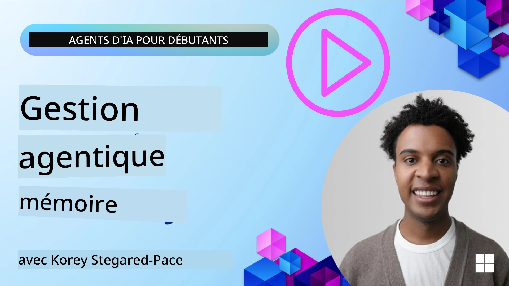

# Mémoire pour les Agents IA  

Lorsqu'on discute des avantages uniques de la création d'agents IA, deux aspects sont principalement évoqués : la capacité à utiliser des outils pour accomplir des tâches et la capacité à s'améliorer au fil du temps. La mémoire est à la base de la création d’un agent auto-améliorant capable d’offrir de meilleures expériences à nos utilisateurs.

Dans cette leçon, nous examinerons ce qu’est la mémoire pour les agents IA et comment nous pouvons la gérer et l’utiliser au bénéfice de nos applications.

## Introduction

Cette leçon couvrira :

• **Comprendre la mémoire des agents IA** : Ce qu’est la mémoire et pourquoi elle est essentielle pour les agents.

• **Implémenter et stocker la mémoire** : Méthodes pratiques pour ajouter des capacités de mémoire à vos agents IA, en se concentrant sur la mémoire à court terme et à long terme.

• **Rendre les agents IA auto-améliorants** : Comment la mémoire permet aux agents d’apprendre des interactions passées et de s’améliorer au fil du temps.

## Implémentations Disponibles

Cette leçon inclut deux tutoriels complets sous forme de notebooks :

• **[13-agent-memory.ipynb](./13-agent-memory.ipynb)** : Implémente la mémoire en utilisant Mem0 et Azure AI Search avec Microsoft Agent Framework

• **[13-agent-memory-cognee.ipynb](./13-agent-memory-cognee.ipynb)** : Implémente une mémoire structurée avec Cognee, construisant automatiquement un graphe de connaissances soutenu par des embeddings, visualisant le graphe, et offrant une récupération intelligente

## Objectifs d'Apprentissage

Après avoir complété cette leçon, vous saurez :

• **Différencier les divers types de mémoire des agents IA**, incluant la mémoire de travail, la mémoire à court terme et la mémoire à long terme, ainsi que des formes spécialisées comme la mémoire de persona et la mémoire épisodique.

• **Implémenter et gérer la mémoire à court terme et à long terme pour les agents IA** en utilisant Microsoft Agent Framework, en exploitant des outils comme Mem0, Cognee, Whiteboard memory, et en intégrant Azure AI Search.

• **Comprendre les principes derrière les agents IA auto-améliorants** et comment des systèmes robustes de gestion de mémoire contribuent à un apprentissage et une adaptation continus.

## Comprendre la Mémoire des Agents IA

Fondamentalement, **la mémoire pour les agents IA fait référence aux mécanismes qui leur permettent de retenir et de rappeler des informations**. Ces informations peuvent être des détails spécifiques sur une conversation, des préférences utilisateur, des actions passées, ou même des schémas appris.

Sans mémoire, les applications d’IA sont souvent sans état, ce qui signifie que chaque interaction repart de zéro. Cela conduit à une expérience utilisateur répétitive et frustrante où l’agent « oublie » le contexte ou les préférences précédentes.

### Pourquoi la Mémoire est-elle Importante ?

L’intelligence d’un agent est étroitement liée à sa capacité à rappeler et utiliser les informations passées. La mémoire permet aux agents d’être :

• **Réfléchis** : Apprendre des actions et résultats passés.

• **Interactifs** : Maintenir le contexte au cours d’une conversation en cours.

• **Proactifs et réactifs** : Anticiper les besoins ou répondre de manière appropriée en se basant sur des données historiques.

• **Autonomes** : Fonctionner plus indépendamment en s’appuyant sur des connaissances stockées.

L’objectif de l’implémentation de la mémoire est de rendre les agents plus **fiables et performants**.

### Types de Mémoire

#### Mémoire de Travail

Considérez cela comme une feuille de brouillon qu’un agent utilise pendant une tâche ou un processus de réflexion en cours. Elle contient l’information immédiate nécessaire pour calculer la prochaine étape.

Pour les agents IA, la mémoire de travail capture souvent l’information la plus pertinente d’une conversation, même si l’historique complet du chat est long ou tronqué. Elle se concentre sur l’extraction des éléments clés comme les exigences, propositions, décisions et actions.

**Exemple de Mémoire de Travail**

Dans un agent de réservation de voyages, la mémoire de travail pourrait capturer la demande actuelle de l’utilisateur, comme « Je veux réserver un voyage à Paris ». Cette exigence spécifique est retenue dans le contexte immédiat de l’agent pour guider l’interaction en cours.

#### Mémoire à Court Terme

Ce type de mémoire conserve l’information pendant la durée d’une seule conversation ou session. C’est le contexte du chat en cours, permettant à l’agent de se référer aux tours précédents dans le dialogue.

**Exemple de Mémoire à Court Terme**

Si un utilisateur demande, « Combien coûte un vol pour Paris ? » puis enchaîne avec « Qu’en est-il de l’hébergement là-bas ? », la mémoire à court terme garantit que l’agent sait que « là-bas » fait référence à « Paris » dans la même conversation.

#### Mémoire à Long Terme

Ce sont les informations qui persistent à travers plusieurs conversations ou sessions. Elle permet aux agents de se souvenir des préférences utilisateur, d’interactions historiques ou de connaissances générales sur de longues périodes. Ceci est important pour la personnalisation.

**Exemple de Mémoire à Long Terme**

Une mémoire à long terme pourrait stocker que « Ben aime le ski et les activités de plein air, apprécie le café avec vue sur la montagne, et souhaite éviter les pistes de ski avancées à cause d'une blessure précédente ». Cette information, apprise lors d’interactions antérieures, influence les recommandations lors des futures sessions de planification de voyages, les rendant très personnalisées.

#### Mémoire de Persona

Ce type de mémoire spécialisé aide un agent à développer une « personnalité » ou une « persona » cohérente. Elle permet à l’agent de se souvenir de détails sur lui-même ou sur son rôle prévu, rendant les interactions plus fluides et ciblées.

**Exemple de Mémoire de Persona**

Si l’agent de voyage est conçu pour être un « expert en planification de ski », la mémoire de persona peut renforcer ce rôle, influençant ses réponses pour qu’elles correspondent au ton et aux connaissances d’un expert.

#### Mémoire de Flux de Travail / Épisodique

Cette mémoire stocke la séquence des étapes qu’un agent suit lors d’une tâche complexe, y compris succès et échecs. C’est comme se souvenir de « épisodes » spécifiques ou d’expériences passées pour en tirer des enseignements.

**Exemple de Mémoire Épisodique**

Si l’agent a tenté de réserver un vol spécifique mais que cela a échoué à cause d’une indisponibilité, la mémoire épisodique pourrait enregistrer cet échec, permettant à l’agent d’essayer des vols alternatifs ou d’informer l’utilisateur de manière plus informée lors d’une tentative ultérieure.

#### Mémoire d’Entité

Cela implique d’extraire et de retenir des entités spécifiques (comme des personnes, des lieux ou des objets) et des événements issus des conversations. Cela permet à l’agent de construire une compréhension structurée des éléments clés discutés.

**Exemple de Mémoire d’Entité**

À partir d’une conversation sur un voyage passé, l’agent pourrait extraire « Paris », « Tour Eiffel », et « dîner au restaurant Le Chat Noir » comme entités. Lors d’une interaction future, l’agent pourrait se rappeler de « Le Chat Noir » et proposer d’y faire une nouvelle réservation.

#### RAG Structuré (Retrieval Augmented Generation)

Bien que RAG soit une technique plus large, le « RAG structuré » est présenté comme une technologie de mémoire puissante. Elle extrait des informations denses et structurées de diverses sources (conversations, emails, images) et les exploite pour améliorer la précision, le rappel et la rapidité des réponses. Contrairement au RAG classique qui repose uniquement sur la similarité sémantique, le RAG structuré travaille avec la structure inhérente de l’information.

**Exemple de RAG Structuré**

Au lieu de simplement faire correspondre des mots-clés, le RAG structuré pourrait analyser les détails d’un vol (destination, date, heure, compagnie aérienne) dans un email et les stocker de manière structurée. Cela permet de réaliser des requêtes précises comme « Quel vol ai-je réservé pour Paris mardi ? ».

## Implémenter et Stocker la Mémoire

L’implémentation de la mémoire pour les agents IA implique un processus systématique de **gestion de la mémoire**, qui inclut la génération, le stockage, la récupération, l’intégration, la mise à jour, et même l’oubli (ou la suppression) d’informations. La récupération est un aspect particulièrement crucial.

### Outils de Mémoire Spécialisés

#### Mem0

Une manière de stocker et gérer la mémoire des agents est d’utiliser des outils spécialisés comme Mem0. Mem0 fonctionne comme une couche de mémoire persistante, permettant aux agents de se rappeler des interactions pertinentes, de stocker les préférences utilisateurs et le contexte factuel, et d’apprendre des succès et échecs au fil du temps. L’idée est que les agents sans état deviennent des agents avec état.

Cela fonctionne via un **pipeline mémoire en deux phases : extraction et mise à jour**. D’abord, les messages ajoutés à un fil de discussion d’agent sont envoyés au service Mem0, qui utilise un Large Language Model (LLM) pour résumer l’historique de la conversation et extraire de nouvelles mémoires. Ensuite, une phase de mise à jour pilotée par LLM détermine s’il faut ajouter, modifier ou supprimer ces mémoires, en les stockant dans une base de données hybride pouvant inclure des bases vectorielles, des graphes et des bases clé-valeur. Ce système supporte également divers types de mémoire et peut intégrer une mémoire graphique pour gérer les relations entre entités.

#### Cognee

Une autre approche puissante consiste à utiliser **Cognee**, une mémoire sémantique open-source pour agents IA qui transforme données structurées et non structurées en graphes de connaissances interrogeables soutenus par des embeddings. Cognee offre une **architecture à double stockage** combinant recherche par similarité vectorielle et relations de graphe, permettant aux agents de comprendre non seulement quelles informations sont similaires, mais aussi comment les concepts sont liés entre eux.

Il excelle dans la **récupération hybride** qui mêle similarité vectorielle, structure de graphe, et raisonnement LLM - depuis la recherche brute jusqu’à la réponse aux questions en tenant compte du graphe. Le système maintient une **mémoire vivante** qui évolue et grandit tout en restant interrogeable comme un unique graphe connecté, supportant à la fois le contexte de session à court terme et la mémoire persistante à long terme.

Le tutoriel notebook Cognee ([13-agent-memory-cognee.ipynb](./13-agent-memory-cognee.ipynb)) montre la construction de cette couche de mémoire unifiée, avec des exemples pratiques d’ingestion de sources de données diverses, de visualisation du graphe de connaissances, et d’interrogations avec différentes stratégies de recherche adaptées aux besoins spécifiques des agents.

### Stocker la Mémoire avec RAG

Au-delà d’outils de mémoire spécialisés comme Mem0, vous pouvez exploiter des services de recherche robustes comme **Azure AI Search comme backend pour stocker et récupérer les mémoires**, notamment pour le RAG structuré.

Cela vous permet d’ancrer les réponses de votre agent avec vos propres données, garantissant des réponses plus pertinentes et précises. Azure AI Search peut être utilisé pour stocker les souvenirs de voyages spécifiques d’un utilisateur, des catalogues de produits, ou tout autre savoir spécifique à un domaine.

Azure AI Search supporte des capacités comme le **RAG structuré**, qui excelle à extraire et récupérer des informations denses et structurées de grands jeux de données comme les historiques de conversations, emails, ou même images. Cela offre une « précision et un rappel surhumains » comparé aux approches traditionnelles de découpage et d’embedding de texte.

## Rendre les Agents IA Auto-Améliorants

Un schéma commun pour les agents auto-améliorants consiste à introduire un **« agent de connaissance »**. Cet agent séparé observe la conversation principale entre l’utilisateur et l’agent primaire. Son rôle est de :

1. **Identifier les informations précieuses** : Déterminer si une partie de la conversation mérite d’être sauvegardée comme connaissance générale ou préférence utilisateur spécifique.

2. **Extraire et résumer** : Distinguer l’apprentissage essentiel ou la préférence de la conversation.

3. **Stocker dans une base de connaissances** : Persister cette information extraite, souvent dans une base de données vectorielle, pour qu’elle puisse être récupérée plus tard.

4. **Augmenter les requêtes futures** : Lorsque l’utilisateur initie une nouvelle requête, l’agent de connaissance récupère les informations pertinentes stockées et les ajoute au prompt utilisateur, fournissant un contexte crucial à l’agent principal (similaire au RAG).

### Optimisations pour la Mémoire

• **Gestion de la latence** : Pour éviter de ralentir les interactions utilisateur, un modèle moins coûteux et plus rapide peut être utilisé initialement pour vérifier rapidement si une information vaut la peine d’être stockée ou récupérée, n’appelant le processus d’extraction/récupération plus complexe que lorsque c’est nécessaire.

• **Maintenance de la base de connaissances** : Pour une base de connaissances en croissance, les informations moins fréquemment utilisées peuvent être déplacées en « stockage froid » pour maîtriser les coûts.

## Vous avez Plus de Questions sur la Mémoire des Agents ?

Rejoignez le [Microsoft Foundry Discord](https://aka.ms/ai-agents/discord) pour rencontrer d’autres apprenants, participer aux heures de bureau et obtenir des réponses à vos questions sur les agents IA.

---

<!-- CO-OP TRANSLATOR DISCLAIMER START -->
**Avertissement** :  
Ce document a été traduit à l’aide du service de traduction automatique [Co-op Translator](https://github.com/Azure/co-op-translator). Bien que nous nous efforcions d’assurer l’exactitude, veuillez noter que les traductions automatiques peuvent contenir des erreurs ou des inexactitudes. Le document original dans sa langue native doit être considéré comme la source faisant foi. Pour toute information critique, il est recommandé de recourir à une traduction professionnelle réalisée par un humain. Nous déclinons toute responsabilité en cas de malentendus ou de mauvaises interprétations résultant de l’utilisation de cette traduction.
<!-- CO-OP TRANSLATOR DISCLAIMER END -->