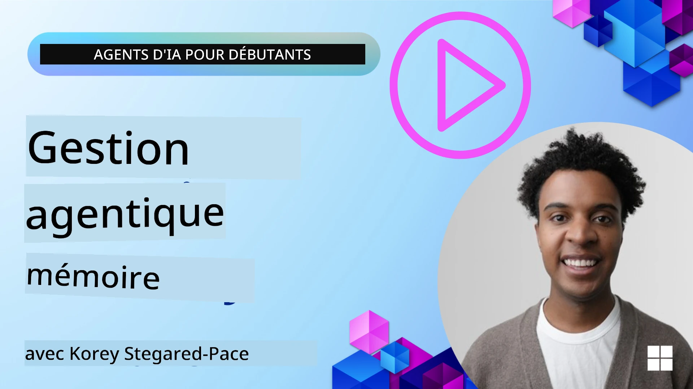

# Mémoire pour les Agents IA  

Lorsqu'on discute des avantages uniques de la création d'agents IA, deux choses sont principalement mises en avant : la capacité à utiliser des outils pour accomplir des tâches et la capacité à s'améliorer au fil du temps. La mémoire est à la base de la création d'agents auto-améliorants capables d'offrir de meilleures expériences à nos utilisateurs.

Dans cette leçon, nous allons examiner ce qu’est la mémoire pour les agents IA et comment nous pouvons la gérer et l’utiliser au bénéfice de nos applications.

## Introduction

Cette leçon couvrira :

• **Comprendre la mémoire des agents IA** : Ce qu’est la mémoire et pourquoi elle est essentielle pour les agents.

• **Implémenter et stocker la mémoire** : Méthodes pratiques pour ajouter des capacités de mémoire à vos agents IA, en se concentrant sur la mémoire à court terme et à long terme.

• **Rendre les agents IA auto-améliorants** : Comment la mémoire permet aux agents d’apprendre des interactions passées et de s’améliorer avec le temps.

## Implémentations Disponibles

Cette leçon inclut deux tutoriels complets sous forme de notebooks :

• **[13-agent-memory.ipynb](./13-agent-memory.ipynb)** : Implémente la mémoire avec Mem0 et Azure AI Search via Microsoft Agent Framework

• **[13-agent-memory-cognee.ipynb](./13-agent-memory-cognee.ipynb)** : Implémente une mémoire structurée avec Cognee, construisant automatiquement un graphe de connaissances supporté par des embeddings, visualisant le graphe, et facilitant la récupération intelligente

## Objectifs d’Apprentissage

Après avoir complété cette leçon, vous serez capable de :

• **Différencier les différents types de mémoire des agents IA**, y compris la mémoire de travail, à court terme et à long terme, ainsi que des formes spécialisées comme la mémoire de persona et épisodique.

• **Implémenter et gérer la mémoire à court terme et à long terme pour les agents IA** en utilisant Microsoft Agent Framework, en tirant parti d’outils comme Mem0, Cognee, Whiteboard memory, et en intégrant Azure AI Search.

• **Comprendre les principes derrière les agents IA auto-améliorants** et comment des systèmes robustes de gestion de mémoire contribuent à l’apprentissage et l’adaptation continus.

## Comprendre la Mémoire des Agents IA

Au cœur du sujet, **la mémoire pour les agents IA désigne les mécanismes qui leur permettent de retenir et de rappeler des informations**. Ces informations peuvent être des détails spécifiques d’une conversation, des préférences utilisateur, des actions passées, voire des schémas appris.

Sans mémoire, les applications IA sont souvent sans état (stateless), ce qui signifie que chaque interaction commence à zéro. Cela conduit à une expérience utilisateur répétitive et frustrante où l’agent "oublie" le contexte ou les préférences précédentes.

### Pourquoi la Mémoire est-elle Importante ?

L’intelligence d’un agent est étroitement liée à sa capacité à se souvenir et à utiliser des informations passées. La mémoire permet aux agents d’être :

• **Réfléchis** : Apprendre des actions et résultats passés.

• **Interactifs** : Maintenir le contexte pendant une conversation en cours.

• **Proactifs et Réactifs** : Anticiper les besoins ou répondre adéquatement en fonction des données historiques.

• **Autonomes** : Fonctionner plus indépendamment en s’appuyant sur des connaissances stockées.

Le but de l’implémentation de la mémoire est de rendre les agents plus **fiables et compétents**.

### Types de Mémoire

#### Mémoire de Travail

Pensez à cela comme un brouillon qu’un agent utilise pendant une tâche ou un processus de réflexion en cours. Elle contient l’information immédiate nécessaire pour calculer l’étape suivante.

Pour les agents IA, la mémoire de travail capture souvent les informations les plus pertinentes d’une conversation, même si l’historique complet est long ou tronqué. Elle se concentre sur l’extraction d’éléments clés comme exigences, propositions, décisions et actions.

**Exemple de Mémoire de Travail**

Dans un agent de réservation de voyage, la mémoire de travail pourrait capturer la demande actuelle de l’utilisateur, comme "Je veux réserver un voyage à Paris". Cette exigence spécifique est retenue dans le contexte immédiat de l’agent pour guider l’interaction en cours.

#### Mémoire à Court Terme

Ce type de mémoire conserve l’information pendant la durée d’une seule conversation ou session. C’est le contexte du chat actuel, permettant à l’agent de se référer aux tours précédents du dialogue.

Dans les exemples du SDK Python de [Microsoft Agent Framework](https://github.com/microsoft/agent-framework), cela correspond à `AgentSession`, créé avec `agent.create_session()`. La session est la mémoire à court terme intégrée au framework : elle garde le contexte disponible tant que la même session est réutilisée, mais ce contexte n’est pas conservé quand la session se termine ou que l’application redémarre. Utilisez la mémoire à long terme pour les faits et préférences devant persister entre les sessions, typiquement via une base de données, un index vectoriel, ou un autre stockage persistant.

**Exemple de Mémoire à Court Terme**

Si un utilisateur demande "Combien coûte un vol pour Paris ?" puis enchaîne avec "Et pour l’hébergement là-bas ?", la mémoire à court terme assure que l’agent sait que "là-bas" fait référence à "Paris" dans la même conversation.

#### Mémoire à Long Terme

C’est l’information qui persiste à travers plusieurs conversations ou sessions. Elle permet aux agents de se souvenir des préférences utilisateur, interactions historiques ou connaissances générales sur le long terme. Ceci est important pour la personnalisation.

**Exemple de Mémoire à Long Terme**

Une mémoire à long terme pourrait enregistrer que "Ben aime le ski et les activités en plein air, apprécie le café avec vue sur la montagne, et veut éviter les pistes de ski avancées à cause d’une blessure passée". Cette information, apprise lors d’interactions précédentes, influence les recommandations lors de futures sessions de planification de voyage, les rendant hautement personnalisées.

#### Mémoire de Persona

Ce type de mémoire spécialisé aide un agent à développer une "personnalité" ou un "persona" cohérent. Il permet à l’agent de se souvenir de détails sur lui-même ou son rôle prévu, rendant les interactions plus fluides et ciblées.

**Exemple de Mémoire de Persona**

Si l’agent de voyage est conçu pour être un "expert en planification de ski," la mémoire de persona peut renforcer ce rôle, influençant ses réponses pour qu’elles correspondent au ton et aux connaissances d’un expert.

#### Mémoire de Workflow/Épisodique

Cette mémoire stocke la séquence des étapes qu’un agent suit durant une tâche complexe, incluant succès et échecs. C’est comme se rappeler des "épisodes" ou expériences passées pour en tirer des leçons.

**Exemple de Mémoire Épisodique**

Si l’agent a tenté de réserver un vol spécifique mais a échoué à cause d’une indisponibilité, la mémoire épisodique pourrait enregistrer cet échec, permettant à l’agent de proposer des alternatives ou d’informer l’utilisateur de manière plus avisée lors d’une tentative ultérieure.

#### Mémoire d’Entité

Cela consiste à extraire et retenir des entités spécifiques (personnes, lieux, choses) et des événements des conversations. Cela permet à l’agent de construire une compréhension structurée des éléments clés discutés.

**Exemple de Mémoire d’Entité**

À partir d’une conversation sur un voyage passé, l’agent pourrait extraire "Paris", "Tour Eiffel" et "dîner au restaurant Le Chat Noir" en tant qu’entités. Lors d’une interaction future, l’agent pourrait se souvenir de "Le Chat Noir" et proposer de faire une nouvelle réservation.

#### RAG Structuré (Retrieval Augmented Generation)

Alors que RAG est une technique plus large, le "RAG Structuré" est mis en avant comme une technologie de mémoire puissante. Il extrait des informations denses et structurées de différentes sources (conversations, e-mails, images) et les utilise pour améliorer la précision, le rappel et la rapidité des réponses. Contrairement au RAG classique qui se base uniquement sur la similarité sémantique, le RAG Structuré exploite la structure inhérente de l’information.

**Exemple de RAG Structuré**

Plutôt que de faire correspondre simplement des mots-clés, le RAG Structuré pourrait analyser les détails d’un vol (destination, date, heure, compagnie aérienne) depuis un e-mail et les stocker de manière structurée. Cela permet des requêtes précises comme : "Quel vol ai-je réservé pour Paris mardi ?"

## Implémenter et Stocker la Mémoire

Implémenter la mémoire pour les agents IA implique un processus systématique de **gestion de la mémoire**, qui comprend la génération, le stockage, la récupération, l’intégration, la mise à jour et même l’"oubli" (ou suppression) des informations. La récupération est un aspect particulièrement crucial.

### Outils Spécialisés pour la Mémoire

#### Mem0

Une manière de stocker et gérer la mémoire des agents est d’utiliser des outils spécialisés comme Mem0. Mem0 fonctionne comme une couche de mémoire persistante, permettant aux agents de rappeler des interactions pertinentes, stocker des préférences utilisateur et un contexte factuel, et apprendre des succès et échecs au fil du temps. L’idée est ici que les agents sans état deviennent des agents avec état.

Le système fonctionne selon un **pipeline mémoire en deux phases : extraction et mise à jour**. D’abord, les messages ajoutés au fil de conversation d’un agent sont envoyés au service Mem0, qui utilise un grand modèle de langage (LLM) pour résumer l’historique de conversation et extraire de nouvelles mémoires. Ensuite, une phase de mise à jour pilotée par LLM détermine s’il faut ajouter, modifier ou supprimer ces mémoires, qui sont stockées dans un système hybride pouvant inclure des bases de données vectorielles, graphiques et clé-valeur. Ce système supporte aussi plusieurs types de mémoire et peut intégrer une mémoire graphique pour gérer les relations entre entités.

#### Cognee

Une autre approche puissante est l’utilisation de **Cognee**, une mémoire sémantique open-source pour agents IA qui transforme des données structurées et non structurées en graphes de connaissances interrogeables supportés par des embeddings. Cognee propose une **architecture à double stockage** combinant recherche de similarité vectorielle et relations graphiques, permettant aux agents de comprendre non seulement quelles informations sont similaires mais aussi comment les concepts sont liés.

Il excelle dans la **récupération hybride** qui mélange similarité vectorielle, structure graphique et raisonnement LLM – de la recherche brute de fragments à la réponse aux questions avec compréhension du graphe. Le système maintient une **mémoire vivante** qui évolue et grandit tout en restant interrogeable comme un graphe connecté, supportant aussi bien le contexte de session à court terme que la mémoire persistante à long terme.

Le tutoriel notebook Cognee ([13-agent-memory-cognee.ipynb](./13-agent-memory-cognee.ipynb)) montre comment construire cette couche mémoire unifiée, avec des exemples pratiques d’ingestion de sources de données variées, de visualisation du graphe de connaissances, et d’interrogation avec différentes stratégies adaptées aux besoins spécifiques des agents.

### Stocker la Mémoire avec RAG

Au-delà des outils spécialisés comme Mem0, vous pouvez exploiter des services de recherche robustes comme **Azure AI Search comme backend pour stocker et récupérer la mémoire**, notamment pour le RAG structuré.

Cela vous permet d’ancrer les réponses de votre agent dans vos propres données, garantissant des réponses plus pertinentes et précises. Azure AI Search peut être utilisé pour stocker des mémoires de voyage spécifiques à un utilisateur, des catalogues de produits, ou toute autre connaissance métier.

Azure AI Search supporte des capacités comme le **RAG Structuré**, qui excelle à extraire et récupérer des informations denses et structurées depuis de grands ensembles de données comme des historiques de conversation, des e-mails ou même des images. Cela offre une "précision et un rappel surhumains" comparé aux approches classiques de découpage de texte et d’embeddings.

## Rendre les Agents IA Auto-Améliorants

Un schéma courant pour les agents auto-améliorants consiste à introduire un **« agent de connaissance »**. Cet agent séparé observe la conversation principale entre l’utilisateur et l’agent principal. Son rôle est de :

1. **Identifier les informations précieuses** : Détecter si une partie de la conversation mérite d’être sauvegardée comme connaissance générale ou préférence utilisateur spécifique.

2. **Extraire et résumer** : Dégager l’apprentissage essentiel ou la préférence depuis la conversation.

3. **Stocker dans une base de connaissances** : Persister cette information extraite, souvent dans une base de données vectorielle, pour une récupération ultérieure.

4. **Augmenter les futures requêtes** : Quand l’utilisateur initie une nouvelle requête, l’agent de connaissance récupère les informations pertinentes stockées et les ajoute à l’invite de l’utilisateur, fournissant un contexte crucial à l’agent principal (similaire au RAG).

### Optimisations pour la Mémoire

• **Gestion de la Latence** : Pour éviter de ralentir les interactions utilisateur, un modèle plus simple et rapide peut être utilisé initialement pour vérifier rapidement si une information mérite d’être stockée ou récupérée, en ne faisant appel au processus plus complexe que lorsque c’est nécessaire.

• **Maintenance de la Base de Connaissances** : Pour une base de connaissances en croissance, les informations moins utilisées peuvent être déplacées en "stockage froid" pour gérer les coûts.

## Vous Avez Plus de Questions sur la Mémoire des Agents ?

Rejoignez le [Microsoft Foundry Discord](https://discord.com/invite/ATgtXmAS5D) pour rencontrer d’autres apprenants, assister aux heures de bureau et obtenir des réponses à vos questions sur les Agents IA.

---

<!-- CO-OP TRANSLATOR DISCLAIMER START -->
**Avertissement** :
Ce document a été traduit à l'aide du service de traduction automatique [Co-op Translator](https://github.com/Azure/co-op-translator). Bien que nous nous efforçions d'assurer l'exactitude, veuillez noter que les traductions automatisées peuvent contenir des erreurs ou des inexactitudes. Le document original dans sa langue native doit être considéré comme la source faisant autorité. Pour les informations critiques, il est recommandé de recourir à une traduction professionnelle réalisée par un humain. Nous ne saurions être tenus responsables des malentendus ou erreurs d'interprétation découlant de l'utilisation de cette traduction.
<!-- CO-OP TRANSLATOR DISCLAIMER END -->