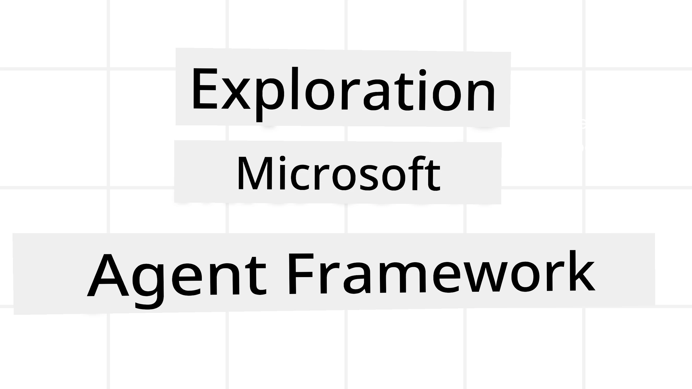
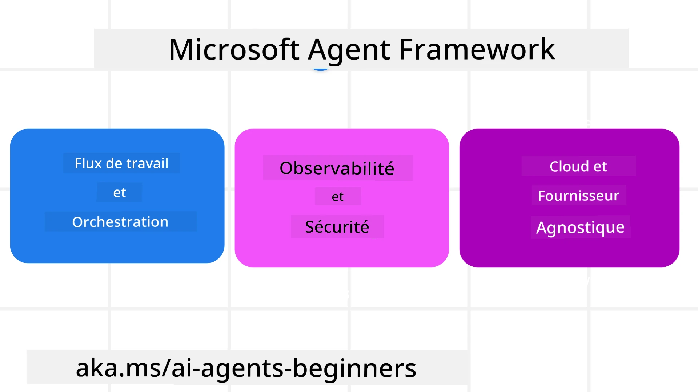
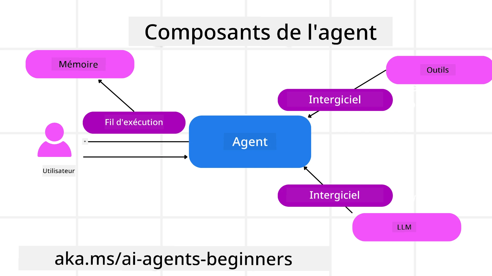

# Exploration du Microsoft Agent Framework



### Introduction

Cette leçon couvrira :

- Comprendre Microsoft Agent Framework : principales fonctionnalités et valeur  
- Exploration des concepts clés de Microsoft Agent Framework
- Modèles avancés de MAF : flux de travail, middleware et mémoire

## Objectifs d'apprentissage

Après avoir complété cette leçon, vous saurez comment :

- Construire des agents IA prêts pour la production en utilisant Microsoft Agent Framework
- Appliquer les fonctionnalités principales de Microsoft Agent Framework à vos cas d'usage agentic
- Utiliser des modèles avancés incluant des workflows, middleware et observabilité

## Exemples de code 

Des exemples de code pour [Microsoft Agent Framework (MAF)](https://learn.microsoft.com/en-us/agent-framework/overview/?wt.mc_id=youtube_26688_organicsocial_reactor&pivots=programming-language-python) sont disponibles dans ce dépôt sous les fichiers `xx-python-agent-framework` et `xx-dotnet-agent-framework`.

## Comprendre Microsoft Agent Framework



[Microsoft Agent Framework (MAF)](https://learn.microsoft.com/en-us/agent-framework/overview/?wt.mc_id=youtube_26688_organicsocial_reactor&pivots=programming-language-python) est le framework unifié de Microsoft pour construire des agents IA. Il offre la flexibilité nécessaire pour répondre à une grande variété de cas d'usage agentic observés à la fois en production et en recherche, dont :

- **Orchestration séquentielle d'agents** dans les scénarios nécessitant des flux de travail étape par étape.
- **Orchestration concurrente** dans les scénarios où les agents doivent accomplir des tâches simultanément.
- **Orchestration de chat de groupe** dans les scénarios où les agents peuvent collaborer ensemble sur une même tâche.
- **Orchestration de transfert** dans les scénarios où les agents se transmettent la tâche à mesure que les sous-tâches sont complétées.
- **Orchestration magnétique** dans les scénarios où un agent manager crée, modifie une liste de tâches et coordonne les sous-agents pour compléter la tâche.

Pour livrer des agents IA en production, MAF inclut également des fonctionnalités pour :

- **Observabilité** via OpenTelemetry, où chaque action de l'agent IA incluant l'invocation d'outils, étapes d'orchestration, flux de raisonnement et monitoring des performances via les tableaux de bord Microsoft Foundry.
- **Sécurité** en hébergeant les agents nativement sur Microsoft Foundry, qui inclut des contrôles de sécurité tels que l'accès basé sur les rôles, la gestion des données privées et la sécurité intégrée des contenus.
- **Durabilité** car les threads et workflows d'agents peuvent se mettre en pause, reprendre et récupérer d'erreurs permettant des processus de longue durée.
- **Contrôle** car les workflows avec intervention humaine sont supportés, où des tâches nécessitent une validation humaine.

Microsoft Agent Framework se concentre également sur l'interopérabilité en :

- **Être agnostique du Cloud** – Les agents peuvent s'exécuter dans des conteneurs, sur site et à travers plusieurs clouds différents.
- **Être agnostique des fournisseurs** – Les agents peuvent être créés via votre SDK préféré incluant Azure OpenAI et OpenAI.
- **Intégrer les standards ouverts** – Les agents peuvent utiliser des protocoles tels que Agent-to-Agent (A2A) et Model Context Protocol (MCP) pour découvrir et utiliser d'autres agents et outils.
- **Plugins et Connecteurs** – Des connexions peuvent être établies vers des services de données et de mémoire comme Microsoft Fabric, SharePoint, Pinecone et Qdrant.

Regardons comment ces fonctionnalités sont appliquées à certains concepts clés de Microsoft Agent Framework.

## Concepts clés de Microsoft Agent Framework

### Agents



**Création des agents**

La création d'un agent se fait en définissant le service d'inférence (fournisseur LLM), un
ensemble d'instructions que l'agent IA doit suivre, et un `name` assigné :

```python
agent = AzureOpenAIChatClient(credential=AzureCliCredential()).create_agent( instructions="You are good at recommending trips to customers based on their preferences.", name="TripRecommender" )
```

L'exemple ci-dessus utilise `Azure OpenAI` mais les agents peuvent être créés via divers services dont `Microsoft Foundry Agent Service` :

```python
AzureAIAgentClient(async_credential=credential).create_agent( name="HelperAgent", instructions="You are a helpful assistant." ) as agent
```

APIs OpenAI `Responses` et `ChatCompletion`

```python
agent = OpenAIResponsesClient().create_agent( name="WeatherBot", instructions="You are a helpful weather assistant.", )
```

```python
agent = OpenAIChatClient().create_agent( name="HelpfulAssistant", instructions="You are a helpful assistant.", )
```

ou [MiniMax](https://platform.minimaxi.com/), qui fournit une API compatible OpenAI avec des fenêtres contextuelles larges (jusqu'à 204K tokens) :

```python
agent = OpenAIChatClient(base_url="https://api.minimax.io/v1", api_key=os.environ["MINIMAX_API_KEY"], model_id="MiniMax-M3").create_agent( name="HelpfulAssistant", instructions="You are a helpful assistant.", )
```

ou des agents distants utilisant le protocole A2A :

```python
agent = A2AAgent( name=agent_card.name, description=agent_card.description, agent_card=agent_card, url="https://your-a2a-agent-host" )
```

**Exécution des agents**

Les agents sont exécutés via les méthodes `.run` ou `.run_stream` pour des réponses non-streaming ou streaming.

```python
result = await agent.run("What are good places to visit in Amsterdam?")
print(result.text)
```

```python
async for update in agent.run_stream("What are the good places to visit in Amsterdam?"):
    if update.text:
        print(update.text, end="", flush=True)

```

Chaque exécution d'agent peut aussi être paramétrée pour personnaliser les options telles que `max_tokens` utilisé par l'agent, les `tools` que l'agent peut appeler, et même le `model` utilisé pour l'agent.

Ceci est utile quand des modèles ou outils spécifiques sont nécessaires pour compléter une tâche utilisateur.

**Outils**

Les outils peuvent être définis à la fois lors de la définition de l'agent :

```python
def get_attractions( location: Annotated[str, Field(description="The location to get the top tourist attractions for")], ) -> str: """Get the top tourist attractions for a given location.""" return f"The top attractions for {location} are." 


# Lors de la création directe d'un ChatAgent

agent = ChatAgent( chat_client=OpenAIChatClient(), instructions="You are a helpful assistant", tools=[get_attractions]

```

et aussi lors de l'exécution de l'agent :

```python

result1 = await agent.run( "What's the best place to visit in Seattle?", tools=[get_attractions] # Outil fourni uniquement pour cette exécution )
```

**Threads d'agents**

Les threads d'agents sont utilisés pour gérer les conversations multi-tours. Les threads peuvent être créés soit par :

- Utilisation de `get_new_thread()` qui permet de sauvegarder le thread dans le temps
- Création automatique d'un thread lors de l'exécution d'un agent, le thread ne durant que pendant cette exécution.

Pour créer un thread, voici le code :

```python
# Créez un nouveau fil.
thread = agent.get_new_thread() # Exécutez l'agent avec le fil.
response = await agent.run("Hello, I am here to help you book travel. Where would you like to go?", thread=thread)

```

Vous pouvez alors sérialiser le thread pour le stocker pour une utilisation ultérieure :

```python
# Créer un nouveau fil.
thread = agent.get_new_thread() 

# Exécuter l'agent avec le fil.

response = await agent.run("Hello, how are you?", thread=thread) 

# Sérialiser le fil pour le stockage.

serialized_thread = await thread.serialize() 

# Désérialiser l'état du fil après chargement du stockage.

resumed_thread = await agent.deserialize_thread(serialized_thread)
```

**Middleware d'agent**

Les agents interagissent avec des outils et LLM pour accomplir les tâches des utilisateurs. Dans certains scénarios, on souhaite exécuter ou suivre ces interactions intermédiaires. Le middleware d'agent permet cela via :

*Middleware de fonction*

Ce middleware permet d'exécuter une action entre l'agent et une fonction/outil qu'il va appeler. Un exemple d'utilisation est lorsqu'on souhaite faire du logging sur l'appel de fonction.

Dans le code ci-dessous, `next` définit si le middleware suivant ou la fonction réelle doivent être appelés.

```python
async def logging_function_middleware(
    context: FunctionInvocationContext,
    next: Callable[[FunctionInvocationContext], Awaitable[None]],
) -> None:
    """Function middleware that logs function execution."""
    # Pré-traitement : Journal avant l'exécution de la fonction
    print(f"[Function] Calling {context.function.name}")

    # Continuer vers le middleware suivant ou l'exécution de la fonction
    await next(context)

    # Post-traitement : Journal après l'exécution de la fonction
    print(f"[Function] {context.function.name} completed")
```

*Middleware de chat*

Ce middleware permet d'exécuter ou de journaliser une action entre l'agent et les requêtes entre le LLM.

Cela contient des informations importantes telles que les `messages` envoyés au service IA.

```python
async def logging_chat_middleware(
    context: ChatContext,
    next: Callable[[ChatContext], Awaitable[None]],
) -> None:
    """Chat middleware that logs AI interactions."""
    # Pré-traitement : Journaliser avant l'appel à l'IA
    print(f"[Chat] Sending {len(context.messages)} messages to AI")

    # Continuer vers le middleware ou service IA suivant
    await next(context)

    # Post-traitement : Journaliser après la réponse de l'IA
    print("[Chat] AI response received")

```

**Mémoire d'agent**

Comme abordé dans la leçon `Agentic Memory`, la mémoire est un élément important pour permettre à l'agent d'opérer sur différents contextes. MAF offre plusieurs types de mémoire :

*Stockage en mémoire*

C’est la mémoire stockée dans les threads durant l'exécution de l'application.

```python
# Créer un nouveau thread.
thread = agent.get_new_thread() # Exécuter l'agent avec le thread.
response = await agent.run("Hello, I am here to help you book travel. Where would you like to go?", thread=thread)
```

*Messages persistants*

Cette mémoire est utilisée pour stocker l'historique de conversation à travers différentes sessions. Elle est définie via `chat_message_store_factory` :

```python
from agent_framework import ChatMessageStore

# Créer un magasin de messages personnalisé
def create_message_store():
    return ChatMessageStore()

agent = ChatAgent(
    chat_client=OpenAIChatClient(),
    instructions="You are a Travel assistant.",
    chat_message_store_factory=create_message_store
)

```

*Mémoire dynamique*

Cette mémoire est ajoutée au contexte avant l'exécution des agents. Ces mémoires peuvent être stockées dans des services externes tels que mem0 :

```python
from agent_framework.mem0 import Mem0Provider

# Utilisation de Mem0 pour des capacités mémoire avancées
memory_provider = Mem0Provider(
    api_key="your-mem0-api-key",
    user_id="user_123",
    application_id="my_app"
)

agent = ChatAgent(
    chat_client=OpenAIChatClient(),
    instructions="You are a helpful assistant with memory.",
    context_providers=memory_provider
)

```

**Observabilité d'agent**

L'observabilité est importante pour construire des systèmes agentic fiables et maintenables. MAF s'intègre avec OpenTelemetry pour fournir des traces et des métriques pour une meilleure observabilité.

```python
from agent_framework.observability import get_tracer, get_meter

tracer = get_tracer()
meter = get_meter()
with tracer.start_as_current_span("my_custom_span"):
    # faire quelque chose
    pass
counter = meter.create_counter("my_custom_counter")
counter.add(1, {"key": "value"})
```

### Workflows

MAF offre des workflows qui sont des étapes prédéfinies pour compléter une tâche et incluent des agents IA comme composants de ces étapes.

Les workflows sont composés de différents composants qui permettent un meilleur contrôle de flux. Ils permettent aussi l'**orchestration multi-agent** et le **checkpointing** pour sauvegarder l'état du workflow.

Les composants principaux d'un workflow sont :

**Exécuteurs**

Les exécuteurs reçoivent des messages d'entrée, réalisent leurs tâches assignées, puis produisent un message de sortie. Cela fait avancer le workflow vers la complétion de la tâche générale. Les exécuteurs peuvent être des agents IA ou une logique personnalisée.

**Arêtes**

Les arêtes sont utilisées pour définir le flux des messages dans un workflow. Elles peuvent être :

*Arêtes directes* – Connexions simples un-à-un entre exécuteurs :

```python
from agent_framework import WorkflowBuilder

builder = WorkflowBuilder()
builder.add_edge(source_executor, target_executor)
builder.set_start_executor(source_executor)
workflow = builder.build()
```

*Arêtes conditionnelles* – Activées après qu'une certaine condition est remplie. Par exemple, quand les chambres d'hôtels sont indisponibles, un exécuteur peut suggérer d'autres options.

*Arêtes de type switch-case* – Dirigent les messages vers différents exécuteurs selon des conditions définies. Par exemple, si un client voyage a un accès prioritaire, ses tâches seront traitées dans un autre workflow.

*Arêtes de dispersion* – Envoient un message à plusieurs cibles.

*Arêtes de regroupement* – Collectent plusieurs messages de différents exécuteurs et les envoient à une cible unique.

**Événements**

Pour offrir une meilleure observabilité des workflows, MAF propose des événements d'exécution intégrés comprenant :

- `WorkflowStartedEvent` – Début de l'exécution du workflow
- `WorkflowOutputEvent` – Le workflow produit une sortie
- `WorkflowErrorEvent` – Le workflow rencontre une erreur
- `ExecutorInvokeEvent` – L'exécuteur commence son traitement
- `ExecutorCompleteEvent` – L'exécuteur termine son traitement
- `RequestInfoEvent` – Une requête est émise

## Modèles avancés de MAF

Les sections précédentes couvrent les concepts clés de Microsoft Agent Framework. Pendant que vous créez des agents plus complexes, voici quelques modèles avancés à considérer :

- **Composition de Middleware** : Chaînez plusieurs gestionnaires middleware (journalisation, authentification, limitation de débit) via middleware fonctionnel et chat pour un contrôle fin du comportement de l'agent.
- **Checkpointing de Workflow** : Utilisez les événements de workflow et la sérialisation pour sauvegarder et reprendre des processus d'agents longs.
- **Sélection dynamique d'outils** : Combinez RAG sur les descriptions d'outils avec l'enregistrement des outils MAF pour ne présenter que les outils pertinents par requête.
- **Transfert multi-agent** : Utilisez des arêtes de workflow et le routage conditionnel pour orchestrer les transferts entre agents spécialisés.

## Hébergement des agents LangChain / LangGraph sur Microsoft Foundry

Microsoft Agent Framework est **interopérable entre frameworks** — vous n'êtes pas limité aux agents écrits avec MAF. Si vous avez déjà un agent construit avec **LangChain** ou **LangGraph**, vous pouvez l'exécuter comme un **agent hébergé Microsoft Foundry** pour que Foundry gère le runtime, les sessions, la scalabilité, l'identité et les points d'accès protocolaire, tandis que votre logique d'agent reste dans LangGraph.

Ceci se fait avec le paquet `langchain_azure_ai.agents.hosting`, qui expose un graphe LangGraph compilé via les mêmes protocoles que les agents hébergés Foundry utilisent.

**1. Installez l'extra d'hébergement :**

```bash
pip install -U "langchain-azure-ai[hosting]>=1.2.4" azure-identity
```

L'extra `hosting` installe les librairies de protocole Foundry : `azure-ai-agentserver-responses` (le point d'accès `/responses` compatible OpenAI) et `azure-ai-agentserver-invocations` (le point d'accès générique `/invocations`).

**2. Choisissez un protocole d'hébergement :**

| Protocole | Classe hôte | Point d'accès | Utiliser quand |
|----------|-------------|---------------|-------------|
| **Responses** | `ResponsesHostServer` | `/responses` | Vous souhaitez un chat compatible OpenAI, streaming, historique des réponses et threading de conversation — recommandé par défaut pour les agents conversationnels. |
| **Invocations** | `InvocationsHostServer` | `/invocations` | Vous avez besoin d'un format JSON personnalisé, un point d'accès de type webhook, ou un traitement non conversationnel. |

Parce que **l'API Responses est l'API principale pour le développement des agents dans Foundry**, commencez avec `ResponsesHostServer` pour la plupart des agents.

**3. Configurez les variables d'environnement** (`az login` d'abord pour que `DefaultAzureCredential` puisse s'authentifier) :

```bash
export FOUNDRY_PROJECT_ENDPOINT="https://<resource>.services.ai.azure.com/api/projects/<project>"
export FOUNDRY_MODEL_NAME="gpt-5-mini"
```

Lorsque l'agent s'exécutera ensuite comme agent hébergé dans Foundry, la plateforme injectera automatiquement `FOUNDRY_PROJECT_ENDPOINT`.

**4. Exposez un agent LangGraph via le protocole Responses :**

```python
import os

from azure.ai.projects import AIProjectClient
from azure.identity import DefaultAzureCredential, get_bearer_token_provider
from langchain.agents import create_agent
from langchain_openai import ChatOpenAI
from langchain_azure_ai.agents.hosting import ResponsesHostServer

_AZURE_AI_SCOPE = "https://ai.azure.com/.default"


def build_chat_model() -> ChatOpenAI:
    project_endpoint = os.environ["FOUNDRY_PROJECT_ENDPOINT"].rstrip("/")
    deployment = os.environ.get("FOUNDRY_MODEL_NAME", "gpt-5-mini")
    credential = DefaultAzureCredential()
    project = AIProjectClient(endpoint=project_endpoint, credential=credential)
    openai_client = project.get_openai_client()
    token_provider = get_bearer_token_provider(credential, _AZURE_AI_SCOPE)

    # ChatOpenAI ici cible le point de terminaison (Responses) compatible OpenAI du projet Foundry.
    return ChatOpenAI(
        model=deployment,
        base_url=str(openai_client.base_url),
        api_key=token_provider,
    )


def main() -> None:
    graph = create_agent(build_chat_model(), tools=[])
    port = int(os.environ.get("PORT", "8088"))
    ResponsesHostServer(graph).run(port=port)


if __name__ == "__main__":
    main()
```

Exécutez-le localement avec `python main.py`, puis envoyez une requête Responses à `http://localhost:8088/responses`.

**Comportements clés :**

- **Conversations** : Les clients poursuivent une conversation en passant `previous_response_id` ou un ID `conversation`. Si votre graphe est compilé avec un LangGraph checkpointer, Foundry associe l'état de conversation au checkpoint (utilisez un checkpoint durable en production ; `MemorySaver` est adapté pour les tests locaux).
- **Intervention humaine** : Si votre graphe utilise `interrupt()` de LangGraph, `ResponsesHostServer` affiche l'interruption en attente comme un élément Response `function_call` / `mcp_approval_request`, et les clients reprennent avec un `function_call_output` / `mcp_approval_response` correspondant.
- **Déploiement sur Foundry** : Utilisez Azure Developer CLI — `azd ext install azure.ai.agents`, `azd ai agent init -m <manifest>`, `azd ai agent run` (local, besoin Docker), ensuite `azd provision` et `azd deploy`. Le déploiement d'agent hébergé nécessite le rôle **Foundry Project Manager**.

Une version exécutable de cet exemple se trouve dans [code-samples/14-langchain-hosted-agent.py](../../../14-microsoft-agent-framework/code-samples/14-langchain-hosted-agent.py). Pour le guide complet (protocole Invocations, schémas de requêtes personnalisés, dépannage), voir [Host LangGraph agents as Foundry hosted agents](https://learn.microsoft.com/azure/foundry/how-to/develop/langchain-hosted-agents).

## Exemples de code 

Des exemples de code pour Microsoft Agent Framework sont disponibles dans ce dépôt sous les fichiers `xx-python-agent-framework` et `xx-dotnet-agent-framework`.

## Vous avez d'autres questions sur Microsoft Agent Framework ?

Rejoignez le [Microsoft Foundry Discord](https://discord.com/invite/ATgtXmAS5D) pour rencontrer d'autres apprenants, assister aux heures de bureau et obtenir des réponses à vos questions sur les agents IA.
## Leçon précédente

[Mémoire pour agents IA](../13-agent-memory/README.md)

## Leçon suivante

[Construction d’agents d’utilisation informatique (CUA)](../15-browser-use/README.md)

---

<!-- CO-OP TRANSLATOR DISCLAIMER START -->
**Avertissement** :
Ce document a été traduit à l'aide du service de traduction automatique [Co-op Translator](https://github.com/Azure/co-op-translator). Bien que nous nous efforçions d'assurer l'exactitude, veuillez noter que les traductions automatisées peuvent contenir des erreurs ou des inexactitudes. Le document original dans sa langue native doit être considéré comme la source faisant autorité. Pour les informations critiques, il est recommandé de recourir à une traduction professionnelle réalisée par un humain. Nous ne saurions être tenus responsables des malentendus ou erreurs d'interprétation découlant de l'utilisation de cette traduction.
<!-- CO-OP TRANSLATOR DISCLAIMER END -->