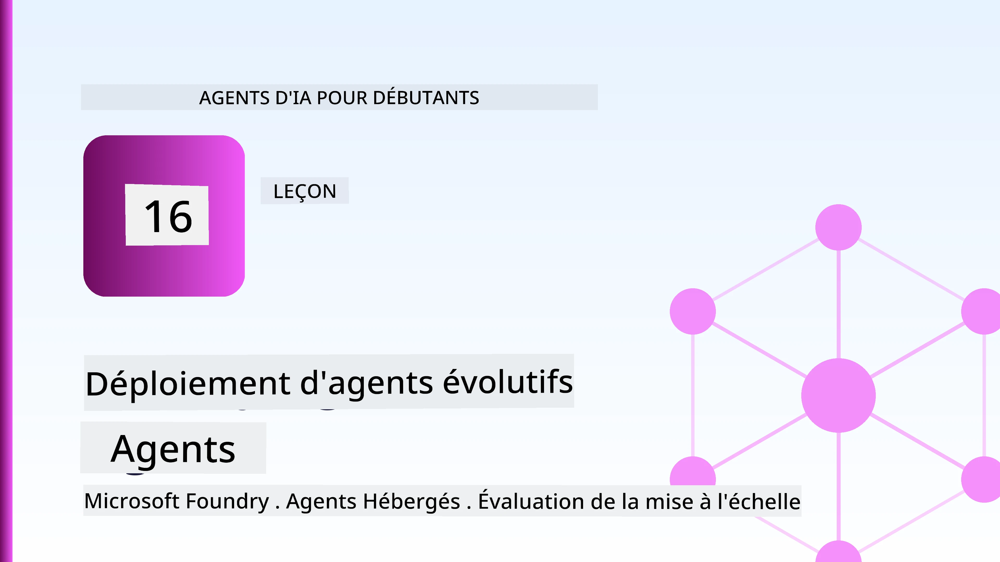
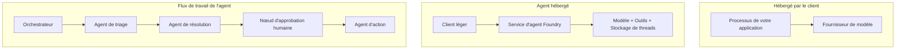
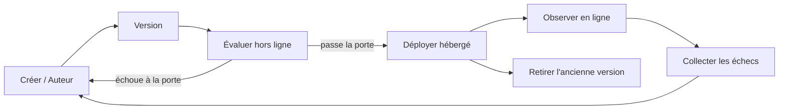
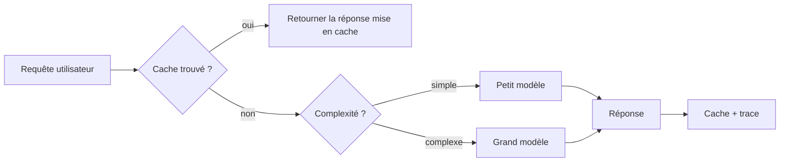
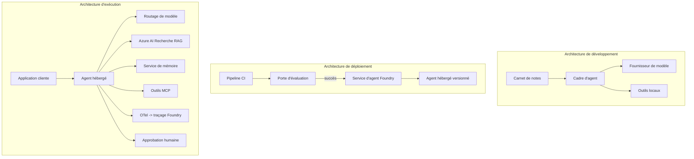

# Déploiement d'agents évolutifs avec Microsoft Foundry



Jusqu'à présent dans le cours, vous avez construit des agents qui s'exécutent sur votre ordinateur portable, dans un notebook, pilotés par `az login` et une poignée de variables d'environnement. C'est exactement la bonne façon d'apprendre. Ce n'est pas la bonne façon d'exécuter un agent dont des milliers de clients dépendent à 3 heures du matin.

Cette leçon porte sur le fossé entre "ça marche sur ma machine" et "ça marche, de manière fiable et abordable, en production". Nous comblons ce fossé en utilisant **Microsoft Foundry** et le **Microsoft Foundry Agent Service**, et nous le faisons en construisant un véritable agent de support client qui dispose d'outils, de récupération, de mémoire, d'évaluation et de surveillance.

## Introduction

Cette leçon couvrira :

- La différence entre un **agent prototype** et un **agent déployé**, et pourquoi la transition concerne principalement tout ce qui entoure* le modèle.
- Les **schémas de déploiement** pour les agents : hébergés côté client, hébergés en service (Agents Hébergés), et orchestrés par workflow.
- Le **cycle de vie de l'agent** sur Microsoft Foundry — création, version, déploiement, évaluation, observation, retrait.
- Les **stratégies de mise à l'échelle** : routage des modèles, mise en cache, simultanéité et conception sans état.
- **Observabilité** avec OpenTelemetry et traçage Foundry.
- **Optimisation des coûts** grâce à la sélection du modèle, au routage et aux portes d'évaluation.
- **Considérations d'entreprise** : gouvernance, approbation humaine, et fonctionnement sécurisé des serveurs MCP en production.

## Objectifs d'apprentissage

Après avoir terminé cette leçon, vous saurez comment :

- Choisir le bon schéma de déploiement pour une charge de travail d'agent donnée.
- Déployer un agent sur le Microsoft Foundry Agent Service afin qu'il soit versionné, gouverné, et observable.
- Instrumenter un agent pour le traçage et connecter une pipeline d'évaluation qui s'exécute avant chaque version.
- Appliquer le routage de modèle et la mise en cache pour garder la latence et le coût sous contrôle à grande échelle.
- Ajouter une porte d'approbation humaine pour les actions à haut risque et intégrer un serveur MCP de manière sûre en production.

## Prérequis

Cette leçon suppose que vous avez terminé les leçons précédentes et que vous êtes à l'aise avec :

- La construction d'agents avec le [Microsoft Agent Framework](../14-microsoft-agent-framework/README.md) (Leçon 14).
- [Utilisation des Outils](../04-tool-use/README.md) (Leçon 4) et [Agentic RAG](../05-agentic-rag/README.md) (Leçon 5).
- [Mémoire d'Agent](../13-agent-memory/README.md) (Leçon 13) et [Protocoles Agentic / MCP](../11-agentic-protocols/README.md) (Leçon 11).
- [Observabilité et Évaluation](../10-ai-agents-production/README.md) (Leçon 10) — cette leçon s'appuie directement sur celle-ci.

Vous aurez aussi besoin :

- D'un **abonnement Azure** et d'un **projet Microsoft Foundry** avec au moins un modèle de chat déployé.
- De l'**Azure CLI** authentifiée (`az login`).
- De Python 3.12+ et des packages dans le fichier [`requirements.txt`](../../../requirements.txt) du dépôt.

## Du prototype à la production : quels changements réels

Un agent prototype et un agent de production partagent la même boucle principale — raisonner, appeler des outils, répondre. Ce qui change, c’est tout ce qui entoure cette boucle. Le modèle représente peut-être 20 % d’un agent de production ; les 80 % restants sont le squelette opérationnel.

| Inquiétude | Prototype | Production |
| --- | --- | --- |
| **Hébergement** | S'exécute dans votre notebook | S'exécute comme un service hébergé, versionné et déployé progressivement |
| **Identité** | Votre jeton `az login` | Identité gérée avec RBAC à portée limitée |
| **État** | En mémoire, perdu au redémarrage | Externalisé (stockage de threads, service mémoire) |
| **Défaillance** | Vous voyez la trace d'erreur | Retry, repli, file d'attente des messages morts, alertes |
| **Coût** | "C’est quelques centimes" | Suivi par requête, routé, mis en cache, budgété |
| **Qualité** | Vous évaluez visuellement la sortie | Évalué automatiquement avant chaque mise en production |
| **Confiance** | Vous approuvez chaque action | Politique + intervention humaine pour les actions à risque |

Gardez ce tableau en tête. Chaque section ci-dessous correspond à une de ces lignes.

## Schémas de déploiement des agents

Il y a trois schémas que vous utiliserez, souvent en combinaison.

### 1. Agents hébergés côté client

L'objet agent vit à l'intérieur du processus de *votre* application. Votre code appelle directement le fournisseur du modèle ; la boucle de raisonnement s'exécute dans votre service. C'est ce que chaque leçon précédente a fait.

- **À utiliser lorsque** vous avez besoin d'un contrôle total sur la boucle, d'un middleware personnalisé, ou que vous intégrez l'agent dans un backend existant.
- **Inconvénient** : vous gérez vous-même la mise à l'échelle, l'état et la résilience.

### 2. Agents hébergés (Foundry Agent Service)

L'agent est *enregistré comme ressource* dans Microsoft Foundry. Foundry héberge la boucle de raisonnement, stocke les threads, applique la sécurité de contenu et le RBAC, et rend l'agent visible dans le portail Foundry. Votre application devient un client léger qui crée des threads et lit les réponses.

- **À utiliser lorsque** vous souhaitez durabilité, observabilité intégrée, gouvernance, et une moindre surface d'exploitation.
- **Inconvénient** : moins de contrôle bas-niveau en échange d'un runtime géré.

### 3. Workflows d'agents

Plusieurs agents (et outils) sont composés en un graphe avec un flux de contrôle explicite — étapes séquentielles, bifurcations, nœuds d'approbation humaine, et points de contrôle durables qui peuvent suspendre et reprendre. C’est la capacité **Workflows** du Microsoft Agent Framework appliquée à l'échelle du déploiement.

- **À utiliser lorsque** une tâche unique implique plusieurs agents spécialisés ou nécessite une étape d'approbation en cours de route.
- **Inconvénient** : plus de pièces en mouvement ; nécessite une observabilité au niveau de l'orchestration.



## Le cycle de vie de l'agent sur Microsoft Foundry

Déployer un agent n'est pas un simple `push` ponctuel. C’est une boucle, et elle ressemble beaucoup à un cycle de publication logicielle parce que c’en est exactement un.



L'idée clé, reprise de [Leçon 10](../10-ai-agents-production/README.md) : **l'évaluation hors ligne est une porte, pas un simple détail.** Une nouvelle version de l'agent n'est déployée que si elle dépasse vos seuils d'évaluation. L'observabilité en ligne alimente alors les échecs du monde réel dans votre ensemble de tests hors ligne. C’est toute la boucle.

## Stratégies de mise à l'échelle

Mettre à l'échelle un agent est différent de mettre à l'échelle une API web sans état, car chaque requête peut déclencher plusieurs appels coûteux à des modèles et outils. Quatre techniques prennent en charge la majeure partie de la charge.

**Gestion sans état des requêtes.** Ne conservez aucun état par utilisateur dans la mémoire de votre processus. Persistez les threads de conversation dans le stockage Foundry ou un service mémoire pour que n'importe quelle instance puisse gérer n'importe quelle requête. C’est ce qui vous permet de monter en charge horizontalement — ajouter des instances, pas de sessions collantes.

**Routage du modèle.** Chaque requête ne nécessite pas votre modèle le plus performant (et le plus coûteux). Orientez les requêtes simples — classification d'intention, réponses factuelles courtes — vers un petit modèle rapide, et réservez le grand modèle pour un véritable raisonnement. Le **Model Router** de Foundry peut faire cela pour vous, ou vous pouvez implémenter vous-même un classificateur léger. Vous construirez la version DIY dans le laboratoire.

**Mise en cache des réponses.** Beaucoup de requêtes de support sont presque des doublons ("comment réinitialiser mon mot de passe ?"). Mettez en cache les réponses aux questions fréquentes et servez-les sans interroger le modèle. Même un taux de cache modeste réduit de manière significative le coût et la latence.

**Concurrence et pression de retour.** Les fournisseurs de modèles ont des limites de taux. Limitez votre simultanéité, utilisez des retries avec un backoff exponentiel, et échouez gracieusement (une réponse en file d'attente "nous traitons votre demande" vaut mieux qu'un 500).



## Observabilité en production

Vous ne pouvez pas exploiter ce que vous ne pouvez pas voir. Comme vu dans la Leçon 10, le Microsoft Agent Framework émet des traces **OpenTelemetry** nativement — chaque appel de modèle, invocation d'outil, et étape d'orchestration devient un span. En production, vous exportez ces spans vers Microsoft Foundry (ou tout backend compatible OTel) pour pouvoir :

- Tracer une plainte client du début à la fin à travers chaque appel de modèle et d'outil.
- Surveiller la latence p50/p95 et le coût par requête dans le temps.
- Alerter sur les pics d’erreur et anomalies de coût avant que vos utilisateurs (ou votre équipe financière) ne les remarquent.

```python
from agent_framework.observability import get_tracer

tracer = get_tracer()

with tracer.start_as_current_span("support_request") as span:
    span.set_attribute("customer.tier", "enterprise")
    span.set_attribute("routed.model", "gpt-5-nano")
    # l'exécution de l'agent est automatiquement tracée dans cette plage
```

Des attributs tels que `customer.tier` et `routed.model` transforment un mur de traces en questions répondables (« les clients entreprise sont-ils trop souvent routés vers le petit modèle ? »).

## Optimisation des coûts

Dans les agents de production, le coût est dominé par les jetons. Trois leviers, par ordre d'impact :

1. **Choisir la bonne taille de modèle.** Un petit modèle qui dépasse votre porte d'évaluation est presque toujours moins cher qu'un grand modèle qui la dépasse aussi. Utilisez l'évaluation pour *prouver* que le petit modèle est assez bon plutôt que de par défaut choisir le plus grand par précaution.
2. **Routage selon la complexité.** Comme ci-dessus — ne payez les prix du grand modèle que pour les requêtes qui nécessitent un raisonnement à grande échelle.
3. **Mettez en cache de manière agressive.** L'appel de modèle le moins cher est celui que vous ne faites jamais.

Les portes d'évaluation et le contrôle des coûts sont la même discipline vue sous deux angles : l'évaluation vous donne le *plancher de qualité*, le routage et la mise en cache vous maintiennent aussi près que possible du *coût* de ce plancher.

## Considérations pour le déploiement en entreprise

**Gouvernance.** Les Agents Hébergés héritent du RBAC, de la sécurité de contenu et de la journalisation d'audit de Foundry. Donnez à chaque agent une identité gérée avec le moindre privilège requis — accès en lecture seule à la base de connaissances, accès limité à l'API de tickets, rien de plus.

**Humain dans la boucle.** Certaines actions sont trop cruciales pour être complètement automatisées — émettre un remboursement, supprimer un compte, escalader à une équipe juridique. Le Microsoft Agent Framework supporte les outils à **approbation requise** : l'agent propose l'action, son exécution est mise en pause, un humain approuve ou rejette, puis le workflow reprend. Vous avez vu ce primitif dans [Leçon 6](../06-building-trustworthy-agents/README.md) ; ici vous le déployez.

**MCP en production.** [MCP](../11-agentic-protocols/README.md) permet à votre agent de consommer des outils externes via une interface standard. En production, traitez chaque serveur MCP comme une frontière non fiable : fixez la version du serveur, exécutez-le avec une identité à portée limitée, validez ses sorties, et ne lui exposez jamais de secrets. Un serveur MCP est une dépendance, et les dépendances sont patchées, auditées, et limités en taux.



Ces trois diagrammes — développement, déploiement, exécution — représentent le même agent à trois étapes de sa vie. Le laboratoire suivant vous guide dans sa construction.

## Laboratoire pratique : un agent de support client prêt pour la production

Ouvrez [`code_samples/16-python-agent-framework.ipynb`](./code_samples/16-python-agent-framework.ipynb) et suivez-le de bout en bout. Vous assemblerez un **agent de support client Contoso** avec toutes les préoccupations de production intégrées :

1. **Appels aux outils** — consultation du statut de commande et ouverture de tickets de support.
2. **RAG** — réponses aux questions de politique à partir d'une base de connaissances (Azure AI Search, avec un secours en mémoire pour que le notebook fonctionne sans ressource Search).
3. **Mémoire** — se souvenir du client au fil de la conversation.
4. **Routage du modèle** — un classificateur de complexité oriente chaque requête vers un petit ou grand modèle.
5. **Mise en cache des réponses** — les questions répétées sont servies depuis le cache.
6. **Approbation humaine** — les remboursements au-dessus d'un seuil sont suspendus en attente d’une validation humaine.
7. **Pipeline d'évaluation** — un petit ensemble de tests hors ligne évalue l'agent et sert de porte de publication.
8. **Observabilité** — traçage OpenTelemetry autour de chaque requête.

### Présentation

Le notebook est organisé de façon à ce que chaque préoccupation de production soit une section autonome et exécutable. Le cœur en est le gestionnaire de requêtes combinant routage et mise en cache :

```python
async def handle_support_request(query: str, customer_id: str) -> str:
    # 1. Servir depuis le cache quand nous le pouvons.
    cached = response_cache.get(normalize(query))
    if cached:
        return cached

    # 2. Router par complexité pour contrôler le coût.
    model = "gpt-5-nano" if is_simple(query) else "gpt-5-mini"

    # 3. Exécuter l'agent à l'intérieur d'une trace pour l'observabilité.
    with tracer.start_as_current_span("support_request") as span:
        span.set_attribute("routed.model", model)
        span.set_attribute("customer.id", customer_id)
        response = await support_agent.run(query, model=model)

    # 4. Mettre en cache et retourner.
    response_cache.set(normalize(query), response.text)
    return response.text
```

La porte d'évaluation protégeant une publication ressemble à ceci :

```python
async def evaluation_gate(agent, test_cases, threshold: float = 0.8) -> bool:
    passed = 0
    for case in test_cases:
        result = await agent.run(case["input"])
        if score_response(result.text, case["expected"]) >= 0.8:
            passed += 1
    pass_rate = passed / len(test_cases)
    print(f"Evaluation pass rate: {pass_rate:.0%} (gate: {threshold:.0%})")
    return pass_rate >= threshold  # déployer uniquement si la porte est validée
```

Lisez chaque ligne — le notebook maintient les primitives délibérément petites pour que rien ne soit caché derrière un appel de framework.

## Validation d’un agent déployé avec des tests d'état (smoke tests)

La porte d'évaluation ci-dessus s'exécute *hors ligne* contre votre objet agent. Une fois l'agent déployé en tant qu'Agent Hébergé, vous avez besoin d'une vérification supplémentaire, encore moins coûteuse : **l'endpoint déployé répond-il réellement ?**

Déployer "avec succès" prouve seulement que le plan de contrôle a accepté la définition — cela ne prouve pas que l'agent répond. Une dépendance manquante, un mauvais routage de modèle, ou une connexion expirée peuvent laisser un déploiement en vert qui ne renvoie rien. Un **test d'état** détecte cela en quelques secondes, à chaque déploiement, sans le coût d'une évaluation complète.

Ce dépôt fournit une pipeline de test d'état prête à l'emploi basée sur l'action GitHub [AI Smoke Test](https://github.com/marketplace/actions/ai-smoke-test) :

- **Catalogue** — [`tests/lesson-16-smoke-tests.json`](../../../tests/lesson-16-smoke-tests.json) contient des prompts et assertions pour l'agent de support Contoso (réponses de politique basées sur des données, consultation de commande, rester dans le sujet, continuité multi-tour). Les catalogues pour les agents d'autres leçons se trouvent à côté — voir [`tests/README.md`](../tests/README.md).
- **Workflow** — [`.github/workflows/smoke-test.yml`](../../../.github/workflows/smoke-test.yml) s'authentifie avec Azure OIDC et envoie chaque prompt à l'endpoint Responses de l'agent, échouant la tâche dès qu'une assertion est manquée.

```yaml
- name: Smoke-test hosted agent
  uses: JFolberth/ai-smoketest@v1
  with:
    project_endpoint: ${{ inputs.project_endpoint }}
    agent_name: ContosoSupportAgent
    tests_file: tests/lesson-16-smoke-tests.json
```


Exécutez-le depuis l'onglet **Actions** une fois que votre agent est déployé, en fournissant le point de terminaison de votre projet Foundry et le nom de l'agent. L'identité fédérée doit avoir le rôle **Azure AI User** à l'échelle du projet Foundry. Pensez aux couches comme à une pyramide : les tests de fumée (accessible et répond ?) s'exécutent à chaque déploiement, l'évaluation hors ligne (assez bonne pour la mise en production ?) s'exécute avant la promotion, et l'évaluation en ligne (comment ça se passe en production ?) s'exécute en continu.

## Vérification des connaissances

Testez votre compréhension avant de passer à l'exercice.

**1. Environ quelle part d'un agent en production est « le modèle », et qu'est-ce que le reste ?**

<details>
<summary>Réponse</summary>

Le modèle est une minorité du système — souvent cité comme environ 20 %. Le reste est le squelette opérationnel : hébergement et gestion des versions, identité et RBAC, état externalisé, gestion des échecs, suivi des coûts, évaluation, et contrôles humains dans la boucle. Passer en production consiste principalement à construire tout *autour* de la boucle de raisonnement.
</details>

**2. Quand choisiriez-vous un agent hébergé plutôt qu'un agent hébergé côté client ?**

<details>
<summary>Réponse</summary>

Lorsque vous souhaitez un environnement d'exécution géré avec durabilité intégrée (threads qui persistent et peuvent reprendre), observabilité, sécurité du contenu et RBAC, et que vous êtes prêt à échanger un certain contrôle bas niveau de la boucle de raisonnement contre une surface opérationnelle réduite. L'hébergement côté client est préférable lorsque vous avez besoin d'un contrôle total sur la boucle ou que vous intégrez l'agent dans un backend existant.
</details>

**3. Pourquoi un agent scalable doit-il être sans état dans sa mémoire de processus ?**

<details>
<summary>Réponse</summary>

Pour que toute instance puisse gérer n'importe quelle requête, ce qui permet la mise à l'échelle horizontale sans sessions collantes. L'état de conversation par utilisateur est externalisé dans un magasin de threads ou un service de mémoire. Si l'état vivait en mémoire de processus, vous le perdriez au redémarrage et ne pourriez pas distribuer librement la charge.
</details>

**4. Quel problème le routage de modèles résout-il, et comment cela se rapporte-t-il à l'évaluation ?**

<details>
<summary>Réponse</summary>

Le routage envoie les requêtes simples vers un petit modèle bon marché et rapide, et réserve le grand modèle pour un véritable raisonnement, contrôlant à la fois la latence et le coût. Cela se rapporte à l'évaluation parce que l'évaluation est ce qui *prouve* que le petit modèle est suffisamment bon pour une classe de requêtes — le routage sans évaluation est une supposition.
</details>

**5. Qu'est-ce qu'une « porte d'évaluation » et où se situe-t-elle dans le cycle de vie ?**

<details>
<summary>Réponse</summary>

Une porte d'évaluation exécute un ensemble de tests hors ligne contre une nouvelle version de l'agent et bloque le déploiement à moins que le taux de réussite ne dépasse un seuil. Elle se situe entre « version » et « déploiement » dans le cycle de vie, faisant de la qualité une condition préalable à la publication plutôt que quelque chose que vous vérifiez après expédition.
</details>

**6. Pourquoi un serveur MCP doit-il être traité comme une frontière non fiable en production ?**

<details>
<summary>Réponse</summary>

Parce qu'il s'agit d'une dépendance externe que votre agent appelle. Vous devez verrouiller sa version, l'exécuter avec une identité restreinte, valider ses sorties, appliquer une limitation du débit, et ne jamais lui exposer de secrets — la même discipline que pour toute dépendance tierce. Ses sorties alimentent le raisonnement de votre agent, donc une confiance non validée constitue un risque de sécurité.
</details>

**7. Quel changement unique a généralement le plus grand impact sur le coût d'un agent en production, et pourquoi ?**

<details>
<summary>Réponse</summary>

Adapter la taille du modèle — utiliser le plus petit modèle qui passe toujours votre porte d'évaluation. Le coût est dominé par les tokens, et un modèle plus petit qui atteint le seuil de qualité est presque toujours moins cher qu'un modèle plus grand. La mise en cache et le routage réduisent alors encore le coût, mais choisir le bon modèle de base a le plus grand effet de premier ordre.
</details>

**8. Quel rôle les attributs de span comme `customer.tier` et `routed.model` jouent-ils dans l'observabilité ?**

<details>
<summary>Réponse</summary>

Ils transforment des traces brutes en questions métier exploitables. Sans attributs, vous avez un mur de spans ; avec eux, vous pouvez demander « les clients entreprises sont-ils routés trop souvent vers le petit modèle ? » ou « quel modèle gère nos requêtes les plus lentes ? ». Les attributs sont la façon dont vous tranchez la télémétrie selon les dimensions qui comptent pour votre exploitation.
</details>

## Exercice

Prenez l'agent de support client du labo et renforcez-le pour un scénario spécifique : **un agent de support facturation par abonnement pour une entreprise SaaS.**

Votre soumission doit :

1. **Remplacer les outils** par des outils pertinents pour la facturation : `get_subscription_status`, `get_invoice` et `issue_credit` (les crédits supérieurs à 50 $ nécessitent une approbation humaine).
2. **Ajouter trois documents RAG** couvrant la politique de remboursement, le cycle de facturation, et la politique d'annulation de l'entreprise.
3. **Étendre l'ensemble d'évaluation** à au moins huit cas, incluant au moins deux qui *devraient* déclencher la voie d'approbation humaine, et confirmer que votre porte d'évaluation passe ou échoue correctement.
4. **Ajouter un rapport de coût** : après avoir exécuté dix requêtes mixtes via l'agent, imprimez combien sont allées au petit modèle, combien au grand modèle, et combien ont été servies depuis le cache.

Rédigez un court paragraphe (dans une cellule markdown) expliquant quelle règle de routage de modèle vous avez choisie et comment vous la valideriez avec un trafic réel. Il n'y a pas de réponse unique correcte — vous serez évalué sur la cohérence de la prise en compte des enjeux en production.

## Résumé

Dans cette leçon, vous avez déplacé un agent du prototype à la production avec Microsoft Foundry :

- Le passage en production concerne surtout le **squelette opérationnel** autour du modèle — hébergement, identité, état, gestion des échecs, coût, qualité, et confiance.
- Vous avez appris les trois **modèles de déploiement** — hébergement côté client, Agents hébergés, et Workflows d'Agents — et quand chacun convient.
- Vous avez parcouru le **cycle de vie de l'agent**, où l'**évaluation hors ligne agit comme une porte de sortie** et l'observabilité en ligne alimente les échecs dans l'ensemble de test.
- Vous avez appliqué les **stratégies de mise à l'échelle** — conception sans état, routage de modèles, mise en cache, et concurrence bornée — et relié cela à l'**optimisation des coûts**.
- Vous avez intégré des **contrôles d'entreprise** : RBAC, approbation humaine dans la boucle, et intégration MCP sécurisée pour la production.
- Vous avez construit un **agent support client prêt pour la production** qui relie chacune de ces préoccupations dans un code exécutable.

La prochaine leçon fait le trajet inverse : au lieu de monter en charge vers le cloud, vous allez les ramener *en bas* sur une seule machine de développement et les exécuter entièrement localement.

## Ressources complémentaires

- <a href="https://learn.microsoft.com/azure/ai-foundry/what-is-azure-ai-foundry" target="_blank">Documentation Microsoft Foundry</a>
- <a href="https://learn.microsoft.com/azure/ai-foundry/agents/overview" target="_blank">Présentation du service Agent Microsoft Foundry</a>
- <a href="https://learn.microsoft.com/en-us/agent-framework/overview/?wt.mc_id=youtube_26688_organicsocial_reactor&pivots=programming-language-python" target="_blank">Microsoft Agent Framework</a>
- <a href="https://learn.microsoft.com/azure/ai-foundry/concepts/model-router" target="_blank">Routeur de modèle dans Microsoft Foundry</a>
- <a href="https://learn.microsoft.com/azure/search/search-what-is-azure-search" target="_blank">Azure AI Search</a>
- <a href="https://opentelemetry.io/" target="_blank">OpenTelemetry</a>
- <a href="https://github.com/marketplace/actions/ai-smoke-test" target="_blank">Action GitHub AI Smoke Test</a>
- <a href="https://modelcontextprotocol.io/" target="_blank">Model Context Protocol (MCP)</a>

## Leçon précédente

[Création d'agents d'utilisation informatique (CUA)](../15-browser-use/README.md)

## Leçon suivante

[Création d'agents IA locaux](../17-creating-local-ai-agents/README.md)

---

<!-- CO-OP TRANSLATOR DISCLAIMER START -->
**Avertissement** :
Ce document a été traduit à l'aide du service de traduction automatique [Co-op Translator](https://github.com/Azure/co-op-translator). Bien que nous nous efforçions d'assurer l'exactitude, veuillez noter que les traductions automatisées peuvent contenir des erreurs ou des inexactitudes. Le document original dans sa langue native doit être considéré comme la source faisant autorité. Pour les informations critiques, il est recommandé de recourir à une traduction professionnelle réalisée par un humain. Nous ne saurions être tenus responsables des malentendus ou erreurs d'interprétation découlant de l'utilisation de cette traduction.
<!-- CO-OP TRANSLATOR DISCLAIMER END -->