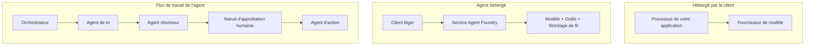
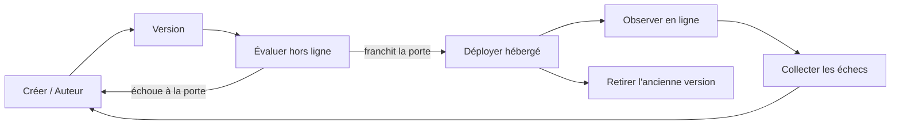
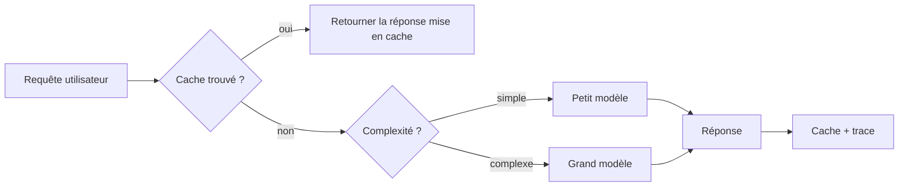
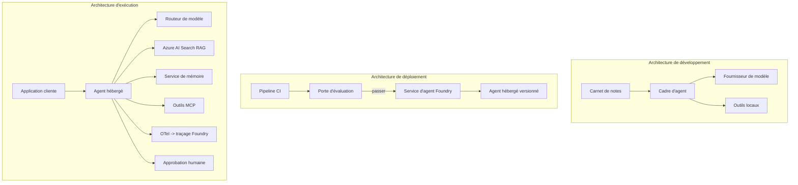

# Déploiement d'agents évolutifs avec Microsoft Foundry


Jusqu'à présent dans ce cours, vous avez construit des agents qui s'exécutent sur votre ordinateur portable, dans un notebook, pilotés par `az login` et une poignée de variables d'environnement. C'est exactement la bonne façon d'apprendre. Ce n'est pas la bonne façon d'exécuter un agent dont des milliers de clients dépendent à 3 heures du matin.

Cette leçon porte sur l'écart entre « ça marche sur ma machine » et « ça marche, de manière fiable et abordable, en production ». Nous comblons cet écart en utilisant **Microsoft Foundry** et le **Microsoft Foundry Agent Service**, et nous le faisons en construisant un véritable agent de support client doté d'outils, de récupération, de mémoire, d'évaluation et de surveillance.

## Introduction

Cette leçon couvrira :

- La différence entre un **agent prototype** et un **agent déployé**, et pourquoi la transition concerne surtout tout ce qui entoure* le modèle.
- Les **modèles de déploiement** pour les agents : hébergé client, hébergé en service (Agents hébergés) et orchestré par flux de travail.
- Le **cycle de vie de l'agent** sur Microsoft Foundry — créer, versionner, déployer, évaluer, observer, retirer.
- Les **stratégies de montée en charge** : routage du modèle, mise en cache, concurrence et conception sans état.
- **Observabilité** avec OpenTelemetry et traçage Foundry.
- **Optimisation des coûts** grâce à la sélection du modèle, au routage et aux portes d’évaluation.
- **Considérations d'entreprise** : gouvernance, approbation humaine et exploitation sûre des serveurs MCP en production.

## Objectifs d'apprentissage

Après avoir terminé cette leçon, vous saurez comment :

- Choisir le bon modèle de déploiement pour une charge de travail donnée d'agent.
- Déployer un agent dans le Microsoft Foundry Agent Service afin qu'il soit versionné, gouverné et observable.
- Instrumenter un agent pour le traçage et connecter un pipeline d'évaluation qui s'exécute avant chaque version.
- Appliquer le routage du modèle et la mise en cache pour maintenir la latence et le coût sous contrôle à grande échelle.
- Ajouter une porte d'approbation humaine pour les actions à haut risque et intégrer un serveur MCP de manière sûre en production.

## Prérequis

Cette leçon suppose que vous avez terminé les leçons précédentes et que vous êtes à l'aise avec :

- La construction d'agents avec le [Microsoft Agent Framework](../14-microsoft-agent-framework/README.md) (Leçon 14).
- [Utilisation d'outils](../04-tool-use/README.md) (Leçon 4) et [Agentic RAG](../05-agentic-rag/README.md) (Leçon 5).
- [Mémoire d'agent](../13-agent-memory/README.md) (Leçon 13) et [Protocoles agentiques / MCP](../11-agentic-protocols/README.md) (Leçon 11).
- [Observabilité et évaluation](../10-ai-agents-production/README.md) (Leçon 10) — cette leçon s'y appuie directement.

Vous aurez également besoin de :

- Un **abonnement Azure** et un **projet Microsoft Foundry** avec au moins un modèle de chat déployé.
- L'**Azure CLI** authentifiée (`az login`).
- Python 3.12+ et les packages du dépôt [`requirements.txt`](../../../requirements.txt).

## Du prototype à la production : ce qui change réellement

Un agent prototype et un agent en production partagent la même boucle principale — raisonner, appeler des outils, répondre. Ce qui change est tout ce qui entoure cette boucle. Le modèle représente peut-être 20 % d'un agent en production ; les 80 % restants constituent le squelette opérationnel.

| Préoccupation | Prototype | Production |
| --- | --- | --- |
| **Hébergement** | S'exécute dans votre notebook | S'exécute comme un service hébergé, versionné et déployé progressivement |
| **Identité** | Votre jeton `az login` | Identité gérée avec RBAC ciblé |
| **État** | En mémoire, perdu au redémarrage | Externalisé (magasin de threads, service mémoire) |
| **Échec** | Vous voyez la trace de l'erreur | Re-essais, solutions de secours, boîte aux lettres morte, alertes |
| **Coût** | « C'est quelques centimes » | Suivi par requête, routé, mis en cache, budgété |
| **Qualité** | Vous surveillez la sortie | Évaluée automatiquement avant chaque publication |
| **Confiance** | Vous approuvez chaque action | Politique + humain dans la boucle pour les actions risquées |

Gardez ce tableau en tête. Chaque section ci-dessous correspond à l'une de ces lignes.

## Modèles de déploiement d'agents

Il existe trois modèles que vous utiliserez, souvent en combinaison.

### 1. Agents hébergés côté client

L'objet agent vit à l'intérieur du *processus de votre* application. Votre code appelle directement le fournisseur de modèle ; la boucle de raisonnement s'exécute dans votre service. C'est ce que chaque leçon précédente a fait.

- **Utilisez-le lorsque** vous avez besoin d'un contrôle total sur la boucle, d'un middleware personnalisé, ou que vous intégrez l'agent dans un backend existant.
- **Compromis** : vous assumez vous-même la montée en charge, l'état et la résilience.

### 2. Agents hébergés (Foundry Agent Service)

L'agent est *enregistré comme une ressource* dans Microsoft Foundry. Foundry héberge la boucle de raisonnement, stocke les threads, applique la sécurité de contenu et le RBAC, et rend l'agent visible dans le portail Foundry. Votre application devient un client léger qui crée des threads et lit les réponses.

- **Utilisez-le lorsque** vous voulez durabilité, observabilité intégrée, gouvernance et moins de surface opérationnelle.
- **Compromis** : moins de contrôle bas niveau en échange d'un runtime géré.

### 3. Flux de travail d'agents

Plusieurs agents (et outils) sont composés dans un graphe avec un flux de contrôle explicite — étapes séquentielles, bifurcations, nœuds d'approbation humaine, et points de contrôle durables pouvant suspendre et reprendre. C'est la capacité **Workflows** du Microsoft Agent Framework appliquée à l'échelle du déploiement.

- **Utilisez-le lorsque** une tâche unique englobe plusieurs agents spécialisés ou nécessite une étape d'approbation au milieu.
- **Compromis** : plus d'éléments mobiles ; nécessite une observabilité au niveau de l'orchestration.



## Le cycle de vie de l'agent sur Microsoft Foundry

Déployer un agent n'est pas un simple `push` unique. C'est une boucle, et elle ressemble beaucoup à un cycle de publication logiciel car c'en est un.



L'idée clé, reprise de la [Leçon 10](../10-ai-agents-production/README.md) : **l'évaluation hors ligne est une porte, pas un simple détail.** Une nouvelle version de l'agent n'est pas publiée à moins de dépasser vos seuils d'évaluation. L'observabilité en ligne alimente ensuite les échecs du monde réel dans votre jeu de test hors ligne. C'est toute la boucle.

## Stratégies de montée en charge

Monter en charge un agent est différent de monter en charge une API web sans état, car chaque requête peut déclencher plusieurs appels coûteux de modèles et d'outils. Quatre techniques supportent la majeure partie de la charge.

**Gestion sans état des requêtes.** Ne gardez aucun état par utilisateur dans la mémoire de votre processus. Persistez les fils de conversation dans le magasin de threads Foundry ou un service mémoire afin que n'importe quelle instance puisse gérer n'importe quelle requête. C'est ce qui vous permet de scaler horizontalement — ajouter des instances, pas de sessions collantes.

**Routage du modèle.** Toutes les requêtes ne nécessitent pas votre modèle le plus performant (et le plus coûteux). Orientez les requêtes simples — classification d'intention, réponses factuelles courtes — vers un modèle petit et rapide, et réservez le grand modèle pour un véritable raisonnement. Le **Model Router** de Foundry peut le faire pour vous, ou vous pouvez implémenter un classificateur léger vous-même. Vous construirez la version DIY dans le laboratoire.

**Mise en cache des réponses.** Beaucoup de questions de support sont quasi doublons (« comment réinitialiser mon mot de passe ? »). Mettez en cache les réponses aux questions fréquentes et servez-les sans interroger le modèle. Même un taux de cache modeste réduit significativement le coût et la latence.

**Concurrence et régulation de flux (backpressure).** Les fournisseurs de modèles ont des limites de débit. Contraignez votre concurrence, utilisez des réessais avec retour exponentiel, et échec gracieux (une réponse mise en file "on s'en occupe" vaut mieux qu'une 500).



## Observabilité en production

Vous ne pouvez pas exploiter ce que vous ne voyez pas. Comme abordé dans la Leçon 10, le Microsoft Agent Framework émet nativement des traces **OpenTelemetry** — chaque appel de modèle, invocation d'outil, et étape d'orchestration devient un span. En production, vous exportez ces spans vers Microsoft Foundry (ou tout backend compatible OTel) pour pouvoir :

- Tracer une plainte client unique de bout en bout à travers chaque appel de modèle et d'outil.
- Surveiller la latence p50/p95 et le coût par requête dans le temps.
- Alerter sur les pics de taux d'erreur et les anomalies de coût avant que vos utilisateurs (ou votre équipe financière) ne le remarquent.

```python
from agent_framework.observability import get_tracer

tracer = get_tracer()

with tracer.start_as_current_span("support_request") as span:
    span.set_attribute("customer.tier", "enterprise")
    span.set_attribute("routed.model", "gpt-5-nano")
    # l'exécution de l'agent est automatiquement tracée à l'intérieur de cette plage
```

Des attributs comme `customer.tier` et `routed.model` transforment un mur de traces en questions auxquelles il est possible de répondre (« les clients entreprise sont-ils trop souvent orientés vers le petit modèle ? »).

## Optimisation des coûts

Le coût dans les agents en production est dominé par les tokens. Trois leviers, par ordre d'impact :

1. **Diminuez la taille du modèle.** Un petit modèle qui passe votre porte d'évaluation est presque toujours moins cher qu'un grand modèle qui passe aussi. Utilisez l'évaluation pour *prouver* que le petit modèle est suffisamment bon plutôt que de par défaut utiliser le plus grand par précaution.
2. **Routez selon la complexité.** Comme ci-dessus — ne payez le prix du grand modèle que pour les requêtes qui nécessitent un raisonnement de grand modèle.
3. **Cachez agressivement.** L'appel de modèle le moins cher est celui que vous ne faites jamais.

Les portes d'évaluation et le contrôle des coûts sont la même discipline vue sous deux angles : l'évaluation vous indique le *plancher de qualité*, le routage et la mise en cache vous maintiennent aussi près que possible du *coût* de ce plancher.

## Considérations de déploiement en entreprise

**Gouvernance.** Les Agents hébergés héritent du RBAC, de la sécurité de contenu et de la journalisation d'audit de Foundry. Donnez à chaque agent une identité gérée avec les moindres privilèges nécessaires — accès en lecture seule à la base de connaissances, accès ciblé à l'API de ticketing, rien de plus.

**Humain dans la boucle.** Certaines actions sont trop déterminantes pour être automatisées entièrement — émettre un remboursement, supprimer un compte, escalader à une équipe juridique. Le Microsoft Agent Framework prend en charge les outils **nécessitant une approbation** : l'agent propose l'action, l'exécution se met en pause, un humain approuve ou rejette, et le flux de travail reprend. Vous avez vu ce primitif dans la [Leçon 6](../06-building-trustworthy-agents/README.md) ; ici vous le déployez.

**MCP en production.** [MCP](../11-agentic-protocols/README.md) permet à votre agent d'utiliser des outils externes via une interface standard. En production, traitez chaque serveur MCP comme une frontière non fiable : fixez la version du serveur, exécutez-le avec une identité ciblée, validez ses sorties, et ne lui exposez jamais de secrets. Un serveur MCP est une dépendance, et les dépendances sont patchées, auditées et limitées en débit.



Ces trois diagrammes — développement, déploiement, temps d'exécution — représentent le même agent à trois étapes de sa vie. Le laboratoire qui suit vous guide dans sa construction.

## Laboratoire pratique : un agent de support client prêt pour la production

Ouvrez [`code_samples/16-python-agent-framework.ipynb`](./code_samples/16-python-agent-framework.ipynb) et parcourez-le de bout en bout. Vous assemblerez un **agent de support client Contoso** avec toutes les préoccupations de production intégrées :

1. **Appel d'outils** — consultation du statut de commande et ouverture de tickets de support.
2. **RAG** — réponses aux questions de politique à partir d'une base de connaissances (Azure AI Search, avec une solution de secours en mémoire pour que le notebook fonctionne sans ressource Search).
3. **Mémoire** — se souvenir du client au fil des tours de conversation.
4. **Routage du modèle** — un classificateur de complexité oriente chaque requête vers un modèle petit ou grand.
5. **Mise en cache des réponses** — les questions répétées sont servies depuis le cache.
6. **Approbation humaine** — les remboursements au-delà d'un seuil sont mis en pause pour approbation humaine.
7. **Pipeline d'évaluation** — un petit ensemble de test hors ligne note l'agent et sert de porte de publication.
8. **Observabilité** — traçage OpenTelemetry autour de chaque requête.

### Parcours pas à pas

Le notebook est organisé de sorte que chaque préoccupation de production constitue une section autonome et exécutable. Le cœur en est le gestionnaire de requêtes combinant routage et mise en cache :

```python
async def handle_support_request(query: str, customer_id: str) -> str:
    # 1. Servir depuis le cache quand c'est possible.
    cached = response_cache.get(normalize(query))
    if cached:
        return cached

    # 2. Router par complexité pour contrôler les coûts.
    model = "gpt-5-nano" if is_simple(query) else "gpt-5-mini"

    # 3. Exécuter l'agent à l'intérieur d'un span de trace pour l'observabilité.
    with tracer.start_as_current_span("support_request") as span:
        span.set_attribute("routed.model", model)
        span.set_attribute("customer.id", customer_id)
        response = await support_agent.run(query, model=model)

    # 4. Mettre en cache et retourner.
    response_cache.set(normalize(query), response.text)
    return response.text
```

La porte d'évaluation qui protège une publication ressemble à ceci :

```python
async def evaluation_gate(agent, test_cases, threshold: float = 0.8) -> bool:
    passed = 0
    for case in test_cases:
        result = await agent.run(case["input"])
        if score_response(result.text, case["expected"]) >= 0.8:
            passed += 1
    pass_rate = passed / len(test_cases)
    print(f"Evaluation pass rate: {pass_rate:.0%} (gate: {threshold:.0%})")
    return pass_rate >= threshold  # déployer uniquement si la porte est franchie
```

Lisez chaque ligne — le notebook garde les primitives délibérément petites pour que rien ne soit caché derrière un appel framework.

## Validation d'un agent déployé par des tests de fumée

La porte d'évaluation ci-dessus s'exécute *hors ligne* contre votre objet agent. Une fois l'agent déployé comme Agent hébergé, vous avez besoin d'une dernière vérification, encore moins coûteuse : **l'endpoint déployé répond-il réellement ?**

Déployer « avec succès » ne prouve que le plan de contrôle a accepté la définition — cela ne prouve pas que l'agent répond. Une dépendance manquante, un routage de modèle erroné ou une connexion expirée peuvent laisser un déploiement vert qui ne retourne rien. Un **test de fumée** détecte cela en quelques secondes, à chaque déploiement, sans le coût d'une évaluation complète.

Ce dépôt fournit un pipeline de test de fumée prêt à l'emploi construit sur l'action GitHub [AI Smoke Test](https://github.com/marketplace/actions/ai-smoke-test) :

- **Catalogue** — [`tests/lesson-16-smoke-tests.json`](../../../tests/lesson-16-smoke-tests.json) contient des invites et assertions pour l'agent de support Contoso (réponses ancrées dans la politique, consultation de commande, maintien du thème, continuité multi-tours). Les catalogues des agents d'autres leçons y vivent à côté — voir [`tests/README.md`](../tests/README.md).
- **Flux de travail** — [`.github/workflows/smoke-test.yml`](../../../.github/workflows/smoke-test.yml) s'authentifie avec Azure OIDC et POST chaque invite à l'endpoint Responses de l'agent, échouant la tâche à la moindre assertion manquée.

```yaml
- name: Smoke-test hosted agent
  uses: JFolberth/ai-smoketest@v1
  with:
    project_endpoint: ${{ inputs.project_endpoint }}
    agent_name: ContosoSupportAgent
    tests_file: tests/lesson-16-smoke-tests.json
```


Exécutez-le depuis l’onglet **Actions** une fois que votre agent est déployé, en fournissant le point de terminaison de votre projet Foundry et le nom de l’agent. L’identité fédérée doit avoir le rôle **Azure AI User** au niveau du projet Foundry. Pensez aux couches comme une pyramide : les tests de fumée (accessible et répond ?) s’exécutent à chaque déploiement, l’évaluation hors ligne (assez bon pour la mise en production ?) s’exécute avant la promotion, et l’évaluation en ligne (comment ça se passe en conditions réelles ?) s’exécute en continu.

## Vérification des connaissances

Testez votre compréhension avant de passer à la mission.

**1. Environ quelle part d’un agent en production constitue « le modèle », et qu’est-ce que le reste ?**

<details>
<summary>Réponse</summary>

Le modèle est une minorité du système — souvent citée à environ 20%. Le reste est le squelette opérationnel : hébergement et gestion des versions, identité et RBAC, état externalisé, gestion des échecs, suivi des coûts, évaluation et contrôles humains dans la boucle. Passer en production consiste surtout à construire tout *autour* de la boucle de raisonnement.
</details>

**2. Quand choisiriez-vous un agent hébergé plutôt qu’un agent hébergé côté client ?**

<details>
<summary>Réponse</summary>

Lorsque vous souhaitez un environnement d’exécution géré avec durabilité intégrée (threads persistants pouvant reprendre), observabilité, sécurité du contenu et RBAC, et que vous êtes prêt à échanger un certain contrôle bas niveau de la boucle de raisonnement contre une surface opérationnelle réduite. Hébergé côté client est préférable lorsque vous avez besoin d’un contrôle total sur la boucle ou que vous intégrez l’agent dans un backend existant.
</details>

**3. Pourquoi un agent scalable doit-il être sans état dans sa propre mémoire de processus ?**

<details>
<summary>Réponse</summary>

Pour que n’importe quelle instance puisse gérer n’importe quelle requête, ce qui permet la montée en charge horizontale sans sessions collantes. L’état de conversation par utilisateur est externalisé dans un magasin de threads ou un service mémoire. Si l’état vivait dans la mémoire de processus, vous le perdriez au redémarrage et ne pourriez pas distribuer librement la charge.
</details>

**4. Quel problème la routage de modèles résout-il, et comment est-il lié à l’évaluation ?**

<details>
<summary>Réponse</summary>

Le routage envoie les requêtes simples à un modèle petit, bon marché et rapide, et réserve le grand modèle pour un véritable raisonnement, maîtrisant à la fois la latence et le coût. Cela est lié à l’évaluation car c’est elle qui *prouve* que le petit modèle est suffisamment bon pour une catégorie de requêtes — le routage sans évaluation est du devinage.
</details>

**5. Qu’est-ce qu’un « portail d’évaluation » et où se situe-t-il dans le cycle de vie ?**

<details>
<summary>Réponse</summary>

Un portail d’évaluation exécute un ensemble de tests hors ligne sur une nouvelle version d’agent et bloque le déploiement à moins que le taux de réussite ne franchisse un seuil. Il se situe entre « version » et « déploiement » dans le cycle de vie, faisant de la qualité une condition préalable à la mise en production plutôt que quelque chose à vérifier après la livraison.
</details>

**6. Pourquoi un serveur MCP doit-il être considéré comme une frontière non fiable en production ?**

<details>
<summary>Réponse</summary>

Parce que c’est une dépendance externe vers laquelle votre agent fait appel. Vous devez épingler sa version, l’exécuter avec une identité limitée, valider ses sorties, limiter son débit, et ne jamais lui exposer de secrets — la même discipline que pour toute dépendance tierce. Ses sorties alimentent le raisonnement de votre agent, donc une confiance non validée est un risque de sécurité.
</details>

**7. Quel changement unique a généralement le plus grand impact sur le coût d’un agent en production, et pourquoi ?**

<details>
<summary>Réponse</summary>

Ajuster la taille du modèle — utiliser le plus petit modèle qui passe toujours votre portail d’évaluation. Le coût est dominé par les tokens, et un modèle plus petit répondant au seuil de qualité est presque toujours moins cher qu’un plus grand. Le caching et le routage réduisent ensuite davantage les coûts, mais choisir le bon modèle de base a l’effet de premier ordre le plus important.
</details>

**8. Quel rôle jouent les attributs de span comme `customer.tier` et `routed.model` dans l’observabilité ?**

<details>
<summary>Réponse</summary>

Ils transforment les traces brutes en questions métier répondables. Sans attributs, vous avez un mur de spans ; avec eux, vous pouvez demander « les clients entreprise sont-ils trop souvent routés vers le petit modèle ? » ou « quel modèle gère nos requêtes les plus lentes ? » Les attributs sont la façon de segmenter la télémétrie selon les dimensions qui comptent pour votre exploitation.
</details>

## Mission

Prenez l’agent de support client du laboratoire et renforcez-le pour un scénario spécifique : **un agent de support facturation d’abonnement pour une société SaaS.**

Votre soumission doit :

1. **Remplacer les outils** par des outils pertinents pour la facturation : `get_subscription_status`, `get_invoice` et `issue_credit` (les crédits supérieurs à 50 $ nécessitent une approbation humaine).
2. **Ajouter trois documents RAG** couvrant la politique de remboursement de l’entreprise, le cycle de facturation et la politique d’annulation.
3. **Étendre l’ensemble d’évaluation** à au moins huit cas, incluant au moins deux cas qui *doivent* déclencher la voie d’approbation humaine, et confirmer que votre portail d’évaluation passe ou échoue correctement.
4. **Ajouter un rapport de coût** : après avoir exécuté dix requêtes mixtes via l’agent, afficher combien sont allées au petit modèle, combien au grand modèle et combien ont été servies depuis le cache.

Rédigez un court paragraphe (dans une cellule markdown) expliquant quelle règle de routage de modèle vous avez choisie et comment vous la valideriez avec du trafic réel. Il n’y a pas de réponse unique correcte — vous serez évalué sur la cohérence entre les préoccupations de production.

## Résumé

Dans cette leçon, vous avez déplacé un agent du prototype à la production avec Microsoft Foundry :

- Le passage à la production concerne surtout le **squelette opérationnel** autour du modèle : hébergement, identité, état, gestion des échecs, coût, qualité et confiance.
- Vous avez appris les trois **modèles de déploiement** — client hébergé, agents hébergés et flux de travail d’agent — et quand chacun s’applique.
- Vous avez parcouru le **cycle de vie de l’agent**, où l’**évaluation hors ligne agit comme un portail de publication** et l’observabilité en ligne renvoie les échecs dans l’ensemble de test.
- Vous avez appliqué des **stratégies de montée en charge** — conception sans état, routage de modèle, mise en cache et concurrence bornée — et les avez reliées à **l’optimisation des coûts**.
- Vous avez intégré **des contrôles d’entreprise** : RBAC, approbation humaine en boucle, et intégration MCP sécurisée en production.
- Vous avez construit un **agent de support client prêt pour la production** qui lie toutes ces préoccupations ensemble dans un code exécutable.

La leçon suivante suit le chemin inverse : au lieu de faire monter les agents dans le cloud, vous les descendrez *sur* une machine de développeur unique et les exécuterez entièrement localement.

## Ressources supplémentaires

- <a href="https://learn.microsoft.com/azure/ai-foundry/what-is-azure-ai-foundry" target="_blank">Documentation Microsoft Foundry</a>
- <a href="https://learn.microsoft.com/azure/ai-foundry/agents/overview" target="_blank">Présentation du service Agent Microsoft Foundry</a>
- <a href="https://learn.microsoft.com/en-us/agent-framework/overview/?wt.mc_id=youtube_26688_organicsocial_reactor&pivots=programming-language-python" target="_blank">Microsoft Agent Framework</a>
- <a href="https://learn.microsoft.com/azure/ai-foundry/concepts/model-router" target="_blank">Routeur de modèles dans Microsoft Foundry</a>
- <a href="https://learn.microsoft.com/azure/search/search-what-is-azure-search" target="_blank">Azure AI Search</a>
- <a href="https://opentelemetry.io/" target="_blank">OpenTelemetry</a>
- <a href="https://github.com/marketplace/actions/ai-smoke-test" target="_blank">AI Smoke Test GitHub Action</a>
- <a href="https://modelcontextprotocol.io/" target="_blank">Model Context Protocol (MCP)</a>

## Leçon précédente

[Construction d’agents d’utilisation informatique (CUA)](../15-browser-use/README.md)

## Leçon suivante

[Création d’agents IA locaux](../17-creating-local-ai-agents/README.md)

---

<!-- CO-OP TRANSLATOR DISCLAIMER START -->
**Avertissement** :
Ce document a été traduit à l'aide du service de traduction automatique [Co-op Translator](https://github.com/Azure/co-op-translator). Bien que nous nous efforçions d'assurer l'exactitude, veuillez noter que les traductions automatisées peuvent contenir des erreurs ou des inexactitudes. Le document original dans sa langue native doit être considéré comme la source faisant autorité. Pour les informations critiques, il est recommandé de recourir à une traduction professionnelle réalisée par un humain. Nous ne saurions être tenus responsables des malentendus ou erreurs d'interprétation découlant de l'utilisation de cette traduction.
<!-- CO-OP TRANSLATOR DISCLAIMER END -->