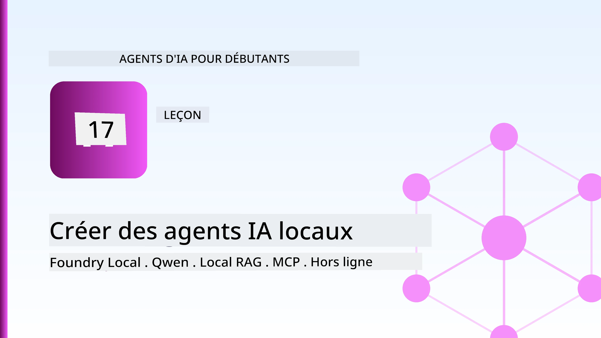
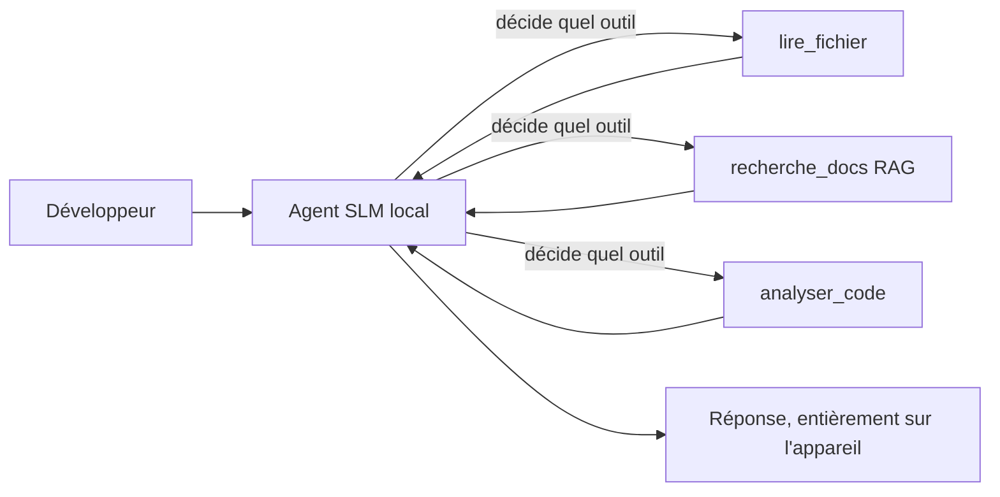
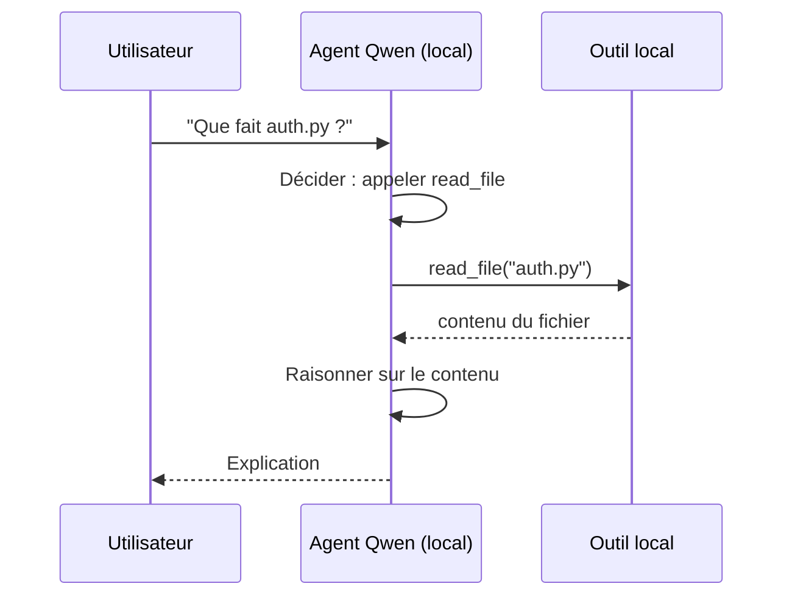
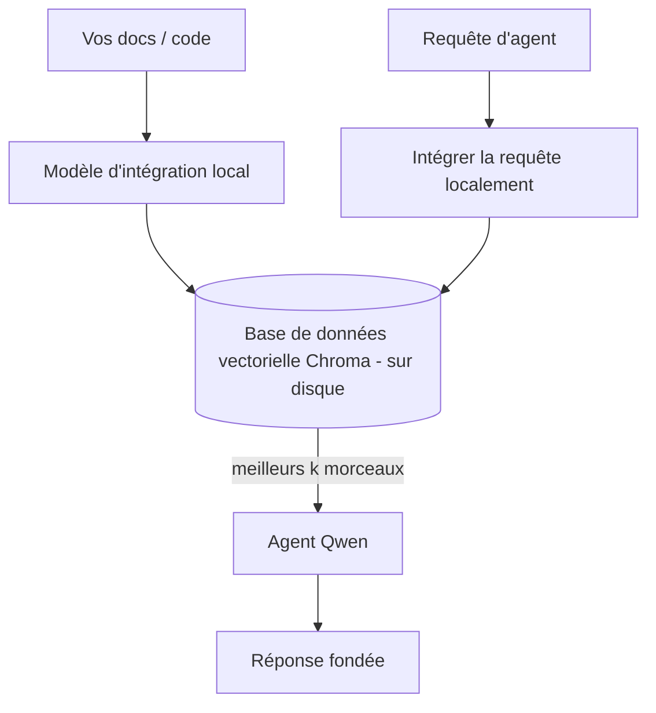
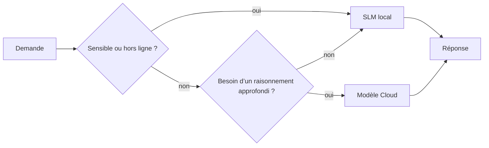

# Création d’agents d’IA locaux avec Microsoft Foundry Local et Qwen



La leçon précédente a mis à l’échelle les agents *dans* le cloud. Celle-ci les ramène *sur* une seule machine. À la fin, vous disposerez d’un assistant ingénieur fonctionnel qui raisonne, appelle des outils, lit vos fichiers et recherche dans votre documentation — **sans un seul appel d’inférence dans le cloud.**

Pourquoi voudriez-vous cela ? Trois raisons qui reviennent constamment dans le travail d’ingénierie réel :

- **Confidentialité.** Le code et les documents ne quittent jamais la machine. Aucune invite, aucun extrait, aucune donnée client ne traverse la frontière réseau.
- **Coût.** L’inférence locale ne facture pas au token. Vous pouvez itérer toute la journée pour le prix de l’électricité.
- **Hors ligne.** Dans un avion, dans une installation sécurisée ou lors d’une panne, l’agent fonctionne toujours.

Le compromis est que vous échangez un modèle cloud de pointe contre un **Petit Modèle de Langage (SLM)** fonctionnant sur votre CPU, GPU ou NPU. Cette leçon consiste à construire des agents qui sont *efficaces* dans cette contrainte plutôt que de faire semblant qu’elle n’existe pas.

## Introduction

Cette leçon couvrira :

- **Petits Modèles de Langage (SLMs)** — ce qu’ils sont, où ils excellent, et où ils ne le font pas.
- **Microsoft Foundry Local** — un runtime qui télécharge et sert des modèles localement via une **API compatible OpenAI**.
- **Modèles Qwen appelant des fonctions** — des SLM qui produisent de manière fiable des appels d’outils, ce qui rend possible les *agents* locaux (pas seulement le chat local).
- **Outils locaux, RAG local et MCP local** — donnant à l’agent des capacités sans le cloud.
- **Schémas hybrides** — quand garder les choses locales et quand utiliser le cloud.

## Objectifs d’apprentissage

Après avoir terminé cette leçon, vous saurez comment :

- Expliquer les compromis des SLM et choisir des cas d’usage appropriés pour des agents locaux.
- Servir un modèle Qwen localement avec Foundry Local et s’y connecter via un endpoint compatible OpenAI.
- Construire un agent appelant des outils qui fonctionne entièrement sur votre poste de travail.
- Ajouter du RAG local sur vos propres documents en utilisant une base de données vectorielle locale (Chroma).
- Connecter l’agent à un serveur MCP local et raisonner sur des schémas hybrides local/cloud.

## Prérequis

Cette leçon suppose que vous avez terminé les leçons précédentes et que vous êtes à l’aise avec :

- [Utilisation des outils](../04-tool-use/README.md) (Leçon 4) et [RAG agentique](../05-agentic-rag/README.md) (Leçon 5).
- [Protocoles agentiques / MCP](../11-agentic-protocols/README.md) (Leçon 11).
- Le [Microsoft Agent Framework](../14-microsoft-agent-framework/README.md) (Leçon 14).

Vous aurez aussi besoin de :

- Un poste de travail développeur. **8 Go de RAM est un minimum réaliste** ; 16 Go+ est confortable. Un GPU ou NPU aide mais n’est pas obligatoire.
- **Microsoft Foundry Local** installé (voir la section installation ci-dessous).
- Python 3.12+ et les packages du dépôt [`requirements.txt`](../../../requirements.txt), plus `foundry-local-sdk`, `openai`, et `chromadb` pour cette leçon.

## Petits Modèles de Langage : l’outil adapté au travail local

Un modèle cloud de pointe compte des centaines de milliards de paramètres et un centre de données derrière lui. Un SLM a quelques milliards de paramètres et doit tenir dans la RAM de votre ordinateur portable. Cette différence fixe des attentes claires.

**Les SLM excellent dans :**

- Les tâches structurées et bornées — classification, extraction, résumé d’un document connu.
- **Appel d’outils** — décider quelle fonction appeler et avec quels arguments.
- Itération rapide, peu coûteuse et privée sur vos propres données.

**Les SLM sont moins performants dans :**

- Le raisonnement ouvert et multi-étapes sur un large contexte.
- La connaissance générale étendue (ils ont vu moins de choses et en oublient plus).

La stratégie gagnante pour les agents locaux est donc : **laisser le SLM orchestrer, et laisser les outils faire le gros du travail.** Le modèle n’a pas besoin de *connaître* votre base de code — il doit savoir quand appeler `read_file` et `search_docs`. C’est exactement ce qui joue sur les forces des SLM.



## Microsoft Foundry Local

**Microsoft Foundry Local** est un runtime léger qui télécharge, gère et sert les modèles entièrement sur votre machine. Sa caractéristique la plus importante pour nous est qu’il expose un **endpoint HTTP compatible OpenAI** — ce qui signifie que le SDK OpenAI et le client OpenAI du Microsoft Agent Framework fonctionnent avec lui avec seulement un changement de `base_url`. Tout ce que vous avez appris sur la création d’agents se transpose directement ; seul l’endpoint passe du cloud à `localhost`.

Foundry Local choisit automatiquement la meilleure version d’un modèle pour votre matériel — une version CPU, CUDA/GPU ou NPU — vous n’avez donc pas à optimiser manuellement par machine.

### Installation

Installez Foundry Local (voir la [documentation](https://learn.microsoft.com/azure/ai-foundry/foundry-local/) pour votre OS), puis confirmez que cela fonctionne :

```bash
# Installer (exemple ; suivez la documentation pour votre plateforme)
winget install Microsoft.FoundryLocal      # Windows
# brew install microsoft/foundrylocal/foundrylocal   # macOS

# Téléchargez et exécutez un modèle Qwen, puis démarrez le service local
foundry model run qwen2.5-7b-instruct
foundry service status
```

Une fois le service en marche, vous disposez d’un endpoint local compatible OpenAI (typiquement `http://localhost:PORT/v1`). Le notebook utilise le `foundry-local-sdk` pour découvrir automatiquement l’endpoint, vous n’avez donc pas à coder en dur le port.

## Appel de fonctions Qwen : pourquoi c’est important

Un agent n’est un agent que s’il peut appeler des outils. Beaucoup de SLM peuvent chatter mais produisent des appels d’outils peu fiables ou mal formés. Les modèles **Qwen** sont entraînés pour l’appel de fonctions et émettent systématiquement des structures d’appels d’outils bien formées — c’est ce qui transforme un modèle de chat local en un *agent* local.

Le flux est la boucle d’appel d’outil standard que vous connaissez, juste exécutée localement :



## RAG local

La recherche documentaire est là où les agents locaux gagnent leur raison d’être. Plutôt que d’espérer que le SLM a mémorisé la documentation de votre framework, vous intégrez ces documents dans une **base de données vectorielle locale** et laissez l’agent récupérer les morceaux pertinents à la demande.

Nous utilisons **Chroma**, un magasin vectoriel embarqué qui fonctionne en processus sans serveur à gérer. Le pipeline est entièrement local : modèle d’intégration local → vecteurs locaux → récupération locale → SLM local.



C’est le même schéma Agentic RAG de la leçon 5 — la seule différence est que tous les composants fonctionnent sur votre machine.

## Serveurs MCP locaux

[MCP](../11-agentic-protocols/README.md) est un transport, pas un service cloud. Un serveur MCP peut fonctionner comme un processus local sur `stdio`, exposant des outils à votre agent via le protocole standard. Cela vous permet de réutiliser l’écosystème croissant des serveurs MCP — accès au système de fichiers, opérations git, requêtes base de données — entièrement hors ligne.

La posture de sécurité est différente du cloud, mais pas absente : un serveur MCP local fonctionne toujours avec les permissions de votre utilisateur, donc limitez ce qu’il peut toucher (un répertoire de projet, pas tout votre dossier personnel) et traitez ses sorties comme des entrées à valider.

## Schémas hybrides cloud et local

Local d’abord ne signifie pas uniquement local. Les systèmes matures routent selon la sensibilité et la difficulté :

| Situation | Où ça s’exécute |
| --- | --- |
| Code/données sensibles, ou hors ligne | **SLM local** |
| Tâche simple et bornée | **SLM local** (peu coûteux, rapide) |
| Raisonnement multi-étapes complexe sur données non sensibles | **Modèle cloud** |
| Tout, en cas de panne | **SLM local** (dégraduation gracieuse) |

Cela reflète l’idée de **routage de modèle** de la leçon 16 — sauf qu’un des « modèles » est maintenant votre propre machine. Un design robuste revient au local lorsque le cloud est indisponible, ainsi l’agent dégrade la qualité plutôt que d’échouer complètement.



## Atelier pratique : un assistant ingénieur local

Ouvrez [`code_samples/17-local-agent-foundry-local.ipynb`](./code_samples/17-local-agent-foundry-local.ipynb) et suivez-le. Vous construirez un **assistant ingénieur local** qui fonctionne entièrement sur votre poste de travail et peut :

1. **Appeler des outils** — via l’appel de fonction Qwen par Foundry Local.
2. **Effectuer des opérations locales sur fichiers** — lister et lire les fichiers d’un répertoire de projet.
3. **Analyser du code** — fournir des métriques basiques sur un fichier source.
4. **Rechercher dans la documentation** — RAG local sur un dossier docs avec Chroma.
5. **Utiliser MCP** — se connecter à un serveur MCP local (avec un saut gracieux si aucun n’est configuré).

Aucune inférence cloud n’est utilisée à aucun moment.

### Parcours pas à pas

L’assistant se connecte à Foundry Local via l’endpoint compatible OpenAI, donc le code d’agent est presque identique aux leçons cloud — seul le client change :

```python
from foundry_local import FoundryLocalManager
from openai import OpenAI

# Foundry Local découvre/télécharge le modèle et nous fournit un point de terminaison local.
manager = FoundryLocalManager(\"qwen2.5-7b-instruct\")
client = OpenAI(base_url=manager.endpoint, api_key=manager.api_key)  # api_key est un espace réservé local
```

Les outils sont des fonctions Python ordinaires limitées à un répertoire de projet :

```python
def read_file(path: str) -> str:
    \"\"\"Read a file, but only inside the sandboxed project directory.\"\"\"
    full = (PROJECT_ROOT / path).resolve()
    if PROJECT_ROOT not in full.parents and full != PROJECT_ROOT:
        return \"Access denied: path is outside the project directory.\"
    return full.read_text(encoding=\"utf-8\")
```

Notez la vérification sandbox — même localement, un outil qui lit des chemins arbitraires est un risque. Le notebook limite chaque outil à une racine de projet unique.

## Vérification des connaissances

Testez votre compréhension avant de passer à l’exercice.

**1. Donnez deux raisons concrètes d’exécuter un agent localement plutôt que dans le cloud.**

<details>
<summary>Réponse</summary>

Deux parmi : **confidentialité** (le code et les données ne quittent jamais la machine), **coût** (pas de facturation par token d’inférence), et **capacité hors ligne** (fonctionne sans réseau — en avion, dans une installation sécurisée ou lors d’une panne). Les contraintes réglementaires/compliance qui interdisent d’envoyer des données hors de l’appareil sont une raison courante liée à la confidentialité.
</details>

**2. Quelle est la répartition recommandée du travail entre un SLM et ses outils dans un agent local, et pourquoi ?**

<details>
<summary>Réponse</summary>

Laissez le SLM **orchestrer** (décider quel outil appeler et avec quels arguments) et laissez les **outils faire le gros du travail** (lecture de fichiers, récupération des docs, calcul des résultats). Les SLM sont forts pour les décisions bornées comme la sélection d’outils, mais moins pour la connaissance étendue et le raisonnement multi-étapes long, donc s’appuyer sur les outils joue sur leurs forces.
</details>

**3. Qu’est-ce qui permet de réutiliser spécifiquement le code d’agent cloud avec Foundry Local ?**

<details>
<summary>Réponse</summary>

Foundry Local expose un **endpoint HTTP compatible OpenAI**. Le SDK OpenAI et le client OpenAI du Agent Framework fonctionnent avec lui en changeant seulement le `base_url` (et en utilisant une clé API locale fictive). Tout le reste du code d’agent reste identique.
</details>

**4. Pourquoi utilisons-nous spécifiquement un modèle d’appel de fonctions Qwen plutôt qu’un SLM quelconque ?**

<details>
<summary>Réponse</summary>

Parce qu’un agent doit produire des **appels d’outils** fiables et bien formés. Beaucoup de SLM peuvent chatter mais émettent des structures d’appels d’outils mal formées ou incohérentes. Les modèles Qwen sont entraînés pour l’appel de fonctions et produisent des appels d’outils cohérents, ce qui transforme un modèle de chat local en un agent local fonctionnel.
</details>

**5. Dans le pipeline RAG local, quels composants s’exécutent sur la machine ?**

<details>
<summary>Réponse</summary>

Tous : le modèle d’intégration, la base de données vectorielle (Chroma, sur disque), l’étape de récupération, et le SLM. Les documents sont intégrés localement, stockés localement, récupérés localement et raisonnés localement — aucun composant ne touche au cloud.
</details>

**6. Un serveur MCP local fonctionne sur votre machine. Le rend-il automatiquement sûr ? Quelle précaution devez-vous toujours prendre ?**

<details>
<summary>Réponse</summary>

Non. Un serveur MCP local fonctionne avec les permissions de votre utilisateur, donc il peut toucher à tout ce que vous pouvez. Limitez-le à ce dont il a besoin (par exemple un répertoire unique de projet plutôt que tout votre dossier personnel) et traitez ses sorties comme des entrées à valider avant d’agir dessus.
</details>

**7. Décrivez une règle sensée de routage hybride incluant un modèle local.**

<details>
<summary>Réponse</summary>

Orientez les requêtes sensibles ou hors ligne vers le SLM local ; orientez les tâches simples et bornées vers le SLM local pour la rapidité et le coût ; orientez le raisonnement multi-étapes complexe sur des données non sensibles vers un modèle cloud ; et revenez au SLM local si le cloud est indisponible pour que l’agent se dégrade gracieusement au lieu d’échouer. C’est le routage de modèles (Leçon 16) avec la machine locale comme l’un des modèles.
</details>

**8. Quelle est une quantité réaliste minimale de RAM pour faire fonctionner l’agent local dans cette leçon, et que vous apporte davantage de RAM ?**

<details>
<summary>Réponse</summary>

Environ **8 Go** est un minimum réaliste ; 16 Go+ est confortable. Plus de RAM vous permet d’exécuter des modèles plus grands et plus capables et de garder plus de contexte en mémoire. Un GPU ou NPU accélère l’inférence mais n’est pas requis — Foundry Local sélectionne une version CPU lorsque aucun accélérateur n’est disponible.
</details>

## Exercice

Étendez l’assistant ingénieur local en un **examinateur de documentation local** pour un petit projet de votre choix (utilisez un des dossiers de leçon de ce dépôt si vous le souhaitez).

Votre soumission devrait :

1. **Indexer un dossier réel de docs/code** dans Chroma (au moins cinq fichiers).
2. **Ajouter un outil `find_todos`** qui scanne le projet pour les commentaires `TODO`/`FIXME` et les retourne avec fichier et numéro de ligne — en conservant la même vérification sandbox que `read_file`.

3. **Posez à l’agent trois questions** qui l’obligent à combiner des outils : une question pure RAG, une qui nécessite la lecture d’un fichier spécifique, et une qui nécessite de trouver des TODO.
4. **Mesurez-le** : chronométrez chacune des trois réponses et notez-les dans une cellule markdown. Commentez si la latence est acceptable pour votre flux de travail prévu.

Ensuite, rédigez un court paragraphe sur **ce que vous déplaceriez dans le cloud et ce que vous garderiez localement** pour ce réviseur, et pourquoi. Vous serez évalué sur la bonne connexion des composants locaux et sur la solidité de votre raisonnement hybride — et non sur la qualité du modèle.

## Résumé

Dans cette leçon, vous avez construit un agent qui fonctionne entièrement sur votre propre machine :

- Les **SLM** échangent la portée contre la confidentialité, le coût et l’opération hors ligne — et excellent lorsqu’ils **orchestrelent des outils** plutôt que de porter toute la connaissance eux-mêmes.
- **Foundry Local** sert des modèles sur l’appareil via un **endpoint compatible OpenAI**, donc votre code d’agent cloud se déplace avec un changement d’une ligne.
- Les **modèles Qwen à appel de fonction** rendent l’appel d’outil local fiable — et donc les *agents* locaux — possibles.
- **RAG local** (Chroma) et **MCP local** donnent à l’agent des capacités sans quitter la machine.
- Les **patrons hybrides** vous permettent de router selon la sensibilité et la difficulté, avec le local comme solution de repli élégante.

Ceci complète l’arc de déploiement : la Leçon 16 a étendu les agents dans Microsoft Foundry, et cette leçon les a réduits à une seule station de travail. La prochaine leçon porte sur la sécurité des agents déployés.

## Ressources supplémentaires

- <a href="https://learn.microsoft.com/azure/ai-foundry/foundry-local/" target="_blank">Documentation Microsoft Foundry Local</a>
- <a href="https://learn.microsoft.com/azure/ai-foundry/what-is-azure-ai-foundry" target="_blank">Documentation Microsoft Foundry</a>
- <a href="https://learn.microsoft.com/en-us/agent-framework/overview/?wt.mc_id=youtube_26688_organicsocial_reactor&pivots=programming-language-python" target="_blank">Microsoft Agent Framework</a>
- <a href="https://qwen.readthedocs.io/en/latest/framework/function_call.html" target="_blank">Documentation Qwen appel de fonction</a>
- <a href="https://modelcontextprotocol.io/" target="_blank">Protocole Contexte Modèle (MCP)</a>
- <a href="https://docs.trychroma.com/" target="_blank">Base de données vectorielle Chroma</a>

## Leçon précédente

[Déploiement d’agents évolutifs](../16-deploying-scalable-agents/README.md)

## Leçon suivante

[Sécuriser les agents IA](../18-securing-ai-agents/README.md)

---

<!-- CO-OP TRANSLATOR DISCLAIMER START -->
**Avertissement** :
Ce document a été traduit à l'aide du service de traduction automatique [Co-op Translator](https://github.com/Azure/co-op-translator). Bien que nous nous efforçions d'assurer l'exactitude, veuillez noter que les traductions automatisées peuvent contenir des erreurs ou des inexactitudes. Le document original dans sa langue native doit être considéré comme la source faisant autorité. Pour les informations critiques, il est recommandé de recourir à une traduction professionnelle réalisée par un humain. Nous ne saurions être tenus responsables des malentendus ou erreurs d'interprétation découlant de l'utilisation de cette traduction.
<!-- CO-OP TRANSLATOR DISCLAIMER END -->