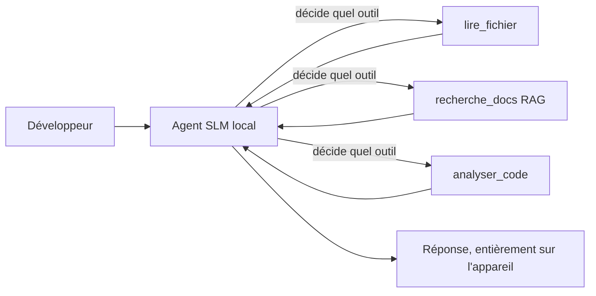
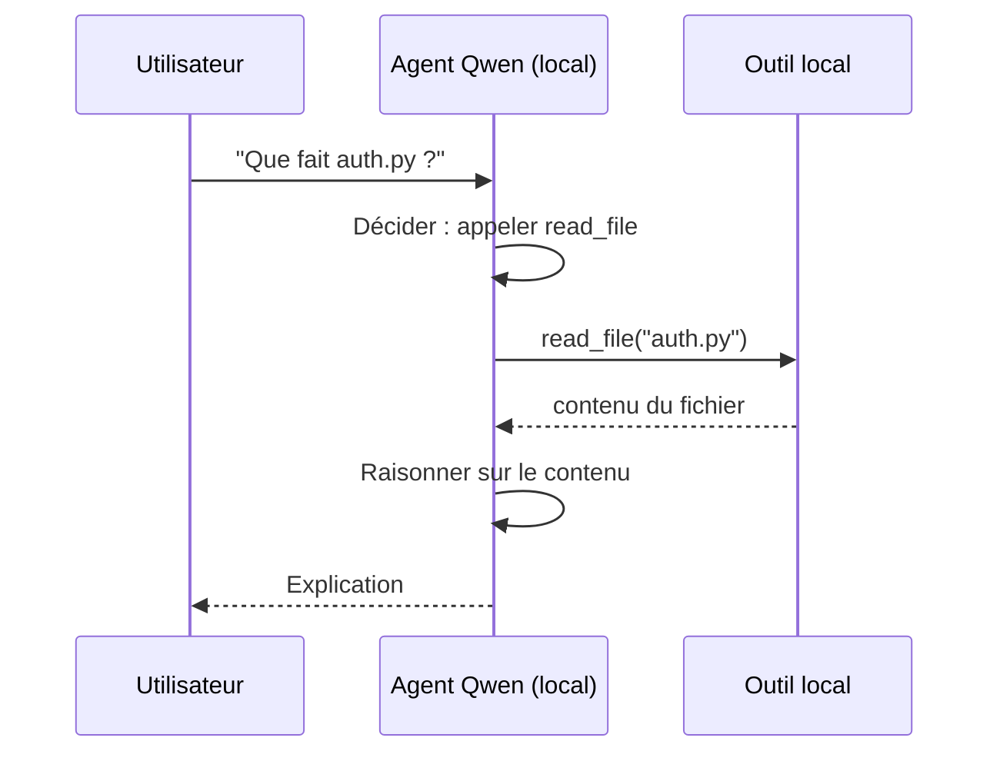
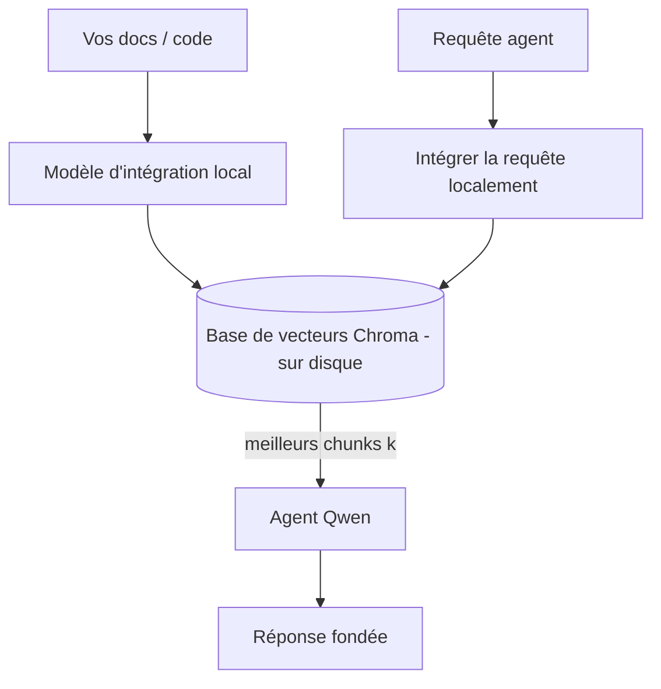
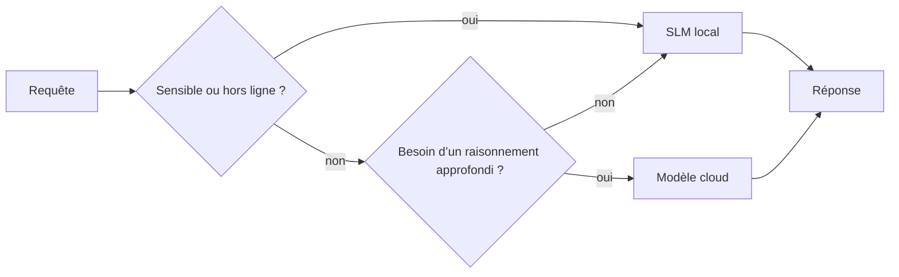

# Création d'agents IA locaux avec Microsoft Foundry Local et Qwen


La leçon précédente a étendu les agents *vers le haut* dans le cloud. Celle-ci les ramène *vers le bas* sur une seule machine. À la fin, vous aurez un assistant d'ingénierie fonctionnel qui raisonne, appelle des outils, lit vos fichiers et recherche dans votre documentation — **sans aucune requête d'inférence dans le cloud.**

Pourquoi voudriez-vous cela ? Trois raisons qui reviennent constamment dans le travail d'ingénierie réel :

- **Confidentialité.** Le code et les documents ne quittent jamais la machine. Aucune invite, aucun extrait, aucune donnée client ne traverse la frontière du réseau.
- **Coût.** L'inférence locale ne génère pas de facturation par token. Vous pouvez itérer toute la journée au prix de l'électricité.
- **Hors ligne.** Dans un avion, dans une installation sécurisée ou lors d'une panne, l'agent fonctionne toujours.

Le compromis est que vous échangez un modèle cloud de pointe contre un **Petit Modèle de Langage (SLM)** qui tourne sur votre CPU, GPU ou NPU. Cette leçon porte sur la construction d'agents qui sont *bons* dans cette contrainte plutôt que de faire comme si elle n'existait pas.

## Introduction

Cette leçon couvrira :

- **Petits Modèles de Langage (SLM)** — ce qu'ils sont, où ils excellent et où ils ne le font pas.
- **Microsoft Foundry Local** — un runtime qui télécharge et sert des modèles sur l'appareil via une **API compatible OpenAI**.
- **Modèles Qwen à appel de fonction** — des SLM qui produisent de manière fiable des appels d'outil, ce qui rend possibles les agents locaux (pas seulement le chat local).
- **Outils locaux, RAG local et MCP local** — donnant des capacités à l'agent sans le cloud.
- **Schémas hybrides** — quand garder les choses locales et quand utiliser le cloud.

## Objectifs d'apprentissage

Après avoir terminé cette leçon, vous saurez comment :

- Expliquer les compromis des SLM et choisir les cas d'utilisation appropriés pour les agents locaux.
- Servir un modèle Qwen localement avec Foundry Local et s’y connecter via le point de terminaison compatible OpenAI.
- Construire un agent appelant des outils qui fonctionne entièrement sur votre poste de travail.
- Ajouter un RAG local sur vos propres documents à l’aide d’une base vectorielle locale (Chroma).
- Connecter l'agent à un serveur MCP local et raisonner sur des conceptions hybrides local/cloud.

## Prérequis

Cette leçon suppose que vous avez complété les leçons précédentes et êtes à l’aise avec :

- [Utilisation d'outils](../04-tool-use/README.md) (Leçon 4) et [Agentic RAG](../05-agentic-rag/README.md) (Leçon 5).
- [Protocoles agentiques / MCP](../11-agentic-protocols/README.md) (Leçon 11).
- Le [Microsoft Agent Framework](../14-microsoft-agent-framework/README.md) (Leçon 14).

Vous aurez aussi besoin de :

- Un poste de travail pour développeur. **8 Go de RAM est un minimum réaliste** ; 16 Go+ est confortable. Un GPU ou NPU est utile mais pas obligatoire.
- **Microsoft Foundry Local** installé (voir la section installation ci-dessous).
- Python 3.12+ et les paquets dans le dépôt [`requirements.txt`](../../../requirements.txt), plus `foundry-local-sdk`, `openai`, et `chromadb` pour cette leçon.

## Petits Modèles de Langage : L’outil adapté pour le travail local

Un modèle cloud de pointe a des centaines de milliards de paramètres et un centre de données derrière. Un SLM a quelques milliards de paramètres et doit tenir dans la RAM de votre ordinateur portable. Cette différence fixe des attentes claires.

**Les SLM excellent pour :**

- Tâches structurées et délimitées — classification, extraction, résumé d'un document connu.
- **Appel d’outils** — décider quelle fonction appeler et avec quels arguments.
- Itération rapide, peu coûteuse, et privée sur vos propres données.

**Les SLM sont moins performants pour :**

- Raisonnement ouvert, à plusieurs étapes, sur un contexte large.
- Connaissances générales étendues (ils ont vu moins et oublient plus).

La stratégie gagnante pour les agents locaux est donc : **laissez le SLM orchestrer, et laissez les outils faire le gros du travail.** Le modèle n’a pas besoin de *connaître* votre base de code — il doit savoir quand appeler `read_file` et `search_docs`. Cela correspond directement aux forces des SLM.



## Microsoft Foundry Local

**Microsoft Foundry Local** est un runtime léger qui télécharge, gère et sert les modèles entièrement sur votre machine. Sa caractéristique la plus importante pour nous est qu’il expose un **point de terminaison HTTP compatible OpenAI** — ce qui signifie que le SDK OpenAI et le client OpenAI du Microsoft Agent Framework fonctionnent avec lui en ne changeant que le `base_url`. Tout ce que vous avez appris sur la création d’agents se transfère directement ; seul le point de terminaison passe du cloud à `localhost`.

Foundry Local choisit aussi automatiquement la meilleure version d’un modèle pour votre matériel — une version CPU, CUDA/GPU, ou NPU — vous n’avez donc pas à l’optimiser à la main pour chaque machine.

### Installation

Installez Foundry Local (voir la [documentation](https://learn.microsoft.com/azure/ai-foundry/foundry-local/) pour votre système d’exploitation), puis vérifiez son bon fonctionnement :

```bash
# Installer (exemple ; suivez la documentation pour votre plateforme)
winget install Microsoft.FoundryLocal      # Windows
# brew install microsoft/foundrylocal/foundrylocal   # macOS

# Télécharger et exécuter un modèle Qwen, puis démarrer le service local
foundry model run qwen2.5-7b-instruct
foundry service status
```

Une fois le service lancé, vous avez un point de terminaison local compatible OpenAI (généralement `http://localhost:PORT/v1`). Le notebook utilise `foundry-local-sdk` pour découvrir automatiquement ce point de terminaison, vous n’avez donc pas besoin de coder en dur le port.

## Appel de fonction Qwen : pourquoi c’est important

Un agent n’est agent que s’il peut appeler des outils. Beaucoup de SLM peuvent chater mais produisent des appels d’outils peu fiables ou mal formés. Les modèles **Qwen** sont entraînés pour l’appel de fonction et émettent constamment des structures d’appel d’outil bien formées — ce qui transforme un modèle de chat local en un *agent* local.

Le flux est la boucle standard d’appel d’outil que vous connaissez déjà, juste exécutée sur l’appareil :



## RAG local

La recherche dans la documentation est le domaine où les agents locaux justifient leur utilité. Au lieu d’espérer que le SLM ait mémorisé la doc de votre framework, vous intégrez cette doc dans une **base vectorielle locale** et laissez l’agent récupérer les morceaux pertinents à la demande.

Nous utilisons **Chroma**, un magasin vectoriel embarqué qui tourne en processus sans serveur à gérer. La chaîne est entièrement locale : modèle d’embedding local → vecteurs locaux → récupération locale → SLM local.



C’est le même schéma Agentic RAG que dans la Leçon 5 — la seule différence est que tous les composants tournent sur votre machine.

## Serveurs MCP locaux

[MCP](../11-agentic-protocols/README.md) est un protocole de transport, pas un service cloud. Un serveur MCP peut tourner en local comme processus sur `stdio`, exposant des outils à votre agent via ce protocole standard. Cela vous permet de réutiliser l’écosystème croissant des serveurs MCP — accès fichiers, opérations git, requêtes base de données — entièrement hors ligne.

La posture de sécurité diffère du cloud, mais n’est pas absente : un serveur MCP local tourne toujours avec les permissions de votre utilisateur, donc limitez son accès (par exemple un dossier projet, pas tout votre dossier personnel) et traitez ses sorties comme des entrées à valider.

## Schémas hybrides cloud et local

Local d’abord ne signifie pas local uniquement. Les systèmes matures routent selon la sensibilité et la difficulté :

| Situation | Où ça tourne |
| --- | --- |
| Code / données sensibles, ou hors ligne | **SLM local** |
| Tâche simple et délimitée | **SLM local** (pas cher, rapide) |
| Raisonnement multi-étape complexe sur données non sensibles | **Modèle cloud** |
| Tout, en cas de panne | **SLM local** (dégradation progressive) |

Cela reflète l'idée de **routage des modèles** de la Leçon 16 — sauf qu’un des « modèles » est maintenant votre propre machine. Une conception robuste bascule sur le local quand le cloud est indisponible, ainsi la qualité de l’agent se dégrade doucement plutôt que de tomber en panne.



## Atelier pratique : un assistant d’ingénierie local

Ouvrez [`code_samples/17-local-agent-foundry-local.ipynb`](./code_samples/17-local-agent-foundry-local.ipynb) et suivez-le pas à pas. Vous construirez un **assistant d’ingénierie local** qui fonctionne entièrement sur votre poste de travail et peut :

1. **Appeler des outils** — via l’appel de fonction Qwen avec Foundry Local.
2. **Effectuer des opérations sur fichiers locales** — lister et lire des fichiers dans un dossier projet.
3. **Analyser du code** — rapporter des métriques basiques sur un fichier source.
4. **Chercher dans la documentation** — RAG local sur un dossier doc avec Chroma.
5. **Utiliser MCP** — se connecter à un serveur MCP local (avec une omission gracieuse si aucun n’est configuré).

Aucune inférence cloud n'est utilisée à aucun moment.

### Parcours guidé

L’assistant se connecte à Foundry Local via le point de terminaison compatible OpenAI, donc le code agent ressemble presque exactement à celui des leçons cloud — seul le client change :

```python
from foundry_local import FoundryLocalManager
from openai import OpenAI

# Foundry Local découvre/télécharge le modèle et nous fournit un point de terminaison local.
manager = FoundryLocalManager(\"qwen2.5-7b-instruct\")
client = OpenAI(base_url=manager.endpoint, api_key=manager.api_key)  # api_key est un espace réservé local
```

Les outils sont des fonctions Python ordinaires limitées à un répertoire projet :

```python
def read_file(path: str) -> str:
    \"\"\"Read a file, but only inside the sandboxed project directory.\"\"\"
    full = (PROJECT_ROOT / path).resolve()
    if PROJECT_ROOT not in full.parents and full != PROJECT_ROOT:
        return \"Access denied: path is outside the project directory.\"
    return full.read_text(encoding=\"utf-8\")
```

Notez la vérification sandbox — même en local, un outil qui lit des chemins arbitraires est un risque. Le notebook limite chaque outil à une racine de projet unique.

## Vérification des connaissances

Testez votre compréhension avant de passer à l'exercice.

**1. Donnez deux raisons concrètes pour exécuter un agent localement plutôt que dans le cloud.**

<details>
<summary>Réponse</summary>

N’importe lesquelles de ces deux : **confidentialité** (code et données ne quittent jamais la machine), **coût** (pas de facturation par token d'inférence), et **capacité hors ligne** (fonctionne sans réseau — en avion, dans une installation sécurisée, ou lors d'une panne). Les contraintes réglementaires/compliantes qui interdisent d’envoyer des données hors de l’appareil motivent souvent la confidentialité.
</details>

**2. Quelle est la division du travail recommandée entre un SLM et ses outils dans un agent local, et pourquoi ?**

<details>
<summary>Réponse</summary>

Laissez le SLM **orchestrer** (décider quel outil appeler et avec quels arguments) et laissez les **outils faire le gros du travail** (lecture des fichiers, récupération des docs, calcul des résultats). Les SLM sont forts pour des décisions limitées comme le choix des outils mais faibles pour la connaissance générale large et le raisonnement multi-étapes long, donc reposer sur les outils joue sur leurs forces.
</details>

**3. Qu’est-ce qui permet de réutiliser le code d’agents cloud avec Foundry Local ?**

<details>
<summary>Réponse</summary>

Foundry Local expose un **point de terminaison HTTP compatible OpenAI**. Le SDK OpenAI et le client OpenAI du Framework Agent fonctionnent avec lui en ne changeant que le `base_url` (et en utilisant une clé API locale factice). Tout le reste dans le code agent reste identique.
</details>

**4. Pourquoi utilisons-nous spécifiquement un modèle Qwen d’appel de fonction plutôt qu’un autre SLM ?**

<details>
<summary>Réponse</summary>

Parce qu’un agent doit produire des **appels d’outil** fiables et bien formés. Beaucoup de SLM peuvent chatter mais émettent des structures d’appel d’outil mal formées ou incohérentes. Les modèles Qwen sont entraînés pour l’appel de fonction et produisent des appels cohérents, ce qui transforme un modèle de chat local en un agent local fonctionnel.
</details>

**5. Dans la chaîne RAG locale, quels composants tournent sur la machine ?**

<details>
<summary>Réponse</summary>

Tous : le modèle d’embedding, la base vectorielle (Chroma, sur disque), l’étape de récupération, et le SLM. Les documents sont embarqués localement, stockés localement, récupérés localement, et traités par un modèle local — aucun composant ne touche le cloud.
</details>

**6. Un serveur MCP local tourne sur votre machine. Cela le rend-il automatiquement sûr ? Quelle précaution devez-vous quand même prendre ?**

<details>
<summary>Réponse</summary>

Non. Un serveur MCP local tourne avec les permissions de votre utilisateur, donc il peut accéder à tout ce que vous pouvez. Limitez-le à ce dont il a besoin (par exemple, un seul dossier projet au lieu de tout votre dossier personnel) et traitez ses sorties comme des entrées à valider avant d’agir.
</details>

**7. Décrivez une règle de routage hybride sensée incluant un modèle local.**

<details>
<summary>Réponse</summary>

Orientez les requêtes sensibles ou hors ligne vers le SLM local ; orientez les tâches simples et délimitées vers le SLM local pour la rapidité et le coût ; orientez le raisonnement multi-étapes complexe sur données non sensibles vers un modèle cloud ; et basculez sur le SLM local si le cloud est indisponible afin que l’agent se dégrade avec grâce au lieu d’échouer. C’est le routage des modèles (Leçon 16) avec la machine locale comme l’un des modèles.
</details>

**8. Quelle est une quantité réaliste de RAM minimale pour faire tourner l’agent local de cette leçon, et qu’est-ce que plus de RAM vous apporte ?**

<details>
<summary>Réponse</summary>

Environ **8 Go** est un minimum réaliste ; 16 Go+ est confortable. Plus de RAM vous permet d’exécuter des modèles plus grands et plus performants et de garder plus de contexte en mémoire. Un GPU ou NPU accélère l’inférence mais n’est pas obligatoire — Foundry Local choisit une version CPU quand aucun accélérateur n’est disponible.
</details>

## Exercice

Étendez l’assistant d’ingénierie local en un **relecteur de documentation local** pour un petit projet de votre choix (vous pouvez utiliser un des dossiers de leçon de ce dépôt si vous le souhaitez).

Votre soumission doit :

1. **Indexer un vrai dossier docs/code** dans Chroma (au moins cinq fichiers).
2. **Ajouter un outil `find_todos`** qui scanne le projet à la recherche des commentaires `TODO`/`FIXME` et les renvoie avec fichier et numéro de ligne — en conservant la même vérification sandbox que `read_file`.

3. **Posez trois questions à l'agent** qui l'obligent à combiner des outils : une question purement RAG, une qui nécessite de lire un fichier spécifique, et une qui exige de trouver des TODO.
4. **Mesurez-le** : chronométrez chacune des trois réponses et notez-les dans une cellule markdown. Commentez si la latence est acceptable pour votre flux de travail prévu.

Ensuite, rédigez un court paragraphe sur **ce que vous déplaceriez vers le cloud et ce que vous garderiez en local** pour ce réviseur, et pourquoi. Votre évaluation portera sur la bonne interconnexion des composants locaux et sur la solidité de votre raisonnement hybride — pas sur la qualité du modèle.

## Résumé

Dans cette leçon, vous avez construit un agent qui fonctionne entièrement sur votre propre machine :

- Les **SLMs** troquent la largeur de domaine pour la confidentialité, le coût et le fonctionnement hors ligne — et excellent lorsqu'ils **orchestrent des outils** plutôt que de porter eux-mêmes toute la connaissance.
- **Foundry Local** sert des modèles sur l'appareil via un **point de terminaison compatible OpenAI**, de sorte que votre code d'agent cloud se transfère avec un changement d'une ligne.
- Les **modèles Qwen à appels de fonction** permettent un appel local fiable d'outils — et donc des *agents* locaux.
- Le **RAG local** (Chroma) et le **MCP local** donnent à l'agent la capacité sans quitter la machine.
- Les **modèles hybrides** vous permettent de router selon la sensibilité et la difficulté, avec le local comme solution de secours élégante.

Cela complète l'arc de déploiement : la Leçon 16 a étendu les agents dans Microsoft Foundry, cette leçon les a réduits à une seule station de travail. La leçon suivante porte sur la sécurisation des agents déployés.

## Ressources supplémentaires

- <a href="https://learn.microsoft.com/azure/ai-foundry/foundry-local/" target="_blank">Documentation Microsoft Foundry Local</a>
- <a href="https://learn.microsoft.com/azure/ai-foundry/what-is-azure-ai-foundry" target="_blank">Documentation Microsoft Foundry</a>
- <a href="https://learn.microsoft.com/en-us/agent-framework/overview/?wt.mc_id=youtube_26688_organicsocial_reactor&pivots=programming-language-python" target="_blank">Microsoft Agent Framework</a>
- <a href="https://qwen.readthedocs.io/en/latest/framework/function_call.html" target="_blank">Documentation sur les appels de fonction Qwen</a>
- <a href="https://modelcontextprotocol.io/" target="_blank">Modèle Contextuel de Protocole (MCP)</a>
- <a href="https://docs.trychroma.com/" target="_blank">Base de données vectorielle Chroma</a>

## Leçon précédente

[Déploiement d'agents évolutifs](../16-deploying-scalable-agents/README.md)

## Leçon suivante

[Sécuriser les agents IA](../18-securing-ai-agents/README.md)

---

<!-- CO-OP TRANSLATOR DISCLAIMER START -->
**Avertissement** :
Ce document a été traduit à l'aide du service de traduction automatique [Co-op Translator](https://github.com/Azure/co-op-translator). Bien que nous nous efforçions d'assurer l'exactitude, veuillez noter que les traductions automatisées peuvent contenir des erreurs ou des inexactitudes. Le document original dans sa langue native doit être considéré comme la source faisant autorité. Pour les informations critiques, il est recommandé de recourir à une traduction professionnelle réalisée par un humain. Nous ne saurions être tenus responsables des malentendus ou erreurs d'interprétation découlant de l'utilisation de cette traduction.
<!-- CO-OP TRANSLATOR DISCLAIMER END -->