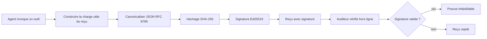
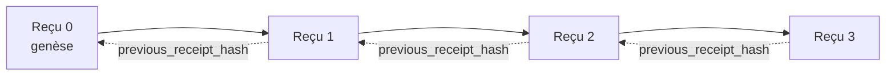

[Regardez la vidéo de la leçon : Sécuriser les agents IA avec des reçus cryptographiques](https://youtu.be/PLACEHOLDER_VIDEO_ID)

> _(Vidéo de la leçon et vignette à ajouter par l'équipe de contenu Microsoft après fusion, selon le modèle des leçons 14 / 15.)_

# Sécuriser les agents IA avec des reçus cryptographiques

## Introduction

Cette leçon couvrira :

- Pourquoi les pistes d'audit pour les agents IA sont importantes pour la conformité, le débogage et la confiance.
- Ce qu'est un reçu cryptographique et comment il diffère d'une ligne de journal non signée.
- Comment produire un reçu signé pour un appel d'outil d'un agent en Python simple.
- Comment vérifier un reçu hors ligne et détecter les falsifications.
- Comment chaîner les reçus pour que supprimer ou réordonner l'un d'eux casse la chaîne.
- Ce que les reçus prouvent et ce qu'ils ne prouvent explicitement pas.

## Objectifs d'apprentissage

Après avoir complété cette leçon, vous saurez :

- Identifier les modes de défaillance qui motivent la provenance cryptographique des actions d'un agent.
- Produire un reçu signé Ed25519 sur une charge utile JSON canonique.
- Vérifier un reçu indépendamment en utilisant uniquement la clé publique du signataire.
- Détecter une falsification en relançant la vérification sur un reçu modifié.
- Construire une séquence de reçus chaînés par hachage et expliquer pourquoi la chaîne est importante.
- Reconnaître la limite entre ce que les reçus prouvent (attribution, intégrité, ordre) et ce qu'ils ne prouvent pas (exactitude de l'action, bien-fondé de la politique).

## Le problème : la piste d'audit de votre agent

Imaginez que vous avez déployé un agent IA pour Contoso Travel. L'agent lit les demandes clients, appelle une API de vols pour rechercher des options, et réserve des sièges pour le client. Le trimestre dernier, l'agent a traité 50 000 réservations.

Aujourd'hui un auditeur arrive. Il pose une question simple : « Montrez-moi ce que votre agent a fait. »

Vous lui remettez vos fichiers journaux. L'auditeur les examine et pose une question plus difficile : « Comment puis-je savoir que ces journaux n'ont pas été modifiés ? »

C'est le problème de la piste d'audit. La plupart des déploiements d'agents reposent aujourd'hui sur :

- **Logs d'application** : écrits par l'agent lui-même, modifiables par quiconque a accès au système de fichiers.
- **Services de journalisation cloud** : à preuve de falsification au niveau de la plateforme, mais seulement si l'auditeur fait confiance à l’opérateur de la plateforme.
- **Logs de transactions de base de données** : adaptés aux modifications de bases de données mais pas aux appels arbitraires d'outils.

Aucun de ces systèmes ne peut répondre à la question de l'auditeur sans que celui-ci doive faire confiance à quelqu'un (vous, votre fournisseur cloud, votre fournisseur de base de données). Pour un usage interne, cette confiance est souvent acceptable. Pour des charges réglementées (finances, santé, tout ce qui est soumis à la loi européenne sur l'IA), ce ne l'est pas.

Les reçus cryptographiques résolvent cela en rendant chaque action d'agent vérifiable indépendamment. L'auditeur n'a pas besoin de vous faire confiance. Il n’a besoin que de votre clé publique et du reçu lui-même.

## Qu'est-ce qu'un reçu cryptographique ?

Un reçu est un objet JSON qui enregistre ce qu’un agent a fait, signé avec une signature numérique.


  
Un reçu minimal ressemble à ceci :

```json
{
  "type": "agent.tool_call.v1",
  "agent_id": "contoso-travel-bot",
  "tool_name": "lookup_flights",
  "tool_args_hash": "sha256:a3f9c1...",
  "result_hash": "sha256:7b2e1d...",
  "policy_id": "contoso-travel-policy-v3",
  "timestamp": "2026-04-25T14:30:00Z",
  "sequence": 47,
  "previous_receipt_hash": "sha256:9d4e6a...",
  "signature": {
    "alg": "EdDSA",
    "sig": "c5af83...",
    "public_key": "8f3b2c..."
  }
}
```
  
Trois propriétés font le travail :

1. **La signature**. Le reçu est signé par la passerelle de l’agent avec une clé privée Ed25519. Quiconque possède la clé publique correspondante peut vérifier la signature hors ligne. Toute falsification d'un champ invalide la signature.

2. **Encodage canonique**. Avant la signature, le reçu est sérialisé en utilisant le JSON Canonicalization Scheme (JCS, RFC 8785). Cela garantit que deux implémentations produisant le même reçu logique produisent une sortie identique en octets. Sans canonisation, différents sérialiseurs JSON produiraient des signatures différentes pour le même contenu.

3. **Chaînage par hachage**. Le champ `previous_receipt_hash` relie chaque reçu à celui qui le précède. Supprimer ou réordonner un reçu casse tous les reçus suivants. La falsification devient visible au niveau de la chaîne même si les signatures individuelles sont contournées.

Ces propriétés fournissent ensemble trois garanties :

- **Attribution** : cette clé a signé ce contenu.
- **Intégrité** : le contenu n’a pas changé depuis la signature.
- **Ordre** : ce reçu est venu après ce reçu dans la chaîne.

## Produire un reçu en Python

Vous n’avez pas besoin d’une bibliothèque spéciale pour produire un reçu. Les primitives cryptographiques sont largement disponibles et la logique tient en quelques dizaines de lignes de Python.

Les exercices pratiques dans `code_samples/18-signed-receipts.ipynb` expliquent tout le processus. La version résumée :

```python
import json
import hashlib
import base64
from nacl import signing
from jcs import canonicalize  # JSON canonique RFC 8785

def b64url_nopad(data: bytes) -> str:
    return base64.urlsafe_b64encode(data).decode("ascii").rstrip("=")

def sha256_canonical(obj) -> str:
    """SHA-256 of a Python object's JCS-canonical JSON form."""
    return f"sha256:{hashlib.sha256(canonicalize(obj)).hexdigest()}"

# Générer ou charger une clé de signature (en production, stocker dans un coffre à clés)
signing_key = signing.SigningKey.generate()
verify_key = signing_key.verify_key

# Construire la charge utile du reçu (pas encore de signature)
tool_args = {"origin": "SYD", "destination": "LAX"}
tool_result = [{"flight": "QF11", "price": 1850, "stops": 0}]

payload = {
    "type": "agent.tool_call.v1",
    "agent_id": "contoso-travel-bot",
    "tool_name": "lookup_flights",
    "tool_args_hash": sha256_canonical(tool_args),
    "result_hash": sha256_canonical(tool_result),
    "policy_id": "contoso-travel-policy-v3",
    "timestamp": "2026-04-25T14:30:00Z",
    "sequence": 0,
    "previous_receipt_hash": None,
}

# Canoniser, hacher, signer.
canonical_bytes = canonicalize(payload)
message_hash = hashlib.sha256(canonical_bytes).digest()
signature_bytes = signing_key.sign(message_hash).signature

# Attacher un objet de signature structuré.
receipt = {
    **payload,
    "signature": {
        "alg": "EdDSA",
        "sig": b64url_nopad(signature_bytes),
        "public_key": b64url_nopad(bytes(verify_key)),
    },
}
```
  
Voici toute la chaîne de signature. Les exercices du notebook expliquent chaque étape.

## Vérifier un reçu et détecter les falsifications

La vérification est l’opération inverse :

```python
import base64
import hashlib
from nacl import signing
from nacl.exceptions import BadSignatureError
from jcs import canonicalize

def b64url_decode(s: str) -> bytes:
    padding = "=" * ((4 - len(s) % 4) % 4)
    return base64.urlsafe_b64decode(s + padding)

def verify_receipt(receipt: dict) -> bool:
    # La signature est un objet structuré : {"alg", "sig", "public_key"}.
    sig_obj = receipt.get("signature")
    if not sig_obj or sig_obj.get("alg") != "EdDSA":
        return False

    # Reconstruire la charge utile qui a effectivement été signée (tout sauf la signature).
    payload = {k: v for k, v in receipt.items() if k != "signature"}

    canonical_bytes = canonicalize(payload)
    message_hash = hashlib.sha256(canonical_bytes).digest()

    try:
        verify_key = signing.VerifyKey(b64url_decode(sig_obj["public_key"]))
        verify_key.verify(message_hash, b64url_decode(sig_obj["sig"]))
        return True
    except BadSignatureError:
        return False
```
  
Cette fonction prend un reçu et renvoie `True` si la signature est valide, `False` sinon. Pas d’appel réseau, pas de dépendance à un service, aucune confiance requise envers une tierce partie.

Pour voir la détection de la falsification en action, le notebook suit :

1. Production d’un reçu valide et confirmation de sa vérification.
2. Modification d’un octet dans le champ `tool_args_hash`.
3. Re-lancement de la vérification et constat d’un échec.

C’est la démonstration pratique que les reçus sont à preuve de falsification : toute modification, même minime, casse la signature.

## Chaîner des reçus pour des agents multi-étapes

Un reçu signé protège une action unique. Une chaîne de reçus protège une séquence.


  
Chaque reçu enregistre le hachage du reçu qui le précède. Pour supprimer discrètement le reçu 2, un attaquant devrait soit :

- Modifier le champ `previous_receipt_hash` du reçu 3 (ce qui casse la signature du reçu 3), OU
- Forger une nouvelle signature sur le reçu 3 modifié (ce qui nécessite la clé privée de l’agent).

Si la clé privée est dans un coffre-fort matériel et que vous publiez la clé publique avec chaque reçu, aucune des deux attaques n’est réalisable sans détection.

Le notebook explique :

1. La création d’une chaîne de trois reçus.
2. La vérification que chaque `previous_receipt_hash` correspond bien au hachage réel du reçu précédent.
3. La falsification d’un reçu au milieu de la chaîne et la rupture visible de la chaîne exactement à ce point.

C’est ainsi que vous produisez une piste d'audit qu’un auditeur externe peut vérifier sans vous faire confiance.

## Ce que les reçus prouvent (et ce qu’ils ne prouvent pas)

C’est la section la plus importante de cette leçon. Les reçus sont puissants mais leur pouvoir est borné.

**Les reçus prouvent trois choses :**

1. **Attribution** : une clé spécifique a signé une charge utile spécifique.
2. **Intégrité** : la charge utile n’a pas changé depuis la signature.
3. **Ordre** : ce reçu vient après ce reçu dans la chaîne de hachage.

**Les reçus NE prouvent PAS :**

1. **Exactitude** : que l’action de l’agent était la bonne action. Un reçu peut être signé pour une réponse erronée aussi proprement que pour une bonne réponse.
2. **Conformité à la politique** : que la politique référencée dans `policy_id` a été effectivement évaluée, ou qu’elle aurait permis cette action si elle avait été vérifiée. Le reçu enregistre ce qui a été affirmé, pas ce qui a été appliqué.
3. **Identité au-delà de la clé** : le reçu dit « cette clé a signé ce contenu ». Il ne dit pas « cet humain a autorisé cela ». Relier une clé à une personne ou une organisation nécessite une infrastructure d'identité séparée (un annuaire, un registre de clés publiques, etc.).
4. **Véracité des entrées** : si l’agent reçoit une invite modifiée et agit en conséquence, le reçu enregistre fidèlement l’action. Les reçus sont en aval de la validation des entrées, pas un substitut à celle-ci.

Cette limite est importante pour deux raisons :

- Elle indique à quoi servent les reçus : rendre le comportement de l’agent auditable et à preuve de falsification, même au-delà des frontières organisationnelles.
- Elle indique quelles couches supplémentaires sont encore nécessaires : validation des entrées (Leçon 6), application de politiques (abordée brièvement ci-dessous), et infrastructure d’identité (hors de portée de cette leçon).

Une erreur fréquente est de supposer que « nous avons des reçus » signifie « nous sommes gouvernés ». Ce n’est pas le cas. Les reçus sont une base. La gouvernance est le système que vous construisez par-dessus.

## Références en production

Le code Python de cette leçon est délibérément minimal pour que vous puissiez lire chaque ligne et comprendre précisément ce qui se passe. En production, vous avez deux options :

1. **Construire directement sur les primitives cryptographiques.** Les 50 lignes vues plus haut suffisent pour de nombreux cas d’usage. PyNaCl (Ed25519) et le paquet `jcs` (JSON canonique) sont des bibliothèques bien maintenues et auditées.

2. **Utiliser une bibliothèque de reçus en production.** Plusieurs projets open source implémentent le même modèle avec des fonctionnalités supplémentaires (rotation de clés, vérification par lots, distribution JWK Set, intégration avec des moteurs de politique) :
   - Le format de reçu utilisé dans cette leçon suit un Internet-Draft IETF (`draft-farley-acta-signed-receipts`) en cours de normalisation.
   - Le Microsoft Agent Governance Toolkit compose des reçus avec des décisions basées sur Cedar ; voir le Tutoriel 33 dans ce dépôt pour un exemple complet.
   - Les paquets `protect-mcp` (npm) et `@veritasacta/verify` (npm) fournissent une implémentation Node de signature et de vérification hors ligne des reçus, conçue pour encapsuler tout serveur MCP avec une piste d’audit à preuve de falsification.

Le choix entre créer soi-même ou utiliser une bibliothèque est similaire au choix entre écrire sa propre bibliothèque JWT ou utiliser une bibliothèque testée : les deux sont raisonnables ; la bibliothèque économise du temps et réduit la surface d’audit ; l’approche from-scratch vous force à comprendre chaque primitive. Cette leçon enseigne la voie from-scratch afin que vous ayez les bases pour l’un ou l’autre choix.

## Vérification des connaissances

Testez votre compréhension avant de passer à l'exercice pratique.

**1. Un reçu est signé avec la clé privée Ed25519 de l’agent. L’auditeur n’a que la clé publique. L’auditeur peut-il vérifier le reçu hors ligne ?**

<details>
<summary>Réponse</summary>

Oui. La vérification Ed25519 nécessite uniquement la clé publique et les octets signés. Pas d’appel réseau, pas de dépendance à un service. C’est cette propriété qui rend les reçus utiles dans des contextes déconnectés, multi-organisationnels, ou de faible confiance.
</details>

**2. Un attaquant modifie le champ `policy_id` d’un reçu pour dire qu’il était gouverné par une politique plus permissive. La signature portait sur la charge utile originale. Que se passe-t-il lors de la vérification ?**

<details>
<summary>Réponse</summary>

La vérification échoue. La signature a été calculée sur les octets canoniques de la charge utile originale ; modifier un champ change ces octets, donc change le hachage SHA-256, ce qui rend la signature invalide. L’attaquant aurait besoin de la clé privée pour produire une nouvelle signature valide, ce qu’il n’a pas.
</details>

**3. Pourquoi le reçu inclut-il un `tool_args_hash` et un `result_hash` plutôt que les arguments et résultats bruts ?**

<details>
<summary>Réponse</summary>

Pour deux raisons. D’abord, le reçu peut devoir être archivé ou transmis dans des environnements où divulguer le contenu brut (Données personnelles, données business) pose problème. Le hachage rend le reçu petit et le contenu privé ; l’auditeur vérifie que le hachage correspond à une copie du contenu stocké séparément. Ensuite, les hachages ont une taille fixe ; un reçu avec hachages est limité en taille quel que soit le volume des entrées et sorties.
</details>

**4. Le champ `previous_receipt_hash` relie chaque reçu à son prédécesseur. Si un attaquant supprime discrètement un reçu en milieu de chaîne, qu’est-ce qui devient invalide ?**

<details>
<summary>Réponse</summary>

Tous les reçus qui suivent le reçu supprimé. Leurs champs `previous_receipt_hash` ne correspondent plus à la chaîne réelle (car le reçu référencé n’existe plus, ou la chaîne pointe désormais vers un prédécesseur différent). Pour cacher la suppression, l’attaquant devrait resignarer chaque reçu ultérieur, ce qui nécessite la clé privée.
</details>

**5. Un reçu vérifie correctement. Cela prouve-t-il que l’action de l’agent était correcte, conforme, ou fondée ?**

<details>
<summary>Réponse</summary>

Non. Un reçu valide prouve trois choses : attribution (cette clé a signé ce contenu), intégrité (le contenu n’a pas changé), et ordre (ce reçu vient après un autre). Il ne prouve PAS que l’action était correcte, que la politique dans `policy_id` a été évaluée, ou que l’agent a suivi toutes les règles. Les reçus rendent le comportement de l’agent auditable, pas nécessairement correct. C’est la limite la plus importante de cette leçon.
</details>

## Exercice pratique

Ouvrez `code_samples/18-signed-receipts.ipynb` et complétez les quatre sections :

1. **Section 1** : Signez votre premier reçu et vérifiez-le.
2. **Section 2** : Falsifiez le reçu et observez l’échec de la vérification.
3. **Section 3** : Construisez une chaîne de trois reçus et vérifiez l’intégrité de la chaîne.
4. **Section 4** : Appliquez le modèle à un agent construit avec Microsoft Agent Framework : encapsulez un appel d’outil dans la signature du reçu, puis vérifiez le reçu indépendamment.

**Défi supplémentaire 1 :** étendez le schéma de reçu avec un champ supplémentaire de votre choix (par exemple, un identifiant de requête pour le traçage), mettez à jour la logique de signature canonique pour l’inclure, et confirmez que le reçu vérifie toujours correctement. Puis modifiez ce champ après signature et confirmez que la vérification échoue. Cela vous oblige à comprendre comment chaque octet de l’encodage canonique contribue à la signature.
**Défi avancé 2 :** Hachez ensemble avec SHA-256 deux de vos reçus (concaténez leurs octets canoniques dans un ordre déterministe) et intégrez le digest résultant comme un nouveau champ dans un troisième reçu avant de le signer. Vérifiez que les trois reçus peuvent toujours être convertis d'un format à l'autre. Vous venez de créer une preuve d'inclusion en une étape : toute personne possédant le troisième reçu peut prouver que les deux premiers existaient au moment où il a été signé, sans avoir besoin de révéler leur contenu. C’est le modèle utilisé à grande échelle par les reçus à divulgation sélective (engagements de Merkle, RFC 6962).

## Conclusion

Les reçus cryptographiques fournissent aux agents IA une piste d’audit qui est :

- **Indépendamment vérifiable** : toute partie disposant de la clé publique peut vérifier, sans dépendance à un service.
- **Résistante aux falsifications** : toute modification invalide la signature.
- **Portable** : un reçu est un petit fichier JSON ; il peut être archivé, transmis et vérifié partout.
- **Conforme aux normes** : basé sur Ed25519 (RFC 8032), JCS (RFC 8785) et SHA-256, tous des primitives largement déployées.

Ils ne remplacent pas la validation des entrées, l’application des politiques ou l’infrastructure d’identité. Ils sont une base pour ces couches. Lorsque vous déployez des agents dans des charges de travail réglementées, des flux de travail multi-organisationnels, ou dans tout contexte où un auditeur futur ne peut pas être supposé vous faire confiance, les reçus sont le moyen de rendre la piste d’audit honnête.

Le point le plus important : les reçus prouvent qui a dit quoi, quand. Ils ne prouvent pas que ce qui a été dit est vrai ou correct. Conservez bien cette distinction. C’est la différence entre un système de provenance honnête et un système trompeur.

## Liste de vérification pour la production

Lorsque vous êtes prêt à passer de cette leçon au déploiement d’agents signant des reçus dans un environnement réel :

- [ ] **Déplacez la clé de signature hors de l’ordinateur du développeur.** Utilisez Azure Key Vault, AWS KMS, ou un module de sécurité matériel. La clé privée signant vos reçus ne doit jamais être dans le contrôle de source ni en clair sur les machines applicatives.
- [ ] **Publiez la clé publique de vérification.** Les auditeurs en ont besoin pour vérifier hors ligne. Le modèle standard est un JWK Set accessible à une URL bien connue (RFC 7517), par exemple `https://your-org.example.com/.well-known/agent-keys.json`.
- [ ] **Ancrez la chaîne à l’extérieur.** Écrivez périodiquement le hash du dernier maillon dans un journal de transparence (Sigstore Rekor, autorité de timestamp RFC 3161, ou un second système interne) pour qu’une partie externe puisse confirmer « cette chaîne existait à ce moment ».
- [ ] **Stockez les reçus de manière immuable.** Un stockage append-only (Azure Storage avec politique d’immutabilité, AWS S3 Object Lock) empêche une personne interne de réécrire l’histoire au niveau du stockage.
- [ ] **Décidez de la conservation.** De nombreux cadres réglementaires exigent une conservation multi-annuelle. Prévoyez la croissance des reçus (chaque reçu fait environ 500 octets ; un agent effectuant 10K appels par jour produit environ 1,8 Go par an).
- [ ] **Documentez ce que les reçus ne couvrent pas.** Les reçus prouvent l’attribution, l’intégrité et l’ordre. Votre guide opérationnel doit lister explicitement quels contrôles supplémentaires (validation des entrées, application des politiques, limitation du débit, infrastructure d’identité) s’ajoutent aux reçus dans votre posture de gouvernance.

### Vous avez d’autres questions sur la sécurisation des agents IA ?

Rejoignez le [Discord Microsoft Foundry](https://aka.ms/ai-agents/discord) pour rencontrer d’autres apprenants, participer à des permanences et obtenir des réponses à vos questions sur les agents IA.

## Au-delà de cette leçon

Cette leçon couvre la signature d’un seul reçu et les séquences en chaîne de hachage. Les mêmes primitives composent plusieurs modèles plus avancés que vous rencontrerez à mesure que votre posture de gouvernance progresse :

- **Divulgation sélective.** Quand les champs d’un reçu sont engagés indépendamment (arbre de Merkle à la RFC 6962), vous pouvez révéler certains champs à certains auditeurs et prouver que les autres n’ont pas été modifiés sans les exposer. Utile quand un même reçu doit satisfaire à la fois un audit complet (qui veut la totalité) et des réglementations sur la minimisation des données comme le RGPD (qui veulent que l’auditeur voie le moins possible).
- **Révocation des reçus.** Si une clé de signature est compromise, vous devez pouvoir marquer tous les reçus signés par cette clé comme non fiables à partir d’un moment donné. Modèles standard : clés de signature à courte durée de vie avec liste de révocation publiée, ou journal de transparence avec entrées de révocation.
- **Reçus bilatéraux / à signature partagée.** Certaines implémentations divisent la charge signée en deux moitiés pré-exécution (`authorization_*`) et post-exécution (`result_*`) avec des signatures indépendantes, utile quand la décision d’autorisation et le résultat observé sont produits par des acteurs différents ou à des moments différents. Cela s’ajoute de façon additive au format de reçu présenté dans cette leçon.
- **Composition de la charge.** Un reçu scelle tous les octets que vous mettez dans `result_hash`. Dans le monde réel, les charges sont souvent plus riches qu’un simple résultat d’appel d’outil : raisonnement pré-décision (prédiction modèle, options considérées, preuves et leur exhaustivité, posture de risque, chaîne de responsabilité, résultat de contrôle) peuvent tous être inclus dans la charge, scellés par un seul reçu. Cela garde le format du reçu minimal tout en permettant aux schémas de la charge d’évoluer domaine par domaine.
- **Conformité multi-implémentation.** Plusieurs implémentations indépendantes du même format de reçu (Python, TypeScript, Rust, Go) se vérifient via des vecteurs de tests partagés. Si vous créez votre propre implémentation, valider avec des vecteurs publiés confirme la compatibilité filaire.
- **Migration post-quantique.** Ed25519 est largement déployé aujourd’hui mais n’est pas résistant au quantique. Le format de reçu est agile sur le plan algorithmique : le champ `signature.alg` peut porter `ML-DSA-65` (le standard de signature post-quantique de NIST) lorsque vous devez migrer. Prévoyez une période de transition où les reçus sont doublement signés.

## Ressources supplémentaires

- <a href="https://datatracker.ietf.org/doc/draft-farley-acta-signed-receipts/" target="_blank">IETF Internet-Draft : Reçus de Décision Signés pour le Contrôle d’Accès Machine-à-Machine</a>
- <a href="https://learn.microsoft.com/azure/ai-studio/responsible-use-of-ai-overview" target="_blank">Vue d’ensemble de l’IA responsable (Azure AI)</a>
- <a href="https://datatracker.ietf.org/doc/html/rfc8032" target="_blank">RFC 8032 : Algorithme de signature numérique Edwards-Curve (EdDSA)</a>
- <a href="https://datatracker.ietf.org/doc/html/rfc8785" target="_blank">RFC 8785 : Schéma de Canonicalisation JSON (JCS)</a>
- <a href="https://datatracker.ietf.org/doc/html/rfc6962" target="_blank">RFC 6962 : Transparence des certificats</a> (construction d’arbre de Merkle utilisée par les reçus à divulgation sélective)
- <a href="https://github.com/microsoft/agent-governance-toolkit/blob/main/docs/tutorials/33-offline-verifiable-receipts.md" target="_blank">Microsoft Agent Governance Toolkit, Tutoriel 33 : Reçus de Décision Vérifiables Hors Ligne</a>
- <a href="https://github.com/ScopeBlind/agent-governance-testvectors" target="_blank">Vecteurs de test de conformité multi-implémentation</a> pour le format de reçu utilisé dans cette leçon (Apache-2.0)
- <a href="https://pynacl.readthedocs.io/" target="_blank">Documentation PyNaCl</a> (Ed25519 en Python)

## Leçon précédente

[Construction d’agents d’utilisation informatique (CUA)](../15-browser-use/README.md)

## Leçon suivante

_(À déterminer par les responsables du programme)_

---

<!-- CO-OP TRANSLATOR DISCLAIMER START -->
**Avertissement** :
Ce document a été traduit à l'aide du service de traduction automatique [Co-op Translator](https://github.com/Azure/co-op-translator). Bien que nous nous efforçions d'assurer l'exactitude, veuillez noter que les traductions automatisées peuvent contenir des erreurs ou des inexactitudes. Le document original dans sa langue native doit être considéré comme la source faisant autorité. Pour les informations critiques, il est recommandé de recourir à une traduction professionnelle réalisée par un humain. Nous ne saurions être tenus responsables des malentendus ou erreurs d'interprétation découlant de l'utilisation de cette traduction.
<!-- CO-OP TRANSLATOR DISCLAIMER END -->