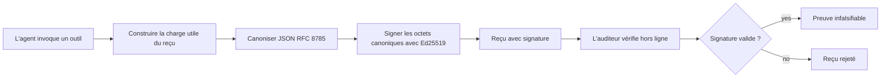
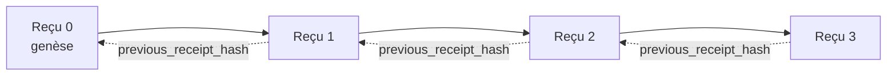

[Regardez la vidéo de la leçon : Sécuriser les agents IA avec des reçus cryptographiques](https://youtu.be/PLACEHOLDER_VIDEO_ID)

> _(La vidéo de la leçon et la vignette seront ajoutées par l'équipe de contenu Microsoft après la fusion, conformément au modèle des leçons 14 / 15.)_

# Sécuriser les agents IA avec des reçus cryptographiques

## Introduction

Cette leçon couvrira :

- Pourquoi les pistes d’audit pour les agents IA sont importantes pour la conformité, le débogage et la confiance.
- Ce qu’est un reçu cryptographique et comment il diffère d’une ligne de journal non signée.
- Comment produire un reçu signé pour l’appel d’un outil par un agent en Python simple.
- Comment vérifier un reçu hors ligne et détecter toute altération.
- Comment enchaîner les reçus de façon à ce que la suppression ou le réarrangement d’un reçu rompe la chaîne.
- Ce que les reçus prouvent et ce qu’ils ne prouvent explicitement pas.

## Objectifs d’apprentissage

Après avoir terminé cette leçon, vous saurez :

- Identifier les modes de défaillance qui motivent la provenance cryptographique des actions de l’agent.
- Produire un reçu signé Ed25519 sur une charge utile JSON canonique.
- Vérifier un reçu indépendamment en utilisant uniquement la clé publique du signataire.
- Détecter une altération en relançant la vérification sur un reçu modifié.
- Construire une séquence de reçus chaînés par hachage et expliquer pourquoi la chaîne est importante.
- Reconnaître la frontière entre ce que les reçus prouvent (attribution, intégrité, ordre) et ce qu’ils ne prouvent pas (exactitude de l’action, validité de la politique).

## Le problème : La piste d’audit de votre agent

Imaginez que vous avez déployé un agent IA pour Contoso Travel. L’agent lit les demandes des clients, interroge une API de vols pour trouver des options, et réserve des sièges au nom du client. Le trimestre dernier, l’agent a traité 50 000 réservations.

Aujourd’hui, un auditeur arrive. Il pose une question simple : « Montrez-moi ce que votre agent a fait. »

Vous remettez vos fichiers journaux. L’auditeur les examine et pose une question plus difficile : « Comment puis-je savoir que ces journaux n’ont pas été modifiés ? »

C’est le problème de la piste d’audit. La plupart des déploiements d’agents aujourd’hui reposent sur :

- **Journaux applicatifs** : écrits par l’agent lui-même, modifiables par toute personne ayant accès au système de fichiers.
- **Services de journalisation cloud** : à l’épreuve des altérations au niveau de la plateforme mais seulement si l’auditeur fait confiance à l’opérateur de la plateforme.
- **Journaux de transactions de bases de données** : adaptés aux changements de la base mais pas aux appels d’outils arbitraires.

Aucun de ces moyens ne peut répondre à la question de l’auditeur sans que celui-ci doive faire confiance à quelqu’un (vous, votre fournisseur cloud, votre fournisseur de base de données). Pour un usage interne, cette confiance est souvent acceptable. Pour des charges de travail réglementées (finance, santé, tout ce qui est soumis au règlement AI de l’UE), ce n’est pas le cas.

Les reçus cryptographiques résolvent ce problème en rendant chaque action d’agent vérifiable de façon indépendante. L’auditeur n’a pas besoin de vous faire confiance. Il a seulement besoin de votre clé publique et du reçu lui-même.

## Qu’est-ce qu’un reçu cryptographique ?

Un reçu est un objet JSON qui enregistre ce qu’un agent a fait, signé avec une signature digitale.


```mermaid
flowchart LR
    A[L'agent invoque un outil] --> B[Construire la charge utile du reçu]
    B --> C[Canoniser JSON RFC 8785]
    C --> E[Signer les octets canoniques avec Ed25519]
    E --> F[Reçu avec signature]
    F --> G[L'auditeur vérifie hors ligne]
    G --> H{Signature valide ?}
    H -- yes --> I[Preuve infalsifiable]
    H -- no --> J[Reçu rejeté]
```

Un reçu minimal ressemble à ceci :

```json
{
  "type": "agent.tool_call.v1",
  "agent_id": "contoso-travel-bot",
  "tool_name": "lookup_flights",
  "tool_args_hash": "sha256:a3f9c1...",
  "result_hash": "sha256:7b2e1d...",
  "policy_id": "contoso-travel-policy-v3",
  "timestamp": "2026-04-25T14:30:00Z",
  "sequence": 47,
  "previous_receipt_hash": "sha256:9d4e6a...",
  "signature": {
    "alg": "EdDSA",
    "sig": "c5af83...",
    "public_key": "8f3b2c..."
  }
}
```

Trois propriétés assurent le fonctionnement :

1. **La signature**. Le reçu est signé par la passerelle de l’agent avec une clé privée Ed25519. Toute personne disposant de la clé publique correspondante peut vérifier la signature hors ligne. La modification de n’importe quel champ invalide la signature.

2. **Le codage canonique**. Avant de signer, le reçu est sérialisé selon le Schéma de Canonisation JSON (JCS, RFC 8785). Cela garantit que deux implémentations produisant le même reçu logique produisent des sorties strictement identiques en octets. Sans canonicalisation, différents sérialiseurs JSON produiraient des signatures différentes pour le même contenu.

3. **Chaînage par hachage**. Le champ `previous_receipt_hash` relie chaque reçu à celui qui le précède. La suppression ou le réarrangement d’un reçu casse tous les reçus qui suivent. L’altération devient visible au niveau de la chaîne, même si les signatures individuelles sont contournées.

Ensemble, ces propriétés fournissent trois garanties :

- **Attribution** : cette clé a signé ce contenu.
- **Intégrité** : le contenu n’a pas changé depuis la signature.
- **Ordre** : ce reçu est venu après ce reçu dans la chaîne.

## Produire un reçu en Python

Vous n’avez pas besoin d’une bibliothèque spéciale pour produire un reçu. Les primitives cryptographiques sont largement disponibles et la logique tient en quelques dizaines de lignes de Python.

Les exercices pratiques dans `code_samples/18-signed-receipts.ipynb` parcourent le flux complet. La version résumée :

```python
import json
import hashlib
import base64
from nacl import signing
from jcs import canonicalize  # RFC 8785 JSON canonique

def b64url_nopad(data: bytes) -> str:
    return base64.urlsafe_b64encode(data).decode("ascii").rstrip("=")

def sha256_canonical(obj) -> str:
    """SHA-256 of a Python object's JCS-canonical JSON form."""
    return f"sha256:{hashlib.sha256(canonicalize(obj)).hexdigest()}"

# Générer ou charger une clé de signature (en production, stocker dans un coffre à clés)
signing_key = signing.SigningKey.generate()
verify_key = signing_key.verify_key

# Construire la charge utile du reçu (pas encore de signature)
tool_args = {"origin": "SYD", "destination": "LAX"}
tool_result = [{"flight": "QF11", "price": 1850, "stops": 0}]

payload = {
    "type": "agent.tool_call.v1",
    "agent_id": "contoso-travel-bot",
    "tool_name": "lookup_flights",
    "tool_args_hash": sha256_canonical(tool_args),
    "result_hash": sha256_canonical(tool_result),
    "policy_id": "contoso-travel-policy-v3",
    "timestamp": "2026-04-25T14:30:00Z",
    "sequence": 0,
    "previous_receipt_hash": None,
}

# Canonicaliser et signer directement les octets JCS. PureEdDSA effectue le hachage en interne.
canonical_bytes = canonicalize(payload)
signature_bytes = signing_key.sign(canonical_bytes).signature

# Joindre un objet de signature structuré.
receipt = {
    **payload,
    "signature": {
        "alg": "EdDSA",
        "sig": b64url_nopad(signature_bytes),
        "public_key": b64url_nopad(bytes(verify_key)),
    },
}
```

C’est tout le pipeline de signature. Les exercices dans le notebook expliquent chaque étape.

## Vérifier un reçu et détecter une altération

La vérification est l’opération inverse :

```python
import base64
import hashlib
from nacl import signing
from nacl.exceptions import BadSignatureError
from jcs import canonicalize

def b64url_decode(s: str) -> bytes:
    padding = "=" * ((4 - len(s) % 4) % 4)
    return base64.urlsafe_b64decode(s + padding)

def verify_receipt(receipt: dict) -> bool:
    # La signature est un objet structuré : {"alg", "sig", "public_key"}.
    sig_obj = receipt.get("signature")
    if not sig_obj or sig_obj.get("alg") != "EdDSA":
        return False

    # Reconstruire la charge utile qui a été réellement signée (tout sauf la signature).
    payload = {k: v for k, v in receipt.items() if k != "signature"}

    canonical_bytes = canonicalize(payload)

    try:
        verify_key = signing.VerifyKey(b64url_decode(sig_obj["public_key"]))
        verify_key.verify(canonical_bytes, b64url_decode(sig_obj["sig"]))
        return True
    except BadSignatureError:
        return False
```

Cette fonction prend un reçu et retourne `True` si la signature est valide, `False` sinon. Pas d’appel réseau, pas de dépendance à un service, aucune confiance requise envers un tiers.

Pour voir la détection d’altération en action, le notebook parcourt :

1. La production d’un reçu valide et la confirmation de sa vérification.
2. La modification d’un octet du champ `tool_args_hash`.
3. La re-vérification et l’échec de la vérification.

C’est la démonstration pratique que les reçus sont à l’épreuve des altérations : toute modification, même mineure, casse la signature.

## Chaîner des reçus pour des agents multidisciplinaires

Un seul reçu signé protège une action. Une chaîne de reçus protège une séquence.


```mermaid
flowchart LR
    R0[Reçu 0<br/>genèse] --> R1[Reçu 1]
    R1 --> R2[Reçu 2]
    R2 --> R3[Reçu 3]
    R1 -. previous_receipt_hash .-> R0
    R2 -. previous_receipt_hash .-> R1
    R3 -. previous_receipt_hash .-> R2
```

Chaque reçu enregistre le hachage du reçu précédent. Pour supprimer silencieusement le reçu 2, un attaquant devrait soit :

- Modifier le champ `previous_receipt_hash` du reçu 3 (ce qui casse la signature du reçu 3), OU
- Falsifier une nouvelle signature sur un reçu 3 modifié (ce qui nécessite la clé privée de l’agent).

Si la clé privée est dans un coffre-fort matériel et que vous publiez la clé publique avec chaque reçu, aucune attaque n’est réalisable sans détection.

Le notebook montre :

1. Construire une chaîne de trois reçus.
2. Vérifier que le `previous_receipt_hash` de chaque reçu correspond au hachage réel du reçu précédent.
3. Altérer un reçu au milieu et voir la chaîne se casser à ce point précis.

C’est ainsi que vous produisez une piste d’audit qu’un auditeur externe peut vérifier sans vous faire confiance.

## Ce que les reçus prouvent (et ce qu’ils ne prouvent pas)

C’est la section la plus importante de cette leçon. Les reçus sont puissants mais leur puissance est limitée.

**Les reçus prouvent trois choses :**

1. **Attribution** : une clé spécifique a signé une charge utile spécifique.
2. **Intégrité** : la charge utile n’a pas changé depuis la signature.
3. **Ordre** : ce reçu est venu après ce reçu dans la chaîne de hachage.

**Les reçus ne prouvent PAS :**

1. **Exactitude** : que l’action de l’agent était la bonne action. Un reçu peut être signé pour une mauvaise réponse aussi proprement que pour une bonne.
2. **Conformité à la politique** : que la politique mentionnée dans `policy_id` a réellement été évaluée ou qu’elle aurait permis cette action si elle avait été vérifiée. Le reçu enregistre ce qui est affirmé, pas ce qui a été appliqué.
3. **Identité au-delà de la clé** : le reçu dit « cette clé a signé ce contenu ». Il ne dit pas « cet humain a autorisé ceci ». Relier une clé à une personne ou une organisation nécessite une infrastructure d’identité séparée (un annuaire, un registre de clés publiques, etc.).
4. **Véracité des entrées** : si l’agent reçoit une invite manipulée et agit en conséquence, le reçu enregistre fidèlement l’action. Les reçus sont en aval de la validation des entrées, pas son substitut.

Cette frontière importe pour deux raisons :

- Elle indique à quoi les reçus sont utiles : rendre le comportement de l’agent auditable et à l’épreuve des altérations, même entre diverses organisations.
- Elle indique quelles couches supplémentaires sont nécessaires : validation des entrées (Leçon 6), application de politiques (abordée brièvement ci-dessous), et infrastructure d’identité (hors sujet pour cette leçon).

Une erreur fréquente est de supposer que « nous avons des reçus » signifie « nous sommes gouvernés ». Ce n’est pas le cas. Les reçus sont une base. La gouvernance est le système que vous construisez par-dessus.

## Prouver qu’un humain a approuvé l’action exacte

Le point 3 ci-dessus mérite sa propre section : un reçu d’action dit « cette clé a signé ce contenu », jamais « un humain a autorisé ceci ». Pour les actions à haut risque (remboursements, suppressions, virements), les cadres de gouvernance exigent de plus en plus cette déclaration absente, et elle est produisible avec les mêmes primitives que vous avez créées dans cette leçon.

Le notebook suivant `code_samples/human-authorization-receipts.ipynb` ajoute un second type de reçu, `human.approval.v1`, dans la même forme d’enveloppe que les reçus de la leçon (une charge utile typée signée par Ed25519 sur ses octets canoniques JCS, avec l’objet `signature` en dehors des octets signés). Un approbateur nommé signe **l’action canonique complète et son digest** avant exécution ; le reçu d’action de l’agent porte le **même digest d’action** et une `parent_approval_ref`, le `receipt_hash` de l’approbation, même convention que `previous_receipt_hash` dans la chaîne que vous avez construite ci-dessus. Une `verify_chain` unique valide les deux artefacts sous **des registres de clés épinglés séparés** (clés approbateurs vs clés agents), donc le chemin du code est partagé mais les autorités ne le sont jamais.

La propriété obtenue, énoncée avec soin : *l’humain a approuvé cette action exacte, et l’agent a exécuté exactement cette action approuvée.* Les cas de refus du notebook rendent cette propriété réelle plutôt que simplement affirmée :

- l’ensemble classique : altérations, délégué confus, rejouage, clés forgées de chaque côté, entrée malformée ;
- **autorité périmée** : une signature qui vérifie toujours, refusée quand même parce que la version de la politique a changé, la clé de l’approbateur a été retirée du registre épinglé, ou l’approbation a expiré avant exécution ;
- **substitution de digest** : un reçu d’action signé valide pointant vers une *vraie* approbation qui lie une *différente* action canonique.

Chaque échec refuse avec une raison distincte, ainsi un auditeur lisant un refus peut dire si l’autorité a expiré ou l’action exécutée a changé. La règle enseignée dans le notebook : une approbation signée n’est pas une autorité en soi. L’autorité existe uniquement si les deux reçus lient encore la même action canonique au moment de l’exécution. Le reçu d’approbation humaine est une composition pédagogique définie par cette leçon, pas un type de reçu défini par `draft-farley-acta-signed-receipts`.

## Références en production

Le code Python dans cette leçon est intentionnellement minimal afin que vous puissiez lire chaque ligne et comprendre exactement ce qui se passe. En production, vous avez deux options :

1. **Construire directement sur les primitives cryptographiques.** Les 50 lignes vues précédemment suffisent pour de nombreux cas d’usage. PyNaCl (Ed25519) et le paquet `jcs` (JSON canonique) sont des bibliothèques bien maintenues et auditées.

2. **Utiliser une bibliothèque de reçus en production.** Plusieurs projets open-source implémentent le même modèle avec des fonctionnalités supplémentaires (rotation des clés, vérification par lots, distribution de JWK Set, intégration avec des moteurs de politique) :
   - Le pipeline de signature utilise les conventions JCS et d’étendue de signature dans un brouillon Internet indépendant IETF ([`draft-farley-acta-signed-receipts`](https://datatracker.ietf.org/doc/draft-farley-acta-signed-receipts/), révision 02). Le reçu éducatif plat de cette leçon diffère de l’enveloppe `{payload, signature}` du brouillon et n’est pas présenté comme une implémentation conforme. Le brouillon publie une suite de conformité partagée ([agent-governance-testvectors](https://github.com/ScopeBlind/agent-governance-testvectors)) pour les implémentations ciblant son format filaire.
   - Le Microsoft Agent Governance Toolkit compose les reçus avec des décisions de politique basées sur Cedar ; voir le Tutoriel 33 dans ce dépôt pour un exemple complet.
   - Les packages `protect-mcp` (npm) et `@veritasacta/verify` (npm) fournissent une implémentation Node de la signature de reçus et de la vérification hors ligne, destinés à envelopper tout serveur MCP avec une piste d’audit à l’épreuve des altérations, incluant un flux de co-signature tenu dans lequel une action suspendue émet un reçu d’approbation lié au digest de l’action (supporté par WebAuthn dans le flux desktop), utilisant le même modèle de reçu d’approbation que le notebook d’autorisation humaine ci-dessus.
   - Le SDK Python **[nobulex](https://github.com/arian-gogani/nobulex)** (`pip install nobulex`) fournit le même modèle de signature Ed25519 + JCS en Python avec des intégrations LangChain et CrewAI, y compris des vecteurs de test de validation croisée publiés et une cartographie de conformité contribué via [OWASP PR #2210](https://github.com/OWASP/CheatSheetSeries/pull/2210).

Le choix entre construire soi-même ou utiliser une bibliothèque est similaire à celui entre écrire sa propre bibliothèque JWT ou en utiliser une éprouvée : les deux sont raisonnables ; la bibliothèque économise du temps et réduit la surface d’audit ; l’approche maison vous force à comprendre chaque primitive. Cette leçon enseigne la méthode maison pour que vous ayez les bases pour chaque option.

## Vérification des connaissances

Testez votre compréhension avant de passer à l’exercice pratique.

**1. Un reçu est signé avec la clé privée Ed25519 de l’agent. L’auditeur possède uniquement la clé publique. Peut-il vérifier le reçu hors ligne ?**

<details>
<summary>Réponse</summary>

Oui. La vérification Ed25519 nécessite uniquement la clé publique et les octets signés. Pas d’appel réseau, pas de dépendance à un service. C’est la propriété qui rend les reçus utiles dans des contextes d’audit isolés, multi-organisations, ou à faible confiance.
</details>

**2. Un attaquant modifie le champ `policy_id` d’un reçu pour prétendre qu’il était gouverné par une politique plus permissive. La signature portait sur la charge utile originale. Que se passe-t-il lors de la vérification ?**

<details>
<summary>Réponse</summary>


La vérification échoue. La signature a été calculée sur les octets canoniques de la charge utile originale ; modifier n'importe quel champ change ces octets, ce qui rend la signature invalide. L'attaquant aurait besoin de la clé privée pour produire une nouvelle signature valide, ce qu'il ne possède pas.
</details>

**3. Pourquoi le reçu inclut-il un `tool_args_hash` et un `result_hash` plutôt que les arguments et résultats bruts ?**

<details>
<summary>Réponse</summary>

Deux raisons. Tout d'abord, le reçu peut devoir être archivé ou transmis dans des environnements où la fuite du contenu brut (données personnelles, données commerciales) pose un problème. Le hachage garde le reçu petit et le contenu privé ; l'auditeur vérifie que le hachage correspond à une copie stockée séparément du contenu réel. Ensuite, les hachages ont une taille fixe ; un reçu avec hachages a une taille limitée quel que soit la taille des entrées et sorties.
</details>

**4. Le champ `previous_receipt_hash` relie chaque reçu à son prédécesseur. Si un attaquant supprime silencieusement un reçu au milieu d'une chaîne, qu'est-ce qui devient invalide ?**

<details>
<summary>Réponse</summary>

Chaque reçu qui suit celui supprimé. Leurs champs `previous_receipt_hash` ne correspondent plus à la chaîne réelle (parce que le reçu référencé n'existe plus, ou que la chaîne pointe maintenant vers un prédécesseur différent). Pour masquer la suppression, l'attaquant devrait signer à nouveau chaque reçu ultérieur, ce qui nécessite la clé privée.
</details>

**5. Un reçu est vérifié avec succès. Cela prouve-t-il que l'action de l'agent était correcte, conforme ou en accord avec la politique ?**

<details>
<summary>Réponse</summary>

Non. Un reçu valide prouve trois choses : l'attribution (cette clé a signé ce contenu), l'intégrité (le contenu n'a pas été modifié), et l'ordre (ce reçu est postérieur à ce reçu). Il ne prouve PAS que l'action était correcte, que la politique désignée dans `policy_id` a été réellement évaluée, ni que l'agent a respecté toutes les règles. Les reçus rendent le comportement de l'agent auditable, pas nécessairement correct. C'est la limite la plus importante dans cette leçon.
</details>

## Exercice Pratique

Ouvrez `code_samples/18-signed-receipts.ipynb` et complétez les quatre sections :

1. **Section 1** : Signez votre premier reçu et vérifiez-le.
2. **Section 2** : Altérez le reçu et observez l'échec de la vérification.
3. **Section 3** : Construisez une chaîne de trois reçus et vérifiez l'intégrité de la chaîne.
4. **Section 4** : Appliquez le modèle à un agent construit avec le Microsoft Agent Framework : enveloppez un appel d'outil dans la signature de reçu, puis vérifiez le reçu indépendamment.

**Défi supplémentaire 1 :** étendez le schéma du reçu avec un champ supplémentaire de votre choix (par exemple, un ID de requête pour le traçage), mettez à jour la logique de signature canonique pour l'inclure, et confirmez que le reçu circule toujours correctement à travers la vérification. Puis modifiez ce champ après signature et confirmez que la vérification échoue. Cela vous oblige à comprendre comment chaque octet de l'encodage canonique contribue à la signature.

**Défi supplémentaire 2 :** Hachez au SHA-256 deux de vos reçus ensemble (concaténez leurs octets canoniques dans un ordre déterministe) et incorporer le digest résultant comme un nouveau champ sur un troisième reçu avant de le signer. Vérifiez que les trois reçus circulent encore correctement. Vous venez de construire une preuve d'inclusion à un seul niveau : toute personne détenant le troisième reçu peut prouver que les deux premiers existaient au moment où il a été signé, sans avoir à révéler leur contenu. C'est le modèle utilisé à grande échelle par les reçus à divulgation sélective (engagements de Merkle, RFC 6962).

## Conclusion

Les reçus cryptographiques fournissent aux agents IA une piste d'audit qui est :

- **Indépendamment vérifiable** : toute partie disposant de la clé publique peut vérifier, sans dépendance à un service.
- **À preuve de falsification** : toute modification invalide la signature.
- **Portable** : un reçu est un petit fichier JSON ; il peut être archivé, transmis et vérifié partout.
- **Conforme aux standards** : basé sur Ed25519 (RFC 8032), JCS (RFC 8785) et SHA-256, tous des primitives largement déployées.

Ils ne remplacent pas la validation des entrées, l'application des politiques ou l'infrastructure d'identité. Ils constituent une base pour ces couches. Lorsque vous déployez des agents dans des environnements réglementés, des flux de travail multi-organisations, ou tout contexte où un futur auditeur ne peut pas être supposé vous faire confiance, les reçus sont la manière de rendre la piste d'audit honnête.

Le point essentiel : les reçus prouvent qui a dit quoi, quand. Ils ne prouvent pas que ce qui a été dit est vrai ou juste. Gardez bien cette distinction. C'est la différence entre un système de provenance honnête et un système trompeur.

## Liste de Contrôle pour la Production

Lorsque vous êtes prêt à passer de cette leçon au déploiement concret d'agents signant leurs reçus dans un environnement réel :

- [ ] **Déplacez la clé de signature hors de l'ordinateur du développeur.** Utilisez Azure Key Vault, AWS KMS, ou un module de sécurité matériel. La clé privée qui signe vos reçus ne doit jamais être stockée dans le contrôle de version ni en clair sur les machines applicatives.
- [ ] **Publiez la clé publique de vérification.** Les auditeurs en ont besoin pour vérifier hors ligne. Le modèle standard est un ensemble JWK à une URL bien connue (RFC 7517), par exemple `https://your-org.example.com/.well-known/agent-keys.json`.
- [ ] **Ancrez la chaîne à l'extérieur.** Écrivez périodiquement le hachage du dernier élément de la chaîne dans un registre de transparence (Sigstore Rekor, une autorité d'horodatage RFC 3161, ou un second système interne) afin qu'une tierce partie puisse confirmer que "cette chaîne existait à ce moment."
- [ ] **Stockez les reçus de manière immuable.** Un stockage append-only (Azure Storage avec politiques d'immuabilité, verrouillage d'objet AWS S3) empêche un employé malveillant de réécrire l'historique au niveau du stockage.
- [ ] **Décidez de la rétention.** De nombreux régimes de conformité exigent une conservation sur plusieurs années. Prévoyez la croissance des reçus (chaque reçu fait ~500 octets ; un agent effectuant 10K appels par jour produit ~1,8 Go par an).
- [ ] **Documentez ce que les reçus ne couvrent pas.** Les reçus prouvent l'attribution, l'intégrité et l'ordre. Votre manuel d'exploitation doit lister explicitement quels contrôles supplémentaires (validation des entrées, application des politiques, limitation du débit, infrastructure d'identité) complètent les reçus dans votre posture de gouvernance.

### Vous avez d'autres questions sur la sécurisation des agents IA ?

Rejoignez le [Microsoft Foundry Discord](https://aka.ms/ai-agents/discord) pour rencontrer d'autres apprenants, assister aux heures de bureau, et obtenir des réponses à vos questions sur les agents IA.

## Au-delà de cette leçon

Cette leçon couvre la signature d'un seul reçu et les séquences enchaînées par hachage. Les mêmes primitives composent plusieurs modèles plus avancés que vous pouvez rencontrer à mesure que votre posture de gouvernance mûrit :

- **Divulgation sélective.** Quand les champs d'un reçu sont engagés indépendamment (arbre de Merkle à la RFC 6962), vous pouvez révéler certains champs à certains auditeurs et prouver que les autres restent inchangés sans les exposer. Utile quand un même reçu doit satisfaire une audit complet (qui veut exhaustivité) et des règles de minimisation des données comme le RGPD (qui veulent que l'auditeur voie le moins possible).
- **Révocation des reçus.** Si une clé de signature est compromise, vous devez marquer tous les reçus signés par cette clé comme non fiables à partir d'une certaine date. Modèles standards : clés de signature à courte durée plus une liste de révocation publiée, ou un registre de transparence avec les entrées de révocation.
- **Reçus bilatéraux / à signature partagée.** Certaines implémentations divisent la charge signée en deux parties, avant exécution (`authorization_*`) et après exécution (`result_*`), avec des signatures indépendantes, utile lorsque la décision d'autorisation et le résultat observé proviennent d'acteurs différents ou à des moments différents. Ceci s'ajoute au format de reçu enseigné ici.
- **Composition de la charge utile.** Un reçu scelle les octets que vous mettez dans `result_hash`. Les charges réelles sont souvent plus riches qu'un simple résultat d'appel d'outil : raisonnements pré-décisionnels (prédiction du modèle, options considérées, preuves et leur exhaustivité, posture de risque, chaîne de responsabilité, résultat d'un contrôle) peuvent tous vivre dans la charge, scellés par un seul reçu. Cela garde le format minimal tout en permettant l’évolution des schémas selon les domaines.
- **Conformité inter-implémentations.** Plusieurs implémentations indépendantes du même format de reçu (Python, TypeScript, Rust, Go) se vérifient mutuellement avec des vecteurs de test partagés. Si vous créez votre propre implémentation, valider avec des vecteurs publiés confirme la compatibilité sur le fil.
- **Migration post-quantique.** Ed25519 est largement déployé aujourd'hui mais n'est pas résistant au quantique. Le format de reçu est agnostique quant à l'algorithme : le champ `signature.alg` peut porter `ML-DSA-65` (la norme NIST pour la signature post-quantique) lorsque vous devez migrer. Prévoyez une période de transition où les reçus sont signés en double.

## Ressources Supplémentaires

- <a href="https://datatracker.ietf.org/doc/draft-farley-acta-signed-receipts/" target="_blank">IETF Internet-Draft : Reçus de Décision Signés pour le Contrôle d'Accès Machine-à-Machine</a>
- <a href="https://learn.microsoft.com/azure/ai-studio/responsible-use-of-ai-overview" target="_blank">Vue d'ensemble de l'IA responsable (Azure AI)</a>
- <a href="https://datatracker.ietf.org/doc/html/rfc8032" target="_blank">RFC 8032 : Algorithme de Signature Numérique Edwards-Curve (EdDSA)</a>
- <a href="https://datatracker.ietf.org/doc/html/rfc8785" target="_blank">RFC 8785 : Schéma de Canonicalisation JSON (JCS)</a>
- <a href="https://datatracker.ietf.org/doc/html/rfc6962" target="_blank">RFC 6962 : Transparence des Certificats</a> (construction d'arbre de Merkle utilisée par les reçus à divulgation sélective)
- <a href="https://github.com/microsoft/agent-governance-toolkit/blob/main/docs/tutorials/33-offline-verifiable-receipts.md" target="_blank">Microsoft Agent Governance Toolkit, Tutoriel 33 : Reçus de Décision Vérifiables Hors Ligne</a>
- <a href="https://github.com/ScopeBlind/agent-governance-testvectors" target="_blank">Vecteurs de test de conformité inter-implémentations</a> pour le format de reçu utilisé dans cette leçon (Apache-2.0)
- <a href="https://pynacl.readthedocs.io/" target="_blank">Documentation PyNaCl</a> (Ed25519 en Python)

## Leçon Précédente

[Création d'agents IA locaux](../17-creating-local-ai-agents/README.md)

---

<!-- CO-OP TRANSLATOR DISCLAIMER START -->
**Avertissement** :
Ce document a été traduit à l'aide du service de traduction automatique [Co-op Translator](https://github.com/Azure/co-op-translator). Bien que nous nous efforçions d'assurer l'exactitude, veuillez noter que les traductions automatisées peuvent contenir des erreurs ou des inexactitudes. Le document original dans sa langue native doit être considéré comme la source faisant autorité. Pour les informations critiques, il est recommandé de recourir à une traduction professionnelle réalisée par un humain. Nous ne saurions être tenus responsables des malentendus ou erreurs d'interprétation découlant de l'utilisation de cette traduction.
<!-- CO-OP TRANSLATOR DISCLAIMER END -->