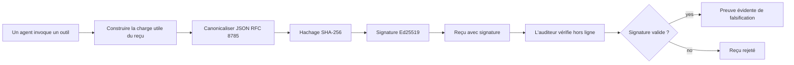
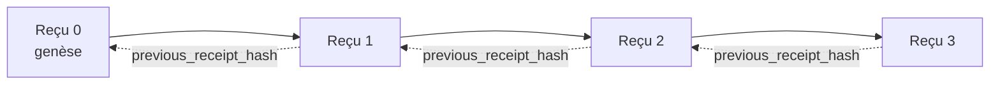

[Regardez la vidéo de la leçon : Sécuriser les agents IA avec des reçus cryptographiques](https://youtu.be/PLACEHOLDER_VIDEO_ID)

> _(Vidéo de la leçon et miniature à ajouter par l’équipe de contenu Microsoft après fusion, selon le modèle des leçons 14 / 15.)_

# Sécuriser les agents IA avec des reçus cryptographiques

## Introduction

Cette leçon couvrira :

- Pourquoi les pistes d’audit pour les agents IA sont importantes pour la conformité, le débogage et la confiance.
- Ce qu’est un reçu cryptographique et en quoi il diffère d’une ligne de journal non signée.
- Comment produire un reçu signé pour l’appel d’un outil par un agent en Python simple.
- Comment vérifier un reçu hors ligne et détecter une altération.
- Comment chaîner les reçus de sorte que retirer ou réordonner un reçu casse la chaîne.
- Ce que les reçus prouvent et ce qu’ils ne prouvent pas explicitement.

## Objectifs d’apprentissage

À la fin de cette leçon, vous saurez comment :

- Identifier les modes de défaillance qui motivent la provenance cryptographique des actions d’un agent.
- Produire un reçu signé Ed25519 sur une charge utile JSON canonique.
- Vérifier un reçu de façon indépendante en utilisant uniquement la clé publique du signataire.
- Détecter une altération en relançant la vérification sur un reçu modifié.
- Construire une séquence de reçus chaînés par hachage et expliquer pourquoi la chaîne est importante.
- Reconnaître la limite entre ce que les reçus prouvent (attribution, intégrité, ordonnancement) et ce qu’ils ne prouvent pas (exactitude de l’action, validité de la politique).

## Le problème : la piste d’audit de votre agent

Imaginez que vous avez déployé un agent IA pour Contoso Travel. L’agent lit les demandes des clients, interroge une API de vols pour rechercher des options, et réserve des sièges au nom du client. Le trimestre dernier, l’agent a traité 50 000 réservations.

Aujourd’hui, un auditeur arrive. Il pose une question simple : « Montrez-moi ce que votre agent a fait. »

Vous lui remettez vos fichiers journaux. L’auditeur les examine et pose une question plus difficile : « Comment puis-je savoir que ces journaux n’ont pas été modifiés ? »

C’est le problème de la piste d’audit. La plupart des déploiements d’agents aujourd’hui reposent sur :

- **Journaux d’application** : écrits par l’agent lui-même, modifiables par toute personne ayant accès au système de fichiers.
- **Services de journalisation dans le cloud** : à preuve de falsification au niveau de la plateforme mais uniquement si l’auditeur fait confiance à l’opérateur de la plateforme.
- **Journaux de transaction de base de données** : adaptés aux modifications de base de données mais pas aux appels d’outils arbitraires.

Aucun de ces moyens ne peut répondre à la question de l’auditeur sans lui demander de faire confiance à quelqu’un (vous, votre fournisseur cloud, votre éditeur de base de données). Pour un usage interne, cette confiance est souvent acceptable. Pour des charges réglementées (finance, santé, toute activité soumise à la loi européenne AI Act), elle ne l’est pas.

Les reçus cryptographiques résolvent ce problème en rendant chaque action de l’agent vérifiable indépendamment. L’auditeur n’a pas besoin de vous faire confiance. Il lui suffit d’avoir votre clé publique et le reçu lui-même.

## Qu’est-ce qu’un reçu cryptographique ?

Un reçu est un objet JSON qui enregistre ce qu’un agent a fait, signé avec une signature numérique.


```mermaid
flowchart LR
    A[Un agent invoque un outil] --> B[Construire la charge utile du reçu]
    B --> C[Canonicaliser JSON RFC 8785]
    C --> D[Hachage SHA-256]
    D --> E[Signature Ed25519]
    E --> F[Reçu avec signature]
    F --> G[L'auditeur vérifie hors ligne]
    G --> H{Signature valide ?}
    H -- yes --> I[Preuve évidente de falsification]
    H -- no --> J[Reçu rejeté]
```
  
Un reçu minimal ressemble à ceci :

```json
{
  "type": "agent.tool_call.v1",
  "agent_id": "contoso-travel-bot",
  "tool_name": "lookup_flights",
  "tool_args_hash": "sha256:a3f9c1...",
  "result_hash": "sha256:7b2e1d...",
  "policy_id": "contoso-travel-policy-v3",
  "timestamp": "2026-04-25T14:30:00Z",
  "sequence": 47,
  "previous_receipt_hash": "sha256:9d4e6a...",
  "signature": {
    "alg": "EdDSA",
    "sig": "c5af83...",
    "public_key": "8f3b2c..."
  }
}
```
  
Trois propriétés font le travail :

1. **La signature**. Le reçu est signé par la passerelle de l’agent en utilisant une clé privée Ed25519. Toute personne ayant la clé publique correspondante peut vérifier la signature hors ligne. Toute altération d’un champ invalide la signature.

2. **Encodage canonique**. Avant la signature, le reçu est sérialisé en utilisant le JSON Canonicalization Scheme (JCS, RFC 8785). Cela garantit que deux implémentations produisant le même reçu logique produisent une sortie byte-identique. Sans canonisation, différents sérialiseurs JSON produiraient des signatures différentes pour le même contenu.

3. **Chaînage par hachage**. Le champ `previous_receipt_hash` relie chaque reçu au précédent. Retirer ou réordonner un reçu casse chaque reçu qui suit. L’altération devient visible au niveau de la chaîne même si des signatures individuelles sont contournées.

Ensemble, ces propriétés offrent trois garanties :

- **Attribution** : cette clé a signé ce contenu.
- **Intégrité** : le contenu n’a pas changé depuis la signature.
- **Ordonnancement** : ce reçu est venu après ce reçu dans la chaîne.

## Produire un reçu en Python

Vous n’avez pas besoin d’une bibliothèque spéciale pour produire un reçu. Les primitives cryptographiques sont largement disponibles et la logique tient en quelques dizaines de lignes de Python.

Les exercices pratiques dans `code_samples/18-signed-receipts.ipynb` expliquent tout le processus. La version résumée :

```python
import json
import hashlib
import base64
from nacl import signing
from jcs import canonicalize  # JSON canonique RFC 8785

def b64url_nopad(data: bytes) -> str:
    return base64.urlsafe_b64encode(data).decode("ascii").rstrip("=")

def sha256_canonical(obj) -> str:
    """SHA-256 of a Python object's JCS-canonical JSON form."""
    return f"sha256:{hashlib.sha256(canonicalize(obj)).hexdigest()}"

# Générer ou charger une clé de signature (en production, stocker dans un coffre-fort à clés)
signing_key = signing.SigningKey.generate()
verify_key = signing_key.verify_key

# Construire la charge utile du reçu (pas encore de signature)
tool_args = {"origin": "SYD", "destination": "LAX"}
tool_result = [{"flight": "QF11", "price": 1850, "stops": 0}]

payload = {
    "type": "agent.tool_call.v1",
    "agent_id": "contoso-travel-bot",
    "tool_name": "lookup_flights",
    "tool_args_hash": sha256_canonical(tool_args),
    "result_hash": sha256_canonical(tool_result),
    "policy_id": "contoso-travel-policy-v3",
    "timestamp": "2026-04-25T14:30:00Z",
    "sequence": 0,
    "previous_receipt_hash": None,
}

# Canoniser, hacher, signer.
canonical_bytes = canonicalize(payload)
message_hash = hashlib.sha256(canonical_bytes).digest()
signature_bytes = signing_key.sign(message_hash).signature

# Attacher un objet de signature structuré.
receipt = {
    **payload,
    "signature": {
        "alg": "EdDSA",
        "sig": b64url_nopad(signature_bytes),
        "public_key": b64url_nopad(bytes(verify_key)),
    },
}
```
  
C’est toute la chaîne de signature. Les exercices du notebook expliquent chaque étape.

## Vérifier un reçu et détecter une altération

La vérification est l’opération inverse :

```python
import base64
import hashlib
from nacl import signing
from nacl.exceptions import BadSignatureError
from jcs import canonicalize

def b64url_decode(s: str) -> bytes:
    padding = "=" * ((4 - len(s) % 4) % 4)
    return base64.urlsafe_b64decode(s + padding)

def verify_receipt(receipt: dict) -> bool:
    # La signature est un objet structuré : {"alg", "sig", "public_key"}.
    sig_obj = receipt.get("signature")
    if not sig_obj or sig_obj.get("alg") != "EdDSA":
        return False

    # Reconstruisez la charge utile qui a été réellement signée (tout sauf la signature).
    payload = {k: v for k, v in receipt.items() if k != "signature"}

    canonical_bytes = canonicalize(payload)
    message_hash = hashlib.sha256(canonical_bytes).digest()

    try:
        verify_key = signing.VerifyKey(b64url_decode(sig_obj["public_key"]))
        verify_key.verify(message_hash, b64url_decode(sig_obj["sig"]))
        return True
    except BadSignatureError:
        return False
```
  
Cette fonction prend un reçu et renvoie `True` si la signature est valide, `False` sinon. Pas d’appel réseau, pas de dépendance service, aucune confiance requise envers un tiers.

Pour voir la détection d’altération en action, le notebook présente :

1. La production d’un reçu valide et la confirmation de sa vérification.
2. La modification d’un octet du champ `tool_args_hash`.
3. La revalidation et l’échec constaté.

C’est la démonstration pratique que les reçus sont à preuve de falsification : toute modification, même minime, casse la signature.

## Chaîner les reçus pour les agents multi-étapes

Un seul reçu signé protège une action. Une chaîne de reçus protège une séquence.


```mermaid
flowchart LR
    R0[Reçu 0<br/>genèse] --> R1[Reçu 1]
    R1 --> R2[Reçu 2]
    R2 --> R3[Reçu 3]
    R1 -. previous_receipt_hash .-> R0
    R2 -. previous_receipt_hash .-> R1
    R3 -. previous_receipt_hash .-> R2
```
  
Chaque reçu enregistre le hachage du reçu précédent. Pour supprimer silencieusement le reçu 2, un attaquant devrait soit :

- Modifier le champ `previous_receipt_hash` du reçu 3 (ce qui casse la signature du reçu 3), OU
- Forger une nouvelle signature sur un reçu 3 modifié (ce qui nécessite la clé privée de l’agent).

Si la clé privée est dans une zone sécurisée matérielle (hardware key vault) et que vous publiez la clé publique avec chaque reçu, aucune de ces attaques n’est réalisable sans détection.

Le notebook explique :

1. La création d’une chaîne de trois reçus.
2. La vérification que chaque `previous_receipt_hash` correspond au hachage réel du reçu précédent.
3. Une altération d’un reçu au milieu et la rupture visible de la chaîne à cet endroit précis.

C’est ainsi que vous produisez une piste d’audit qu’un auditeur externe peut vérifier sans vous faire confiance.

## Ce que les reçus prouvent (et ce qu’ils ne prouvent pas)

C’est la partie la plus importante de cette leçon. Les reçus sont puissants mais leur puissance est limitée.

**Les reçus prouvent trois choses :**

1. **Attribution** : une clé spécifique a signé une charge utile spécifique.
2. **Intégrité** : la charge utile n’a pas changé depuis la signature.
3. **Ordonnancement** : ce reçu est venu après ce reçu dans la chaîne de hachage.

**Les reçus ne prouvent PAS :**

1. **La justesse** : que l’action de l’agent était la bonne action. Un reçu peut être signé pour une mauvaise réponse aussi facilement que pour une bonne.
2. **La conformité à la politique** : que la politique mentionnée dans `policy_id` a réellement été évaluée, ou qu’elle aurait permis cette action si elle avait été vérifiée. Le reçu enregistre ce qui a été affirmé, pas ce qui a été appliqué.
3. **L’identité au-delà de la clé** : le reçu dit « cette clé a signé ce contenu ». Il ne dit pas « cet humain a autorisé ceci ». Relier une clé à une personne ou organisation nécessite une infrastructure d’identité séparée (un annuaire, un registre de clés publiques, etc.).
4. **La véracité des entrées** : si l’agent reçoit une incitation manipulée et agit en conséquence, le reçu enregistre fidèlement l’action. Les reçus sont en aval de la validation des entrées, pas un substitut.

Cette limite est importante pour deux raisons :

- Elle indique à quoi servent les reçus : rendre le comportement des agents auditable et à preuve de falsification, même à travers des frontières organisationnelles.
- Elle indique quelles couches supplémentaires sont encore nécessaires : validation des entrées (Leçon 6), application de la politique (abordée brièvement ci-dessous) et infrastructure d’identité (hors de portée de cette leçon).

Une erreur fréquente est de supposer que « nous avons des reçus » signifie « nous sommes régulés ». Ce n’est pas le cas. Les reçus sont une fondation. La gouvernance est le système que vous construisez dessus.

## Références en production

Le code Python de cette leçon est volontairement minimal pour que vous puissiez lire chaque ligne et comprendre exactement ce qui se passe. En production, vous avez deux options :

1. **Construire directement sur les primitives cryptographiques.** Les 50 lignes présentées plus haut suffisent pour de nombreux cas d’usage. PyNaCl (Ed25519) et le paquet `jcs` (JSON canonique) sont des bibliothèques bien maintenues et auditées.

2. **Utiliser une bibliothèque de reçus en production.** Plusieurs projets open-source implémentent ce même modèle avec des fonctionnalités supplémentaires (rotation des clés, vérification par lots, distribution de jeux de clés JWK, intégration avec des moteurs de politique) :
   - Le format de reçu utilisé dans cette leçon suit un Internet-Draft IETF (`draft-farley-acta-signed-receipts`) actuellement en cours de normalisation.
   - Le Microsoft Agent Governance Toolkit compose les reçus avec des décisions de politique basées sur Cedar ; voir le Tutoriel 33 dans ce dépôt pour un exemple complet.
   - Les paquets `protect-mcp` (npm) et `@veritasacta/verify` (npm) fournissent une implémentation Node de signature et vérification hors ligne des reçus, destinés à envelopper tout serveur MCP avec une piste d’audit à preuve de falsification.
   - Le SDK Python **[nobulex](https://github.com/arian-gogani/nobulex)** (`pip install nobulex`) fournit le même modèle de signature Ed25519 + JCS en Python avec intégrations LangChain et CrewAI, incluant des vecteurs de tests croisés publiés et une cartographie de conformité contribué via [OWASP PR #2210](https://github.com/OWASP/CheatSheetSeries/pull/2210).

Le choix entre développer sa propre solution ou utiliser une bibliothèque ressemble au choix entre écrire sa propre bibliothèque JWT ou en utiliser une testée : les deux sont raisonnables ; la bibliothèque fait gagner du temps et réduit la surface d’audit ; la solution maison vous force à comprendre chaque primitive. Cette leçon enseigne la méthode maison pour que vous disposiez de la base pour tout choix.

## Vérification des connaissances

Testez votre compréhension avant de passer à l’exercice pratique.

**1. Un reçu est signé avec la clé privée Ed25519 de l’agent. L’auditeur ne possède que la clé publique. Peut-il vérifier le reçu hors ligne ?**

<details>
<summary>Réponse</summary>

Oui. La vérification Ed25519 ne nécessite que la clé publique et les octets signés. Pas d’appel réseau, pas de dépendance à un service. C’est ce qui rend les reçus utiles dans des environnements cloisonnés, multi-organisationnels ou à faible confiance.
</details>

**2. Un attaquant modifie le champ `policy_id` d’un reçu pour prétendre qu’il était régi par une politique plus permissive. La signature portait sur la charge utile originale. Que se passe-t-il lors de la vérification ?**

<details>
<summary>Réponse</summary>

La vérification échoue. La signature a été calculée sur les octets canoniques de la charge utile originale ; modifier un champ change ces octets, ce qui modifie le hachage SHA-256, invalidant la signature. L’attaquant aurait besoin de la clé privée pour produire une nouvelle signature valide, ce qu’il n’a pas.
</details>

**3. Pourquoi le reçu inclut-il un `tool_args_hash` et un `result_hash` plutôt que les arguments et résultat bruts ?**

<details>
<summary>Réponse</summary>

Deux raisons. D’abords, le reçu peut devoir être archivé ou transmis dans des environnements où divulguer le contenu brut (données personnelles, données métier) est problématique. Le hachage garde le reçu petit et le contenu privé ; l’auditeur vérifie que le hachage correspond à une copie stockée séparément du contenu réel. Ensuite, les hachages ont une taille fixe ; un reçu avec hachages est limité en taille quel que soit la taille des entrées et sorties.
</details>

**4. Le champ `previous_receipt_hash` relie chaque reçu à son prédécesseur. Si un attaquant supprime silencieusement un reçu au milieu d’une chaîne, qu’est-ce qui devient invalide ?**

<details>
<summary>Réponse</summary>

Tous les reçus qui suivaient celui supprimé. Leurs champs `previous_receipt_hash` ne correspondent plus à la chaîne réelle (car le reçu référencé n’existe plus, ou la chaîne pointe désormais vers un prédécesseur différent). Pour masquer la suppression, l’attaquant devrait resignérer tous les reçus suivants, ce qui requiert la clé privée.
</details>

**5. Un reçu est vérifié proprement. Cela prouve-t-il que l’action de l’agent était correcte, valable ou conforme à une politique ?**

<details>
<summary>Réponse</summary>

Non. Un reçu valide prouve trois choses : attribution (cette clé a signé ce contenu), intégrité (le contenu n’a pas changé), et ordonnancement (ce reçu a suivi ce reçu). Il ne prouve pas que l’action était correcte, que la politique dans `policy_id` a été réellement évaluée, ni que l’agent a respecté toutes les règles. Les reçus rendent le comportement auditable, pas nécessairement correct. C’est la limite la plus importante de la leçon.
</details>

## Exercice pratique

Ouvrez `code_samples/18-signed-receipts.ipynb` et complétez les quatre sections :

1. **Section 1** : Signez votre premier reçu et vérifiez-le.
2. **Section 2** : Modifiez le reçu et observez l’échec de la vérification.
3. **Section 3** : Construisez une chaîne de trois reçus et vérifiez l’intégrité de la chaîne.
4. **Section 4** : Appliquez le modèle à un agent construit avec le Microsoft Agent Framework : enveloppez un appel de l’outil dans la signature d’un reçu, puis vérifiez le reçu indépendamment.
**Défi supplémentaire 1 :** étendez le schéma du reçu avec un champ supplémentaire de votre choix (par exemple, un ID de requête pour le traçage), mettez à jour la logique de signature canonique pour l’inclure, et confirmez que le reçu passe toujours la vérification en aller-retour. Ensuite, modifiez le champ après la signature et confirmez que la vérification échoue. Cela vous oblige à comprendre comment chaque octet de l’encodage canonique contribue à la signature.

**Défi supplémentaire 2 :** hachez SHA-256 deux de vos reçus ensemble (concaténez leurs octets canoniques dans un ordre déterministe) et insérez le digest résultant comme un nouveau champ sur un troisième reçu avant de le signer. Vérifiez que les trois reçus passent toujours l’aller-retour. Vous venez de construire une preuve d’inclusion en une étape : toute personne possédant le troisième reçu peut prouver que les deux premiers existaient au moment de sa signature, sans avoir besoin de révéler leur contenu. C’est le modèle utilisé à grande échelle par les reçus à divulgation sélective (engagements Merkle, RFC 6962).

## Conclusion

Les reçus cryptographiques fournissent aux agents IA une piste d’audit qui est :

- **indépendamment vérifiable** : toute partie possédant la clé publique peut vérifier, sans dépendance de service.
- **à l’épreuve des falsifications** : toute modification invalide la signature.
- **portable** : un reçu est un petit fichier JSON ; il peut être archivé, transmis et vérifié n’importe où.
- **conforme aux normes** : basé sur Ed25519 (RFC 8032), JCS (RFC 8785), et SHA-256, tous des primitives largement déployées.

Ils ne remplacent pas la validation des entrées, l’application des politiques ou l’infrastructure d’identité. Ils constituent la base de ces couches. Lorsque vous déployez des agents dans des environnements réglementés, des workflows multi-organisationnels ou tout contexte où un auditeur futur ne peut pas être supposé vous faire confiance, les reçus sont la façon dont vous rendez la piste d’audit honnête.

Le point le plus important à retenir : les reçus prouvent qui a dit quoi, quand. Ils ne prouvent pas que ce qui a été dit est vrai ou juste. Gardez bien cette distinction. C’est la différence entre un système de provenance honnête et un système trompeur.

## Liste de vérification pour la production

Quand vous êtes prêt à passer de cette leçon au déploiement d’agents signant par reçu dans un environnement réel :

- [ ] **Déplacez la clé de signature hors du poste développeur.** Utilisez Azure Key Vault, AWS KMS, ou un module matériel de sécurité. La clé privée signant vos reçus ne doit jamais être dans le contrôle de source ni en clair sur les machines applicatives.
- [ ] **Publiez la clé publique de vérification.** Les auditeurs en ont besoin pour vérifier hors ligne. Le modèle standard est un JWK Set à une URL bien connue (RFC 7517), par exemple `https://your-org.example.com/.well-known/agent-keys.json`.
- [ ] **Ancrez la chaîne à l’extérieur.** Écrivez périodiquement le hash de la tête de chaîne la plus récente dans un journal de transparence (Sigstore Rekor, autorité de timestamp RFC 3161, ou un second système interne) afin qu’une partie externe puisse confirmer « cette chaîne existait à ce moment ».
- [ ] **Stockez les reçus de façon immuable.** Un stockage blob en mode append-only (Azure Storage avec politiques d’immuabilité, verrouillage d’objet AWS S3) empêche un initié de réécrire l’historique au niveau du stockage.
- [ ] **Planifiez la conservation.** De nombreux régimes de conformité exigent une conservation pluriannuelle. Préparez la croissance des reçus (chaque reçu fait ~500 octets ; un agent réalisant 10 000 appels par jour produit ~1,8 Go par an).
- [ ] **Documentez ce que les reçus ne couvrent pas.** Les reçus prouvent l’attribution, l’intégrité et l’ordre. Votre runbook doit lister explicitement quels contrôles additionnels (validation des entrées, application de politiques, limitation de débit, infrastructure d’identité) accompagnent les reçus dans votre posture de gouvernance.

### Vous avez d’autres questions sur la sécurisation des agents IA ?

Rejoignez le [Microsoft Foundry Discord](https://aka.ms/ai-agents/discord) pour rencontrer d’autres apprenants, assister aux heures de bureau, et faire répondre à vos questions sur les agents IA.

## Au-delà de cette leçon

Cette leçon couvre la signature d’un seul reçu et les séquences en chaîne de hachage. Les mêmes primitives composent plusieurs modèles plus avancés que vous pourrez rencontrer à mesure que votre posture de gouvernance mûrit :

- **Divulgation sélective.** Quand les champs d’un reçu sont engagés indépendamment (arbre Merkle style RFC 6962), vous pouvez révéler certains champs à certains auditeurs et prouver que les autres n’ont pas été modifiés sans les exposer. Utile quand un même reçu doit satisfaire à la fois un audit complet (qui exige la complétude) et des réglementations de minimisation des données comme le RGPD (qui veulent que l’auditeur voie le moins possible).
- **Révocation de reçus.** Si une clé de signature est compromise, il faut un moyen pour marquer tous les reçus signés par cette clé comme non fiables à partir d’un certain moment. Modèles standards : clés de signature à durée de vie courte plus une liste de révocation publiée, ou un journal de transparence avec entrées de révocation.
- **Reçus bilatéraux / à signature partagée.** Certaines implémentations divisent la charge signée en deux moitiés pré-exécution (`authorization_*`) et post-exécution (`result_*`) avec des signatures indépendantes, utile quand la décision d’autorisation et le résultat observé sont produits par des acteurs ou à des moments différents. Cela se compose de façon additive au format de reçu enseigné dans cette leçon.
- **Composition de la charge.** Un reçu scelle les octets que vous mettez dans `result_hash`. Les charges réelles sont souvent plus riches qu’un simple résultat d’appel d’outil : raisonnement pré-décision (prédiction du modèle, options considérées, preuves et leur exhaustivité, posture de risque, chaîne de responsabilité, résultat du contrôle) peuvent tous vivre dans la charge, scellés par un seul reçu. Cela garde le format minimal pour les reçus tout en permettant aux schémas de charges d’évoluer domaine par domaine.
- **Conformité inter-implémentations.** Plusieurs implémentations indépendantes du même format de reçu (Python, TypeScript, Rust, Go) se vérifient mutuellement avec des vecteurs tests communs. Si vous créez votre propre implémentation, valider avec des vecteurs publiés confirme la compatibilité sur le fil.
- **Migration post-quantique.** Ed25519 est largement déployé aujourd’hui mais pas résistant au quantique. Le format de reçu est agile en algorithmes : le champ `signature.alg` peut porter `ML-DSA-65` (le standard de signature post-quantique NIST) quand vous devez migrer. Prévoyez une période de transition où les reçus sont doublement signés.

## Ressources supplémentaires

- <a href="https://datatracker.ietf.org/doc/draft-farley-acta-signed-receipts/" target="_blank">Brouillon IETF : Reçus de décision signés pour contrôle d’accès machine-à-machine</a>
- <a href="https://learn.microsoft.com/azure/ai-studio/responsible-use-of-ai-overview" target="_blank">Présentation de l’IA responsable (Azure AI)</a>
- <a href="https://datatracker.ietf.org/doc/html/rfc8032" target="_blank">RFC 8032 : Algorithme de signature numérique Edwards-Curve (EdDSA)</a>
- <a href="https://datatracker.ietf.org/doc/html/rfc8785" target="_blank">RFC 8785 : Schéma de canonicalisation JSON (JCS)</a>
- <a href="https://datatracker.ietf.org/doc/html/rfc6962" target="_blank">RFC 6962 : Transparence des certificats</a> (construction d’arbre Merkle utilisée par les reçus à divulgation sélective)
- <a href="https://github.com/microsoft/agent-governance-toolkit/blob/main/docs/tutorials/33-offline-verifiable-receipts.md" target="_blank">Microsoft Agent Governance Toolkit, Tutoriel 33 : Reçus de décision vérifiables hors ligne</a>
- <a href="https://github.com/ScopeBlind/agent-governance-testvectors" target="_blank">Vecteurs de tests de conformité inter-implémentations</a> pour le format de reçu utilisé dans cette leçon (Apache-2.0)
- <a href="https://pynacl.readthedocs.io/" target="_blank">Documentation PyNaCl</a> (Ed25519 en Python)

## Leçon précédente

[Création d’agents d’utilisation informatique (CUA)](../15-browser-use/README.md)

---

<!-- CO-OP TRANSLATOR DISCLAIMER START -->
**Avertissement** :
Ce document a été traduit à l'aide du service de traduction automatique [Co-op Translator](https://github.com/Azure/co-op-translator). Bien que nous nous efforçions d'assurer l'exactitude, veuillez noter que les traductions automatisées peuvent contenir des erreurs ou des inexactitudes. Le document original dans sa langue native doit être considéré comme la source faisant autorité. Pour les informations critiques, il est recommandé de recourir à une traduction professionnelle réalisée par un humain. Nous ne saurions être tenus responsables des malentendus ou erreurs d'interprétation découlant de l'utilisation de cette traduction.
<!-- CO-OP TRANSLATOR DISCLAIMER END -->