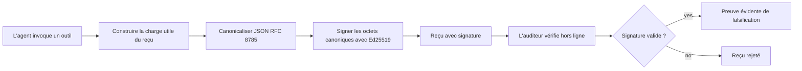
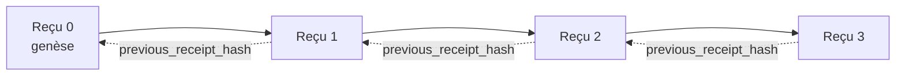

[Regardez la vidéo de la leçon : Sécuriser les agents IA avec des reçus cryptographiques](https://youtu.be/PLACEHOLDER_VIDEO_ID)

> _(Vidéo de la leçon et vignette à ajouter par l'équipe de contenu Microsoft après fusion, suivant le modèle des leçons 14 / 15.)_

# Sécuriser les agents IA avec des reçus cryptographiques

## Introduction

Cette leçon couvrira :

- Pourquoi les pistes d'audit pour les agents IA sont importantes pour la conformité, le débogage et la confiance.
- Ce qu'est un reçu cryptographique et en quoi il diffère d’une ligne de journal non signée.
- Comment produire un reçu signé pour un appel d'outil d’un agent en Python simple.
- Comment vérifier un reçu hors ligne et détecter toute falsification.
- Comment chaîner des reçus de sorte que la suppression ou le réordonnancement d’un reçu casse la chaîne.
- Ce que les reçus prouvent et ce qu’ils ne prouvent explicitement pas.

## Objectifs d’apprentissage

Après avoir suivi cette leçon, vous saurez comment :

- Identifier les modes d'échec qui motivent la provenance cryptographique des actions de l’agent.
- Produire un reçu signé Ed25519 sur une charge utile JSON canonique.
- Vérifier un reçu indépendamment en n'utilisant que la clé publique du signataire.
- Détecter la falsification en relançant la vérification sur un reçu modifié.
- Construire une séquence de reçus en chaîne de hachage et expliquer pourquoi la chaîne est importante.
- Reconnaître la limite entre ce que les reçus prouvent (attribution, intégrité, ordonnancement) et ce qu’ils ne prouvent pas (exactitude de l’action, validité de la politique).

## Le problème : la piste d’audit de votre agent

Imaginez que vous avez déployé un agent IA pour Contoso Travel. L’agent lit les demandes des clients, appelle une API de vols pour rechercher des options, et réserve des sièges au nom du client. Le trimestre dernier, l’agent a traité 50 000 réservations.

Aujourd’hui, un auditeur arrive. Il pose une question simple : « Montrez-moi ce que votre agent a fait. »

Vous remettez vos fichiers de journalisation. L’auditeur les consulte et pose une question plus difficile : « Comment puis-je savoir que ces journaux n'ont pas été modifiés ? »

C’est le problème de la piste d’audit. La plupart des déploiements d’agents aujourd’hui reposent sur :

- **Journaux d’application** : écrits par l’agent lui-même, modifiables par quiconque a accès au système de fichiers.
- **Services de journalisation cloud** : protégés contre la falsification au niveau de la plateforme, mais seulement si l’auditeur fait confiance à l’opérateur de la plateforme.
- **Journaux de transactions de base de données** : bien adaptés aux changements de base de données mais pas pour les appels d’outils arbitraires.

Aucun de ces moyens ne peut répondre à la question de l’auditeur sans que celui-ci ait à faire confiance à quelqu’un (vous, votre fournisseur cloud, votre vendeur de base de données). Pour un usage interne, cette confiance est souvent acceptable. Pour des charges de travail régulées (finance, santé, tout ce qui est soumis au règlement européen sur l’IA), ce n’est pas le cas.

Les reçus cryptographiques résolvent ce problème en rendant chaque action d’agent indépendamment vérifiable. L’auditeur n’a pas besoin de vous faire confiance. Il lui suffit de votre clé publique et du reçu lui-même.

## Qu’est-ce qu’un reçu cryptographique ?

Un reçu est un objet JSON qui enregistre ce qu’un agent a fait, signé avec une signature numérique.


```mermaid
flowchart LR
    A[L'agent invoque un outil] --> B[Construire la charge utile du reçu]
    B --> C[Canonicaliser JSON RFC 8785]
    C --> E[Signer les octets canoniques avec Ed25519]
    E --> F[Reçu avec signature]
    F --> G[L'auditeur vérifie hors ligne]
    G --> H{Signature valide ?}
    H -- yes --> I[Preuve évidente de falsification]
    H -- no --> J[Reçu rejeté]
```

Un reçu minimal ressemble à ceci :

```json
{
  "type": "agent.tool_call.v1",
  "agent_id": "contoso-travel-bot",
  "tool_name": "lookup_flights",
  "tool_args_hash": "sha256:a3f9c1...",
  "result_hash": "sha256:7b2e1d...",
  "policy_id": "contoso-travel-policy-v3",
  "timestamp": "2026-04-25T14:30:00Z",
  "sequence": 47,
  "previous_receipt_hash": "sha256:9d4e6a...",
  "signature": {
    "alg": "EdDSA",
    "sig": "c5af83...",
    "public_key": "8f3b2c..."
  }
}
```

Trois propriétés assurent le fonctionnement :

1. **La signature**. Le reçu est signé par la passerelle de l’agent à l’aide d’une clé privée Ed25519. Toute personne disposant de la clé publique correspondante peut vérifier la signature hors ligne. Toute modification d’un champ invalide la signature.

2. **Encodage canonique**. Avant la signature, le reçu est sérialisé selon le JSON Canonicalization Scheme (JCS, RFC 8785). Cela garantit que deux implémentations produisant le même reçu logique produisent une sortie identique au niveau octet. Sans canonisation, différents sérialiseurs JSON produiraient des signatures différentes pour un même contenu.

3. **Chaînage par hachage**. Le champ `previous_receipt_hash` relie chaque reçu au précédent. La suppression ou le réordonnancement d’un reçu casse tous les reçus qui suivent. La falsification devient visible au niveau de la chaîne, même si les signatures individuelles sont contournées.

Ensemble, ces propriétés fournissent trois garanties :

- **Attribution** : cette clé a signé ce contenu.
- **Intégrité** : le contenu n’a pas changé depuis la signature.
- **Ordonnancement** : ce reçu vient après ce reçu dans la chaîne.

## Produire un reçu en Python

Vous n’avez pas besoin d’une bibliothèque spéciale pour produire un reçu. Les primitives cryptographiques sont largement disponibles et la logique nécessite quelques dizaines de lignes de Python.

Les exercices pratiques dans `code_samples/18-signed-receipts.ipynb` parcourent tout le processus. Version résumée :

```python
import json
import hashlib
import base64
from nacl import signing
from jcs import canonicalize  # JSON canonique RFC 8785

def b64url_nopad(data: bytes) -> str:
    return base64.urlsafe_b64encode(data).decode("ascii").rstrip("=")

def sha256_canonical(obj) -> str:
    """SHA-256 of a Python object's JCS-canonical JSON form."""
    return f"sha256:{hashlib.sha256(canonicalize(obj)).hexdigest()}"

# Générer ou charger une clé de signature (en production, stocker dans un dépôt de clés)
signing_key = signing.SigningKey.generate()
verify_key = signing_key.verify_key

# Construire la charge utile du reçu (pas encore de signature)
tool_args = {"origin": "SYD", "destination": "LAX"}
tool_result = [{"flight": "QF11", "price": 1850, "stops": 0}]

payload = {
    "type": "agent.tool_call.v1",
    "agent_id": "contoso-travel-bot",
    "tool_name": "lookup_flights",
    "tool_args_hash": sha256_canonical(tool_args),
    "result_hash": sha256_canonical(tool_result),
    "policy_id": "contoso-travel-policy-v3",
    "timestamp": "2026-04-25T14:30:00Z",
    "sequence": 0,
    "previous_receipt_hash": None,
}

# Canoniciser et signer directement les octets JCS. PureEdDSA hache en interne.
canonical_bytes = canonicalize(payload)
signature_bytes = signing_key.sign(canonical_bytes).signature

# Joindre un objet de signature structuré.
receipt = {
    **payload,
    "signature": {
        "alg": "EdDSA",
        "sig": b64url_nopad(signature_bytes),
        "public_key": b64url_nopad(bytes(verify_key)),
    },
}
```

C’est toute la chaîne de signature. Les exercices dans le notebook détaillent chaque étape.

## Vérifier un reçu et détecter la falsification

La vérification est l’opération inverse :

```python
import base64
import hashlib
from nacl import signing
from nacl.exceptions import BadSignatureError
from jcs import canonicalize

def b64url_decode(s: str) -> bytes:
    padding = "=" * ((4 - len(s) % 4) % 4)
    return base64.urlsafe_b64decode(s + padding)

def verify_receipt(receipt: dict) -> bool:
    # La signature est un objet structuré : {"alg", "sig", "public_key"}.
    sig_obj = receipt.get("signature")
    if not sig_obj or sig_obj.get("alg") != "EdDSA":
        return False

    # Reconstruire la charge utile qui a été effectivement signée (tout sauf la signature).
    payload = {k: v for k, v in receipt.items() if k != "signature"}

    canonical_bytes = canonicalize(payload)

    try:
        verify_key = signing.VerifyKey(b64url_decode(sig_obj["public_key"]))
        verify_key.verify(canonical_bytes, b64url_decode(sig_obj["sig"]))
        return True
    except BadSignatureError:
        return False
```

Cette fonction prend un reçu et retourne `True` si la signature est valide, `False` sinon. Pas d’appel réseau, pas de dépendance à un service, pas besoin de faire confiance à un tiers.

Pour voir la détection de falsification en action, le notebook détaille :

1. Produire un reçu valide et confirmer sa vérification.
2. Modifier un octet dans le champ `tool_args_hash`.
3. Relancer la vérification et constater l’échec.

C’est la démonstration pratique que les reçus sont évidents à falsifier : toute modification, si minime soit-elle, casse la signature.

## Chaîner les reçus pour les agents en plusieurs étapes

Un reçu signé protège une action unique. Une chaîne de reçus protège une séquence.


```mermaid
flowchart LR
    R0[Reçu 0<br/>genèse] --> R1[Reçu 1]
    R1 --> R2[Reçu 2]
    R2 --> R3[Reçu 3]
    R1 -. previous_receipt_hash .-> R0
    R2 -. previous_receipt_hash .-> R1
    R3 -. previous_receipt_hash .-> R2
```

Chaque reçu enregistre le hachage du reçu précédent. Pour supprimer silencieusement le reçu 2, un attaquant devrait soit :

- Modifier le champ `previous_receipt_hash` du reçu 3 (ce qui casse la signature du reçu 3), OU
- Forger une nouvelle signature sur un reçu 3 modifié (ce qui nécessite la clé privée de l’agent).

Si la clé privée est stockée dans un coffre-fort matériel et que vous publiez la clé publique avec chaque reçu, aucune des attaques n’est réalisable sans détection.

Le notebook détaille :

1. La construction d’une chaîne de trois reçus.
2. La vérification que le `previous_receipt_hash` de chaque reçu correspond bien au hachage réel du reçu précédent.
3. La falsification d’un reçu au milieu de la chaîne et la rupture visible de la chaîne à ce point précis.

C’est ainsi que vous produisez une piste d’audit qu’un auditeur externe peut vérifier sans vous faire confiance.

## Ce que prouvent les reçus (et ce qu’ils ne prouvent pas)

C’est la section la plus importante de cette leçon. Les reçus sont puissants mais leur puissance a des limites.

**Les reçus prouvent trois choses :**

1. **Attribution** : une clé spécifique a signé une charge utile spécifique.
2. **Intégrité** : la charge utile n’a pas changé depuis la signature.
3. **Ordonnancement** : ce reçu vient après ce reçu dans la chaîne de hachage.

**Les reçus ne prouvent PAS :**

1. **Exactitude** : que l’action de l’agent était la bonne action. Un reçu peut être signé pour une mauvaise réponse aussi proprement que pour une bonne réponse.
2. **Conformité à la politique** : que la politique référencée dans `policy_id` a réellement été évaluée, ou qu’elle aurait permis cette action si elle avait été vérifiée. Le reçu enregistre ce qui a été affirmé, pas ce qui a été appliqué.
3. **Identité au-delà de la clé** : le reçu dit « cette clé a signé ce contenu ». Il ne dit pas « cet humain a autorisé cela ». Relier une clé à une personne ou organisation nécessite une infrastructure d’identité distincte (un annuaire, un registre de clés publiques, etc.)
4. **Véracité des entrées** : si l’agent reçoit un prompt manipulé et agit en conséquence, le reçu enregistre fidèlement l’action. Les reçus sont en aval de la validation des entrées, pas un substitut.

Cette limite importe pour deux raisons :

- Elle indique à quoi servent réellement les reçus : rendre le comportement des agents auditable et évident à falsifier, même à travers des frontières organisationnelles.
- Elle indique quelles couches supplémentaires vous devez encore ajouter : validation des entrées (Leçon 6), application de politique (abordée brièvement ci-dessous), et infrastructure d’identité (hors sujet de cette leçon).

Une erreur fréquente est de supposer que « nous avons des reçus » signifie « nous sommes gouvernés ». Ce n’est pas le cas. Les reçus sont une base. La gouvernance est le système que vous construisez par-dessus.

## Prouver qu’un humain a approuvé l’action exacte

Le point 3 ci-dessus mérite sa propre section : un reçu d’action dit « cette clé a signé ce contenu », jamais « un humain a autorisé cela ». Pour les actions à haut risque (remboursements, suppressions, virements bancaires), les cadres de gouvernance exigent de plus en plus précisément cette affirmation absente, qui est produite avec les mêmes primitives que vous avez déjà construites dans cette leçon.

Le notebook suivant `code_samples/human-authorization-receipts.ipynb` ajoute un second type de reçu, `human.approval.v1`, avec la même structure enveloppe que les reçus de la leçon (une charge utile typée signée par Ed25519 sur ses octets JCS canoniques, avec l’objet `signature` en dehors des octets signés). Un approbateur nommé signe **l’action canonique complète et son digest** avant exécution ; le reçu d’action de l’agent porte **le même digest d’action** et un `parent_approval_ref`, le `receipt_hash` de l’approbation, la même convention que `previous_receipt_hash` dans la chaîne construite ci-dessus. Une seule fonction `verify_chain` valide les deux artefacts sous **des registres de clés épinglés séparés** (clés d’approbateurs vs clés d’agents), donc le chemin de code est partagé mais les autorités ne le sont jamais.

La propriété obtenue, formulée soigneusement : *l’humain a approuvé cette action exacte, et l’agent a exécuté exactement cette action approuvée.* Les simulations de refus du notebook rendent cette propriété réelle plutôt que simplement affirmée :

- l’ensemble classique : falsification, délégué confus, rejouage, clés falsifiées de chaque côté, entrée mal formée ;
- **autorité périmée** : une signature qui vérifie toujours, refusée quand même parce que la version de la politique a changé, la clé d’approbateur a été retirée du registre épinglé, ou l’approbation a expiré avant l’exécution ;
- **substitution de digest** : un reçu d’action signé valide pointant vers une *vraie* approbation qui lie une *action canonique différente*.

Chaque échec refuse avec une raison distincte, donc un auditeur lisant un refus peut savoir si l’autorité est périmée ou si l’action exécutée a changé. La règle enseignée dans le notebook : une approbation signée n’est pas une autorité en soi. L’autorité existe seulement si les deux reçus lient toujours à la même action canonique au moment de l’exécution. Le reçu d’approbation humaine est une composition éducative définie par cette leçon, pas un type de reçu défini par `draft-farley-acta-signed-receipts`.

## Références pour la production

Le code Python de cette leçon est volontairement minimal pour que vous puissiez lire chaque ligne et comprendre précisément ce qui se passe. En production, vous avez deux options :

1. **Construire directement sur les primitives cryptographiques.** Les 50 lignes vues ci-dessus suffisent pour de nombreux cas d’usage. PyNaCl (Ed25519) et le paquet `jcs` (JSON canonique) sont des bibliothèques bien maintenues et auditées.

2. **Utiliser une bibliothèque de reçus prête à l’emploi.** Plusieurs projets open source implémentent ce même modèle avec des fonctionnalités supplémentaires (rotation de clés, vérification par lots, distribution de jeu de clés JWK, intégration avec moteurs de politique) :
   - La chaîne de signature utilise les conventions JCS et scope de signature dans un Internet-Draft indépendant de l’IETF ([`draft-farley-acta-signed-receipts`](https://datatracker.ietf.org/doc/draft-farley-acta-signed-receipts/), révision 02). Le reçu plat éducatif de cette leçon diffère de l’enveloppe `{payload, signature}` du draft et n’est pas présenté comme une implémentation conforme. Le draft publie une suite de conformité partagée ([agent-governance-testvectors](https://github.com/ScopeBlind/agent-governance-testvectors)) pour implémentations ciblant ce format.
   - Le Microsoft Agent Governance Toolkit compose des reçus avec des décisions de politique basées sur Cedar ; voir le Tutoriel 33 dans ce dépôt pour un exemple de bout en bout.
   - Les paquets `protect-mcp` (npm) et `@veritasacta/verify` (npm) fournissent une implémentation Node de signature de reçus et vérification hors ligne, destinés à envelopper tout serveur MCP avec une piste d’audit évidente à falsifier, incluant un flux held-for-co-sign dans lequel une action mise en pause émet un reçu d’approbation lié au digest de l’action (soutenu par WebAuthn dans le flux desktop), le même modèle d’approbation que celui du notebook d’autorisation humaine ci-dessus.
   - Le SDK Python **[nobulex](https://github.com/arian-gogani/nobulex)** (`pip install nobulex`) fournit le même modèle de signature Ed25519 + JCS en Python avec intégrations LangChain et CrewAI, incluant des vecteurs de test de validation croisée publiés et une cartographie de conformité contribué via [OWASP PR #2210](https://github.com/OWASP/CheatSheetSeries/pull/2210).

Le choix entre développer soi-même et utiliser une bibliothèque reflète celui entre écrire sa propre bibliothèque JWT et en utiliser une testée : les deux sont raisonnables ; la bibliothèque fait gagner du temps et réduit la surface d’audit ; la méthode from-scratch vous force à comprendre chaque primitive. Cette leçon enseigne la voie from-scratch pour vous donner la base dans les deux cas.

## Vérification des connaissances

Testez votre compréhension avant de passer à l’exercice pratique.

**1. Un reçu est signé avec la clé privée Ed25519 de l’agent. L’auditeur dispose seulement de la clé publique. L’auditeur peut-il vérifier le reçu hors ligne ?**

<details>
<summary>Réponse</summary>

Oui. La vérification Ed25519 nécessite uniquement la clé publique et les octets signés. Pas d’appel réseau, pas de dépendance à un service. C’est cette propriété qui rend les reçus utiles dans des contextes d’audit isolés, multi-organisationnels ou à faible confiance.
</details>

**2. Un attaquant modifie le champ `policy_id` d’un reçu pour prétendre qu’il était soumis à une politique plus permissive. La signature portait sur la charge utile originale. Que se passe-t-il lors de la vérification ?**

<details>
<summary>Réponse</summary>


La vérification échoue. La signature a été calculée sur les octets canoniques de la charge utile originale ; modifier un champ quelconque change ces octets, ce qui rend la signature invalide. L'attaquant aurait besoin de la clé privée pour produire une nouvelle signature valide, ce qu'il ne possède pas.
</details>

**3. Pourquoi le reçu inclut-il un `tool_args_hash` et un `result_hash` plutôt que les arguments et résultats bruts ?**

<details>
<summary>Réponse</summary>

Deux raisons. Premièrement, le reçu peut devoir être archivé ou transmis dans des environnements où la fuite du contenu brut (Données personnelles, données métier) pose problème. Le hachage maintient le reçu compact et protège le contenu ; l'auditeur vérifie que le hachage correspond à une copie stockée séparément du contenu réel. Deuxièmement, les hachages ont une taille fixe ; un reçu avec des hachages a une taille limitée indépendamment de la taille des entrées et sorties.
</details>

**4. Le champ `previous_receipt_hash` lie chaque reçu à son prédécesseur. Si un attaquant supprime silencieusement un reçu du milieu d'une chaîne, qu'est-ce qui devient invalide ?**

<details>
<summary>Réponse</summary>

Tous les reçus qui suivaient celui supprimé. Leurs champs `previous_receipt_hash` ne correspondent plus à la chaîne réelle (car le reçu référencé n'existe plus, ou la chaîne pointe maintenant vers un prédécesseur différent). Pour cacher la suppression, l'attaquant devrait resigner chaque reçu suivant, ce qui nécessite la clé privée.
</details>

**5. Un reçu est vérifié avec succès. Cela prouve-t-il que l'action de l'agent était correcte, valide ou conforme à la politique ?**

<details>
<summary>Réponse</summary>

Non. Un reçu valide prouve trois choses : l'attribution (cette clé a signé ce contenu), l'intégrité (le contenu n'a pas changé) et l'ordre (ce reçu est bien postérieur à ce reçu-là). Il ne prouve PAS que l'action était correcte, que la politique nommée dans `policy_id` a bien été évaluée, ou que l'agent a respecté chaque règle. Les reçus rendent le comportement de l'agent auditable, pas nécessairement correct. C'est la limite la plus importante de cette leçon.
</details>

## Exercice pratique

Ouvrez `code_samples/18-signed-receipts.ipynb` et complétez les quatre sections :

1. **Section 1** : Signez votre premier reçu et vérifiez-le.
2. **Section 2** : Altérez le reçu et observez l’échec de la vérification.
3. **Section 3** : Construisez une chaîne de trois reçus et vérifiez l'intégrité de la chaîne.
4. **Section 4** : Appliquez le modèle à un agent construit avec le Microsoft Agent Framework : encapsulez un appel d’outil dans la signature de reçu, puis vérifiez le reçu indépendamment.

**Défi supplémentaire 1 :** étendez le schéma de reçu avec un champ supplémentaire de votre choix (par exemple, un ID de requête pour le traçage), mettez à jour la logique de signature canonique pour l’inclure, et confirmez que le reçu passe toujours la vérification bidirectionnelle. Puis modifiez ce champ après signature et confirmez l’échec de la vérification. Cela vous force à comprendre comment chaque octet de l’encodage canonique contribue à la signature.

**Défi supplémentaire 2 :** Hachez avec SHA-256 deux de vos reçus ensemble (concaténez leurs octets canoniques dans un ordre déterministe) et intégrez le digest résultant comme un nouveau champ sur un troisième reçu avant de le signer. Vérifiez que les trois reçus passent toujours la vérification bidirectionnelle. Vous avez ainsi construit une preuve d’inclusion en une étape : toute personne possédant le troisième reçu peut prouver que les deux premiers existaient au moment de sa signature, sans devoir révéler leur contenu. C’est le modèle utilisé à grande échelle dans les reçus à divulgation sélective (engagements de Merkle, RFC 6962).

## Conclusion

Les reçus cryptographiques fournissent aux agents IA une piste d’audit qui est :

- **Indépendamment vérifiable** : toute partie ayant la clé publique peut vérifier, sans dépendance à un service.
- **À l’épreuve des altérations** : toute modification invalide la signature.
- **Portable** : un reçu est un petit fichier JSON ; il peut être archivé, transmis et vérifié partout.
- **Aligné sur les standards** : construit sur Ed25519 (RFC 8032), JCS (RFC 8785) et SHA-256, des primitives largement déployées.

Ils ne remplacent pas la validation des entrées, l’application des politiques ou l’infrastructure d’identité. Ils constituent la base pour ces couches. Lorsque vous déployez des agents dans des environnements réglementés, des flux de travail multi-organisation, ou tout contexte où un futur auditeur ne peut pas être supposé vous faire confiance, les reçus sont la manière de rendre la piste d’audit honnête.

L’essentiel à retenir : les reçus prouvent qui a dit quoi, et quand. Ils ne prouvent pas que ce qui a été dit était vrai ou juste. Gardez bien cette distinction. C’est la différence entre un système de provenance honnête et un système trompeur.

## Liste de vérification pour la production

Lorsque vous êtes prêt à passer de cette leçon au déploiement d’agents signant des reçus en environnement réel :

- [ ] **Déplacez la clé de signature hors de l’ordinateur du développeur.** Utilisez Azure Key Vault, AWS KMS ou un module matériel de sécurité. La clé privée signant vos reçus ne doit jamais se trouver dans le contrôle de source ou en clair sur les machines applicatives.
- [ ] **Publiez la clé publique de vérification.** Les auditeurs en ont besoin pour vérifier offline. Le modèle standard est un ensemble JWK à une URL bien connue (RFC 7517), par exemple `https://your-org.example.com/.well-known/agent-keys.json`.
- [ ] **Ancrez la chaîne à l’extérieur.** Écrivez périodiquement le hash de la tête de chaîne la plus récente dans un journal de transparence (Sigstore Rekor, une autorité de timestamp RFC 3161, ou un second système interne) pour qu’un tiers puisse confirmer « cette chaîne existait à ce moment ».
- [ ] **Stockez les reçus de manière immuable.** Le stockage append-only (Azure Storage avec politiques d’immuabilité, AWS S3 Object Lock) empêche un initié de réécrire l’histoire au niveau du stockage.
- [ ] **Décidez de la durée de conservation.** De nombreux régimes de conformité exigent une conservation de plusieurs années. Prévoyez la croissance des reçus (chaque reçu fait ~500 octets; un agent effectuant 10 000 appels par jour génère ~1.8 Go par an).
- [ ] **Documentez ce que les reçus ne couvrent pas.** Les reçus prouvent l’attribution, l’intégrité et l’ordre. Votre plan d’exploitation doit lister explicitement quels contrôles supplémentaires (validation d’entrée, application des politiques, limitation du taux, infrastructure d’identité) accompagnent les reçus dans votre posture de gouvernance.

### Vous avez d’autres questions sur la sécurisation des agents IA ?

Rejoignez le [Microsoft Foundry Discord](https://aka.ms/ai-agents/discord) pour rencontrer d’autres apprenants, assister aux heures de bureau et obtenir des réponses à vos questions sur les agents IA.

## Au-delà de cette leçon

Cette leçon couvre la signature d’un seul reçu et les séquences en chaîne de hachages. Les mêmes primitives s’assemblent en plusieurs modèles plus avancés que vous pouvez rencontrer à mesure que votre posture de gouvernance mûrit :

- **Divulgation sélective.** Lorsque les champs d’un reçu sont engagés indépendamment (arbre de Merkle style RFC 6962), vous pouvez révéler certains champs à certains auditeurs et prouver que les autres n’ont pas changé sans les exposer. Utile quand un même reçu doit satisfaire à la fois un audit complet (exigeant exhaustivité) et des réglementations de minimisation des données comme le RGPD (qui veulent que l’auditeur voie le moins possible).
- **Révocation de reçus.** Si une clé de signature est compromise, vous devez pouvoir marquer tous les reçus signés par cette clé comme non fiables à partir d’un moment donné. Modèles standards : clés de signature à courte durée de vie plus liste de révocation publiée, ou journal de transparence avec entrées de révocation.
- **Reçus bilatéraux / signature fractionnée.** Certaines implémentations divisent la charge utile signée en deux moitiés, pré-exécution (`authorization_*`) et post-exécution (`result_*`), avec signatures indépendantes, utile lorsque la décision d’autorisation et le résultat observé sont produits par différents acteurs ou à différents moments. Cela s’ajoute de façon additive au format de reçu enseigné dans cette leçon.
- **Composition de charge utile.** Un reçu scelle les octets que vous mettez dans `result_hash`. Les charges utiles réelles sont souvent plus riches qu’un simple résultat d’appel d’outil : raisonnement pré-décision (prédiction modèle, options considérées, preuves et leur complétude, posture de risque, chaîne de responsabilité, résultat du gate) peuvent tous vivre dans la charge utile, scellée par un seul reçu. Cela maintient le format de reçu minimal tout en laissant évoluer les schémas de charge utile domaine par domaine.
- **Conformité inter-implémentation.** Plusieurs implémentations indépendantes du même format de reçu (Python, TypeScript, Rust, Go) se vérifient entre elles avec des vecteurs de test partagés. Si vous créez votre propre implémentation, valider avec les vecteurs publiés confirme la compatibilité sur le fil.
- **Migration post-quantique.** Ed25519 est largement déployé aujourd’hui mais n’est pas résistant au quantique. Le format de reçu est agile sur l’algorithme : le champ `signature.alg` peut porter `ML-DSA-65` (standard de signature post-quantique NIST) lorsque vous devez migrer. Prévoyez une période de transition où les reçus sont signés en double.

## Ressources supplémentaires

- <a href="https://datatracker.ietf.org/doc/draft-farley-acta-signed-receipts/" target="_blank">Brouillon IETF : Reçus de décision signés pour le contrôle d’accès machine-à-machine</a>
- <a href="https://learn.microsoft.com/azure/ai-studio/responsible-use-of-ai-overview" target="_blank">Vue d’ensemble de l’IA responsable (Azure AI)</a>
- <a href="https://datatracker.ietf.org/doc/html/rfc8032" target="_blank">RFC 8032 : Algorithme de signature numérique Edwards-Curve (EdDSA)</a>
- <a href="https://datatracker.ietf.org/doc/html/rfc8785" target="_blank">RFC 8785 : Schéma de canonicalisation JSON (JCS)</a>
- <a href="https://datatracker.ietf.org/doc/html/rfc6962" target="_blank">RFC 6962 : Transparence de certificat</a> (construction en arbre de Merkle utilisée par les reçus à divulgation sélective)
- <a href="https://github.com/microsoft/agent-governance-toolkit/blob/main/docs/tutorials/33-offline-verifiable-receipts.md" target="_blank">Microsoft Agent Governance Toolkit, Tutoriel 33 : Reçus de décision vérifiables hors ligne</a>
- <a href="https://github.com/ScopeBlind/agent-governance-testvectors" target="_blank">Vecteurs de test de conformité inter-implémentation</a> pour le format de reçu utilisé dans cette leçon (Apache-2.0)
- <a href="https://pynacl.readthedocs.io/" target="_blank">Documentation PyNaCl</a> (Ed25519 en Python)

## Leçon précédente

[Création d’agents IA locaux](../17-creating-local-ai-agents/README.md)

---

<!-- CO-OP TRANSLATOR DISCLAIMER START -->
**Avertissement** :
Ce document a été traduit à l'aide du service de traduction automatique [Co-op Translator](https://github.com/Azure/co-op-translator). Bien que nous nous efforçions d'assurer l'exactitude, veuillez noter que les traductions automatisées peuvent contenir des erreurs ou des inexactitudes. Le document original dans sa langue native doit être considéré comme la source faisant autorité. Pour les informations critiques, il est recommandé de recourir à une traduction professionnelle réalisée par un humain. Nous ne saurions être tenus responsables des malentendus ou erreurs d'interprétation découlant de l'utilisation de cette traduction.
<!-- CO-OP TRANSLATOR DISCLAIMER END -->