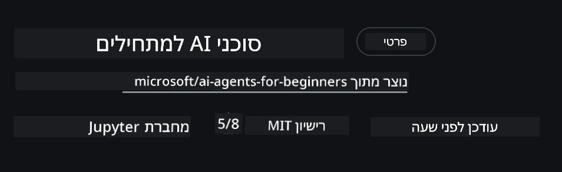

# הגדרת הקורס

## הקדמה

השיעור הזה יכסה כיצד להריץ את דוגמאות הקוד של הקורס הזה.

## הצטרפו ללומדים אחרים וקבלו עזרה

לפני שתתחילו לשכפל את הריפוזיטורי שלכם, הצטרפו לערוץ [AI Agents For Beginners Discord](https://aka.ms/ai-agents/discord) כדי לקבל כל עזרה בהגדרה, שאלות לגבי הקורס, או כדי להתחבר ללומדים אחרים.

## שכפול או פורק של ריפוזיטורי זה

כדי להתחיל, אנא שכפלו או צרו פורק לריפוזיטורי GitHub. זה יהפוך את חומרי הקורס לגרסה שלכם כדי שתוכלו להריץ, לבדוק ולשנות את הקוד!

ניתן לעשות זאת על ידי לחיצה על הקישור ל- <a href="https://github.com/microsoft/ai-agents-for-beginners/fork" target="_blank">יצירת פורק לריפוזיטורי</a>

כעת אמורה להיות לכם גרסה פורקת של הקורס בקישור הבא:



### שכפול רדוד (מומלץ לסדנאות / Codespaces)

  >הריפוזיטורי המלא יכול להיות גדול (~3 GB) כאשר אתם מורידים את ההיסטוריה המלאה ואת כל הקבצים. אם אתם משתתפים רק בסדנה או צריכים רק כמה תיקיית שיעור, שכפול רדוד (או שכפול חלקי) מונע את רוב ההורדה על ידי קיצור ההיסטוריה ו/או דילוג על בלובים.

#### שכפול רדוד מהיר — היסטוריה מינימלית, כל הקבצים

החליפו את `<your-username>` בפקודות מטה עם כתובת ה-URL של הפורק שלכם (או כתובת העליונה אם אתם מעדיפים).

כדי לשכפל רק את ההיסטוריה של הקומיטים העדכניים ביותר (הורדה קטנה):

```bash|powershell
git clone --depth 1 https://github.com/<your-username>/ai-agents-for-beginners.git
```

כדי לשכפל סניף מסוים:

```bash|powershell
git clone --depth 1 --branch <branch-name> https://github.com/<your-username>/ai-agents-for-beginners.git
```

#### שכפול חלקי (_sparse_) — בלובים מינימליים + רק תיקיות נבחרות

זה משתמש בשכפול חלקי וב_sparse-checkout (דורש Git 2.25+ ומומלץ להשתמש ב-Git מודרני עם תמיכה בשכפול חלקי):

```bash|powershell
git clone --depth 1 --filter=blob:none --sparse https://github.com/<your-username>/ai-agents-for-beginners.git
```

גשו לתיקיית הריפוזיטורי:

```bash|powershell
cd ai-agents-for-beginners
```

ואז ציינו אילו תיקיות אתם רוצים (דוגמה למטה מציגה שתי תיקיות):

```bash|powershell
git sparse-checkout set 00-course-setup 01-intro-to-ai-agents
```

לאחר השכפול ואימות הקבצים, אם אתם צריכים רק קבצים ורוצים לפנות מקום (בלי היסטוריית Git), אנא מחקו את מטא-נתוני הריפוזיטורי (💀לא הפיך — תאבדו את כל פונקציות Git: לא יהיו קומיטים, פולים, דחיפות או גישה להיסטוריה).

```bash
# זש/באש
rm -rf .git
```

```powershell
# פאוורשל
Remove-Item -Recurse -Force .git
```

#### שימוש ב-GitHub Codespaces (מומלץ כדי להימנע מהורדות גדולות מקומיות)

- צרו Codespace חדש עבור הריפוזיטורי הזה דרך [ממשק GitHub](https://github.com/codespaces).

- בטרמינל של ה-Codespace החדש שיצרתם, הריצו אחת מפקודות השכפול הרדוד/החלקי למעלה כדי להביא רק תיקיות שיעור שאתם צריכים לתוך סביבת העבודה של Codespace.
- אופציונלי: לאחר השכפול בתוך Codespaces, הסירו את .git כדי לפנות מקום נוסף (ראו פקודות הסרה למעלה).
- הערה: אם אתם מעדיפים לפתוח את הריפוזיטורי ישירות ב-Codespaces (בלי שכפול נוסף), היו מודעים ש-Codespaces יבנה את סביבת ה-devcontainer וייתכן שעדיין יספק יותר ממה שאתם צריכים. שכפול עותק רדוד בתוך Codespace טרי נותן שליטה טובה יותר על שימוש בדיסק.

#### טיפים

- תמיד החליפו את כתובת השכפול בכתובת הפורק שלכם אם תרצו לערוך/להתחייב.
- אם בהמשך תצטרכו יותר היסטוריה או קבצים, תוכלו למשוך אותם או להתאים את ה-sparse-checkout כדי לכלול תיקיות נוספות.

## הרצת הקוד

הקורס מציע סדרת מחברות Jupyter שניתן להריץ כדי לקבל ניסיון מעשי בבניית סוכני AI.

דוגמאות הקוד משתמשות ב**Microsoft Agent Framework (MAF)** עם ה-`AzureAIProjectAgentProvider`, אשר מתחבר ל-**Azure AI Agent Service V2** (ממשק ה-Responses API) דרך **Microsoft Foundry**.

כל מחברות הפייתון מסומנות `*-python-agent-framework.ipynb`.

## דרישות

- פייתון 3.12+
  - **הערה**: אם אין לכם פייתון 3.12 מותקן, ודאו להתקין אותו. לאחר מכן צרו סביבת וירטואלית (venv) באמצעות python3.12 כדי להבטיח שהגרסאות הנכונות מותקנות מתוך הקובץ requirements.txt.
  
    >דוגמה

    צרו תיקיית venv לפייתון:

    ```bash|powershell
    python -m venv venv
    ```

    ואז הפעלו את סביבת ה-venv עבור:

    ```bash
    # זש/בש
    source venv/bin/activate
    ```
  
    ```dos
    # Command Prompt for Windows
    venv\Scripts\activate
    ```

- .NET 10+: עבור דוגמאות הקוד שמשתמשות ב-.NET, ודאו להתקין את [.NET 10 SDK](https://dotnet.microsoft.com/download/dotnet/10.0) או גרסה מאוחרת יותר. לאחר מכן בדקו את גרסת ה-.NET SDK המותקנת:

    ```bash|powershell
    dotnet --list-sdks
    ```

- **Azure CLI** — נדרש לאימות. התקינו אותו מ-[aka.ms/installazurecli](https://aka.ms/installazurecli).
- **מנוי Azure** — לצורך גישה ל-Microsoft Foundry ושירות Azure AI Agent.
- **Microsoft Foundry Project** — פרויקט עם מודל פעיל (לדוגמה, `gpt-4o`). ראו [שלב 1](../../../00-course-setup) למטה.

הוספנו קובץ `requirements.txt` בשורש הריפוזיטורי שמכיל את כל החבילות הדרושות בפייתון להרצת דוגמאות הקוד.

ניתן להתקין אותן על ידי הרצת הפקודה הבאה בטרמינל בשורש הריפוזיטורי:

```bash|powershell
pip install -r requirements.txt
```

מומלץ ליצור סביבה וירטואלית לפייתון כדי למנוע התנגשויות ובעיות.

## הגדרת VSCode

ודאו שאתם משתמשים בגרסת הפייתון הנכונה ב-VSCode.


## הגדרת Microsoft Foundry ושירות Azure AI Agent

### שלב 1: יצירת פרויקט ב-Microsoft Foundry

אתם צריכים **hub** ו-**project** של Azure AI Foundry עם מודל מיושם כדי להריץ את המחברות.

1. גשו ל-[ai.azure.com](https://ai.azure.com) והתחברו עם חשבון Azure שלכם.
2. צרו **hub** (או השתמשו באחד קיים). ראו: [סקירת משאבי Hub](https://learn.microsoft.com/azure/ai-foundry/concepts/ai-resources).
3. בתוך ה-hub, צרו **project**.
4. הפעילו מודל (לדוגמה, `gpt-4o`) מ-**Models + Endpoints** → **Deploy model**.

### שלב 2: השגת כתובת הקצה של הפרויקט ושם הפריסה של המודל

מפרויקטכם בפורטל Microsoft Foundry:

- **כתובת קצה הפרויקט** — גשו לדף **Overview** והעתיקו את כתובת הקצה (URL).


- **שם פריסת המודל** — גשו אל **Models + Endpoints**, בחרו את המודל שהפעלתם, ורשמו את **שם הפריסה** (לדוגמה, `gpt-4o`).

### שלב 3: התחברו ל-Azure באמצעות `az login`

כל המחברות משתמשות ב-**`AzureCliCredential`** לאימות — אין צורך לנהל מפתחות API. זה דורש שזו תהיה לכם התחברות פעילה דרך Azure CLI.

1. **התקינו את Azure CLI** אם עדיין לא עשיתם זאת: [aka.ms/installazurecli](https://aka.ms/installazurecli)

2. **התחברו** על ידי הרצת:

    ```bash|powershell
    az login
    ```

    או אם אתם בסביבת מרוחקת/Codespace ללא דפדפן:

    ```bash|powershell
    az login --use-device-code
    ```

3. **בחרו את המנוי שלכם** אם תקבלו הזמנה — בחרו את המנוי שמכיל את פרויקט Foundry שלכם.

4. **בדקו** שאתם מחוברים:

    ```bash|powershell
    az account show
    ```

> **מדוע `az login`?** המחברות מאמתות באמצעות `AzureCliCredential` מחבילת `azure-identity`. משמעות הדבר היא שסשן ה-Azure CLI שלכם מספק את האישורים — אין מפתחות API או סודות בקובץ `.env`. זו [המלצה בטיחותית מומלצת](https://learn.microsoft.com/azure/developer/ai/keyless-connections).

### שלב 4: צרו את קובץ `.env` שלכם

העתיקו את קובץ הדוגמה:

```bash
# zsh/bash
cp .env.example .env
```

```powershell
# פאוורשל
Copy-Item .env.example .env
```

פתחו את `.env` ומלאו את הערכים האלה:

```env
AZURE_AI_PROJECT_ENDPOINT=https://<your-project>.services.ai.azure.com/api/projects/<your-project-id>
AZURE_AI_MODEL_DEPLOYMENT_NAME=gpt-4o
```

| משתנה | היכן למצוא אותו |
|----------|-----------------|
| `AZURE_AI_PROJECT_ENDPOINT` | פורטל Foundry → הפרויקט שלכם → דף **Overview** |
| `AZURE_AI_MODEL_DEPLOYMENT_NAME` | פורטל Foundry → **Models + Endpoints** → שם פריסת המודל שלכם |

זהו, לרוב השיעורים! המחברות יאמתו אוטומטית דרך סשן `az login` שלכם.

### שלב 5: התקנת תלות בפייתון

```bash|powershell
pip install -r requirements.txt
```

מומלץ להריץ זאת בתוך סביבה וירטואלית שיצרתם קודם.

## הגדרה נוספת לשיעור 5 (Agentic RAG)

השיעור 5 משתמש ב-**Azure AI Search** ליצירת השלמה מבוססת שליפה. אם אתם מתכננים להריץ את השיעור הזה, הוסיפו את המשתנים האלה לקובץ `.env` שלכם:

| משתנה | היכן למצוא אותו |
|----------|-----------------|
| `AZURE_SEARCH_SERVICE_ENDPOINT` | פורטל Azure → משאב **Azure AI Search** שלכם → **Overview** → URL |
| `AZURE_SEARCH_API_KEY` | פורטל Azure → משאב **Azure AI Search** שלכם → **Settings** → **Keys** → מפתח מנהל ראשי |

## הגדרה נוספת לשיעורים 6 ו-8 (GitHub Models)

חלק מהמחברות בשיעורים 6 ו-8 משתמשות ב-**GitHub Models** במקום Azure AI Foundry. אם אתם מתכננים להריץ דוגמאות אלה, הוסיפו את המשתנים האלה לקובץ `.env` שלכם:

| משתנה | היכן למצוא אותו |
|----------|-----------------|
| `GITHUB_TOKEN` | GitHub → **Settings** → **Developer settings** → **Personal access tokens** |
| `GITHUB_ENDPOINT` | השתמשו ב-`https://models.inference.ai.azure.com` (ערך ברירת מחדל) |
| `GITHUB_MODEL_ID` | שם המודל לשימוש (למשל `gpt-4o-mini`) |

## הגדרה נוספת לשיעור 8 (Bing Grounding Workflow)

מחברת הזרימה התנאי בשיעור 8 משתמשת ב-**Bing grounding** דרך Azure AI Foundry. אם אתם מתכננים להריץ את הדוגמה הזו, הוסיפו משתנה זה לקובץ `.env` שלכם:

| משתנה | היכן למצוא אותו |
|----------|-----------------|
| `BING_CONNECTION_ID` | פורטל Azure AI Foundry → הפרויקט שלכם → **Management** → **Connected resources** → חיבור Bing שלכם → העתק את מזהה החיבור |

## פתרון בעיות

### שגיאות אימות תעודת SSL במערכת macOS

אם אתם ב-macOS ומקבלים שגיאה כמו:

```plaintext
ssl.SSLCertVerificationError: [SSL: CERTIFICATE_VERIFY_FAILED] certificate verify failed: self-signed certificate in certificate chain
```

זו בעיה ידועה של פייתון במערכת macOS שבה תעודות ה-SSL של המערכת אינן מורשות אוטומטית. נסו את הפתרונות הבאים לפי הסדר:

**אפשרות 1: הריצו את סקריפט התקנת התעודות של פייתון (מומלץ)**

```bash
# החלף 3.XX בגרסת הפייתון שהתקנת (לדוגמה, 3.12 או 3.13):
/Applications/Python\ 3.XX/Install\ Certificates.command
```

**אפשרות 2: השתמשו ב-`connection_verify=False` במחברת שלכם (רק למחברות GitHub Models)**

במחברת של שיעור 6 (`06-building-trustworthy-agents/code_samples/06-system-message-framework.ipynb`), יש כבר פתרון עקיף מוקלד בהערה. הסירו את ההערה מ-`connection_verify=False` כאשר אתם יוצרים את הלקוח:

```python
client = ChatCompletionsClient(
    endpoint=endpoint,
    credential=AzureKeyCredential(token),
    connection_verify=False,  # השבת אימות SSL אם אתה נתקל בשגיאות בתעודה
)
```

> **⚠️ אזהרה:** כיבוי אימות SSL (`connection_verify=False`) מפחית את האבטחה על ידי דילוג על אימות תעודה. השתמשו בזה רק כפתרון זמני בסביבות פיתוח, לעולם לא בפרודקשן.

**אפשרות 3: התקינו והשתמשו ב-`truststore`**

```bash
pip install truststore
```

ואז הוסיפו את הפקודה הבאה לראש המחברת או הסקריפט שלכם לפני כל קריאת רשת:

```python
import truststore
truststore.inject_into_ssl()
```

## תקועים איפשהו?

אם יש לכם בעיות בהרצת ההגדרה הזו, הצטרפו ל- <a href="https://discord.gg/kzRShWzttr" target="_blank">קהילת Azure AI בדיסקורד</a> או <a href="https://github.com/microsoft/ai-agents-for-beginners/issues?WT.mc_id=academic-105485-koreyst" target="_blank">צרו נושא</a>.

## השיעור הבא

כעת אתם מוכנים להריץ את הקוד לקורס הזה. לימוד נעים בעולם סוכני ה-AI!

[מבוא לסוכני AI ומקרי שימוש](../01-intro-to-ai-agents/README.md)

---

<!-- CO-OP TRANSLATOR DISCLAIMER START -->
**הצהרה על הגבלת אחריות**:
מסמך זה תורגם באמצעות שירות תרגום מבוסס בינה מלאכותית [Co-op Translator](https://github.com/Azure/co-op-translator). למרות שאנו שואפים לדיוק, יש לזכור כי תרגומים אוטומטיים עלולים להכיל טעויות או אי-דיוקים. המסמך המקורי בשפתו המקורית נחשב למקור הסמכותי. למידע קריטי, מומלץ להשתמש בתרגום מקצועי ובידי אדם. אנו לא נושאים באחריות לכל אי-הבנה או פרשנות שגויה הנובעת משימוש בתרגום זה.
<!-- CO-OP TRANSLATOR DISCLAIMER END -->