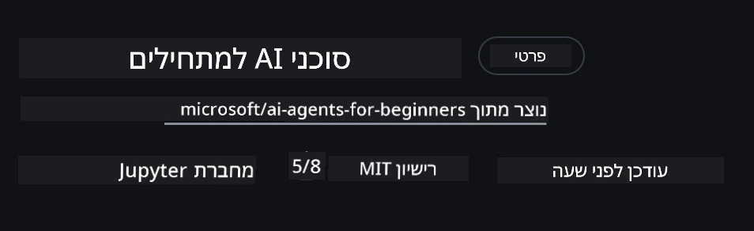
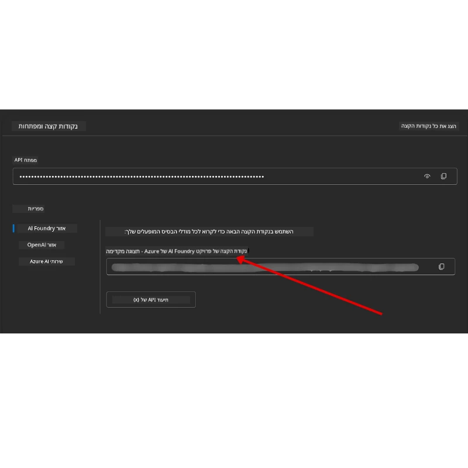

# התקנת הקורס

## מבוא

בשיעור זה נלמד כיצד להריץ את דוגמאות הקוד של הקורס.

## הצטרפו ללומדים אחרים וקבלו עזרה

לפני שתתחילו לשכפל את המאגר שלכם, הצטרפו ל-[ערוץ דיסקורד AI Agents For Beginners](https://aka.ms/ai-agents/discord) כדי לקבל עזרה בהתקנה, לשאול שאלות על הקורס, או להתחבר עם לומדים אחרים.

## שכפול או הסתעפות של המאגר הזה

כדי להתחיל, אנא שכפלו או הסתעפו מהמאגר של GitHub. כך תוכלו ליצור גרסה משלכם של חומרי הקורס כדי שתוכלו להריץ, לבדוק ולשנות את הקוד!

ניתן לעשות זאת על ידי לחיצה על הקישור ל-<a href="https://github.com/microsoft/ai-agents-for-beginners/fork" target="_blank">הסתעפות של המאגר</a>

כעת אמורה להיות לכם גרסה מתפצלת משלכם של הקורס בקישור הבא:



### שכפול שטחי (מומלץ לסדנאות / Codespaces)

  >המאגר השלם יכול להיות גדול (~3 GB) כאשר מורידים את כל ההיסטוריה וכל הקבצים. אם אתם משתתפים רק בסדנה או צריכים רק כמה תיקיות של שיעורים, שכפול שטחי (או שכפול ססגוני) מונע את רוב ההורדה על ידי קיצוץ ההיסטוריה ו/או דילוג על בלובים.

#### שכפול שטחי מהיר — היסטוריה מינימלית, כל הקבצים

החליפו את `<your-username>` בפקודות מטה עם כתובת ה-URL של ההסתעפות שלכם (או את כתובת ה-URL המקורית אם אתם מעדיפים).

לשכפול רק של ההיסטוריה האחרונה (הורדה קטנה):

```bash|powershell
git clone --depth 1 https://github.com/<your-username>/ai-agents-for-beginners.git
```

לשכפול של סניף ספציפי:

```bash|powershell
git clone --depth 1 --branch <branch-name> https://github.com/<your-username>/ai-agents-for-beginners.git
```

#### שכפול חלקי (ססגוני) — בלובים מינימליים + רק תיקיות נבחרות

זה משתמש בשכפול חלקי ודילוג ססגוני (דורש Git 2.25+ ומומלץ להשתמש ב-Git מודרני עם תמיכה בשכפול חלקי):

```bash|powershell
git clone --depth 1 --filter=blob:none --sparse https://github.com/<your-username>/ai-agents-for-beginners.git
```

עברו לתיקיית המאגר:

```bash|powershell
cd ai-agents-for-beginners
```

אז ציינו את התיקיות שברצונכם (בדוגמה למטה מוצגות שתי תיקיות):

```bash|powershell
git sparse-checkout set 00-course-setup 01-intro-to-ai-agents
```

אחרי השכפול ואימות הקבצים, אם אתם צריכים רק את הקבצים ורוצים לפנות מקום (בלי היסטוריית Git), מחקו את המטה-דאטה של המאגר (💀בלתי הפיך — תאבדו את כל פונקציונליות Git: ללא התחייבויות, משיכות, דחיפות, או גישה להיסטוריה).

```bash
# זש/באש
rm -rf .git
```

```powershell
# פאוורשל
Remove-Item -Recurse -Force .git
```

#### שימוש ב-GitHub Codespaces (מומלץ להימנע מהורדות גדולות מקומיות)

- צרו Codespace חדש למאגר זה דרך [ממשק GitHub](https://github.com/codespaces).  

- במסוף של ה-Codespace שנוצר, הריצו אחת מהפקודות לשכפול שטחי/ססגוני לעיל כדי להביא רק את תיקיות השיעורים שאתם צריכים למרחב העבודה של ה-Codespace.
- אופציונלי: אחרי השכפול בתוך Codespaces, הסירו את .git כדי לשחרר מקום נוסף (ראו פקודות הסרה למעלה).
- הערה: אם אתם מעדיפים לפתוח את המאגר ישירות ב-Codespaces (בלי שכפול נוסף), שימו לב ש-Codespaces יבנה את סביבת ה-devcontainer ועדיין עשוי לספק יותר ממה שאתם צריכים. שכפול שטחי בתוך Codespace חדש נותן לכם יותר שליטה על השימוש בדיסק.

#### טיפים

- תמיד החליפו את כתובת השכפול בכתובת ההסתעפות שלכם אם אתם רוצים לערוך/להתחייב.
- אם אתם צריכים מאוחר יותר יותר היסטוריה או קבצים, אתם יכולים להביא אותם או להתאים את הדילוג הססגוני לכלול תיקיות נוספות.

## הרצת הקוד

קורס זה מציע סדרת מחברות Jupyter שתוכלו להריץ כדי לקבל ניסיון מעשי בבניית סוכני AI.

דוגמאות הקוד משתמשות ב**Microsoft Agent Framework (MAF)** עם `FoundryChatClient`, המתחבר ל-**Microsoft Foundry Agent Service V2** (ממשק Responses API) דרך **Microsoft Foundry**.

כל מחברות הפייתון מתויגות בקובץ `*-python-agent-framework.ipynb`.

## דרישות

- פייתון 3.12+
  - **הערה**: אם אין לכם פייתון 3.12 מותקן, ודאו שאתם מתקינים אותו. לאחר מכן צרו את סביבת הווירטואלית שלכם באמצעות python3.12 כדי לוודא שהגרסאות הנכונות מותקנות מקובץ requirements.txt.
  
    >דוגמה

    צרו תיקיית סביבת וירטואלית לפייתון:

    ```bash|powershell
    python -m venv venv
    ```

    ואז הפעילו את סביבת ה-venv עבור:

    ```bash
    # זש/באש
    source venv/bin/activate
    ```
  
    ```dos
    # Command Prompt for Windows
    venv\Scripts\activate
    ```

- .NET 10+: עבור הקודים לדוגמה המשתמשים ב-.NET, ודאו שאתם מתקינים את [.NET 10 SDK](https://dotnet.microsoft.com/download/dotnet/10.0) או גרסה מאוחרת יותר. לאחר מכן בדקו את גרסת ה-.NET SDK שהותקנה:

    ```bash|powershell
    dotnet --list-sdks
    ```

- **Azure CLI** — נדרש לאימות. התקנה מ-[aka.ms/installazurecli](https://aka.ms/installazurecli).
- **מנוי Azure** — לגישה ל-Microsoft Foundry ו-Microsoft Foundry Agent Service.
- **פרויקט Microsoft Foundry** — פרויקט עם מודל פרוס (למשל, `gpt-4o`). ראו [שלב 1](#שלב-1-צרו-פרויקט-microsoft-foundry) למטה.

כללנו קובץ `requirements.txt` בשורש המאגר שמכיל את כל חבילות הפייתון הנדרשות להרצת דוגמאות הקוד.

תוכלו להתקין אותן על ידי הרצת הפקודה הבאה במסוף בשורש המאגר:

```bash|powershell
pip install -r requirements.txt
```

אנו ממליצים ליצור סביבת פייתון וירטואלית כדי להימנע מתקלות ובעיות.

## התקנת VSCode

ודאו שאתם משתמשים בגרסה הנכונה של פייתון ב-VSCode.


## התקנת Microsoft Foundry ושירות Microsoft Foundry Agent

### שלב 1: צרו פרויקט Microsoft Foundry

אתם זקוקים ל-**hub** ו-**project** ב-Microsoft Foundry עם מודל פרוס כדי להריץ את המחברות.

1. כנסו אל [ai.azure.com](https://ai.azure.com) והתחברו עם חשבון Azure שלכם.
2. צרו **hub** (או השתמשו ב-קיים). ראו: [סקירת משאבי Hub](https://learn.microsoft.com/azure/ai-foundry/concepts/ai-resources).
3. בתוך ה-hub, צרו **פרויקט**.
4. פרסמו מודל (למשל, `gpt-4o`) מתוך **Models + Endpoints** → **Deploy model**.

### שלב 2: קבלת כתובת ה-endpoint של הפרויקט ושם פריסת המודל

מתוך הפרויקט שלכם בפורטל Microsoft Foundry:

- **כתובת הפרויקט (Project Endpoint)** — כנסו לעמוד **Overview** והעתיקו את כתובת ה-URL של ה-endpoint.



- **שם פריסת המודל** — כנסו ל-**Models + Endpoints**, בחרו את המודל שפרסתם, ורשמו את **שם הפריסה** (למשל, `gpt-4o`).

### שלב 3: התחברו ל-Azure עם `az login`

כל המחברות משתמשות ב-**`AzureCliCredential`** לאימות — אין צורך במפתחות API. זה דורש שתהיו מחוברים דרך Azure CLI.

1. **התקינו את Azure CLI** אם עדיין לא התקנתם: [aka.ms/installazurecli](https://aka.ms/installazurecli)

2. **התחברו** על ידי הרצת הפקודה:

    ```bash|powershell
    az login
    ```

    או אם אתם בסביבת מרוחקת/Codespace ללא דפדפן:

    ```bash|powershell
    az login --use-device-code
    ```

3. **בחרו את המנוי שלכם** אם מתבקשים — בחרו את זה הכולל את פרויקט ה-Foundry שלכם.

4. **אמתו** שאתם מחוברים:

    ```bash|powershell
    az account show
    ```

> **למה `az login`?** המחברות מאמתות באמצעות `AzureCliCredential` מתוך חבילת `azure-identity`. משמעות הדבר היא שסשן Azure CLI שלכם מספק את האבטחה — ללא מפתחות API או סודות בקובץ `.env`. זו [פרקטיקת אבטחה מומלצת](https://learn.microsoft.com/azure/developer/ai/keyless-connections).

### שלב 4: צרו את קובץ `.env` שלכם

העתיקו את קובץ הדוגמה:

```bash
# זש/באש
cp .env.example .env
```

```powershell
# פאוורשל
Copy-Item .env.example .env
```

פתחו את `.env` ומלאו את שני הערכים האלה:

```env
AZURE_AI_PROJECT_ENDPOINT=https://<your-project>.services.ai.azure.com/api/projects/<your-project-id>
AZURE_AI_MODEL_DEPLOYMENT_NAME=gpt-4o
```

| משתנה | איפה למצוא אותו |
|----------|-----------------|
| `AZURE_AI_PROJECT_ENDPOINT` | פורטל Foundry → הפרויקט שלכם → עמוד **Overview** |
| `AZURE_AI_MODEL_DEPLOYMENT_NAME` | פורטל Foundry → **Models + Endpoints** → שם המודל שפרסתם |

זהו, ברוב השיעורים! המחברות יאמתו אוטומטית דרך סשן `az login` שלכם.

### שלב 5: התקנת תלויות פייתון

```bash|powershell
pip install -r requirements.txt
```

מומלץ להריץ זאת בתוך סביבת הווירטואלית שיצרתם קודם לכן.

## התקנה נוספת לשיעור 5 (Agentic RAG)

שיעור 5 משתמש ב-**Azure AI Search** ליצירת תוכן עם שליפה. אם אתם מתכננים להריץ את השיעור הזה, הוסיפו את המשתנים האלה לקובץ `.env` שלכם:

| משתנה | איפה למצוא אותו |
|----------|-----------------|
| `AZURE_SEARCH_SERVICE_ENDPOINT` | פורטל Azure → משאב **Azure AI Search** שלכם → **Overview** → כתובת URL |
| `AZURE_SEARCH_API_KEY` | פורטל Azure → משאב **Azure AI Search** שלכם → **Settings** → **Keys** → מפתח אדמין ראשי |

## התקנה נוספת לשיעורים שקוראים ישירות ל-Azure OpenAI (שיעורים 6 ו-8)

חלק מהמחברות בשיעורים 6 ו-8 קוראות ל-**Azure OpenAI** ישירות (באמצעות **Responses API**) במקום לעבור דרך פרויקט Microsoft Foundry. דוגמאות אלו השתמשו בעבר ב-GitHub Models, שכבר לא נתמכים (יוצאים משימוש ביולי 2026) ואינם תומכים ב-Responses API. אם אתם מתכננים להריץ דוגמאות אלה, הוסיפו את המשתנים הבאים לקובץ `.env` שלכם:

| משתנה | איפה למצוא אותו |
|----------|-----------------|
| `AZURE_OPENAI_ENDPOINT` | פורטל Azure → משאב **Azure OpenAI** שלכם → **Keys and Endpoint** → Endpoint (למשל `https://<your-resource>.openai.azure.com`) |
| `AZURE_OPENAI_DEPLOYMENT` | שם המודל שפרסתם (למשל `gpt-4o-mini`) התומך ב-Responses API |
| `AZURE_OPENAI_API_KEY` | אופציונלי — רק אם אתם משתמשים באימות מבוסס מפתח במקום `az login` / Entra ID |

> ממשק Responses API משתמש ב-endpoint יציב של `/openai/v1/`, כך שאין צורך ב-`api-version`. התחברו עם `az login` כדי להשתמש באימות Entra ID ללא מפתחות.

## ספק חלופי: MiniMax (תואם OpenAI)

[MiniMax](https://platform.minimaxi.com/) מספק דגמים עם הקשר גדול (עד 204K טוקנים) דרך ממשק API תואם OpenAI. מאחר וה-Microsoft Agent Framework משתמש ב-`OpenAIChatClient` שעובד עם כל endpoint תואם OpenAI, תוכלו להשתמש ב-MiniMax כחלופה ישירה ל-Azure OpenAI או OpenAI.

הוסיפו את המשתנים האלה לקובץ `.env` שלכם:

| משתנה | איפה למצוא אותו |
|----------|-----------------|
| `MINIMAX_API_KEY` | [פלטפורמת MiniMax](https://platform.minimaxi.com/) → מפתחות API |
| `MINIMAX_BASE_URL` | השתמשו ב-`https://api.minimax.io/v1` (ערך ברירת מחדל) |
| `MINIMAX_MODEL_ID` | שם המודל לשימוש (למשל, `MiniMax-M3`) |

**דגמים לדוגמה**: `MiniMax-M3` (מומלץ), `MiniMax-M2.7`, `MiniMax-M2.7-highspeed` (תגובות מהירות יותר). שמות וזמינות הדגמים עלולים להשתנות עם הזמן, והגישה למודל מסוים יכולה להיות תלויה בחשבון או באזור שלכם — בדקו את [פלטפורמת MiniMax](https://platform.minimaxi.com/) לרשימה העדכנית. אם `MiniMax-M3` לא זמין בחשבונכם, הגדירו את `MINIMAX_MODEL_ID` למודל אליו יש לכם גישה (למשל `MiniMax-M2.7`).

דוגמאות הקוד שמשתמשות ב-`OpenAIChatClient` (למשל שיעור 14 עם זרימת עבודה להזמנות במלון) יגלו ויישמו אוטומטית את ההגדרות שלכם ל-MiniMax כאשר `MINIMAX_API_KEY` מוגדר.

## ספק חלופי: Foundry Local (הרצת מודלים במכשיר)

[Foundry Local](https://foundrylocal.ai) היא סביבת הפעלה קלת משקל שמורידה, מנהלת ומספקת מודלי שפה **כלל ובלבד במחשב שלכם** דרך ממשק API תואם OpenAI — ללא ענן, ללא מנוי Azure, וללא מפתחות API. זו אפשרות מצוינת לפיתוח לא מקוון, ניסויים ללא עלויות ענן, או שמירת נתונים מקומית.

מאחר ו-Microsoft Agent Framework ב-`OpenAIChatClient` עובד עם כל endpoint תואם OpenAI, Foundry Local היא חלופה מקומית ישירה ל-Azure OpenAI.

**1. התקנת Foundry Local**

```bash
# חלונות
winget install Microsoft.FoundryLocal

# מקโอ אס
brew install foundrylocal
```

**2. הורידו והפעילו מודל** (זה גם מפעיל את השירות המקומי):

```bash
foundry model list          # ראה דגמים זמינים
foundry model run phi-4-mini
```

**3. התקינו את SDK לפייתון** המשמש לגילוי ה-endpoint המקומי:

```bash
pip install foundry-local-sdk
```

**4. כוונו את Microsoft Agent Framework למודל המקומי שלכם:**

```python
from foundry_local import FoundryLocalManager
from agent_framework.openai import OpenAIChatClient

# מוריד (אם יש צורך) ומפעיל את המודל מקומית, ואז מזהה את נקודת הקצה/הפורט.
manager = FoundryLocalManager("phi-4-mini")

chat_client = OpenAIChatClient(
    base_url=manager.endpoint,      # לדוגמה http://localhost:<port>/v1
    api_key=manager.api_key,        # תמיד "לא נדרש" עבור Foundry Local
    model_id=manager.get_model_info("phi-4-mini").id,
)

agent = chat_client.as_agent(
    name="LocalAgent",
    instructions="You are a helpful assistant running fully on-device.",
)
```

> **הערה:** Foundry Local מציגה endpoint מותאם ל-OpenAI **Chat Completions**. השתמשו בו לפיתוח מקומי ותסריטי עבודה לא מקוונים. עבור סט הפונקציות המלא של **Responses API** (שיחות עם זיכרון מדויק, אוטומציה עמוקה של כלים, ופיתוח בסגנון סוכן), יש לכוון ל-**Azure OpenAI** או לפרויקט **Microsoft Foundry** כפי שמוצג בשיעורים. ראה את [תיעוד Foundry Local](https://foundrylocal.ai) לרשימת המודלים והפלטפורמות הנתמכות הנוכחית.

## התקנה נוספת לשיעור 8 (זרימת עבודה עם Bing Grounding)


פנקס העבודה עם זרימת עבודה מותנית בשיעור 8 משתמש ב**חיבור Bing** דרך Microsoft Foundry. אם אתם מתכננים להריץ את הדוגמה הזו, הוסיפו משתנה זה לקובץ ה-`.env` שלכם:

| משתנה | מיקום למציאתו |
|----------|-----------------|
| `BING_CONNECTION_ID` | פורטל Microsoft Foundry → הפרויקט שלך → **Management** → **Connected resources** → חיבור ה-Bing שלך → העתק את מזהה החיבור |

## פתרון תקלות

### שגיאות אימות תעודת SSL ב-macOS

אם אתם על macOS ומקבלים שגיאה כמו:

```plaintext
ssl.SSLCertVerificationError: [SSL: CERTIFICATE_VERIFY_FAILED] certificate verify failed: self-signed certificate in certificate chain
```

זו בעיה מוכרת עם Python על macOS שבה תעודות ה-SSL של המערכת אינן מאומתות באופן אוטומטי. נסו את הפתרונות הבאים לפי הסדר:

**אפשרות 1: הריצו את הסקריפט Install Certificates של Python (מומלץ)**

```bash
# החלף את 3.XX בגרסת הפייתון המותקנת שלך (למשל, 3.12 או 3.13):
/Applications/Python\ 3.XX/Install\ Certificates.command
```

**אפשרות 2: השתמשו ב-`connection_verify=False` בתוך פנקס העבודה שלכם (עבור פנקסי עבודה של GitHub Models בלבד)**

בפנקס העבודה של שיעור 6 (`06-building-trustworthy-agents/code_samples/06-system-message-framework.ipynb`), יש פתרון עקיפה שמוקם בהערה כבר. הסירו את ההערה מ- `connection_verify=False` בעת יצירת הלקוח:

```python
client = ChatCompletionsClient(
    endpoint=endpoint,
    credential=AzureKeyCredential(token),
    connection_verify=False,  # השבת אימות SSL אם אתה נתקל בשגיאות תעודה
)
```

> **⚠️ אזהרה:** השבתת אימות SSL (`connection_verify=False`) מפחיתה את האבטחה על ידי דילוג על אימות התעודה. השתמשו בכך רק כפתרון זמני בסביבות פיתוח, ולא בייצור.

**אפשרות 3: התקינו והשתמשו ב-`truststore`**

```bash
pip install truststore
```

לאחר מכן הוסיפו את הבא בראש פנקס העבודה או הסקריפט לפני ביצוע כל קריאות רשת:

```python
import truststore
truststore.inject_into_ssl()
```

## תקועים איפשהו?

אם יש לכם בעיות בהרצת ההגדרות הללו, הצטרפו ל<a href="https://discord.gg/kzRShWzttr" target="_blank">שרת דִיסקָרד של קהילת Azure AI</a> או <a href="https://github.com/microsoft/ai-agents-for-beginners/issues?WT.mc_id=academic-105485-koreyst" target="_blank">פתחו דו"ח בעיה</a>.

## השיעור הבא

כעת אתם מוכנים להריץ את הקוד של הקורס הזה. למדו בהנאה עוד על עולם סוכני ה-AI! 

[הקדמה לסוכני AI ומקרי שימוש של סוכנים](../01-intro-to-ai-agents/README.md)

---

<!-- CO-OP TRANSLATOR DISCLAIMER START -->
**כתב ויתור**:
מסמך זה תורגם באמצעות שירות תרגום אוטומטי [Co-op Translator](https://github.com/Azure/co-op-translator). למרות שאנו שואפים לדיוק, יש לקחת בחשבון שתרגומים אוטומטיים עלולים להכיל שגיאות או אי-דיוקים. יש להחשיב את המסמך המקורי בשפתו הטבעית כמקור הסמכות. למידע קריטי מומלץ להשתמש בתרגום מקצועי על ידי מתרגם אדם. אנו לא אחראים לכל אי-הבנה או פירוש שגוי הנובע מהשימוש בתרגום זה.
<!-- CO-OP TRANSLATOR DISCLAIMER END -->