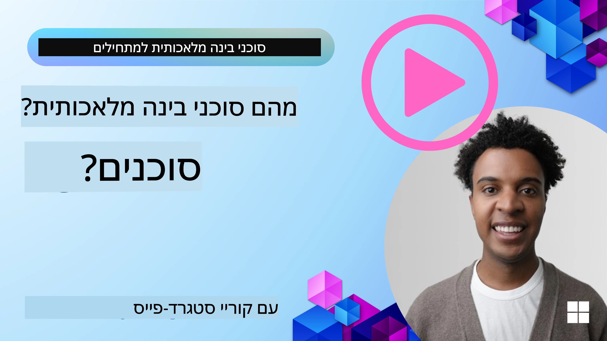
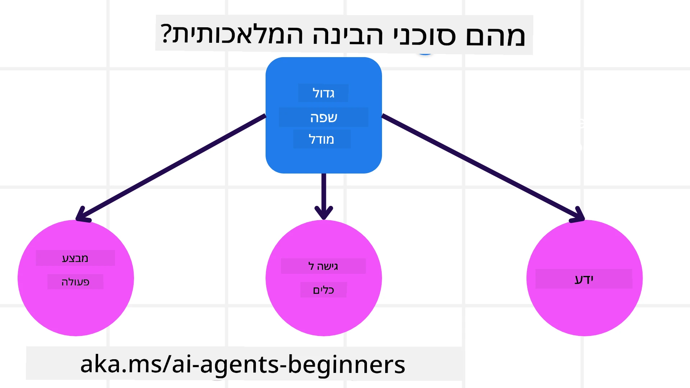
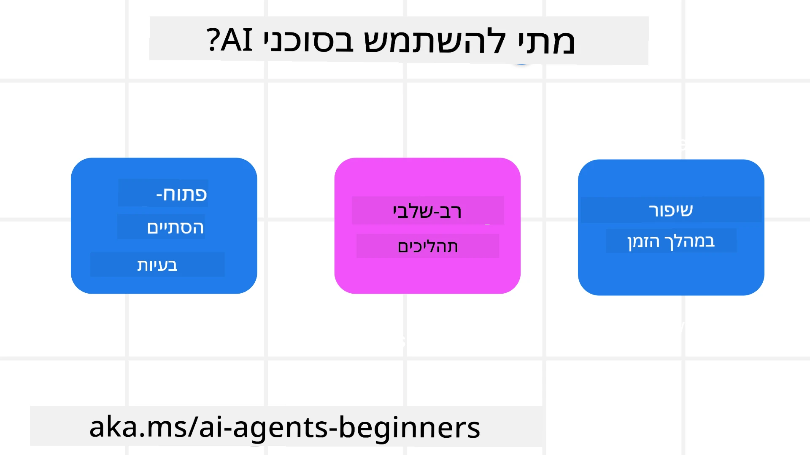

> _(לחץ על התמונה למעלה כדי לצפות בווידאו של השיעור הזה)_

# מבוא לסוכני בינה מלאכותית ומקרי שימוש בסוכנים

ברוכים הבאים לקורס "סוכני בינה מלאכותית למתחילים"! קורס זה מספק ידע בסיסי ודוגמאות מעשיות לבניית סוכני בינה מלאכותית.

הצטרפו ל-<a href="https://discord.gg/kzRShWzttr" target="_blank">קהילת Discord של Azure AI</a> כדי לפגוש לומדים אחרים ובוני סוכני AI ולשאול כל שאלה שיש לכם לגבי הקורס הזה.

כדי להתחיל בקורס, נתחיל בהבנה טובה יותר מה הם סוכני בינה מלאכותית ואיך נוכל להשתמש בהם ביישומים ובזרימות עבודה שאנו בונים.

## מבוא

השיעור הזה מכסה:

- מה הם סוכני בינה מלאכותית ומהם סוגי הסוכנים השונים?
- עבור אילו מקרי שימוש סוכני בינה מלאכותית מתאימים ביותר ואיך הם יכולים לעזור לנו?
- מהם כמה מהבניינים הבסיסיים בעת עיצוב פתרונות סוכניים?

## מטרות למידה
לאחר השלמת השיעור הזה, תצטרכו להיות מסוגלים ל:

- להבין מושגי סוכני AI ואיך הם שונים מפתרונות AI אחרים.
- ליישם סוכני AI בצורה היעילה ביותר.
- לעצב פתרונות סוכניים באופן פרודוקטיבי הן למשתמשים והן ללקוחות.

## הגדרת סוכני בינה מלאכותית וסוגי סוכני AI

### מה הם סוכני בינה מלאכותית?

סוכני בינה מלאכותית הם **מערכות** שמאפשרות ל**מודלים שפתיים גדולים (LLMs)** **לבצע פעולות** על ידי הרחבת יכולותיהם באמצעות מתן גישה ל-LLMs ל**כלים** ו**ידע**.

נפצח את ההגדרה הזו לחלקים קטנים יותר:

- **מערכת** - חשוב לחשוב על סוכנים לא רק כרכיב יחיד אלא כמערכת של רכיבים רבים. ברמה הבסיסית, הרכיבים של סוכן AI הם:
  - **סביבה** - המרחב המוגדר שבו פועל סוכן ה-AI. לדוגמה, אם יש לנו סוכן נסיעות, הסביבה יכולה להיות מערכת הזמנת הטיסות שהסוכן משתמש בה כדי להשלים משימות.
  - **חיישנים** - סביבות מכילות מידע ומספקות משוב. סוכני AI משתמשים בחיישנים כדי לאסוף ולפרש מידע זה על מצב הסביבה הנוכחי. בדוגמת סוכן הנסיעות, מערכת ההזמנה יכולה לספק מידע כגון זמינות בתי מלון או מחירי טיסות.
  - **משפעלי פעולה** - לאחר שסוכן ה-AI מקבל את מצב הסביבה הנוכחי, עבור המשימה הנוכחית הסוכן קובע איזו פעולה לבצע כדי לשנות את הסביבה. עבור סוכן הזמנת הנסיעות, זה יכול להיות להזמין חדר פנוי למשתמש.

**מודלים שפתיים גדולים** - מושג הסוכנים התקיים לפני יצירת ה-LLMs. היתרון בבניית סוכני AI עם LLMs הוא ביכולתם לפרש שפת אדם ונתונים. יכולת זו מאפשרת ל-LLMs לפרש מידע סביבתי ולהגדיר תוכנית לשינוי הסביבה.

**ביצוע פעולות** - מחוץ למערכות סוכני AI, ה-LLMs מוגבלים למצבים שבהם הפעולה היא יצירת תוכן או מידע על בסיס בקשת משתמש. בתוך מערכות סוכני AI, ה-LLMs יכולים להשלים משימות על ידי פרשנות בקשת המשתמש ושימוש בכלים הזמינים בסביבתם.

**גישה לכלים** - לאילו כלים יש ל-LLM גישה מוגדר על ידי 1) הסביבה שבה הוא פועל ו-2) המפתח של סוכן ה-AI. בדוגמת הסוכן נסיעות שלנו, הכלים של הסוכן מוגבלים על ידי הפעולות הזמינות במערכת ההזמנה, ו/או המפתח יכול להגביל את גישת הכלים של הסוכן לטיסות בלבד.

**זיכרון+ידע** - הזיכרון יכול להיות קצר טווח בהקשר השיחה בין המשתמש לסוכן. טווח ארוך, מעבר למידע המסופק על ידי הסביבה, סוכני AI יכולים גם לאחזר ידע ממערכות אחרות, שירותים, כלים ואף סוכנים אחרים. בדוגמת סוכן הנסיעות, ידע זה יכול להיות המידע על העדפות הנסיעה של המשתמש הממוקם במאגר לקוחות.

### סוגי הסוכנים השונים

עכשיו כשיש לנו הגדרה כללית של סוכני AI, בואו נבחן כמה סוגים ספציפיים של סוכנים ואיך הם היו מיושמים לסוכן הזמנת נסיעות.

| **סוג סוכן**                 | **תיאור**                                                                                                                           | **דוגמה**                                                                                                                                                                                                                     |
| ---------------------------- | ----------------------------------------------------------------------------------------------------------------------------------- | ----------------------------------------------------------------------------------------------------------------------------------------------------------------------------------------------------------------------------- |
| **סוכני רפלקס פשוטים**       | מבצעים פעולות מיידיות על בסיס חוקים שהוגדרו מראש.                                                                                | סוכן נסיעות מפרש את הקשר האימייל ומעביר תלונות נסיעות לשירות הלקוחות.                                                                                                                                                       |
| **סוכני רפלקס מבוססי מודל** | מבצעים פעולות על בסיס מודל של העולם ושינויים במודל זה.                                                                            | סוכן נסיעות נותן עדיפות לנתיבים עם שינויים משמעותיים במחיר בהתבסס על גישה לנתוני מחירים היסטוריים.                                                                                                                        |
| **סוכני מבוססי מטרה**        | יוצרים תוכניות להשגת מטרות ספציפיות על ידי פרשנות המטרה וקביעת פעולות להשגתה.                                                   | סוכן נסיעות מזמין מסע על ידי קביעת הסידורי נסיעה נחוצים (רכב, תחבורה ציבורית, טיסות) מהמקום הנוכחי ליעד.                                                                                                                 |
| **סוכני מבוססי תועלת**       | שוקלים העדפות ומשקללים פשרות מספרית כדי לקבוע כיצד להשיג מטרות.                                                                  | סוכן נסיעות ממקסם תועלת על ידי שקלול נוחות מול עלות בהזמנת הנסיעה.                                                                                                                                                          |
| **סוכנים לומדים**            | משתפרים לאורך זמן על ידי תגובה למשוב והתאמת פעולות בהתאם.                                                                           | סוכן נסיעות משתפר באמצעות שימוש במשוב לקוחות מסקרים שלאחר הטיול כדי לבצע התאמות להזמנות עתידיות.                                                                                                                           |
| **סוכנים היררכיים**          | כוללים מספר סוכנים במערכת מדרגתית, כאשר סוכני רמה גבוהה מפצלים משימות לתת-משימות לסוכני רמה נמוכה לבצע.                          | סוכן נסיעות מבטל טיול על ידי חלוקת המשימה לתת-משימות (למשל, ביטול הזמנות ספציפיות) וסוכני רמה נמוכה משלימים אותן, ומדווחים חזרה לסוכן הרמה הגבוהה.                                                                        |
| **מערכות רב-סוכניות (MAS)**  | סוכנים משלימים משימות באופן עצמאי, הן בשיתוף פעולה והן בתחרות.                                                                    | שיתופי פעולה: סוכנים מרובים מזמינים שירותי נסיעות ספציפיים כגון בתי מלון, טיסות ובידור. תחרותי: סוכנים שונים מנהלים ומתחרים על לוח ההזמנות של בית המלון כדי להקצות לקוחות.                                                 |

## מתי להשתמש בסוכני AI

בחלק הקודם, השתמשנו במקרי השימוש של סוכן הנסיעות כדי להסביר איך סוגי הסוכנים השונים יכולים לשמש בסצנריוגרפיות שונות של הזמנת נסיעות. נמשיך להשתמש ביישום זה לאורך הקורס.

בואו נבחן את סוגי מקרי השימוש שסוכני AI מתאימים אליהם ביותר:

- **בעיות פתוחות** - מאפשרים ל-LLM להחליט על הצעדים הדרושים להשלמת משימה כי לא תמיד ניתן לתכנת זאת מראש בזרימת עבודה.
- **תהליכי רב שלבים** - משימות שדורשות רמת סיבוכיות שבה סוכן ה-AI צריך להשתמש בכלים או במידע במהלך מספר סבבים במקום משיכת מידע בודדת.
- **שיפור לאורך זמן** - משימות שבהן הסוכן יכול להשתפר לאורך זמן על ידי קבלת משוב מהסביבה או מהמשתמשים כדי לספק תועלת טובה יותר.

נכסה שיקולים נוספים בשימוש בסוכני AI בשיעור בניית סוכני AI אמינים.

## יסודות פתרונות סוכניים

### פיתוח סוכן

השלב הראשון בעיצוב מערכת סוכן AI הוא להגדיר את הכלים, הפעולות וההתנהגויות. בקורס זה, אנו מתמקדים בשימוש ב**Azure AI Agent Service** כדי להגדיר את סוכנינו. השירות מציע תכונות כגון:

- בחירת מודלים פתוחים כמו OpenAI, Mistral ו-Llama
- שימוש בנתונים מורשים דרך ספקים כמו Tripadvisor
- שימוש בכלים סטנדרטיים OpenAPI 3.0

### תבניות סוכניים

תקשורת עם ה-LLMs נעשית באמצעות פרומפטים. בהתחשב באופי החצי-אוטונומי של סוכני AI, לא תמיד אפשרי או נדרש להפעיל שוב את ה-LLM באופן ידני אחרי שינוי בסביבה. אנו משתמשים ב**תבניות סוכניים** שמאפשרות לנו לפרומפט את ה-LLM במספר שלבים בצורה מדרגית יותר.

קורס זה מחולק לכמה מתבניות הסוכניים הפופולריות כיום.

### מסגרות סוכניים

מסגרות סוכניים מאפשרות למפתחים לממש תבניות סוכניים באמצעות קוד. מסגרות אלו מציעות תבניות, תוספים, וכלים לשיפור שיתוף הפעולה של סוכני AI. יתרונות אלו מספקים יכולות עבור תצפית ושיפור תהליכים של מערכות סוכני AI.

בקורס זה נחקור את מסגרת הסוכנים של מיקרוסופט (MAF) לבניית סוכני AI מוכנים לפרודקשן.

## קודי דוגמה

- Python: [Agent Framework](./code_samples/01-python-agent-framework.ipynb)
- .NET: [Agent Framework](./code_samples/01-dotnet-agent-framework.md)

## יש לכם שאלות נוספות על סוכני AI?

הצטרפו ל-[Microsoft Foundry Discord](https://aka.ms/ai-agents/discord) כדי לפגוש לומדים אחרים, להשתתף בשעות קבלה ולקבל מענה על שאלות לגבי סוכני AI.

## שיעור קודם

[הגדרת הקורס](../00-course-setup/README.md)

## שיעור הבא

[חקירת מסגרות סוכניים](../02-explore-agentic-frameworks/README.md)

---

<!-- CO-OP TRANSLATOR DISCLAIMER START -->
**כתב ויתור**:  
מסמך זה תורגם באמצעות שירות תרגום בינה מלאכותית [Co-op Translator](https://github.com/Azure/co-op-translator). למרות שאנו משקיעים מאמצים לשמור על דיוק, יש לקחת בחשבון כי תרגומים אוטומטיים עלולים להכיל שגיאות או אי-דיוקים. המסמך המקורי בשפת המקור שלו הוא המקור המוסמך והאמין. למידע קריטי מומלץ להיעזר בשירות תרגום מקצועי של אדם. אנו לא נושאים באחריות על כל אי-הבנות או פרשנויות שגויות הנובעות מהשימוש בתרגום זה.
<!-- CO-OP TRANSLATOR DISCLAIMER END -->