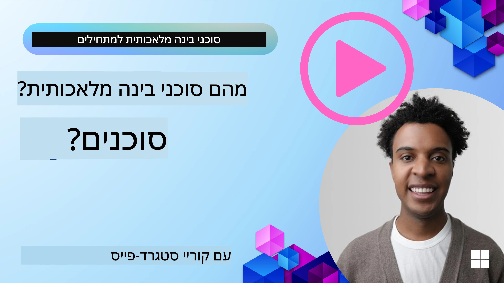
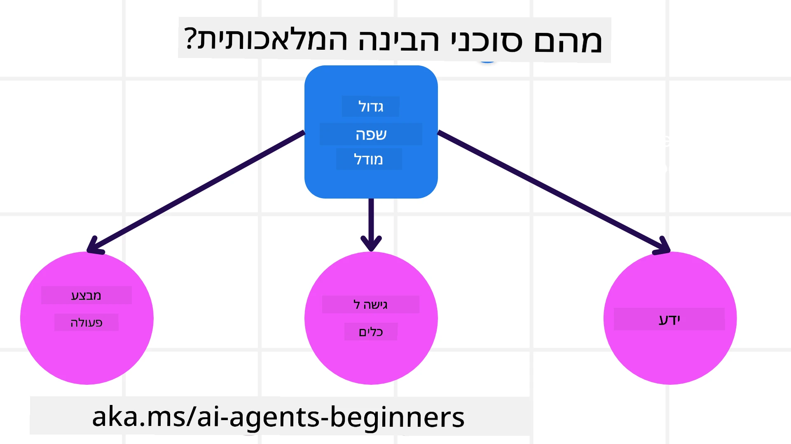
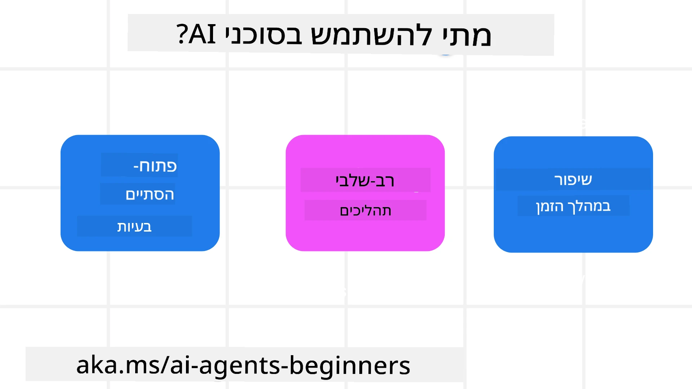

> _(לחצו על התמונה למעלה כדי לצפות בסרטון של השיעור הזה)_

# הקדמה לסוכני בינה מלאכותית ומקרי שימוש בסוכנים

ברוכים הבאים לקורס **סוכני בינה מלאכותית למתחילים**! קורס זה מעניק לכם את הידע הבסיסי — וקוד עובד אמיתי — כדי להתחיל לבנות סוכני בינה מלאכותית מאפס.

בואו לומר שלום בקהילת <a href="https://discord.gg/kzRShWzttr" target="_blank">Azure AI Discord Community</a> — מלאה בלומדים ובוני בינה מלאכותית שמוכנים לענות על שאלות.

לפני שנתחיל לבנות, בואו נוודא שאנחנו באמת מבינים מה זה סוכן בינה מלאכותית *הוא* ומתי יש טעם להשתמש בו.

---

## הקדמה

שיעור זה מכסה:

- מה הם סוכני בינה מלאכותית, ומהם הסוגים השונים הקיימים
- אילו סוגי משימות סוכני בינה מלאכותית מתאימים להם ביותר
- אבני הבניין העיקריות שתשתמשו בהן כאשר תעצבו פתרון סוכני

## מטרות הלמידה

בסיום השיעור הזה, אתם אמורים להיות מסוגלים:

- להסביר מהו סוכן בינה מלאכותית וכיצד הוא שונה מפתרון בינה מלאכותית רגיל
- לדעת מתי כדאי להשתמש בסוכן בינה מלאכותית (ומתי לא)
- לתכנן סקיצה בסיסית של פתרון סוכני לבעיה מהעולם האמיתי

---

## הגדרת סוכני בינה מלאכותית וסוגי סוכנים

### מה הם סוכני בינה מלאכותית?

הנה דרך פשוטה לחשוב על זה:

> **סוכני בינה מלאכותית הם מערכות שמאפשרות למודלים לשוניים גדולים (LLMs) בפועל *לעשות דברים* — על ידי מתן כלים וידע לפעול על העולם, ולא רק להגיב לבקשות.**

נפרק את זה קצת:

- **מערכת** — סוכן בינה מלאכותית הוא לא רק דבר אחד. זו אוסף של חלקים שעובדים ביחד. ביסודו, כל סוכן מורכב משלושה חלקים:
  - **סביבה** — המרחב שבו הסוכן פועל. עבור סוכן הזמנות נסיעות, זו תהיה פלטפורמת ההזמנות עצמה.
  - **חיישנים** — כיצד הסוכן קורא את המצב הנוכחי של הסביבה שלו. הסוכן עשוי לבדוק זמינות מלונות או מחירי טיסות.
  - **מפעילים** — כיצד הסוכן פועל. הסוכן יכול להזמין חדר, לשלוח אישור, או לבטל הזמנה.

- **מודלים לשוניים גדולים** — סוכנים היו קיימים לפני LLMs, אך ה-LLMs הם מה שהופך סוכנים מודרניים לעוצמתיים כל כך. הם יכולים להבין שפה טבעית, להסביר את ההקשר, ולהפוך בקשה עמומה לתוכנית פעולה ממשית.

- **ביצוע פעולות** — ללא מערכת סוכנים, מודל שפה גדול רק מייצר טקסט. בתוך מערכת סוכנים, המודל באמת *מבצע* צעדים — מחפש במסד נתונים, קורא ל-API, שולח הודעה.

- **גישה לכלים** — אילו כלים הסוכן יכול להשתמש תלוי ב-(1) הסביבה שבה הוא פועל ו-(2) מה המפתח בחר לתת לו. סוכן נסיעות עשוי להיות מסוגל לחפש טיסות אבל לא לערוך רשומות לקוחות — הכל תלוי במה שקושרים.

- **זיכרון + ידע** — לסוכנים יכול להיות זיכרון קצר מועד (השיחה הנוכחית) וזיכרון ארוך טווח (מסד נתונים של לקוחות, אינטראקציות עבר). סוכן הנסיעות עשוי "לזכור" שאתה מעדיף מושבי חלון.

---

### סוגי סוכני הבינה המלאכותית השונים

לא כל הסוכנים בנויים אותו דבר. הנה פירוט של הסוגים העיקריים, כשמשתמשים בדוגמה של סוכן הזמנות נסיעות:

| **סוג סוכן** | **מה הוא עושה** | **דוגמת סוכן נסיעות** |
|---|---|---|
| **סוכנים רפלקסיביים פשוטים** | פועלים לפי חוקים קשיחים — ללא זיכרון, ללא תכנון. | רואה מייל תלונה → מעביר לשירות לקוחות. זהו. |
| **סוכנים רפלקסיביים מבוססי מודל** | שומר מודל פנימי של העולם ומעדכן אותו כשדברים משתנים. | עוקב אחרי מחירי טיסות היסטוריים ומדווח על מסלולים שהתייקרו פתאום. |
| **סוכנים מבוססי מטרה** | יש להם מטרה בראש ומוצאים כיצד להגיע אליה שלב אחרי שלב. | מזמין טיול שלם (טיסות, רכב, מלון) מהמיקום הנוכחי שלך למקום היעד. |
| **סוכנים מבוססי תועלת** | לא רק מוצאים *פתרון* — מוצאים את ה*הטוב ביותר* על ידי שקלול פשרות. | מאזנים בין עלות לנוחות כדי למצוא את הנסיעה המתאימה ביותר להעדפותיך. |
| **סוכנים לומדים** | משתפרים עם הזמן על ידי למידה מתוך משוב. | מתאים המלצות הזמנה עתידיות בהתאם לתוצאות סקר שלאחר הנסיעה. |
| **סוכנים היררכיים** | סוכן ברמה גבוהה מחלק עבודה למשימות משנה ומפנה לסוכנים ברמת משנה. | בקשת "ביטול טיול" מחולקת ל: ביטול טיסה, ביטול מלון, ביטול השכרת רכב — כל אחד מטופל על ידי סוכן משנה. |
| **מערכות רב-סוכניות (MAS)** | מספר סוכנים עצמאיים שעובדים יחד (או מתחרים). | שיתופי: סוכנים נפרדים מטפלים במלונות, טיסות ובידור. תחרותי: סוכנים מתחרים למלא חדרי מלון במחיר הטוב ביותר. |

---

## מתי להשתמש בסוכני בינה מלאכותית

רק כי *ניתן* להשתמש בסוכן בינה מלאכותית, לא אומר שצריך תמיד *לעשות זאת*. הנה המצבים שבהם סוכנים באמת מצטיינים:

- **בעיות פתוחות סופיות** — כאשר שלבי הפתרון לבעיה לא ניתנים לתכנות מראש. צריך שה-LLM ימצא את הדרך באופן דינמי.
- **תהליכים מרובי שלבים** — משימות שדורשות שימוש בכלים במספר סבבים, לא רק בחיפוש או יצירה בודדים.
- **שיפור לאורך זמן** — כשאתם רוצים שהמערכת תהיה חכמה יותר בהתבסס על משוב המשתמש או אותות סביבה.

נעמיק מתי (ומתי *לא*) להשתמש בסוכני בינה מלאכותית בשיעור **בניית סוכני בינה מלאכותית אמינים** בהמשך הקורס.

---

## יסודות פתרונות סוכניים

### פיתוח סוכן

הדבר הראשון שמגדירים כשבונים סוכן הוא *מה הוא יכול לעשות* — הכלים שלו, הפעולות וההתנהגויות.

בקורס זה, אנו משתמשים ב**Microsoft Foundry Agent Service** כפלטפורמה העיקרית שלנו. היא תומכת ב:

- מודלים מספקים כמו OpenAI, Mistral, ו-Meta (Llama)
- נתונים מורשים מספקים כמו Tripadvisor
- הגדרות כלים תקניות של OpenAPI 3.0

### תבניות סוכניות

אתם מתקשרים עם מודלים לשוניים גדולים דרך פרומפטים. עם סוכנים, אי אפשר תמיד ליצור כל פרומפט ידנית — הסוכן צריך לפעול דרך שלבים רבים. כאן נכנסות **תבניות סוכניות** לתמונה. הן אסטרטגיות חוזרות לשימוש לפרומפטים ולארגון מודלים לשוניים בפורמט יותר נרחב ואמין.

הקורס בנוי סביב התבניות הסוכניות השכיחות והיעילות ביותר.

### מסגרות סוכניות

מסגרות סוכניות מספקות למפתחים תבניות מוכנות, כלים ותשתית לבניית סוכנים. הן מקלות על:

- חיבור כלים ויכולות
- תצפית על פעולת הסוכן (ודיבוג כאשר יש שגיאות)
- שיתוף פעולה בין סוכנים מרובים

בקורס זה אנו מתמקדים ב**Microsoft Agent Framework (MAF)** לבניית סוכנים מוכנים לייצור.

---

## דוגמאות קוד

מוכנים לראות את זה בפעולה? הנה דוגמאות הקוד לשיעור זה:

- 🐍 Python: [Agent Framework](./code_samples/01-python-agent-framework.ipynb)
- 🔷 .NET: [Agent Framework](./code_samples/01-dotnet-agent-framework.md)

---

## יש לכם שאלות?

הצטרפו אל [Microsoft Foundry Discord](https://discord.com/invite/ATgtXmAS5D) כדי להתחבר עם לומדים אחרים, להשתתף בשעות משרד, ולקבל תשובות לשאלות האספקט של סוכני בינה מלאכותית מהקהילה.

---

## שיעור קודם

[הגדרת הקורס](../00-course-setup/README.md)

## שיעור הבא

[חקירת מסגרות סוכניות](../02-explore-agentic-frameworks/README.md)

---

<!-- CO-OP TRANSLATOR DISCLAIMER START -->
**כתב ויתור**:
מסמך זה תורגם באמצעות שירות תרגום אוטומטי [Co-op Translator](https://github.com/Azure/co-op-translator). למרות שאנו שואפים לדיוק, יש לקחת בחשבון שתרגומים אוטומטיים עלולים להכיל שגיאות או אי-דיוקים. יש להחשיב את המסמך המקורי בשפתו הטבעית כמקור הסמכות. למידע קריטי מומלץ להשתמש בתרגום מקצועי על ידי מתרגם אדם. אנו לא אחראים לכל אי-הבנה או פירוש שגוי הנובע מהשימוש בתרגום זה.
<!-- CO-OP TRANSLATOR DISCLAIMER END -->