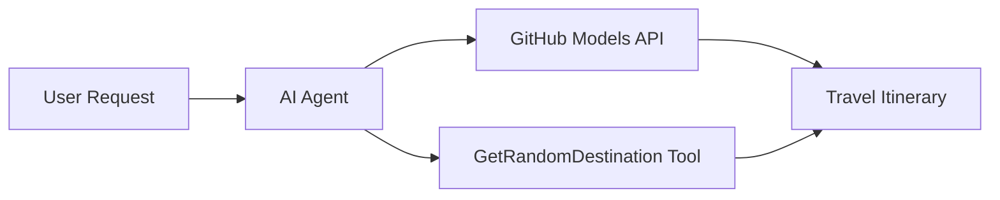

<!--
CO_OP_TRANSLATOR_METADATA:
{
  "original_hash": "23afd9be7b6ba5b69a44c3b6a78e07f6",
  "translation_date": "2025-11-06T10:05:13+00:00",
  "source_file": "01-intro-to-ai-agents/code_samples/01-dotnet-agent-framework.md",
  "language_code": "he"
}
-->
# 🌍 סוכן נסיעות AI עם Microsoft Agent Framework (.NET)

## 📋 סקירה כללית של התרחיש

מחברת זו מדגימה כיצד לבנות סוכן תכנון נסיעות חכם באמצעות Microsoft Agent Framework עבור .NET. הסוכן יכול ליצור באופן אוטומטי מסלולי טיול מותאמים אישית ליעדים אקראיים ברחבי העולם.

**יכולות מרכזיות:**
- 🎲 **בחירת יעד אקראי**: משתמש בכלי מותאם לבחירת מקומות חופשה
- 🗺️ **תכנון טיול חכם**: יוצר מסלולים מפורטים יום-אחר-יום
- 🔄 **סטרימינג בזמן אמת**: תומך בתגובות מיידיות ובסטרימינג
- 🛠️ **שילוב כלי מותאם**: מדגים כיצד להרחיב את יכולות הסוכן

## 🔧 ארכיטקטורה טכנית

### טכנולוגיות מרכזיות
- **Microsoft Agent Framework**: יישום .NET העדכני לפיתוח סוכני AI
- **שילוב מודלים של GitHub**: משתמש בשירות הסקת מודלים של GitHub AI
- **תאימות ל-OpenAI API**: מנצל ספריות לקוח של OpenAI עם נקודות קצה מותאמות
- **תצורה מאובטחת**: ניהול מפתחות API מבוסס סביבה

### רכיבים מרכזיים
1. **AIAgent**: מתזמר הסוכן הראשי שמנהל את זרימת השיחה
2. **כלים מותאמים**: פונקציה `GetRandomDestination()` זמינה לסוכן
3. **לקוח צ'אט**: ממשק שיחה מבוסס מודלים של GitHub
4. **תמיכה בסטרימינג**: יכולות יצירת תגובות בזמן אמת

### תבנית שילוב


## 🚀 התחלה מהירה

**דרישות מוקדמות:**
- .NET 10.0 או גרסה גבוהה יותר
- אסימון גישה ל-API של GitHub Models
- משתני סביבה מוגדרים בקובץ `.env`

**משתני סביבה נדרשים:**
```env
GITHUB_TOKEN=your_github_token
GITHUB_ENDPOINT=https://models.inference.ai.azure.com
GITHUB_MODEL_ID=gpt-4o-mini
```

הרץ את דוגמת הקוד למטה לפי הסדר כדי לראות את סוכן הנסיעות בפעולה!

---

## אפליקציית קובץ יחיד ב-.NET: דוגמת סוכן נסיעות AI

ראו `01-dotnet-agent-framework.cs` לדוגמת קוד מלאה שניתנת להרצה.

```bash
dotnet run 01-dotnet-agent-framework.cs
```

### דוגמת קוד

```csharp
static string GetRandomDestination()
{
    var destinations = new List<string>
    {
        "Paris, France",
        "Tokyo, Japan",
        "New York City, USA",
        "Sydney, Australia",
        "Rome, Italy",
        "Barcelona, Spain",
        "Cape Town, South Africa",
        "Rio de Janeiro, Brazil",
        "Bangkok, Thailand",
        "Vancouver, Canada"
    };
    var random = new Random();
    int index = random.Next(destinations.Count);
    return destinations[index];
}

// Extract configuration from environment variables
var github_endpoint = Environment.GetEnvironmentVariable("GITHUB_ENDPOINT") ?? throw new InvalidOperationException("GITHUB_ENDPOINT is not set.");
var github_model_id = Environment.GetEnvironmentVariable("GITHUB_MODEL_ID") ?? "gpt-4o-mini";
var github_token = Environment.GetEnvironmentVariable("GITHUB_TOKEN") ?? throw new InvalidOperationException("GITHUB_TOKEN is not set.");

// Configure OpenAI Client Options
var openAIOptions = new OpenAIClientOptions()
{
    Endpoint = new Uri(github_endpoint)
};

// Initialize OpenAI Client with GitHub Models Configuration
var openAIClient = new OpenAIClient(new ApiKeyCredential(github_token), openAIOptions);

// Create AI Agent with Travel Planning Capabilities
AIAgent agent = openAIClient
    .GetChatClient(github_model_id)
    .CreateAIAgent(
        instructions: "You are a helpful AI Agent that can help plan vacations for customers at random destinations",
        tools: [AIFunctionFactory.Create(GetRandomDestination)]
    );

// Execute Agent: Plan a Day Trip (Non-Streaming)
Console.WriteLine(await agent.RunAsync("Plan me a day trip"));

// Execute Agent: Plan a Day Trip (Streaming Response)
await foreach (var update in agent.RunStreamingAsync("Plan me a day trip"))
{
    Console.Write(update);
}
```

---

**כתב ויתור**:  
מסמך זה תורגם באמצעות שירות תרגום AI [Co-op Translator](https://github.com/Azure/co-op-translator). למרות שאנו שואפים לדיוק, יש להיות מודעים לכך שתרגומים אוטומטיים עשויים להכיל שגיאות או אי דיוקים. המסמך המקורי בשפתו המקורית צריך להיחשב כמקור סמכותי. עבור מידע קריטי, מומלץ להשתמש בתרגום מקצועי אנושי. איננו אחראים לאי הבנות או לפרשנויות שגויות הנובעות משימוש בתרגום זה.