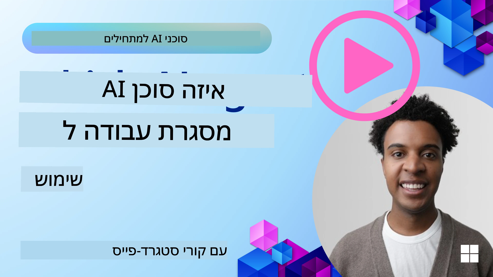

[](https://youtu.be/ODwF-EZo_O8?si=1xoy_B9RNQfrYdF7)

> _(לחץ על התמונה למעלה כדי לצפות בסרטון השיעור)_

# חקור מסגרות סוכני AI

מסגרות סוכני AI הן פלטפורמות תוכנה שנועדו לפשט את יצירתם, פריסתם וניהולם של סוכני AI. מסגרות אלו מספקות למפתחים רכיבים מוכנים מראש, הפשטות וכלים שמייעלים את פיתוח מערכות AI מורכבות.

מסגרות אלו מסייעות למפתחים להתמקד בהיבטים הייחודיים של היישומים שלהם על-ידי מתן גישות סטנדרטיות לאתגרים נפוצים בפיתוח סוכני AI. הן משפרות את היכולת להרחבה, הנגישות והיעילות בבניית מערכות AI.

## مقدمة

השיעור הזה יכסה:

- מה הן מסגרות סוכני AI ומה הן מאפשרות למפתחים להשיג?
- איך צוותים יכולים להשתמש בהן כדי ליצור אב-טיפוס במהירות, לבצע איטרציות ולשפר את יכולות הסוכן שלהם?
- מה ההבדלים בין המסגרות והכלים שיצרה מיקרוסופט (<a href="https://aka.ms/ai-agents-beginners/ai-agent-service" target="_blank">שירות סוכני AI של Azure</a> ו-<a href="https://learn.microsoft.com/azure/ai-services/openai/how-to/responses" target="_blank">מסגרת הסוכן של מיקרוסופט</a>)?
- האם אפשר לשלב ישירות כלים מהאקוסיסטם של Azure הקיים שלי, או שאני צריך פתרונות עצמאיים?
- מהו שירות סוכני AI של Azure ואיך הוא עוזר לי?

## מטרות הלמידה

המטרות של שיעור זה הן לעזור לך להבין:

- את התפקיד של מסגרות סוכני AI בפיתוח AI.
- איך לנצל מסגרות סוכני AI לבניית סוכנים אינטליגנטים.
- יכולות מפתח שמאפשרות מסגרות סוכני AI.
- ההבדלים בין מסגרת הסוכן של מיקרוסופט לשירות סוכני AI של Azure.

## מהן מסגרות סוכני AI ומה הן מאפשרות למפתחים לעשות?

מסגרות AI מסורתיות יכולות לעזור לך לשלב AI ביישומים שלך ולשפרם בדרכים הבאות:

- **התאמה אישית**: AI יכול לנתח התנהגות והעדפות משתמש כדי להציע המלצות, תוכן וחוויות מותאמות אישית.  
דוגמה: שירותי סטרימינג כמו Netflix משתמשים ב-AI כדי להציע סרטים ותכניות בהתבסס על היסטוריית הצפייה, ומשפרים את ההתקשרות והסיפוק של המשתמש.
- **אוטומציה ויעילות**: AI יכול לאוטומט משימות חוזרות, לייעל תהליכים ולשפר את היעילות התפעולית.  
דוגמה: אפליקציות שירות לקוחות משתמשות בבוטים מבוססי AI לטיפול בפניות נפוצות, מקצרות זמני מענה ומשחררות סוכנים אנושיים לטפל בנושאים מורכבים יותר.
- **שיפור חוויית המשתמש**: AI יכול לשפר את חוויית המשתמש הכוללת על-ידי מתן תכונות חכמות כמו זיהוי דיבור, עיבוד שפה טבעית וטקסט תחזיתי.  
דוגמה: עוזרים קוליים כמו Siri ו-Google Assistant משתמשים ב-AI כדי להבין ולהגיב לפקודות קוליות, ומאפשרים אינטראקציה קלה יותר עם המכשירים.

### נשמע הכל נהדר, אז מדוע אנחנו צריכים את מסגרת סוכני ה-AI?

מסגרות סוכני AI מייצגות משהו מעבר למסגרות AI פשוטות. הן מיועדות לאפשר יצירת סוכנים אינטליגנטיים שיכולים להתקשר עם משתמשים, סוכנים אחרים וסביבה כדי להשיג מטרות ספציפיות. סוכנים אלה יכולים לגלות התנהגות אוטונומית, לקבל החלטות ולהסתגל לתנאים משתנים. בוא נבחן כמה יכולות מפתח שמאפשרים מסגרות סוכני AI:

- **שיתוף פעולה ותיאום סוכנים**: מאפשרות יצירת סוכני AI רבים שיכולים לעבוד יחד, לתקשר ולתאם לפתרון משימות מורכבות.
- **אוטומציה וניהול משימות**: מספקות מנגנונים לאוטומציה של תהליכים מרובי שלבים, הקצאת משימות וניהול דינמי בין סוכנים.
- **הבנה והסתגלות הקשרית**: מציידות סוכנים ביכולת להבין הקשר, להסתגל לסביבות משתנות ולקבל החלטות על בסיס מידע בזמן אמת.

לסיכום, סוכנים מאפשרים לך לעשות יותר, לקחת את האוטומציה לשלב הבא, וליצור מערכות חכמות יותר שיכולות להסתגל וללמוד מהסביבה שלהן.

## איך ליצור אב-טיפוס, לבצע איטרציות ולשפר במהירות את יכולות הסוכן?

זהו תחום שמתפתח במהירות, אך יש כמה מאפיינים שכיחים ברוב מסגרות סוכני ה-AI שיכולים לעזור לך ליצור אב-טיפוס במהירות ולבצע איטרציות, כגון רכיבי מודולים, כלי שיתוף פעולה ולמידה בזמן אמת. נצלול אליהם:

- **שימוש ברכיבי מודולים**: ערכות פיתוח AI מציעות רכיבים מוכנים מראש כמו מחברים ל-AI ולזיכרון, קריאת פונקציות בשפה טבעית או תוספים בקוד, תבניות הודעות ועוד.
- **ניצול כלי שיתוף פעולה**: עצב סוכנים עם תפקידים ומשימות ספציפיים, המאפשרים להם לבדוק ולחדד תהליכי עבודה משותפים.
- **למידה בזמן אמת**: הטמע לולאות משוב שבהן הסוכנים לומדים מהאינטראקציות ומתאימים את התנהגותם באופן דינמי.

### שימוש ברכיבי מודולים

ערכת פיתוח כמו מסגרת הסוכן של מיקרוסופט מציעה רכיבים מוכנים מראש כמו מחברי AI, הגדרות כלים וניהול סוכנים.

**איך צוותים יכולים להשתמש בזה**: צוותים יכולים לחבר מהר רכיבים אלו כדי ליצור אב-טיפוס עובד בלי להתחיל מאפס, מה שמאפשר ניסויים ואיטרציות מהירות.

**איך זה עובד בפועל**: ניתן להשתמש בפארסר מוכן מראש כדי לחלץ מידע מקלט משתמש, מודול זיכרון לאחסון ושליפת נתונים, ומחולל פתקים לאינטראקציה עם המשתמשים, כל זאת בלי לבנות את הרכיבים מאפס.

**דוגמת קוד**. בוא נסתכל על דוגמה לאיך ניתן להשתמש במסגרת הסוכן של מיקרוסופט עם `AzureAIProjectAgentProvider` כדי לגרום לדגם להגיב לקלט משתמש עם קריאת כלים:

``` python
# דוגמה ב-Python למסגרת הסוכן של Microsoft

import asyncio
import os
from typing import Annotated

from agent_framework.azure import AzureAIProjectAgentProvider
from azure.identity import AzureCliCredential


# הגדר פונקציית כלי לדוגמה להזמנת נסיעות
def book_flight(date: str, location: str) -> str:
    """Book travel given location and date."""
    return f"Travel was booked to {location} on {date}"


async def main():
    provider = AzureAIProjectAgentProvider(credential=AzureCliCredential())
    agent = await provider.create_agent(
        name="travel_agent",
        instructions="Help the user book travel. Use the book_flight tool when ready.",
        tools=[book_flight],
    )

    response = await agent.run("I'd like to go to New York on January 1, 2025")
    print(response)
    # פלט לדוגמה: הטיסה שלך לניו יורק ב-1 בינואר 2025 הוזמנה בהצלחה. נסיעה בטוחה! ✈️🗽


if __name__ == "__main__":
    asyncio.run(main())
```
  
מה שניתן לראות מהדוגמה הוא איך לנצל פארסר מוכן מראש לחילוץ מידע עיקרי מקלט המשתמש, כמו מקור, יעד ותאריך בקשת הזמנת טיסה. גישה מודולרית זו מאפשרת לך להתמקד בלוגיקה ברמה גבוהה.

### ניצול כלי שיתוף פעולה

מסגרות כמו מסגרת הסוכן של מיקרוסופט מאפשרות יצירת סוכנים רבים שיכולים לעבוד יחד.

**איך צוותים יכולים להשתמש בזה**: צוותים יכולים לעצב סוכנים עם תפקידים ומשימות מוגדרים, המאפשרים להם לבדוק ולשפר תהליכי עבודה משותפים ולשפר את היעילות הכוללת של המערכת.

**איך זה עובד בפועל**: ניתן ליצור צוות של סוכנים שכל אחד מתמחה בפונקציה מסוימת, כמו שליפת נתונים, ניתוח או קבלת החלטות. סוכנים אלה מתקשרים ומשתפים מידע כדי להשיג מטרה משותפת, כמו מענה לשאילתת משתמש או השלמת משימה.

**דוגמת קוד (מסגרת הסוכן של מיקרוסופט)**:

```python
# יצירת סוכנים מרובים שעובדים יחד באמצעות מסגרת הסוכנים של מיקרוסופט

import os
from agent_framework.azure import AzureAIProjectAgentProvider
from azure.identity import AzureCliCredential

provider = AzureAIProjectAgentProvider(credential=AzureCliCredential())

# סוכן אחזור נתונים
agent_retrieve = await provider.create_agent(
    name="dataretrieval",
    instructions="Retrieve relevant data using available tools.",
    tools=[retrieve_tool],
)

# סוכן ניתוח נתונים
agent_analyze = await provider.create_agent(
    name="dataanalysis",
    instructions="Analyze the retrieved data and provide insights.",
    tools=[analyze_tool],
)

# להריץ סוכנים ברצף על משימה
retrieval_result = await agent_retrieve.run("Retrieve sales data for Q4")
analysis_result = await agent_analyze.run(f"Analyze this data: {retrieval_result}")
print(analysis_result)
```
  
מה שרואים בקוד הקודם הוא יצירת משימה הכוללת מספר סוכנים שעובדים יחד לניתוח נתונים. כל סוכן מבצע פונקציה ספציפית והמשימה מתבצעת באמצעות תיאום בין הסוכנים להשגת התוצאה הרצויה. על ידי יצירת סוכנים ייעודיים לתפקידים מיוחדים, ניתן לשפר את יעילות וביצועי המשימה.

### למידה בזמן אמת

מסגרות מתקדמות מספקות יכולות הבנה והסתגלות בהקשר בזמן אמת.

**איך צוותים יכולים להשתמש בזה**: צוותים יכולים להטמיע לולאות משוב שבהן סוכנים לומדים מאינטראקציות ומתאימים את התנהגותם דינמית, מה שמוביל לשיפור רציף ולחדד יכולות.

**איך זה עובד בפועל**: סוכנים יכולים לנתח משוב משתמש, נתוני סביבה ותוצאות משימה כדי לעדכן בסיס ידע, לכוונן אלגוריתמים לקבלת החלטות ולהשתפר עם הזמן. תהליך לימוד איטרטיבי זה מאפשר לסוכנים להסתגל לתנאים משתנים ולהעדפות משתמש, ומשפר את האפקטיביות הכוללת של המערכת.

## מה ההבדלים בין מסגרת הסוכן של מיקרוסופט לבין שירות סוכני AI של Azure?

קיימות דרכים רבות להשוות בין הגישות, אך נבחן כמה הבדלים עיקריים במונחים של העיצוב, היכולות ומקרי השימוש המיועדים:

## מסגרת הסוכן של מיקרוסופט (MAF)

מסגרת הסוכן של מיקרוסופט מספקת SDK פשוט לבניית סוכני AI באמצעות `AzureAIProjectAgentProvider`. היא מאפשרת למפתחים ליצור סוכנים המשתמשים בדגמי Azure OpenAI עם קריאת כלים מובנית, ניהול שיחות ואבטחה ברמת ארגון באמצעות זהות Azure.

**מקרי שימוש**: בניית סוכני AI מוכנים לייצור עם שימוש בכלים, תהליכים מרובי שלבים ותסריטי אינטגרציה ארגוניים.

הנה כמה מושגים מרכזיים במסגרת הסוכן של מיקרוסופט:

- **סוכנים**. סוכן נוצר דרך `AzureAIProjectAgentProvider` ומוגדר עם שם, הוראות וכלים. הסוכן יכול:
  - **לעבד הודעות משתמש** ולייצר תגובות באמצעות דגמי Azure OpenAI.  
  - **לקרא כלים** אוטומטית בהתאם להקשר השיחה.  
  - **לשמור מצב שיחה** לאורך אינטראקציות מרובות.

  הנה קטע קוד המדגים יצירת סוכן:

    ```python
    import os
    from agent_framework.azure import AzureAIProjectAgentProvider
    from azure.identity import AzureCliCredential

    provider = AzureAIProjectAgentProvider(credential=AzureCliCredential())
    agent = await provider.create_agent(
        name="my_agent",
        instructions="You are a helpful assistant.",
    )

    response = await agent.run("Hello, World!")
    print(response)
    ```
  
- **כלים**. המסגרת תומכת בהגדרת כלים כפונקציות פייתון שהסוכן יכול להפעיל אוטומטית. כלים נרשמים בזמן יצירת הסוכן:

    ```python
    def get_weather(location: str) -> str:
        """Get the current weather for a location."""
        return f"The weather in {location} is sunny, 72\u00b0F."

    agent = await provider.create_agent(
        name="weather_agent",
        instructions="Help users check the weather.",
        tools=[get_weather],
    )
    ```
  
- **תיאום בין סוכנים**. אפשר ליצור סוכנים רבים עם התמחות שונות ולתאם את עבודתם:

    ```python
    planner = await provider.create_agent(
        name="planner",
        instructions="Break down complex tasks into steps.",
    )

    executor = await provider.create_agent(
        name="executor",
        instructions="Execute the planned steps using available tools.",
        tools=[execute_tool],
    )

    plan = await planner.run("Plan a trip to Paris")
    result = await executor.run(f"Execute this plan: {plan}")
    ```
  
- **אינטגרציית זהות Azure**. המסגרת משתמשת ב`AzureCliCredential` (או `DefaultAzureCredential`) לאימות מאובטח ללא מפתחות, ומבטלת את הצורך בניהול ישיר של מפתחות API.

## שירות סוכני AI של Azure

שירות סוכני AI של Azure הוא תוספת חדשה שהוצגה ב-Microsoft Ignite 2024. הוא מאפשר פיתוח ופריסה של סוכני AI עם דגמים גמישים יותר, כגון קריאה ישירה ל-LLM בקוד פתוח כמו Llama 3, Mistral ו-Cohere.

שירות סוכני AI של Azure מספק מנגנוני אבטחה חזקים יותר ושיטות אחסון נתונים, מה שהופך אותו למתאים ליישומים ארגוניים.

הוא עובד מחוץ לקופסה עם מסגרת הסוכן של מיקרוסופט לבניית סוכנים ופריסתם.

השרות נמצא כרגע בבחינה ציבורית ותומך בפיתוח סוכנים בפייתון ו-C#.

באמצעות Azure AI Agent Service Python SDK, ניתן ליצור סוכן עם כלי שהוגדר על-ידי המשתמש:

```python
import asyncio
from azure.identity import DefaultAzureCredential
from azure.ai.projects import AIProjectClient

# הגדר פונקציות לכלי
def get_specials() -> str:
    """Provides a list of specials from the menu."""
    return """
    Special Soup: Clam Chowder
    Special Salad: Cobb Salad
    Special Drink: Chai Tea
    """

def get_item_price(menu_item: str) -> str:
    """Provides the price of the requested menu item."""
    return "$9.99"


async def main() -> None:
    credential = DefaultAzureCredential()
    project_client = AIProjectClient.from_connection_string(
        credential=credential,
        conn_str="your-connection-string",
    )

    agent = project_client.agents.create_agent(
        model="gpt-4o-mini",
        name="Host",
        instructions="Answer questions about the menu.",
        tools=[get_specials, get_item_price],
    )

    thread = project_client.agents.create_thread()

    user_inputs = [
        "Hello",
        "What is the special soup?",
        "How much does that cost?",
        "Thank you",
    ]

    for user_input in user_inputs:
        print(f"# User: '{user_input}'")
        message = project_client.agents.create_message(
            thread_id=thread.id,
            role="user",
            content=user_input,
        )
        run = project_client.agents.create_and_process_run(
            thread_id=thread.id, agent_id=agent.id
        )
        messages = project_client.agents.list_messages(thread_id=thread.id)
        print(f"# Agent: {messages.data[0].content[0].text.value}")


if __name__ == "__main__":
    asyncio.run(main())
```
  
### מושגים מרכזיים

לשירות סוכני AI של Azure מושגים מרכזיים אלה:

- **סוכן**. השירות משתלב עם Microsoft Foundry. בתוך AI Foundry, סוכן AI מתפקד כמיקרו-שירות "חכם" שניתן להשתמש בו למענה על שאלות (RAG), ביצוע פעולות או אוטומציה מלאה של תהליכים. הוא משיג זאת על-ידי שילוב כוח דגמי AI יצירתיים עם כלים שמאפשרים גישה לאינטראקציה עם מקורות נתונים בעולם האמיתי. הנה דוגמה לסוכן:

    ```python
    agent = project_client.agents.create_agent(
        model="gpt-4o-mini",
        name="my-agent",
        instructions="You are helpful agent",
        tools=code_interpreter.definitions,
        tool_resources=code_interpreter.resources,
    )
    ```
  
    בדוגמה זו, סוכן נוצר עם הדגם `gpt-4o-mini`, שם `my-agent` והוראות `You are helpful agent`. הסוכן מצויד בכלים ומשאבים לביצוע משימות פירוש קוד.

- **שרשורים והודעות**. השרשור הוא מושג חשוב נוסף. הוא מייצג שיחה או אינטראקציה בין סוכן למשתמש. משתמשים בשרשורים למעקב אחר התקדמות שיחה, אחסון מידע הקשר וניהול מצב האינטראקציה. הנה דוגמה לשרשור:

    ```python
    thread = project_client.agents.create_thread()
    message = project_client.agents.create_message(
        thread_id=thread.id,
        role="user",
        content="Could you please create a bar chart for the operating profit using the following data and provide the file to me? Company A: $1.2 million, Company B: $2.5 million, Company C: $3.0 million, Company D: $1.8 million",
    )
    
    # Ask the agent to perform work on the thread
    run = project_client.agents.create_and_process_run(thread_id=thread.id, agent_id=agent.id)
    
    # Fetch and log all messages to see the agent's response
    messages = project_client.agents.list_messages(thread_id=thread.id)
    print(f"Messages: {messages}")
    ```
  
    בקוד הקודם נוצר שרשור. לאחר מכן נשלחה הודעה לשרשור. על-ידי קריאה ל`create_and_process_run`, מבקשים מהסוכן לבצע עבודה בשרשור. לבסוף, ההודעות נשלפות ומונפקות לראות את תגובת הסוכן. ההודעות מציינות את התקדמות השיחה בין המשתמש לסוכן. חשוב גם להבין שההודעות יכולות להיות מסוגים שונים כגון טקסט, תמונה או קובץ, שהם תוצר עבודת הסוכן, לדוגמה תגובה בטקסט או תמונה. כמפתח, ניתן להשתמש במידע זה לעיבוד נוסף של התגובה או להצגתה למשתמש.

- **משתלב עם מסגרת סוכני מיקרוסופט**. שירות סוכני AI של Azure עובד בתיאום מלא עם מסגרת הסוכן של מיקרוסופט, כלומר ניתן לבנות סוכנים באמצעות `AzureAIProjectAgentProvider` ולפרוס אותם דרך שירות הסוכנים בתרחישי ייצור.

**מקרי שימוש**: שירות סוכני AI של Azure מיועד ליישומים ארגוניים הדורשים פריסה מאובטחת, ניתנת להרחבה וגמישה של סוכני AI.

## מה ההבדל בין הגישות הללו?

נשמע שיש חפיפה, אך קיימים הבדלים מרכזיים בעיצוב, יכולות ומקרי שימוש:

- **מסגרת הסוכן של מיקרוסופט (MAF)**: SDK מוכן לייצור לבניית סוכני AI. מספק API פשוט ליצירת סוכנים עם קריאת כלים, ניהול שיחות ואינטגרציית זהות Azure.
- **שירות סוכני AI של Azure**: פלטפורמה ושירות פריסה ב-Azure Foundry עבור סוכנים. מציע אפשרויות קישוריות מובנות לשירותים כמו Azure OpenAI, Azure AI Search, Bing Search והפעלת קוד.

עדיין לא בטוח מה לבחור?

### מקרי שימוש

נראה אם נוכל לעזור על ידי סקירת מקרי שימוש נפוצים:

> שאלה: אני יוצר יישומי סוכני AI לייצור ורוצה להתחיל מהר  
> תשובה: מסגרת הסוכן של מיקרוסופט היא בחירה מצוינת. היא מספקת API פשוט בפייתון דרך `AzureAIProjectAgentProvider` שמאפשר להגדיר סוכנים עם כלים והוראות במספר שורות קוד בלבד.

> שאלה: אני צריך פריסה ארגונית עם אינטגרציות של Azure כמו חיפוש והפעלת קוד  
> תשובה: שירות סוכני AI של Azure הוא ההתאמה הטובה ביותר. זהו שירות פלטפורמה עם יכולות מובנות למודלים מרובים, Azure AI Search, Bing Search ו-Azure Functions. הוא מאפשר לבנות סוכנים בפורטל Foundry ולפרוס אותם בקנה מידה.

> שאלה: אני עדיין מבולבל, תן לי אופציה אחת  
> תשובה: התחל עם מסגרת הסוכן של מיקרוסופט לבניית הסוכנים שלך, ואז השתמש בשירות סוכני AI של Azure לפריסה והרחבה בסביבה בייצור. גישה זו מאפשרת איטרציה מהירה על הלוגיקה של הסוכן תוך שמירה על מסלול ברור לפריסה ארגונית.

נסכם את ההבדלים המרכזיים בטבלה:

| מסגרת | מיקוד | מושגי יסוד | מקרי שימוש |
| --- | --- | --- | --- |
| מסגרת הסוכן של מיקרוסופט | SDK זריז לסוכנים עם קריאת כלים | סוכנים, כלים, זהות Azure | בניית סוכני AI, שימוש בכלים, תהליכים מרובי שלבים |
| שירות סוכני AI של Azure | מודלים גמישים, אבטחה ארגונית, יצירת קוד, קריאת כלים | מודולריות, שיתוף פעולה, ניהול תהליכים | פריסה מאובטחת, ניתנת להרחבה וגמישה של סוכני AI |

## האם אפשר לשלב ישירות כלים מהאקוסיסטם של Azure הקיים שלי, או שאני צריך פתרונות עצמאיים?
התשובה היא כן, ניתן לשלב את כלי האקוסיסטם הקיימים שלך של Azure ישירות עם שירות Azure AI Agent במיוחד, שכן הוא נבנה לעבוד بسلاسة עם שירותי Azure אחרים. לדוגמה, תוכל לשלב את Bing, Azure AI Search, ו-Azure Functions. יש גם אינטגרציה עמוקה עם Microsoft Foundry.

מסגרת הסוכן של Microsoft Agent Framework משתלבת גם היא עם שירותי Azure דרך `AzureAIProjectAgentProvider` וזהות Azure, ומאפשרת לך לקרוא לשירותי Azure ישירות מכלי הסוכן שלך.

## דוגמאות קוד

- Python: [Agent Framework](./code_samples/02-python-agent-framework.ipynb)
- .NET: [Agent Framework](./code_samples/02-dotnet-agent-framework.md)

## יש לך שאלות נוספות על מסגרות AI Agent?

הצטרף ל-[Microsoft Foundry Discord](https://aka.ms/ai-agents/discord) כדי להיפגש עם לומדים אחרים, להשתתף בשעות משרד ולפתור את שאלותיך בנוגע ל-AI Agents.

## מקורות

- <a href="https://techcommunity.microsoft.com/blog/azure-ai-services-blog/introducing-azure-ai-agent-service/4298357" target="_blank">שירות Azure Agent</a>
- <a href="https://learn.microsoft.com/azure/ai-services/openai/how-to/responses" target="_blank">Microsoft Agent Framework - תגובות Azure OpenAI</a>
- <a href="https://learn.microsoft.com/azure/ai-services/agents/overview" target="_blank">שירות Azure AI Agent</a>

## שיעור קודם

[מבוא ל-AI Agents ומקרי שימוש של סוכנים](../01-intro-to-ai-agents/README.md)

## שיעור הבא

[הבנת דפוסי עיצוב סוכנים (Agentic Design Patterns)](../03-agentic-design-patterns/README.md)

---

<!-- CO-OP TRANSLATOR DISCLAIMER START -->
**כתב ויתור**:
מסמך זה תורגם באמצעות שירות תרגום מבוסס בינה מלאכותית [Co-op Translator](https://github.com/Azure/co-op-translator). למרות שאנו שואפים לדיוק, יש לקחת בחשבון שתרגומים אוטומטיים עלולים להכיל שגיאות או אי-דיוקים. יש להחשיב את המסמך המקורי בשפתו המקורית כמקור הסמכותי. למידע חשוב, מומלץ להיעזר בתרגום מקצועי של בני אדם. אנו לא אחראים לכל אי-הבנה או פרשנות שגויה הנובעות מהשימוש בתרגום זה.
<!-- CO-OP TRANSLATOR DISCLAIMER END -->