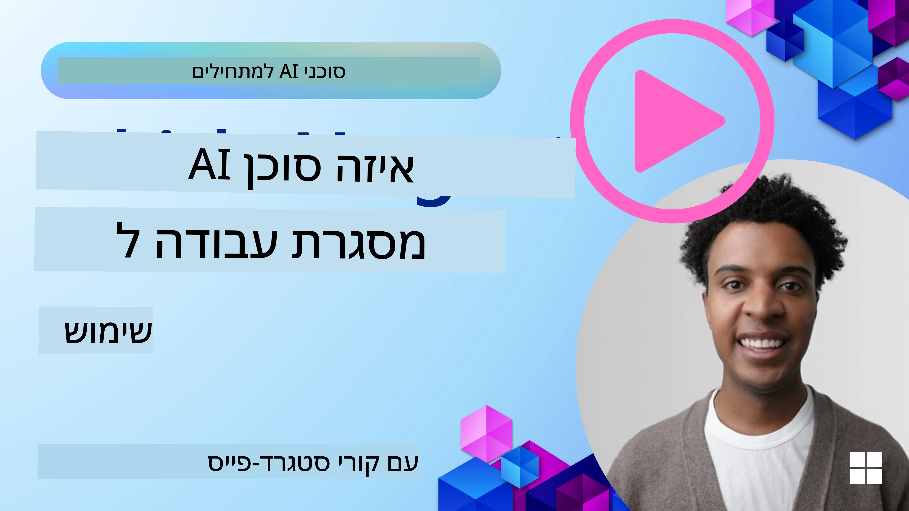

[](https://youtu.be/ODwF-EZo_O8?si=1xoy_B9RNQfrYdF7)

> _(לחץ על התמונה למעלה לצפייה בווידאו של השיעור הזה)_

# חקור מסגרות סוכן AI

מסגרות סוכן AI הן פלטפורמות תוכנה המיועדות לפשט את יצירתם, פריסתם וניהולם של סוכני AI. מסגרות אלה מספקות למפתחים רכיבים מוכנים מראש, הפשטות וכלים המייעלים את פיתוח מערכות AI מורכבות.

מסגרות אלו עוזרות למפתחים להתמקד בהיבטים הייחודיים של האפליקציות שלהם על ידי מתן גישות סטנדרטיות לאתגרים נפוצים בפיתוח סוכני AI. הן משפרות את הנפח, הנגישות והיעילות בבניית מערכות AI.

## הקדמה

שיעור זה יכסה:

- מהן מסגרות סוכן AI ומה הן מאפשרות למפתחים להשיג?
- כיצד צוותים יכולים להשתמש בהן כדי ליצור אבטיפוס במהירות, לאטור ולשפר את יכולות הסוכן שלהם?
- מה ההבדלים בין המסגרות והכלים שיצרה מיקרוסופט (<a href="https://aka.ms/ai-agents-beginners/ai-agent-service" target="_blank">Microsoft Foundry Agent Service</a> ו-<a href="https://learn.microsoft.com/azure/ai-services/openai/how-to/responses" target="_blank">Microsoft Agent Framework</a>)?
- האם ניתן לשלב את כלי האקו-סיסטם של Azure הקיימים ישירות, או שדרושות פתרונות עצמאיים?
- מהו Microsoft Foundry Agent Service וכיצד זה עוזר לי?

## מטרות הלמידה

מטרות שיעור זה הן לעזור לך להבין:

- תפקיד מסגרות סוכן AI בפיתוח AI.
- כיצד לנצל מסגרות סוכן AI לבניית סוכנים אינטיליגנטיים.
- יכולות מרכזיות שמסגרות סוכן AI מאפשרות.
- ההבדלים בין Microsoft Agent Framework ל-Microsoft Foundry Agent Service.

## מהן מסגרות סוכן AI ומה הן מאפשרות למפתחים לעשות?

מסגרות AI מסורתיות יכולות לעזור לך לשלב AI באפליקציות שלך ולשפר את האפליקציות בדרכים הבאות:

- **התאמה אישית**: AI יכול לנתח התנהגות והעדפות משתמשים כדי לספק המלצות מותאמות אישית, תוכן וחוויות.
דוגמה: שירותי סטרימינג כמו נטפליקס משתמשים ב-AI כדי להציע סרטים ותכניות על בסיס היסטוריית הצפייה, מה שמשפר את מעורבות והנאת המשתמש.
- **אוטומציה ויעילות**: AI יכול לאוטומט משימות חוזרות, לייעל תהליכי עבודה ולשפר את היעילות התפעולית.
דוגמה: אפליקציות שירות לקוחות משתמשות בבוטים מבוססי AI כדי לטפל בשאלות נפוצות, מקטינות זמני תגובה ומשחררות סוכנים אנושיים לטיפול בנושאים מורכבים יותר.
- **חווית משתמש משופרת**: AI יכול לשפר את חוויית המשתמש הכוללת על ידי מתן תכונות אינטיליגנטיות כמו זיהוי דיבור, עיבוד שפה טבעית וטקסט חזוי.
דוגמה: עוזרות וירטואליות כמו סירי ועוזר גוגל משתמשות ב-AI כדי להבין ולהגיב לפקודות קוליות, מה שמקל על המשתמשים באינטראקציה עם מכשיריהם.

### כל זה נשמע נהדר, אז למה אנחנו צריכים את מסגרת סוכן ה-AI?

מסגרות סוכן AI מייצגות יותר מאשר מסגרות AI רגילות. הן מיועדות לאפשר יצירת סוכנים אינטיליגנטיים שיכולים לקיים אינטראקציה עם משתמשים, סוכנים אחרים והסביבה כדי להשיג מטרות מסוימות. סוכנים אלו יכולים להפגין התנהגות אוטונומית, לקבל החלטות ולהסתגל לתנאים משתנים. בואו נבחן כמה יכולות מרכזיות שמסגרות סוכן AI מאפשרות:

- **שיתוף פעולה ותיאום בין סוכנים**: מאפשרים יצירת סוכנים מרובים שיכולים לעבוד יחד, לתקשר ולתאם לביצוע משימות מורכבות.
- **אוטומציה וניהול משימות**: מספקים מנגנונים לאוטומציה של תהליכי עבודה מרובי שלבים, הקצאת משימות וניהול דינמי של משימות בין סוכנים.
- **הבנת הקשר והסתגלות**: מציידים את הסוכנים ביכולת להבין את ההקשר, להסתגל לסביבות משתנות ולקבל החלטות בהתבסס על מידע בזמן אמת.

לסיכום, סוכנים מאפשרים לך לעשות יותר, לקחת את האוטומציה לשלב הבא, ליצור מערכות אינטליגנטיות יותר שיכולות להסתגל וללמוד מהסביבה שלהן.

## כיצד ליצור אבטיפוס במהירות, לאטור ולשפר את יכולות הסוכן?

זוהי סביבה משתנה במהירות, אך ישנם אלמנטים שמשותפים לרוב מסגרות סוכן AI שיכולים לעזור לך ליצור אבטיפוס במהירות ולאטור, בעיקר רכיבי מודולים, כלים שיתופיים ולמידה בזמן אמת. בואו נעמיק בהם:

- **השתמש ברכיבי מודולים**: SDKs של AI מציעים רכיבים מוכנים מראש כגון מחברים ל-AI ולזיכרון, קריאת פונקציות בעזרת שפה טבעית או תוספי קוד, תבניות פקודות ועוד.
- **נצל כלים שיתופיים**: עצב סוכנים עם תפקידים ומשימות ספציפיות, מה שמאפשר להם לבדוק ולשפר תהליכי עבודה שיתופיים.
- **למד בזמן אמת**: יישם לולאות משוב שבהן סוכנים לומדים מאינטראקציות ומותאמים את התנהגותם בצורה דינאמית.

### השתמש ברכיבי מודולים

SDKs כמו Microsoft Agent Framework מציעים רכיבים מוכנים מראש כגון מחברי AI, הגדרות כלים וניהול סוכנים.

**כיצד צוותים יכולים להשתמש בהם**: צוותים יכולים להרכיב במהירות רכיבים אלו ליצירת אבטיפוס פונקציונלי ללא התחלה מאפס, מה שמאפשר ניסויים מהירים וליטושים.

**כיצד זה עובד בפועל**: ניתן להשתמש בפרסר מוכן מראש כדי לחלץ מידע מקלט המשתמש, במודול זיכרון לאחסון ושליפה של נתונים, ובגנרטור פקודות לאינטראקציה עם המשתמשים, הכל מבלי לבנות את הרכיבים הללו מאפס.

**קוד לדוגמה**. בואו נסתכל על דוגמה איך אפשר להשתמש ב-Microsoft Agent Framework עם `FoundryChatClient` כדי להביא תגובה של המודל לקריאת כלים מהמשתמש:

``` python
# דוגמה לשימוש במסגרת Microsoft Agent ב-Python

import asyncio
import os

from agent_framework import tool
from agent_framework.foundry import FoundryChatClient
from azure.identity import AzureCliCredential


# הגדר פונקציה לדוגמה להזמנת נסיעות
@tool(approval_mode="never_require")
def book_flight(date: str, location: str) -> str:
    """Book travel given location and date."""
    return f"Travel was booked to {location} on {date}"


async def main():
    provider = FoundryChatClient(
        project_endpoint=os.environ["AZURE_AI_PROJECT_ENDPOINT"],
        model=os.environ["AZURE_AI_MODEL_DEPLOYMENT_NAME"],
        credential=AzureCliCredential(),
    )
    agent = provider.as_agent(
        name="travel_agent",
        instructions="Help the user book travel. Use the book_flight tool when ready.",
        tools=[book_flight],
    )

    response = await agent.run("I'd like to go to New York on January 1, 2025")
    print(response)
    # פלט לדוגמה: הטיסה שלך לניו יורק ב-1 בינואר 2025 הוזמנה בהצלחה. נסיעה טובה! ✈️🗽


if __name__ == "__main__":
    asyncio.run(main())
```

מה שניתן לראות מהדוגמה הזו הוא כיצד ניתן לנצל פרסר מוכן מראש כדי לחלץ מידע מפתח מהקלט של המשתמש, כגון מקור, יעד ותאריך בקשה להזמנת טיסה. גישה מודולרית זו מאפשרת לך להתמקד בלוגיקה ברמה גבוהה.

### נצל כלים שיתופיים

מסגרות כמו Microsoft Agent Framework מקלות על יצירת סוכנים מרובים שיכולים לעבוד יחד.

**כיצד צוותים יכולים להשתמש בהם**: צוותים יכולים לעצב סוכנים עם תפקידים ופעילויות ספציפיות, המאפשר להם לבחון ולשפר תהליכי עבודה שיתופיים ולשפר את היעילות הכוללת של המערכת.

**כיצד זה עובד בפועל**: ניתן ליצור צוות סוכנים שכל סוכן מתמחה בפונקציה מסוימת, כמו שליפת נתונים, ניתוח, או קבלת החלטות. סוכנים אלו יכולים לתקשר ולשתף מידע כדי להשיג מטרה משותפת, כמו לענות על שאלה של משתמש או להשלים משימה.

**קוד לדוגמה (Microsoft Agent Framework)**:

```python
# יצירת סוכנים מרובים העובדים יחד באמצעות מסגרת סוכן מיקרוסופט

import os
from agent_framework.foundry import FoundryChatClient
from azure.identity import AzureCliCredential

provider = FoundryChatClient(
    project_endpoint=os.environ["AZURE_AI_PROJECT_ENDPOINT"],
    model=os.environ["AZURE_AI_MODEL_DEPLOYMENT_NAME"],
    credential=AzureCliCredential(),
)

# סוכן אחזור נתונים
agent_retrieve = provider.as_agent(
    name="dataretrieval",
    instructions="Retrieve relevant data using available tools.",
    tools=[retrieve_tool],
)

# סוכן ניתוח נתונים
agent_analyze = provider.as_agent(
    name="dataanalysis",
    instructions="Analyze the retrieved data and provide insights.",
    tools=[analyze_tool],
)

# הרצת סוכנים ברצף על משימה
retrieval_result = await agent_retrieve.run("Retrieve sales data for Q4")
analysis_result = await agent_analyze.run(f"Analyze this data: {retrieval_result}")
print(analysis_result)
```

מה שנראה בקוד הקודם הוא כיצד ליצור משימה שכוללת מספר סוכנים שעובדים יחד לניתוח נתונים. כל סוכן מבצע פונקציה ספציפית, והמשימה מתבצעת על ידי תיאום בין הסוכנים להשגת התוצאה הרצויה. באמצעות יצירת סוכנים ייעודיים עם תפקידים מומחים, ניתן לשפר את יעילות וביצוע המשימה.

### למד בזמן אמת

מסגרות מתקדמות מספקות יכולות להבנת הקשר בזמן אמת והסתגלות.

**כיצד צוותים יכולים להשתמש בהם**: צוותים יכולים ליישם לולאות משוב שבהן סוכנים לומדים מאינטראקציות ומותאמים את התנהגותם באופן דינמי, מה שמוביל לשיפור ושכלול מתמשכים של היכולות.

**כיצד זה עובד בפועל**: סוכנים יכולים לנתח משוב משתמשים, נתונים סביבתיים ותוצאות משימות כדי לעדכן את בסיס הידע שלהם, להתאים אלגוריתמים לקבלת החלטות ולשפר ביצועים לאורך זמן. תהליך למידה איטרטיבי זה מאפשר לסוכנים להסתגל לתנאים משתנים ולהעדפות משתמשים, משפר את האפקטיביות הכוללת של המערכת.

## מה ההבדלים בין Microsoft Agent Framework ל-Microsoft Foundry Agent Service?

ישנן דרכים רבות להשוות בין הגישות הללו, אבל בואו נסקור כמה הבדלים מרכזיים במונחים של עיצוב, יכולות ומקרי שימוש ייעודיים:

## Microsoft Agent Framework (MAF)

Microsoft Agent Framework מספק SDK פשוט ליצירת סוכני AI באמצעות `FoundryChatClient`. הוא מאפשר למפתחים ליצור סוכנים המשתמשים במודלים של Azure OpenAI עם קריאה מובנית לכלים, ניהול שיחות ואבטחה ברמת ארגון דרך זהות Azure.

**מקרי שימוש**: בניית סוכני AI מוכנים לייצור עם שימוש בכלים, תהליכי עבודה מרובי שלבים ותסריטי אינטגרציה ארגוניים.

להלן כמה מושגי יסוד חשובים של Microsoft Agent Framework:

- **סוכנים**. סוכן נוצר באמצעות `FoundryChatClient` ומוגדר עם שם, הוראות וכלים. הסוכן יכול:
  - **לעבד הודעות משתמש** ולייצר תגובות באמצעות מודלי Azure OpenAI.
  - **לקרוא לכלים** באופן אוטומטי על פי הקשר השיחה.
  - **לשמור על מצב השיחה** לאורך אינטראקציות מרובות.

  הנה קטע קוד שמראה איך ליצור סוכן:

    ```python
    import os
    from agent_framework.foundry import FoundryChatClient
    from azure.identity import AzureCliCredential

    provider = FoundryChatClient(
        project_endpoint=os.environ["AZURE_AI_PROJECT_ENDPOINT"],
        model=os.environ["AZURE_AI_MODEL_DEPLOYMENT_NAME"],
        credential=AzureCliCredential(),
    )
    agent = provider.as_agent(
        name="my_agent",
        instructions="You are a helpful assistant.",
    )

    response = await agent.run("Hello, World!")
    print(response)
    ```

- **כלים**. המסגרת תומכת בהגדרת כלים כפונקציות פייתון שהסוכן יכול להפעיל אוטומטית. הכלים נרשמים בעת יצירת הסוכן:

    ```python
    def get_weather(location: str) -> str:
        """Get the current weather for a location."""
        return f"The weather in {location} is sunny, 72\u00b0F."

    agent = provider.as_agent(
        name="weather_agent",
        instructions="Help users check the weather.",
        tools=[get_weather],
    )
    ```

- **תיאום בין סוכנים מרובים**. ניתן ליצור מספר סוכנים עם התמחויות שונות ולתאם את עבודתם:

    ```python
    planner = provider.as_agent(
        name="planner",
        instructions="Break down complex tasks into steps.",
    )

    executor = provider.as_agent(
        name="executor",
        instructions="Execute the planned steps using available tools.",
        tools=[execute_tool],
    )

    plan = await planner.run("Plan a trip to Paris")
    result = await executor.run(f"Execute this plan: {plan}")
    ```

- **אינטגרציה עם זהות Azure**. המסגרת משתמשת ב-`AzureCliCredential` (או `DefaultAzureCredential`) לאימות מאובטח ללא מפתחות, ומונעת את הצורך לנהל מפתחות API ישירות.

## Microsoft Foundry Agent Service

Microsoft Foundry Agent Service הוא תוספת חדשה יותר, שהוצגה ב-Microsoft Ignite 2024. הוא מאפשר פיתוח ופריסה של סוכני AI עם מודלים גמישים יותר, כמו קריאה ישירה למודלים פתוחים מקור כמו Llama 3, Mistral ו-Cohere.

Microsoft Foundry Agent Service מספק מנגנוני אבטחה ארגוניים חזקים ושיטות לאחסון נתונים, מה שהופך אותו למתאים לאפליקציות ארגוניות.

הוא עובד מיידית עם Microsoft Agent Framework לבניית ופריסת סוכנים.

שירות זה נמצא כיום בגרסת תצוגה ציבורית ותומך בפיתוח סוכנים בפייתון וב-#C.

באמצעות SDK של Microsoft Foundry Agent Service בפייתון, ניתן ליצור סוכן עם כלי שהוגדר על ידי המשתמש:

```python
import asyncio
from azure.identity import DefaultAzureCredential
from azure.ai.projects import AIProjectClient

# הגדר פונקציות כלים
def get_specials() -> str:
    """Provides a list of specials from the menu."""
    return """
    Special Soup: Clam Chowder
    Special Salad: Cobb Salad
    Special Drink: Chai Tea
    """

def get_item_price(menu_item: str) -> str:
    """Provides the price of the requested menu item."""
    return "$9.99"


async def main() -> None:
    credential = DefaultAzureCredential()
    project_client = AIProjectClient.from_connection_string(
        credential=credential,
        conn_str="your-connection-string",
    )

    agent = project_client.agents.create_agent(
        model="gpt-4o-mini",
        name="Host",
        instructions="Answer questions about the menu.",
        tools=[get_specials, get_item_price],
    )

    thread = project_client.agents.create_thread()

    user_inputs = [
        "Hello",
        "What is the special soup?",
        "How much does that cost?",
        "Thank you",
    ]

    for user_input in user_inputs:
        print(f"# User: '{user_input}'")
        message = project_client.agents.create_message(
            thread_id=thread.id,
            role="user",
            content=user_input,
        )
        run = project_client.agents.create_and_process_run(
            thread_id=thread.id, agent_id=agent.id
        )
        messages = project_client.agents.list_messages(thread_id=thread.id)
        print(f"# Agent: {messages.data[0].content[0].text.value}")


if __name__ == "__main__":
    asyncio.run(main())
```

### מושגי יסוד

למיקרוסופט Foundry Agent Service יש את מושגי היסוד הבאים:

- **סוכן**. Microsoft Foundry Agent Service משתלב עם Microsoft Foundry. בתוך Microsoft Foundry, סוכן AI פועל כמיקרו-שירות חכם שיכול לענות על שאלות (RAG), לבצע פעולות או לאוטומט תהליכי עבודה לחלוטין. זה מושג על ידי שילוב כוחם של מודלי AI גנרטיביים עם כלים המאפשרים לו לגשת ולפעול מול מקורות נתונים בעולם האמיתי. הנה דוגמה לסוכן:

    ```python
    agent = project_client.agents.create_agent(
        model="gpt-4o-mini",
        name="my-agent",
        instructions="You are helpful agent",
        tools=code_interpreter.definitions,
        tool_resources=code_interpreter.resources,
    )
    ```

    בדוגמה זו, סוכן נוצר עם המודל `gpt-4o-mini`, שם `my-agent`, והוראות `You are helpful agent`. הסוכן מצויד בכלים ומשאבים לביצוע משימות פירוש קוד.

- **שרשור והודעות**. השרשור הוא מושג חשוב נוסף. הוא מייצג שיחה או אינטראקציה בין סוכן למשתמש. השרשורים יכולים לשמש למעקב התקדמות שיחה, אחסון מידע הקשר וניהול מצב האינטראקציה. הנה דוגמה לשרשור:

    ```python
    thread = project_client.agents.create_thread()
    message = project_client.agents.create_message(
        thread_id=thread.id,
        role="user",
        content="Could you please create a bar chart for the operating profit using the following data and provide the file to me? Company A: $1.2 million, Company B: $2.5 million, Company C: $3.0 million, Company D: $1.8 million",
    )
    
    # בקש מהסוכן לבצע עבודה על התהליך
    run = project_client.agents.create_and_process_run(thread_id=thread.id, agent_id=agent.id)
    
    # קבל והרשם את כל ההודעות כדי לראות את תגובת הסוכן
    messages = project_client.agents.list_messages(thread_id=thread.id)
    print(f"Messages: {messages}")
    ```

    בקוד הקודם, נוצר שרשור. לאחר מכן נשלחת הודעה לשרשור. באמצעות קריאה לפונקציה `create_and_process_run`, מבקשים מהסוכן לבצע עבודה על השרשור. לבסוף, ההודעות נאספות ומתוייקות לצפייה בתגובת הסוכן. ההודעות מציינים את התקדמות השיחה בין המשתמש לסוכן. חשוב גם להבין שההודעות יכולות להיות מסוגים שונים כגון טקסט, תמונה או קובץ, כלומר העבודה של הסוכנים נוצרה לדוגמה כתמונה או כתשובת טקסט. כמפתח, ניתן להשתמש במידע זה כדי לעבד את התגובה או להציג אותה למשתמש.

- **משתלב עם Microsoft Agent Framework**. Microsoft Foundry Agent Service עובד באופן חלק עם Microsoft Agent Framework, מה שאומר שאפשר לבנות סוכנים באמצעות `FoundryChatClient` ולפרוס אותם דרך Agent Service לתרחישי ייצור.

**מקרי שימוש**: Microsoft Foundry Agent Service מיועד לאפליקציות ארגוניות הדורשות פריסה מאובטחת, סקלאבילית וגמישה של סוכני AI.

## מה ההבדל בין הגישות הללו?
 
זה אכן נשמע שיש חפיפות, אבל ישנם הבדלים מרכזיים במונחי עיצוב, יכולות ומקרי שימוש:
 
- **Microsoft Agent Framework (MAF)**: הוא SDK מוכן לייצור לבניית סוכני AI. הוא מספק API פשוט ליצירת סוכנים עם קריאת כלים, ניהול שיחות ואינטגרציה עם זהות Azure.
- **Microsoft Foundry Agent Service**: הוא פלטפורמה ושירות פריסה ב-Microsoft Foundry לסוכנים. הוא מציע חיבור מובנה לשירותים כמו Azure OpenAI, Azure AI Search, Bing Search וביצוע קוד.
 
עדיין לא בטוח מה לבחור?

### מקרי שימוש
 
בואו נראה אם נוכל לעזור לכם דרך כמה מקרי שימוש נפוצים:
 
> שאלה: אני בונה אפליקציות סוכן AI לייצור ורוצה להתחיל מהר
>

>תשובה: Microsoft Agent Framework היא בחירה מצוינת. היא נותנת API פשוט בפייתון דרך `FoundryChatClient` שמאפשר להגדיר סוכנים עם כלים והוראות בכמה שורות קוד בלבד.

>שאלה: אני צריך פריסה בארגונית עם אינטגרציה של Azure כמו Search וביצוע קוד
>
> תשובה: Microsoft Foundry Agent Service מתאים ביותר. זו פלטפורמה עם יכולות מובנות למודלים מרובים, Azure AI Search, Bing Search ו-Azure Functions. הוא מאפשר בניית סוכנים בפורטל Foundry ופריסתם בהיקף.
 
> שאלה: אני עדיין מבולבל, רק תן לי אפשרות אחת
>
> תשובה: התחל עם Microsoft Agent Framework לבניית הסוכנים שלך, ואז השתמש ב-Microsoft Foundry Agent Service כאשר תצטרך לפרוס ולהרחיב אותם בסביבת ייצור. גישה זו מאפשרת איטרציה מהירה על הלוגיקה של הסוכן עם דרך ברורה לפריסה ארגונית.
 
בואו נסכם את ההבדלים המרכזיים בטבלה:

| מסגרת | מיקוד | מושגי יסוד | מקרי שימוש |
| --- | --- | --- | --- |
| Microsoft Agent Framework | SDK סוכן פשוט עם קריאת כלים | סוכנים, כלים, זהות Azure | בניית סוכני AI, שימוש בכלים, תהליכי עבודה מרובי שלבים |
| Microsoft Foundry Agent Service | מודלים גמישים, אבטחה ארגונית, יצירת קוד, קריאת כלים | מודולריות, שיתוף פעולה, אורקסטרציה של תהליכים | פריסת סוכני AI מאובטחת, סקלאבילית וגמישה |

## האם אני יכול לשלב את כלי האקו-סיסטם של Azure הקיימים ישירות, או שדרושות פתרונות עצמאיים?


התשובה היא כן, ניתן לשלב את כלי האקוסיסטם הקיימים שלך של Azure ישירות עם שירות הסוכן של Microsoft Foundry במיוחד, שכן הוא בנוי לעבוד בצורה חלקה עם שירותי Azure אחרים. אתה יכול למשל לשלב את Bing, Azure AI Search ו-Azure Functions. קיימת גם אינטגרציה עמוקה עם Microsoft Foundry.

מסגרת הסוכן של Microsoft משתלבת גם עם שירותי Azure דרך `FoundryChatClient` וזהות Azure, ומאפשרת לך לקרוא לשירותי Azure ישירות מכלי הסוכן שלך.

## דוגמאות קוד

- Python: [Agent Framework (Microsoft Foundry)](./code_samples/02-python-agent-framework.ipynb)
- Python: [Agent Framework (Azure OpenAI Responses API)](./code_samples/02-python-agent-framework-azure-openai.ipynb)
- .NET: [Agent Framework](./code_samples/02-dotnet-agent-framework.md)

## יש לך שאלות נוספות על מסגרות סוכנים מלאכותיים?

הצטרף ל-[Microsoft Foundry Discord](https://discord.com/invite/ATgtXmAS5D) כדי להיפגש עם לומדים נוספים, להשתתף בשעות משרדיות ולקבל מענה על שאלותיך לגבי סוכני AI.

## מקורות

- <a href="https://techcommunity.microsoft.com/blog/azure-ai-services-blog/introducing-azure-ai-agent-service/4298357" target="_blank">שירות סוכן Azure</a>
- <a href="https://learn.microsoft.com/azure/ai-services/openai/how-to/responses" target="_blank">מסגרת סוכן Microsoft - תגובות Azure OpenAI</a>
- <a href="https://learn.microsoft.com/azure/ai-services/agents/overview" target="_blank">שירות סוכן Microsoft Foundry</a>

## השיעור הקודם

[הקדמה לסוכני AI ומקרי שימוש בסוכנים](../01-intro-to-ai-agents/README.md)

## השיעור הבא

[הבנת דפוסי עיצוב אייג׳נטיים](../03-agentic-design-patterns/README.md)

---

<!-- CO-OP TRANSLATOR DISCLAIMER START -->
**כתב ויתור**:
מסמך זה תורגם באמצעות שירות תרגום אוטומטי [Co-op Translator](https://github.com/Azure/co-op-translator). למרות שאנו שואפים לדיוק, יש לקחת בחשבון שתרגומים אוטומטיים עלולים להכיל שגיאות או אי-דיוקים. יש להחשיב את המסמך המקורי בשפתו הטבעית כמקור הסמכות. למידע קריטי מומלץ להשתמש בתרגום מקצועי על ידי מתרגם אדם. אנו לא אחראים לכל אי-הבנה או פירוש שגוי הנובע מהשימוש בתרגום זה.
<!-- CO-OP TRANSLATOR DISCLAIMER END -->