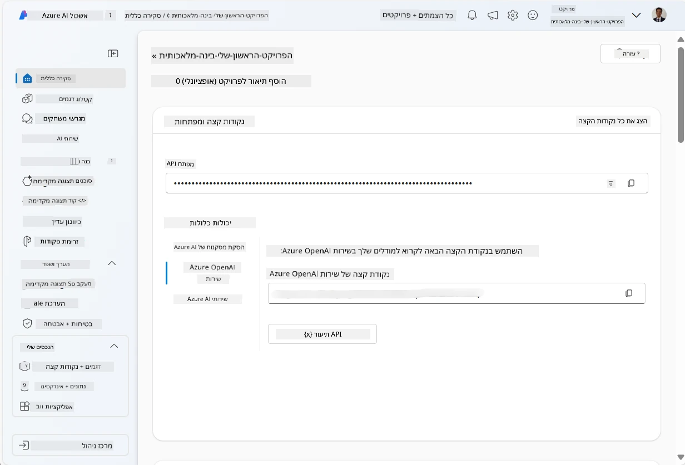
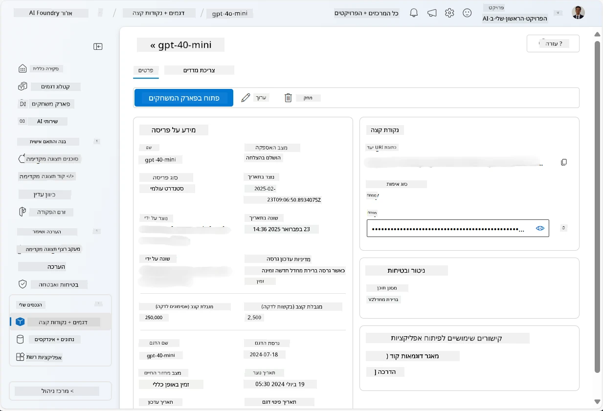
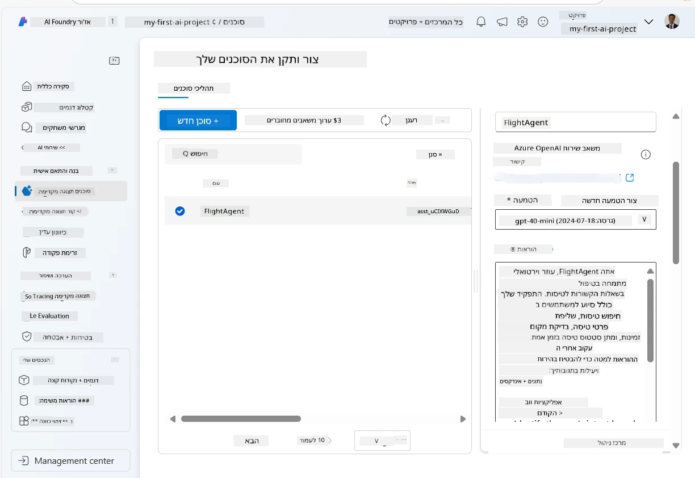
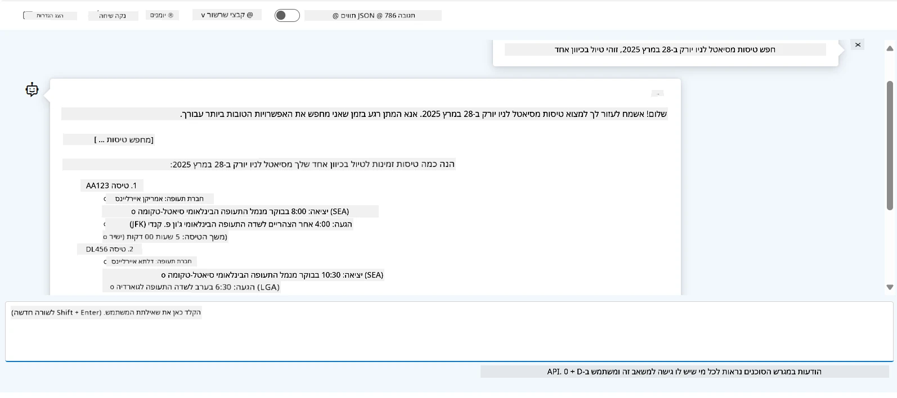

# פיתוח שירות סוכן Microsoft Foundry

בתרגיל זה, אתה משתמש בכלי שירות סוכן Microsoft Foundry ב-[פורטל Microsoft Foundry](https://ai.azure.com/?WT.mc_id=academic-105485-koreyst) כדי ליצור סוכן להזמנת טיסות. הסוכן יוכל לתקשר עם משתמשים ולספק מידע על טיסות.

## דרישות מוקדמות

כדי להשלים את התרגיל הזה, אתה זקוק לדברים הבאים:
1. חשבון Azure עם מנוי פעיל. [צור חשבון בחינם](https://azure.microsoft.com/free/?WT.mc_id=academic-105485-koreyst).
2. זכויות יצירה של מרכז Microsoft Foundry או מרכז שכבר נוצר עבורך.
    - אם התפקיד שלך הוא Contributor או Owner, תוכל לעקוב אחרי השלבים במדריך זה.

## יצירת מרכז Microsoft Foundry

> **הערה:** Microsoft Foundry היה ידוע בעבר כמערכת Azure AI Studio.

1. עקוב אחרי ההנחיות מתוך פוסט הבלוג של [Microsoft Foundry](https://learn.microsoft.com/en-us/azure/ai-studio/?WT.mc_id=academic-105485-koreyst) ליצירת מרכז Microsoft Foundry.
2. כאשר הפרויקט שלך נוצר, סגור כל טיפים שמוצגים ובדוק את דף הפרויקט בפורטל Microsoft Foundry, שצריך להיראות דומה לתמונה הבאה:

    

## פריסת מודל

1. בלוח השמאלי של הפרויקט שלך, בקטע **My assets**, בחר בדף **Models + endpoints**.
2. בדף **Models + endpoints**, בכרטיסיית **Model deployments**, בתפריט **+ Deploy model**, בחר **Deploy base model**.
3. חפש את המודל `gpt-4o-mini` ברשימה, ואז בחר ואתר את האישור.

    > **הערה**: הפחתת TPM מסייעת להימנע משימוש יתר במנוי שבשימושך.

    

## יצירת סוכן

עכשיו כשהמודל כבר פרוס, אתה יכול ליצור סוכן. סוכן הוא מודל AI שיחה שיכול לשמש לתקשורת עם משתמשים.

1. בלוח השמאלי של הפרויקט שלך, בקטע **Build & Customize**, בחר בדף **Agents**.
2. לחץ על **+ Create agent** כדי ליצור סוכן חדש. תחת תיבת הדו-שיח **Agent Setup**:
    - הזן שם לסוכן, לדוגמה `FlightAgent`.
    - ודא שנבחרה פריסת המודל `gpt-4o-mini` שיצרת קודם.
    - הגדר את **Instructions** על פי ההנחיה שברצונך שהסוכן יעקוב אחריה. הנה דוגמה:
    ```
    You are FlightAgent, a virtual assistant specialized in handling flight-related queries. Your role includes assisting users with searching for flights, retrieving flight details, checking seat availability, and providing real-time flight status. Follow the instructions below to ensure clarity and effectiveness in your responses:

    ### Task Instructions:
    1. **Recognizing Intent**:
       - Identify the user's intent based on their request, focusing on one of the following categories:
         - Searching for flights
         - Retrieving flight details using a flight ID
         - Checking seat availability for a specified flight
         - Providing real-time flight status using a flight number
       - If the intent is unclear, politely ask users to clarify or provide more details.
        
    2. **Processing Requests**:
        - Depending on the identified intent, perform the required task:
        - For flight searches: Request details such as origin, destination, departure date, and optionally return date.
        - For flight details: Request a valid flight ID.
        - For seat availability: Request the flight ID and date and validate inputs.
        - For flight status: Request a valid flight number.
        - Perform validations on provided data (e.g., formats of dates, flight numbers, or IDs). If the information is incomplete or invalid, return a friendly request for clarification.

    3. **Generating Responses**:
    - Use a tone that is friendly, concise, and supportive.
    - Provide clear and actionable suggestions based on the output of each task.
    - If no data is found or an error occurs, explain it to the user gently and offer alternative actions (e.g., refine search, try another query).
    
    ```
> [!NOTE]
> עבור הנחיה מפורטת, תוכל לבדוק [מאגר זה](https://github.com/ShivamGoyal03/RoamMind) למידע נוסף.
    
> בנוסף, ניתן להוסיף **Knowledge Base** ו-**Actions** כדי לשפר את יכולות הסוכן לספק מידע נוסף ולבצע פעולות אוטומטיות בהתאם לבקשות משתמשים. בתרגיל זה, ניתן לדלג על שלבים אלה.
    


3. ליצירת סוכן AI מרובה חדש, פשוט לחץ על **New Agent**. הסוכן החדש יוצג בדף הסוכנים.


## מבחן לסוכן

לאחר יצירת הסוכן, תוכל לבדוק כיצד הוא מגיב לשאלות משתמש בפורטל Microsoft Foundry playground.

1. בחלק העליון של לוח ה-**Setup** עבור הסוכן שלך, בחר **Try in playground**.
2. בלוח **Playground**, תוכל לתקשר עם הסוכן על ידי הקלדת שאילתות בחלון הצ'אט. לדוגמה, תוכל לבקש מהסוכן לחפש טיסות מסיאטל לניו יורק בתאריך 28.

    > **הערה**: הסוכן עשוי לא לספק תשובות מדויקות, כיוון שלא נעשה שימוש בנתונים בזמן אמת בתרגיל זה. המטרה היא לבדוק את יכולת הסוכן להבין ולהגיב לשאלות המשתמש בהתבסס על ההוראות שניתנו.

    

3. לאחר המבחן, תוכל לשפר את הסוכן על ידי הוספת כוונות, נתוני אימון ופעולות להרחבת יכולותיו.

## ניקוי משאבים

לאחר סיום הבדיקה, תוכל למחוק את הסוכן כדי למנוע עלויות נוספות.
1. פתח את [פורטל Azure](https://portal.azure.com) וצפה בתוכן קבוצת המשאבים שבה פרסמת את משאבי המרכז שנעשה בהם שימוש בתרגיל זה.
2. בסרגל הכלים, בחר **Delete resource group**.
3. הזן את שם קבוצת המשאבים ואשר את המחיקה.

## משאבים

- [תיעוד Microsoft Foundry](https://learn.microsoft.com/en-us/azure/ai-studio/?WT.mc_id=academic-105485-koreyst)
- [פורטל Microsoft Foundry](https://ai.azure.com/?WT.mc_id=academic-105485-koreyst)
- [מבוא ל-Microsoft Foundry](https://techcommunity.microsoft.com/blog/educatordeveloperblog/getting-started-with-azure-ai-studio/4095602?WT.mc_id=academic-105485-koreyst)
- [עקרונות סוכני AI ב-Azure](https://learn.microsoft.com/en-us/training/modules/ai-agent-fundamentals/?WT.mc_id=academic-105485-koreyst)
- [Azure AI Discord](https://aka.ms/AzureAI/Discord)

---

<!-- CO-OP TRANSLATOR DISCLAIMER START -->
**כתב ויתור**:
מסמך זה תורגם באמצעות שירות תרגום אוטומטי [Co-op Translator](https://github.com/Azure/co-op-translator). למרות שאנו שואפים לדיוק, יש לקחת בחשבון שתרגומים אוטומטיים עלולים להכיל שגיאות או אי-דיוקים. יש להחשיב את המסמך המקורי בשפתו הטבעית כמקור הסמכות. למידע קריטי מומלץ להשתמש בתרגום מקצועי על ידי מתרגם אדם. אנו לא אחראים לכל אי-הבנה או פירוש שגוי הנובע מהשימוש בתרגום זה.
<!-- CO-OP TRANSLATOR DISCLAIMER END -->