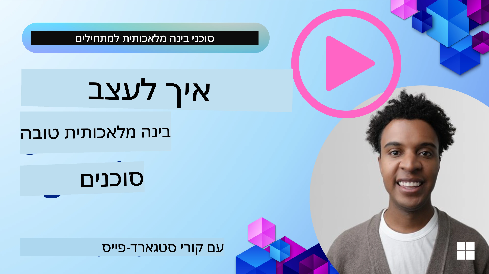
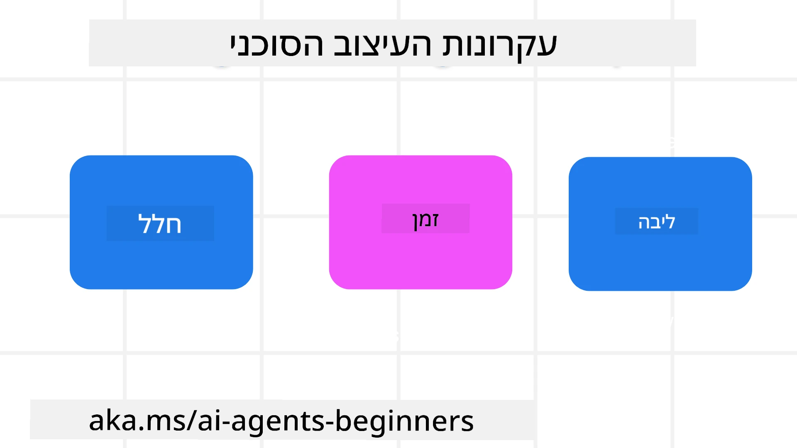

> _(לחצו על התמונה למעלה לצפייה בסרטון של השיעור)_
# עקרונות עיצוב סוכני בינה מלאכותית

## מבוא

ישנן דרכים רבות לחשוב על בניית מערכות סוכנים בינה מלאכותית. בהתחשב בכך שהעמימות היא תכונה ולא תקלה בעיצוב בינה מלאכותית מחוללת, לעיתים קשה למהנדסים לדעת מאיפה בכלל להתחיל. יצרנו סט של עקרונות עיצוב חוויית משתמש ממוקדי אדם כדי לאפשר למפתחים לבנות מערכות סוכנים ממוקדות לקוח שיענו על צרכי העסק שלהם. עקרונות עיצוב אלה אינם ארכיטקטורה מתוכננת מראש אלא נקודת התחלה לצוותים המגדירים ובונים חוויות סוכניות.

באופן כללי, סוכנים צריכים ל:

- להרחיב ולהגדיל יכולות אנושיות (סיעור מוחות, פתרון בעיות, אוטומציה וכו')
- למלא פערי ידע (להביא אותי למצב עדכני בתחומי ידע, תרגום וכו')
- להקל ולתמוך בשיתוף פעולה בדרכים בהן אנו עצמנו מעדיפים לעבוד עם אחרים
- להפוך אותנו לגרסאות טובות יותר של עצמנו (למשל, מאמן חיים/שליט משימות, עזרה בלמידת כישורי ויסות רגשי והקשבה, בניית עמידות וכו')

## במה שיעור זה יעסוק

- מהם עקרונות העיצוב הסוכניים
- מהם כמה קווים מנחים ליישום עקרונות העיצוב הללו
- מהם כמה דוגמאות לשימוש בעקרונות העיצוב

## מטרות הלמידה

לאחר סיום שיעור זה, תוכלו:

1. להסביר מהם עקרונות העיצוב הסוכניים
2. להסביר את הקווים המנחים לשימוש בעקרונות העיצוב הסוכניים
3. להבין כיצד לבנות סוכן באמצעות עקרונות העיצוב הסוכניים

## עקרונות העיצוב הסוכניים

### סוכן (סביבה)

זוהי הסביבה בה הסוכן פועל. עקרונות אלה מכתיבים כיצד אנו מעצבים סוכנים לפעילות בעולם הפיזי והדיגיטלי.

- **לחבר, לא לקרוס** – לעזור לקשר בין אנשים, אירועים וידע פעולה כדי לאפשר שיתוף פעולה וחיבור.
- סוכנים עוזרים לקשר בין אירועים, ידע ואנשים.
- סוכנים מקרבים אנשים זה לזה. הם לא מיועדים להחליף או לזלזל באנשים.
- **נגיש בקלות אך לעיתים בלתי נראה** – הסוכן פועל בעיקר ברקע ומדרבן אותנו רק כאשר זה רלוונטי ומתאים.
  - הסוכן ניתן לגילוי בקלות ונגיש למשתמשים מורשים בכל מכשיר או פלטפורמה.
  - הסוכן תומך בקלט ופלט רב-מודאליים (קול, קול, טקסט וכו').
  - הסוכן יכול לעבור בצורה חלקה בין רקע לפני; בין תגובתי לפרואקטיבי, בהתאם לזיהוי הצרכים של המשתמש.
  - הסוכן עשוי לפעול בצורה בלתי נראית, אך תהליך הרקע שלו והשיתוף פעולה עם סוכנים אחרים שקופים וניתנים לשליטה על ידי המשתמש.

### סוכן (זמן)

כך הסוכן פועל לאורך הזמן. עקרונות אלה מכתיבים כיצד אנו מעצבים סוכנים הפועלים בעבר, בהווה ובעתיד.

- **העבר**: השתקפות על ההיסטוריה שכוללת גם את המצב וגם את ההקשר.
  - הסוכן מספק תוצאות רלוונטיות יותר בהתבסס על ניתוח נתוני היסטוריה עשירים מעבר לאירוע, לאנשים או למצב בלבד.
  - הסוכן יוצר קשרים מאירועי העבר ומשקף בצורה פעילה את הזיכרון כדי לעסוק במצבים נוכחיים.
- **הווה**: דירוג יותר מהודעה.
  - הסוכן מגלם גישה מקיפה לאינטראקציה עם אנשים. כאשר אירוע קורה, הסוכן עולה על הודעה סטטית או פורמליות סטטית. הסוכן יכול לפשט זרימות או לייצר איתותים דינמיים כדי לכוון את תשומת הלב של המשתמש ברגע הנכון.
  - הסוכן מספק מידע המבוסס על הסביבה הקונטקסטואלית, שינויים חברתיים ותרבותיים ומותאם לכוונתו של המשתמש.
  - האינטראקציה עם הסוכן יכולה להיות הדרגתית, מתפתחת/צומחת במורכבות כדי להעצים את המשתמשים לטווח הארוך.
- **עתיד**: הסתגלות והתפתחות.
  - הסוכן מסתגל למגוון מכשירים, פלטפורמות ומודאליות.
  - הסוכן מסתגל להתנהגות המשתמש, לצרכי נגישות, וניתן להתאמה חופשית.
  - הסוכן מעוצב ומתפתח באמצעות אינטראקציה מתמשכת עם המשתמש.

### סוכן (ליבה)

אלה הן האלמנטים המרכזיים בליבת העיצוב של סוכן.

- **לאמץ אי ודאות אך לבסס אמון**.
  - רמת אי ודאות מסוימת של הסוכן צפויה. אי ודאות היא אלמנט מפתח בעיצוב הסוכן.
  - אמון ושקיפות הם שכבות יסוד בעיצוב הסוכן.
  - בני אדם שולטנים מתי הסוכן פועל/כבוי ומצב הסוכן נראה בבירור בכל עת.

## הקווים המנחים ליישום עקרונות אלו

כשאתה משתמש בעקרונות העיצוב הקודמים, השתמש בקווים המנחים הבאים:

1. **שקיפות**: יידע את המשתמש כי מעורבת בינה מלאכותית, כיצד היא פועלת (כולל פעולות עבר), וכיצד לתת משוב ולשנות את המערכת.
2. **שליטה**: אפשר למשתמש להתאים אישית, לציין העדפות ולפרט אישית, ולשלוט במערכת ובתכונותיה (כולל היכולת לשכוח).
3. **עקביות**: שאף לחוויות עקביות ורב-מודאליות במכשירים ונקודות קצה. השתמש באלמנטים מוכרים של ממשק משתמש/חווית משתמש ככל האפשר (למשל, סמל מיקרופון לאינטראקציה קולית) והפחת את העומס הקוגניטיבי של הלקוח ככל שניתן (למשל, שאף לתגובות תמציתיות, סיוע חזותי ותוכן 'למידע נוסף').

## כיצד לעצב סוכן נסיעות באמצעות עקרונות וקווים מנחים אלה

דמיין שאתה מעצב סוכן נסיעות, כך תוכל לחשוב על שימוש בעקרונות וקווים מנחים לעיצוב:

1. **שקיפות** – ידע את המשתמש כי סוכן הנסיעות הוא סוכן מופעל AI. ספק כמה הוראות בסיסיות כיצד להתחיל (למשל, הודעת "שלום", הנחיות לדוגמה). תעד זאת בבירור בדף המוצר. הצג רשימת ההנחיות שהמשתמש שאל בעבר. הצג בבירור כיצד לתת משוב (אגודלים למעלה ולמטה, לחצן שליחת משוב וכו'). פרט בבירור אם לסוכן יש מגבלות שימוש או נושאים.
2. **שליטה** – ודא שמובן כיצד המשתמש יכול לשנות את הסוכן לאחר יצירתו עם פרטים כגון הנחיית מערכת. אפשר למשתמש לבחור כמה הסוכן מפורט, סגנון הכתיבה, וכל אזהרות לגבי נושאים עליהם הסוכן לא אמור לדבר. אפשר למשתמש לצפות ולמחוק קבצים או נתונים קשורים, הנחיות ושיחות קודמות.
3. **עקביות** – ודא שהאייקונים לשיתוף הנחיה, הוספת קובץ או תמונה ותיוג מישהו או משהו הם סטנדרטיים וניתנים לזיהוי. השתמש בסמל של מהדק נייר לציון העלאת/שיתוף קבצים עם הסוכן, ובסמל של תמונה לציון העלאת גרפיקה.

## דוגמאות קוד

- Python: [Agent Framework](./code_samples/03-python-agent-framework.ipynb)
- .NET: [Agent Framework](./code_samples/03-dotnet-agent-framework.md)

## יש לך עוד שאלות על דפוסי עיצוב סוכנים בינה מלאכותית?

הצטרף ל-[Microsoft Foundry Discord](https://discord.com/invite/ATgtXmAS5D) לפגוש לומדים אחרים, להשתתף בשעות קבלה ולקבל תשובות לשאלות על סוכני בינה מלאכותית.

## משאבים נוספים

- <a href="https://openai.com" target="_blank">פרקטיקות לממשל מערכות AI סוכניות | OpenAI</a>
- <a href="https://microsoft.com" target="_blank">פרויקט HAX Toolkit - מחקר מיקרוסופט</a>
- <a href="https://responsibleaitoolbox.ai" target="_blank">ארגז כלים ל-AI אחראי</a>

## שיעור קודם

[חקירת מסגרות סוכניות](../02-explore-agentic-frameworks/README.md)

## שיעור הבא

[תבניות עיצוב שימוש בכלים](../04-tool-use/README.md)

---

<!-- CO-OP TRANSLATOR DISCLAIMER START -->
**כתב ויתור**:
מסמך זה תורגם באמצעות שירות תרגום אוטומטי [Co-op Translator](https://github.com/Azure/co-op-translator). למרות שאנו שואפים לדיוק, יש לקחת בחשבון שתרגומים אוטומטיים עלולים להכיל שגיאות או אי-דיוקים. יש להחשיב את המסמך המקורי בשפתו הטבעית כמקור הסמכות. למידע קריטי מומלץ להשתמש בתרגום מקצועי על ידי מתרגם אדם. אנו לא אחראים לכל אי-הבנה או פירוש שגוי הנובע מהשימוש בתרגום זה.
<!-- CO-OP TRANSLATOR DISCLAIMER END -->