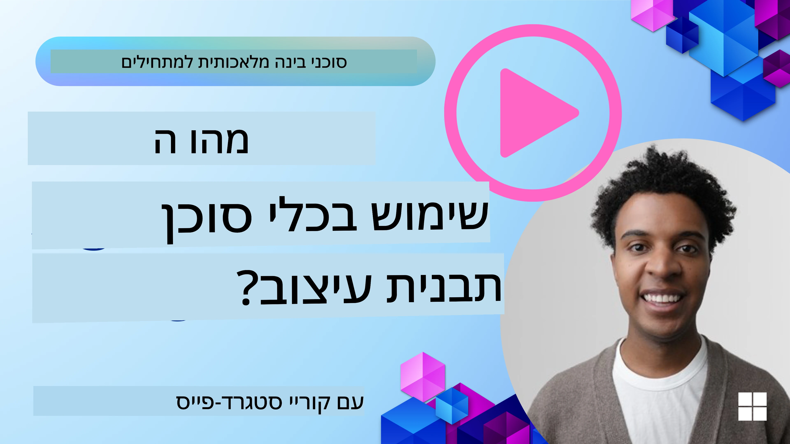
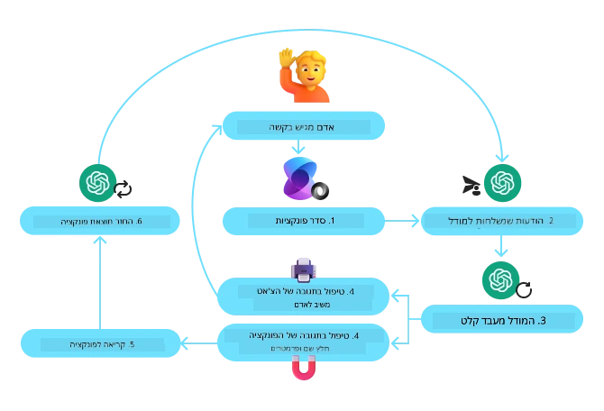
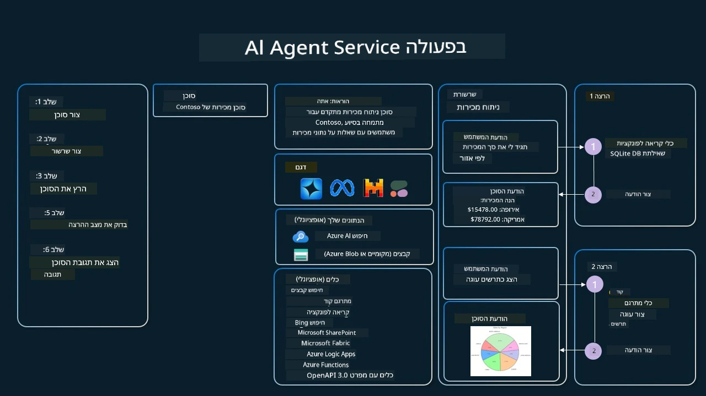

[](https://youtu.be/vieRiPRx-gI?si=cEZ8ApnT6Sus9rhn)

> _(לחץ על התמונה למעלה כדי לצפות בסרטון של השיעור הזה)_

# תבנית עיצוב לשימוש בכלים

כלים מעניינים משום שהם מאפשרים לסוכני בינה מלאכותית מגוון רחב יותר של יכולות. במקום שהסוכן יהיה מוגבל למערך מצומצם של פעולות שהוא יכול לבצע, על ידי הוספת כלי, הסוכן יכול כעת לבצע מגוון רחב של פעולות. בפרק זה נסקור את תבנית העיצוב לשימוש בכלים, שמסבירה כיצד סוכני AI יכולים להשתמש בכלים ספציפיים כדי להשיג את מטרותיהם.

## הקדמה

בשיעור זה אנו שואפים לענות על השאלות הבאות:

- מהי תבנית העיצוב לשימוש בכלים?
- לאילו מקרי שימוש ניתן להחיל אותה?
- מהם האלמנטים/אבני הבניין הנדרשים כדי לממש את תבנית העיצוב?
- אילו שיקולים מיוחדים יש להשתמש בתבנית העיצוב לשימוש בכלים כדי לבנות סוכני AI אמינים?

## יעדי הלמידה

לאחר השלמת שיעור זה, תוכל/י:

- להגדיר את תבנית העיצוב לשימוש בכלים ולציין את מטרתה.
- לזהות מקרי שימוש שבהם תבנית העיצוב לשימוש בכלים ישימה.
- להבין את האלמנטים המרכזיים הדרושים למימוש תבנית העיצוב.
- להכיר שיקולים להבטחת אמינות בסוכני AI המשתמשים בתבנית עיצוב זו.

## מהי תבנית העיצוב לשימוש בכלים?

"תבנית עיצוב לשימוש בכלים" מתמקדת במתן היכולת ל-LLM (מודלים שפתיים גדולים) לאינטראקציה עם כלים חיצוניים כדי להשיג מטרות ספציפיות. כלים הם קוד שניתן להריץ על ידי סוכן לביצוע פעולות. כלי יכול להיות פונקציה פשוטה כגון מחשבון, או קריאת API לשירות צד שלישי כגון בדיקת מחירי מניות או תחזית מזג אוויר. בהקשר של סוכני AI, כלים מעוצבים להיות מופעלים על ידי סוכנים בתגובה ל**קריאות פונקציה שנוצרו על ידי המודל**.

## לאילו מקרי שימוש ניתן להחיל אותה?

סוכני AI יכולים לנצל כלים כדי להשלים משימות מורכבות, לאחזר מידע או לקבל החלטות. תבנית העיצוב לשימוש בכלים משמשת לרוב בתרחישים הדורשים אינטראקציה דינמית עם מערכות חיצוניות, כגון מסדי נתונים, שירותי ווב או מפרשני קוד. יכולת זו שימושית למגוון מקרי שימוש שונים הכוללים:

- **אחזור מידע דינמי:** סוכנים יכולים לשאול APIs חיצוניים או מסדי נתונים כדי לקבל נתונים מעודכנים (למשל, שאילתת SQLite לניתוח נתונים, בדיקת מחירי מניות או מידע על מזג האוויר).
- **הרצת קוד ופרשנותו:** סוכנים יכולים להריץ קוד או סקריפטים כדי לפתור בעיות מתמטיות, ליצור דוחות או לבצע סימולציות.
- **אוטומציה של זרימות עבודה:** אוטומציה של משימות חזרתיות או רב-שלביות על ידי שילוב כלים כמו מתזמני משימות, שירותי דואר אלקטרוני או צינורות נתונים.
- **תמיכת לקוחות:** סוכנים יכולים לאינטראקציה עם מערכות CRM, פלטפורמות כרטוס או מאגרי ידע כדי לפתור שאילתות משתמשים.
- **יצירה ועריכת תוכן:** סוכנים יכולים לנצל כלים כמו בודקי דקדוק, מסכמי טקסט או מעריכי בטיחות תוכן כדי לסייע במשימות יצירת תוכן.

## מהם האלמנטים/אבני הבניין הנדרשים כדי לממש את תבנית העיצוב לשימוש בכלים?

אבני הבניין הללו מאפשרות לסוכן ה-AI לבצע מגוון רחב של משימות. נסקור את האלמנטים המרכזיים הנדרשים למימוש תבנית העיצוב לשימוש בכלים:

- **סכמות פונקציה/כלי:** הגדרות מפורטות של הכלים הזמינים, כולל שם הפונקציה, מטרתה, הפרמטרים הנדרשים והתפוקות הצפויות. סכמות אלו מאפשרות ל-LLM להבין אילו כלים זמינים ואיך לבנות בקשות תקפות.

- **לוגיקת ביצוע פונקציה:** שולטת כיצד ומתי הכלים מופעלים בהתבסס על כוונת המשתמש והקונטקסט של השיחה. זה עשוי לכלול מודולים מתכננים, מנגנוני ניתוב או זרימות מותנות שקובעות שימוש דינמי בכלים.

- **מערכת טיפול בהודעות:** רכיבים שמנהלים את זרימת השיחה בין קלטי המשתמש, תגובות ה-LLM, קריאות לכלים ותפוקות הכלים.

- **מסגרת אינטגרציה לכלים:** תשתית שמחברת את הסוכן לכלים שונים, בין אם הם פונקציות פשוטות או שירותים חיצוניים מורכבים.

- **טיפול בשגיאות ואימות:** מנגנונים לטיפול בכשלים בביצוע כלים, אימות פרמטרים וניהול תגובות בלתי צפויות.

- **ניהול מצב:** מעקב אחר קונטקסט השיחה, אינטראקציות קודמות עם כלים ונתונים מתמשכים כדי להבטיח עקביות לאורך אינטראקציות רב-סיבוביות.

לאחר מכן, נבחן את קריאת הפונקציות/כלים ביתר פירוט.
 
### קריאת פונקציה/כלי

קריאת פונקציה היא הדרך העיקרית שבה אנו מאפשרים למודלים שפתיים גדולים (LLMs) לאינטראקציה עם כלים. לעיתים קרובות תראו את המונחים 'פונקציה' ו'כלי' בשימוש לסירוגין מכיוון ש'פונקציות' (יחידות של קוד ניתנות לשימוש חוזר) הן ה'כלים' שהסוכנים משתמשים בהם לביצוע משימות. כדי שקוד של פונקציה יופעל, ה-LLM צריך להשוות את בקשת המשתמש לתיאור הפונקציות. לשם כך נשלחת ל-LLM סכימה המכילה את תיאורי כל הפונקציות הזמינות. ה-LLM בוחר אז את הפונקציה המתאימה ביותר למשימה ומחזיר את שמה ואת הארגומנטים. הפונקציה הנבחרת מופעלת, התשובה שלה נשלחת חזרה ל-LLM, והוא משתמש במידע כדי להגיב לבקשת המשתמש.

כדי שמפתחים יוכלו לממש קריאת פונקציות עבור סוכנים, תזדקקו ל:

1. מודל LLM שתומך בקריאת פונקציות
2. סכימה המכילה תיאורי פונקציות
3. הקוד עבור כל פונקציה שמתוארת

נשתמש בדוגמה של קבלת הזמן הנוכחי בעיר כדי להמחיש:

1. **אתחול LLM שתומך בקריאת פונקציות:**

    לא כל המודלים תומכים בקריאת פונקציות, לכן חשוב לבדוק שה-LLM שבו אתה משתמש תומך בכך.     <a href="https://learn.microsoft.com/azure/ai-services/openai/how-to/function-calling" target="_blank">Azure OpenAI</a> תומך בקריאת פונקציות. נוכל להתחיל על ידי יצירת הלקוח של Azure OpenAI. 

    ```python
    # אתחול לקוח Azure OpenAI
    client = AzureOpenAI(
        azure_endpoint = os.getenv("AZURE_AI_PROJECT_ENDPOINT"), 
        api_key=os.getenv("AZURE_OPENAI_API_KEY"),  
        api_version="2024-05-01-preview"
    )
    ```

1. **יצירת סכמת פונקציה:**

    לאחר מכן נגדיר סכמת JSON הכוללת את שם הפונקציה, תיאור מה שהפונקציה עושה, ושמות ותיאורים של פרמטרי הפונקציה.
    לאחר מכן נעביר סכימה זו ללקוח שנוצר קודם, יחד עם בקשת המשתמש למצוא את השעה בסן פרנסיסקו. מה שחשוב לציין הוא שקריאת **כלי** היא מה שמוחזרת, **ולא** התשובה הסופית לשאלה. כפי שנאמר קודם, ה-LLM מחזיר את שם הפונקציה שהוא בחר למשימה ואת הארגומנטים שיועברו לה.

    ```python
    # תיאור הפונקציה לקריאה על ידי המודל
    tools = [
        {
            "type": "function",
            "function": {
                "name": "get_current_time",
                "description": "Get the current time in a given location",
                "parameters": {
                    "type": "object",
                    "properties": {
                        "location": {
                            "type": "string",
                            "description": "The city name, e.g. San Francisco",
                        },
                    },
                    "required": ["location"],
                },
            }
        }
    ]
    ```
   
    ```python
  
    # הודעת המשתמש הראשונית
    messages = [{"role": "user", "content": "What's the current time in San Francisco"}] 
  
    # קריאת ה-API הראשונה: בקש מהמודל להשתמש בפונקציה
      response = client.chat.completions.create(
          model=deployment_name,
          messages=messages,
          tools=tools,
          tool_choice="auto",
      )
  
      # עבד את תגובת המודל
      response_message = response.choices[0].message
      messages.append(response_message)
  
      print("Model's response:")  

      print(response_message)
  
    ```

    ```bash
    Model's response:
    ChatCompletionMessage(content=None, role='assistant', function_call=None, tool_calls=[ChatCompletionMessageToolCall(id='call_pOsKdUlqvdyttYB67MOj434b', function=Function(arguments='{"location":"San Francisco"}', name='get_current_time'), type='function')])
    ```
  
1. **קוד הפונקציה הנדרש לביצוע המשימה:**

    עכשיו שה-LLM בחר איזו פונקציה יש להריץ, עלינו לממש ולהריץ את הקוד שמבצע את המשימה.
    נוכל לממש את הקוד לקבלת הזמן הנוכחי בפייתון. נצטרך גם לכתוב את הקוד לחילוץ השם והארגומנטים מתוך ה-response_message כדי לקבל את התוצאה הסופית.

    ```python
      def get_current_time(location):
        """Get the current time for a given location"""
        print(f"get_current_time called with location: {location}")  
        location_lower = location.lower()
        
        for key, timezone in TIMEZONE_DATA.items():
            if key in location_lower:
                print(f"Timezone found for {key}")  
                current_time = datetime.now(ZoneInfo(timezone)).strftime("%I:%M %p")
                return json.dumps({
                    "location": location,
                    "current_time": current_time
                })
      
        print(f"No timezone data found for {location_lower}")  
        return json.dumps({"location": location, "current_time": "unknown"})
    ```

     ```python
     # טפל בקריאות לפונקציות
      if response_message.tool_calls:
          for tool_call in response_message.tool_calls:
              if tool_call.function.name == "get_current_time":
     
                  function_args = json.loads(tool_call.function.arguments)
     
                  time_response = get_current_time(
                      location=function_args.get("location")
                  )
     
                  messages.append({
                      "tool_call_id": tool_call.id,
                      "role": "tool",
                      "name": "get_current_time",
                      "content": time_response,
                  })
      else:
          print("No tool calls were made by the model.")  
  
      # קריאת API שנייה: קבל את התגובה הסופית מהמודל
      final_response = client.chat.completions.create(
          model=deployment_name,
          messages=messages,
      )
  
      return final_response.choices[0].message.content
     ```

     ```bash
      get_current_time called with location: San Francisco
      Timezone found for san francisco
      The current time in San Francisco is 09:24 AM.
     ```

קריאת פונקציות נמצאת בלב רוב, אם לא כל, תבניות השימוש בכלים של סוכנים, אך מימוש מאפס יכול להיות מאתגר לעתים.
כפי שלמדנו ב[שיעור 2](../../../02-explore-agentic-frameworks) מסגרות סוכניות מספקות לנו אבני בניין מוכנות מראש למימוש שימוש בכלים.
 
## דוגמאות לשימוש בכלים עם מסגרות סוכניות

להלן כמה דוגמאות לאופן שבו ניתן לממש את תבנית העיצוב לשימוש בכלים באמצעות מסגרות סוכניות שונות:

### מסגרת הסוכן של Microsoft

<a href="https://learn.microsoft.com/azure/ai-services/agents/overview" target="_blank">Microsoft Agent Framework</a> היא מסגרת AI בקוד פתוח לבניית סוכני AI. היא מפשטת את תהליך קריאת הפונקציות על ידי כך שהיא מאפשרת להגדיר כלים כפונקציות פייתון עם הדקורטור `@tool`. המסגרת מטפלת בתקשורת הלוך ושוב בין המודל וקודך. היא גם מספקת גישה לכלים מוכנים מראש כמו חיפוש קבצים ומפרש קוד דרך ה-`AzureAIProjectAgentProvider`.

התרשים הבא ממחיש את תהליך קריאת הפונקציות עם מסגרת הסוכן של Microsoft:



ב-Microsoft Agent Framework, כלים מוגדרים כפונקציות עם דקורטור. נוכל להמיר את הפונקציה `get_current_time` שראינו קודם לכלי על ידי שימוש בדקורטור `@tool`. המסגרת תסיראלט אוטומטית את הפונקציה ואת הפרמטרים שלה, ותיצור את הסכימה לשליחה ל-LLM.

```python
from agent_framework import tool
from agent_framework.azure import AzureAIProjectAgentProvider
from azure.identity import AzureCliCredential

@tool
def get_current_time(location: str) -> str:
    """Get the current time for a given location"""
    ...

# צור את הלקוח
provider = AzureAIProjectAgentProvider(credential=AzureCliCredential())

# צור סוכן והרץ אותו באמצעות הכלי
agent = await provider.create_agent(name="TimeAgent", instructions="Use available tools to answer questions.", tools=get_current_time)
response = await agent.run("What time is it?")
```
  
### שירות סוכני Azure AI

<a href="https://learn.microsoft.com/azure/ai-services/agents/overview" target="_blank">שירות סוכני Azure AI</a> הוא מסגרת סוכנים חדשה יותר שנועדה להעצים מפתחים לבנות, לפרוס ולהגדיל סוכני AI איכותיים והרחיבים באופן מאובטח מבלי הצורך לנהל את משאבי המחשב והאחסון התשתיתיים. הוא שימושי במיוחד ליישומי ארגונים מכיוון שמדובר בשירות מנוהל לחלוטין עם אבטחה ברמת תאגיד.

בהשוואה לפיתוח ישירות מול API של LLM, שירות סוכני Azure AI מספק מספר יתרונות, כולל:

- קריאה אוטומטית לכלים – אין צורך לפרסר קריאת כלי, להפעיל את הכלי ולטפל בתשובה; כל זה נעשה עכשיו בצד השרת
- ניהול מאובטח של נתונים – במקום לנהל את מצב השיחה בעצמך, ניתן להסתמך על threads לאחסון כל המידע הדרוש
- כלים מוכנים לשימוש – כלים שניתן להשתמש בהם לאינטראקציה עם מקורות הנתונים שלך, כגון Bing, Azure AI Search ו-Azure Functions.

הכלים הזמינים בשירות סוכני Azure AI יכולים להתחלק לשתי קטגוריות:

1. כלים ידע:
    - <a href="https://learn.microsoft.com/azure/ai-services/agents/how-to/tools/bing-grounding?tabs=python&pivots=overview" target="_blank">עיגון עם חיפוש Bing</a>
    - <a href="https://learn.microsoft.com/azure/ai-services/agents/how-to/tools/file-search?tabs=python&pivots=overview" target="_blank">חיפוש קבצים</a>
    - <a href="https://learn.microsoft.com/azure/ai-services/agents/how-to/tools/azure-ai-search?tabs=azurecli%2Cpython&pivots=overview-azure-ai-search" target="_blank">Azure AI Search</a>

2. כלים פעולה:
    - <a href="https://learn.microsoft.com/azure/ai-services/agents/how-to/tools/function-calling?tabs=python&pivots=overview" target="_blank">קריאת פונקציות</a>
    - <a href="https://learn.microsoft.com/azure/ai-services/agents/how-to/tools/code-interpreter?tabs=python&pivots=overview" target="_blank">מפרש קוד</a>
    - <a href="https://learn.microsoft.com/azure/ai-services/agents/how-to/tools/openapi-spec?tabs=python&pivots=overview" target="_blank">כלים המוגדרים באמצעות OpenAPI</a>
    - <a href="https://learn.microsoft.com/azure/ai-services/agents/how-to/tools/azure-functions?pivots=overview" target="_blank">Azure Functions</a>

שירות הסוכנים מאפשר לנו להשתמש בכלים אלה יחד כ-`toolset`. הוא גם משתמש ב-`threads` שעוקבים אחרי היסטוריית ההודעות משיחה מסוימת.

דמיין/י שאתה סוכן מכירות בחברה בשם Contoso. אתה רוצה לפתח סוכן שיח שיכול לענות על שאלות לגבי נתוני המכירות שלך.

התמונה הבאה ממחישה כיצד תוכל להשתמש בשירות סוכני Azure AI כדי לנתח את נתוני המכירות שלך:



כדי להשתמש בכלים אלה עם השירות נוכל ליצור client ולהגדיר כלי או toolset. ליישום מעשי נוכל להשתמש בקוד פייתון הבא. ה-LLM יוכל להסתכל על ה-toolset ולהחליט האם להשתמש בפונקציה שיצר המשתמש, `fetch_sales_data_using_sqlite_query`, או במפרש הקוד המובנה בהתאם לבקשת המשתמש.

```python 
import os
from azure.ai.projects import AIProjectClient
from azure.identity import DefaultAzureCredential
from fetch_sales_data_functions import fetch_sales_data_using_sqlite_query # הפונקציה fetch_sales_data_using_sqlite_query שניתן למצוא בקובץ fetch_sales_data_functions.py.
from azure.ai.projects.models import ToolSet, FunctionTool, CodeInterpreterTool

project_client = AIProjectClient.from_connection_string(
    credential=DefaultAzureCredential(),
    conn_str=os.environ["PROJECT_CONNECTION_STRING"],
)

# אתחול ערכת כלים
toolset = ToolSet()

# אתחול סוכן הקריאה לפונקציות עם הפונקציה fetch_sales_data_using_sqlite_query והוספתו לערכת הכלים
fetch_data_function = FunctionTool(fetch_sales_data_using_sqlite_query)
toolset.add(fetch_data_function)

# אתחול כלי מפרש קוד והוספתו לערכת הכלים.
code_interpreter = code_interpreter = CodeInterpreterTool()
toolset.add(code_interpreter)

agent = project_client.agents.create_agent(
    model="gpt-4o-mini", name="my-agent", instructions="You are helpful agent", 
    toolset=toolset
)
```

## אילו שיקולים מיוחדים קיימים לשימוש בתבנית העיצוב לשימוש בכלים לבניית סוכני AI אמינים?

חשש נפוץ ביחס ל-SQL שנוצר באופן דינמי על ידי LLMs הוא אבטחה, בפרט הסיכון של SQL Injection או פעולות זדוניות, כגון מחיקה או שינוי במסד הנתונים. בעוד שחששות אלה מוצדקים, ניתן למזערם בצורה יעילה על ידי קונפיגורציה נכונה של הרשאות גישה למסד הנתונים. עבור רוב מסדי הנתונים זה כרוך בקביעת הגדרות קריאה בלבד. עבור שירותי מסדי נתונים כמו PostgreSQL או Azure SQL, יש להקצות לאפליקציה תפקיד קריאה בלבד (SELECT).

הרצת האפליקציה בסביבה מאובטחת משפרת עוד יותר את ההגנה. בתרחישים ארגוניים, נתונים בדרך כלל יוצאים ומועברים ממערכות תפעוליות למסד נתונים לקריאה בלבד או למחסן נתונים עם סכימה ידידותית למשתמש. גישה זו מבטיחה שהנתונים מאובטחים, מותאמים לביצועים ולנגישות, ושהאפליקציה בעלת גישה מוגבלת לקריאה בלבד.

## דוגמאות קוד

- Python: [מסגרת סוכן](./code_samples/04-python-agent-framework.ipynb)
- .NET: [מסגרת סוכן](./code_samples/04-dotnet-agent-framework.md)

## יש לך שאלות נוספות לגבי תבניות העיצוב לשימוש בכלים?

הצטרף/י ל-[Microsoft Foundry Discord](https://aka.ms/ai-agents/discord) כדי להיפגש עם לומדים אחרים, להשתתף בשעות המשרד ולקבל תשובות על שאלותיך בנושא סוכני AI.

## משאבים נוספים

- <a href="https://microsoft.github.io/build-your-first-agent-with-azure-ai-agent-service-workshop/" target="_blank">סדנת Azure AI Agents Service</a>
- <a href="https://github.com/Azure-Samples/contoso-creative-writer/tree/main/docs/workshop" target="_blank">סדנת Contoso Creative Writer מולטי-סוכנים</a>
- <a href="https://learn.microsoft.com/azure/ai-services/agents/overview" target="_blank">סקירת Microsoft Agent Framework</a>

## שיעור קודם

[הבנת תבניות עיצוב סוכניות](../03-agentic-design-patterns/README.md)

## השיעור הבא
[אייג'נטיק RAG](../05-agentic-rag/README.md)

---

<!-- CO-OP TRANSLATOR DISCLAIMER START -->
הצהרת אי-אחריות:
מסמך זה תורגם באמצעות שירות תרגום בינה מלאכותית Co‑op Translator (https://github.com/Azure/co-op-translator). למרות שאנו שואפים לדיוק, יש לשים לב שתרגומים אוטומטיים עלולים להכיל שגיאות או אי-דיוקים. יש להחשיב את המסמך המקורי בשפתו כמקור סמכותי. עבור מידע קריטי, מומלץ להיעזר בתרגום מקצועי על ידי מתרגם אנושי. איננו אחראים לכל אי-הבנות או לפרשנויות שגויות הנובעות משימוש בתרגום זה.
<!-- CO-OP TRANSLATOR DISCLAIMER END -->