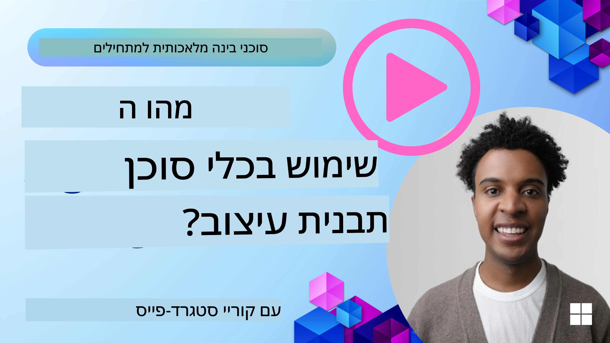
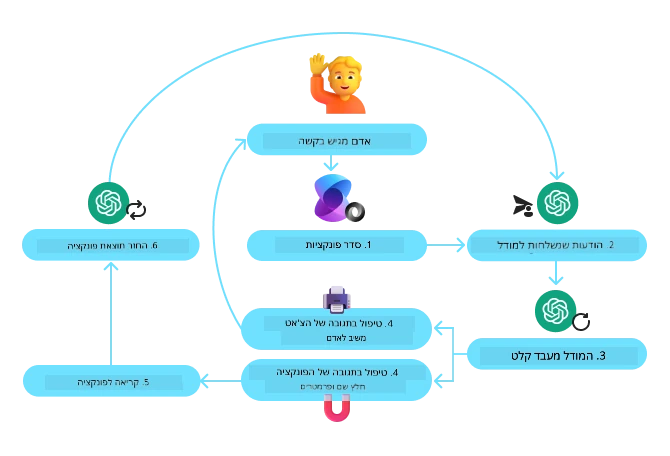
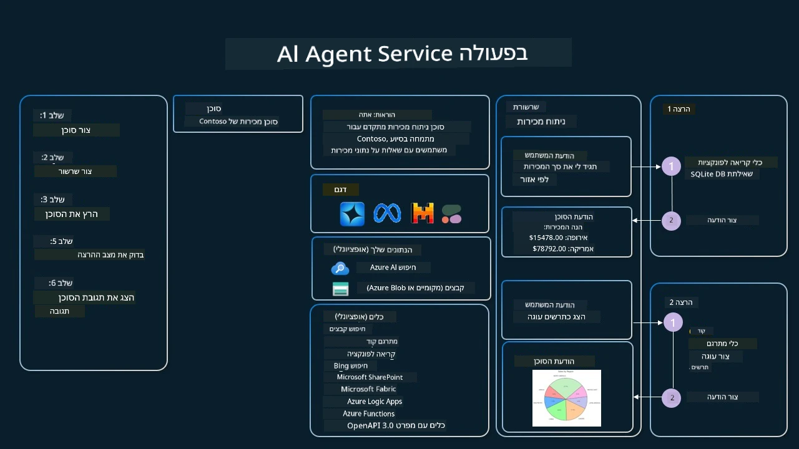

[](https://youtu.be/vieRiPRx-gI?si=cEZ8ApnT6Sus9rhn)

> _(לחצו על התמונה למעלה לצפייה בסרטון של השיעור)_

# תבנית עיצוב שימוש בכלים

כלים מעניינים כי הם מאפשרים לסוכני AI להחזיק טווח רחב יותר של יכולות. במקום שהסוכן יכיל סט מוגבל של פעולות שהוא יכול לבצע, על ידי הוספת כלי, הסוכן יכול כעת לבצע מגוון רחב של פעולות. בפרק זה נבדוק את תבנית העיצוב של שימוש בכלים, המתארת כיצד סוכני AI יכולים להשתמש בכלים ספציפיים להשגת מטרותיהם.

## מבוא

בשיעור זה, אנו שואפים לענות על השאלות הבאות:

- מהי תבנית העיצוב של שימוש בכלים?
- מהן מקרי השימוש אליהם ניתן ליישם אותה?
- מהם האלמנטים/אבני הבניין הנדרשים להטמעת תבנית העיצוב?
- מהן ההתייחסויות המיוחדות לשימוש בתבנית העיצוב של שימוש בכלים לבניית סוכני AI אמינים?

## מטרות הלמידה

לאחר השלמת השיעור, תוכל:

- להגדיר את תבנית העיצוב של שימוש בכלים ואת מטרתה.
- לזהות מקרי שימוש שבהם תבנית העיצוב של שימוש בכלים ישימה.
- להבין את האלמנטים המרכזיים הדרושים ליישום תבנית העיצוב.
- להכיר את ההתייחסויות להבטחת אמינות בסוכני AI המשתמשים בתבנית עיצוב זו.

## מהי תבנית העיצוב של שימוש בכלים?

תבנית העיצוב **שימוש בכלים** מתמקדת במתן ל-LLMs את היכולת לקיים אינטראקציה עם כלים חיצוניים להשגת מטרות ספציפיות. כלים הם קוד שניתן להפעילו על ידי סוכן לביצוע פעולות. כלי יכול להיות פונקציה פשוטה כמו מחשבון, או קריאת API לשירות צד שלישי כגון בדיקת מחיר מניות או תחזית מזג אוויר. בהקשר של סוכני AI, כלים מתוכננים להיות מופעלים על ידי סוכנים בתגובה ל**קריאות פונקציה שנוצרו על ידי המודל**.

## לאילו מקרי שימוש ניתן ליישם זאת?

סוכני AI יכולים לנצל כלים לביצוע משימות מורכבות, הבאת מידע או קבלת החלטות. תבנית העיצוב של שימוש בכלים משמשת לעיתים קרובות בתרחישים הדורשים אינטראקציה דינמית עם מערכות חיצוניות, כגון מסדי נתונים, שירותי רשת או מתרגמים לקוד. יכולת זו שימושית למספר מקרי שימוש שונים כולל:

- **אחזור מידע דינמי:** סוכנים יכולים לשאול APIs חיצוניים או מסדי נתונים כדי להביא מידע עדכני (לדוגמה, שאילתא למסד SQLite לניתוח נתונים, הבאת מחירי מניות או מידע על מזג אוויר).
- **ריצת קוד ופרשנות:** סוכנים יכולים להריץ קוד או סקריפטים כדי לפתור בעיות מתמטיות, ליצור דוחות או לבצע סימולציות.
- **אוטומציה של זרימות עבודה:** אוטומציה של תהליכים חוזרים או רב-שלביים על ידי אינטגרציה של כלים כמו מתזמנים, שירותי דוא"ל או צינורות נתונים.
- **תמיכה בלקוחות:** סוכנים יכולים לקיים אינטראקציה עם מערכות CRM, פלטפורמות כרטיסים או בסיסי ידע כדי לפתור שאלות משתמשים.
- **יצירה ועריכת תוכן:** סוכנים יכולים לנצל כלים כמו מבקרי דקדוק, מסכמים או מעריכי בטיחות תוכן לסיוע במשימות יצירת תוכן.

## מהם האלמנטים/אבני הבניין הדרושים ליישום תבנית העיצוב של שימוש בכלים?

אבני הבניין הללו מאפשרות לסוכן ה-AI לבצע מגוון רחב של משימות. נבחן את האלמנטים המרכזיים הדרושים ליישום תבנית העיצוב של שימוש בכלים:

- **סכמות לפונקציות/כלים:** הגדרות מפורטות של הכלים הזמינים, כולל שם הפונקציה, מטרתה, הפרמטרים הנדרשים והפלט הצפוי. סכמות אלו מאפשרות ל-LLM להבין אילו כלים זמינים וכיצד לבנות בקשות חוקיות.

- **לוגיקת ביצוע פונקציה:** שקובעת כיצד ומתי הכלים מופעלים בהתאם לכוונת המשתמש והקשר השיחה. זה יכול לכלול מודולים של מתכנן, מנגנוני ניתוב או זרמי תנאי שקובעים שימוש בכלי באופן דינמי.

- **מערכת טיפול בהודעות:** רכיבים המנהלים את הזרימה השיחית בין קלט המשתמשים, תגובות ה-LLM, קריאות לכלים ופלט הכלים.

- **מסגרת אינטגרציית כלים:** תשתית שמחברת את הסוכן לכלים שונים, בין אם פונקציות פשוטות או שירותים חיצוניים מורכבים.

- **טיפול בשגיאות ואימות:** מנגנונים לטיפול בכשלים בביצוע הכלים, אימות פרמטרים וניהול תגובות בלתי צפויות.

- **ניהול מצב:** עוקב אחר הקשר השיחה, אינטראקציות כלים קודמות ונתונים מתמשכים כדי להבטיח עקביות בחוויות רב-סיבוביות.

כעת, נבחן את קריאת הפונקציות/כלים ביתר פירוט.
 
### קריאת פונקציה/כלי

קריאת פונקציה היא הדרך המרכזית שאנו מאפשרים למודלים שפתיים גדולים (LLMs) לקיים אינטראקציה עם כלים. תראה לעיתים קרובות 'פונקציה' ו'כלי' בשימוש חלופי כי 'פונקציות' (בלוקים של קוד רב-פעמי) הן 'הכלים' שסוכנים משתמשים בהם לבצע משימות. כדי שקריאת הקוד של פונקציה תתבצע, ה-LLM חייב להשוות את בקשת המשתמש מול תיאור הפונקציה. לשם כך שולחים ל-LLM סכימה הכוללת תיאורים של כל הפונקציות הזמינות. ה-LLM בוחר אז את הפונקציה המתאימה ביותר למשימה ומחזיר את שמה וארגומנטיה. הפונקציה שנבחרה מופעלת, תגובתה נשלחת חזרה ל-LLM, שמשתמש במידע לענות על בקשת המשתמש.

למפתחים שיבצעו קריאת פונקציה לסוכנים, תצטרך:

1. מודל LLM שתומך בקריאת פונקציה
2. סכימה עם תיאורי פונקציות
3. קוד לכל פונקציה שתוארה

נשתמש בדוגמה של קבלת השעה הנוכחית בעיר להמחשה:

1. **אתחול LLM שתומך בקריאת פונקציה:**

    לא כל הדגמים תומכים בקריאת פונקציות, לכן חשוב לבדוק שה-LLM שבו אתה משתמש עושה זאת. <a href="https://learn.microsoft.com/azure/ai-services/openai/how-to/function-calling" target="_blank">Azure OpenAI</a> תומך בקריאת פונקציות. נתחיל באתחול לקוח OpenAI אל קצה תגובות Azure OpenAI **Responses API** (נכון ל-`/openai/v1/` היציב — לא נדרש `api_version`).

    ```python
    # אתחול לקוח OpenAI עבור Azure OpenAI (API תגובות, נקודת קצה v1)
    client = OpenAI(
        base_url=f"{os.environ['AZURE_OPENAI_ENDPOINT'].rstrip('/')}/openai/v1/",
        api_key=os.environ["AZURE_OPENAI_API_KEY"],
    )
    deployment_name = os.environ["AZURE_OPENAI_DEPLOYMENT"]
    ```

1. **יצירת סכמת פונקציה**:

    לאחר מכן נגדיר סכמת JSON הכוללת את שם הפונקציה, תיאור מה הפונקציה מבצעת, ושמות ותיאורי הפרמטרים של הפונקציה.
    לאחר מכן נעביר סכימה זו ללקוח שנוצר קודם, יחד עם בקשת המשתמש למצוא את הזמן בסן פרנסיסקו. חשוב לציין שמה שמוחזר הוא **קריאת כלי**, **ולא** התשובה הסופית לשאלה. כפי שהוזכר קודם, ה-LLM מחזיר את שם הפונקציה שנבחרה למשימה ואת הארגלים שיועברו אליה.

    ```python
    # תיאור הפונקציה עבור המודל לקריאה (פורמט כלי Responses API שטוח)
    tools = [
        {
            "type": "function",
            "name": "get_current_time",
            "description": "Get the current time in a given location",
            "parameters": {
                "type": "object",
                "properties": {
                    "location": {
                        "type": "string",
                        "description": "The city name, e.g. San Francisco",
                    },
                },
                "required": ["location"],
            },
        }
    ]
    ```
   
    ```python
  
    # הודעת משתמש ראשונית
    messages = [{"role": "user", "content": "What's the current time in San Francisco"}]

    # קריאת API ראשונה: בקש מהמודל להשתמש בפונקציה
    response = client.responses.create(
        model=deployment_name,
        input=messages,
        tools=tools,
        tool_choice="auto",
        store=False,
    )

    # ממשק ה-API של Responses מחזיר קריאות לכלים כפריטי function_call ב-response.output.
    # הוסף אותם לשיחה כך שלמודל יהיה הקשר מלא בסיבוב הבא.
    messages += response.output

    print("Model's response:")
    print(response.output)
  
    ```

    ```bash
    Model's response:
    [ResponseFunctionToolCall(arguments='{"location":"San Francisco"}', call_id='call_pOsKdUlqvdyttYB67MOj434b', name='get_current_time', type='function_call')]
    ```
  
1. **קוד הפונקציה הדרוש לביצוע המשימה:**

    כעת כשה-LLM בחר איזו פונקציה יש להפעיל, יש ליישם ולהריץ את הקוד שמבצע את המשימה.
    נוכל ליישם קוד לקבלת השעה הנוכחית בפייתון. גם נצטרך לכתוב קוד לחלץ את השם והארגומנטים מהתגובה כדי לקבל את התוצאה הסופית.

    ```python
      def get_current_time(location):
        """Get the current time for a given location"""
        print(f"get_current_time called with location: {location}")  
        location_lower = location.lower()
        
        for key, timezone in TIMEZONE_DATA.items():
            if key in location_lower:
                print(f"Timezone found for {key}")  
                current_time = datetime.now(ZoneInfo(timezone)).strftime("%I:%M %p")
                return json.dumps({
                    "location": location,
                    "current_time": current_time
                })
      
        print(f"No timezone data found for {location_lower}")  
        return json.dumps({"location": location, "current_time": "unknown"})
    ```

     ```python
    # טיפול בקריאות פונקציה
    tool_calls = [item for item in response.output if item.type == "function_call"]
    if tool_calls:
        for tool_call in tool_calls:
            if tool_call.name == "get_current_time":

                function_args = json.loads(tool_call.arguments)

                time_response = get_current_time(
                    location=function_args.get("location")
                )

                # החזר את תוצאת הכלי כפריט function_call_output
                messages.append({
                    "type": "function_call_output",
                    "call_id": tool_call.call_id,
                    "output": time_response,
                })
    else:
        print("No tool calls were made by the model.")

    # קריאת API שנייה: קבלת התגובה הסופית מהמודל
    final_response = client.responses.create(
        model=deployment_name,
        input=messages,
        tools=tools,
        store=False,
    )

    return final_response.output_text
     ```

     ```bash
      get_current_time called with location: San Francisco
      Timezone found for san francisco
      The current time in San Francisco is 09:24 AM.
     ```

קריאת פונקציה היא לב רוב התבניות לשימוש בכלים בסוכנים, אך יישומה מההתחלה יכול להיות מאתגר לפעמים.
כפי שלמדנו ב-[שיעור 2](../../../02-explore-agentic-frameworks), מסגרות סוכן מספקות לנו אבני בניין מוכנות מראש ליישום שימוש בכלים.
 
## דוגמאות לשימוש בכלים עם מסגרות סוכנים

הנה כמה דוגמאות כיצד ניתן ליישם את תבנית העיצוב של שימוש בכלים באמצעות מסגרות סוכנים שונות:

### Microsoft Agent Framework

<a href="https://learn.microsoft.com/azure/ai-services/agents/overview" target="_blank">Microsoft Agent Framework</a> היא מסגרת AI קוד פתוח לבניית סוכני AI. היא מפשטת את תהליך קריאת הפונקציות באפשרותך להגדיר כלים כפונקציות פייתון עם הדקורטור `@tool`. המסגרת מנהלת את התקשורת בין המודל לבין הקוד שלך. היא גם מספקת גישה לכלים מובנים מראש כגון חיפוש קבצים ומתרגם קוד דרך `FoundryChatClient`.

הדיאגרמה הבאה ממחישה את תהליך קריאת הפונקציה במסגרת Microsoft Agent Framework:



במסגרת Microsoft Agent Framework, כלים מוגדרים כפונקציות עם דקורטור. נוכל להמיר את הפונקציה `get_current_time` שראינו קודם כ'כלי' באמצעות הדקורטור `@tool`. המסגרת תסדר אוטומטית את הפונקציה ופרמטריה, ותיצור את הסכימה שתישלח ל-LLM.

```python
import os
from agent_framework import tool
from agent_framework.foundry import FoundryChatClient
from azure.identity import AzureCliCredential

@tool(approval_mode="never_require")
def get_current_time(location: str) -> str:
    """Get the current time for a given location"""
    ...

# צור את הלקוח
provider = FoundryChatClient(
    project_endpoint=os.environ["AZURE_AI_PROJECT_ENDPOINT"],
    model=os.environ["AZURE_AI_MODEL_DEPLOYMENT_NAME"],
    credential=AzureCliCredential(),
)

# צור סוכן והרץ עם הכלי
agent = provider.as_agent(name="TimeAgent", instructions="Use available tools to answer questions.", tools=get_current_time)
response = await agent.run("What time is it?")
```
  
### Microsoft Foundry Agent Service

<a href="https://learn.microsoft.com/azure/ai-services/agents/overview" target="_blank">Microsoft Foundry Agent Service</a> היא מסגרת סוכנים חדשה שמטרתה לספק למפתחים כלים לשם בנייה, פריסה והרחבה מאובטחות של סוכני AI איכותיים, מבלי צורך לנהל את משאבי המחשב ואחסון. היא שימושית במיוחד ליישומים ארגוניים כיוון שהיא שירות מנוהל מלא עם אבטחת רמת ארגון.

בהשוואה לפיתוח ישירות עם API של LLM, Microsoft Foundry Agent Service מציעה יתרונות כגון:

- קריאת כלי אוטומטית – אין צורך לפרש קריאת כלי, להפעיל את הכלי, ולנהל את התגובה; כל זה נעשה כעת בצד השרת
- ניהול מידע מאובטח – במקום לנהל את מצב השיחה בעצמך, ניתן להסתמך על תהליכים לשמירת כל המידע הדרוש
- כלים מוכנים לשימוש – כלים לזמינים לאינטראקציה עם מקורות הנתונים שלך, כגון Bing, Azure AI Search ו-Azure Functions.

הכלים הזמינים ב-Microsoft Foundry Agent Service מחולקים לשתי קטגוריות:

1. כלים ידע:
    - <a href="https://learn.microsoft.com/azure/ai-services/agents/how-to/tools/bing-grounding?tabs=python&pivots=overview" target="_blank">עיגון עם Bing Search</a>
    - <a href="https://learn.microsoft.com/azure/ai-services/agents/how-to/tools/file-search?tabs=python&pivots=overview" target="_blank">חיפוש קבצים</a>
    - <a href="https://learn.microsoft.com/azure/ai-services/agents/how-to/tools/azure-ai-search?tabs=azurecli%2Cpython&pivots=overview-azure-ai-search" target="_blank">Azure AI Search</a>

2. כלים לפעולה:
    - <a href="https://learn.microsoft.com/azure/ai-services/agents/how-to/tools/function-calling?tabs=python&pivots=overview" target="_blank">קריאת פונקציה</a>
    - <a href="https://learn.microsoft.com/azure/ai-services/agents/how-to/tools/code-interpreter?tabs=python&pivots=overview" target="_blank">מתרגם קוד</a>
    - <a href="https://learn.microsoft.com/azure/ai-services/agents/how-to/tools/openapi-spec?tabs=python&pivots=overview" target="_blank">כלים מוגדרים על ידי OpenAPI</a>
    - <a href="https://learn.microsoft.com/azure/ai-services/agents/how-to/tools/azure-functions?pivots=overview" target="_blank">Azure Functions</a>

שירות הסוכנים מאפשר לנו להשתמש בכלים אלה ביחד כ'מערכת כלים' (`toolset`). הוא גם מנצל `תהליכים` ששומרים על היסטוריית ההודעות משיחה מסוימת.

דמיין שאתה סוכן מכירות בחברה בשם Contoso. ברצונך לפתח סוכן שיח שיכול לענות על שאלות על נתוני המכירות שלך.

התמונה הבאה ממחישה כיצד תוכל להשתמש ב-Microsoft Foundry Agent Service כדי לנתח את נתוני המכירות:



לשימוש בכל אחד מהכלים עם השירות ניתן ליצור לקוח ולהגדיר כלי או מערכת כלים. ליישום מעשי נוכל להשתמש בקוד פייתון הבא. ה-LLM יוכל להסתכל על מערכת הכלים ולהחליט אם להשתמש בפונקציה שיצר המשתמש, `fetch_sales_data_using_sqlite_query`, או במתרגם הקוד המובנה, בהתאם לבקשת המשתמש.

```python 
import os
from azure.ai.projects import AIProjectClient
from azure.identity import DefaultAzureCredential
from fetch_sales_data_functions import fetch_sales_data_using_sqlite_query # פונקציית fetch_sales_data_using_sqlite_query שנמצאת בקובץ fetch_sales_data_functions.py.
from azure.ai.projects.models import ToolSet, FunctionTool, CodeInterpreterTool

project_client = AIProjectClient.from_connection_string(
    credential=DefaultAzureCredential(),
    conn_str=os.environ["PROJECT_CONNECTION_STRING"],
)

# אתחול אוסף הכלים
toolset = ToolSet()

# אתחול סוכן קריאת פונקציות עם הפונקציה fetch_sales_data_using_sqlite_query והוספתה לאוסף הכלים
fetch_data_function = FunctionTool(fetch_sales_data_using_sqlite_query)
toolset.add(fetch_data_function)

# אתחול כלי מפרש הקוד והוספתו לאוסף הכלים.
code_interpreter = CodeInterpreterTool()toolset.add(code_interpreter)

agent = project_client.agents.create_agent(
    model="gpt-4o-mini", name="my-agent", instructions="You are helpful agent", 
    toolset=toolset
)
```

## מהן ההתייחסויות המיוחדות לשימוש בתבנית העיצוב של שימוש בכלים לבניית סוכני AI אמינים?

דאגה נפוצה לגבי SQL שנוצר דינמית על ידי LLMs היא אבטחה, במיוחד הסיכון של SQL Injection או פעולות זדוניות, כמו DROP או פגיעה במסד הנתונים. ההסתייגויות הללו אמנם צודקות, אך ניתן להתגונן כראוי על ידי הגדרת הרשאות גישה נכונות למסד הנתונים. ברוב המקרים יש להגדיר את מסד הנתונים כקריאה בלבד. עבור שירותי מסד נתונים כמו PostgreSQL או Azure SQL, יש להעניק לאפליקציה תפקיד קריאה בלבד (SELECT).

הפעלת האפליקציה בסביבה מאובטחת מחזקת עוד יותר את ההגנה. בתרחישים ארגוניים, נתונים בדרך כלל נשלפים ומעובדים מתוך מערכות תפעוליות למסד נתונים או דאטה ווארהאוס לקריאה בלבד עם סכימה נוחה למשתמש. גישה זו מבטיחה שהנתונים מוגנים, מותאמים לביצועים ונגישים, וכי לאפליקציה יש גישה מוגבלת לקריאה בלבד.

## דוגמאות קוד

- פייתון: [Agent Framework](./code_samples/04-python-agent-framework.ipynb)
- .NET: [Agent Framework](./code_samples/04-dotnet-agent-framework.md)

## יש לך שאלות נוספות לגבי תבניות העיצוב לשימוש בכלים?

הצטרף ל-[Microsoft Foundry Discord](https://discord.com/invite/ATgtXmAS5D) לפגוש לומדים אחרים, להשתתף בשעות פתוחות ולקבל תשובות לשאלותיך בנוגע לסוכני AI.

## משאבים נוספים

- <a href="https://microsoft.github.io/build-your-first-agent-with-azure-ai-agent-service-workshop/" target="_blank">סדנה לשירות סוכני AI של Azure</a>
- <a href="https://github.com/Azure-Samples/contoso-creative-writer/tree/main/docs/workshop" target="_blank">סדנת כותב יצירתי Contoso עם סוכנים מרובי</a>
- <a href="https://learn.microsoft.com/azure/ai-services/agents/overview" target="_blank">סקירת Microsoft Agent Framework</a>


## השיעור הקודם

[הבנת תבניות עיצוב סוכניות](../03-agentic-design-patterns/README.md)

## השיעור הבא

[RAG סוכני](../05-agentic-rag/README.md)

---

<!-- CO-OP TRANSLATOR DISCLAIMER START -->
**כתב ויתור**:
מסמך זה תורגם באמצעות שירות תרגום אוטומטי [Co-op Translator](https://github.com/Azure/co-op-translator). למרות שאנו שואפים לדיוק, יש לקחת בחשבון שתרגומים אוטומטיים עלולים להכיל שגיאות או אי-דיוקים. יש להחשיב את המסמך המקורי בשפתו הטבעית כמקור הסמכות. למידע קריטי מומלץ להשתמש בתרגום מקצועי על ידי מתרגם אדם. אנו לא אחראים לכל אי-הבנה או פירוש שגוי הנובע מהשימוש בתרגום זה.
<!-- CO-OP TRANSLATOR DISCLAIMER END -->