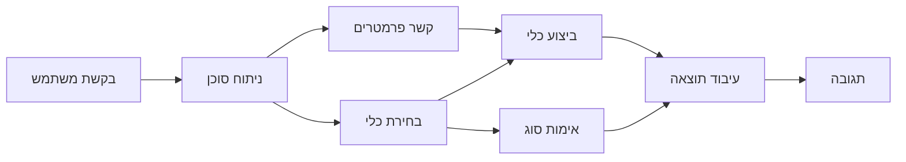

# 🛠️ שימוש מתקדם בכלים עם Azure OpenAI (Responses API) (.NET)

## 📋 יעדי הלמידה

פנקס רשימות זה מציג דפוסי אינטגרציה של כלים ברמת ארגון באמצעות Microsoft Agent Framework ב-.NET עם Azure OpenAI (Responses API). תלמד כיצד לבנות סוכנים מתוחכמים עם כלים מתמחים מרובים, תוך ניצול טיפוס חזק של C# ותכונות ארגוניות של .NET.

### יכולות כלים מתקדמות שתשלוט בהן

- 🔧 **ארכיטקטורת כלים מרובה**: בניית סוכנים עם יכולות מתמחות מרובות
- 🎯 **הרצת כלים בטוחה טיפוסית**: ניצול אימות בזמן הקומפילציה של C#
- 📊 **דפוסי כלים ארגוניים**: עיצוב כלים מוכנים לייצור וטיפול בשגיאות
- 🔗 **קומפוזיציית כלים**: שילוב כלים עבור זרימות עבודה עסקיות מורכבות

## 🎯 יתרונות ארכיטקטורת כלים ב-.NET

### תכונות כלים ארגוניות

- **אימות בזמן הקומפילציה**: טיפוס חזק מבטיח נכונות פרמטרים של הכלים
- **הזרקת תלות**: אינטגרציה עם מיכל IoC לניהול כלים
- **דפוסי Async/Await**: הרצת כלים לא חוסמת עם ניהול נכון של משאבים
- **רישום מובנה**: אינטגרציה מובנית לרישום ניטור הרצת הכלים

### דפוסים מוכנים לייצור

- **טיפול בשגיאות**: ניהול שגיאות מקיף עם חריגות טיפוסיות
- **ניהול משאבים**: דפוסי פסילה נכונים וניהול זיכרון
- **ניטור ביצועים**: מדדים וספירות ביצועים מובנים
- **ניהול תצורה**: תצורה בטוחה טיפוסית עם אימות

## 🔧 ארכיטקטורה טכנית

### רכיבי כלים מרכזיים ב-.NET

- **Microsoft.Extensions.AI**: שכבת הפשטה מאוחדת לכלים
- **Microsoft.Agents.AI**: תזמור כלים ברמת ארגון
- **Azure OpenAI (Responses API)**: לקוח API בעל ביצועים גבוהים עם איסוף חיבורים

### קו צינור הרצת כלים



## 🛠️ קטגוריות וכלים ודפוסים

### 1. **כלי עיבוד נתונים**

- **אימות קלט**: טיפוס חזק עם הערות נתונים
- **פעולות טרנספורמציה**: המרת נתונים ועיצוב בטוח טיפוסית
- **לוגיקת עסק**: כלים לחישוב וניתוח ספציפיים לתחום
- **עיצוב פלט**: יצירת תגובות מובנות

### 2. **כלי אינטגרציה**

- **מחברי API**: אינטגרציית שירות RESTful עם HttpClient
- **כלי מסד נתונים**: אינטגרציית Entity Framework לגישה לנתונים
- **פעולות קבצים**: פעולות מערכת קבצים מאובטחות עם אימות
- **שירותים חיצוניים**: דפוסי אינטגרציה עם שירותים צד שלישי

### 3. **כלי עזר**

- **עיבוד טקסט**: כלי עיבוד מחרוזות ועיצוב
- **פעולות תאריך/זמן**: חישובי תאריך/זמן מודעים לתרבות
- **כלים מתמטיים**: חישובים מדויקים ופעולות סטטיסטיות
- **כלי אימות**: אימות כללי עסק ואימות נתונים

מוכן לבנות סוכנים ברמת ארגון עם יכולות כלים חזקות ובטוחות טיפוס ב-.NET? בוא נעצב פתרונות מקצועיים! 🏢⚡

## 🚀 התחלה מהירה

### דרישות מוקדמות

- [.NET 10 SDK](https://dotnet.microsoft.com/download/dotnet/10.0) או גרסה גבוהה יותר
- מינוי [Azure](https://azure.microsoft.com/free/) עם משאב Azure OpenAI ופריסת מודל
- [Azure CLI](https://learn.microsoft.com/cli/azure/install-azure-cli) — התחבר עם `az login`

### משתני סביבה נדרשים

```bash
# zsh/bash
export AZURE_OPENAI_ENDPOINT=https://<your-resource>.openai.azure.com
export AZURE_OPENAI_DEPLOYMENT=gpt-4o-mini
# לאחר מכן התחבר כך ש-AzureCliCredential יוכל לקבל אסימון
az login
```

```powershell
# PowerShell
$env:AZURE_OPENAI_ENDPOINT = "https://<your-resource>.openai.azure.com"
$env:AZURE_OPENAI_DEPLOYMENT = "gpt-4o-mini"
# לאחר מכן התחבר כדי ש-AzureCliCredential יוכל לקבל אסימון
az login
```

### דוגמת קוד

להריץ את דוגמת הקוד,

```bash
# זש/באש
chmod +x ./04-dotnet-agent-framework.cs
./04-dotnet-agent-framework.cs
```

או באמצעות dotnet CLI:

```bash
dotnet run ./04-dotnet-agent-framework.cs
```

עיין ב-[`04-dotnet-agent-framework.cs`](../../../../04-tool-use/code_samples/04-dotnet-agent-framework.cs) לקבלת הקוד המלא.

```csharp
#!/usr/bin/dotnet run

#:package Microsoft.Extensions.AI@10.*
#:package Microsoft.Agents.AI.OpenAI@1.*-*
#:package Azure.AI.OpenAI@2.1.0
#:package Azure.Identity@1.13.1

using System.ComponentModel;

using Microsoft.Agents.AI;
using Microsoft.Extensions.AI;

using Azure.AI.OpenAI;
using Azure.Identity;

// Tool Function: Random Destination Generator
// This static method will be available to the agent as a callable tool
// The [Description] attribute helps the AI understand when to use this function
// This demonstrates how to create custom tools for AI agents
[Description("Provides a random vacation destination.")]
static string GetRandomDestination()
{
    // List of popular vacation destinations around the world
    // The agent will randomly select from these options
    var destinations = new List<string>
    {
        "Paris, France",
        "Tokyo, Japan",
        "New York City, USA",
        "Sydney, Australia",
        "Rome, Italy",
        "Barcelona, Spain",
        "Cape Town, South Africa",
        "Rio de Janeiro, Brazil",
        "Bangkok, Thailand",
        "Vancouver, Canada"
    };

    // Generate random index and return selected destination
    // Uses System.Random for simple random selection
    var random = new Random();
    int index = random.Next(destinations.Count);
    return destinations[index];
}

// Azure OpenAI with the Responses API (stable v1 endpoint). Sign in with `az login`.
var azureEndpoint = Environment.GetEnvironmentVariable("AZURE_OPENAI_ENDPOINT")
    ?? throw new InvalidOperationException("AZURE_OPENAI_ENDPOINT is not set.");
var deployment = Environment.GetEnvironmentVariable("AZURE_OPENAI_DEPLOYMENT") ?? "gpt-4o-mini";

var azureClient = new AzureOpenAIClient(new Uri(azureEndpoint), new AzureCliCredential());

// Define Agent Identity and Comprehensive Instructions
// Agent name for identification and logging purposes
var AGENT_NAME = "TravelAgent";

// Detailed instructions that define the agent's personality, capabilities, and behavior
// This system prompt shapes how the agent responds and interacts with users
var AGENT_INSTRUCTIONS = """
You are a helpful AI Agent that can help plan vacations for customers.

Important: When users specify a destination, always plan for that location. Only suggest random destinations when the user hasn't specified a preference.

When the conversation begins, introduce yourself with this message:
"Hello! I'm your TravelAgent assistant. I can help plan vacations and suggest interesting destinations for you. Here are some things you can ask me:
1. Plan a day trip to a specific location
2. Suggest a random vacation destination
3. Find destinations with specific features (beaches, mountains, historical sites, etc.)
4. Plan an alternative trip if you don't like my first suggestion

What kind of trip would you like me to help you plan today?"

Always prioritize user preferences. If they mention a specific destination like "Bali" or "Paris," focus your planning on that location rather than suggesting alternatives.
""";

// Create AI Agent with Advanced Travel Planning Capabilities
// Get the Responses client for the deployment and create the AI agent
// Configure agent with name, detailed instructions, and available tools
// This demonstrates the .NET agent creation pattern with full configuration
AIAgent agent = azureClient
    .GetOpenAIResponseClient(deployment)
    .CreateAIAgent(
        name: AGENT_NAME,
        instructions: AGENT_INSTRUCTIONS,
        tools: [AIFunctionFactory.Create(GetRandomDestination)]
    );

// Create New Conversation Thread for Context Management
// Initialize a new conversation thread to maintain context across multiple interactions
// Threads enable the agent to remember previous exchanges and maintain conversational state
// This is essential for multi-turn conversations and contextual understanding
AgentThread thread = agent.GetNewThread();

// Execute Agent: First Travel Planning Request
// Run the agent with an initial request that will likely trigger the random destination tool
// The agent will analyze the request, use the GetRandomDestination tool, and create an itinerary
// Using the thread parameter maintains conversation context for subsequent interactions
await foreach (var update in agent.RunStreamingAsync("Plan me a day trip", thread))
{
    await Task.Delay(10);
    Console.Write(update);
}

Console.WriteLine();

// Execute Agent: Follow-up Request with Context Awareness
// Demonstrate contextual conversation by referencing the previous response
// The agent remembers the previous destination suggestion and will provide an alternative
// This showcases the power of conversation threads and contextual understanding in .NET agents
await foreach (var update in agent.RunStreamingAsync("I don't like that destination. Plan me another vacation.", thread))
{
    await Task.Delay(10);
    Console.Write(update);
}
```

---

<!-- CO-OP TRANSLATOR DISCLAIMER START -->
**כתב ויתור**:
מסמך זה תורגם באמצעות שירות תרגום אוטומטי [Co-op Translator](https://github.com/Azure/co-op-translator). למרות שאנו שואפים לדיוק, יש לקחת בחשבון שתרגומים אוטומטיים עלולים להכיל שגיאות או אי-דיוקים. יש להחשיב את המסמך המקורי בשפתו הטבעית כמקור הסמכות. למידע קריטי מומלץ להשתמש בתרגום מקצועי על ידי מתרגם אדם. אנו לא אחראים לכל אי-הבנה או פירוש שגוי הנובע מהשימוש בתרגום זה.
<!-- CO-OP TRANSLATOR DISCLAIMER END -->