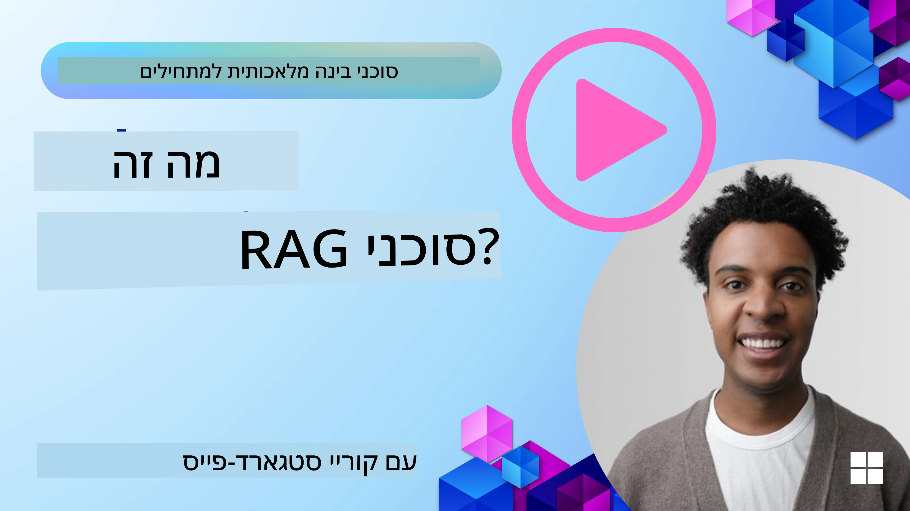
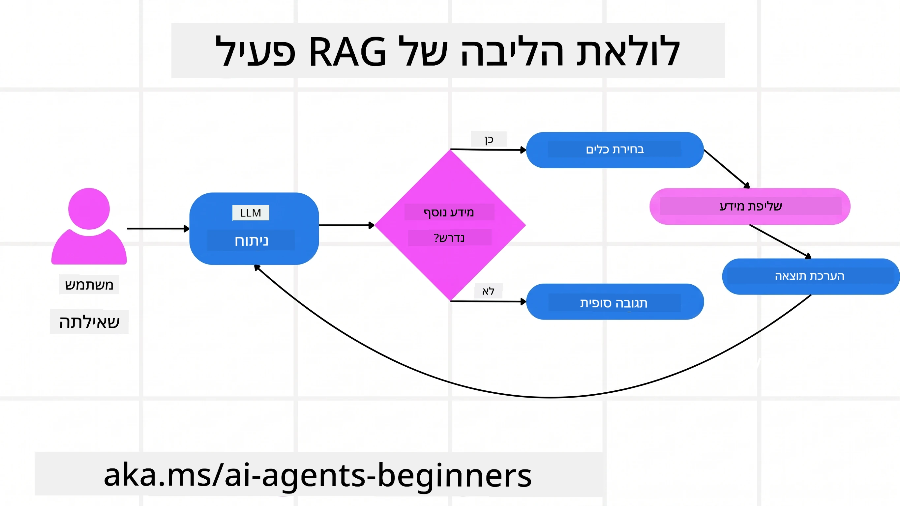
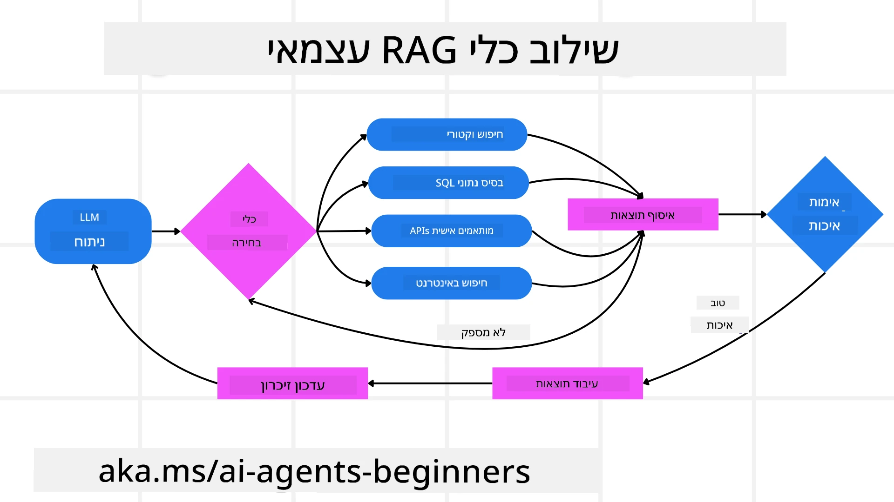
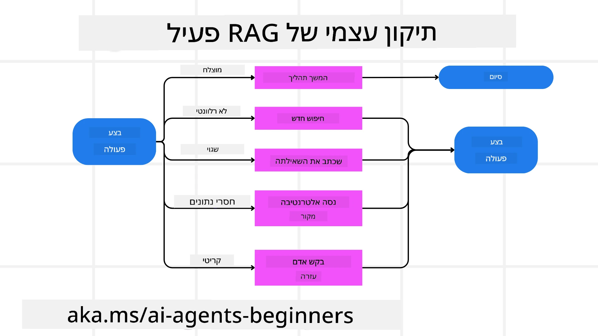
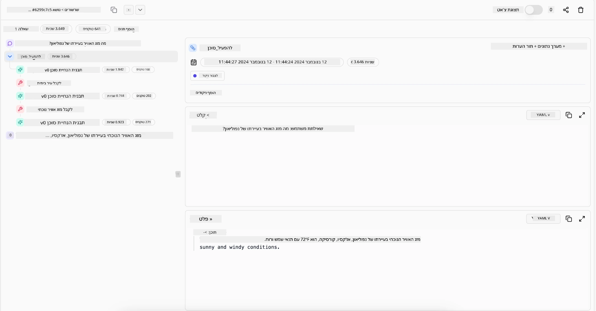

> _(לחצו על התמונה למעלה לצפייה בסרטון של השיעור)_

# Agentic RAG

שיעור זה נותן סקירה מקיפה של Agentic Retrieval-Augmented Generation (Agentic RAG), פרדיגמה מתפתחת בבינה מלאכותית שבה מודלים שפתיים גדולים (LLMs) מתכננים באופן עצמאי את הצעדים הבאים שלהם תוך כדי שאיבת מידע ממקורות חיצוניים. בניגוד לדפוסי שליפה-ואז-קריאה סטטיים, Agentic RAG כולל קריאות חוזרות ל-LLM, המשלבות קריאות לכלים או לפונקציות ופלטים מובנים. המערכת מעריכה תוצאות, משפרת שאילתות, מפעילה כלים נוספים במידת הצורך, וממשיכה במחזור זה עד להשגת פתרון מספק.

## מבוא

שיעור זה יעסוק ב

- **הבנת Agentic RAG:** למדו על הפרדיגמה המתפתחת בבינה מלאכותית שבה מודלים שפתיים גדולים (LLMs) מתכננים באופן עצמאי את הצעדים הבאים שלהם תוך שאיבת מידע ממקורות נתונים חיצוניים.
- **הבנת סגנון Maker-Checker איטרטיבי:** הבינו את הלולאה של קריאות חוזרות ל-LLM, המשלבות קריאות לכלים או פונקציות ופלטים מובנים, שנועדו לשפר דיוק ולטפל בשאילתות לקויות.
- **חקירת יישומים מעשיים:** זיהוי סיטואציות שבהן Agentic RAG מצטיין, כגון סביבות עם עדיפות לדיוק, אינטראקציות מורכבות עם מסדי נתונים, וזרימות עבודה מורחבות.

## מטרות הלמידה

לאחר סיום השיעור, תדעו כיצד/תבינו:

- **הבנת Agentic RAG:** למדו על הפרדיגמה המתפתחת בבינה מלאכותית שבה מודלים שפתיים גדולים (LLMs) מתכננים באופן עצמאי את הצעדים הבאים שלהם תוך שאיבת מידע ממקורות נתונים חיצוניים.
- **סגנון Maker-Checker איטרטיבי:** הבינו את המושג של לולאת קריאות חוזרות ל-LLM, המשלבות קריאות לכלים או פונקציות ופלטים מובנים, שנועדו לשפר דיוק ולטפל בשאילתות לקויות.
- **בעלות על תהליך ההסקה:** הבינו את יכולת המערכת לנהל את תהליך ההסקה שלה, לקבל החלטות על גישת פתרון הבעיות ללא נשענות על מסלולים מוגדרים מראש.
- **זרימת עבודה:** הבינו כיצד מודל אג'נטי מחליט באופן עצמאי למשוך דוחות מגמות שוק, לזהות נתוני מתחרים, לקשר מדדי מכירות פנימיים, לסנתז ממצאים ולהעריך את האסטרטגיה.
- **לולאות איטרטיביות, אינטגרציית כלים וזיכרון:** למדו על הסתמכות המערכת על תבנית אינטראקציה לולאתית, שמירת מצב וזיכרון בין צעדים כדי למנוע לולאות חוזרות ולקבל החלטות מושכלות.
- **טיפול במצבי כישלון ותיקון עצמי:** חקרו את מנגנוני התיקון העצמי החזקים של המערכת, כולל איטרציה ושאילת מחדש, שימוש בכלים דיאגנוסטיים, ופנייה לפיקוח אנושי.
- **גבולות האוטונומיה:** הבינו את מגבלות Agentic RAG, עם דגש על אוטונומיה תחומית, תלות בתשתית, וכיבוד מגבלות בטיחות.
- **מקרי שימוש מעשיים וערך:** זיהוי סיטואציות שבהן Agentic RAG מצטיין, כולל סביבות הדורשות דיוק, אינטראקציות מורכבות עם מסדי נתונים, וזרימות עבודה מורחבות.
- **ממשל, שקיפות ואמון:** למדו על חשיבות הממשל והשקיפות, כולל הסברת הסקה, בקרת הטיות ופיקוח אנושי.

## מהו Agentic RAG?

Agentic Retrieval-Augmented Generation (Agentic RAG) היא פרדיגמה מתפתחת בבינה מלאכותית שבה מודלים שפתיים גדולים (LLMs) מתכננים באופן עצמאי את הצעדים הבאים תוך שאיבת מידע ממקורות חיצוניים. בניגוד לתבניות שליפה-ואז-קריאה סטטיות, Agentic RAG כולל קריאות איטרטיביות ל-LLM, שמשולבות בקריאות לכלים או פונקציות ופלטים מובנים. המערכת מעריכה תוצאות, משפרת שאילתות, מפעילה כלים נוספים במידת הצורך, וממשיכה במחזור זה עד להשגת פתרון מספק. סגנון "יצרן-בודק" איטרטיבי זה משפר את הדיוק, מטפל בשאילתות לקויות, ומבטיח תוצאות איכותיות גבוהות.

המערכת מנהלת באופן פעיל את תהליך ההסקה שלה, כותבת מחדש שאילתות כושלות, בוחרת שיטות שליפה שונות ומאחדת כלים מרובים — כגון חיפוש וקטורי ב-Azure AI Search, מסדי נתונים SQL או APIs מותאמים — לפני סיום התשובה. התכונה המבדילה של מערכת אג'נטית היא יכולתה לנהל בעצמה את תהליך ההסקה. יישומי RAG מסורתיים מסתמכים על מסלולים מוגדרים מראש, אך מערכת אג'נטית קובעת באופן עצמאי את רצף הצעדים לפי איכות המידע שהיא מוצאת.

## הגדרת Agentic Retrieval-Augmented Generation (Agentic RAG)

Agentic Retrieval-Augmented Generation (Agentic RAG) היא פרדיגמה מתפתחת בפיתוח בינה מלאכותית שבה מודלים שפתיים גדולים לא רק מושכים מידע ממקורות נתונים חיצוניים אלא גם מתכננים באופן עצמאי את הצעדים הבאים שלהם. בניגוד לדפוסי שליפה-ואז-קריאה סטטיים או לרצפי פרומפט מתוכננים בקפידה, Agentic RAG כולל לולאה של קריאות איטרטיביות ל-LLM, שמשולבות בקריאות לכלים או פונקציות ופלטים מובנים. בכל שלב, המערכת מעריכה את התוצאות שהשיגה, מחליטה האם לשפר את השאילתות, מפעילה כלים נוספים במידת הצורך, וממשיכה במחזור עד להשגת פתרון מספק.

סגנון הפעולה האיטרטיבי הזה של "יצרן-בודק" נועד לשפר את הדיוק, להתמודד עם שאילתות מקולקלות למסדי נתונים מובנים (למשל NL2SQL), ולהבטיח תוצאות מאוזנות ואיכותיות. במקום להסתמך רק על שרשראות פרומפט מהונדסות בקפידה, המערכת מנהלת באופן פעיל את תהליך ההסקה שלה. היא יכולה לכתוב מחדש שאילתות שנכשלו, לבחור שיטות שליפה שונות ולשלב כלים מרובים — כגון חיפוש וקטורי ב-Azure AI Search, בסיסי נתונים SQL או APIs מותאמים — לפני סיום התשובה. זה מבטל את הצורך במסגרת תיאום מורכבת מדי. במקום זאת, לולאה פשוטה של "קריאת LLM → שימוש בכלי → קריאת LLM → ..." יכולה להניב פלטים מתוחכמים ומבוססים היטב.

## בעלות על תהליך ההסקה

האיכות המבדילה שהופכת מערכת ל"אג'נטית" היא יכולתה להיות בעלת תהליך ההסקה שלה. יישומי RAG מסורתיים תלויים לעיתים קרובות בכך שבני אדם מגדירים מראש מסלול למודל: שרשרת חשיבה שמפרטת מה לשלוף ומתי.
אך כאשר מערכת היא באמת אג'נטית, היא מחליטה פנימית כיצד לגשת לבעיה. היא לא רק מבצעת סקריפט; היא קובעת באופן עצמאי את רצף הצעדים לפי איכות המידע שהיא מוצאת.
למשל, אם מתבקשת ליצור אסטרטגיית השקה למוצר, היא לא מסתמכת רק על פרומפט שמפרט את כל תהליך המחקר וקבלת ההחלטות. במקום זאת, המודל האג'נטי מחליט באופן עצמאי ל:

1. לאסוף דוחות מגמות שוק נוכחיות באמצעות Bing Web Grounding
2. לזהות נתוני מתחרים רלוונטיים באמצעות Azure AI Search.
3. לקשר בין מדדי מכירות היסטוריים פנימיים באמצעות Azure SQL Database.
4. לסנתז את הממצאים לאסטרטגיה מגובשת המתואמת דרך Azure OpenAI Service.
5. להעריך את האסטרטגיה לבדיקת פערים או אי-עקביות, ולבצע סבב שליפה נוסף במידת הצורך.
כל הצעדים האלה — שיפור שאילתות, בחירת מקורות, איטרציה עד השגת תשובה "מספקת" — נקבעים על ידי המודל, לא סקריפטו מראש בידי אדם.

## לולאות איטרטיביות, אינטגרציית כלים וזיכרון

מערכת אג'נטית מסתמכת על תבנית אינטראקציה לולאתית:

- **קריאה ראשונית:** מטרת המשתמש (פרומפט המשתמש) מועברת ל-LLM.
- **הפעלת כלים:** אם המודל מזהה מידע חסר או הוראות מעורפלות, הוא בוחר כלי או שיטת שליפה — כמו שאילתת מסד נתונים וקטורי (לדוגמה: Azure AI Search Hybrid חיפוש על נתונים פרטיים) או קריאת SQL מובנית — לאיסוף הקשר נוסף.
- **הערכה ושיפור:** לאחר סקירת הנתונים שהוחזרו, המודל מחליט אם המידע מספיק. אם לא, הוא משפר את השאילתה, מנסה כלי שונה או משנה גישה.
- **חזרה עד לסיפוק:** המחזור נמשך עד שהמודל קובע שיש לו מספיק בהירות והוכחות להנפיק תגובה סופית ומנומקת היטב.
- **זיכרון ומצב:** מכיוון שהמערכת שומרת מצב וזיכרון לאורך השלבים, היא יכולה לזכור ניסיונות קודמים ותוצאותיהם, להמנע מלולאות חוזרות ולקבל החלטות מושכלות ככל שמתקדמת.

עם הזמן, זה יוצר תחושה של הבנה מתפתחת, המאפשרת למודל לנווט משימות מורכבות עם כמה שלבים מבלי לדרוש התערבות אנושית מתמדת או שינוי הפרומפט.

## טיפול במצבי כישלון ותיקון עצמי

אוטונומיית Agentic RAG כוללת גם מנגנוני תיקון עצמי חזקים. כאשר המערכת נתקלת במבוי סתום — כמו שליפת מסמכים לא רלוונטיים או שאילתות לקויות — היא יכולה:

- **איטרציה ושאילת מחדש:** במקום להחזיר תשובות בעלות ערך נמוך, המודל מנסה אסטרטגיות חיפוש חדשות, כותב מחדש שאילתות למסדי נתונים או בוחן מערכות נתונים חלופיות.
- **שימוש בכלים דיאגנוסטיים:** המערכת עשויה להפעיל פונקציות נוספות שנועדו לסייע באבחון שלבי ההסקה שלה או לאשר את נכונות הנתונים שהשיגה. כלים כמו Azure AI Tracing יהיו חשובים לאפשרת נראות ומעקב חזקים.
- **הסתמכות על פיקוח אנושי:** בסיטואציות בעלות סיכון גבוה או כשיש כישלון חוזר, המודל עשוי לסמן חוסר וודאות ולבקש הדרכה אנושית. כאשר האדם מספק משוב מתקני, המודל יכול לשלב את הלמידה הזו להבא.

גישה איטרטיבית ודינמית זו מאפשרת למודל להשתפר באופן רציף, להבטיח שהמערכת איננה חד-פעמית אלא כזו שלומדת מהטעויות שלה במהלך סשן נתון.

## גבולות האוטונומיה

על אף האוטונומיה שבתוך משימה, Agentic RAG אינו מקביל לאינטליגנציה מלאכותית כללית. היכולות ה"אג'נטיות" שלו מוגבלות לכלים, למקורות המידע ולמדיניות שמספקים מפתחים אנושיים. הוא אינו יכול להמציא כלים חדשים או לצאת מתחומי הדומיין שהוגדרו. במקום זאת, הוא מצטיין בניהול דינמי של המשאבים שבידו.
הבדלים מרכזיים לעומת צורות מתקדמות יותר של בינה מלאכותית כוללים:

1. **אוטונומיה תחומית מוגדרת:** מערכות Agentic RAG מתמקדות בהשגת מטרות שהוגדרו על ידי המשתמש בתוך תחום מוכר, ומשתמשות באסטרטגיות כמו כתיבת שאילתות מחדש או בחירת כלים לשיפור התוצאות.
2. **תלות בתשתית:** היכולות של המערכת תלויות בכלים ובנתונים שמשולבים על ידי המפתחים. היא אינה יכולה לעבור את הגבולות הללו ללא התערבות אנושית.
3. **כיבוד מגבלות בטיחות:** קווים מנחים אתיים, כללי ציות ומדיניות עסקית נשארים חשובים מאוד. חופש הפעולה של האג'נט תמיד מוגבל על ידי אמצעי בטיחות ומנגנוני פיקוח (בעיקרון?)

## מקרי שימוש מעשיים וערך

Agentic RAG מצטיין בסיטואציות הדורשות שיפור איטרטיבי ודיוק:

1. **סביבות עם עדיפות לדיוק:** בבדיקות ציות, ניתוח רגולטורי או מחקר משפטי, המודל האג'נטי יכול לאמת עובדות שוב ושוב, להיוועץ במקורות מרובים, ולכתוב מחדש שאילתות עד לקבלת תשובה מבוקרת היטב.
2. **אינטראקציות מורכבות עם מסדי נתונים:** כאשר מתמודדים עם נתונים מובנים שבהם שאילתות עשויות להיכשל לעיתים או להזדקק להתאמה, המערכת יכולה לשפר באופן עצמאי את השאילתות באמצעות Azure SQL או Microsoft Fabric OneLake, ולהבטיח שהשליפה הסופית מתיישבת עם כוונת המשתמש.
3. **זרימות עבודה מורחבות:** סשנים ארוכים יותר עשויים להתפתח ככל שמידע חדש מתגלה. Agentic RAG יכול לשלב נתונים חדשים באופן רציף ולשנות אסטרטגיות ככל שלומד יותר על תחום הבעיה.

## ממשל, שקיפות ואמון

ככל שמערכות אלה הופכות לאוטונומיות יותר בתהליך ההסקה, ממשל ושקיפות הם קריטיים:

- **הסברת הסקה:** המודל יכול לספק מסלול ביקורת של השאילתות שביצע, המקורות שהתייעץ בהם ושלבי ההסקה שננקטו להגיע למסקנה. כלים כמו Azure AI Content Safety ו-Azure AI Tracing / GenAIOps יכולים לסייע בשמירת שקיפות ובהפחתת סיכונים.
- **בקרת הטיות ושליפה מאוזנת:** מפתחים יכולים לכוונן אסטרטגיות שליפה כדי להבטיח ששקולים מקורות נתונים מאוזנים ומייצגים, ולבצע ביקורות קבועות כדי לזהות הטיות או דפוסים מטעים בעזרת מודלים מותאמים לארגוני מדע נתונים מתקדמים שמשתמשים ב-Azure Machine Learning.
- **פיקוח אנושי וציות:** במשימות רגישות, סקירה אנושית נותרת חיונית. Agentic RAG לא מחליף שיקול דעת אנושי בהחלטות רגישות — אלא משלים אותו על ידי אספקת אפשרויות מבוקרות ומעמיקות יותר.

זמינות כלים שמספקים תיעוד ברור של הפעולות היא הכרחית. בלעדיהם, איתור תקלות בתהליך רב-שלבי יכול להיות מאתגר מאוד. ראו את הדוגמה הבאה מחברת Literal AI (מאחורי Chainlit) עבור הפעלת Agent:

## סיכום

Agentic RAG מייצג אבולוציה טבעית בדרך בה מערכות בינה מלאכותית מתמודדות עם משימות מורכבות ועתירות נתונים. על ידי אימוץ תבנית אינטראקציה לולאתית, בחירה אוטונומית של כלים, ושיפור שאילתות עד להשגת תוצאה איכותית, המערכת עוברת מעבר למעקב סטטי אחרי פרומפטים למקבל החלטות אדפטיבי, מודע להקשר. אף שעדיין מוגבלת על ידי תשתיות ומדיניות אתית שהוגדרו על ידי בני אדם, היכולות האג'נטיות הללו מאפשרות אינטראקציות בינה מלאכותית עשירות, דינמיות ושימושיות יותר גם לארגונים וגם למשתמשים קצה.

### יש לכם עוד שאלות על Agentic RAG?

הצטרפו ל-[Microsoft Foundry Discord](https://discord.com/invite/ATgtXmAS5D) כדי להיפגש עם לומדים אחרים, להשתתף בשעות משרד ולקבל מענה לשאלות שלכם על AI Agents.

## משאבים נוספים

- <a href="https://learn.microsoft.com/training/modules/use-own-data-azure-openai" target="_blank">הטמעת Retrieval Augmented Generation (RAG) עם Azure OpenAI Service: למדו כיצד להשתמש בנתונים שלכם עם Azure OpenAI Service. מודול Microsoft Learn זה מספק מדריך מקיף להטמעת RAG</a>
- <a href="https://learn.microsoft.com/azure/ai-studio/concepts/evaluation-approach-gen-ai" target="_blank">הערכת יישומים של בינה מלאכותית יוצרת עם Microsoft Foundry: מאמר זה עוסק בהערכת והשוואת מודלים על מערכי נתונים זמינים לציבור, כולל יישומי Agentic AI וארכיטקטורות RAG</a>
- <a href="https://weaviate.io/blog/what-is-agentic-rag" target="_blank">מהו Agentic RAG | Weaviate</a>
- <a href="https://ragaboutit.com/agentic-rag-a-complete-guide-to-agent-based-retrieval-augmented-generation/" target="_blank">Agentic RAG: מדריך מלא ל-Retrieval Augmented Generation מבוסס סוכנים – חדשות מ-Generation RAG</a>

- <a href="https://huggingface.co/learn/cookbook/agent_rag" target="_blank">RAG סוכני: האץ את ה-RAG שלך עם ניסוח שאילתות מחדש ושאילת עצמך! הספר הבישול לאינטליגנציה מלאכותית בקוד פתוח של Hugging Face</a>
- <a href="https://youtu.be/aQ4yQXeB1Ss?si=2HUqBzHoeB5tR04U" target="_blank">הוספת שכבות סוכנים ל-RAG</a>
- <a href="https://www.youtube.com/watch?v=zeAyuLc_f3Q&t=244s" target="_blank">עתיד העוזרים הידע: Jerry Liu</a>
- <a href="https://www.youtube.com/watch?v=AOSjiXP1jmQ" target="_blank">איך לבנות מערכות RAG סוכניות</a>
- <a href="https://ignite.microsoft.com/sessions/BRK102?source=sessions" target="_blank">שימוש בשירות הסוכנים Microsoft Foundry להרחבת סוכני ה-AI שלך</a>

### מאמרים אקדמיים

- <a href="https://arxiv.org/abs/2303.17651" target="_blank">2303.17651 שיפור עצמי: שיפור איטרטיבי עם משוב עצמי</a>
- <a href="https://arxiv.org/abs/2303.11366" target="_blank">2303.11366 רפלקסיה: סוכני שפה עם למידה מחזקת מילולית</a>
- <a href="https://arxiv.org/abs/2305.11738" target="_blank">2305.11738 CRITIC: מודלים גדולים של שפה יכולים לתקן את עצמם עם ביקורת אינטראקטיבית לכלים</a>
- <a href="https://arxiv.org/abs/2501.09136" target="_blank">2501.09136 יצירת פתיחות משופרת עם גישה סוכנית: סקר על Agentic RAG</a>

## שיעור קודם

[תבנית עיצוב לשימוש בכלים](../04-tool-use/README.md)

## שיעור הבא

[בניית סוכני AI אמינים](../06-building-trustworthy-agents/README.md)

---

<!-- CO-OP TRANSLATOR DISCLAIMER START -->
**כתב ויתור**:
מסמך זה תורגם באמצעות שירות תרגום אוטומטי [Co-op Translator](https://github.com/Azure/co-op-translator). למרות שאנו שואפים לדיוק, יש לקחת בחשבון שתרגומים אוטומטיים עלולים להכיל שגיאות או אי-דיוקים. יש להחשיב את המסמך המקורי בשפתו הטבעית כמקור הסמכות. למידע קריטי מומלץ להשתמש בתרגום מקצועי על ידי מתרגם אדם. אנו לא אחראים לכל אי-הבנה או פירוש שגוי הנובע מהשימוש בתרגום זה.
<!-- CO-OP TRANSLATOR DISCLAIMER END -->