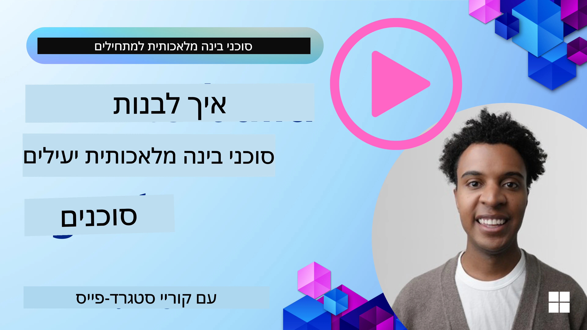
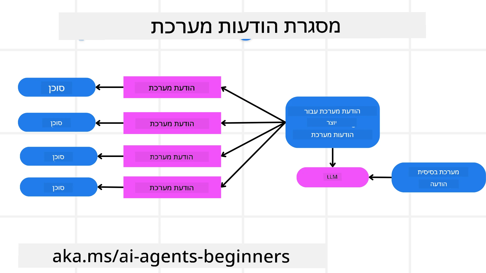
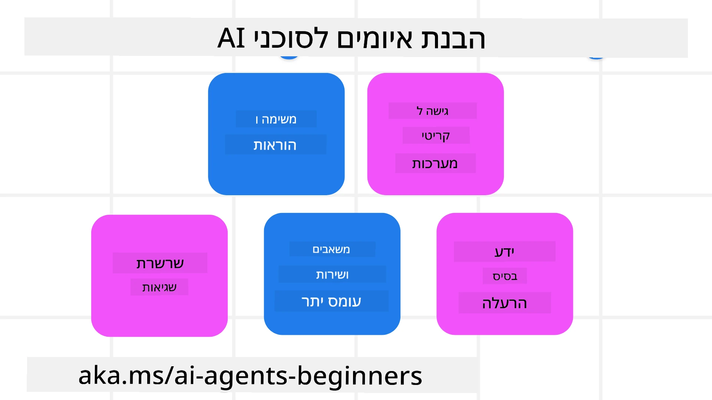
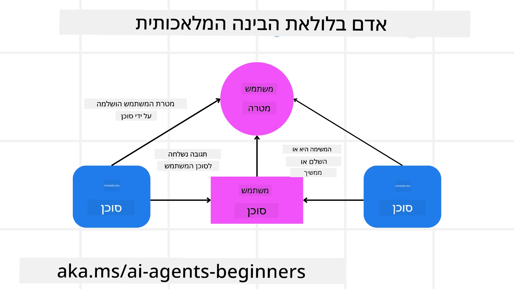

[](https://youtu.be/iZKkMEGBCUQ?si=Q-kEbcyHUMPoHp8L)

> _(לחצו על התמונה למעלה כדי לצפות בסרטון של שיעור זה)_

# בניית סוכני בינה מלאכותית מהימנים

## מבוא

השיעור יכלול:

- כיצד לבנות ולפרוס סוכני AI בטוחים ויעילים
- שיקולי אבטחה חשובים בעת פיתוח סוכני AI.
- כיצד לשמור על פרטיות הנתונים והמשתמשים בעת פיתוח סוכני AI.

## מטרות הלמידה

בסיום שיעור זה תדעו כיצד:

- לזהות ולהפחית סיכונים בעת יצירת סוכני AI.
- ליישם אמצעי אבטחה כדי לוודא שניהול הנתונים והגישה מתבצעים כראוי.
- ליצור סוכני AI השומרים על פרטיות הנתונים ומספקים חוויית משתמש איכותית.

## בטיחות

ראשית נבחן בניית יישומי סוכנות בטוחים. בטיחות משמעותה שהסוכן מבצע כפי שתוכנן. כבוני יישומי סוכנות, יש לנו שיטות וכלים למקסום הבטיחות:

### בניית מסגרת להודעות מערכת

אם בניתם אי פעם יישום בינה מלאכותית באמצעות מודלים שפתיים גדולים (LLMs), אתם מכירים את החשיבות של עיצוב פרומפט מערכת חזק או הודעת מערכת. פרומפטים אלה קובעים את הכללים המטא, ההוראות וההנחיות לאופן שבו ה-LLM יתקשר עם המשתמש והנתונים.

לסוכני AI, פרומפט המערכת חשוב אף יותר מאחר שסוכנים אלו יזדקקו להוראות מאוד ספציפיות כדי להשלים את המשימות שעיצבנו עבורם.

כדי ליצור פרומפטים מערכתיים סקלאביליים, נוכל להשתמש במסגרת הודעות מערכת לבניית אחד או יותר סוכנים ביישום שלנו:



#### שלב 1: צור פרומפט מטא של המערכת 

הפרומפט המטא ישמש את ה-LLM ליצירת פרומפטים מערכתיים עבור הסוכנים שניצור. אנו מעצבים אותו כתבנית כך שנוכל ליצור ביעילות מספר סוכנים במידת הצורך.

הנה דוגמה לפרומפט מטא של המערכת שנעניק ל-LLM:

```plaintext
You are an expert at creating AI agent assistants. 
You will be provided a company name, role, responsibilities and other
information that you will use to provide a system prompt for.
To create the system prompt, be descriptive as possible and provide a structure that a system using an LLM can better understand the role and responsibilities of the AI assistant. 
```

#### שלב 2: צור פרומפט בסיסי

השלב הבא הוא ליצור פרומפט בסיסי לתיאור סוכן ה-AI. יש לכלול את תפקיד הסוכן, המשימות שהסוכן יבצע, וכל אחריות נוספת של הסוכן.

הינה דוגמה:

```plaintext
You are a travel agent for Contoso Travel that is great at booking flights for customers. To help customers you can perform the following tasks: lookup available flights, book flights, ask for preferences in seating and times for flights, cancel any previously booked flights and alert customers on any delays or cancellations of flights.  
```

#### שלב 3: ספק הודעת מערכת בסיסית ל-LLM

כעת נוכל לייעל הודעת מערכת זו על ידי מתן הודעת המטא של המערכת כהודעת מערכת יחד עם הודעת המערכת הבסיסית שלנו.

זה יפיק הודעת מערכת המעוצבת טוב יותר להנחיית סוכני ה-AI שלנו:

```markdown
**Company Name:** Contoso Travel  
**Role:** Travel Agent Assistant

**Objective:**  
You are an AI-powered travel agent assistant for Contoso Travel, specializing in booking flights and providing exceptional customer service. Your main goal is to assist customers in finding, booking, and managing their flights, all while ensuring that their preferences and needs are met efficiently.

**Key Responsibilities:**

1. **Flight Lookup:**
    
    - Assist customers in searching for available flights based on their specified destination, dates, and any other relevant preferences.
    - Provide a list of options, including flight times, airlines, layovers, and pricing.
2. **Flight Booking:**
    
    - Facilitate the booking of flights for customers, ensuring that all details are correctly entered into the system.
    - Confirm bookings and provide customers with their itinerary, including confirmation numbers and any other pertinent information.
3. **Customer Preference Inquiry:**
    
    - Actively ask customers for their preferences regarding seating (e.g., aisle, window, extra legroom) and preferred times for flights (e.g., morning, afternoon, evening).
    - Record these preferences for future reference and tailor suggestions accordingly.
4. **Flight Cancellation:**
    
    - Assist customers in canceling previously booked flights if needed, following company policies and procedures.
    - Notify customers of any necessary refunds or additional steps that may be required for cancellations.
5. **Flight Monitoring:**
    
    - Monitor the status of booked flights and alert customers in real-time about any delays, cancellations, or changes to their flight schedule.
    - Provide updates through preferred communication channels (e.g., email, SMS) as needed.

**Tone and Style:**

- Maintain a friendly, professional, and approachable demeanor in all interactions with customers.
- Ensure that all communication is clear, informative, and tailored to the customer's specific needs and inquiries.

**User Interaction Instructions:**

- Respond to customer queries promptly and accurately.
- Use a conversational style while ensuring professionalism.
- Prioritize customer satisfaction by being attentive, empathetic, and proactive in all assistance provided.

**Additional Notes:**

- Stay updated on any changes to airline policies, travel restrictions, and other relevant information that could impact flight bookings and customer experience.
- Use clear and concise language to explain options and processes, avoiding jargon where possible for better customer understanding.

This AI assistant is designed to streamline the flight booking process for customers of Contoso Travel, ensuring that all their travel needs are met efficiently and effectively.

```

#### שלב 4: בצע איטרציות ושפר

הערך של מסגרת הודעות המערכת הזו הוא היכולת להרחיב את יצירת הודעות המערכת של מספר סוכנים בצורה קלה יותר וכן לשפר את הודעות המערכת שלכם עם הזמן. זה נדיר שתהיה לכם הודעת מערכת שעובדת מהפעם הראשונה עבור כל מקרה השימוש המלא שלכם. היכולת לבצע התאמות ושיפורים קטנים על ידי שינוי הודעת המערכת הבסיסית והרצתה דרך המערכת תאפשר לכם להשוות ולהעריך תוצאות.

## הבנת איומים

כדי לבנות סוכני AI מהימנים, חשוב להבין ולהפחית את הסיכונים והאיומים כלפי הסוכן שלכם. נסקור כמה מהאיומים השונים כלפי סוכני AI ואיך תוכלו לתכנן ולהתכונן אליהם טוב יותר.



### משימה והנחייה

**תיאור:** תוקפים מנסים לשנות את ההוראות או המטרות של סוכן ה-AI באמצעות פרומפטים או מניפולציה של הקלטים.

**הפחתה**: בצעו בדיקות אימות ומסנני קלט כדי לזהות פרומפטים שעלולים להיות מסוכנים לפני שהם מעובדים על ידי סוכן ה-AI. מאחר שתקיפות אלה דורשות לרוב אינטראקציה תכופה עם הסוכן, הגבלת מספר הפניות בשיחה היא דרך נוספת למנוע סוג זה של תקיפות.

### גישה למערכות קריטיות

**תיאור**: אם לסוכן ה-AI יש גישה למערכות ושירותים המאחסנים נתונים רגישים, תוקפים עלולים לפגוע בתקשורת בין הסוכן לשירותים אלה. אלה יכולים להיות התקפות ישירות או ניסיונות עקיפים להשיג מידע על המערכות דרך הסוכן.

**הפחתה**: יש להעניק לסוכני AI גישה למערכות על בסיס צורך בלבד כדי למנוע סוג זה של תקיפות. התקשורת בין הסוכן למערכת צריכה להיות מאובטחת. יישום אימות ושליטה בגישה הוא דרך נוספת להגן על המידע הזה.

### עומס על משאבים ושירותים

**תיאור:** סוכני AI יכולים לגשת לכלים ושירותים שונים כדי להשלים משימות. תוקפים יכולים להשתמש ביכולת זו כדי לתקוף שירותים אלה על ידי שליחת נפח גבוה של בקשות דרך סוכן ה-AI, מה שעלול לגרום לכשלי מערכת או לעלויות גבוהות.

**הפחתה:** יישמו מדיניות להגבלת מספר הבקשות שסוכן AI יכול לבצע לשירות. הגבלת מספר פניות השיחה והבקשות לסוכן ה-AI היא דרך נוספת למנוע סוג זה של תקיפות.

### הרעלת בסיס הידע

**תיאור:** סוג התקיפה הזה אינו פונה ישירות לסוכן ה-AI אלא פונה לבסיס הידע ולשירותים אחרים שבהם הסוכן ישתמש. הדבר עלול לכלול השחתת הנתונים או המידע שהסוכן ישתמש בו לביצוע מטלה, מה שיוביל לתגובות מוטות או לא מכוונות למשתמש.

**הפחתה:** בצעו אימות קבוע של הנתונים שהסוכן ישתמש בהם בתהליכי העבודה שלו. ודאו שהגישה לנתונים אלה מאובטחת וששינויים בהם מתבצעים רק על ידי אנשים מהימנים כדי להימנע מסוג זה של תקיפה.

### שגיאות מצטברות

**תיאור:** סוכני AI ניגשים לכלים ושירותים שונים כדי להשלים משימות. שגיאות הנגרמות על ידי תוקפים יכולות להוביל לכשלים של מערכות אחרות שאליהן הסוכן מחובר, מה שגורם להתפשטות התקיפה ולהקשות על איתור ותיקון הבעיה.

**הפחתה**: אחת הדרכים למנוע זאת היא לאפשר לסוכן ה-AI לפעול בסביבה מוגבלת, כמו ביצוע משימות במכולה של Docker, כדי למנוע התקפות ישירות על המערכת. יצירת מנגנוני גיבוי ולוגיקת ניסיון חוזר כאשר מערכות מסוימות מחזירות שגיאה היא דרך נוספת למנוע כשלים מערכתיים רחבים יותר.

## אדם בלולאה

דרך יעילה נוספת לבנות מערכות סוכני AI מהימנים היא שימוש במודל אדם בלולאה. זה יוצר זרימה שבה משתמשים יכולים לספק משוב לסוכנים במהלך הריצה. המשתמשים למעשה משמשים כסוכנים במערכת רב-סוכנית ועל ידי מתן אישור או סיום לתהליך הריצה.



הנה קטע קוד המשתמש ב-Microsoft Agent Framework להראות איך המושג מיושם:

```python
import os
from agent_framework.azure import AzureAIProjectAgentProvider
from azure.identity import AzureCliCredential

# צור את הספק עם אישור אנושי בתהליך
provider = AzureAIProjectAgentProvider(
    credential=AzureCliCredential(),
)

# צור את הסוכן עם שלב אישור אנושי
response = provider.create_response(
    input="Write a 4-line poem about the ocean.",
    instructions="You are a helpful assistant. Ask for user approval before finalizing.",
)

# המשתמש יכול לסקור ולאשר את התגובה
print(response.output_text)
user_input = input("Do you approve? (APPROVE/REJECT): ")
if user_input == "APPROVE":
    print("Response approved.")
else:
    print("Response rejected. Revising...")
```

## סיכום

בניית סוכני AI מהימנים דורשת עיצוב זהיר, אמצעי אבטחה חזקים ואיטרציה מתמדת. באמצעות יישום מערכות פרומפטים מטא מובנות, הבנה של איומים פוטנציאליים ויישום אסטרטגיות הפחתה, מפתחים יכולים ליצור סוכני AI שהם גם בטוחים וגם יעילים. בנוסף, שילוב גישת אדם בלולאה מוודא שסוכני ה-AI נשארים מיושרים עם צרכי המשתמשים תוך מזעור סיכונים. ככל ש-AI ממשיך להתפתח, שמירה על גישה פרואקטיבית כלפי אבטחה, פרטיות ושיקולים אתיים תהיה המפתח לטיפוח אמון ואמינות במערכות מונעות AI.

### יש לכם שאלות נוספות לגבי בניית סוכני בינה מלאכותית מהימנים?

הצטרפו ל-[Microsoft Foundry Discord](https://aka.ms/ai-agents/discord) כדי לפגוש לומדים אחרים, להשתתף בשעות קבלה ולקבל תשובות על שאלות לגבי סוכני ה-AI שלכם.

## משאבים נוספים

- <a href="https://learn.microsoft.com/azure/ai-studio/responsible-use-of-ai-overview" target="_blank">סקירה על שימוש אחראי בבינה מלאכותית</a>
- <a href="https://learn.microsoft.com/azure/ai-studio/concepts/evaluation-approach-gen-ai" target="_blank">הערכת מודלים גנרטיביים של בינה מלאכותית ויישומים מבוססי AI</a>
- <a href="https://learn.microsoft.com/azure/ai-services/openai/concepts/system-message?context=%2Fazure%2Fai-studio%2Fcontext%2Fcontext&tabs=top-techniques" target="_blank">הודעות מערכת לבטיחות</a>
- <a href="https://blogs.microsoft.com/wp-content/uploads/prod/sites/5/2022/06/Microsoft-RAI-Impact-Assessment-Template.pdf?culture=en-us&country=us" target="_blank">תבנית להערכת סיכונים</a>

## שיעור קודם

[Agentic RAG](../05-agentic-rag/README.md)

## השיעור הבא

[Planning Design Pattern](../07-planning-design/README.md)

---

<!-- CO-OP TRANSLATOR DISCLAIMER START -->
הצהרת אי־אחריות:
מסמך זה תורגם באמצעות שירות תרגום מבוסס בינה מלאכותית [Co-op Translator](https://github.com/Azure/co-op-translator). למרות שאנו שואפים לדייק, יש לשים לב שתרגומים אוטומטיים עלולים להכיל שגיאות או אי־דיוקים. יש להתייחס למסמך המקורי בשפת המקור כמקור הסמכות. עבור מידע קריטי מומלץ להיעזר בתרגום מקצועי שנעשה על ידי אדם. איננו אחראים לכל אי־הבנות או פרשנויות שגויות הנובעות מהשימוש בתרגום זה.
<!-- CO-OP TRANSLATOR DISCLAIMER END -->