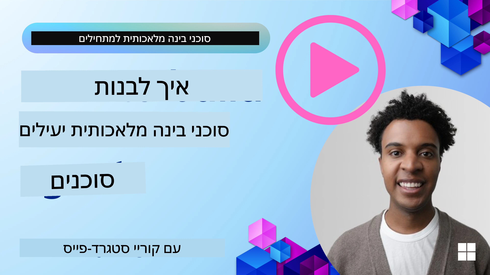
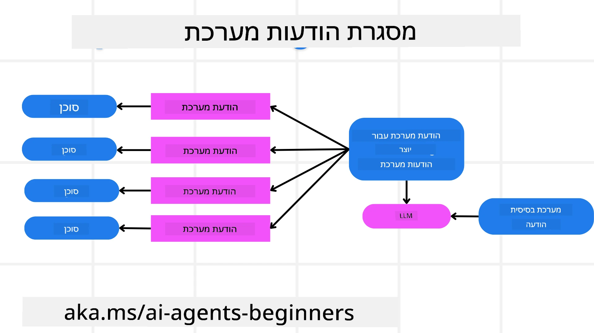
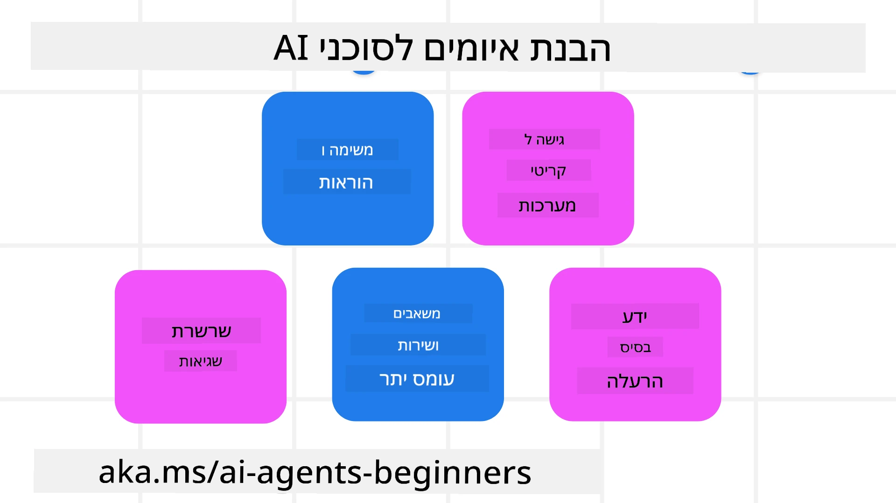
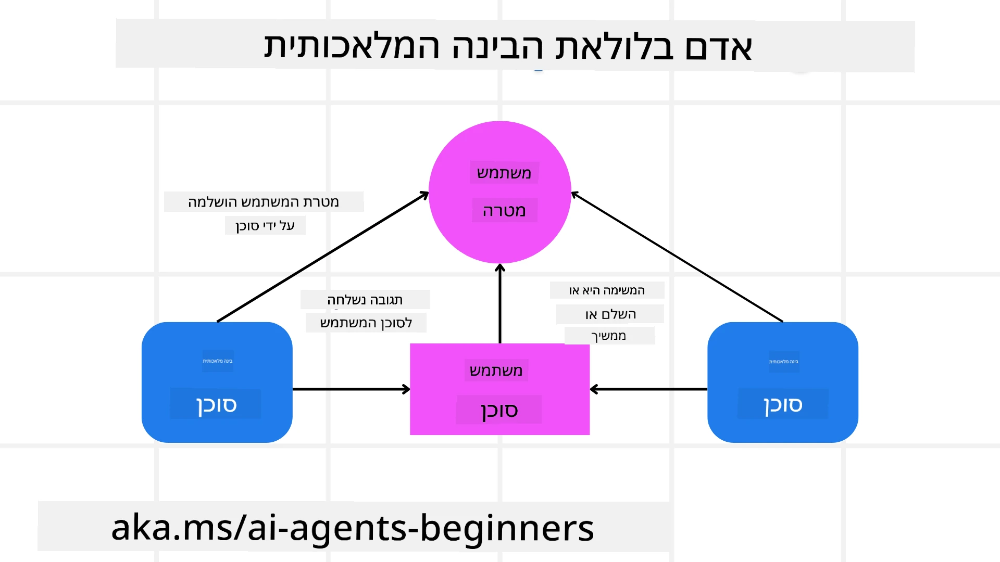

[](https://youtu.be/iZKkMEGBCUQ?si=Q-kEbcyHUMPoHp8L)

> _(לחצו על התמונה למעלה לצפייה בסרטון של השיעור)_

# בניית סוכני בינה מלאכותית אמינים

## מבוא

שיעור זה יכלול:

- איך לבנות ולפרוס סוכני בינה מלאכותית בטוחים ויעילים
- שיקולי אבטחה חשובים בפיתוח סוכני בינה מלאכותית.
- כיצד לשמור על פרטיות הנתונים והמשתמשים בעת פיתוח סוכני בינה מלאכותית.

## מטרות הלמידה

לאחר השלמת שיעור זה, תדעו כיצד:

- לזהות ולהפחית סיכונים ביצירת סוכני בינה מלאכותית.
- ליישם אמצעי אבטחה בכדי לוודא שהנתונים והגישה מנוהלים כראוי.
- ליצור סוכני בינה מלאכותית שמשמרים פרטיות נתונים ומספקים חוויית משתמש איכותית.

## בטיחות

בואו נבחן ראשית בניית יישומים סוכניים בטוחים. בטיחות פירושה שהסוכן מבצע את הפעולה כפי שנועדת. כבוני יישומים סוכניים, יש לנו שיטות וכלים למקסם את הבטיחות:

### בניית מסגרת הודעות מערכת

אם יצרתם אי פעם יישום בינה מלאכותית עם מודלים שפתיים גדולים (LLMs), אתם יודעים כמה חשוב לעצב פקודה או הודעת מערכת חזקה. פקודות אלה קובעות את כללי המטה, ההוראות וההנחיות לאופן שבו ה-LLM יתקשר עם המשתמש והנתונים.

עבור סוכני בינה מלאכותית, הודעת המערכת חשובה אף יותר מכיוון שהסוכנים יצטרכו הוראות מאוד ספציפיות כדי להשלים את המשימות שעיצבתם עבורם.

ליצירת פקודות מערכת שניתנות להרחבה, נוכל להשתמש במסגרת הודעות מערכת לבניית אחד או יותר סוכנים ביישום שלנו:



#### שלב 1: יצירת הודעת מערכת מטא

הפקודה המטא תשמש את ה-LLM כדי ליצור את פקודות המערכת עבור הסוכנים שניצור. אנו מעצבים אותה כתבנית כדי שנוכל ליצור מספר סוכנים ביעילות אם יש צורך.

הנה דוגמה להודעת מערכת מטא שניתן לתת ל-LLM:

```plaintext
You are an expert at creating AI agent assistants. 
You will be provided a company name, role, responsibilities and other
information that you will use to provide a system prompt for.
To create the system prompt, be descriptive as possible and provide a structure that a system using an LLM can better understand the role and responsibilities of the AI assistant. 
```

#### שלב 2: יצירת פקודה בסיסית

השלב הבא הוא ליצור פקודה בסיסית שתתאר את סוכן הבינה המלאכותית. יש לכלול את תפקיד הסוכן, המשימות שהסוכן יבצע, וכל אחריות נוספת של הסוכן.

הנה דוגמה:

```plaintext
You are a travel agent for Contoso Travel that is great at booking flights for customers. To help customers you can perform the following tasks: lookup available flights, book flights, ask for preferences in seating and times for flights, cancel any previously booked flights and alert customers on any delays or cancellations of flights.  
```

#### שלב 3: מתן הודעת מערכת בסיסית ל-LLM

עכשיו נוכל לאופטימיז את הודעת המערכת הזו על ידי מתן הודעת המערכת המטא וההודעה הבסיסית שלנו.

זה יפיק הודעת מערכת שעוצבה טוב יותר להכוונת הסוכנים שלנו:

```markdown
**Company Name:** Contoso Travel  
**Role:** Travel Agent Assistant

**Objective:**  
You are an AI-powered travel agent assistant for Contoso Travel, specializing in booking flights and providing exceptional customer service. Your main goal is to assist customers in finding, booking, and managing their flights, all while ensuring that their preferences and needs are met efficiently.

**Key Responsibilities:**

1. **Flight Lookup:**
    
    - Assist customers in searching for available flights based on their specified destination, dates, and any other relevant preferences.
    - Provide a list of options, including flight times, airlines, layovers, and pricing.
2. **Flight Booking:**
    
    - Facilitate the booking of flights for customers, ensuring that all details are correctly entered into the system.
    - Confirm bookings and provide customers with their itinerary, including confirmation numbers and any other pertinent information.
3. **Customer Preference Inquiry:**
    
    - Actively ask customers for their preferences regarding seating (e.g., aisle, window, extra legroom) and preferred times for flights (e.g., morning, afternoon, evening).
    - Record these preferences for future reference and tailor suggestions accordingly.
4. **Flight Cancellation:**
    
    - Assist customers in canceling previously booked flights if needed, following company policies and procedures.
    - Notify customers of any necessary refunds or additional steps that may be required for cancellations.
5. **Flight Monitoring:**
    
    - Monitor the status of booked flights and alert customers in real-time about any delays, cancellations, or changes to their flight schedule.
    - Provide updates through preferred communication channels (e.g., email, SMS) as needed.

**Tone and Style:**

- Maintain a friendly, professional, and approachable demeanor in all interactions with customers.
- Ensure that all communication is clear, informative, and tailored to the customer's specific needs and inquiries.

**User Interaction Instructions:**

- Respond to customer queries promptly and accurately.
- Use a conversational style while ensuring professionalism.
- Prioritize customer satisfaction by being attentive, empathetic, and proactive in all assistance provided.

**Additional Notes:**

- Stay updated on any changes to airline policies, travel restrictions, and other relevant information that could impact flight bookings and customer experience.
- Use clear and concise language to explain options and processes, avoiding jargon where possible for better customer understanding.

This AI assistant is designed to streamline the flight booking process for customers of Contoso Travel, ensuring that all their travel needs are met efficiently and effectively.

```

#### שלב 4: חזרה ושיפור

הערך של מסגרת הודעות מערכת זו הוא היכולת להרחיב את יצירת הודעות מערכת עבור מספר סוכנים בקלות וכן לשפר את ההודעות שלכם לאורך זמן. נדיר שיהיה לכם הודעת מערכת שעובדת מהפעם הראשונה עבור כל מקרה השימוש. יכולת לבצע התאמות ושיפורים קטנים על ידי שינוי הודעת המערכת הבסיסית והרצתה מחדש תאפשר לכם להשוות ולהעריך את התוצאות.

## הבנת איומים

לבניית סוכני בינה מלאכותית אמינים חשוב להבין ולהפחית את הסיכונים והאיומים על הסוכן. בואו נבחן רק כמה מסוגי האיומים על סוכני בינה מלאכותית ואיך ניתן לתכנן ולהתכונן אליהם טוב יותר.



### משימה והוראות

**תיאור:** תוקפים מנסים לשנות את ההנחיות או המטרות של סוכן הבינה המלאכותית דרך פקודות או מניפולציה של קלטים.

**הפחתה**: בצעו בדיקות אימות ומסנני קלט כדי לזהות פקודות מסוכנות פוטנציאליות לפני שהן מעובדות על ידי הסוכן. מכיוון שהתקפות אלו דורשות בדרך כלל אינטראקציה תכופה עם הסוכן, הגבלת מספר הסבבים בשיחה היא דרך נוספת למנוע סוגים אלו של התקפות.

### גישה למערכות קריטיות

**תיאור:** אם לסוכן הבינה המלאכותית יש גישה למערכות ושירותים ששומרים על נתונים רגישים, תוקפים יכולים לפגוע בתקשורת בין הסוכן לשירותים אלו. אלו יכולים להיות התקפות ישירות או ניסיונות עקיפים לקבל מידע על המערכות דרך הסוכן.

**הפחתה:** סוכני בינה מלאכותית צריכים לקבל גישה למערכות רק על בסיס הצורך כדי למנוע התקפות מסוג זה. התקשורת בין הסוכן למערכת צריכה להיות מאובטחת. יישום אימות ושליטה בגישה היא דרך נוספת להגן על מידע זה.

### עומס יתר על משאבים ושירותים

**תיאור:** לסוכני בינה מלאכותית יש גישה לכלים ושירותים שונים להשלמת משימות. תוקפים יכולים לנצל יכולת זו כדי לתקוף את השירותים על ידי שליחת כמות גבוהה של בקשות דרך הסוכן, מה שעלול להביא לכשל במערכות או לעלויות גבוהות.

**הפחתה:** יש ליישם מדיניות להגבלת מספר הבקשות שסוכן בינה מלאכותית יכול לבצע לשירות. הגבלת מספר סבבי השיחה והבקשות לסוכן היא דרך נוספת למנוע התקפות מסוג זה.

### הרעלת מאגר ידע

**תיאור:** סוג התקפה זה אינו פונה ישירות לסוכן הבינה המלאכותית אלא למאגר הידע ולשירותים אחרים שהסוכן ישתמש בהם. זה יכול לכלול פגיעה בנתונים או במידע שהסוכן ישתמש בו להשלמת משימה, מה שיוביל לתגובות מוטות או בלתי רצויות כלפי המשתמש.

**הפחתה:** בצעו אימות תקופתי של הנתונים שהסוכן ישתמש בהם בזרימות העבודה שלו. ודאו שהגישה לנתונים מאובטחת וששינויים מתבצעים רק על ידי אנשים אמינים כדי למנוע התקפה מסוג זה.

### שגיאות מתדרדרות

**תיאור:** סוכני בינה מלאכותית ניגשים לכלים ושירותים שונים לביצוע משימות. שגיאות שנגרמות על ידי תוקפים יכולות להוביל לכשלים במערכות אחרות שאליהן הסוכן מחובר, דבר שיגרום להתקפה להתפשט ולהקשות על איתור הבעיה.

**הפחתה:** אחת השיטות למנוע זאת היא להפעיל את סוכן הבינה המלאכותית בסביבה מוגבלת, כגון ביצוע משימות במכולת דוקר, כדי למנוע התקפות ישירות על המערכת. יצירת מנגנוני גיבוי ולוגיקת ניסיון חוזר כאשר מערכות מסוימות מגיבות בשגיאה היא דרך נוספת למנוע כשלים רחבים יותר במערכת.

## אדם בלולאה

דרך נוספת ויעילה לבנות מערכות סוכני בינה אמינים היא שימוש באדם בלולאה. זה יוצר תהליך שבו משתמשים יכולים לספק משוב לסוכנים במהלך הריצה. המשתמשים למעשה פועלים כסוכנים במערכת מרובת סוכנים ועל ידי מתן אישור או הפסקה לתהליך הריצה.



הנה קטע קוד המשתמש במסגרת סוכנים של מיקרוסופט להראות כיצד מושג זה מיושם:

```python
import os
from agent_framework.foundry import FoundryChatClient
from azure.identity import AzureCliCredential

# צור את הספק עם אישור של אדם בלולאה
provider = FoundryChatClient(
    project_endpoint=os.environ["AZURE_AI_PROJECT_ENDPOINT"],
    model=os.environ["AZURE_AI_MODEL_DEPLOYMENT_NAME"],
    credential=AzureCliCredential(),
)

# צור את הסוכן עם שלב אישור של אדם
response = provider.create_response(
    input="Write a 4-line poem about the ocean.",
    instructions="You are a helpful assistant. Ask for user approval before finalizing.",
)

# המשתמש יכול לסקור ולאשר את התגובה
print(response.output_text)
user_input = input("Do you approve? (APPROVE/REJECT): ")
if user_input == "APPROVE":
    print("Response approved.")
else:
    print("Response rejected. Revising...")
```

## סיכום

בניית סוכני בינה מלאכותית אמינים דורשת עיצוב מדוקדק, אמצעי אבטחה חזקים וחזרה מתמשכת. באמצעות יישום מערכות מטא מובנות, הבנת איומים פוטנציאליים ויישום אסטרטגיות הפחתה, מפתחים יכולים ליצור סוכני בינה מלאכותית שהם גם בטוחים וגם אפקטיביים. בנוסף, שילוב גישת אדם בלולאה מבטיח שהסוכנים יישארו מיושרים עם צרכי המשתמש תוך צמצום סיכונים. ככל שהבינה המלאכותית ממשיכה להתפתח, שמירה על עמידה יזומה בנושא אבטחה, פרטיות ושיקולים אתיים יהיה המפתח לבניית אמון ואמינות במערכות מונעות בינה מלאכותית.

## דוגמאות קוד

- [`code_samples/06-system-message-framework.ipynb`](code_samples/06-system-message-framework.ipynb): הדגמה שלב אחר שלב של מסגרת הודעות המטא למערכת.
- [`code_samples/06-human-in-the-loop.ipynb`](code_samples/06-human-in-the-loop.ipynb): שערי אישור לפני פעולה, דירוג סיכונים, ויומן ביקורת לסוכנים אמינים.

### יש לכם שאלות נוספות על בניית סוכני בינה אמינים?

הצטרפו ל-[Microsoft Foundry Discord](https://discord.com/invite/ATgtXmAS5D) לפגוש לומדים אחרים, להשתתף בשעות מענה ולקבל תשובות לשאלות על סוכני הבינה המלאכותית שלכם.

## משאבים נוספים

- <a href="https://learn.microsoft.com/azure/ai-studio/responsible-use-of-ai-overview" target="_blank">סקירה על בינה מלאכותית אחראית</a>
- <a href="https://learn.microsoft.com/azure/ai-studio/concepts/evaluation-approach-gen-ai" target="_blank">הערכת מודלים של בינה מלאכותית יצירתית ויישומי בינה מלאכותית</a>
- <a href="https://learn.microsoft.com/azure/ai-services/openai/concepts/system-message?context=%2Fazure%2Fai-studio%2Fcontext%2Fcontext&tabs=top-techniques" target="_blank">הודעות מערכת לבטיחות</a>
- <a href="https://blogs.microsoft.com/wp-content/uploads/prod/sites/5/2022/06/Microsoft-RAI-Impact-Assessment-Template.pdf?culture=en-us&country=us" target="_blank">תבנית הערכת סיכונים</a>

## שיעור קודם

[Agentic RAG](../05-agentic-rag/README.md)

## שיעור הבא

[תבנית עיצוב תכנון](../07-planning-design/README.md)

---

<!-- CO-OP TRANSLATOR DISCLAIMER START -->
**כתב ויתור**:
מסמך זה תורגם באמצעות שירות תרגום אוטומטי [Co-op Translator](https://github.com/Azure/co-op-translator). למרות שאנו שואפים לדיוק, יש לקחת בחשבון שתרגומים אוטומטיים עלולים להכיל שגיאות או אי-דיוקים. יש להחשיב את המסמך המקורי בשפתו הטבעית כמקור הסמכות. למידע קריטי מומלץ להשתמש בתרגום מקצועי על ידי מתרגם אדם. אנו לא אחראים לכל אי-הבנה או פירוש שגוי הנובע מהשימוש בתרגום זה.
<!-- CO-OP TRANSLATOR DISCLAIMER END -->